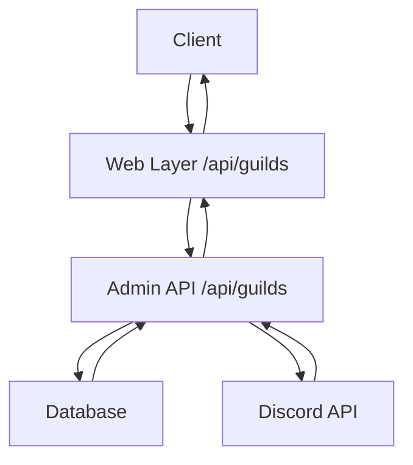
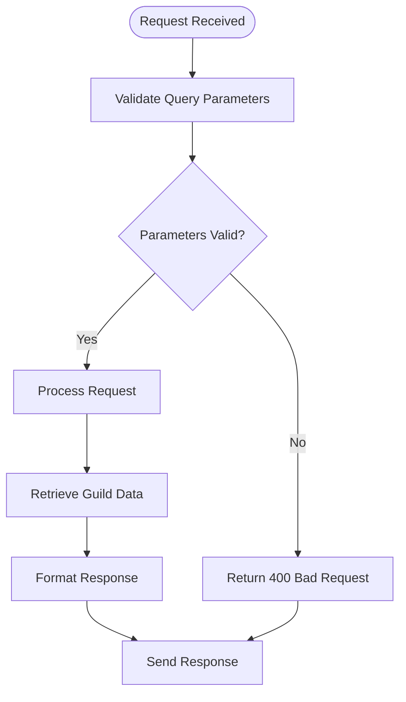
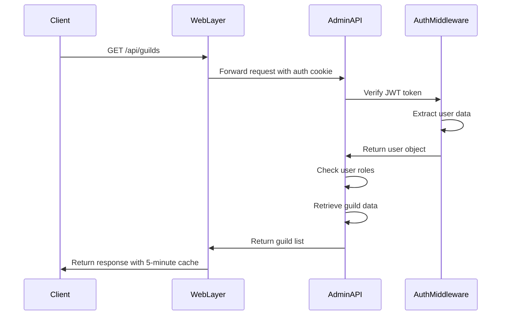
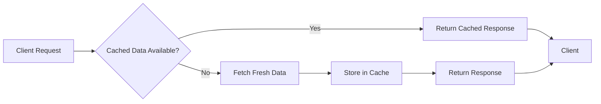
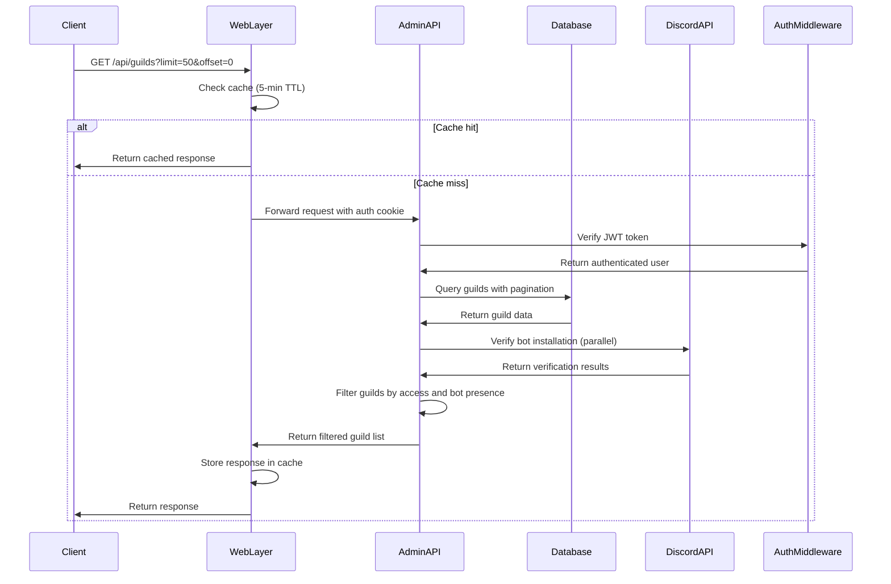

# List Guilds Endpoint

<cite>
**Referenced Files in This Document**   
- [guilds.js](file://apps/admin-api/src/routes/guilds.js)
- [guild.service.ts](file://apps/admin-api/src/services/guild.service.ts)
- [auth.js](file://apps/admin-api/src/middleware/auth.js)
- [rbac.js](file://apps/admin-api/src/middleware/rbac.js)
- [schemas.js](file://apps/admin-api/src/lib/validation/schemas.js)
- [route.ts](file://apps/web/app/api/guilds/route.ts)
- [rate-limit.js](file://apps/admin-api/src/middleware/rate-limit.js)
</cite>

## Table of Contents
1. [Introduction](#introduction)
2. [Endpoint Overview](#endpoint-overview)
3. [Query Parameters](#query-parameters)
4. [Response Structure](#response-structure)
5. [Authentication and Authorization](#authentication-and-authorization)
6. [Discord Integration](#discord-integration)
7. [Example Requests and Responses](#example-requests-and-responses)
8. [Error Cases](#error-cases)
9. [Performance Considerations](#performance-considerations)
10. [Sequence Diagram](#sequence-diagram)

## Introduction
The GET /api/guilds endpoint provides a comprehensive listing of Discord guilds where the authenticated user has access and the bot is installed. This documentation details the complete functionality of the endpoint, including query parameters, response structure, authentication flow, and integration with Discord's API.

**Section sources**
- [guilds.js](file://apps/admin-api/src/routes/guilds.js#L90-L92)

## Endpoint Overview
The GET /api/guilds endpoint returns a paginated list of guilds accessible to the authenticated user. The endpoint is designed to efficiently retrieve guild information while verifying bot installation status and user permissions.

The implementation consists of two layers:
1. Web layer (Next.js) at `/api/guilds` that handles caching and forwards requests
2. Admin API layer that performs authentication and data retrieval



**Diagram sources**
- [route.ts](file://apps/web/app/api/guilds/route.ts#L12-L52)
- [guilds.js](file://apps/admin-api/src/routes/guilds.js#L90-L92)

**Section sources**
- [route.ts](file://apps/web/app/api/guilds/route.ts#L12-L52)
- [guilds.js](file://apps/admin-api/src/routes/guilds.js#L90-L92)

## Query Parameters
The endpoint supports several query parameters for filtering and pagination:

| Parameter | Type | Required | Default | Description | Validation Rules |
|---------|------|--------|--------|-----------|----------------|
| limit | number | No | 50 | Number of guilds to return per page | Must be a positive integer, maximum 200 |
| offset | number | No | 0 | Number of guilds to skip for pagination | Must be a positive integer or zero |
| search | string | No | None | Search term to filter guilds by name | Maximum 100 characters, case-insensitive |
| includeMembers | string | No | "false" | Whether to include member details in the response | Must be "true" or "false" |

The validation is implemented using Zod schemas in the validation middleware, ensuring all parameters meet the specified requirements before processing.



**Diagram sources**
- [schemas.js](file://apps/admin-api/src/lib/validation/schemas.js#L91-L96)
- [guild.service.ts](file://apps/admin-api/src/services/guild.service.ts#L113-L118)

**Section sources**
- [schemas.js](file://apps/admin-api/src/lib/validation/schemas.js#L91-L96)
- [guild.service.ts](file://apps/admin-api/src/services/guild.service.ts#L113-L118)

## Response Structure
The endpoint returns a JSON response with paginated guild data:

```json
{
  "guilds": [
    {
      "id": "string",
      "discordId": "string",
      "name": "string",
      "settings": "object",
      "memberCount": "number",
      "messageCount": "number",
      "createdAt": "string",
      "updatedAt": "string"
    }
  ],
  "pagination": {
    "total": "number",
    "limit": "number",
    "offset": "number",
    "hasMore": "boolean"
  }
}
```

The response includes:
- **guilds**: Array of guild objects with core information
- **pagination**: Object containing pagination metadata

Each guild object contains:
- **id**: Internal database ID
- **discordId**: Discord guild ID (snowflake)
- **name**: Guild name
- **settings**: Guild-specific settings object
- **memberCount**: Number of members in the guild
- **messageCount**: Number of chat messages in the guild
- **createdAt**: Timestamp of guild creation
- **updatedAt**: Timestamp of last update

When `includeMembers=true`, each guild object also includes a `members` array with user details.

**Section sources**
- [guild.service.ts](file://apps/admin-api/src/services/guild.service.ts#L568-L584)

## Authentication and Authorization
The endpoint implements a robust authentication and authorization system using JWT and role-based access control.

### Authentication Flow
The authentication process follows these steps:
1. The client sends a request with a JWT token in the `slimy_admin` cookie
2. The `requireAuth` middleware validates the token
3. User information is extracted from the token payload
4. The request proceeds if authentication is successful

### Role-Based Access Control
The system implements role-based access control through the RBAC middleware. The authorization process:
1. Verifies the user is authenticated
2. Checks if the user has the required role for the requested action
3. Denies access with a 403 status if insufficient privileges

The role hierarchy includes:
- **member**: Basic access
- **club**: Enhanced access
- **admin**: Full administrative privileges



**Diagram sources**
- [auth.js](file://apps/admin-api/src/middleware/auth.js#L154-L159)
- [rbac.js](file://apps/admin-api/src/middleware/rbac.js#L5-L11)

**Section sources**
- [auth.js](file://apps/admin-api/src/middleware/auth.js#L154-L159)
- [rbac.js](file://apps/admin-api/src/middleware/rbac.js#L5-L11)

## Discord Integration
The endpoint integrates with Discord's API to verify bot presence and user permissions. When listing guilds, the system:

1. Retrieves the user's guilds from the session store
2. For each guild, checks if the bot is installed
3. Verifies the user has the necessary permissions
4. Returns only guilds where both conditions are met

The integration uses Discord's OAuth2 scopes (identify + guilds) to access guild information. Bot installation status is verified by checking the guild's application commands and bot user presence.

The system optimizes performance by performing these checks in parallel using `Promise.all()`, significantly reducing response time compared to sequential processing.

**Section sources**
- [guilds.js](file://apps/admin-api/src/routes/guilds.js#L90-L92)
- [README.md](file://apps/admin-api/README.md#L190-L194)

## Example Requests and Responses
### Example 1: Basic Request
**Request:**
```
GET /api/guilds HTTP/1.1
Cookie: slimy_admin=jwt_token_here
```

**Response:**
```json
{
  "guilds": [
    {
      "id": "guild-123",
      "discordId": "1176605506912141444",
      "name": "Slimy Community",
      "settings": {},
      "memberCount": 150,
      "messageCount": 2500,
      "createdAt": "2023-01-15T10:30:00.000Z",
      "updatedAt": "2023-10-25T14:20:00.000Z"
    }
  ],
  "pagination": {
    "total": 1,
    "limit": 50,
    "offset": 0,
    "hasMore": false
  }
}
```

### Example 2: Paginated Request with Search
**Request:**
```
GET /api/guilds?limit=10&offset=0&search=community HTTP/1.1
Cookie: slimy_admin=jwt_token_here
```

**Response:**
```json
{
  "guilds": [
    {
      "id": "guild-123",
      "discordId": "1176605506912141444",
      "name": "Slimy Community",
      "settings": {},
      "memberCount": 150,
      "messageCount": 2500,
      "createdAt": "2023-01-15T10:30:00.000Z",
      "updatedAt": "2023-10-25T14:20:00.000Z"
    }
  ],
  "pagination": {
    "total": 1,
    "limit": 10,
    "offset": 0,
    "hasMore": false
  }
}
```

### Example 3: Request with Member Inclusion
**Request:**
```
GET /api/guilds?includeMembers=true HTTP/1.1
Cookie: slimy_admin=jwt_token_here
```

**Response:**
```json
{
  "guilds": [
    {
      "id": "guild-123",
      "discordId": "1176605506912141444",
      "name": "Slimy Community",
      "settings": {},
      "memberCount": 150,
      "messageCount": 2500,
      "createdAt": "2023-01-15T10:30:00.000Z",
      "updatedAt": "2023-10-25T14:20:00.000Z",
      "members": [
        {
          "userId": "user-456",
          "discordId": "987654321098765432",
          "username": "JohnDoe",
          "globalName": "John Doe",
          "avatar": null,
          "roles": ["admin"],
          "joinedAt": "2023-01-15T10:30:00.000Z",
          "userCreatedAt": "2022-12-01T08:15:00.000Z"
        }
      ]
    }
  ],
  "pagination": {
    "total": 1,
    "limit": 50,
    "offset": 0,
    "hasMore": false
  }
}
```

**Section sources**
- [route.ts](file://apps/web/app/api/guilds/route.ts#L12-L52)
- [guilds.js](file://apps/admin-api/src/routes/guilds.js#L90-L92)

## Error Cases
The endpoint handles various error conditions with appropriate HTTP status codes:

| Error Case | HTTP Status | Response Body | Cause |
|-----------|------------|---------------|-------|
| Unauthorized Access | 401 | `{ "ok": false, "code": "UNAUTHORIZED", "message": "Authentication required" }` | Missing or invalid JWT token |
| Invalid Pagination Parameters | 400 | `{ "error": "Validation failed", "details": [...] }` | Invalid limit, offset, or other parameters |
| Server Error | 500 | `{ "error": "Failed to fetch guilds", "code": "FETCH_ERROR" }` | Backend service failure or database error |
| Rate Limit Exceeded | 429 | `{ "error": "rate-limit" }` | Too many requests from the same user |

Common validation errors include:
- Limit exceeding maximum of 200
- Negative offset values
- Search term longer than 100 characters
- Invalid includeMembers parameter (not "true" or "false")

**Section sources**
- [auth.js](file://apps/admin-api/src/middleware/auth.js#L138-L144)
- [schemas.js](file://apps/admin-api/src/lib/validation/schemas.js#L91-L96)
- [route.ts](file://apps/web/app/api/guilds/route.ts#L40-L50)

## Performance Considerations
The endpoint incorporates several performance optimizations:

### Caching Strategy
The web layer implements a 5-minute (300,000ms) cache for guild list responses using the `useCache` parameter in API calls. This reduces database load and improves response times for frequently accessed data.



**Diagram sources**
- [route.ts](file://apps/web/app/api/guilds/route.ts#L30-L31)

### Rate Limiting
The endpoint is protected by rate limiting middleware that:
- Limits requests based on user ID or IP address
- Uses a sliding window algorithm
- Prevents abuse and ensures fair usage
- Returns 429 status when limits are exceeded

The rate limiter uses a composite key of `userId:guildId` to provide granular control over request rates.

### Parallel Processing
For improved performance, the system processes guild checks in parallel rather than sequentially. This optimization reduces response time from 10-20 seconds to 1-2 seconds when handling multiple guilds.

**Section sources**
- [route.ts](file://apps/web/app/api/guilds/route.ts#L30-L31)
- [rate-limit.js](file://apps/admin-api/src/middleware/rate-limit.js#L7-L22)
- [README.md](file://apps/admin-api/README.md#L190-L194)

## Sequence Diagram


**Diagram sources**
- [route.ts](file://apps/web/app/api/guilds/route.ts#L12-L52)
- [guilds.js](file://apps/admin-api/src/routes/guilds.js#L90-L92)
- [guild.service.ts](file://apps/admin-api/src/services/guild.service.ts#L112-L174)

**Section sources**
- [route.ts](file://apps/web/app/api/guilds/route.ts#L12-L52)
- [guilds.js](file://apps/admin-api/src/routes/guilds.js#L90-L92)
- [guild.service.ts](file://apps/admin-api/src/services/guild.service.ts#L112-L174)