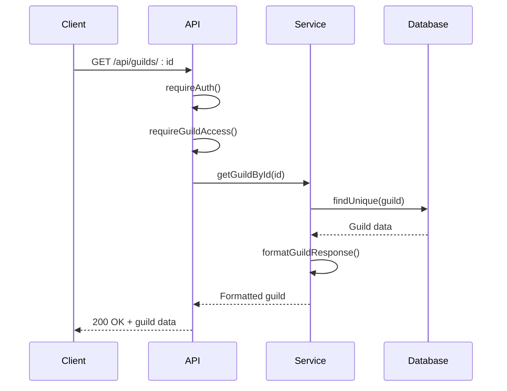
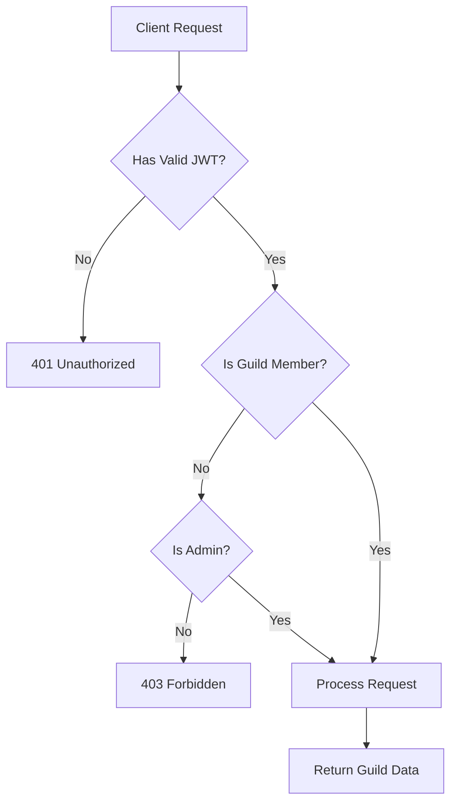
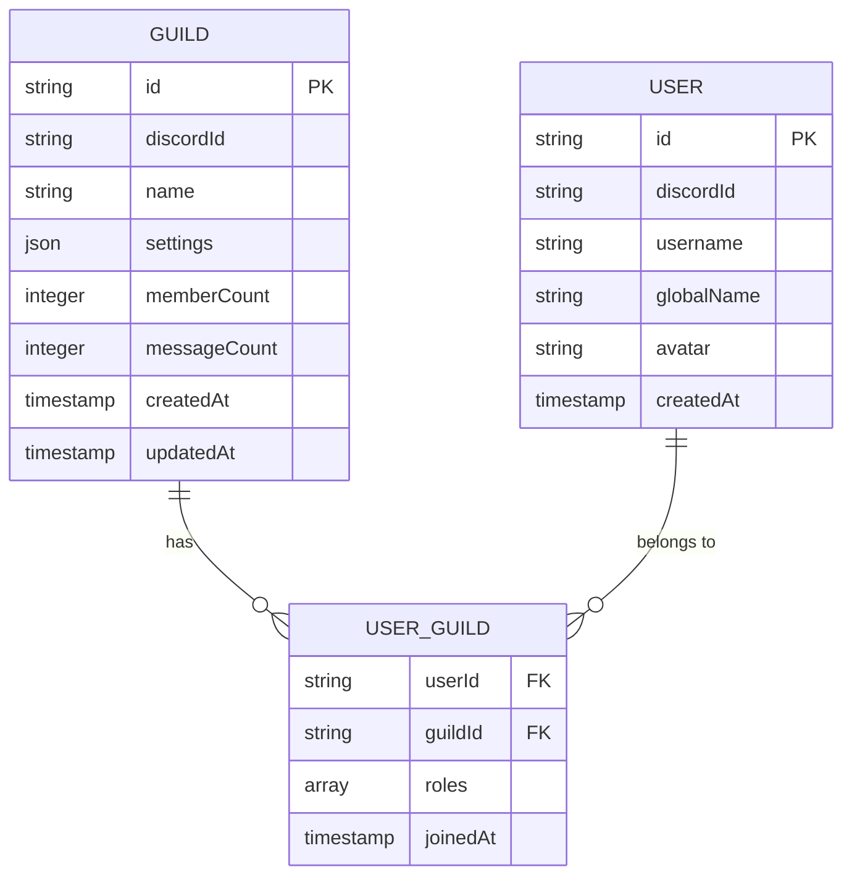
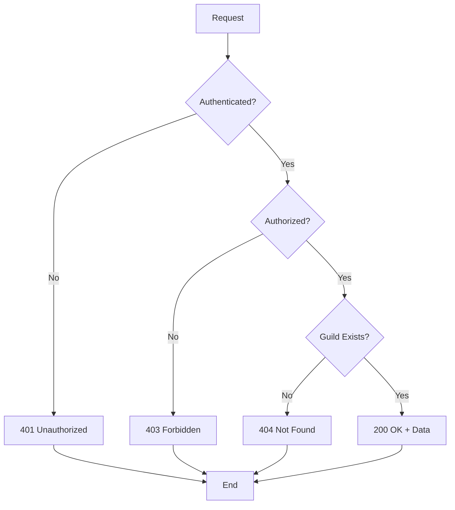
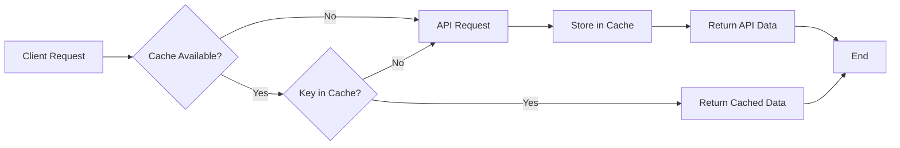

# Retrieve Guild Endpoint

<cite>
**Referenced Files in This Document**   
- [guilds.js](file://apps/admin-api/src/routes/guilds.js)
- [guild.service.ts](file://apps/admin-api/src/services/guild.service.ts)
- [auth.js](file://apps/admin-api/src/middleware/auth.js)
- [rbac.js](file://apps/admin-api/src/middleware/rbac.js)
- [schemas.js](file://apps/admin-api/src/lib/validation/schemas.js)
- [redis.ts](file://apps/web/lib/cache/redis.ts)
- [rate-limit.js](file://apps/admin-api/src/middleware/rate-limit.js)
- [oauth.js](file://apps/admin-api/src/services/oauth.js)
</cite>

## Table of Contents
1. [Introduction](#introduction)
2. [Endpoint Overview](#endpoint-overview)
3. [Authentication and Authorization](#authentication-and-authorization)
4. [Path Parameter Validation](#path-parameter-validation)
5. [Response Schema](#response-schema)
6. [Error Handling](#error-handling)
7. [Discord Integration](#discord-integration)
8. [Caching Strategy](#caching-strategy)
9. [Rate Limiting](#rate-limiting)
10. [Example Requests and Responses](#example-requests-and-responses)
11. [Performance Considerations](#performance-considerations)

## Introduction

The GET /api/guilds/:id endpoint provides comprehensive information about a specific guild within the system. This documentation details the endpoint's functionality, including authentication requirements, parameter validation, response structure, error handling, and integration with external services. The endpoint serves as a central point for retrieving guild metadata, member information, configuration settings, and related data for administrative and user interfaces.

**Section sources**
- [guilds.js](file://apps/admin-api/src/routes/guilds.js#L94-L96)
- [guild.service.ts](file://apps/admin-api/src/services/guild.service.ts#L38-L70)

## Endpoint Overview

The GET /api/guilds/:id endpoint retrieves detailed information about a specific guild identified by its unique ID. The endpoint is part of the admin-api service and is accessible through the routes defined in the guilds.js file. When a GET request is made to this endpoint, it triggers a series of operations that validate the user's authentication and authorization, retrieve the guild data from the database, and format the response with relevant information.

The endpoint supports optional query parameters to control the response content, particularly whether to include member details. By default, member information is included in the response, but clients can explicitly exclude it by setting the includeMembers parameter to false. This flexibility allows clients to optimize bandwidth usage based on their specific needs.

The implementation follows a layered architecture where the route handler delegates to a service layer (GuildService) that encapsulates the business logic for retrieving and formatting guild data. This separation of concerns ensures that the endpoint remains focused on request handling and response formatting while the service layer manages data access and business rules.



**Diagram sources**
- [guilds.js](file://apps/admin-api/src/routes/guilds.js#L94-L96)
- [guild.service.ts](file://apps/admin-api/src/services/guild.service.ts#L38-L70)

**Section sources**
- [guilds.js](file://apps/admin-api/src/routes/guilds.js#L94-L96)
- [guild.service.ts](file://apps/admin-api/src/services/guild.service.ts#L38-L70)

## Authentication and Authorization

The GET /api/guilds/:id endpoint requires authentication using JWT (JSON Web Tokens) and implements role-based access control (RBAC) to ensure that users have sufficient permissions to access the requested guild information. The authentication process is handled by the requireAuth middleware, which validates the JWT token provided in the request cookies. The middleware checks for the presence of valid authentication tokens in multiple cookie names, providing backward compatibility and flexibility in authentication mechanisms.

Authorization is enforced through the requireGuildAccess middleware, which verifies that the authenticated user has access to the requested guild. This middleware checks the user's guild membership by examining the user object attached to the request during authentication. The user object contains a list of guilds that the user is a member of, and the middleware confirms that the requested guild ID exists in this list. If the user is an admin, they are granted access to all guilds regardless of membership.

The RBAC system implements a hierarchical role model where different roles have varying levels of access to guild resources. The role hierarchy is defined in the GuildService class, with roles such as 'admin', 'owner', 'moderator', and 'member' having progressively more limited permissions. For the GET /api/guilds/:id endpoint, users need at least 'member' level access to view guild information, as this operation falls under the 'view_members' action in the role hierarchy.



**Diagram sources**
- [auth.js](file://apps/admin-api/src/middleware/auth.js#L154-L160)
- [rbac.js](file://apps/admin-api/src/middleware/rbac.js#L14-L29)
- [guild.service.ts](file://apps/admin-api/src/services/guild.service.ts#L528-L563)

**Section sources**
- [auth.js](file://apps/admin-api/src/middleware/auth.js#L154-L160)
- [rbac.js](file://apps/admin-api/src/middleware/rbac.js#L14-L29)
- [guild.service.ts](file://apps/admin-api/src/services/guild.service.ts#L528-L563)

## Path Parameter Validation

The :id path parameter in the GET /api/guilds/:id endpoint is validated to ensure it conforms to the expected format and represents an existing guild. The validation process occurs at multiple levels, starting with the route definition and extending to the service layer. The parameter is expected to be a string that corresponds to a valid guild identifier in the system.

In the service layer, the getGuildById method performs the primary validation by attempting to retrieve the guild from the database using the provided ID. If no guild is found with the specified ID, the method throws an "Guild not found" error, which is then translated into a 404 Not Found HTTP response by the error handling middleware. This database-level validation ensures that only existing guilds can be accessed through the endpoint.

The validation process also includes type checking to confirm that the ID parameter is a string. While the route parameter is inherently a string due to the URL path structure, additional validation is performed in the service layer to ensure data integrity. This multi-layered approach to validation provides robust protection against invalid or malicious requests while maintaining flexibility for different ID formats.

**Section sources**
- [guild.service.ts](file://apps/admin-api/src/services/guild.service.ts#L38-L67)

## Response Schema

The response from the GET /api/guilds/:id endpoint includes comprehensive information about the requested guild, structured in a consistent JSON format. The response contains the guild's basic metadata, configuration settings, member information, and statistical data. The exact content of the response depends on the includeMembers query parameter, which controls whether detailed member information is included.

The core response schema includes the following fields:
- id: The unique identifier of the guild
- discordId: The Discord snowflake ID of the guild
- name: The display name of the guild
- settings: An object containing the guild's configuration settings
- memberCount: The total number of members in the guild
- messageCount: The total number of chat messages in the guild
- createdAt: The timestamp when the guild was created
- updatedAt: The timestamp when the guild was last updated

When includeMembers is true (the default), the response also includes a members array containing detailed information about each guild member. Each member object includes the user's ID, Discord ID, username, global name, avatar, roles within the guild, join date, and account creation date. This comprehensive member data enables client applications to display rich user interfaces with complete guild membership information.



**Diagram sources**
- [guild.service.ts](file://apps/admin-api/src/services/guild.service.ts#L568-L602)

**Section sources**
- [guild.service.ts](file://apps/admin-api/src/services/guild.service.ts#L568-L602)

## Error Handling

The GET /api/guilds/:id endpoint implements comprehensive error handling to provide meaningful feedback for various failure scenarios. The error handling strategy follows a layered approach, with validation errors, authorization failures, and data access issues handled appropriately at different levels of the application stack.

For authentication failures, the endpoint returns a 401 Unauthorized status code with a JSON response indicating that authentication is required. This occurs when the request lacks a valid JWT token or when the provided token cannot be verified. The response includes a standardized error structure with an "ok" flag set to false, an error code of "UNAUTHORIZED", and a descriptive message.

Authorization failures result in a 403 Forbidden status code, indicating that the authenticated user does not have sufficient permissions to access the requested guild. This occurs when the user is not a member of the guild and is not an administrator. The response includes an error code of "FORBIDDEN" and a message explaining the insufficient role or access rights.

When the requested guild ID does not correspond to an existing guild, the endpoint returns a 404 Not Found status code. This indicates that the resource does not exist in the system. The error handling in the GuildService layer specifically checks for this condition and throws an appropriate error that is then translated into the HTTP response.



**Diagram sources**
- [auth.js](file://apps/admin-api/src/middleware/auth.js#L138-L152)
- [rbac.js](file://apps/admin-api/src/middleware/rbac.js#L18-L25)
- [guild.service.ts](file://apps/admin-api/src/services/guild.service.ts#L65-L67)

**Section sources**
- [auth.js](file://apps/admin-api/src/middleware/auth.js#L138-L152)
- [rbac.js](file://apps/admin-api/src/middleware/rbac.js#L18-L25)
- [guild.service.ts](file://apps/admin-api/src/services/guild.service.ts#L65-L67)

## Discord Integration

The GET /api/guilds/:id endpoint integrates with Discord services to ensure that guild and member data is synchronized with the actual state on Discord. This integration is primarily handled through the OAuth service and database synchronization mechanisms that maintain up-to-date information about guild membership and user profiles.

When guild data is retrieved, the system ensures that member information reflects the current state on Discord by periodically synchronizing user data through background processes. The member objects in the response include Discord-specific fields such as discordId, username, globalName, and avatar, which are maintained through this synchronization process. This ensures that client applications display accurate and current user information.

The integration also supports status verification by checking the validity of user accounts and their membership in the guild. When a user's information is retrieved, the system can verify their current status on Discord, including whether they are still members of the guild and whether their account is active. This real-time verification helps maintain data integrity and prevents stale or inaccurate information from being presented to users.

The synchronization process is designed to balance data freshness with performance considerations. Rather than making real-time API calls to Discord for every request, the system maintains a cached representation of guild data that is updated periodically through background jobs. This approach reduces latency for client requests while ensuring that data remains reasonably current.

**Section sources**
- [oauth.js](file://apps/admin-api/src/services/oauth.js)
- [guild.service.ts](file://apps/admin-api/src/services/guild.service.ts#L248-L369)

## Caching Strategy

The frontend application implements a caching strategy to optimize performance and reduce server load when accessing guild data through the GET /api/guilds/:id endpoint. The caching is handled by the RedisCache class in the web application, which provides a distributed caching layer with configurable time-to-live (TTL) settings.

The cache is configured with a default TTL of 300 seconds (5 minutes) and a stale TTL of 600 seconds (10 minutes), allowing for efficient data retrieval while ensuring that information remains reasonably current. The cache uses a key prefix of "slimy:" to organize cached data and prevent key collisions. When a request is made for guild data, the system first checks the cache before making a request to the backend API.

The caching implementation includes retry logic to handle temporary Redis connection issues, with up to three retry attempts and a delay of 1 second between attempts. This ensures resilience in the face of transient network problems or Redis server restarts. The cache also provides health monitoring and statistics through the getStats method, allowing administrators to monitor cache performance and usage.

Cache keys for guild data are generated using the CacheUtils.guildKey method, which creates a consistent key format based on the guild ID and data type. This standardized key generation enables efficient cache invalidation and management. The system supports both individual key deletion and pattern-based invalidation, allowing for targeted cache clearing when guild data is updated.



**Diagram sources**
- [redis.ts](file://apps/web/lib/cache/redis.ts#L42-L381)

**Section sources**
- [redis.ts](file://apps/web/lib/cache/redis.ts#L42-L381)

## Rate Limiting

The GET /api/guilds/:id endpoint is protected by rate limiting policies to prevent abuse and ensure fair usage of system resources. The rate limiting is implemented through the rate-limit.js middleware, which tracks request rates for individual clients and enforces limits based on configurable thresholds.

The rate limiting system uses a sliding window algorithm to track requests over time, providing more accurate rate enforcement than simple fixed windows. This approach prevents bursts of requests at window boundaries and provides smoother rate limiting behavior. The middleware integrates with Redis to store rate limit counters, enabling distributed rate limiting across multiple server instances.

Rate limits are configured based on the client's authentication status and role. Unauthenticated clients are subject to stricter limits to prevent scraping and denial-of-service attacks, while authenticated users and administrators have higher limits that reflect their legitimate usage patterns. The system also considers the specific endpoint being accessed, with more resource-intensive endpoints having lower rate limits.

When a client exceeds the rate limit, the endpoint returns a 429 Too Many Requests status code with a JSON response that includes information about the rate limit and when it will reset. This allows client applications to implement appropriate backoff strategies and retry logic. The rate limiting headers also provide information about the current rate limit status, helping clients manage their request patterns effectively.

**Section sources**
- [rate-limit.js](file://apps/admin-api/src/middleware/rate-limit.js)

## Example Requests and Responses

This section provides example requests and responses for the GET /api/guilds/:id endpoint, demonstrating both successful retrieval and error scenarios. These examples illustrate the expected request format, response structure, and error handling behavior.

Example 1: Successful retrieval of guild information
```
GET /api/guilds/1176605506912141444 HTTP/1.1
Authorization: Bearer <valid-jwt-token>
Cookie: slimy_admin=<valid-session-token>

HTTP/1.1 200 OK
Content-Type: application/json

{
  "id": "1176605506912141444",
  "discordId": "1176605506912141444",
  "name": "Example Guild",
  "settings": {
    "sheetUrl": "https://docs.google.com/spreadsheets/d/abc123",
    "weekWindowDays": 7
  },
  "memberCount": 42,
  "messageCount": 1567,
  "createdAt": "2023-11-06T00:00:00.000Z",
  "updatedAt": "2024-01-15T10:30:00.000Z",
  "members": [
    {
      "userId": "user-123",
      "discordId": "123456789012345678",
      "username": "exampleuser",
      "globalName": "Example User",
      "avatar": "https://cdn.discordapp.com/avatars/123456789012345678/abc123.png",
      "roles": ["member"],
      "joinedAt": "2023-11-06T00:00:00.000Z",
      "userCreatedAt": "2023-10-01T00:00:00.000Z"
    }
  ]
}
```

Example 2: 403 Forbidden response for unauthorized access
```
GET /api/guilds/1176605506912141444 HTTP/1.1
Authorization: Bearer <valid-jwt-token>
Cookie: slimy_admin=<valid-session-token>

HTTP/1.1 403 Forbidden
Content-Type: application/json

{
  "ok": false,
  "code": "FORBIDDEN",
  "message": "Insufficient role"
}
```

Example 3: 404 Not Found response for non-existent guild
```
GET /api/guilds/nonexistent HTTP/1.1
Authorization: Bearer <valid-jwt-token>
Cookie: slimy_admin=<valid-session-token>

HTTP/1.1 404 Not Found
Content-Type: application/json

{
  "error": "Guild not found"
}
```

**Section sources**
- [guilds.js](file://apps/admin-api/src/routes/guilds.js#L94-L96)
- [auth.js](file://apps/admin-api/src/middleware/auth.js#L146-L152)
- [guild.service.ts](file://apps/admin-api/src/services/guild.service.ts#L65-L67)

## Performance Considerations

The GET /api/guilds/:id endpoint is designed with performance considerations in mind, particularly regarding latency when syncing with external Discord services. The endpoint balances the need for up-to-date information with the requirement for responsive user interfaces by implementing a multi-layered caching strategy and asynchronous data synchronization.

One of the primary performance challenges is the potential latency when retrieving real-time member data from Discord. To mitigate this, the system uses background synchronization jobs that periodically update member information in the database, rather than making real-time API calls for each request. This approach ensures that the endpoint can serve requests quickly from the local database while maintaining reasonably current data.

The endpoint also supports the includeMembers query parameter, allowing clients to request only the core guild information without member details when they are not needed. This optimization reduces response size and database query complexity, improving performance for use cases that only require basic guild metadata.

Rate limiting and caching work together to prevent server overload and reduce the impact of high request volumes. The Redis-based caching layer significantly reduces database load by serving frequently requested data from memory, while rate limiting prevents abusive usage patterns that could degrade performance for legitimate users.

**Section sources**
- [guild.service.ts](file://apps/admin-api/src/services/guild.service.ts#L38-L70)
- [redis.ts](file://apps/web/lib/cache/redis.ts#L42-L381)
- [rate-limit.js](file://apps/admin-api/src/middleware/rate-limit.js)