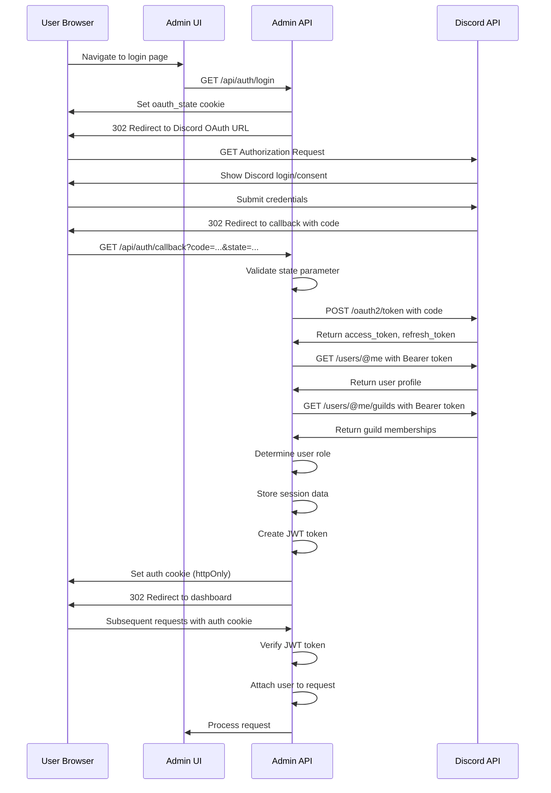

# Authentication Flow

<cite>
**Referenced Files in This Document**   
- [auth.js](file://apps/admin-api/src/routes/auth.js)
- [auth.js](file://apps/admin-api/src/middleware/auth.js)
- [oauth.js](file://apps/admin-api/src/services/oauth.js)
- [jwt.js](file://apps/admin-api/lib/jwt.js)
- [token.js](file://apps/admin-api/src/services/token.js)
- [session-store.js](file://apps/admin-api/lib/session-store.js)
- [rbac.js](file://apps/admin-api/src/services/rbac.js)
- [rbac.js](file://apps/admin-api/src/middleware/rbac.js)
- [roles.js](file://apps/admin-api/src/lib/roles.js)
- [session.js](file://apps/admin-ui/lib/session.js)
- [csrf.js](file://apps/admin-api/src/middleware/csrf.js)
- [index.ts](file://apps/web/lib/auth/index.ts)
</cite>

## Table of Contents
1. [Introduction](#introduction)
2. [OAuth2 Authorization Code Flow](#oauth2-authorization-code-flow)
3. [JWT Token Management](#jwt-token-management)
4. [Session Management](#session-management)
5. [Role-Based Access Control](#role-based-access-control)
6. [Security Considerations](#security-considerations)
7. [Error Handling](#error-handling)
8. [Authentication Sequence Diagram](#authentication-sequence-diagram)

## Introduction
This document details the authentication flow for the Slimy application, which uses Discord OAuth2 for user authentication and JWT tokens for session management. The system implements a secure authorization code flow with state validation, JWT-based session tokens stored in httpOnly cookies, and role-based access control. The authentication process includes CSRF protection, token expiration handling, and proper error management for various edge cases.

## OAuth2 Authorization Code Flow

The authentication flow begins with the Discord OAuth2 authorization code flow, which securely authenticates users through their Discord accounts. The process follows the standard OAuth2 authorization code grant type with additional security measures.

When a user initiates login, the system generates a cryptographically secure state parameter containing a nonce and timestamp, which is stored in an httpOnly cookie to prevent CSRF attacks. The user is then redirected to Discord's authorization endpoint with the client ID, redirect URI, requested scopes, and the state parameter.

Upon successful authorization, Discord redirects back to the application's callback endpoint with an authorization code and the state parameter. The application validates that the returned state matches the stored nonce before proceeding. It then exchanges the authorization code for access and refresh tokens by making a server-side request to Discord's token endpoint with the client credentials.

After obtaining the tokens, the application fetches the user's profile and guild membership information from Discord's API. This information is used to determine the user's role and permissions within the application.

**Section sources**
- [auth.js](file://apps/admin-api/src/routes/auth.js#L108-L119)
- [oauth.js](file://apps/admin-api/src/services/oauth.js#L8-L17)
- [oauth.js](file://apps/admin-api/src/services/oauth.js#L20-L47)

## JWT Token Management

The application uses JSON Web Tokens (JWT) for session management, with tokens signed using the HS256 algorithm. The JWT contains the user's information including ID, username, avatar, role, and guild memberships.

The token signing process uses a secret key configured through environment variables (JWT_SECRET, SESSION_SECRET) or a fallback development secret. The system validates that the secret is at least 32 characters long for security. Tokens are issued with a configurable expiration time, defaulting to 12 hours.

When creating a session, the system generates a signed JWT containing the user payload and sets it in an httpOnly cookie. The token verification process checks the signature and expiration before granting access to protected resources. The middleware supports multiple cookie names for backward compatibility and handles token verification failures gracefully.

**Section sources**
- [jwt.js](file://apps/admin-api/lib/jwt.js#L45-L54)
- [token.js](file://apps/admin-api/src/services/token.js#L29-L33)
- [jwt.js](file://apps/admin-api/lib/jwt.js#L64-L72)

## Session Management

Session management is implemented using httpOnly cookies with proper security settings to prevent XSS attacks. The authentication cookie is configured with the following security attributes:
- httpOnly: true (prevents client-side JavaScript access)
- secure: true in production (requires HTTPS)
- sameSite: "lax" (protects against CSRF attacks)
- domain: configured for the application domain (e.g., .slimyai.xyz)

The system maintains session data in two places: the JWT token itself and a server-side session store. The JWT contains the primary user information, while the session store (implemented with database persistence) maintains additional session data including the Discord access token, refresh token, and enriched guild information.

Session cleanup is handled automatically with a periodic task that removes expired sessions from the database every hour. When a user logs out, the system clears both the server-side session data and the authentication cookie.

**Section sources**
- [jwt.js](file://apps/admin-api/lib/jwt.js#L56-L72)
- [session-store.js](file://apps/admin-api/lib/session-store.js#L8-L16)
- [auth.js](file://apps/admin-api/src/routes/auth.js#L392-L398)

## Role-Based Access Control

The application implements a role-based access control (RBAC) system with three primary roles: member, club, and admin. Role determination occurs during the authentication process based on the user's Discord guild membership and permissions.

Role assignment follows a hierarchical model where higher-level roles inherit the permissions of lower-level roles. The system determines roles through multiple mechanisms:
1. **Role ID matching**: Users with specific Discord role IDs (configured via ROLE_ADMIN_IDS and ROLE_CLUB_IDS environment variables) are assigned corresponding application roles.
2. **Permission-based assignment**: Users with Discord "Manage Server" or "Administrator" permissions are assigned the admin role.
3. **Guild ownership**: Guild owners are automatically granted admin privileges.

The RBAC middleware provides several functions for enforcing role-based access:
- requireAuth: Ensures the user is authenticated
- requireRole: Requires a minimum role level
- requireGuildMember: Ensures the user is a member of the requested guild

These middleware functions are applied to routes to protect endpoints based on the required permission level.

**Section sources**
- [roles.js](file://apps/admin-api/src/lib/roles.js#L13-L22)
- [rbac.js](file://apps/admin-api/src/services/rbac.js#L56-L58)
- [rbac.js](file://apps/admin-api/src/middleware/rbac.js#L5-L11)

## Security Considerations

The authentication system implements multiple security measures to protect against common web vulnerabilities:

**CSRF Protection**: The system uses a dual-layer CSRF protection mechanism. The OAuth2 flow includes state parameter validation, and API endpoints use CSRF tokens. The CSRF token is included in the JWT session and must be provided in a custom header for state-changing requests.

**Token Security**: JWT tokens are signed with a strong secret and have a reasonable expiration time (12 hours by default). The tokens are transmitted only via httpOnly cookies, preventing access from client-side scripts.

**Secure Cookie Configuration**: Authentication cookies are configured with appropriate security flags including httpOnly, secure (in production), and sameSite=lax to prevent XSS and CSRF attacks.

**Input Validation**: All authentication inputs are validated, including state parameter matching, proper error handling for invalid tokens, and validation of required parameters.

**Rate Limiting**: Although not detailed in the provided code, the presence of rate-limiting middleware suggests that authentication endpoints are protected against brute force attacks.

**Section sources**
- [csrf.js](file://apps/admin-api/src/middleware/csrf.js#L7-L25)
- [auth.js](file://apps/admin-api/src/routes/auth.js#L73-L83)
- [jwt.js](file://apps/admin-api/lib/jwt.js#L9-L13)

## Error Handling

The authentication system includes comprehensive error handling for various failure scenarios:

**OAuth2 Flow Errors**: The system handles errors at each stage of the OAuth2 flow:
- Missing or mismatched state parameters redirect to an error page
- Failed token exchange redirects with an error parameter
- Discord API failures are logged and result in server error redirects

**Authentication Errors**: The middleware handles various authentication failures:
- Missing or invalid tokens return 401 Unauthorized responses
- Insufficient role permissions return 403 Forbidden responses
- Token verification failures are handled gracefully without exposing sensitive information

**Session Errors**: The system handles session-related errors:
- Failed session persistence is logged but does not block authentication
- Session retrieval failures default to null sessions
- Database errors during session operations are caught and logged

The error responses follow a consistent JSON format with appropriate HTTP status codes, error codes, and user-friendly messages.

**Section sources**
- [auth.js](file://apps/admin-api/src/routes/auth.js#L370-L373)
- [auth.js](file://apps/admin-api/src/middleware/auth.js#L138-L152)
- [auth.js](file://apps/admin-api/src/routes/auth.js#L136-L137)

## Authentication Sequence Diagram

**Diagram sources**
- [auth.js](file://apps/admin-api/src/routes/auth.js#L108-L369)
- [oauth.js](file://apps/admin-api/src/services/oauth.js#L20-L47)
- [jwt.js](file://apps/admin-api/lib/jwt.js#L64-L72)