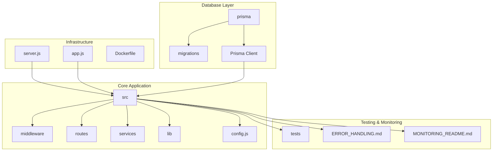
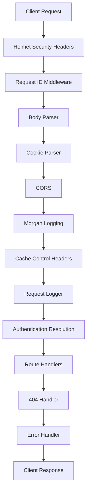
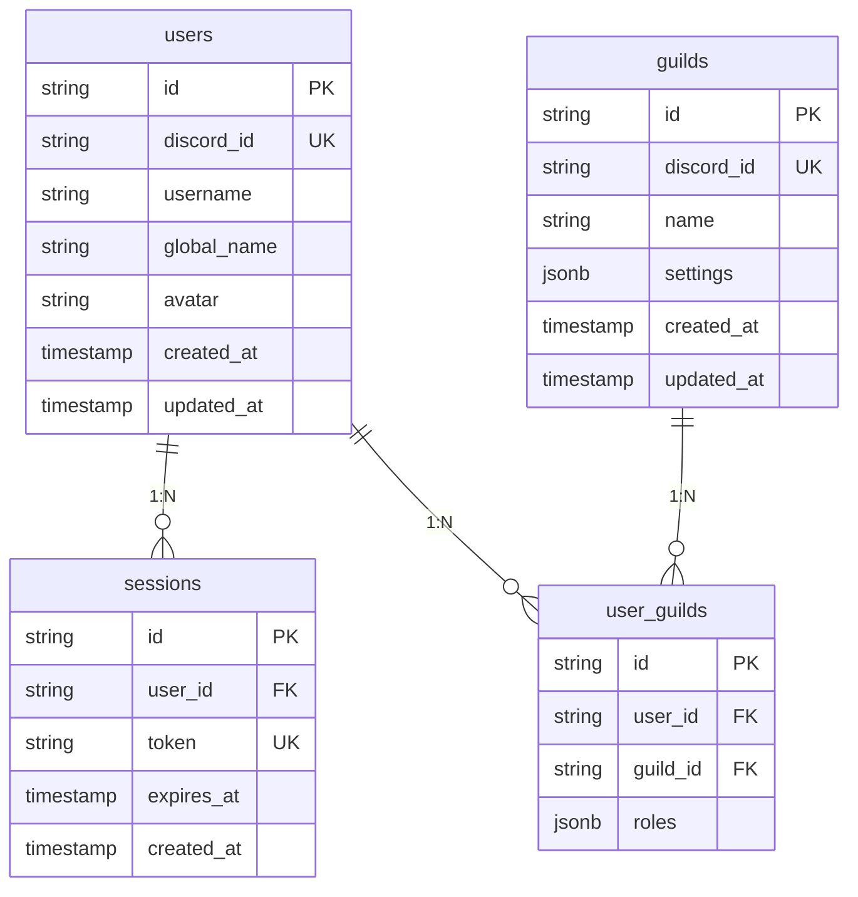
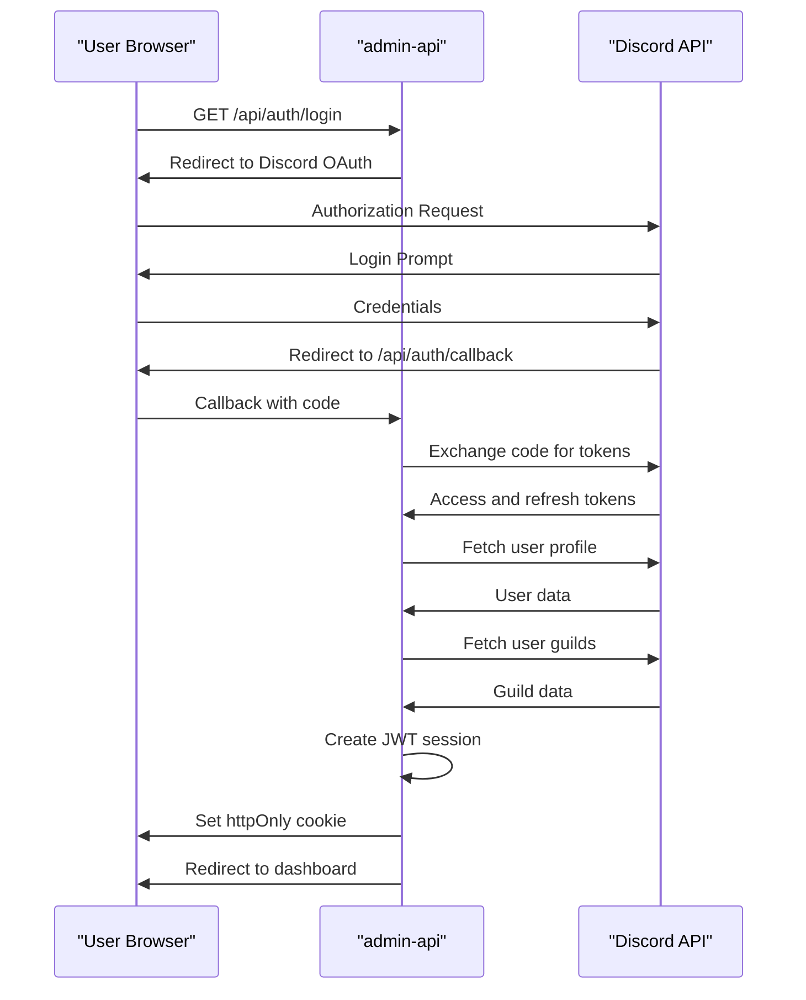
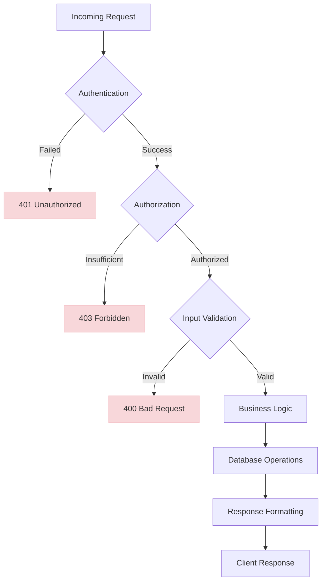
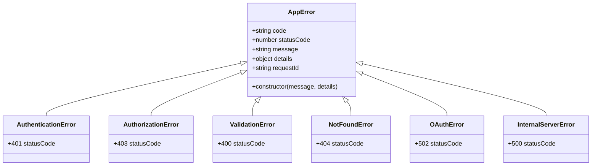
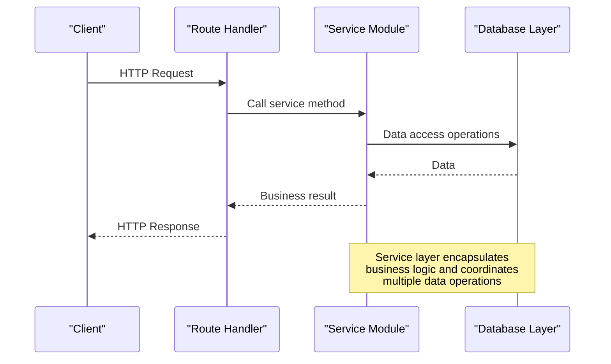

# Backend Architecture

<cite>
**Referenced Files in This Document**   
- [app.js](file://apps/admin-api/src/app.js)
- [server.js](file://apps/admin-api/server.js)
- [config.js](file://apps/admin-api/src/config.js)
- [database.js](file://apps/admin-api/src/lib/database.js)
- [guild.service.ts](file://apps/admin-api/src/services/guild.service.ts)
- [auth.js](file://apps/admin-api/src/middleware/auth.js)
- [auth.js](file://apps/admin-api/src/routes/auth.js)
- [oauth.js](file://apps/admin-api/src/services/oauth.js)
- [token.js](file://apps/admin-api/src/services/token.js)
- [error-handler.js](file://apps/admin-api/src/middleware/error-handler.js)
- [security.js](file://apps/admin-api/src/middleware/security.js)
- [csrf.js](file://apps/admin-api/src/middleware/csrf.js)
- [migration.sql](file://apps/admin-api/prisma/migrations/20241106000000_init/migration.sql)
- [ERROR_HANDLING.md](file://apps/admin-api/ERROR_HANDLING.md)
</cite>

## Table of Contents
1. [Introduction](#introduction)
2. [Project Structure](#project-structure)
3. [Express.js Application Structure](#expressjs-application-structure)
4. [Database Layer with Prisma ORM](#database-layer-with-prisma-orm)
5. [Authentication Flow](#authentication-flow)
6. [API Endpoint Design Patterns](#api-endpoint-design-patterns)
7. [Error Handling Strategy](#error-handling-strategy)
8. [Service Integration](#service-integration)
9. [Scalability and Security](#scalability-and-security)
10. [Conclusion](#conclusion)

## Introduction
This document provides comprehensive architectural documentation for the admin-api service, a backend component of the slimy-monorepo application. The service is built on Express.js and serves as the administrative interface for managing guilds, users, and various application settings. The architecture follows a layered approach with clear separation between routing, middleware, business logic, and data access layers. The system implements robust security measures including Discord OAuth2 authentication, JWT-based session management, CSRF protection, and comprehensive rate limiting. The database layer uses Prisma ORM with PostgreSQL/MySQL for data persistence, and the error handling strategy follows standardized patterns with structured logging for improved observability.

## Project Structure
The admin-api service follows a modular structure with clear separation of concerns. The core application components are organized in the `src` directory with subdirectories for middleware, routes, services, and configuration. The database layer is managed through Prisma with migration files in the `prisma/migrations` directory. Utility libraries and shared functionality are located in the `lib` directory. The service also includes comprehensive testing files and monitoring configurations.

**Diagram sources**
- [src](file://apps/admin-api/src)
- [prisma](file://apps/admin-api/prisma)
- [server.js](file://apps/admin-api/server.js)

## Express.js Application Structure
The Express.js application structure follows a middleware-based architecture with a clear request processing pipeline. The application is initialized in `app.js` where various middleware components are registered in a specific order to ensure proper request handling. The server entry point in `server.js` handles environment configuration, database initialization, and server startup.

The middleware stack includes security headers (helmet), request identification, body parsing, cookie handling, CORS configuration, and logging. Authentication resolution is performed early in the request cycle through the `readAuth` middleware, which extracts and validates user sessions from JWT tokens stored in cookies. Error handling middleware is positioned at the end of the middleware chain to catch any unhandled exceptions.

**Diagram sources**
- [app.js](file://apps/admin-api/src/app.js#L1-L64)
- [server.js](file://apps/admin-api/server.js#L1-L74)

**Section sources**
- [app.js](file://apps/admin-api/src/app.js#L1-L64)
- [server.js](file://apps/admin-api/server.js#L1-L74)

## Database Layer with Prisma ORM
The database layer is implemented using Prisma ORM, which provides a type-safe and efficient interface for database operations. The Prisma Client is initialized in the `database.js` library, which acts as a singleton wrapper around the Prisma instance. This library provides methods for database connection, disconnection, and various data access operations organized by entity type (users, guilds, sessions, etc.).

The database schema is defined through Prisma migration files, with the initial migration creating tables for users, sessions, guilds, user-guild relationships, conversations, chat messages, and statistics. The schema includes appropriate indexes and foreign key constraints to ensure data integrity and query performance. The database layer also implements query metrics collection to monitor database performance.

**Diagram sources**
- [database.js](file://apps/admin-api/src/lib/database.js#L1-L662)
- [migration.sql](file://apps/admin-api/prisma/migrations/20241106000000_init/migration.sql#L1-L121)

**Section sources**
- [database.js](file://apps/admin-api/src/lib/database.js#L1-L662)
- [migration.sql](file://apps/admin-api/prisma/migrations/20241106000000_init/migration.sql#L1-L121)

## Authentication Flow
The authentication system combines Discord OAuth2 with JWT-based session management. The flow begins with a user requesting the `/api/auth/login` endpoint, which redirects to Discord's authorization page with a state parameter for CSRF protection. Upon successful authorization, Discord redirects back to the `/api/auth/callback` endpoint with an authorization code.

The callback handler exchanges the authorization code for access and refresh tokens, then fetches the user's profile and guild information from Discord's API. The system determines the user's role based on their permissions in each guild. A JWT token is created containing the user's information and stored in an httpOnly cookie for security. The token includes a CSRF token to prevent cross-site request forgery attacks.

**Diagram sources**
- [auth.js](file://apps/admin-api/src/routes/auth.js#L1-L401)
- [oauth.js](file://apps/admin-api/src/services/oauth.js#L1-L104)
- [token.js](file://apps/admin-api/src/services/token.js#L1-L60)

**Section sources**
- [auth.js](file://apps/admin-api/src/routes/auth.js#L1-L401)
- [oauth.js](file://apps/admin-api/src/services/oauth.js#L1-L104)
- [token.js](file://apps/admin-api/src/services/token.js#L1-L60)

## API Endpoint Design Patterns
The API follows RESTful design principles with resource-based endpoints organized under the `/api` prefix. Routes are defined in separate files by resource type (auth, guilds, etc.) and mounted on the main application. Each route file imports necessary middleware and service dependencies, then defines route handlers for various HTTP methods.

The endpoint design incorporates several patterns for consistency and security. All routes require authentication by default, with role-based access control enforced through middleware. Input validation is performed using Zod schemas, with validation results attached to the request object. Error handling is standardized through the use of custom error classes and a centralized error handler. Response formatting is consistent across all endpoints, with success responses following a standard structure and errors following the documented error response format.

**Diagram sources**
- [guilds.js](file://apps/admin-api/src/routes/guilds.js#L1-L440)
- [auth.js](file://apps/admin-api/src/routes/auth.js#L1-L401)
- [validate.js](file://apps/admin-api/src/middleware/validate.js)

**Section sources**
- [guilds.js](file://apps/admin-api/src/routes/guilds.js#L1-L440)
- [auth.js](file://apps/admin-api/src/routes/auth.js#L1-L401)

## Error Handling Strategy
The error handling strategy follows a comprehensive approach with standardized error classes, structured logging, and consistent response formatting. The system defines specific error classes for different error types (authentication, authorization, validation, etc.) with appropriate HTTP status codes. These error classes extend a base AppError class that ensures consistent structure.

The error handling middleware catches all unhandled exceptions and formats them according to the standardized error response format. In development mode, stack traces are included to aid debugging, while in production they are omitted for security. All errors are logged with structured JSON format that includes the request ID, method, path, and relevant context information.

**Diagram sources**
- [ERROR_HANDLING.md](file://apps/admin-api/ERROR_HANDLING.md#L1-L216)
- [errors.js](file://apps/admin-api/src/lib/errors.js)
- [error-handler.js](file://apps/admin-api/src/middleware/error-handler.js#L1-L82)

**Section sources**
- [ERROR_HANDLING.md](file://apps/admin-api/ERROR_HANDLING.md#L1-L216)
- [error-handler.js](file://apps/admin-api/src/middleware/error-handler.js#L1-L82)

## Service Integration
The integration between Express routes and business logic is facilitated through service modules that encapsulate domain-specific functionality. Each service module (e.g., guild.service.ts, settings.service.js) provides a clean API for performing operations on a specific domain. Route handlers import these services and call their methods, passing any necessary parameters.

The service layer acts as an abstraction between the HTTP interface and the data access layer, allowing for better testability and separation of concerns. Services may compose functionality from multiple data access methods or other services to implement complex business operations. The integration pattern ensures that route handlers remain lightweight and focused on request/response handling, while business logic is centralized in the service layer.

**Diagram sources**
- [guild.service.ts](file://apps/admin-api/src/services/guild.service.ts#L1-L605)
- [guilds.js](file://apps/admin-api/src/routes/guilds.js#L1-L440)
- [database.js](file://apps/admin-api/src/lib/database.js#L1-L662)

**Section sources**
- [guild.service.ts](file://apps/admin-api/src/services/guild.service.ts#L1-L605)
- [guilds.js](file://apps/admin-api/src/routes/guilds.js#L1-L440)

## Scalability and Security
The architecture incorporates several scalability and security measures to ensure robust operation in production environments. Security is addressed through multiple layers including HTTPS enforcement, security headers (via helmet), CSRF protection, input sanitization, and comprehensive rate limiting for different types of operations.

Rate limiting is configured differently for various endpoints: authentication endpoints have strict limits to prevent brute force attacks, API endpoints have moderate limits to prevent abuse, and chat endpoints have higher frequency limits to accommodate interactive usage. The system also implements proper session management with token expiration and revocation.

For scalability, the application is designed to be stateless except for the database, allowing for horizontal scaling. The use of JWT tokens for authentication eliminates the need for server-side session storage. Database query metrics are collected to monitor performance and identify potential bottlenecks. The architecture also supports monitoring and observability through structured logging and request ID tracking.

```mermaid
graph TD
A[Security & Scalability] --> B[Authentication]
A --> C[Authorization]
A --> D[Input Validation]
A --> E[Rate Limiting]
A --> F[Security Headers]
A --> G[CSRF Protection]
A --> H[Session Management]
A --> I[Monitoring]
A --> J[Horizontal Scaling]
B --> K[Discord OAuth2]
B --> L[JWT Tokens]
B --> M[httpOnly Cookies]
C --> N[Role-Based Access]
C --> O[Permission Checks]
D --> P[Zod Validation]
D --> Q[Input Sanitization]
E --> R[Auth: 5/15min]
E --> S[API: 100/15min]
E --> T[Chat: 10/1min]
F --> U[Helmet]
F --> V[CORS]
F --> W[HSTS]
G --> X[CSRF Tokens]
G --> Y[State Parameters]
H --> Z[Token Expiration]
H --> AA[Session Revocation]
I --> AB[Structured Logging]
I --> AC[Request IDs]
I --> AD[Error Tracking]
J --> AE[Stateless Design]
J --> AF[Database Scaling]
```

**Diagram sources**
- [security.js](file://apps/admin-api/src/middleware/security.js#L1-L285)
- [csrf.js](file://apps/admin-api/src/middleware/csrf.js#L1-L28)
- [config.js](file://apps/admin-api/src/config.js#L1-L125)
- [database.js](file://apps/admin-api/src/lib/database.js#L1-L662)

**Section sources**
- [security.js](file://apps/admin-api/src/middleware/security.js#L1-L285)
- [csrf.js](file://apps/admin-api/src/middleware/csrf.js#L1-L28)
- [config.js](file://apps/admin-api/src/config.js#L1-L125)

## Conclusion
The admin-api service demonstrates a well-architected backend system with clear separation of concerns, robust security measures, and scalable design principles. The Express.js application structure follows best practices with a well-defined middleware pipeline and modular route organization. The database layer leverages Prisma ORM effectively to provide type-safe data access with proper schema management through migrations.

The authentication system combines Discord OAuth2 with JWT-based session management in httpOnly cookies, providing secure user identification with CSRF protection. API endpoint design follows consistent patterns for authentication, authorization, validation, and error handling. The service layer abstraction enables clean integration between routes and business logic while maintaining testability.

The comprehensive error handling strategy with structured logging and standardized error responses enhances observability and simplifies debugging. Security measures including rate limiting, input sanitization, and security headers protect against common web vulnerabilities. The stateless design and database-centric architecture support horizontal scaling for improved performance and reliability.

Overall, the architecture balances security, scalability, and maintainability while providing a robust foundation for the administrative functionality of the application.