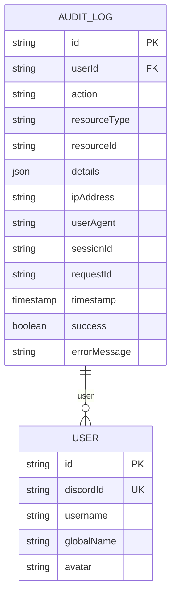
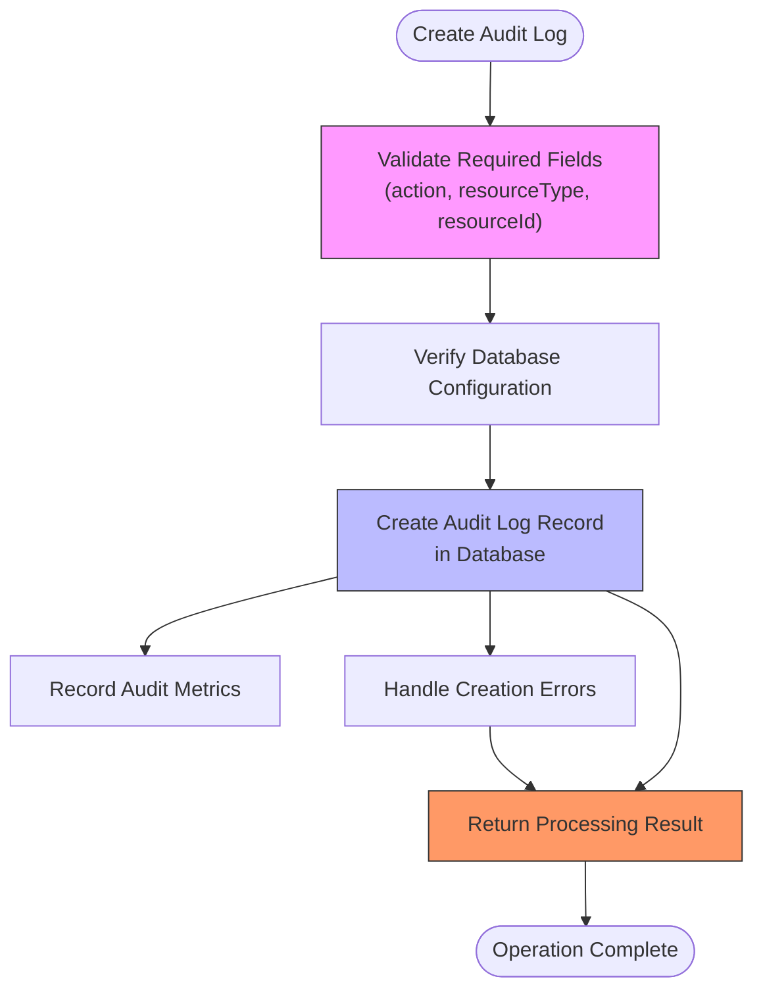
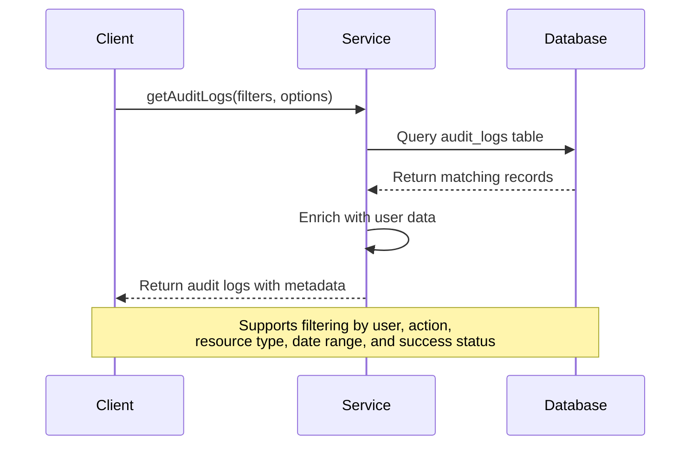
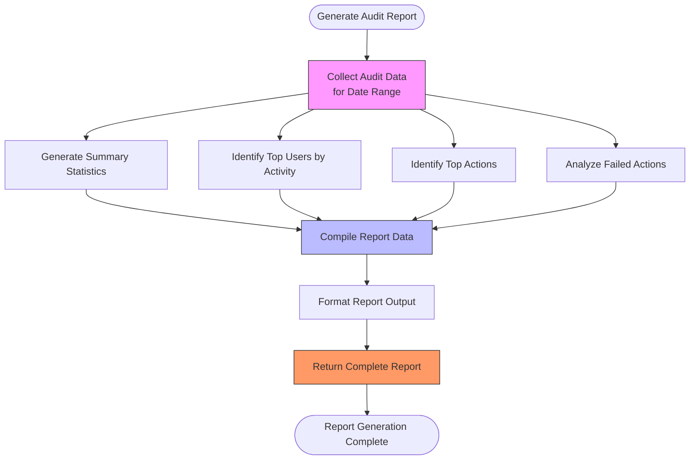
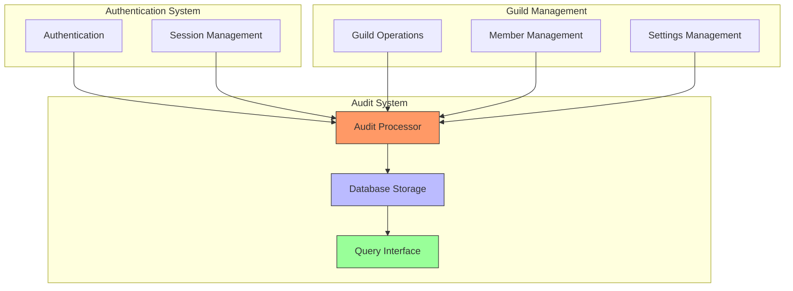

# Audit Log System

<cite>
**Referenced Files in This Document**   
- [audit-processor.js](file://apps/admin-api/src/lib/queues/audit-processor.js)
- [database.js](file://apps/admin-api/src/lib/database.js)
- [audit-log.ts](file://apps/web/lib/audit-log.ts)
- [schema.prisma](file://apps/admin-api/prisma/schema.prisma)
- [audit.js](file://apps/admin-api/src/services/audit.js)
</cite>

## Table of Contents
1. [Introduction](#introduction)
2. [Audit Log Data Model](#audit-log-data-model)
3. [Core Operations](#core-operations)
4. [Query Interface](#query-interface)
5. [Usage Patterns](#usage-patterns)
6. [Performance and Retention](#performance-and-retention)
7. [System Integration](#system-integration)

## Introduction
The Audit Log System provides comprehensive tracking of user actions and system events for security, compliance, and operational monitoring. The system captures detailed information about actions performed within the application, including user interactions, administrative operations, and system events. This documentation details the structure of audit records, the methods for creating and retrieving audit logs, and the integration points with other system components.

**Section sources**
- [audit-processor.js](file://apps/admin-api/src/lib/queues/audit-processor.js#L1-L46)
- [audit-log.ts](file://apps/web/lib/audit-log.ts#L1-L10)

## Audit Log Data Model

### Entity Structure
The AuditLog entity captures comprehensive information about system events and user actions. The data model includes essential fields for tracking the who, what, when, and where of each action.

**Diagram sources**
- [schema.prisma](file://apps/admin-api/prisma/schema.prisma#L418-L452)
- [database.js](file://apps/admin-api/src/lib/database.js#L72-L102)

### Action Types
The system defines a comprehensive set of action types categorized by functional area:

- **Guild Actions**: `guild.create`, `guild.update`, `guild.delete`, `guild.settings.update`
- **Member Actions**: `member.add`, `member.remove`, `member.update`, `member.role.update`
- **Code Actions**: `code.report`, `code.verify`, `code.delete`
- **Club Analytics**: `club.analysis.create`, `club.analysis.delete`, `club.analysis.export`
- **Feature Flags**: `feature.flag.update`
- **User Actions**: `user.login`, `user.logout`, `user.preferences.update`
- **Admin Actions**: `admin.access`, `admin.config.update`
- **System Actions**: `system.config.update`, `system.maintenance`

**Section sources**
- [audit-log.ts](file://apps/web/lib/audit-log.ts#L32-L71)

### Contextual Metadata
Audit logs capture extensive contextual metadata to support security investigations and compliance requirements:

- **User Context**: User ID, username, session ID
- **Request Context**: Request ID, IP address, user agent
- **Resource Context**: Resource type, resource ID, action performed
- **Outcome Context**: Success/failure status, error messages
- **Change Tracking**: Before/after state for modified resources

The system also supports detailed change tracking through the `AuditChanges` interface, which captures the fields that were modified, along with their before and after values.

**Section sources**
- [audit-log.ts](file://apps/web/lib/audit-log.ts#L13-L27)
- [audit-log.ts](file://apps/web/lib/audit-log.ts#L73-L80)

## Core Operations

### Create Audit Log Method
The `createAuditLog` method is the primary interface for recording audit events in the system. This method accepts a comprehensive set of parameters to capture all relevant information about the audited action.

**Diagram sources**
- [audit-processor.js](file://apps/admin-api/src/lib/queues/audit-processor.js#L48-L110)
- [database.js](file://apps/admin-api/src/lib/database.js#L72-L102)

### Method Parameters
The `createAuditLog` method accepts the following parameters:

- **userId**: The ID of the user who performed the action (required)
- **action**: The action performed (required)
- **resourceType**: The type of resource affected (required)
- **resourceId**: The ID of the affected resource (required)
- **details**: Additional details about the action (optional)
- **ipAddress**: The IP address of the user (optional)
- **userAgent**: The user agent string (optional)
- **sessionId**: The session ID for tracking (optional)
- **requestId**: The request ID for correlation (optional)
- **success**: Whether the action was successful (default: true)
- **errorMessage**: Error message if the action failed (optional)

### Success and Failure Tracking
The audit logging system implements robust success and failure tracking:

- **Success Tracking**: Successful audit log creations are recorded with `success: true` and include the audit log ID and timestamp
- **Failure Handling**: Audit logging failures do not fail the main operation but are recorded as failed audit events with `action: 'audit_log_failure'`
- **Error Recording**: When an audit event fails to be recorded, the system captures the error message and logs it for monitoring purposes

The system ensures that audit logging failures are tracked without compromising the primary operation, maintaining system reliability while preserving audit integrity.

**Section sources**
- [audit-processor.js](file://apps/admin-api/src/lib/queues/audit-processor.js#L48-L110)
- [audit-processor.js](file://apps/admin-api/src/lib/queues/audit-processor.js#L112-L170)

### Error Message Handling
The system implements comprehensive error handling for audit operations:

- **Validation Errors**: Missing required fields trigger descriptive error messages
- **Database Errors**: Database connectivity issues are logged with appropriate warnings
- **Processing Errors**: Any exceptions during audit processing are captured and reported
- **Non-Blocking**: Audit logging failures never fail the primary operation

Error messages are captured in the `errorMessage` field of the audit log and are also reported through the system's monitoring infrastructure for alerting and analysis.

**Section sources**
- [audit-processor.js](file://apps/admin-api/src/lib/queues/audit-processor.js#L112-L170)

## Query Interface

### Retrieval Methods
The system provides a flexible query interface for retrieving audit logs with various filters:

**Diagram sources**
- [database.js](file://apps/admin-api/src/lib/database.js#L104-L149)

### Filter Options
The query interface supports multiple filter criteria for targeted log retrieval:

- **User Filtering**: Retrieve logs for a specific user by ID
- **Action Filtering**: Filter by specific action types
- **Resource Filtering**: Filter by resource type and ID
- **Status Filtering**: Filter by success/failure status
- **Date Range**: Filter by timestamp range (startDate, endDate)
- **Pagination**: Support for limit and offset parameters

The system also provides a `getAuditLogStats` method that returns aggregate statistics about audit logs, including total counts, success rates, and action breakdowns.

**Section sources**
- [database.js](file://apps/admin-api/src/lib/database.js#L104-L173)

## Usage Patterns

### Security Monitoring
The audit log system supports comprehensive security monitoring through various usage patterns:

- **Anomaly Detection**: Monitor for unusual patterns of activity, such as multiple failed login attempts
- **Privilege Escalation**: Track administrative actions and configuration changes
- **Data Access Monitoring**: Log access to sensitive resources and data
- **Session Tracking**: Correlate actions with user sessions and IP addresses

The system's detailed contextual metadata enables security teams to investigate incidents and identify potential threats.

### Compliance Reporting
The audit log system facilitates compliance with regulatory requirements through:

- **Immutable Records**: Once created, audit logs cannot be modified or deleted (except through authorized cleanup processes)
- **Complete Trail**: Comprehensive tracking of all user actions and system events
- **Retention Policies**: Configurable data retention periods to meet compliance requirements
- **Report Generation**: Automated generation of compliance reports with summary statistics

The system supports the generation of daily, weekly, and monthly audit reports that include summary statistics, top users by activity, top actions, and failure analysis.

**Diagram sources**
- [audit-processor.js](file://apps/admin-api/src/lib/queues/audit-processor.js#L287-L347)
- [audit-processor.js](file://apps/admin-api/src/lib/queues/audit-processor.js#L349-L400)

**Section sources**
- [audit-processor.js](file://apps/admin-api/src/lib/queues/audit-processor.js#L222-L400)

## Performance and Retention

### High-Volume Logging Performance
The audit logging system is designed to handle high-volume logging with minimal performance impact:

- **Asynchronous Processing**: Audit events are processed asynchronously through a queue system
- **Bulk Operations**: Support for bulk audit event logging to reduce database round trips
- **Connection Pooling**: Efficient database connection management
- **Indexing Strategy**: Comprehensive indexing on commonly queried fields

The system uses a queue-based architecture to ensure that audit logging does not block primary operations, even under high load.

### Indexing Strategy
The database implements a comprehensive indexing strategy to optimize query performance:

- **Primary Indexes**: Indexes on userId, action, resourceType, resourceId, and timestamp
- **Composite Indexes**: Combined indexes for common query patterns (e.g., userId + timestamp, action + timestamp)
- **Performance Monitoring**: Integration with system metrics to track query performance

These indexes ensure that audit log queries remain performant even as the volume of audit data grows.

**Section sources**
- [schema.prisma](file://apps/admin-api/prisma/schema.prisma#L437-L449)

### Data Retention Policies
The system implements configurable data retention policies:

- **Automated Cleanup**: Scheduled jobs to remove audit logs older than a specified date
- **Action Exclusion**: Ability to exclude certain action types from cleanup (e.g., security-critical actions)
- **Compliance Alignment**: Retention periods configurable to meet regulatory requirements

The cleanup process is handled by the `processAuditCleanup` function, which can delete logs before a specified date while excluding certain actions from deletion.

**Section sources**
- [audit-processor.js](file://apps/admin-api/src/lib/queues/audit-processor.js#L222-L288)

## System Integration

### Authentication Integration
The audit log system is tightly integrated with the authentication system:

- **Login/Logout Tracking**: Automatic logging of user login and logout events
- **Session Management**: Correlation of audit events with user sessions
- **Role-Based Access**: Logging of role changes and permission modifications
- **Token Operations**: Tracking of token creation and revocation

When a user authenticates, the system records the login event with the user's ID, IP address, user agent, and session information, providing a complete record of authentication activities.

### Guild Management Integration
The audit log system is deeply integrated with guild management functionality:

- **Guild Creation/Deletion**: Logging of guild creation and deletion events
- **Settings Changes**: Tracking of configuration changes to guild settings
- **Member Management**: Recording of member additions, removals, and role changes
- **Permission Changes**: Audit trail for permission modifications

These integrations ensure that all significant changes to guilds are properly recorded and can be reviewed for compliance and security purposes.

**Diagram sources**
- [audit-processor.js](file://apps/admin-api/src/lib/queues/audit-processor.js#L1-L46)
- [database.js](file://apps/admin-api/src/lib/database.js#L71-L102)
- [audit.js](file://apps/admin-api/src/services/audit.js#L1-L25)

**Section sources**
- [audit-processor.js](file://apps/admin-api/src/lib/queues/audit-processor.js#L1-L46)
- [database.js](file://apps/admin-api/src/lib/database.js#L205-L398)
- [audit.js](file://apps/admin-api/src/services/audit.js#L1-L25)