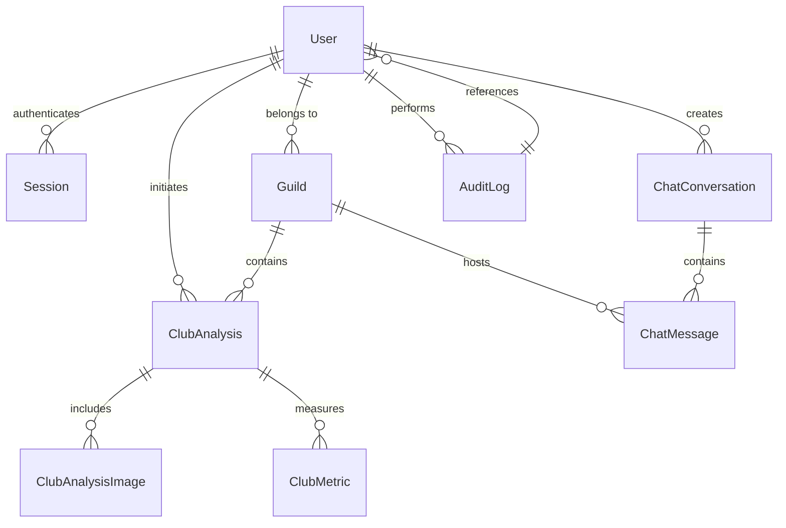
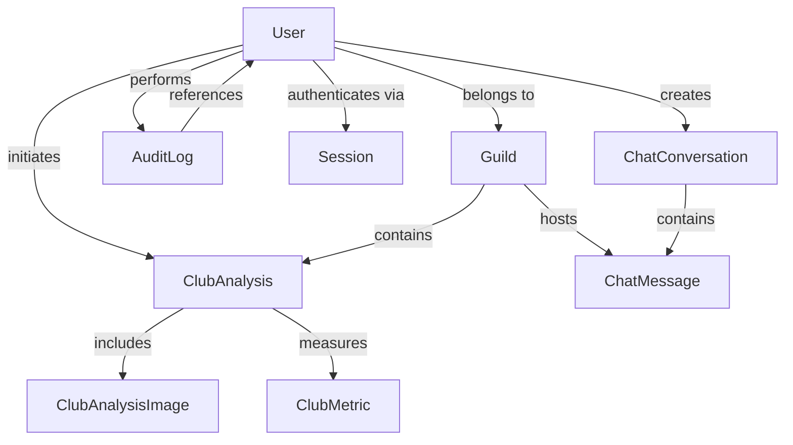
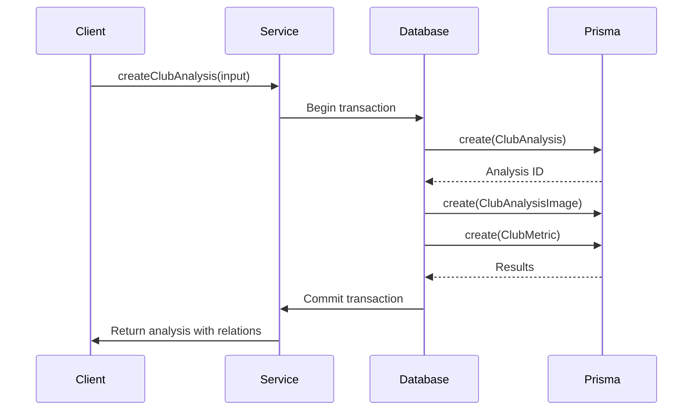
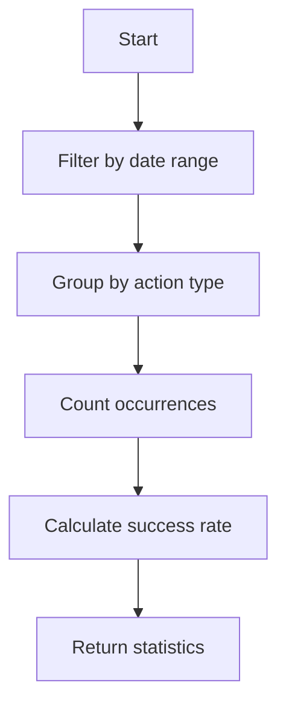

# Database Layer

<cite>
**Referenced Files in This Document**   
- [schema.prisma](file://apps/admin-api/prisma/schema.prisma)
- [database.js](file://apps/admin-api/src/lib/database.js)
- [db.ts](file://apps/web/lib/db.ts)
- [migration.sql](file://apps/admin-api/prisma/migrations/20241106000000_init/migration.sql)
- [club-analytics.repository.ts](file://apps/web/lib/repositories/club-analytics.repository.ts)
- [audit-log.ts](file://apps/web/lib/audit-log.ts)
</cite>

## Table of Contents
1. [Introduction](#introduction)
2. [Data Model Overview](#data-model-overview)
3. [Entity Relationships](#entity-relationships)
4. [Field Definitions and Constraints](#field-definitions-and-constraints)
5. [Migration Strategy and Version Control](#migration-strategy-and-version-control)
6. [Data Access Patterns](#data-access-patterns)
7. [Connection Pooling and Performance](#connection-pooling-and-performance)
8. [Data Validation and Business Logic](#data-validation-and-business-logic)
9. [Complex Queries and Optimization](#complex-queries-and-optimization)
10. [Data Lifecycle Management](#data-lifecycle-management)
11. [Sample Data](#sample-data)

## Introduction

The Prisma ORM database layer serves as the central data persistence system for the Slimy application, managing relationships between core entities such as Guild, User, Session, AuditLog, ClubData, and ChatConversation. This documentation provides a comprehensive overview of the database schema, relationships, access patterns, and performance considerations. The system uses PostgreSQL as the underlying database with Prisma as the ORM layer, providing type-safe database access across the application.

The data model supports both the admin API and web frontend applications, with entities designed to support Discord integration, club analytics, chat functionality, and audit logging. The architecture emphasizes data integrity through proper foreign key constraints, while maintaining flexibility with JSONB fields for dynamic data storage.

**Section sources**
- [schema.prisma](file://apps/admin-api/prisma/schema.prisma)
- [database.js](file://apps/admin-api/src/lib/database.js)

## Data Model Overview

The database schema consists of several core entities that represent the fundamental objects in the application. The primary entities include User, Guild, Session, AuditLog, ClubAnalysis (representing ClubData), and ChatConversation. These entities are interconnected through well-defined relationships that reflect the application's domain model.

The schema is designed with scalability in mind, incorporating performance indexes on frequently queried fields and using appropriate data types for efficient storage and retrieval. The use of Prisma's type generation ensures type safety across the application, reducing runtime errors and improving developer productivity.

The data model supports both relational data (such as user-guild membership) and semi-structured data (using JSONB fields for settings and metrics), providing flexibility for evolving requirements while maintaining data integrity for core relationships.



**Diagram sources**
- [schema.prisma](file://apps/admin-api/prisma/schema.prisma)
- [migration.sql](file://apps/admin-api/prisma/migrations/20241106000000_init/migration.sql)

## Entity Relationships

The entity relationships in the database model reflect the core interactions within the application. The User entity serves as the central identity, with relationships to multiple other entities. Users belong to Guilds through the UserGuild junction table, which also stores role information as a JSON array, enabling flexible permission management.

Sessions are linked to Users with a cascade delete relationship, ensuring that when a user is removed, their active sessions are automatically cleaned up. This relationship supports the authentication system by maintaining valid session tokens associated with user identities.

ChatConversations are owned by Users and may be associated with a specific Guild. ChatMessages are contained within conversations and can be linked to both Users and Guilds, allowing for both private conversations and guild-specific chat history. The ClubAnalysis entity connects Users and Guilds, representing analytics performed on club data within a specific guild context.

AuditLog entries reference Users (for user-initiated actions) and various resources through resourceType and resourceId fields, providing a comprehensive event sourcing mechanism for tracking changes and actions within the system.



**Diagram sources**
- [schema.prisma](file://apps/admin-api/prisma/schema.prisma)
- [database.js](file://apps/admin-api/src/lib/database.js)

## Field Definitions and Constraints

### Core Entity Fields

#### User Model
- **id**: String (Primary Key, CUID) - Unique identifier for the user
- **discordId**: String (Unique) - Discord user ID for integration
- **username**: String (Optional) - User's Discord username
- **globalName**: String (Optional) - User's Discord global name
- **avatar**: String (Optional) - URL to user's avatar image
- **createdAt**: DateTime - Timestamp of record creation
- **updatedAt**: DateTime - Timestamp of last update

#### Guild Model
- **id**: String (Primary Key, CUID) - Unique identifier for the guild
- **discordId**: String (Unique) - Discord guild ID for integration
- **name**: String - Name of the guild
- **settings**: Json? - JSON object storing guild-specific configuration
- **createdAt**: DateTime - Timestamp of record creation
- **updatedAt**: DateTime - Timestamp of last update

#### Session Model
- **id**: String (Primary Key, CUID) - Unique identifier for the session
- **userId**: String (Foreign Key) - References User.id with cascade delete
- **token**: String (Unique) - Session token for authentication
- **expiresAt**: DateTime - Timestamp when the session expires
- **createdAt**: DateTime - Timestamp of session creation

#### AuditLog Model
- **id**: String (Primary Key, CUID) - Unique identifier for the log entry
- **userId**: String (Optional, Foreign Key) - References User.id with set null
- **action**: String - Type of action performed (e.g., 'login', 'chat_message')
- **resourceType**: String - Type of resource affected (e.g., 'user', 'chat')
- **resourceId**: String - ID of the affected resource
- **details**: Json? - Additional structured details about the action
- **ipAddress**: String (Optional) - IP address of the user
- **userAgent**: String (Optional) - User agent string
- **sessionId**: String (Optional) - Session ID for correlation
- **requestId**: String (Optional) - Request ID for tracing
- **timestamp**: DateTime - Timestamp of the action
- **success**: Boolean (Default: true) - Whether the action succeeded
- **errorMessage**: String (Optional) - Error message if action failed

#### ClubAnalysis Model
- **id**: String (Primary Key, CUID) - Unique identifier for the analysis
- **guildId**: String (Foreign Key) - References Guild.id with cascade delete
- **userId**: String (Foreign Key) - References User.id with cascade delete
- **title**: String (Optional) - User-provided title for the analysis
- **summary**: String - AI-generated summary of the club data
- **confidence**: Float - Confidence score (0-1) in the analysis accuracy
- **createdAt**: DateTime - Timestamp of analysis creation
- **updatedAt**: DateTime - Timestamp of last update

#### ChatConversation Model
- **id**: String (Primary Key, CUID) - Unique identifier for the conversation
- **userId**: String (Foreign Key) - References User.id with cascade delete
- **title**: String (Optional) - User-provided title for the conversation
- **createdAt**: DateTime - Timestamp of conversation creation
- **updatedAt**: DateTime - Timestamp of last update

### Indexes and Performance Optimizations

The schema includes numerous indexes to optimize query performance:

- **User indexes**: createdAt, updatedAt, discordId (unique), and compound index on discordId+createdAt
- **Guild indexes**: createdAt, updatedAt, discordId (unique), and compound index on discordId+createdAt
- **Session indexes**: userId, expiresAt, token (unique), and compound index on userId+expiresAt
- **AuditLog indexes**: userId, action, resourceType, resourceId, timestamp, and compound indexes for common query patterns
- **ClubAnalysis indexes**: guildId, userId, createdAt, updatedAt, confidence, and compound indexes for filtering by guild and confidence
- **ChatMessage indexes**: userId, guildId, conversationId, createdAt, and compound indexes for chronological retrieval

These indexes support the application's primary access patterns, including retrieving user data by Discord ID, finding guilds by Discord ID, cleaning up expired sessions, querying audit logs by time range and action type, and retrieving club analyses by guild or user.

**Section sources**
- [schema.prisma](file://apps/admin-api/prisma/schema.prisma)
- [migration.sql](file://apps/admin-api/prisma/migrations/20241106000000_init/migration.sql)

## Migration Strategy and Version Control

The database migration strategy follows Prisma's declarative approach, using schema.prisma as the source of truth for the database structure. Migrations are generated using the `prisma migrate` command and stored in the prisma/migrations directory with timestamp-based naming (e.g., 20241106000000_init).

The initial migration (20241106000000_init) contains the complete schema definition as SQL statements, creating all tables, indexes, and foreign key constraints. Each migration is version-controlled in Git, allowing for consistent database schema evolution across development, staging, and production environments.

The migration process follows these principles:
1. Schema changes are first made to schema.prisma
2. Prisma generates a migration file with the necessary SQL operations
3. The migration is reviewed and tested locally
4. The migration is committed to version control along with the updated schema.prisma
5. Deployments apply pending migrations before starting the application

This approach ensures that the database schema can be reliably reproduced from scratch or migrated from previous versions. The use of timestamp-based migration names prevents conflicts when multiple developers create migrations simultaneously.

The system also supports zero-downtime deployments through careful migration design, avoiding destructive operations on production data. For schema changes that could impact availability, the team follows a two-phase deployment strategy: first deploying application code that works with both old and new schema, then applying the migration, and finally deploying optimized code.

**Section sources**
- [schema.prisma](file://apps/admin-api/prisma/schema.prisma)
- [migration.sql](file://apps/admin-api/prisma/migrations/20241106000000_init/migration.sql)

## Data Access Patterns

The application implements a service-layer pattern for data access, with the Database class in database.js providing a centralized interface to the Prisma client. This pattern ensures consistent error handling, logging, and metrics collection across all database operations.

Key data access patterns include:

### User Management
- **findOrCreateUser**: Uses upsert to handle both new user registration and existing user updates
- **findUserByDiscordId**: Retrieves user data by Discord ID, used during authentication
- **findUserById**: Retrieves user data by internal ID for authorization

### Session Management
- **createSession**: Creates a new session record with expiration tracking
- **findSessionByToken**: Validates session tokens and returns associated user data
- **deleteSession**: Removes a session, used during logout
- **deleteExpiredSessions**: Periodic cleanup of expired sessions

### Guild Management
- **findOrCreateGuild**: Uses upsert to handle guild creation and updates
- **findGuildByDiscordId**: Retrieves guild data by Discord ID
- **listGuilds**: Supports pagination and search for guild discovery
- **updateGuildSettings**: Updates the JSON settings field atomically

### Audit Logging
- **createAuditLog**: Records actions with contextual information
- **getAuditLogs**: Supports filtering by user, action, resource, and time range
- **getAuditLogStats**: Provides aggregated statistics for monitoring

### Club Analysis
- **createClubAnalysis**: Creates a new analysis with associated images and metrics
- **findClubAnalysis**: Retrieves analysis data with related entities
- **updateClubAnalysis**: Modifies analysis metadata
- **deleteClubAnalysis**: Removes analysis data (cascades to related entities)

The ClubAnalyticsRepository in the web application provides a higher-level interface for club analysis operations, implementing patterns like repository and unit of work to manage complex transactions involving multiple related entities.



**Diagram sources**
- [database.js](file://apps/admin-api/src/lib/database.js)
- [club-analytics.repository.ts](file://apps/web/lib/repositories/club-analytics.repository.ts)

## Connection Pooling and Performance

The database layer implements connection pooling through Prisma's built-in connection management. The PrismaClient instance maintains a pool of database connections that are reused across requests, reducing the overhead of establishing new connections for each operation.

Connection pooling is configured through environment variables and application configuration, with default settings optimized for the expected workload. The pool size, connection timeout, and other parameters can be adjusted based on deployment requirements.

Performance monitoring is integrated into the database layer through middleware that records query execution times and error rates. This data is exposed through the getDbHealth function, which provides real-time insights into database performance, including response time and connection status.

The system implements several performance optimizations:

1. **Query Optimization**: The DatabaseOptimizer class provides tools for analyzing query performance, including slow query detection and index usage analysis.

2. **Caching Strategy**: Frequently accessed data (such as guild settings and user profiles) is cached in Redis to reduce database load.

3. **Batch Operations**: Bulk operations are handled through dedicated database processors that use Prisma's transaction support to ensure data consistency.

4. **Indexing Strategy**: Comprehensive indexes are defined on fields used in WHERE, ORDER BY, and JOIN clauses to optimize query performance.

5. **Connection Management**: The database connection is properly initialized and closed during application lifecycle events, with metrics recorded for connection count.

The system also implements rate limiting and query complexity limits to prevent denial-of-service attacks and ensure fair resource usage across tenants.

**Section sources**
- [database.js](file://apps/admin-api/src/lib/database.js)
- [db.ts](file://apps/web/lib/db.ts)
- [database-optimization.js](file://apps/admin-api/lib/database-optimization.js)

## Data Validation and Business Logic

Data validation and business logic enforcement occur at multiple levels in the application architecture:

### Schema-Level Validation
Prisma enforces basic data integrity through:
- Required field constraints
- Unique constraints (e.g., unique Discord IDs)
- Foreign key relationships with appropriate delete behaviors
- Default values for timestamps and boolean fields

### Application-Level Validation
The Database class implements business logic through method-level validation:

- **User validation**: Ensures required fields are present and properly formatted
- **Guild validation**: Validates guild names and settings structure
- **Session validation**: Ensures expiration dates are in the future
- **Audit log validation**: Normalizes action and resource types

### Business Rules
Key business rules enforced by the data layer include:

1. **User-Guild Membership**: The UserGuild junction table ensures a user can only belong to a guild once, with roles stored as a JSON array.

2. **Cascade Deletion**: When a User or Guild is deleted, related entities (sessions, audit logs, club analyses) are automatically cleaned up.

3. **Session Expiration**: Expired sessions are automatically removed through periodic cleanup jobs.

4. **Immutable Audit Logs**: Audit log entries cannot be modified after creation, ensuring a reliable audit trail.

5. **Club Analysis Ownership**: Users can only modify club analyses they created, with appropriate authorization checks.

The system also implements soft deletion patterns for certain entities, preserving data for compliance while marking it as inactive in the application interface.

**Section sources**
- [database.js](file://apps/admin-api/src/lib/database.js)
- [audit-log.ts](file://apps/web/lib/audit-log.ts)

## Complex Queries and Optimization

The database layer supports several complex query patterns that are optimized for performance:

### Aggregation Queries


The getAuditLogStats method performs aggregation across multiple dimensions, using Prisma's groupBy functionality to efficiently calculate statistics without loading all records into application memory.

### Join Queries
The system optimizes join queries through:
- Proper indexing on foreign key columns
- Selective field inclusion using Prisma's select and include options
- Pagination to limit result set size

For example, retrieving a guild with its members uses:
```typescript
prisma.guild.findUnique({
  where: { id },
  include: {
    userGuilds: {
      include: {
        user: {
          select: { id: true, username: true, globalName: true, avatar: true }
        }
      }
    }
  }
})
```

### Search Queries
Text search is implemented using PostgreSQL's case-insensitive contains operator with proper indexing:
```typescript
where: {
  OR: [
    { title: { contains: query, mode: 'insensitive' } },
    { summary: { contains: query, mode: 'insensitive' } }
  ]
}
```

### Optimization Techniques
1. **Query Batching**: Related queries are executed in parallel using Promise.all
2. **Connection Reuse**: Prisma's connection pool minimizes connection overhead
3. **Index-Only Scans**: Proper indexing allows PostgreSQL to satisfy queries from index data alone
4. **Query Caching**: Frequently executed queries are cached in Redis
5. **Pagination**: Large result sets are paginated to prevent memory issues

The DatabaseOptimizer class provides tools for monitoring query performance and identifying optimization opportunities.

**Section sources**
- [database.js](file://apps/admin-api/src/lib/database.js)
- [club-analytics.repository.ts](file://apps/web/lib/repositories/club-analytics.repository.ts)

## Data Lifecycle Management

The system implements comprehensive data lifecycle management policies:

### Retention Policies
- **Sessions**: Automatically expire based on the expiresAt timestamp, with periodic cleanup jobs removing expired records
- **Audit Logs**: Retained indefinitely for compliance, with archival to cold storage for records older than 1 year
- **Chat Messages**: Retained as long as the associated conversation exists
- **Club Analyses**: Retained until explicitly deleted by the user or guild administrator

### Data Archival
The system supports data export functionality, allowing users to download their data in standard formats. This satisfies data portability requirements and enables offline analysis.

### Data Deletion
The system implements proper data deletion procedures:
- **User Deletion**: Cascades to related entities (sessions, audit logs, club analyses) while preserving anonymized analytics data
- **Guild Deletion**: Removes all guild-specific data, including club analyses and chat history
- **Record Deletion**: Individual records can be deleted with proper authorization checks

### Backup and Recovery
Database backups are performed regularly using PostgreSQL's built-in tools, with backups stored in encrypted cloud storage. The system supports point-in-time recovery through write-ahead logging (WAL) archiving.

### Data Integrity
The system ensures data integrity through:
- Transactional operations for complex updates
- Foreign key constraints to maintain referential integrity
- Regular data consistency checks
- Automated data validation during migration

These policies ensure that data is managed responsibly throughout its lifecycle, from creation to archival or deletion.

**Section sources**
- [database.js](file://apps/admin-api/src/lib/database.js)
- [db.ts](file://apps/web/lib/db.ts)

## Sample Data

### User Record
```json
{
  "id": "clx123abc456def789",
  "discordId": "987654321098765432",
  "username": "slimy_user",
  "globalName": "Slimy User",
  "avatar": "https://cdn.discordapp.com/avatars/987654321098765432/abc123.png",
  "createdAt": "2024-11-06T10:00:00.000Z",
  "updatedAt": "2024-11-06T10:00:00.000Z"
}
```

### Guild Record
```json
{
  "id": "clx456def789ghi012",
  "discordId": "123456789012345678",
  "name": "Slimy Club",
  "settings": {
    "language": "en",
    "timezone": "UTC",
    "features": {
      "clubAnalytics": true,
      "chatBot": true
    }
  },
  "createdAt": "2024-11-06T10:00:00.000Z",
  "updatedAt": "2024-11-06T10:00:00.000Z"
}
```

### Club Analysis Record
```json
{
  "id": "clx789ghi012jkl345",
  "guildId": "clx456def789ghi012",
  "userId": "clx123abc456def789",
  "title": "Monthly Club Performance",
  "summary": "The club shows strong growth in membership and performance metrics.",
  "confidence": 0.95,
  "createdAt": "2024-11-06T10:00:00.000Z",
  "updatedAt": "2024-11-06T10:00:00.000Z"
}
```

### Audit Log Record
```json
{
  "id": "clx012jkl345mno678",
  "userId": "clx123abc456def789",
  "action": "club.analysis.create",
  "resourceType": "club_analysis",
  "resourceId": "clx789ghi012jkl345",
  "details": {
    "analysisType": "performance",
    "imageCount": 3
  },
  "ipAddress": "192.168.1.1",
  "userAgent": "Mozilla/5.0 (Windows NT 10.0; Win64; x64) AppleWebKit/537.36",
  "sessionId": "clx345mno678pqr901",
  "requestId": "req_1234567890",
  "timestamp": "2024-11-06T10:00:00.000Z",
  "success": true
}
```

These sample records illustrate the structure and content of typical database entries, showing how the various fields are populated in practice.

**Section sources**
- [schema.prisma](file://apps/admin-api/prisma/schema.prisma)
- [database.js](file://apps/admin-api/src/lib/database.js)