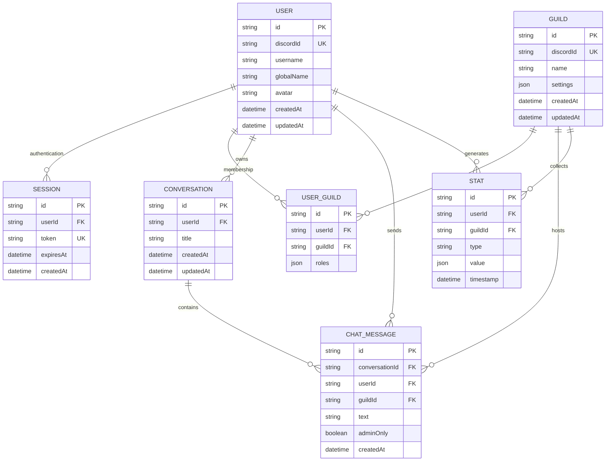
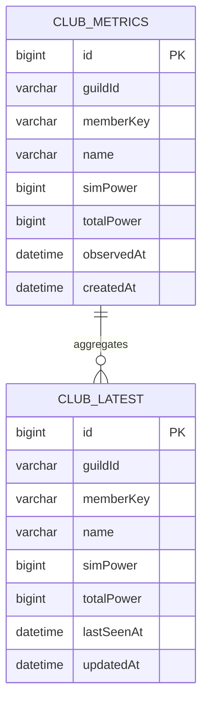
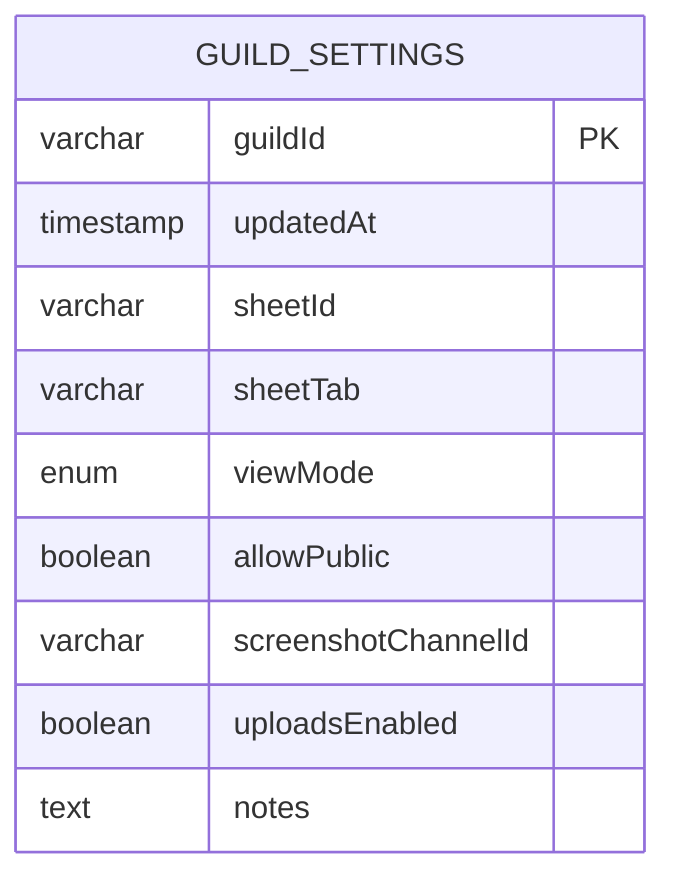

# Database Migrations and Schema Management

<cite>
**Referenced Files in This Document**   
- [migration.sql](file://apps/admin-api/prisma/migrations/20241106000000_init/migration.sql)
- [club-schema.sql](file://apps/admin-api/lib/club-schema.sql)
- [guild-settings.sql](file://apps/admin-api/lib/guild-settings.sql)
- [schema.prisma](file://apps/admin-api/prisma/schema.prisma)
- [database.js](file://apps/admin-api/src/lib/database.js)
</cite>

## Table of Contents
1. [Introduction](#introduction)
2. [Prisma Migration Workflow](#prisma-migration-workflow)
3. [Core Data Models](#core-data-models)
4. [Club Data Schema](#club-data-schema)
5. [Guild Settings Schema](#guild-settings-schema)
6. [Migration Deployment Process](#migration-deployment-process)
7. [Schema Evolution Strategy](#schema-evolution-strategy)
8. [Migration Rollback Procedures](#migration-rollback-procedures)
9. [Schema Validation Techniques](#schema-validation-techniques)
10. [Conflict Resolution in Team Development](#conflict-resolution-in-team-development)
11. [Adding New Migrations](#adding-new-migrations)
12. [Schema Integrity Verification](#schema-integrity-verification)

## Introduction
This document provides comprehensive documentation for the database migration system in the Slimy monorepo. It details the Prisma-based migration workflow, schema definitions, and version control processes that govern the application's data layer. The system supports both PostgreSQL (via Prisma) and MySQL (via direct SQL) databases, with different applications using different database technologies. The documentation covers the initial migration structure, core data models, and specific schemas for club analytics and guild settings, along with deployment processes, rollback procedures, and team collaboration strategies.

## Prisma Migration Workflow
The Prisma migration workflow in this monorepo follows a structured approach to database schema management and version control. The system uses Prisma as the primary ORM for the admin-api application, with migrations stored in the `prisma/migrations` directory. The initial migration, `20241106000000_init`, establishes the foundational database structure with tables for users, sessions, guilds, conversations, chat messages, and statistics. Each migration is represented as a timestamped directory containing a `migration.sql` file with the raw SQL statements to apply the schema changes.

The migration process begins with schema definition in the `schema.prisma` file, where data models are defined using Prisma's declarative syntax. When changes are made to this schema, the Prisma CLI generates migration files that contain the necessary SQL to transition from the previous schema state to the new one. These migrations are idempotent and include both the forward migration steps and the reverse operations for rollback capability. The migration system handles table creation, index definition, and foreign key constraints, ensuring referential integrity across related entities.

**Section sources**
- [schema.prisma](file://apps/admin-api/prisma/schema.prisma#L1-L453)
- [migration.sql](file://apps/admin-api/prisma/migrations/20241106000000_init/migration.sql#L1-L121)

## Core Data Models
The core data models in the system are defined using Prisma's schema language and represent the fundamental entities of the application. The User model stores Discord user information with fields for ID, Discord ID, username, global name, avatar, and timestamps. It maintains relationships with sessions, guild memberships, conversations, and other entities through defined relations. The Guild model represents Discord servers with their names, settings, and associated metadata, establishing a many-to-many relationship with users through the UserGuild junction table.

Additional core models include Session for authentication management, Conversation for chat history, ChatMessage for individual messages, and Stat for analytics data. These models are interconnected through foreign key relationships, creating a cohesive data graph that supports the application's functionality. Each model includes performance-oriented indexes on frequently queried fields and appropriate constraints to ensure data integrity. The schema also incorporates audit logging through the AuditLog model, which tracks important actions and changes throughout the system.

**Diagram sources**
- [schema.prisma](file://apps/admin-api/prisma/schema.prisma#L14-L104)
- [migration.sql](file://apps/admin-api/prisma/migrations/20241106000000_init/migration.sql#L2-L35)

**Section sources**
- [schema.prisma](file://apps/admin-api/prisma/schema.prisma#L14-L104)
- [migration.sql](file://apps/admin-api/prisma/migrations/20241106000000_init/migration.sql#L2-L35)

## Club Data Schema
The club data schema is implemented using direct SQL definitions for MySQL, stored in the `club-schema.sql` file. This schema consists of two primary tables: `club_metrics` and `club_latest`. The `club_metrics` table stores historical member power metrics extracted from OCR parsing, with fields for guild ID, member key, name, sim power, total power, and timestamps for observation and creation. It includes composite indexes on guild and member for efficient querying and a unique constraint on the combination of guild ID, member key, and observation time to prevent duplicate entries.

The `club_latest` table provides an aggregated view of the most current metrics for each member, with similar fields but optimized for quick access to current data. It includes a last_seen_at timestamp and an auto-updating updated_at field. The schema also includes ALTER TABLE statements to safely add the member_key column and necessary indexes if they don't already exist, ensuring migration safety across different deployment environments. This dual-table approach allows for both historical analysis and quick access to current club status.

**Diagram sources**
- [club-schema.sql](file://apps/admin-api/lib/club-schema.sql#L7-L58)

**Section sources**
- [club-schema.sql](file://apps/admin-api/lib/club-schema.sql#L7-L58)

## Guild Settings Schema
The guild settings schema is defined in the `guild-settings.sql` file and implemented as a dedicated `guild_settings` table in MySQL. This table stores configuration options for Discord guilds with a primary key on guild_id, ensuring each guild has exactly one settings record. The schema includes fields for basic configuration such as sheet_id and sheet_tab for Google Sheets integration, view_mode with an ENUM constraint for baseline or latest views, and allow_public to control public access to guild data.

Additional fields support club functionality, including screenshot_channel_id to specify where screenshot uploads should be monitored, uploads_enabled as a boolean flag to toggle upload functionality, and notes for free-form text storage. The table uses a VARCHAR(32) for guild_id to accommodate Discord's snowflake IDs and includes a timestamp field with automatic updating to track when settings were last modified. This schema complements the JSON settings field in the Prisma-generated guilds table, providing a structured alternative for specific settings that benefit from typed columns and constraints.

**Diagram sources**
- [guild-settings.sql](file://apps/admin-api/lib/guild-settings.sql#L1-L14)

**Section sources**
- [guild-settings.sql](file://apps/admin-api/lib/guild-settings.sql#L1-L14)

## Migration Deployment Process
The migration deployment process across environments follows a consistent workflow that ensures schema changes are applied reliably and safely. For Prisma-managed migrations, the process begins with schema modifications in the `schema.prisma` file, followed by generating migration files using the Prisma CLI. These migrations are then committed to version control and deployed through the application's CI/CD pipeline. The deployment process varies slightly between environments but maintains the same core principles of version control, testing, and gradual rollout.

In development environments, migrations are typically applied automatically when the application starts, allowing developers to work with the latest schema. Staging environments require manual approval for migration deployment, providing a testing ground for schema changes before they reach production. Production deployments follow a more rigorous process with backup procedures, monitoring, and rollback plans in place. The system also supports zero-downtime deployments through careful migration design that avoids destructive operations on critical tables.

For the MySQL-based club and guild settings schemas, deployment involves executing the SQL scripts through the application's database initialization process or via manual execution by operations staff. The scripts are designed to be idempotent, using IF NOT EXISTS clauses to prevent errors when run multiple times. This approach allows for safe deployment across environments without requiring complex migration tracking systems.

**Section sources**
- [schema.prisma](file://apps/admin-api/prisma/schema.prisma#L1-L453)
- [club-schema.sql](file://apps/admin-api/lib/club-schema.sql#L1-L58)
- [guild-settings.sql](file://apps/admin-api/lib/guild-settings.sql#L1-L14)

## Schema Evolution Strategy
The schema evolution strategy in this system balances flexibility with stability, allowing for iterative development while maintaining data integrity. For Prisma-managed models, schema changes follow a structured approach where modifications are made to the `schema.prisma` file and then translated into migration scripts. The strategy emphasizes non-destructive changes whenever possible, preferring to add new fields rather than modify existing ones, and avoiding column deletions that could result in data loss.

When breaking changes are necessary, the strategy involves a multi-step process: first adding new fields or tables, then migrating data in application code, and finally removing deprecated fields in a subsequent migration. This approach allows for backward compatibility during deployment windows and supports rolling updates across multiple application instances. The system also leverages Prisma's relation modeling to maintain referential integrity while evolving the data model.

For the SQL-based schemas, evolution follows a similar pattern but with more manual control. New columns are added using ALTER TABLE statements with appropriate default values, and indexes are added to support new query patterns. The strategy includes comprehensive testing of schema changes against representative data sets to ensure performance characteristics remain acceptable. Versioning of SQL schema files is maintained through the application of changes in a controlled sequence, with each change documented and reviewed as part of the code review process.

**Section sources**
- [schema.prisma](file://apps/admin-api/prisma/schema.prisma#L1-L453)
- [club-schema.sql](file://apps/admin-api/lib/club-schema.sql#L1-L58)
- [guild-settings.sql](file://apps/admin-api/lib/guild-settings.sql#L1-L14)

## Migration Rollback Procedures
Migration rollback procedures are designed to handle both planned and unplanned scenarios, ensuring data safety and system availability. For Prisma migrations, rollback is accomplished by applying the reverse operations defined in the migration files. The Prisma CLI provides built-in commands to revert the most recent migration or to roll back to a specific migration by name. These operations are transactional, ensuring that either the entire rollback succeeds or fails without leaving the database in an inconsistent state.

In production environments, rollback procedures follow a strict protocol that begins with taking a database backup before any migration is applied. If a migration fails or causes issues, the system can be restored from this backup, or the Prisma rollback command can be executed to revert the schema changes. The process includes verification steps to confirm that the rollback was successful and that application functionality is restored.

For the SQL-based club and guild settings schemas, rollback procedures are more manual but equally robust. Since the SQL scripts are designed to be idempotent, reapplying a previous version of the schema file effectively rolls back any changes. The system also maintains a history of schema versions in the application codebase, allowing operations staff to identify and deploy the appropriate version when needed. In all cases, rollback procedures are tested in staging environments before being relied upon in production.

**Section sources**
- [schema.prisma](file://apps/admin-api/prisma/schema.prisma#L1-L453)
- [migration.sql](file://apps/admin-api/prisma/migrations/20241106000000_init/migration.sql#L1-L121)

## Schema Validation Techniques
Schema validation techniques in this system ensure data integrity at multiple levels, from database constraints to application-level validation. At the database level, validation is enforced through primary keys, unique constraints, foreign key relationships, and appropriate data types. The Prisma-generated schema includes comprehensive constraints that prevent invalid data from being stored, such as the unique index on user Discord IDs and the foreign key relationships that maintain referential integrity.

Application-level validation is implemented in the database access layer, where input data is validated before being passed to the database. The Database class in `database.js` provides methods for creating and updating records that include validation logic to ensure data conforms to expected formats and constraints. This includes validation of user input, sanitization of data, and business logic checks that prevent invalid state transitions.

Additional validation occurs through the use of database transactions, which ensure that related operations either all succeed or all fail, maintaining data consistency. The system also employs query validation through parameterized queries and prepared statements, preventing SQL injection attacks and ensuring that data types are correctly handled. For the JSON fields used extensively in the schema, validation is performed in application code to ensure that the structured data conforms to expected formats and contains valid values.

**Section sources**
- [schema.prisma](file://apps/admin-api/prisma/schema.prisma#L1-L453)
- [database.js](file://apps/admin-api/src/lib/database.js#L1-L82)

## Conflict Resolution in Team Development
Conflict resolution in team development is facilitated by the version control integration of the migration system and clear development workflows. When multiple developers work on schema changes simultaneously, conflicts are resolved through the standard Git merge process, with special attention to the `schema.prisma` file and migration directories. The team follows a convention of creating descriptive migration names that include the feature or issue they relate to, making it easier to understand the purpose of each migration and resolve conflicts.

The Prisma migration system helps prevent conflicts by generating timestamped migration directories, reducing the likelihood of filename collisions. When conflicts do occur in the `schema.prisma` file, developers resolve them by carefully merging the structural changes and then regenerating migrations if necessary. The team also uses feature branches and pull requests to review schema changes before they are merged into the main branch, allowing for peer review of database modifications.

For the SQL-based schemas, conflict resolution follows similar principles, with developers coordinating on schema changes through code reviews and team communication. The idempotent nature of the SQL scripts reduces the risk of conflicts during deployment, as multiple attempts to apply the same changes do not cause errors. The team maintains documentation of schema changes and their rationale, helping to resolve conflicts by providing context for why certain changes were made.

**Section sources**
- [schema.prisma](file://apps/admin-api/prisma/schema.prisma#L1-L453)
- [club-schema.sql](file://apps/admin-api/lib/club-schema.sql#L1-L58)
- [guild-settings.sql](file://apps/admin-api/lib/guild-settings.sql#L1-L14)

## Adding New Migrations
Adding new migrations to the system follows a standardized process that ensures consistency and reliability. For Prisma-managed schemas, developers first modify the `schema.prisma` file to reflect the desired changes, such as adding new models, fields, or relationships. They then use the Prisma CLI command `prisma migrate dev` to generate a new migration file with a descriptive name. The CLI automatically creates the necessary SQL to implement the changes and updates the Prisma client.

After generating the migration, developers test it locally to ensure it applies correctly and that the Prisma client can interact with the new schema elements. The migration file, along with any necessary application code changes, is then committed to version control and submitted as a pull request. The pull request includes documentation of the migration's purpose and any special considerations for deployment or rollback.

For the SQL-based schemas, adding new migrations involves modifying the existing `club-schema.sql` or `guild-settings.sql` files to include the new changes, typically using ALTER TABLE statements for existing tables or CREATE TABLE for new ones. Developers ensure that the changes are idempotent by using IF NOT EXISTS clauses and test the scripts against a copy of the production database structure. The updated SQL files are then committed to version control and deployed through the normal application release process.

**Section sources**
- [schema.prisma](file://apps/admin-api/prisma/schema.prisma#L1-L453)
- [club-schema.sql](file://apps/admin-api/lib/club-schema.sql#L1-L58)
- [guild-settings.sql](file://apps/admin-api/lib/guild-settings.sql#L1-L14)

## Schema Integrity Verification
Schema integrity verification is performed through multiple mechanisms to ensure the database remains consistent and reliable. Automated tests verify schema integrity by creating a test database, applying all migrations, and then running queries to confirm that tables, columns, indexes, and constraints exist as expected. These tests are part of the continuous integration pipeline and run on every code change, providing early detection of schema issues.

The application also performs runtime verification by attempting to connect to the database and execute simple queries during startup. The Database class includes an initialization method that tests the connection and logs any issues, allowing the application to start in a degraded mode if the database is unavailable. This approach ensures that schema problems are detected early in the deployment process.

Additional verification occurs through database health checks that monitor connection stability, query performance, and resource usage. The system includes monitoring for the Prisma client and raw database connections, alerting operations staff to potential issues before they affect users. For the SQL-based schemas, integrity is verified by executing the schema scripts against a test database and comparing the resulting structure with expected definitions, ensuring that manual changes do not deviate from the canonical schema.

**Section sources**
- [database.js](file://apps/admin-api/src/lib/database.js#L1-L82)
- [schema.prisma](file://apps/admin-api/prisma/schema.prisma#L1-L453)