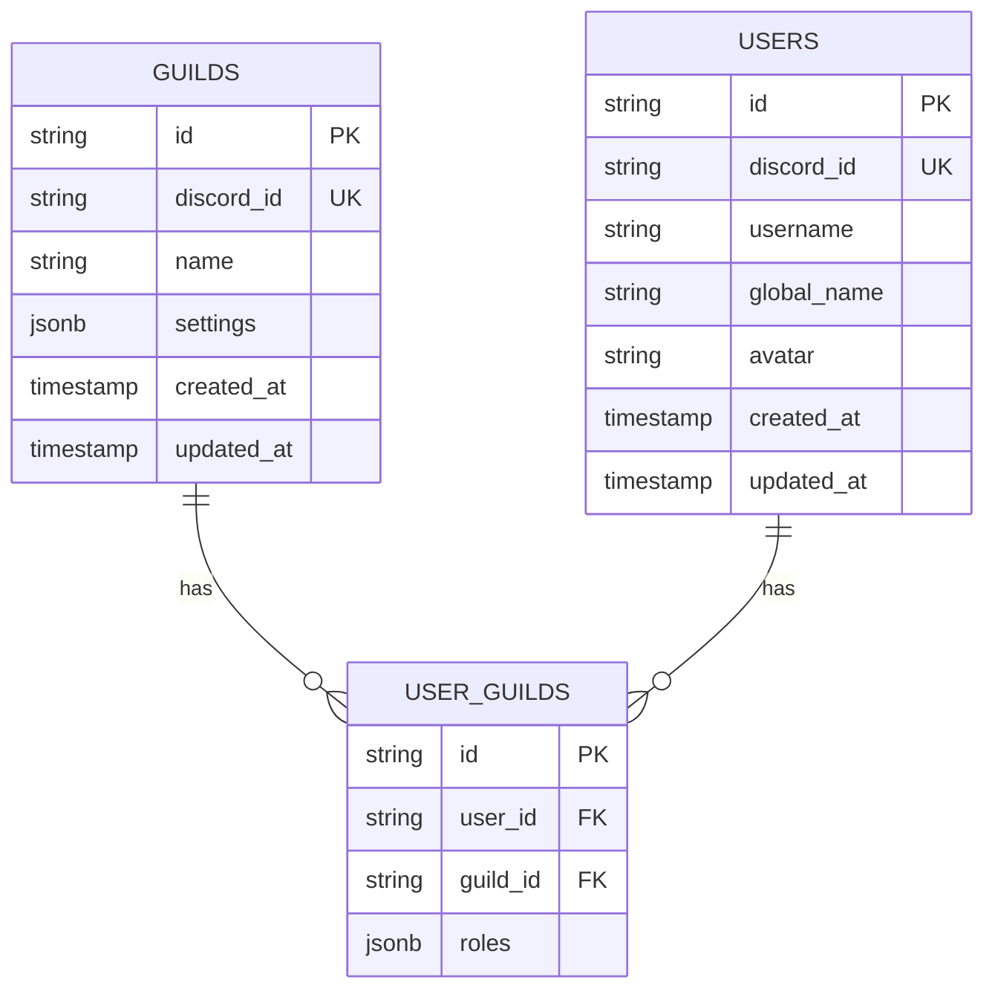
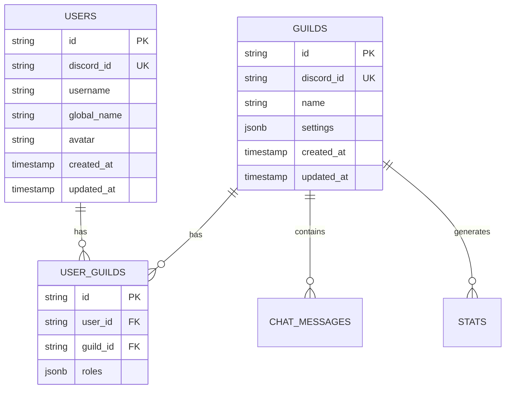
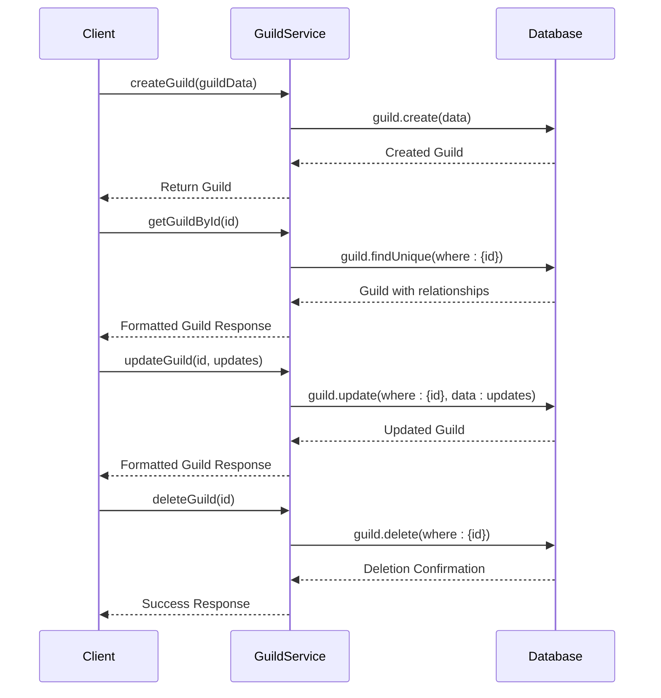
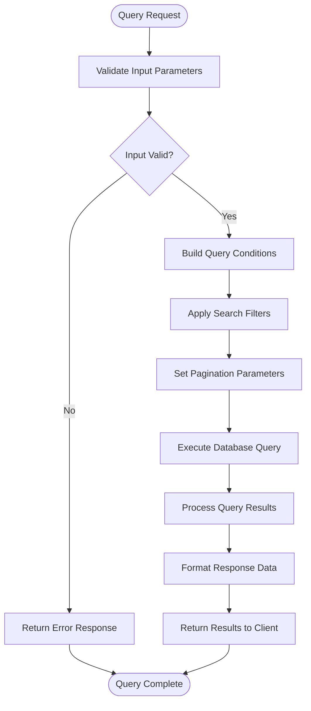
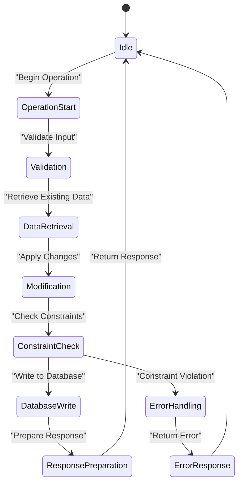

# Guild Data Model and Operations

<cite>
**Referenced Files in This Document**   
- [guild.service.ts](file://apps/admin-api/src/services/guild.service.ts)
- [migration.sql](file://apps/admin-api/prisma/migrations/20241106000000_init/migration.sql)
- [database.js](file://apps/admin-api/src/lib/database.js)
- [guilds.js](file://apps/admin-api/src/routes/guilds.js)
</cite>

## Table of Contents
1. [Introduction](#introduction)
2. [Data Model Structure](#data-model-structure)
3. [Relationships and Junction Tables](#relationships-and-junction-tables)
4. [CRUD Operations](#crud-operations)
5. [Query Patterns and Complex Queries](#query-patterns-and-complex-queries)
6. [Performance Considerations](#performance-considerations)
7. [Transaction Management and Data Consistency](#transaction-management-and-data-consistency)
8. [Conclusion](#conclusion)

## Introduction

The Guild entity is a core component of the application, serving as the primary organizational unit that connects users, settings, and various operational data. This documentation provides a comprehensive overview of the Guild data model, its relationships with other entities, and the operations that can be performed on it. The system is designed to support Discord guilds (servers) with rich functionality including member management, settings configuration, and analytics tracking.

The data model is implemented using Prisma ORM with a PostgreSQL backend, following a relational database design pattern. The Guild entity acts as a central hub that connects to users through the userGuild junction table, enabling many-to-many relationships between users and guilds. This design allows users to participate in multiple guilds while maintaining guild-specific roles and permissions.

This documentation covers the complete lifecycle of guild operations, from creation and retrieval to updates and deletion, along with advanced querying capabilities, performance optimization strategies, and data consistency requirements.

## Data Model Structure

The Guild entity is defined with a comprehensive set of fields that capture essential information about each guild, including identification, metadata, and configuration settings. The data model is designed to be both flexible and performant, supporting the application's requirements for scalability and efficient data retrieval.



**Diagram sources**
- [migration.sql](file://apps/admin-api/prisma/migrations/20241106000000_init/migration.sql#L26-L35)

**Section sources**
- [migration.sql](file://apps/admin-api/prisma/migrations/20241106000000_init/migration.sql#L26-L35)
- [guild.service.ts](file://apps/admin-api/src/services/guild.service.ts#L6-L604)

The Guild entity contains the following fields:

- **id**: A unique identifier for the guild (Primary Key, TEXT type)
- **discord_id**: The Discord platform identifier for the guild (Unique Key, TEXT type)
- **name**: The name of the guild (TEXT type, required)
- **settings**: A JSONB field storing guild-specific configuration options
- **created_at**: Timestamp of when the guild was created (TIMESTAMP with timezone)
- **updated_at**: Timestamp of the last update to the guild record (TIMESTAMP with timezone)

The primary key constraint is defined on the `id` field, ensuring each guild has a unique internal identifier. Additionally, a unique index is created on the `discord_id` field to prevent duplicate guilds from being created for the same Discord server. This design allows for efficient lookups by both internal ID and Discord ID, which is crucial for integration with the Discord API.

The `settings` field uses the JSONB data type, which provides flexibility for storing structured configuration data without requiring schema changes for new settings. This approach enables the application to evolve with new features and configuration options without database migrations. The JSONB type also supports indexing and querying of specific fields within the JSON structure, allowing for efficient filtering and retrieval based on specific settings.

## Relationships and Junction Tables

The Guild entity is connected to other core entities through well-defined relationships, with the userGuild junction table serving as the critical link between users and guilds. This many-to-many relationship design allows users to participate in multiple guilds while maintaining guild-specific roles and membership information.



**Diagram sources**
- [migration.sql](file://apps/admin-api/prisma/migrations/20241106000000_init/migration.sql#L37-L45)

**Section sources**
- [migration.sql](file://apps/admin-api/prisma/migrations/20241106000000_init/migration.sql#L37-L45)
- [guild.service.ts](file://apps/admin-api/src/services/guild.service.ts#L248-L369)

The userGuild junction table contains the following fields:

- **id**: A unique identifier for the user-guild relationship (Primary Key, TEXT type)
- **user_id**: Foreign key referencing the users table (TEXT type)
- **guild_id**: Foreign key referencing the guilds table (TEXT type)
- **roles**: A JSONB field storing the roles assigned to the user within this specific guild

The junction table has foreign key constraints on both `user_id` and `guild_id`, ensuring referential integrity between the related entities. Additionally, a composite unique index is defined on the combination of `user_id` and `guild_id` to prevent duplicate memberships. This constraint ensures that a user can only be a member of a particular guild once, with their roles stored in the same record.

The relationship design implements cascading deletes, meaning that when a guild is deleted, all associated userGuild records are automatically removed by the database. This ensures data consistency and prevents orphaned records in the junction table. Similarly, when a user is deleted, their memberships in all guilds are automatically removed.

The roles field in the userGuild table uses JSONB to store an array of role identifiers, allowing for flexible role-based access control. This design supports multiple roles per user and enables the application to implement complex permission systems based on role hierarchies and specific role requirements for different actions.

## CRUD Operations

The Guild entity supports a comprehensive set of CRUD (Create, Read, Update, Delete) operations through a well-defined service layer that encapsulates the business logic and data access patterns. These operations are exposed through API endpoints and can be performed programmatically through the service interface.



**Diagram sources**
- [guild.service.ts](file://apps/admin-api/src/services/guild.service.ts#L10-L243)
- [database.js](file://apps/admin-api/src/lib/database.js#L358-L389)

**Section sources**
- [guild.service.ts](file://apps/admin-api/src/services/guild.service.ts#L10-L243)
- [database.js](file://apps/admin-api/src/lib/database.js#L358-L389)

### Create Operation

The `createGuild` operation creates a new guild record in the database. It requires the `discordId` and `name` fields to be provided, with optional `settings` that default to an empty object if not specified. The operation uses Prisma's create method to insert a new record into the guilds table.

When a duplicate Discord ID is detected (due to the unique constraint), the operation throws a specific error indicating that a guild with that Discord ID already exists. This prevents the creation of duplicate guilds for the same Discord server.

### Read Operations

The Guild entity supports multiple read operations for retrieving guild data:

- `getGuildById`: Retrieves a guild by its internal ID, including associated members and counts of related entities
- `getGuildByDiscordId`: Retrieves a guild by its Discord platform ID, with the same included relationships
- `listGuilds`: Retrieves a paginated list of guilds with optional search filtering

These operations use Prisma's findUnique and findMany methods with appropriate include clauses to fetch related data in a single query, reducing the number of database round trips and improving performance.

### Update Operation

The `updateGuild` operation modifies existing guild records. It accepts updates to the `name` and/or `settings` fields, with validation to ensure that at least one field is being updated. The operation automatically updates the `updatedAt` timestamp to reflect when the record was last modified.

The update operation includes error handling for cases where the specified guild ID does not exist, throwing a "Guild not found" error in such cases. This ensures that clients receive meaningful feedback when attempting to update non-existent records.

### Delete Operation

The `deleteGuild` operation removes a guild record from the database. Due to the cascading delete constraint on the foreign key relationship, this operation automatically removes all associated userGuild records, ensuring data consistency.

The operation includes error handling for cases where the specified guild ID does not exist, throwing a "Guild not found" error. This prevents accidental deletion attempts on non-existent records and provides clear feedback to clients.

## Query Patterns and Complex Queries

The Guild data model supports a variety of query patterns for retrieving data, including simple lookups, filtered searches, pagination, and complex queries with multiple criteria. These patterns are implemented through the service layer and exposed via API endpoints.



**Diagram sources**
- [guild.service.ts](file://apps/admin-api/src/services/guild.service.ts#L112-L173)
- [database.js](file://apps/admin-api/src/lib/database.js#L324-L342)

**Section sources**
- [guild.service.ts](file://apps/admin-api/src/services/guild.service.ts#L112-L173)
- [database.js](file://apps/admin-api/src/lib/database.js#L324-L342)

### List Operation with Filtering and Pagination

The `listGuilds` operation supports comprehensive querying capabilities:

- **Pagination**: Results are paginated with configurable `limit` and `offset` parameters, with a maximum limit of 100 records per page to prevent excessive data transfer
- **Search Filtering**: The operation supports case-insensitive name searches using the `contains` operator with `mode: 'insensitive'`
- **Member Inclusion**: Clients can request inclusion of member data by setting `includeMembers = true`

The operation returns a structured response containing both the guild data and pagination metadata, including total count, current limit and offset, and a flag indicating whether more results are available.

### Member Management Queries

The system provides specialized queries for managing guild members:

- `getGuildMembers`: Retrieves members of a specific guild with optional search filtering by username or global name
- `getUserGuilds`: Retrieves all guilds a specific user belongs to, with their roles and join dates in each guild
- `addMember`: Adds a user to a guild with specified roles
- `updateMemberRoles`: Updates the roles of a user within a specific guild
- `removeMember`: Removes a user from a guild

These operations include comprehensive validation to ensure data integrity, checking for the existence of both the user and guild before creating or modifying relationships.

### Bulk Operations

The system supports bulk operations for efficient management of multiple records:

- `bulkAddMembers`: Adds multiple users to a guild in a single operation, with individual error handling for each member
- `bulkUpdateMemberRoles`: Updates roles for multiple users in a single operation
- `bulkRemoveMembers`: Removes multiple users from a guild in a single operation

These bulk operations process each record individually and return detailed results including both successful operations and any errors encountered, allowing clients to understand exactly what succeeded and what failed.

## Performance Considerations

The Guild data model and operations are designed with performance optimization in mind, addressing key concerns related to lookup efficiency, query optimization, and handling of large datasets. The system implements several strategies to ensure responsive performance even as data volumes grow.

```mermaid
graph TD
A[Guild Lookup Performance] --> B[Index on discord_id)
A --> C[Index on id)
A --> D[Query Optimization)
B --> E[Fast Discord ID Lookups]
C --> F[Fast Internal ID Lookups]
D --> G[Efficient Filtering)
D --> H[Optimal Pagination)
D --> I[Reduced Database Round Trips)
J[Large Dataset Handling] --> K[Result Limiting)
J --> L[Asynchronous Processing)
J --> M[Caching Strategies)
E --> N[Improved Response Times]
F --> N
G --> N
H --> N
I --> N
K --> O[Controlled Resource Usage)
L --> P[Non-blocking Operations)
M --> Q[Reduced Database Load)
```

**Diagram sources**
- [migration.sql](file://apps/admin-api/prisma/migrations/20241106000000_init/migration.sql#L89-L90)
- [guild.service.ts](file://apps/admin-api/src/services/guild.service.ts#L130-L131)
- [database.js](file://apps/admin-api/src/lib/database.js#L339-L340)

**Section sources**
- [migration.sql](file://apps/admin-api/prisma/migrations/20241106000000_init/migration.sql#L89-L90)
- [guild.service.ts](file://apps/admin-api/src/services/guild.service.ts#L130-L131)
- [database.js](file://apps/admin-api/src/lib/database.js#L339-L340)

### Indexing Strategy

The database schema includes strategic indexes to optimize query performance:

- A unique index on `guilds.discord_id` enables O(1) lookups when retrieving guilds by their Discord platform ID
- A primary key index on `guilds.id` enables efficient lookups by internal ID
- A composite unique index on `user_guilds(user_id, guild_id)` ensures fast validation of membership and prevents duplicates

These indexes are critical for maintaining performance as the dataset grows, particularly for the most common access patterns such as looking up guilds by Discord ID during integration with the Discord API.

### Query Optimization

The system implements several query optimization techniques:

- **Result Limiting**: Both the `listGuilds` and `getGuildMembers` operations enforce maximum limits (100 and 200 respectively) to prevent excessive data transfer and database load
- **Efficient Filtering**: Search operations use database-level filtering with case-insensitive matching, pushing the filtering work to the database rather than retrieving all records and filtering in application code
- **Batched Includes**: Related data is retrieved in a single query using Prisma's include functionality, reducing the number of database round trips
- **Count Optimization**: Total counts are retrieved using the database's count function rather than counting in application code, which is more efficient for large datasets

### Large Dataset Handling

For scenarios involving large guilds with many members, the system employs several strategies:

- **Pagination**: All list operations support pagination to avoid loading large datasets into memory at once
- **Selective Field Retrieval**: Queries retrieve only the necessary fields rather than all columns, reducing data transfer and memory usage
- **Asynchronous Processing**: Bulk operations process records sequentially with error isolation, preventing memory issues from large batch operations

These performance considerations ensure that the system remains responsive and scalable, even when managing large guilds with thousands of members.

## Transaction Management and Data Consistency

The Guild data model and operations are designed with data consistency as a primary concern, implementing appropriate transaction management patterns to ensure the integrity of related data across operations. While the current implementation relies primarily on database-level constraints, it provides a foundation for more complex transactional operations when needed.



**Diagram sources**
- [guild.service.ts](file://apps/admin-api/src/services/guild.service.ts#L17-L32)
- [database.js](file://apps/admin-api/src/lib/database.js#L358-L389)

**Section sources**
- [guild.service.ts](file://apps/admin-api/src/services/guild.service.ts#L17-L32)
- [database.js](file://apps/admin-api/src/lib/database.js#L358-L389)

### Data Consistency Requirements

The system enforces several data consistency requirements through database constraints:

- **Referential Integrity**: Foreign key constraints ensure that userGuild records always reference valid users and guilds
- **Uniqueness**: Unique constraints prevent duplicate guilds (by Discord ID) and duplicate memberships (by user-guild combination)
- **Cascading Deletes**: When a guild is deleted, all associated userGuild records are automatically removed, preventing orphaned records
- **Required Fields**: The schema enforces that critical fields like `discordId` and `name` are present for guild creation

These constraints are implemented at the database level to ensure consistency even in the event of application-level failures or concurrent operations.

### Error Handling and Rollback

The service layer implements comprehensive error handling to maintain data consistency:

- **Validation Errors**: Operations validate input parameters before proceeding, rejecting invalid requests early
- **Constraint Violation Handling**: Database constraint violations are caught and translated into meaningful application errors
- **Atomic Operations**: Individual operations are designed to be atomic, either completing fully or failing completely without leaving partial changes

For example, when creating a new guild, if a guild with the same Discord ID already exists, the operation fails with a specific error message rather than creating a duplicate. Similarly, when adding a member to a guild, if the user is already a member, the operation fails with a specific error rather than creating a duplicate membership record.

### Future Transaction Considerations

While the current implementation handles most consistency requirements through database constraints and atomic operations, there are scenarios where explicit transaction management might be beneficial:

- **Bulk Operations with All-or-Nothing Semantics**: Currently, bulk operations process records individually and report partial successes. In some cases, it might be desirable to have transactions that either succeed completely or fail entirely.
- **Complex Multi-Entity Updates**: Operations that need to update multiple related entities in a coordinated way could benefit from explicit transactions to ensure consistency.
- **Audit Logging with Data Changes**: Ensuring that data changes and audit log entries are written atomically could be achieved with transactions.

The current design provides a solid foundation for data consistency and could be extended to include explicit transaction management for more complex scenarios as requirements evolve.

## Conclusion

The Guild data model represents a well-designed, scalable solution for managing Discord guilds within the application. The entity structure, relationships, and operations have been carefully crafted to support the application's requirements while maintaining performance and data integrity.

Key strengths of the current implementation include:

- **Flexible Data Model**: The use of JSONB for settings allows for extensible configuration without requiring schema changes
- **Efficient Query Patterns**: Strategic indexing and optimized queries ensure responsive performance even with large datasets
- **Robust Data Consistency**: Database-level constraints and comprehensive error handling maintain data integrity
- **Comprehensive Operations**: A full set of CRUD operations with advanced querying capabilities supports diverse use cases

The system is well-positioned to handle current requirements and can be extended to support additional features as needed. The clear separation between the service layer and data access layer provides a solid foundation for future enhancements, including more sophisticated transaction management and additional optimization techniques.

For optimal performance and reliability, it is recommended to continue monitoring query performance, particularly for large guilds, and to consider implementing caching strategies for frequently accessed guild data. Additionally, the audit logging capabilities could be expanded to provide more detailed tracking of data changes over time.