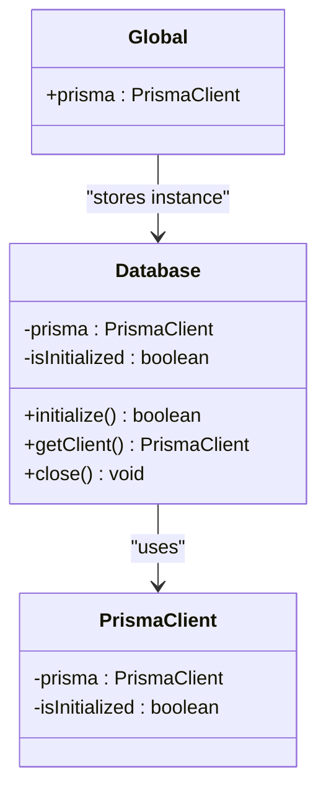
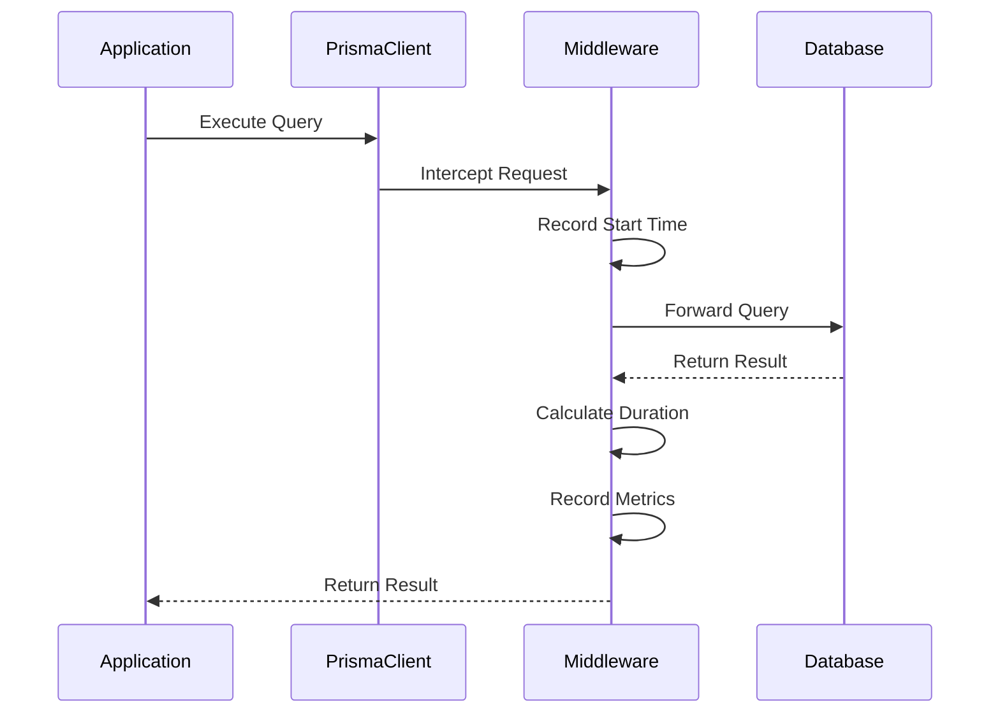
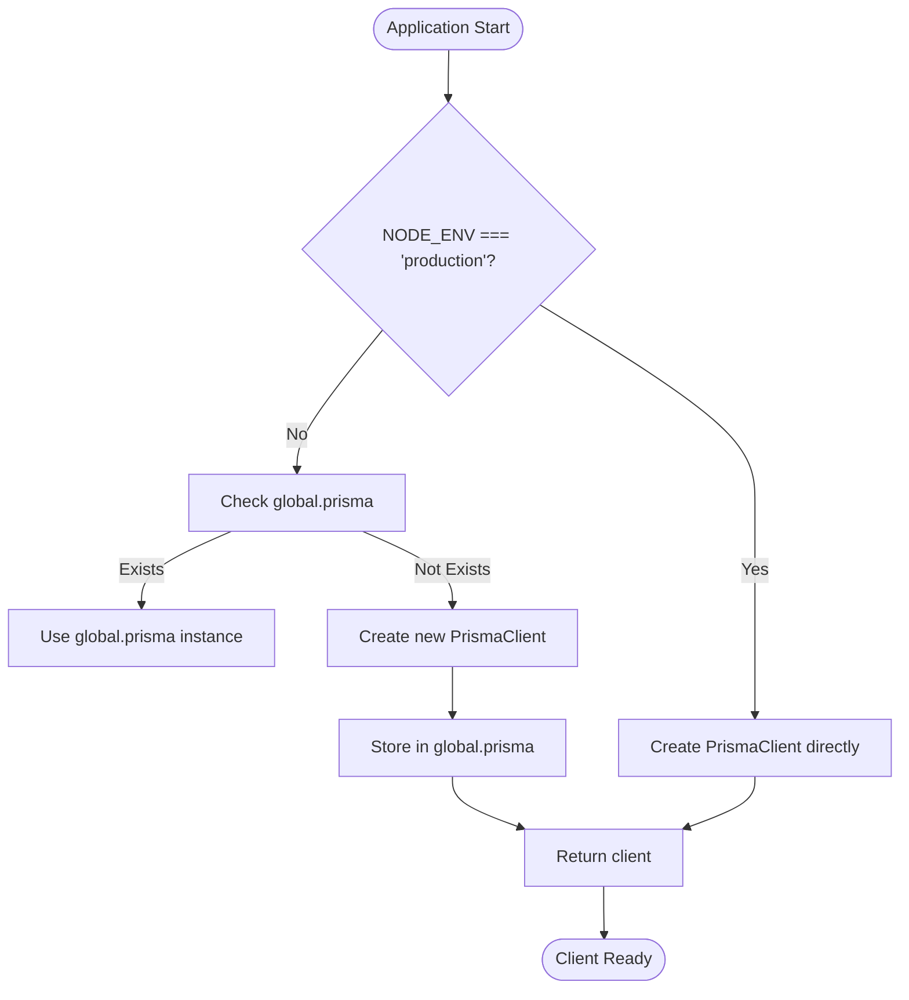

# Prisma Client Configuration

<cite>
**Referenced Files in This Document**   
- [db.ts](file://apps/web/lib/db.ts)
- [database.js](file://apps/admin-api/src/lib/database.js)
- [config/index.js](file://apps/admin-api/src/lib/config/index.js)
</cite>

## Table of Contents
1. [Introduction](#introduction)
2. [Singleton Pattern Implementation](#singleton-pattern-implementation)
3. [Connection Initialization Process](#connection-initialization-process)
4. [Logging Configuration](#logging-configuration)
5. [Middleware Integration for Query Metrics](#middleware-integration-for-query-metrics)
6. [Connection Pooling Strategy](#connection-pooling-strategy)
7. [Error Handling During Initialization](#error-handling-during-initialization)
8. [Graceful Disconnection Procedures](#graceful-disconnection-procedures)
9. [Client Instantiation Examples](#client-instantiation-examples)
10. [Health Checks and Connection Testing](#health-checks-and-connection-testing)
11. [Performance Implications](#performance-implications)

## Introduction
This document provides comprehensive architectural documentation for the Prisma client configuration system across the slimy-monorepo. The system implements robust database connectivity patterns with special consideration for development and production environments. The architecture includes singleton pattern implementation to prevent multiple instances during hot reload, sophisticated logging configuration based on environment, and middleware integration for comprehensive query metrics collection. The design addresses connection pooling strategies, error handling during initialization, and graceful disconnection procedures to ensure reliable database operations.

## Singleton Pattern Implementation
The Prisma client configuration implements a singleton pattern to ensure only one instance exists throughout the application lifecycle, preventing memory leaks and connection exhaustion during development hot reloads. In the web application, this is achieved through global variable storage in development environments, while production environments create a single instance directly.

The implementation uses a global declaration to store the Prisma client instance, allowing it to persist across hot reloads in development. When `NODE_ENV` is not production, the created client instance is assigned to `global.prisma`, ensuring subsequent module imports receive the same instance rather than creating a new one. This approach effectively prevents the creation of multiple Prisma client instances that could lead to connection pool exhaustion and memory leaks during development.

**Diagram sources**
- [db.ts](file://apps/web/lib/db.ts#L9-L35)
- [database.js](file://apps/admin-api/src/lib/database.js#L5-L68)

**Section sources**
- [db.ts](file://apps/web/lib/db.ts#L1-L83)
- [database.js](file://apps/admin-api/src/lib/database.js#L1-L662)

## Connection Initialization Process
The connection initialization process follows a structured approach to establish database connectivity with proper configuration and validation. The process begins with environment-specific configuration loading, followed by Prisma client instantiation with appropriate logging levels.

In the admin-api application, the Database class encapsulates the initialization logic within its `initialize()` method. This method first checks if the database is already initialized to prevent redundant operations. It then creates a new PrismaClient instance using configuration values from the central config module, specifically utilizing the `database.logLevel` setting which varies by environment.

After client instantiation, the system adds middleware for metrics collection and tests the connection using `$connect()`. Upon successful connection, it records the connection event in metrics and sets the `isInitialized` flag to true. The initialization process is designed to be idempotent, allowing safe repeated calls without creating multiple connections.

**Section sources**
- [database.js](file://apps/admin-api/src/lib/database.js#L11-L48)
- [config/index.js](file://apps/admin-api/src/lib/config/index.js#L157-L162)

## Logging Configuration
The logging configuration is environment-aware, providing detailed query logging in development while minimizing log output in production to maintain performance. The configuration is centralized in the config module, where the `database.logLevel` property is set based on the `NODE_ENV` environment variable.

In development environments, the logging level includes 'query', 'error', and 'warn' to provide comprehensive visibility into database operations, which aids in debugging and performance optimization. In production environments, the logging level is restricted to 'error' only, reducing the performance overhead and log volume while still capturing critical issues.

This environment-specific logging strategy balances the need for detailed operational visibility during development with the performance and security requirements of production systems. The configuration ensures that sensitive query information is not excessively logged in production, while providing developers with the detailed insights needed to optimize database interactions during development.

**Section sources**
- [config/index.js](file://apps/admin-api/src/lib/config/index.js#L157-L162)
- [db.ts](file://apps/web/lib/db.ts#L20-L23)

## Middleware Integration for Query Metrics
The system implements middleware integration to collect comprehensive query metrics, enabling performance monitoring and optimization. The middleware is attached to the Prisma client using the `$use()` method, which wraps all database operations with timing and error tracking functionality.

The middleware captures the start time of each query, calculates the duration upon completion, and records this information in the application's metrics system. It handles both successful queries and errors, ensuring that all database operations are accounted for in performance monitoring. For successful queries, it records the execution duration. For failed queries, it records the duration along with incrementing the error counter in the metrics system.

This approach provides granular visibility into database performance, allowing the team to identify slow queries, monitor overall database latency, and track error rates. The metrics collected include query duration, success/failure status, and are aggregated to provide insights into database performance trends over time.

**Diagram sources**
- [database.js](file://apps/admin-api/src/lib/database.js#L21-L36)
- [metrics.js](file://apps/admin-api/src/lib/monitoring/metrics.js#L79-L84)

**Section sources**
- [database.js](file://apps/admin-api/src/lib/database.js#L21-L36)
- [metrics.js](file://apps/admin-api/src/lib/monitoring/metrics.js#L79-L84)

## Connection Pooling Strategy
The connection pooling strategy is managed by Prisma Client internally, with configuration parameters optimized for the application's requirements. While the specific pooling configuration is not explicitly defined in the code, Prisma Client implements an efficient connection pooling mechanism by default, managing the lifecycle of database connections to optimize performance and resource utilization.

The system monitors connection pool usage through metrics collection, with the `recordDatabaseConnection()` function tracking connection count changes. When a client connects, the connection count is incremented, and when it disconnects, the count is decremented. This allows the application to monitor the number of active connections and ensure they remain within acceptable limits.

The singleton pattern implementation indirectly contributes to effective connection pooling by preventing the creation of multiple Prisma client instances, each of which would maintain its own connection pool. By ensuring only one client instance exists, the application maintains a single, efficiently managed connection pool rather than multiple pools that could lead to connection exhaustion.

**Section sources**
- [database.js](file://apps/admin-api/src/lib/database.js#L40-L41)
- [database.js](file://apps/admin-api/src/lib/database.js#L64-L66)

## Error Handling During Initialization
The error handling during initialization is designed to provide graceful degradation when database connectivity issues occur. The initialization process is wrapped in a try-catch block that captures any errors during client creation or connection establishment.

In the admin-api implementation, if initialization fails, the method returns false rather than throwing an exception, allowing the application to continue startup in a degraded state. This approach enables the system to operate in read-only mode or with limited functionality when the database is unavailable, rather than failing completely.

The error handling includes detailed logging of initialization failures, capturing the error message for diagnostic purposes. However, it avoids exposing sensitive information in error messages, particularly in production environments. The system distinguishes between configuration errors (which should halt startup) and transient connectivity issues (which may resolve themselves).

For the web application, the error handling occurs at the query level rather than initialization, with the `testDbConnection()` function providing a mechanism to check connectivity and handle errors appropriately. This allows the application to detect and respond to database issues without interrupting the overall application flow.

**Section sources**
- [database.js](file://apps/admin-api/src/lib/database.js#L45-L48)
- [db.ts](file://apps/web/lib/db.ts#L47-L54)

## Graceful Disconnection Procedures
The graceful disconnection procedures ensure that database connections are properly closed during application shutdown or when the database client is no longer needed. The system implements a dedicated `close()` method in the Database class and a `disconnectDb()` function in the web application that handle the disconnection process.

When disconnection is initiated, the system calls the Prisma client's `$disconnect()` method, which closes all active connections in the pool and cleans up resources. Before disconnecting, the system updates metrics to reflect the disconnection by decrementing the connection count. This ensures that monitoring systems have accurate information about the current connection state.

The disconnection process is designed to be idempotent, checking if a client instance exists before attempting to disconnect. This prevents errors when attempting to disconnect an already disconnected or uninitialized client. The procedure also resets internal state flags to indicate that the database is no longer initialized, preparing the client for potential reinitialization.

**Section sources**
- [database.js](file://apps/admin-api/src/lib/database.js#L62-L68)
- [db.ts](file://apps/web/lib/db.ts#L40-L42)

## Client Instantiation Examples
The client instantiation examples demonstrate the pattern used across the applications to create and access the Prisma client instance. In the web application, the pattern uses a global variable to store the client instance during development, preventing multiple instances during hot reload.

The instantiation process begins with checking for an existing instance in the global scope. If found, it is reused; otherwise, a new instance is created with environment-appropriate logging configuration. After creation, in development environments, the instance is stored in the global scope for reuse in subsequent imports.

In the admin-api application, client instantiation is encapsulated within the Database class, which manages the lifecycle of the Prisma client. The class provides a `getClient()` method that returns the initialized client, ensuring that consumers do not need to manage the client lifecycle directly.

**Diagram sources**
- [db.ts](file://apps/web/lib/db.ts#L27-L35)
- [database.js](file://apps/admin-api/src/lib/database.js#L16-L19)

**Section sources**
- [db.ts](file://apps/web/lib/db.ts#L1-L35)
- [database.js](file://apps/admin-api/src/lib/database.js#L1-L19)

## Health Checks and Connection Testing
The health checks and connection testing mechanisms provide reliable ways to verify database connectivity and measure response times. The web application implements two primary functions for this purpose: `testDbConnection()` and `getDbHealth()`.

The `testDbConnection()` function executes a simple SQL query (`SELECT 1`) to verify that the database is reachable and responsive. It returns a boolean indicating success or failure, with errors caught and logged appropriately. This function provides a basic connectivity check that can be used in various contexts, such as startup validation or periodic health monitoring.

The `getDbHealth()` function provides a more comprehensive health assessment by measuring response time in addition to connectivity. It records the start time before executing the test query and calculates the duration upon completion. The function returns an object containing a health status, response time in milliseconds, and any error message if the test failed. This allows consumers to not only determine if the database is available but also assess its performance characteristics.

Both functions use raw SQL queries through Prisma's `$queryRaw` method, which is a lightweight operation that minimizes the overhead of the health check while still verifying the end-to-end database connectivity.

**Section sources**
- [db.ts](file://apps/web/lib/db.ts#L47-L80)

## Performance Implications
The performance implications of the Prisma client configuration vary significantly between development and production environments, primarily due to the different logging levels and middleware overhead.

In development environments, the comprehensive logging configuration (including 'query' logging) and metrics middleware introduce noticeable overhead on database operations. Each query generates log output and triggers metrics collection, which can impact application responsiveness, particularly under high query volume. However, this overhead is considered acceptable in development as it provides valuable insights for optimization and debugging.

In production environments, the performance impact is minimized by restricting logging to 'error' level only and maintaining the metrics middleware, which has a relatively low overhead. The singleton pattern implementation prevents connection pool exhaustion and memory leaks that could severely impact performance during development hot reloads.

The middleware's impact on query latency is generally minimal, as it primarily involves timestamp operations and function calls to the metrics system. However, under extremely high load, even this small overhead could become significant. The system strikes a balance between observability and performance, providing sufficient metrics for monitoring while avoiding excessive overhead that could degrade user experience.

**Section sources**
- [db.ts](file://apps/web/lib/db.ts#L20-L23)
- [database.js](file://apps/admin-api/src/lib/database.js#L21-L36)
- [config/index.js](file://apps/admin-api/src/lib/config/index.js#L157-L162)