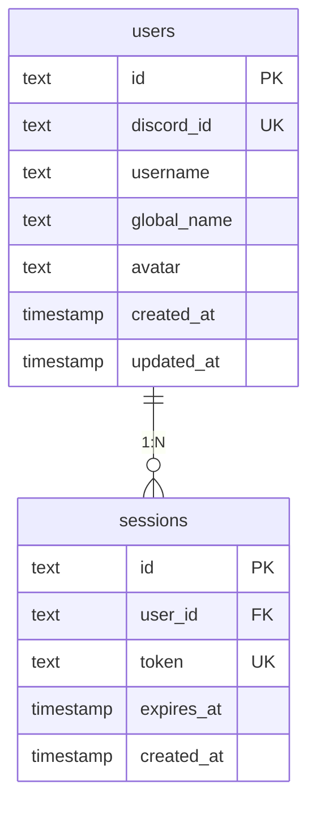
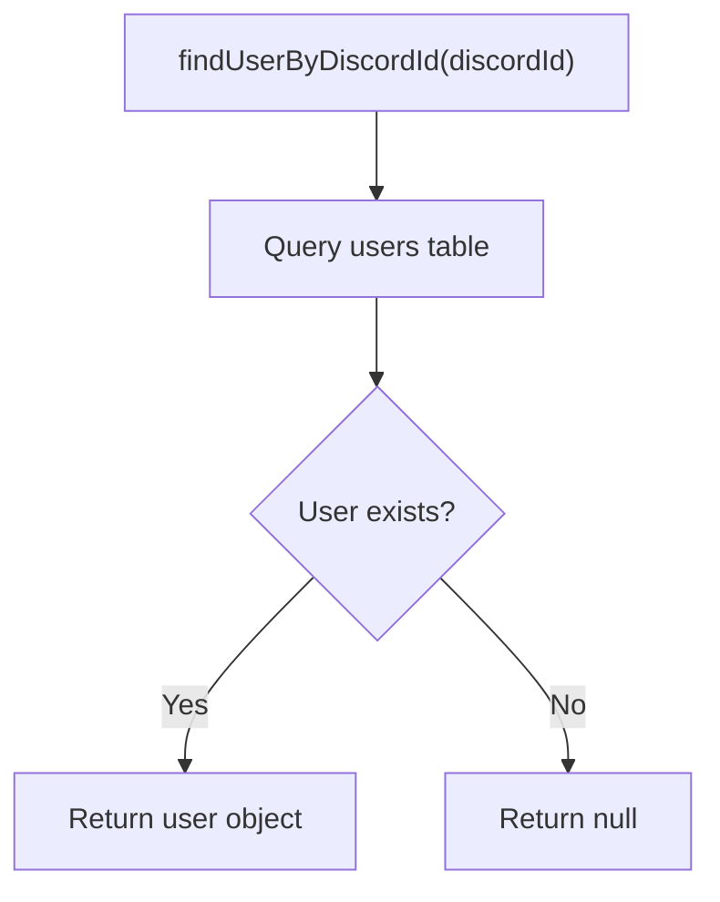
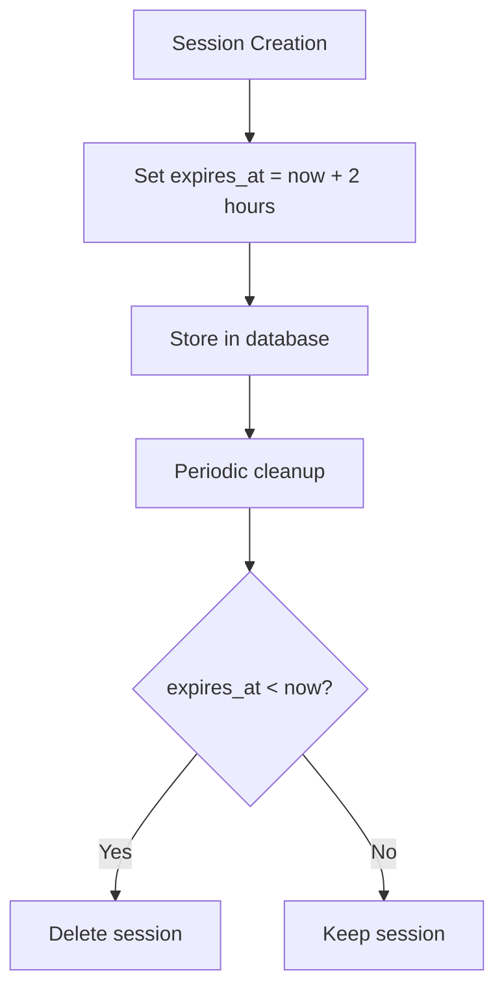
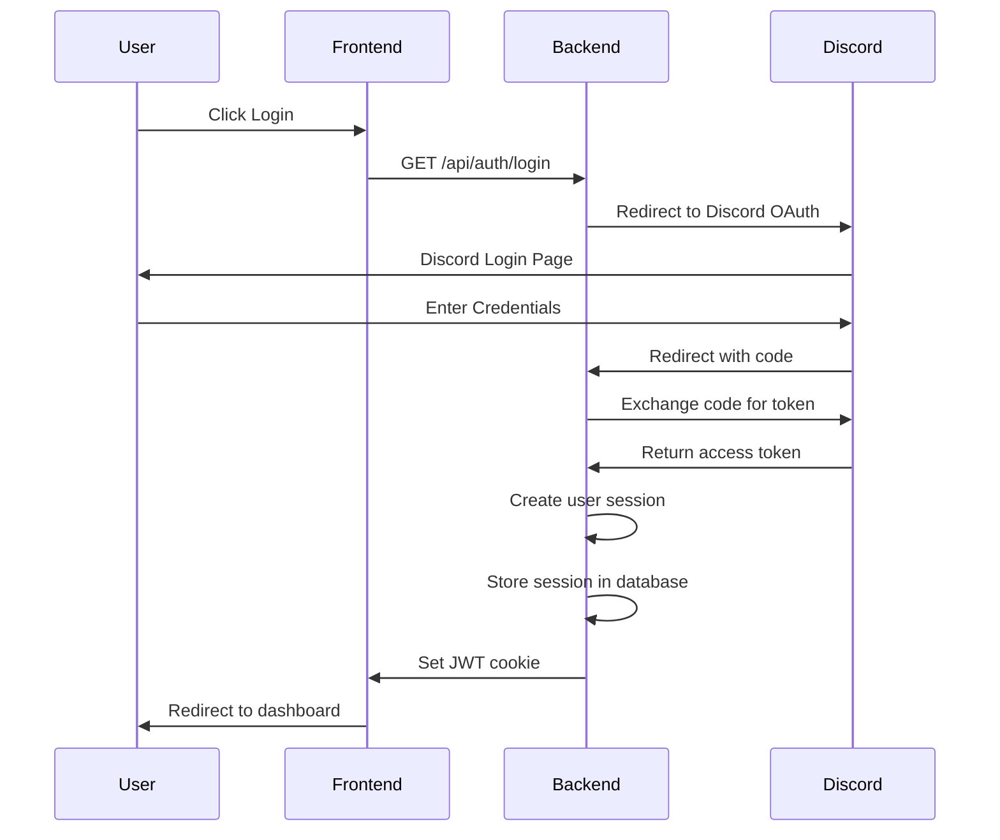
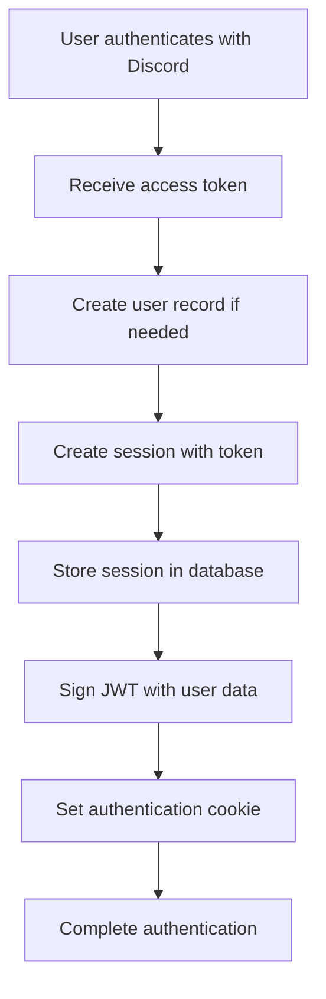
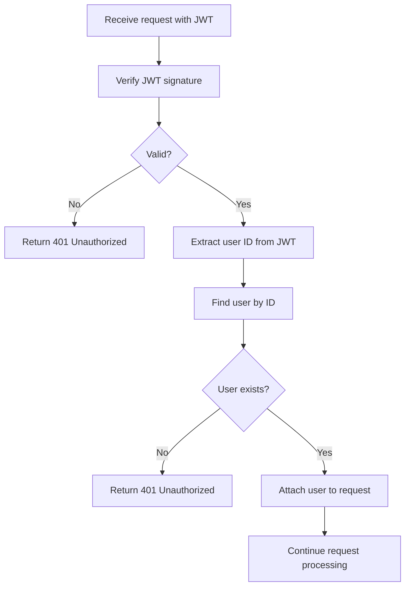
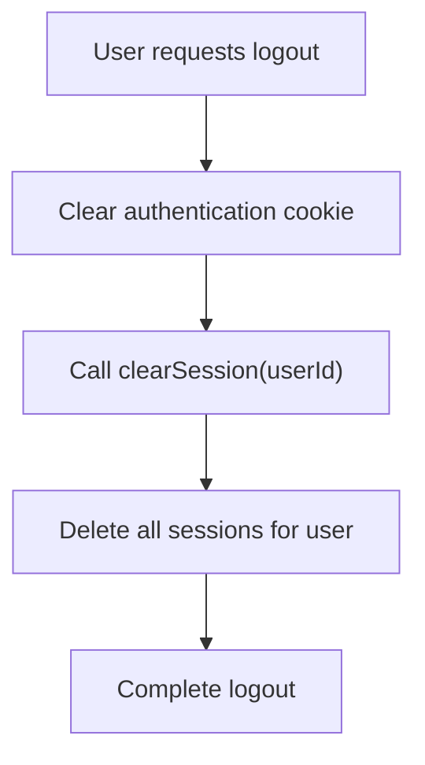
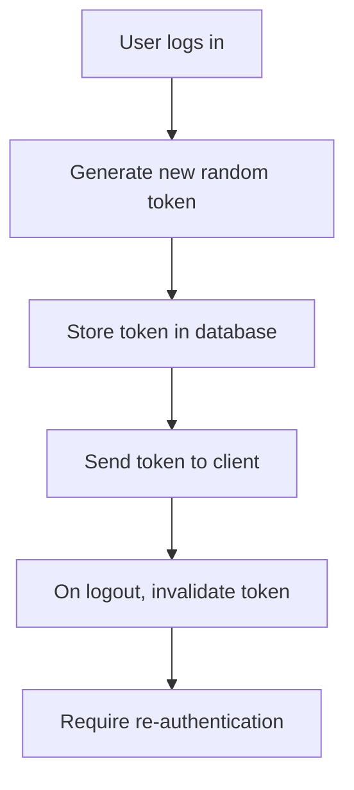

# User and Session Management

<cite>
**Referenced Files in This Document**   
- [migration.sql](file://apps/admin-api/prisma/migrations/20241106000000_init/migration.sql)
- [session-store.js](file://apps/admin-api/lib/session-store.js)
- [auth.js](file://apps/admin-api/src/routes/auth.js)
- [database.js](file://apps/admin-api/src/lib/database.js)
- [jwt.js](file://apps/admin-api/lib/jwt.js)
- [token.js](file://apps/admin-api/src/services/token.js)
- [auth.js](file://apps/admin-api/src/middleware/auth.js)
</cite>

## Table of Contents
1. [Introduction](#introduction)
2. [Data Model Overview](#data-model-overview)
3. [User Entity](#user-entity)
4. [Session Entity](#session-entity)
5. [Authentication Flow](#authentication-flow)
6. [Session Management](#session-management)
7. [Security Considerations](#security-considerations)
8. [Performance and Query Optimization](#performance-and-query-optimization)
9. [Data Retention and Audit](#data-retention-and-audit)
10. [Conclusion](#conclusion)

## Introduction
This document provides comprehensive documentation for the User and Session management system in the slimy-monorepo application. The system implements a robust authentication mechanism using Discord OAuth2, JWT tokens, and database-persisted sessions. The documentation covers the data models, authentication flows, session management, security considerations, and performance characteristics of the user and session entities.

**Section sources**
- [migration.sql](file://apps/admin-api/prisma/migrations/20241106000000_init/migration.sql)

## Data Model Overview



**Diagram sources**
- [migration.sql](file://apps/admin-api/prisma/migrations/20241106000000_init/migration.sql#L2-L23)

## User Entity

The User entity represents a Discord user within the application. Users are identified by their Discord ID and contain basic profile information.

### Field Definitions
- **id**: Primary key (TEXT) - Unique identifier for the user
- **discord_id**: Unique key (TEXT) - The user's Discord ID
- **username**: (TEXT) - The user's Discord username
- **global_name**: (TEXT) - The user's Discord global name
- **avatar**: (TEXT) - URL to the user's avatar image
- **created_at**: (TIMESTAMP) - When the user record was created
- **updated_at**: (TIMESTAMP) - When the user record was last updated

### User Lookup by Discord ID
The system provides a method to find users by their Discord ID through the database layer:



**Section sources**
- [migration.sql](file://apps/admin-api/prisma/migrations/20241106000000_init/migration.sql#L2-L12)
- [database.js](file://apps/admin-api/src/lib/database.js#L225-L231)

## Session Entity

The Session entity represents an authenticated user session in the system. Sessions are tied to users and contain authentication tokens with expiration times.

### Field Definitions
- **id**: Primary key (TEXT) - Unique identifier for the session
- **user_id**: Foreign key (TEXT) - References the user who owns this session
- **token**: Unique key (TEXT) - The session token used for authentication
- **expires_at**: (TIMESTAMP) - When the session expires
- **created_at**: (TIMESTAMP) - When the session was created

### Authentication Constraints
- Each session is associated with exactly one user via the user_id foreign key
- Session tokens must be unique across all sessions
- Sessions are automatically deleted when their associated user is deleted (CASCADE)
- The token field has a unique constraint to prevent duplicate tokens

### Expiration Mechanisms
Sessions have a fixed expiration time of 2 hours from creation, as defined in the session store:

```javascript
const MAX_AGE = 2 * 60 * 60 * 1000; // 2 hours for better security
```

The expiration time is stored in the expires_at field and is used to determine session validity.



**Section sources**
- [migration.sql](file://apps/admin-api/prisma/migrations/20241106000000_init/migration.sql#L15-L23)
- [session-store.js](file://apps/admin-api/lib/session-store.js#L6)

## Authentication Flow

The authentication system uses Discord OAuth2 to authenticate users and create sessions.



### Session Creation with Token-Based Authentication
When a user successfully authenticates via Discord OAuth, the system creates a session:



The session creation process extracts the token from the OAuth response and stores it in the database with an expiration time.

**Section sources**
- [auth.js](file://apps/admin-api/src/routes/auth.js#L121-L374)
- [session-store.js](file://apps/admin-api/lib/session-store.js#L18-L38)

## Session Management

### Session Validation with User Inclusion
The system validates sessions by checking the JWT token and retrieving the associated user:



The middleware resolves the user from the JWT token and attaches it to the request object for use by subsequent handlers.

### Cleanup Procedures for Expired Sessions
The system automatically cleans up expired sessions through a periodic task:

```javascript
// Clean up expired sessions every hour
setInterval(async () => {
  try {
    await database.deleteExpiredSessions();
  } catch (err) {
    console.error('[session-store] Failed to cleanup expired sessions');
  }
}, 60 * 60 * 1000);
```

The cleanup process queries the database for sessions where the expires_at timestamp is in the past and removes them.

### User Session Invalidation
When a user logs out, all their sessions are invalidated:



The `clearSession` function deletes all sessions associated with the user from the database.

**Section sources**
- [session-store.js](file://apps/admin-api/lib/session-store.js#L8-L16)
- [auth.js](file://apps/admin-api/src/routes/auth.js#L392-L398)
- [database.js](file://apps/admin-api/src/lib/database.js#L284-L290)

## Security Considerations

### Secure Session Management Patterns
The system implements several security best practices:

- **Short session duration**: Sessions expire after 2 hours
- **HTTP-only cookies**: Authentication cookies are marked as HTTP-only
- **Secure cookies**: Cookies are marked as secure in production
- **SameSite protection**: Cookies use SameSite=Lax to prevent CSRF
- **Token uniqueness**: Session tokens are unique and cannot be duplicated

### Token Handling
Tokens are handled securely throughout the system:

- Tokens are stored in the database with a unique constraint
- Tokens are transmitted via HTTPS only
- Tokens are validated with cryptographic signatures
- Old tokens are invalidated upon logout

### Protection Against Session Fixation
The system protects against session fixation attacks by:

- Using randomly generated tokens via nanoid
- Not allowing session ID manipulation
- Invalidating all sessions on logout
- Using short session durations



**Section sources**
- [session-store.js](file://apps/admin-api/lib/session-store.js)
- [jwt.js](file://apps/admin-api/lib/jwt.js)
- [token.js](file://apps/admin-api/src/services/token.js)

## Performance and Query Optimization

### Session Lookup Performance
The system is optimized for efficient session lookups:

- **Index on token**: The sessions.token field has a unique index for fast lookups
- **Index on user_id**: The sessions.user_id field is indexed for user-based queries
- **Foreign key constraint**: The user_id field has a foreign key constraint with cascade delete

The database schema includes these indexes:
```sql
CREATE UNIQUE INDEX "sessions_token_key" ON "sessions"("token");
```

### Impact of Foreign Key Relationships
The foreign key relationship between sessions and users ensures data integrity but has performance implications:

- **Insert performance**: Creating a session requires a foreign key check
- **Delete performance**: Deleting a user automatically deletes all sessions (CASCADE)
- **Query performance**: Joining sessions with users is efficient due to indexing

The foreign key is defined as:
```sql
ALTER TABLE "sessions" ADD CONSTRAINT "sessions_user_id_fkey" FOREIGN KEY ("user_id") REFERENCES "users"("id") ON DELETE CASCADE ON UPDATE CASCADE;
```

**Section sources**
- [migration.sql](file://apps/admin-api/prisma/migrations/20241106000000_init/migration.sql)
- [database.js](file://apps/admin-api/src/lib/database.js)

## Data Retention and Audit

### Data Retention Policy for Expired Sessions
Expired sessions are automatically cleaned up by the system:

- Sessions are deleted when they expire (2 hours from creation)
- No manual cleanup is required
- The cleanup process runs hourly
- Deleted sessions cannot be recovered

The retention period is fixed at 2 hours, after which session data is permanently removed.

### Audit Implications of Session Operations
While the current system doesn't explicitly log session operations, the architecture supports audit capabilities:

- Session creation is logged in the application logs
- Session deletion on logout is logged
- Failed authentication attempts are logged
- The system could be extended to log all session operations

The database layer includes audit logging capabilities that could be extended to cover session operations.

**Section sources**
- [session-store.js](file://apps/admin-api/lib/session-store.js#L8-L16)
- [database.js](file://apps/admin-api/src/lib/database.js)

## Conclusion
The User and Session management system provides a secure and efficient authentication mechanism for the application. By leveraging Discord OAuth2, JWT tokens, and database-persisted sessions, the system ensures secure user authentication while maintaining performance and scalability. The 2-hour session duration balances security with user convenience, and the automatic cleanup of expired sessions ensures the database remains efficient. The system follows security best practices including HTTP-only cookies, secure transmission, and protection against common attacks like session fixation.