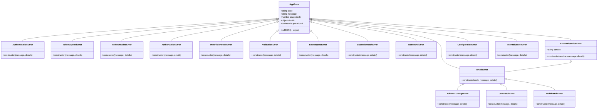

# Error Handling Strategy

<cite>
**Referenced Files in This Document**   
- [ERROR_HANDLING.md](file://apps/admin-api/ERROR_HANDLING.md)
- [errors.js](file://apps/admin-api/src/lib/errors.js)
- [error-handler.js](file://apps/admin-api/src/middleware/error-handler.js)
- [api-gateway.js](file://apps/admin-api/src/lib/api-gateway.js)
- [logger.js](file://apps/admin-api/src/lib/logger.js)
- [auth.js](file://apps/admin-api/src/middleware/auth.js)
- [app.js](file://apps/admin-api/src/app.js)
- [sentry.js](file://apps/admin-api/src/lib/sentry.js)
- [sentry.js](file://apps/admin-api/src/lib/monitoring/sentry.js)
- [index.js](file://apps/admin-api/src/routes/index.js)
</cite>

## Table of Contents
1. [Introduction](#introduction)
2. [Centralized Error Handling with apiHandler](#centralized-error-handling-with-apihandler)
3. [Custom Error Classes and Hierarchy](#custom-error-classes-and-hierarchy)
4. [Middleware Execution Order in API Gateway Pattern](#middleware-execution-order-in-api-gateway-pattern)
5. [Error Propagation Through the System](#error-propagation-through-the-system)
6. [Error Handling in Route Handlers and Asynchronous Operations](#error-handling-in-route-handlers-and-asynchronous-operations)
7. [Logging Strategies for Different Error Types](#logging-strategies-for-different-error-types)
8. [Monitoring Integration](#monitoring-integration)
9. [Creating New Error Types and Handling Edge Cases](#creating-new-error-types-and-handling-edge-cases)
10. [User-Facing Error Response Format](#user-facing-error-response-format)
11. [Security Considerations](#security-considerations)

## Introduction
The error handling strategy in the slimy-monorepo is designed to provide a consistent, structured approach to error management across the admin-api service. This strategy ensures that errors are properly categorized, logged, and communicated to clients in a standardized format. The implementation leverages a centralized error handling mechanism using the `apiHandler` wrapper function, custom error classes with a well-defined hierarchy, and comprehensive logging with monitoring integration. This document details the implementation of this strategy, focusing on how errors are handled throughout the system, from route handlers to middleware and monitoring services.

**Section sources**
- [ERROR_HANDLING.md](file://apps/admin-api/ERROR_HANDLING.md)

## Centralized Error Handling with apiHandler
The `apiHandler` function serves as the central mechanism for consistent error handling across route handlers in the admin-api service. This wrapper function ensures that all route handlers follow a uniform pattern for error handling, response formatting, and logging. The `apiHandler` is defined in `src/lib/errors.js` and takes a route handler function and optional configuration options as parameters. It returns an Express middleware function that wraps the provided handler, catching any errors that occur during execution and forwarding them to the global error handler middleware.

The `apiHandler` function accepts two configuration options: `routeName` for logging purposes and `errorMapper` for custom error mapping. When an error occurs within the wrapped handler, the `apiHandler` first applies any provided error mapping function. If the error mapper returns a mapped error, it is re-thrown to be handled by the global error handler. If the mapper returns false, null, or undefined, the default error handling process continues. The function then logs the error with route context and re-throws the error to allow the global error handler to format and send the appropriate response to the client.


**Diagram sources**
- [errors.js](file://apps/admin-api/src/lib/errors.js#L190-L228)
- [error-handler.js](file://apps/admin-api/src/middleware/error-handler.js#L10-L42)

**Section sources**
- [errors.js](file://apps/admin-api/src/lib/errors.js#L190-L228)

## Custom Error Classes and Hierarchy
The error handling strategy implements a comprehensive hierarchy of custom error classes that extend the base `AppError` class. These classes are organized by HTTP status code categories and specific error types, providing a standardized way to represent different kinds of errors throughout the application. The error classes are defined in `src/lib/errors.js` and exported for use across the codebase.

The hierarchy begins with the `AppError` base class, which provides common properties and methods for all application errors. This includes the error code, message, HTTP status code, details object, and a flag indicating whether the error is operational. The base class also implements a `toJSON` method that formats the error for serialization in API responses.

Specialized error classes are organized into categories based on their HTTP status codes:
- **Authentication Errors (401)**: `AuthenticationError`, `TokenExpiredError`, `RefreshFailedError`
- **Authorization Errors (403)**: `AuthorizationError`, `InsufficientRoleError`
- **Validation Errors (400)**: `ValidationError`, `BadRequestError`, `StateMismatchError`
- **Not Found Errors (404)**: `NotFoundError`
- **External Service Errors (502)**: `ExternalServiceError`, `OAuthError`, `TokenExchangeError`, `UserFetchError`, `GuildFetchError`
- **Configuration Errors (503)**: `ConfigurationError`
- **Internal Server Errors (500)**: `InternalServerError`

Each error class sets appropriate default values for the error code, message, and status code, while allowing customization through constructor parameters. This hierarchy enables precise error categorization and consistent handling across the application.



**Diagram sources**
- [errors.js](file://apps/admin-api/src/lib/errors.js#L6-L252)

**Section sources**
- [errors.js](file://apps/admin-api/src/lib/errors.js#L6-L252)

## Middleware Execution Order in API Gateway Pattern
The API Gateway pattern in the admin-api service implements a structured middleware pipeline that processes requests in a specific order before they reach route handlers. This pattern is implemented in `src/lib/api-gateway.js` and provides a centralized way to handle cross-cutting concerns such as rate limiting, authentication, validation, and logging. The middleware execution order is critical to the proper functioning of the error handling strategy, as it ensures that errors are caught and handled at the appropriate level.

The middleware pipeline is constructed using the `ApiGateway` class, which maintains a stack of middleware functions that are executed in the order they are added. Global middleware is applied to all routes, while route-specific middleware is applied only to matching route patterns. The pipeline begins with request ID generation and logging, followed by authentication and authorization checks, then validation, and finally the route handlers themselves.

The error handling middleware is positioned at the end of the pipeline, ensuring that it can catch errors from all preceding middleware and route handlers. The 404 handler is placed before the error handler to catch requests to undefined routes. This ordering is crucial because Express middleware is executed in the order it is registered, and error handling middleware must be registered after all other middleware and routes.

The API Gateway pattern also supports route-specific middleware, allowing different error handling strategies for different API endpoints. For example, authentication routes might have different rate limiting or validation requirements than guild management routes. This flexibility enables fine-grained control over error handling behavior while maintaining a consistent overall strategy.


**Diagram sources**
- [api-gateway.js](file://apps/admin-api/src/lib/api-gateway.js#L21-L149)
- [app.js](file://apps/admin-api/src/app.js#L14-L63)

**Section sources**
- [api-gateway.js](file://apps/admin-api/src/lib/api-gateway.js#L21-L149)

## Error Propagation Through the System
Error propagation in the admin-api service follows a well-defined path from the point of error occurrence to the final client response. This propagation mechanism ensures that errors are properly handled, logged, and communicated to clients in a consistent manner. The process begins when an error is thrown within a route handler or middleware function and ends with the standardized error response being sent to the client.

When an error occurs within a route handler wrapped by the `apiHandler` function, it is first caught by the handler's try-catch block. The `apiHandler` then applies any configured error mapping function, logs the error with route context, and re-throws the error to allow the global error handler middleware to process it. This two-step process ensures that route-specific error handling logic can be applied before the error reaches the global handler.

The global error handler middleware, defined in `src/middleware/error-handler.js`, receives the error and performs several key operations. First, it determines whether the error is operational (expected) or non-operational (unexpected). Operational errors are those that extend the `AppError` class and represent expected error conditions such as validation failures or authentication issues. Non-operational errors are wrapped in an `InternalServerError` to prevent sensitive information from being exposed to clients.

The error handler then determines the appropriate HTTP status code based on the error's `statusCode` property, with a default of 500 for internal server errors. It formats the error response using the `formatErrorResponse` function, which includes the error code, message, request ID, and optional details. In development mode, stack traces are included in the response to aid debugging, but they are omitted in production for security reasons.

Finally, the formatted error response is sent to the client with the appropriate status code. The response follows the standardized format defined in the error handling strategy, ensuring consistency across all API endpoints.


**Diagram sources**
- [errors.js](file://apps/admin-api/src/lib/errors.js#L190-L228)
- [error-handler.js](file://apps/admin-api/src/middleware/error-handler.js#L10-L42)

**Section sources**
- [error-handler.js](file://apps/admin-api/src/middleware/error-handler.js#L10-L42)

## Error Handling in Route Handlers and Asynchronous Operations
Error handling in route handlers and asynchronous operations follows a consistent pattern that leverages the centralized error handling mechanism provided by the `apiHandler` wrapper function. Route handlers are typically defined as asynchronous functions that are wrapped with `apiHandler` to ensure proper error handling. This approach eliminates the need for repetitive try-catch blocks in each route handler and ensures that all errors are processed through the same error handling pipeline.

In route handlers, errors are typically thrown using the custom error classes defined in `src/lib/errors.js`. For example, a route that retrieves a guild might throw a `NotFoundError` if the specified guild does not exist. The error is then caught by the `apiHandler` wrapper, which logs the error and forwards it to the global error handler middleware. This pattern allows route handlers to focus on business logic while delegating error handling to the centralized system.

For asynchronous operations, such as database queries or external API calls, the error handling strategy relies on JavaScript's native promise rejection mechanism. When an asynchronous operation fails, it returns a rejected promise, which is automatically caught by the `apiHandler` wrapper's try-catch block. This ensures that errors from asynchronous operations are handled in the same way as synchronous errors, maintaining consistency across the application.

The `asyncHandler` function, also defined in `src/middleware/error-handler.js`, provides an alternative approach for wrapping route handlers. It uses Promise.resolve().catch() to catch errors from asynchronous handlers and forward them to the next middleware function. This approach is particularly useful for route handlers that are not wrapped with `apiHandler` but still need to participate in the centralized error handling system.


**Section sources**
- [errors.js](file://apps/admin-api/src/lib/errors.js#L190-L228)
- [error-handler.js](file://apps/admin-api/src/middleware/error-handler.js#L70-L73)

## Logging Strategies for Different Error Types
The logging strategy in the admin-api service is designed to provide comprehensive, structured logs that facilitate debugging and monitoring. The implementation uses Pino, a high-performance logging library, to produce JSON-formatted logs in production and pretty-printed logs in development. The logging strategy is configured in `src/lib/logger.js` and includes specialized handling for different error types based on their severity and operational nature.

The structured logging approach includes several key components: request ID tracking, contextual information, and appropriate log levels. Every log entry includes a unique request ID, which is generated by the request ID middleware and used to correlate logs across different parts of the system. This enables tracing a request's path through the application and identifying the root cause of issues.

For error logging, the strategy differentiates between client errors (4xx) and server errors (5xx). Client errors, such as validation failures or authentication issues, are logged at the warning level, as they typically represent expected error conditions that do not indicate a problem with the service itself. Server errors, such as internal server errors or external service failures, are logged at the error level, as they indicate unexpected issues that require investigation.

The logging strategy also includes contextual information with each log entry, such as the request method, path, query parameters, request body, and user ID. This context is invaluable for debugging and understanding the circumstances surrounding an error. In production, the logs are formatted as JSON to facilitate parsing by log aggregation tools, while in development they are pretty-printed for easier human readability.

```mermaid
flowchart TD
A[Error Occurs] --> B{Error Type}
B --> |Client Error 4xx| C[Log at Warning Level]
B --> |Server Error 5xx| D[Log at Error Level]
C --> E[Include Context: Request ID, Method, Path, User]
D --> E
E --> F[Add Error Details: Name, Message, Code, Stack]
F --> G[Format as JSON (Production) or Pretty (Development)]
G --> H[Output to Log Stream]
```

**Diagram sources**
- [logger.js](file://apps/admin-api/src/lib/logger.js#L88-L158)

**Section sources**
- [logger.js](file://apps/admin-api/src/lib/logger.js#L88-L158)

## Monitoring Integration
The error handling strategy integrates with monitoring systems to provide real-time visibility into application health and error patterns. The primary monitoring integration is with Sentry, a popular error tracking and performance monitoring platform. This integration is configured in `src/lib/sentry.js` and `src/lib/monitoring/sentry.js`, with the latter using configuration from the application's config system.

The Sentry integration is initialized when the application starts, provided that a Sentry DSN (Data Source Name) is configured in the environment variables. The integration includes several key components: error tracking, performance monitoring, and request context capture. Error tracking automatically captures and reports unhandled exceptions and promise rejections, while performance monitoring tracks request durations and identifies performance bottlenecks.

The integration includes a beforeSend filter that prevents certain types of errors from being reported to Sentry. Specifically, client errors (4xx) and timeout errors are filtered out, as they typically represent expected error conditions that do not require immediate attention. This reduces noise in the error tracking system and focuses attention on genuine issues.

The monitoring integration also captures request context, including the user ID, request ID, HTTP method, and path. This context is invaluable for debugging and understanding the circumstances surrounding an error. Additionally, the integration supports custom error and message capture through utility functions like `captureError` and `captureMessage`, allowing developers to report specific issues or events to Sentry.

Performance monitoring is enabled with configurable sampling rates, capturing 10% of transactions in production and 100% in development. This provides insight into application performance without incurring excessive costs or performance overhead.


**Diagram sources**
- [sentry.js](file://apps/admin-api/src/lib/sentry.js#L7-L156)
- [sentry.js](file://apps/admin-api/src/lib/monitoring/sentry.js#L8-L148)

**Section sources**
- [sentry.js](file://apps/admin-api/src/lib/sentry.js#L7-L156)

## Creating New Error Types and Handling Edge Cases
Creating new error types in the admin-api service follows a consistent pattern that extends the existing error hierarchy. New error types should extend the appropriate base class from `src/lib/errors.js`, typically `AppError` or one of its specialized subclasses. When creating a new error type, developers should consider the HTTP status code that best represents the error condition, the error code that will be used in API responses, and the default error message.

To create a new error type, a new class is defined that extends the appropriate base class and sets the default values for the error code, message, and status code. For example, to create a new rate limiting error, a developer might define a `RateLimitError` class that extends `AppError` with a status code of 429 (Too Many Requests) and an appropriate error code and message.

When handling edge cases in error handling, several considerations are important. First, non-operational errors (those that do not extend `AppError`) should be wrapped in an `InternalServerError` to prevent sensitive information from being exposed to clients. Second, stack traces should only be included in error responses in development mode, as they can reveal implementation details that could be exploited in production.

Another edge case is handling errors that occur during error handling itself. The error handling middleware is designed to be robust and avoid throwing errors during error processing. If an error occurs while formatting or sending an error response, the middleware falls back to a basic error response to ensure that the client receives some indication of the failure.

Finally, when creating new error types, developers should ensure that the error code is unique and descriptive, the message is user-friendly, and the details object (if used) contains only non-sensitive information that could be helpful for debugging.


**Section sources**
- [errors.js](file://apps/admin-api/src/lib/errors.js#L6-L252)

## User-Facing Error Response Format
The user-facing error response format in the admin-api service is standardized to ensure consistency across all API endpoints. This format is defined in the `formatErrorResponse` function in `src/lib/errors.js` and is used by the global error handler middleware to construct error responses. The standardized format makes it easier for client applications to handle errors consistently and provides a better user experience by delivering clear, actionable error messages.

The error response follows a JSON structure with the following properties:
- `ok`: A boolean indicating that the request was not successful (always false for error responses)
- `error`: An object containing error details with the following properties:
  - `code`: A machine-readable error code that identifies the specific error type
  - `message`: A user-friendly error message that explains the error in human-readable terms
  - `requestId`: The unique request ID that can be used for debugging and support
  - `details`: An optional object containing additional context-specific information
  - `stack`: In development mode only, the stack trace of the error

The error code is derived from the error object's `code` property, with a default of "SERVER_ERROR" if no code is provided. The message is taken from the error's `message` property, with a default of "An unexpected error occurred" if no message is provided. The request ID is included in all error responses to enable request tracking and debugging.

In development mode, the response includes the error's stack trace to aid debugging. However, in production, the stack trace is omitted for security reasons, as it could reveal implementation details that could be exploited. This difference in behavior is controlled by the `NODE_ENV` environment variable.

The standardized error response format is used for all errors, whether they are thrown by route handlers, middleware, or the application itself. This consistency ensures that client applications can rely on a predictable error structure, making it easier to implement robust error handling on the client side.


**Diagram sources**
- [errors.js](file://apps/admin-api/src/lib/errors.js#L157-L179)
- [error-handler.js](file://apps/admin-api/src/middleware/error-handler.js#L10-L42)

**Section sources**
- [errors.js](file://apps/admin-api/src/lib/errors.js#L157-L179)

## Security Considerations
The error handling strategy in the admin-api service incorporates several security considerations to prevent information disclosure and protect against potential attacks. These considerations are particularly important in production environments where error responses could reveal sensitive information about the application's implementation or infrastructure.

One of the primary security measures is the omission of stack traces in error responses in production mode. While stack traces are invaluable for debugging during development, they can reveal implementation details such as file paths, function names, and code structure that could be exploited by attackers. The error handling system automatically includes stack traces only when `NODE_ENV` is set to "development", ensuring that they are never exposed in production.

Another security consideration is the handling of non-operational errors. Errors that do not extend the `AppError` class are considered non-operational and are wrapped in an `InternalServerError` before being sent to the client. This prevents potentially sensitive information from being exposed in error messages, such as database connection details or file system paths that might be included in raw error objects.

The error response format is also designed to minimize information disclosure. While the `details` property can include additional context-specific information, it should only contain non-sensitive data that is helpful for debugging. Sensitive information such as passwords, tokens, or personal data should never be included in error details.

The use of standardized error codes rather than raw error messages also enhances security by preventing the exposure of implementation-specific details. For example, instead of returning a database error message that might reveal table or column names, the system returns a generic "SERVER_ERROR" code with a user-friendly message.

Finally, the request ID included in error responses is generated using a cryptographically secure random number generator, preventing attackers from predicting or manipulating request IDs. This ensures that the request tracking system cannot be exploited to access information about other requests or users.


**Diagram sources**
- [errors.js](file://apps/admin-api/src/lib/errors.js#L157-L179)
- [error-handler.js](file://apps/admin-api/src/middleware/error-handler.js#L10-L42)

**Section sources**
- [errors.js](file://apps/admin-api/src/lib/errors.js#L157-L179)