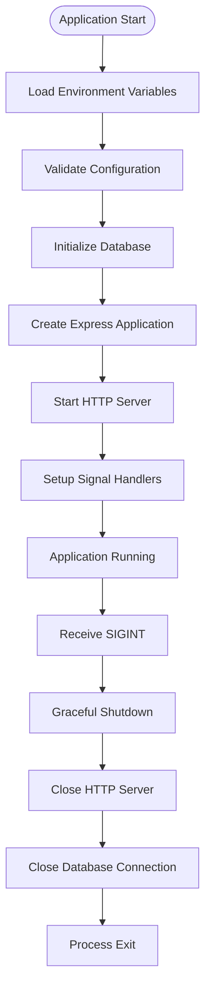
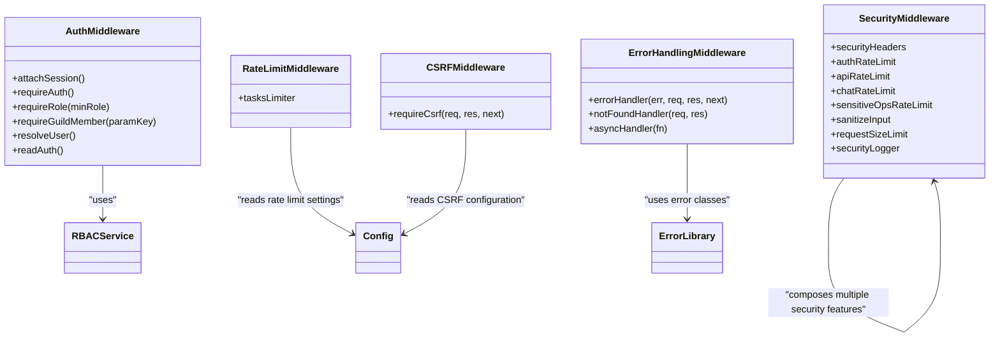
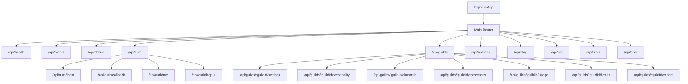
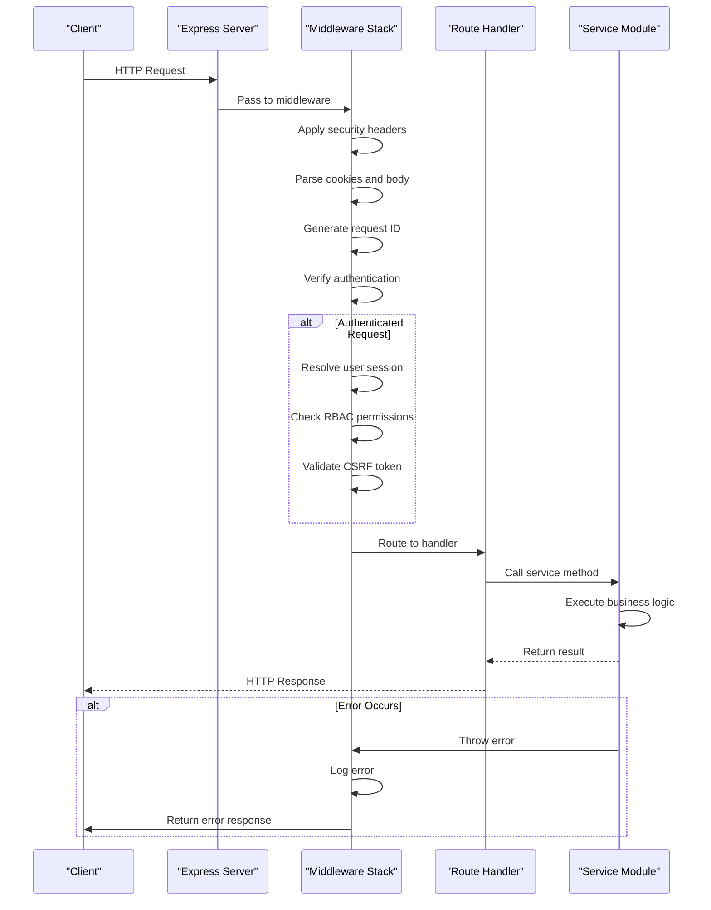
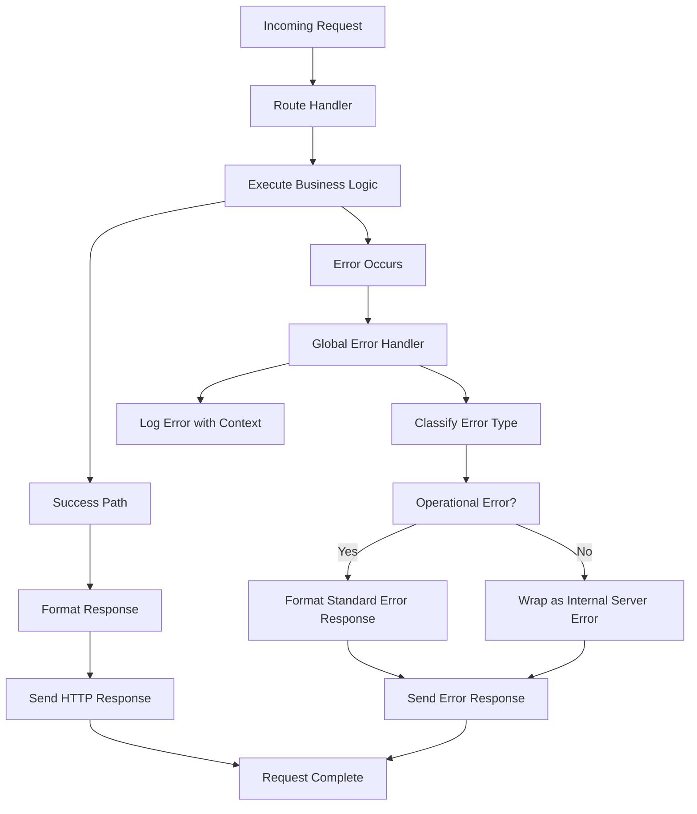

# Express Application Structure

<cite>
**Referenced Files in This Document**   
- [server.js](file://apps/admin-api/server.js)
- [src/app.js](file://apps/admin-api/src/app.js)
- [src/config.js](file://apps/admin-api/src/config.js)
- [src/middleware/auth.js](file://apps/admin-api/src/middleware/auth.js)
- [src/middleware/rate-limit.js](file://apps/admin-api/src/middleware/rate-limit.js)
- [src/middleware/error-handler.js](file://apps/admin-api/src/middleware/error-handler.js)
- [src/middleware/security.js](file://apps/admin-api/src/middleware/security.js)
- [src/middleware/csrf.js](file://apps/admin-api/src/middleware/csrf.js)
- [src/routes/index.js](file://apps/admin-api/src/routes/index.js)
- [src/routes/auth.js](file://apps/admin-api/src/routes/auth.js)
- [src/routes/guilds.js](file://apps/admin-api/src/routes/guilds.js)
- [src/services/rbac.js](file://apps/admin-api/src/services/rbac.js)
- [src/lib/errors.js](file://apps/admin-api/src/lib/errors.js)
</cite>

## Table of Contents
1. [Introduction](#introduction)
2. [Application Initialization](#application-initialization)
3. [Middleware Layers](#middleware-layers)
4. [Routing System](#routing-system)
5. [Service Module Integration](#service-module-integration)
6. [Request Flow](#request-flow)
7. [Security Measures](#security-measures)
8. [Performance Considerations](#performance-considerations)
9. [Error Handling](#error-handling)
10. [Conclusion](#conclusion)

## Introduction
The admin-api service is an Express.js application that provides administrative functionality for the Slimy AI platform. This document details the application's architecture, focusing on its middleware layers, routing system, service integration, and overall request flow. The application implements comprehensive security measures, authentication and authorization mechanisms, rate limiting, and error handling to ensure robust and secure operation.

## Application Initialization
The application initialization process begins with environment configuration and database setup before creating and starting the Express server. The server.js file serves as the entry point, orchestrating the startup sequence.

The initialization process includes:
- Loading environment variables from multiple sources (.env.admin, .env)
- Validating required configuration values (JWT_SECRET)
- Configuring database connection
- Creating the Express application instance
- Starting the HTTP server
- Setting up graceful shutdown handling

The server listens on a configurable port (default 3080) and host (default 127.0.0.1), with proper shutdown handling for SIGINT signals that closes the server and database connections.

**Diagram sources**
- [server.js](file://apps/admin-api/server.js#L31-L73)

**Section sources**
- [server.js](file://apps/admin-api/server.js#L1-L74)

## Middleware Layers
The application implements a comprehensive middleware layer system that handles security, authentication, rate limiting, and request processing. The middleware stack is configured in the app.js file and applied in a specific order to ensure proper request handling.

### Security Middleware
The security middleware implements multiple layers of protection including:
- Helmet for security headers (CSP, HSTS, XSS protection)
- CORS configuration with origin validation
- Request ID generation for tracing
- Input sanitization and validation
- Content security policies

The security configuration is defined in the security.js middleware file, which sets appropriate headers to prevent common web vulnerabilities.

### Authentication Middleware
The authentication system is implemented in the auth.js middleware and provides several key functions:
- JWT token verification from cookies
- User session resolution and attachment to requests
- Role-based access control (RBAC) with viewer, editor, admin, and owner roles
- Guild membership verification
- CSRF protection for state-changing operations

The authentication system supports multiple cookie names for backward compatibility and includes test environment support with fixture tokens.

### Rate Limiting Middleware
The application implements rate limiting at multiple levels to prevent abuse and ensure service availability. The rate-limit.js middleware configures limits for different types of operations:

- Task operations: 5 requests per minute per user/guild combination
- Authentication attempts: 5 attempts per 15 minutes per IP
- API requests: 100 requests per 15 minutes per IP
- Chat requests: 10 requests per minute per IP
- Sensitive operations: 3 requests per minute per IP

The rate limiter uses a composite key based on user ID and guild ID to provide granular control over usage patterns.

### Error Handling Middleware
The error handling system is implemented in the error-handler.js middleware and provides centralized error processing. The middleware:
- Logs errors with contextual information (request ID, method, path, user)
- Distinguishes between operational and non-operational errors
- Formats consistent error responses
- Handles 404 routes with a dedicated notFoundHandler
- Provides an asyncHandler wrapper for async route functions

The error handling system ensures that all errors are properly logged and returned in a standardized format, improving debugging and client integration.

**Diagram sources**
- [src/middleware/security.js](file://apps/admin-api/src/middleware/security.js#L1-L285)
- [src/middleware/auth.js](file://apps/admin-api/src/middleware/auth.js#L1-L231)
- [src/middleware/rate-limit.js](file://apps/admin-api/src/middleware/rate-limit.js#L1-L23)
- [src/middleware/error-handler.js](file://apps/admin-api/src/middleware/error-handler.js#L1-L82)
- [src/middleware/csrf.js](file://apps/admin-api/src/middleware/csrf.js#L1-L28)

**Section sources**
- [src/middleware/security.js](file://apps/admin-api/src/middleware/security.js#L1-L285)
- [src/middleware/auth.js](file://apps/admin-api/src/middleware/auth.js#L1-L231)
- [src/middleware/rate-limit.js](file://apps/admin-api/src/middleware/rate-limit.js#L1-L23)
- [src/middleware/error-handler.js](file://apps/admin-api/src/middleware/error-handler.js#L1-L82)
- [src/middleware/csrf.js](file://apps/admin-api/src/middleware/csrf.js#L1-L28)

## Routing System
The application implements a modular routing system with organized route registration and mounting patterns. The routing structure is defined in the index.js file in the routes directory, which serves as the main router that mounts various feature-specific routers.

### Route Organization
The routes are organized by feature area, with each major functionality having its own route file:
- Authentication routes (auth.js)
- Guild management routes (guilds.js)
- Guild settings routes (guild-settings.js)
- Personality management routes (personality.js)
- File uploads routes (uploads.js)
- Diagnostic routes (diag.js)
- Bot interaction routes (bot.js)
- Statistics routes (stats.js)
- Chat functionality routes (chat.js)
- Club management routes (club.js)

### Route Mounting Patterns
The application uses a consistent pattern for mounting routes with appropriate path prefixes:
- API routes are mounted under /api with versioning
- Feature-specific routers are mounted at logical paths
- Parameterized routes use Express route parameters (e.g., /api/guilds/:guildId)
- Multiple routers can be mounted at the same base path to organize related functionality

The routing system includes health check endpoints (/api/health and /api/status) that provide service availability information and system status.

**Diagram sources**
- [src/routes/index.js](file://apps/admin-api/src/routes/index.js#L1-L76)
- [src/routes/auth.js](file://apps/admin-api/src/routes/auth.js#L1-L401)
- [src/routes/guilds.js](file://apps/admin-api/src/routes/guilds.js#L1-L440)

**Section sources**
- [src/routes/index.js](file://apps/admin-api/src/routes/index.js#L1-L76)
- [src/routes/auth.js](file://apps/admin-api/src/routes/auth.js#L1-L401)
- [src/routes/guilds.js](file://apps/admin-api/src/routes/guilds.js#L1-L440)

## Service Module Integration
The application integrates with various service modules that provide business logic and data access functionality. These services are imported and used within route handlers to implement the application's features.

Key service modules include:
- Settings service: Manages guild settings and configuration
- Personality service: Handles personality profile management
- Channel service: Manages channel-specific configurations
- Corrections service: Handles data corrections and overrides
- Usage service: Tracks and reports usage metrics
- Health service: Provides health check functionality
- Audit service: Records administrative actions
- Rescan service: Processes rescan requests for user data

The services are imported at the top of route files and called from within route handlers, passing request parameters and user context. This separation of concerns allows for better code organization and testability.

**Section sources**
- [src/routes/guilds.js](file://apps/admin-api/src/routes/guilds.js#L1-L440)
- [src/services/settings.js](file://apps/admin-api/src/services/settings.js)
- [src/services/personality.js](file://apps/admin-api/src/services/personality.js)
- [src/services/channels.js](file://apps/admin-api/src/services/channels.js)
- [src/services/corrections.js](file://apps/admin-api/src/services/corrections.js)
- [src/services/usage.js](file://apps/admin-api/src/services/usage.js)
- [src/services/health.js](file://apps/admin-api/src/services/health.js)
- [src/services/audit.js](file://apps/admin-api/src/services/audit.js)
- [src/services/rescan.js](file://apps/admin-api/src/services/rescan.js)

## Request Flow
The request flow in the admin-api application follows a well-defined path from entry point to business logic processing. The flow begins with the server.js entry point, which creates the Express application and starts the HTTP server.

Once the server is running, incoming requests pass through the middleware stack in a specific order:
1. Trust proxy and request ID generation
2. Security headers and CORS configuration
3. Request logging
4. Body parsing and cookie parsing
5. Authentication and user resolution
6. Route matching and handler execution
7. Error handling

For authenticated requests, the flow includes additional steps:
- JWT token verification from cookies
- User session resolution
- Role-based access control checks
- CSRF token validation for state-changing operations
- Input validation using Zod schemas
- Business logic execution via service modules
- Response formatting and audit logging

The request flow is designed to be efficient while providing comprehensive security and error handling.

**Diagram sources**
- [server.js](file://apps/admin-api/server.js#L1-L74)
- [src/app.js](file://apps/admin-api/src/app.js#L1-L64)
- [src/middleware/auth.js](file://apps/admin-api/src/middleware/auth.js#L1-L231)
- [src/middleware/error-handler.js](file://apps/admin-api/src/middleware/error-handler.js#L1-L82)

**Section sources**
- [server.js](file://apps/admin-api/server.js#L1-L74)
- [src/app.js](file://apps/admin-api/src/app.js#L1-L64)

## Security Measures
The application implements comprehensive security measures at multiple levels to protect against common web vulnerabilities and ensure data integrity.

### Authentication and Authorization
The application uses JWT-based authentication with secure cookie storage. The authentication system:
- Uses HttpOnly, Secure cookies with configurable SameSite policy
- Supports role-based access control with owner, admin, editor, and viewer roles
- Implements guild membership verification
- Includes CSRF protection for state-changing operations
- Validates OAuth state parameters to prevent CSRF attacks

### Input Validation and Sanitization
The application implements strict input validation and sanitization:
- Uses Zod schemas for request body and query parameter validation
- Implements input sanitization middleware to remove malicious content
- Limits request body size to 2MB
- Validates content-length headers
- Filters suspicious patterns in request data

### Security Headers
The application uses Helmet to set appropriate security headers:
- Content Security Policy (CSP) to prevent XSS attacks
- Strict-Transport-Security (HSTS) to enforce HTTPS
- X-Frame-Options to prevent clickjacking
- X-Content-Type-Options to prevent MIME type sniffing
- Referrer-Policy to control referrer information

### Rate Limiting
The application implements rate limiting to prevent abuse:
- Different limits for different operation types
- Composite keys based on user and guild for granular control
- Exemptions for health check endpoints
- Standardized rate limit headers

**Section sources**
- [src/middleware/security.js](file://apps/admin-api/src/middleware/security.js#L1-L285)
- [src/middleware/auth.js](file://apps/admin-api/src/middleware/auth.js#L1-L231)
- [src/middleware/csrf.js](file://apps/admin-api/src/middleware/csrf.js#L1-L28)
- [src/lib/errors.js](file://apps/admin-api/src/lib/errors.js#L1-L255)

## Performance Considerations
The application incorporates several performance optimizations to ensure responsive operation under load.

### Caching Strategy
The application implements caching at multiple levels:
- Redis-based session storage for user sessions
- In-memory caching for frequently accessed data
- HTTP caching headers for static assets
- Conditional requests using ETag headers

### Request Processing
The application optimizes request processing through:
- Efficient middleware ordering to minimize unnecessary processing
- Asynchronous operations for I/O-bound tasks
- Connection pooling for database operations
- Stream processing for large file uploads
- Batch operations for bulk data processing

### Resource Management
The application manages resources efficiently:
- Proper cleanup of database connections during shutdown
- Memory-efficient processing of large datasets
- Timeout handling for external service calls
- Graceful degradation when services are unavailable

### Monitoring and Metrics
The application includes monitoring capabilities:
- Request logging with performance metrics
- Health check endpoints for service monitoring
- Error tracking and reporting
- Usage metrics collection

**Section sources**
- [src/middleware/cache.js](file://apps/admin-api/src/middleware/cache.js)
- [lib/cache/redis.js](file://apps/admin-api/lib/cache/redis.js)
- [src/lib/logger.js](file://apps/admin-api/src/lib/logger.js)
- [src/middleware/security.js](file://apps/admin-api/src/middleware/security.js#L1-L285)

## Error Handling
The application implements a comprehensive error handling system that ensures consistent error responses and proper logging.

### Error Classification
The application distinguishes between different types of errors:
- Operational errors (expected, handled gracefully)
- Non-operational errors (unexpected, require investigation)
- Validation errors (client input issues)
- Authentication and authorization errors
- External service errors
- Internal server errors

### Error Response Format
All errors are returned in a standardized format:
- Consistent JSON structure with error code and message
- Request ID for tracing
- Optional details for specific error types
- Stack traces in development mode only

### Error Logging
The application logs errors with comprehensive context:
- Request method, path, and query parameters
- Request body (sensitive data redacted)
- User ID and role
- Request ID for correlation
- Timestamp and source information

### Error Recovery
The application implements error recovery mechanisms:
- Graceful degradation when services are unavailable
- Retry logic for transient failures
- Circuit breakers for external service calls
- Fallback values for missing configuration

**Diagram sources**
- [src/middleware/error-handler.js](file://apps/admin-api/src/middleware/error-handler.js#L1-L82)
- [src/lib/errors.js](file://apps/admin-api/src/lib/errors.js#L1-L255)

**Section sources**
- [src/middleware/error-handler.js](file://apps/admin-api/src/middleware/error-handler.js#L1-L82)
- [src/lib/errors.js](file://apps/admin-api/src/lib/errors.js#L1-L255)

## Conclusion
The admin-api service demonstrates a well-architected Express.js application with a clear separation of concerns, comprehensive security measures, and robust error handling. The application follows modern Node.js best practices with proper initialization, graceful shutdown, and configuration management.

Key architectural strengths include:
- Modular middleware design with clear separation of concerns
- Comprehensive security implementation including authentication, authorization, and input validation
- Well-organized routing system with logical grouping of endpoints
- Clear request flow from entry point to business logic
- Proper error handling with consistent response formats
- Performance optimizations for efficient operation

The application is designed to be maintainable and extensible, with clear patterns for adding new features and services. The use of standardized error handling, logging, and monitoring makes the application easier to debug and operate in production environments.