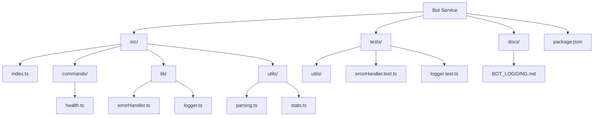
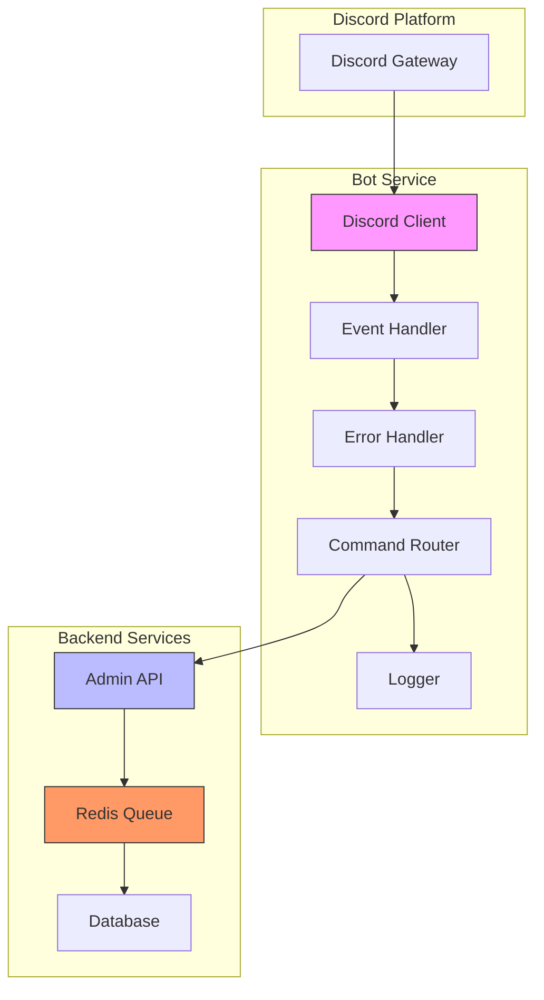
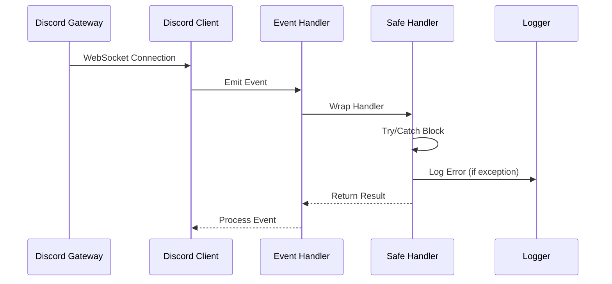
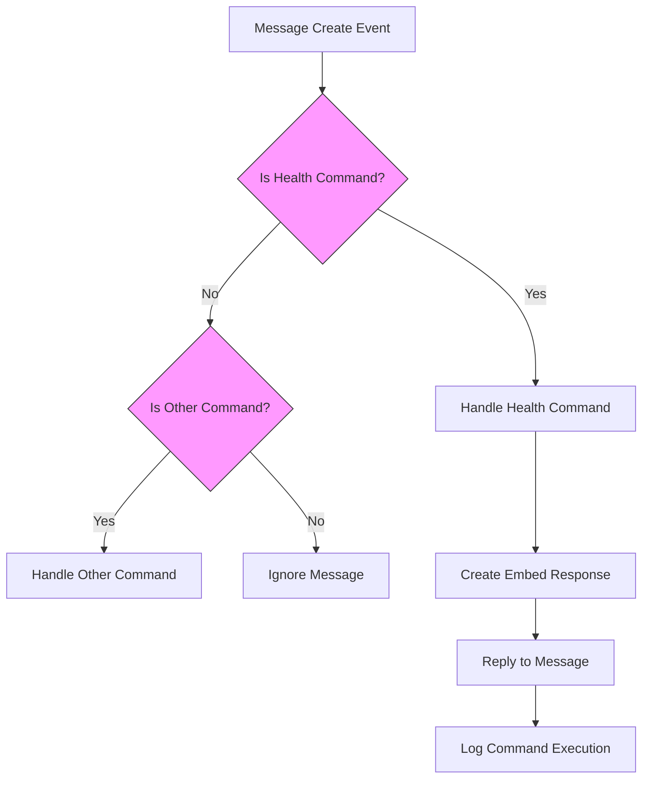
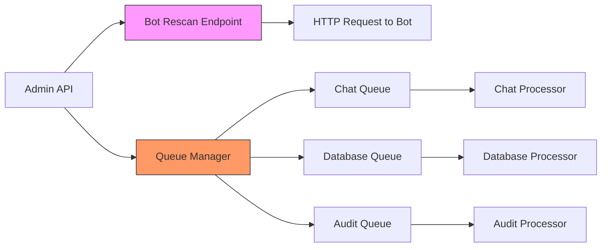
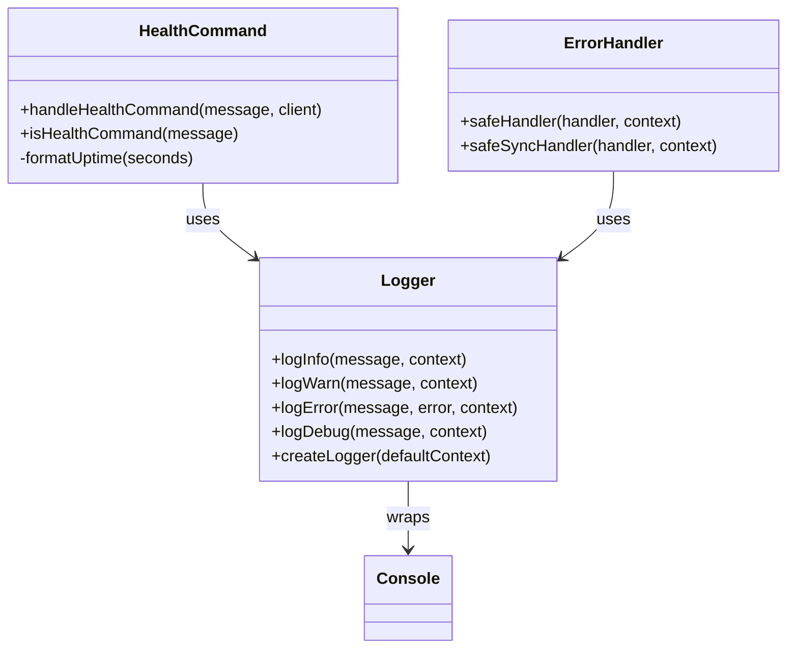
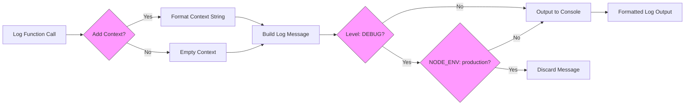
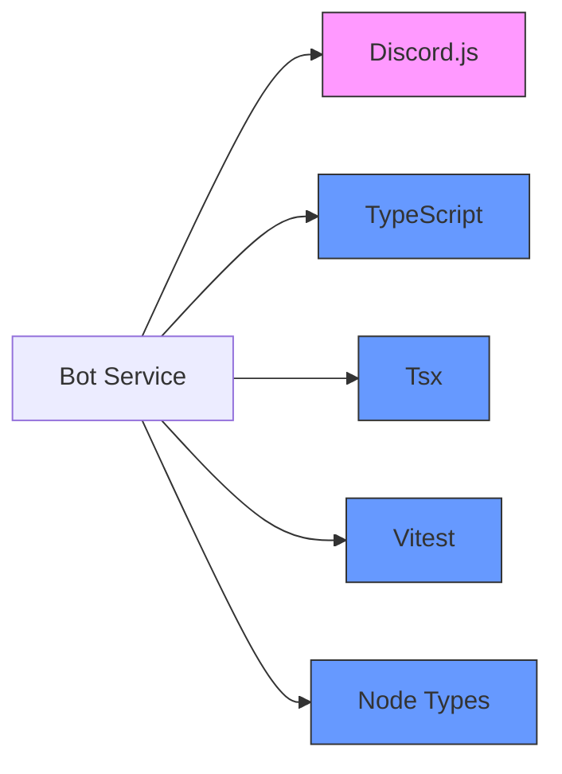

# Bot Service

<cite>
**Referenced Files in This Document**   
- [index.ts](file://apps/bot/src/index.ts)
- [health.ts](file://apps/bot/src/commands/health.ts)
- [errorHandler.ts](file://apps/bot/src/lib/errorHandler.ts)
- [logger.ts](file://apps/bot/src/lib/logger.ts)
- [parsing.ts](file://apps/bot/src/utils/parsing.ts)
- [stats.ts](file://apps/bot/src/utils/stats.ts)
- [BOT_LOGGING.md](file://apps/bot/docs/BOT_LOGGING.md)
- [package.json](file://apps/bot/package.json)
- [bot.js](file://apps/admin-api/src/routes/bot.js)
- [index.js](file://apps/admin-api/src/lib/queues/index.js)
</cite>

## Table of Contents
1. [Introduction](#introduction)
2. [Project Structure](#project-structure)
3. [Core Components](#core-components)
4. [Architecture Overview](#architecture-overview)
5. [Detailed Component Analysis](#detailed-component-analysis)
6. [Dependency Analysis](#dependency-analysis)
7. [Performance Considerations](#performance-considerations)
8. [Troubleshooting Guide](#troubleshooting-guide)
9. [Conclusion](#conclusion)

## Introduction
The Bot Service is a Discord bot implementation designed to provide club analytics and user interactions for the Slimy.ai platform. Currently in scaffold mode, the bot is structured to eventually migrate existing Discord bot logic and integrate with the admin-api for data processing and state management. The architecture emphasizes reliability through comprehensive error handling, structured logging, and health monitoring capabilities. This documentation details the current implementation, focusing on the Discord.js integration, event handling system, command registration process, and communication patterns with backend services.

## Project Structure
The bot service follows a modular TypeScript structure with clear separation of concerns. The core functionality is organized into commands, utilities, and library components, with comprehensive testing and documentation.

**Diagram sources**
- [index.ts](file://apps/bot/src/index.ts)
- [health.ts](file://apps/bot/src/commands/health.ts)
- [errorHandler.ts](file://apps/bot/src/lib/errorHandler.ts)
- [logger.ts](file://apps/bot/src/lib/logger.ts)

**Section sources**
- [index.ts](file://apps/bot/src/index.ts)
- [package.json](file://apps/bot/package.json)

## Core Components
The bot service comprises several core components that work together to provide a reliable and maintainable Discord bot implementation. These include the entry point initialization, command handling system, error handling utilities, logging infrastructure, and utility functions for data processing. The architecture is designed to be extensible, allowing for the migration of existing bot functionality while maintaining stability through comprehensive error handling and monitoring capabilities.

**Section sources**
- [index.ts](file://apps/bot/src/index.ts)
- [health.ts](file://apps/bot/src/commands/health.ts)
- [errorHandler.ts](file://apps/bot/src/lib/errorHandler.ts)
- [logger.ts](file://apps/bot/src/lib/logger.ts)

## Architecture Overview
The bot service architecture is built around a modular design that emphasizes reliability, maintainability, and extensibility. The system integrates Discord.js for gateway connection and event processing, implements a robust error handling strategy to prevent crashes, and provides comprehensive logging for monitoring and debugging. The bot communicates with the admin-api service for data processing and state management through HTTP endpoints and background job queues. This architecture ensures that the bot can maintain a stable connection to Discord's gateway while safely processing events and commands.

**Diagram sources**
- [index.ts](file://apps/bot/src/index.ts)
- [errorHandler.ts](file://apps/bot/src/lib/errorHandler.ts)
- [logger.ts](file://apps/bot/src/lib/logger.ts)
- [bot.js](file://apps/admin-api/src/routes/bot.js)
- [index.js](file://apps/admin-api/src/lib/queues/index.js)

## Detailed Component Analysis

### Discord.js Integration and Event Handling
The bot service uses Discord.js to establish and maintain a connection to Discord's gateway, processing events through a structured event handling system. The entry point in index.ts initializes the bot and sets up the event handling pipeline, with a focus on graceful shutdown and configuration validation. The event handling system is designed to be crash-resistant through the use of safeHandler wrappers that catch and log unhandled errors while allowing the bot to continue operating.

**Diagram sources**
- [index.ts](file://apps/bot/src/index.ts)
- [errorHandler.ts](file://apps/bot/src/lib/errorHandler.ts)
- [logger.ts](file://apps/bot/src/lib/logger.ts)

**Section sources**
- [index.ts](file://apps/bot/src/index.ts)
- [errorHandler.ts](file://apps/bot/src/lib/errorHandler.ts)

### Command Registration and Processing
The command system in the bot service follows a modular pattern where commands are defined in separate files within the commands directory and registered in the main event handler. The health command implementation demonstrates this pattern, with separate functions for handling the command and checking if a message matches the command trigger. Commands are processed sequentially in the message event handler, with each command checker determining whether its handler should be invoked.

**Diagram sources**
- [health.ts](file://apps/bot/src/commands/health.ts)
- [index.ts](file://apps/bot/src/index.ts)

**Section sources**
- [health.ts](file://apps/bot/src/commands/health.ts)

### Admin-API Communication and State Management
The bot service communicates with the admin-api for data processing and state management through HTTP endpoints and background job queues. The admin-api exposes a bot/rescan endpoint that proxies requests to the bot service, enabling coordinated operations between the web interface and the bot. Background jobs are managed through Redis queues, with separate queues for chat processing, database operations, and audit logging. This architecture allows the bot to trigger background jobs for resource-intensive operations while maintaining responsiveness to Discord events.

**Diagram sources**
- [bot.js](file://apps/admin-api/src/routes/bot.js)
- [index.js](file://apps/admin-api/src/lib/queues/index.js)

**Section sources**
- [bot.js](file://apps/admin-api/src/routes/bot.js)
- [index.js](file://apps/admin-api/src/lib/queues/index.js)

### Health Monitoring and Error Handling
The bot service includes a comprehensive health monitoring command and robust error handling strategy. The !bothealth command provides detailed system information including uptime, memory usage, version, and connection status, presented in a Discord embed. The error handling system uses safeHandler wrappers to prevent crashes from unhandled exceptions, automatically extracting context from Discord objects and logging detailed error information. This approach ensures the bot remains operational even when individual handlers encounter errors.

**Diagram sources**
- [health.ts](file://apps/bot/src/commands/health.ts)
- [errorHandler.ts](file://apps/bot/src/lib/errorHandler.ts)
- [logger.ts](file://apps/bot/src/lib/logger.ts)

**Section sources**
- [health.ts](file://apps/bot/src/commands/health.ts)
- [errorHandler.ts](file://apps/bot/src/lib/errorHandler.ts)
- [logger.ts](file://apps/bot/src/lib/logger.ts)

### Logging Implementation and Configuration Management
The logging system in the bot service provides structured logging with contextual information, supporting multiple log levels (INFO, WARN, ERROR, DEBUG) and conditional debug logging based on the environment. The logger formats messages with timestamps, levels, and context attributes, making it easier to trace events and diagnose issues. Configuration is managed through environment variables, with the DISCORD_BOT_TOKEN being required for operation and NODE_ENV controlling debug logging behavior.

**Diagram sources**
- [logger.ts](file://apps/bot/src/lib/logger.ts)
- [BOT_LOGGING.md](file://apps/bot/docs/BOT_LOGGING.md)

**Section sources**
- [logger.ts](file://apps/bot/src/lib/logger.ts)
- [BOT_LOGGING.md](file://apps/bot/docs/BOT_LOGGING.md)

## Dependency Analysis
The bot service has a focused dependency profile with Discord.js as the primary external dependency for Discord integration. The package.json file shows a minimal production dependency list, indicating a lightweight design that relies on the core Discord.js library for gateway communication and event processing. Development dependencies include TypeScript, testing frameworks, and development tools to support the TypeScript compilation and testing workflow.

**Diagram sources**
- [package.json](file://apps/bot/package.json)

**Section sources**
- [package.json](file://apps/bot/package.json)

## Performance Considerations
The bot service is designed with performance and reliability in mind, implementing several strategies to maintain responsiveness and stability. The use of safeHandler wrappers prevents unhandled exceptions from crashing the bot, ensuring continuous operation even when individual handlers fail. The logging system is optimized to avoid performance overhead in production by conditionally disabling debug logging. The architecture supports background job processing through integration with the admin-api's queue system, allowing resource-intensive operations to be handled asynchronously without blocking the main event loop.

## Troubleshooting Guide
The bot service includes several features to aid in troubleshooting and monitoring. The !bothealth command provides immediate feedback on the bot's status, including uptime, memory usage, and connection metrics. Comprehensive logging with contextual information helps diagnose issues by capturing relevant details such as guild ID, user ID, and channel ID. The error handling system captures and reports unhandled exceptions without crashing the bot, making it easier to identify and fix issues in production. When troubleshooting, check the console output for log messages, verify environment variables are correctly set, and use the health command to confirm the bot is operational.

**Section sources**
- [health.ts](file://apps/bot/src/commands/health.ts)
- [errorHandler.ts](file://apps/bot/src/lib/errorHandler.ts)
- [logger.ts](file://apps/bot/src/lib/logger.ts)

## Conclusion
The Bot Service represents a well-structured foundation for a Discord bot implementation with a strong emphasis on reliability, maintainability, and extensibility. The current scaffold provides essential infrastructure including error handling, logging, and health monitoring, preparing the system for the migration of existing bot functionality. The integration with the admin-api through HTTP endpoints and background job queues enables coordinated operations between the web interface and the bot, supporting complex workflows and data processing tasks. As the implementation evolves from scaffold to full functionality, this architecture will support the addition of club analytics features and other Discord interactions while maintaining stability and performance.