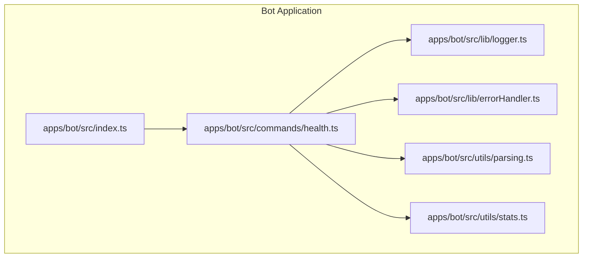
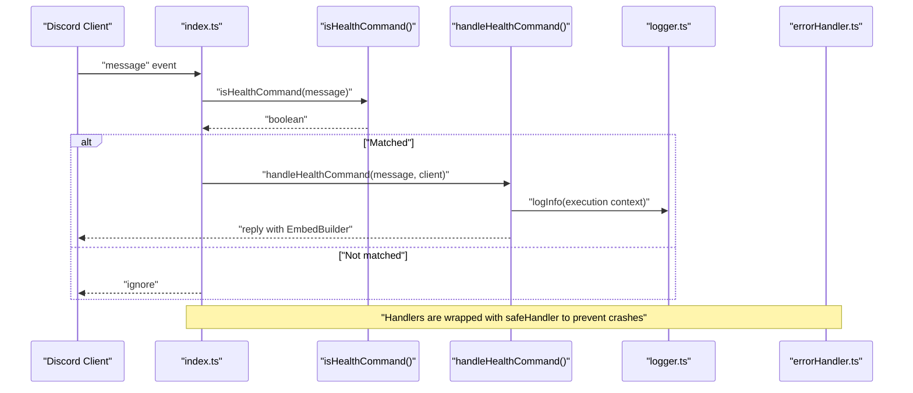
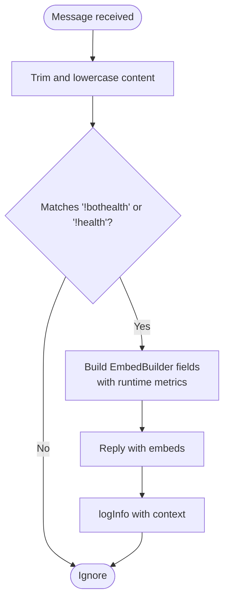
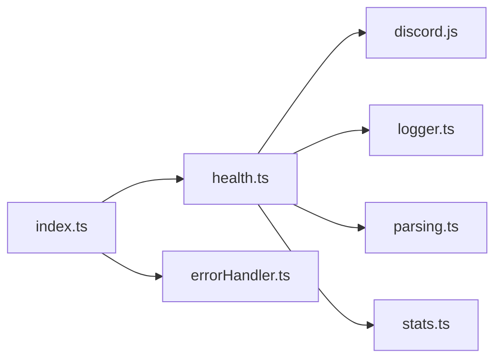

# Command System

<cite>
**Referenced Files in This Document**
- [health.ts](file://apps/bot/src/commands/health.ts)
- [parsing.ts](file://apps/bot/src/utils/parsing.ts)
- [stats.ts](file://apps/bot/src/utils/stats.ts)
- [index.ts](file://apps/bot/src/index.ts)
- [logger.ts](file://apps/bot/src/lib/logger.ts)
- [errorHandler.ts](file://apps/bot/src/lib/errorHandler.ts)
- [BOT_LOGGING.md](file://apps/bot/docs/BOT_LOGGING.md)
</cite>

## Table of Contents
1. [Introduction](#introduction)
2. [Project Structure](#project-structure)
3. [Core Components](#core-components)
4. [Architecture Overview](#architecture-overview)
5. [Detailed Component Analysis](#detailed-component-analysis)
6. [Dependency Analysis](#dependency-analysis)
7. [Performance Considerations](#performance-considerations)
8. [Troubleshooting Guide](#troubleshooting-guide)
9. [Conclusion](#conclusion)

## Introduction
This document explains the command system sub-feature implemented in the bot application. It focuses on the command registration and dispatch mechanism, the pattern used by the health command, and how commands are parsed from message content. It also covers handler structure, response formatting, permission checks, input validation, command scope, and error recovery.

## Project Structure
The command system is centered around a small set of modules:
- Command handlers live under commands/
- Utilities for parsing and statistics live under utils/
- Centralized logging and error handling live under lib/
- The main entry point scaffolds the bot and outlines where command registration would occur

**Diagram sources**
- [index.ts](file://apps/bot/src/index.ts#L1-L64)
- [logger.ts](file://apps/bot/src/lib/logger.ts#L1-L93)
- [errorHandler.ts](file://apps/bot/src/lib/errorHandler.ts#L1-L76)
- [parsing.ts](file://apps/bot/src/utils/parsing.ts#L1-L55)
- [stats.ts](file://apps/bot/src/utils/stats.ts#L1-L54)
- [health.ts](file://apps/bot/src/commands/health.ts#L1-L97)

**Section sources**
- [index.ts](file://apps/bot/src/index.ts#L1-L64)
- [health.ts](file://apps/bot/src/commands/health.ts#L1-L97)

## Core Components
- Command checker: Determines if a message matches a command pattern.
- Command handler: Executes the command logic and sends a response.
- Parser utilities: Provide helpers for validating and extracting user input.
- Logger and error handler: Provide safe execution and structured logging for commands.
- Stats utilities: Provide calculation helpers used by commands.

Key responsibilities:
- Command checker: Case-insensitive match against known prefixes and command names.
- Command handler: Builds a response (EmbedBuilder), performs checks, and logs execution.
- Parser utilities: Validate and normalize user input (e.g., numbers, mentions).
- Logger and error handler: Wrap handlers to prevent crashes and enrich logs with context.

**Section sources**
- [health.ts](file://apps/bot/src/commands/health.ts#L43-L97)
- [parsing.ts](file://apps/bot/src/utils/parsing.ts#L1-L55)
- [stats.ts](file://apps/bot/src/utils/stats.ts#L1-L54)
- [logger.ts](file://apps/bot/src/lib/logger.ts#L1-L93)
- [errorHandler.ts](file://apps/bot/src/lib/errorHandler.ts#L1-L76)

## Architecture Overview
The command system follows a simple, explicit dispatch pattern:
- A message event handler checks incoming messages against command checkers.
- If a match is found, the corresponding handler is invoked.
- Handlers use safe wrappers to prevent crashes and log execution context.

**Diagram sources**
- [index.ts](file://apps/bot/src/index.ts#L1-L64)
- [health.ts](file://apps/bot/src/commands/health.ts#L43-L97)
- [logger.ts](file://apps/bot/src/lib/logger.ts#L1-L93)
- [errorHandler.ts](file://apps/bot/src/lib/errorHandler.ts#L1-L76)
- [BOT_LOGGING.md](file://apps/bot/docs/BOT_LOGGING.md#L145-L206)

## Detailed Component Analysis

### Health Command Pattern
The health command demonstrates the canonical command pattern:
- A checker function determines if a message triggers the command.
- A handler function executes the command logic and replies with an embed.
- The handler logs execution context for observability.

**Diagram sources**
- [health.ts](file://apps/bot/src/commands/health.ts#L43-L97)
- [logger.ts](file://apps/bot/src/lib/logger.ts#L1-L93)

**Section sources**
- [health.ts](file://apps/bot/src/commands/health.ts#L43-L97)

### Command Registration and Dispatch Mechanism
- The main entry point outlines where command registration would occur.
- The documentation shows a pattern where a message event handler checks multiple command checkers and invokes their handlers accordingly.
- Handlers are wrapped with a safe handler to prevent crashes and log errors with context.

Practical guidance:
- Export a checker and a handler for each command.
- Add a branch in the message event handler to call the checker and handler.
- Wrap handlers with the safe handler for crash safety.

**Section sources**
- [index.ts](file://apps/bot/src/index.ts#L1-L64)
- [BOT_LOGGING.md](file://apps/bot/docs/BOT_LOGGING.md#L145-L206)
- [errorHandler.ts](file://apps/bot/src/lib/errorHandler.ts#L1-L76)

### Parsing and Input Validation
The parsing utilities provide helpers for user input validation:
- Numeric parsing with support for commas and k/m suffixes.
- Snowflake validation for IDs.
- Mention extraction from content.

These utilities can be used inside command handlers to validate and normalize user input before processing.

**Section sources**
- [parsing.ts](file://apps/bot/src/utils/parsing.ts#L1-L55)

### Response Formatting with EmbedBuilder
The health command builds an embed response with fields for status, uptime, version, environment, memory usage, Node.js version, guild count, and ping. The embed is sent as part of the reply.

Best practices:
- Use consistent field ordering and formatting.
- Include timestamps for traceability.
- Keep embeds concise and readable.

**Section sources**
- [health.ts](file://apps/bot/src/commands/health.ts#L53-L88)

### Permission Checks
The health command currently allows all users to execute it. The documentation outlines a future enhancement to restrict access to guild administrators. When implementing permissions:
- Use Discord.js permission flags to check roles or permissions.
- Fail fast with a clear message if the user lacks permission.
- Log permission denials for auditing.

Note: The PermissionFlagsBits import is present in the health command file; implement checks as part of the handler.

**Section sources**
- [health.ts](file://apps/bot/src/commands/health.ts#L1-L20)
- [BOT_LOGGING.md](file://apps/bot/docs/BOT_LOGGING.md#L208-L213)

### Command Metadata and Options
- Command name and aliases: "!bothealth" and "!health".
- Description: Provided in documentation as a health/debug command.
- Options: None in the current implementation; the checker simply compares trimmed, lowercased content to known aliases.

Future enhancements:
- Define a metadata object per command with name, description, options, and validation rules.
- Centralize option parsing and validation logic.

**Section sources**
- [health.ts](file://apps/bot/src/commands/health.ts#L89-L97)
- [BOT_LOGGING.md](file://apps/bot/docs/BOT_LOGGING.md#L163-L191)

### Command Scope (Global vs Guild-Specific)
- The health command is intended for use in any channel where the bot has access.
- Scope is implicit in the checker and handler; no explicit guild filtering is present.
- Consider scoping commands to guild-only contexts when appropriate.

**Section sources**
- [health.ts](file://apps/bot/src/commands/health.ts#L43-L97)
- [BOT_LOGGING.md](file://apps/bot/docs/BOT_LOGGING.md#L163-L178)

### Cooldowns
Cooldowns are not implemented in the current command system. Recommended approaches:
- Track last execution timestamps per user/channel/guild.
- Enforce a minimum interval before allowing another execution.
- Optionally integrate with a rate limiter utility.

[No sources needed since this section provides general guidance]

### Error Recovery Within Command Execution
- Handlers are wrapped with a safe handler to prevent crashes and log errors with context.
- The logger formats structured logs with timestamps, levels, messages, and optional context.
- For message-based handlers, context includes guildId, userId, and channelId.

**Section sources**
- [errorHandler.ts](file://apps/bot/src/lib/errorHandler.ts#L1-L76)
- [logger.ts](file://apps/bot/src/lib/logger.ts#L1-L93)

## Dependency Analysis
The health command depends on:
- Discord.js for message and embed APIs.
- Local logger for structured logging.
- Optional permission checks via PermissionFlagsBits.
- Parser utilities for input normalization.
- Stats utilities for calculations (used indirectly in the handler).

**Diagram sources**
- [health.ts](file://apps/bot/src/commands/health.ts#L1-L20)
- [index.ts](file://apps/bot/src/index.ts#L1-L64)
- [logger.ts](file://apps/bot/src/lib/logger.ts#L1-L93)
- [errorHandler.ts](file://apps/bot/src/lib/errorHandler.ts#L1-L76)
- [parsing.ts](file://apps/bot/src/utils/parsing.ts#L1-L55)
- [stats.ts](file://apps/bot/src/utils/stats.ts#L1-L54)

**Section sources**
- [health.ts](file://apps/bot/src/commands/health.ts#L1-L20)
- [index.ts](file://apps/bot/src/index.ts#L1-L64)

## Performance Considerations
- Keep command handlers lightweight and avoid heavy synchronous work.
- Use asynchronous operations and avoid blocking the event loop.
- Cache expensive computations (e.g., version reading) when appropriate.
- Prefer efficient string operations for command parsing.

[No sources needed since this section provides general guidance]

## Troubleshooting Guide
Common issues and resolutions:
- Command not triggering:
  - Verify the message content matches the checker’s expectations (case-insensitive and trimmed).
  - Ensure the message event handler branches include the command checker and handler.
- Crashes or unhandled rejections:
  - Confirm handlers are wrapped with the safe handler.
  - Review logs for error context and stack traces.
- Permission denied:
  - Implement role checks using PermissionFlagsBits and return a friendly message when insufficient permissions are detected.
- Logging context missing:
  - Ensure the safe handler receives a message-like object so context can be extracted.

**Section sources**
- [errorHandler.ts](file://apps/bot/src/lib/errorHandler.ts#L1-L76)
- [logger.ts](file://apps/bot/src/lib/logger.ts#L1-L93)
- [health.ts](file://apps/bot/src/commands/health.ts#L43-L97)

## Conclusion
The command system uses a straightforward, explicit dispatch pattern with clear separation between command checkers and handlers. The health command exemplifies best practices: case-insensitive matching, embed-based responses, structured logging, and safe execution. Extending the system involves adding new checkers and handlers, centralizing metadata, enforcing permissions, and integrating robust input validation and error handling.