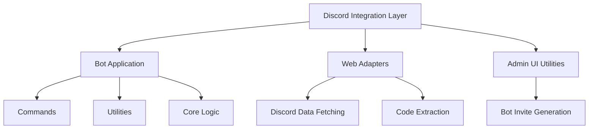
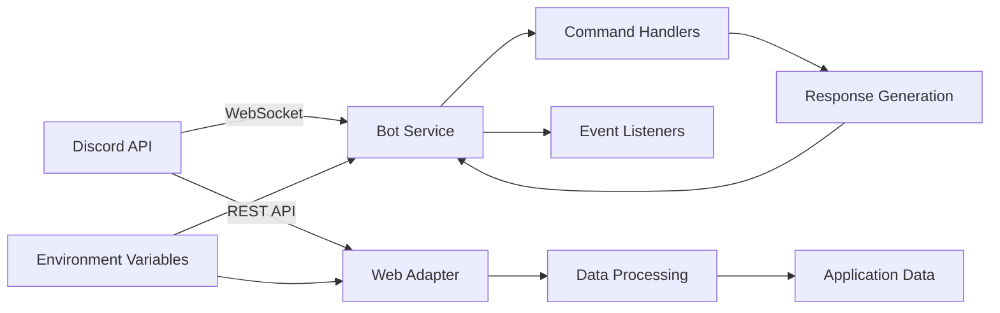
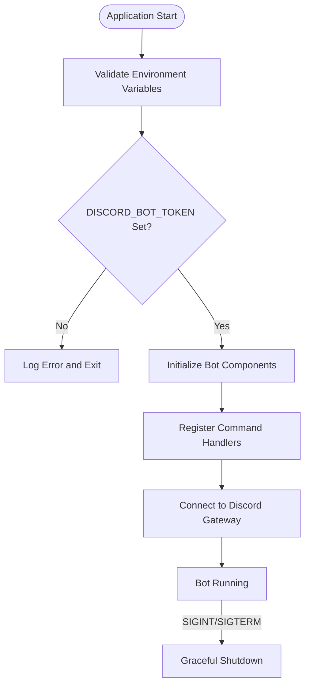
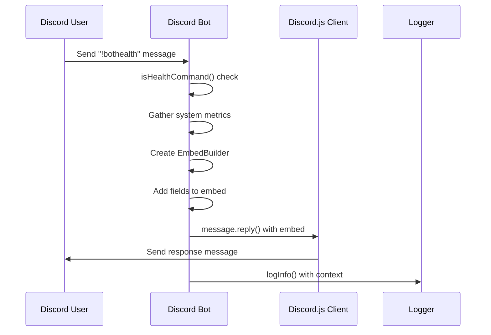
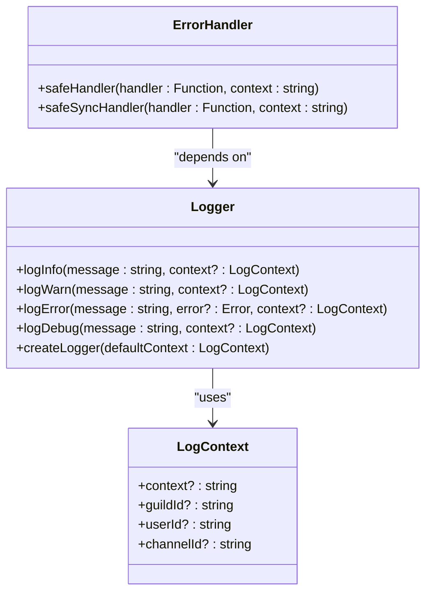
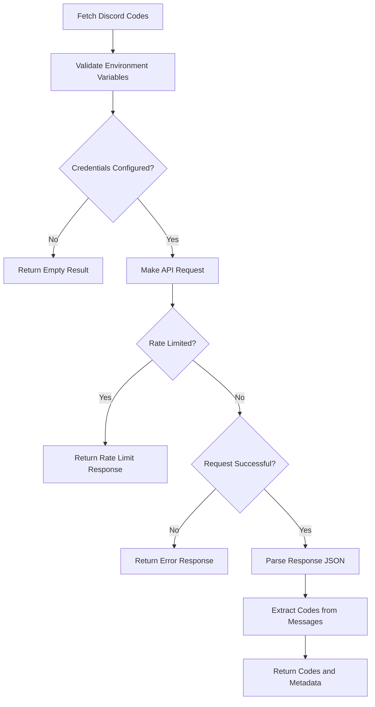
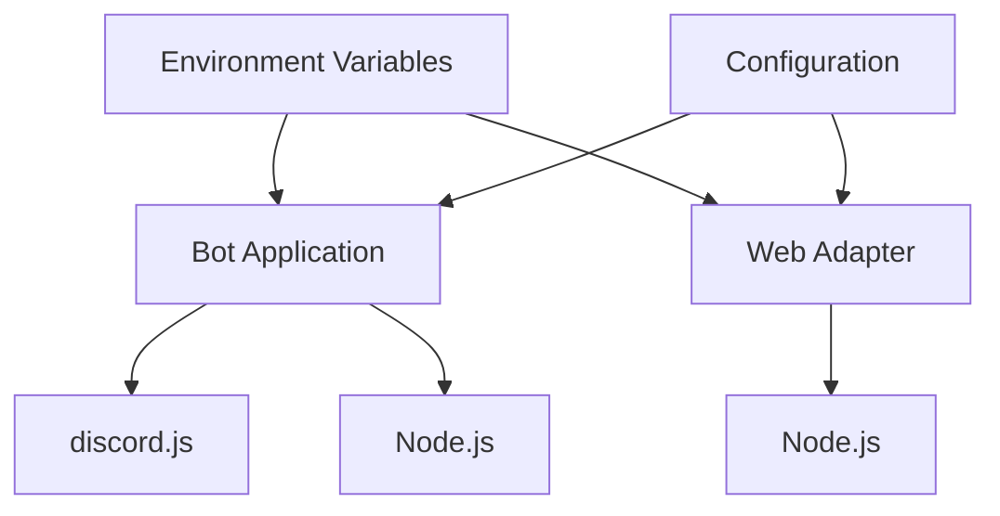

# Discord Integration

<cite>
**Referenced Files in This Document**   
- [index.ts](file://apps/bot/src/index.ts)
- [health.ts](file://apps/bot/src/commands/health.ts)
- [logger.ts](file://apps/bot/src/lib/logger.ts)
- [errorHandler.ts](file://apps/bot/src/lib/errorHandler.ts)
- [discord.ts](file://apps/web/lib/adapters/discord.ts)
- [discord.js](file://apps/admin-ui/lib/discord.js)
- [package.json](file://apps/bot/package.json)
</cite>

## Table of Contents
1. [Introduction](#introduction)
2. [Project Structure](#project-structure)
3. [Core Components](#core-components)
4. [Architecture Overview](#architecture-overview)
5. [Detailed Component Analysis](#detailed-component-analysis)
6. [Dependency Analysis](#dependency-analysis)
7. [Performance Considerations](#performance-considerations)
8. [Troubleshooting Guide](#troubleshooting-guide)
9. [Conclusion](#conclusion)

## Introduction
The Discord integration layer in this bot service consists of multiple components that interact with Discord's API for different purposes. The primary bot functionality is implemented in the bot application, while various adapters and utilities in the web application provide additional Discord integration capabilities. This documentation covers the architecture, configuration, and implementation details of these components, focusing on how they handle authentication, event processing, and API interactions with Discord.

## Project Structure
The Discord integration functionality is distributed across multiple applications within the monorepo. The primary bot logic resides in the `apps/bot` directory, while Discord-related utilities and adapters are located in `apps/web/lib/adapters` and `apps/admin-ui/lib`. The bot application follows a modular structure with separate directories for commands, utilities, and core functionality.

**Diagram sources**
- [index.ts](file://apps/bot/src/index.ts)
- [discord.ts](file://apps/web/lib/adapters/discord.ts)
- [discord.js](file://apps/admin-ui/lib/discord.js)

**Section sources**
- [index.ts](file://apps/bot/src/index.ts)
- [discord.ts](file://apps/web/lib/adapters/discord.ts)

## Core Components
The core components of the Discord integration include the bot client initialization, command handling system, logging infrastructure, and error handling utilities. The bot application is built on discord.js v14 and follows a modular architecture that separates concerns between different functional areas. The health command implementation demonstrates the pattern for command registration and execution, while the logging and error handling components provide essential operational capabilities.

**Section sources**
- [index.ts](file://apps/bot/src/index.ts)
- [health.ts](file://apps/bot/src/commands/health.ts)
- [logger.ts](file://apps/bot/src/lib/logger.ts)
- [errorHandler.ts](file://apps/bot/src/lib/errorHandler.ts)

## Architecture Overview
The Discord integration architecture consists of three main components: the bot service for real-time interaction with Discord, the web adapter for periodic data fetching from Discord channels, and utility functions for OAuth and bot invitation generation. These components work independently but share common patterns for authentication and error handling. The bot service maintains a persistent WebSocket connection to Discord's gateway, while the web adapter makes REST API calls to fetch specific data.

**Diagram sources**
- [index.ts](file://apps/bot/src/index.ts)
- [discord.ts](file://apps/web/lib/adapters/discord.ts)
- [health.ts](file://apps/bot/src/commands/health.ts)

## Detailed Component Analysis

### Bot Initialization and Configuration
The bot service is initialized through the index.ts file, which serves as the entry point for the application. The initialization process begins with environment variable validation, specifically checking for the presence of the DISCORD_BOT_TOKEN. The bot is designed to run as a scaffold with placeholder functionality that will be expanded with full Discord integration. The current implementation includes utility functions for number parsing and snowflake validation, which are essential for working with Discord's ID system.

**Diagram sources**
- [index.ts](file://apps/bot/src/index.ts)

**Section sources**
- [index.ts](file://apps/bot/src/index.ts)

### Event Handling and Command Processing
The bot implements a command handling system through the health.ts module, which demonstrates the pattern for processing Discord events. The health command responds to "!bothealth" or "!health" messages with a detailed status report including uptime, memory usage, and connection statistics. The command uses Discord.js EmbedBuilder to create a formatted response and includes comprehensive logging through the centralized logger. The event handling pattern includes error wrapping through the safeHandler utility to prevent crashes from unhandled exceptions.

**Diagram sources**
- [health.ts](file://apps/bot/src/commands/health.ts)
- [logger.ts](file://apps/bot/src/lib/logger.ts)
- [errorHandler.ts](file://apps/bot/src/lib/errorHandler.ts)

### Logging and Error Handling
The logging system provides structured logging capabilities with context enrichment for better observability. The logger interface supports different log levels (INFO, WARN, ERROR, DEBUG) and can include contextual information such as guildId, userId, and channelId. The error handling system wraps asynchronous functions with try-catch blocks and automatically extracts Discord-specific context from function arguments. This ensures that errors are properly logged with relevant information for debugging.

**Diagram sources**
- [logger.ts](file://apps/bot/src/lib/logger.ts)
- [errorHandler.ts](file://apps/bot/src/lib/errorHandler.ts)

**Section sources**
- [logger.ts](file://apps/bot/src/lib/logger.ts)
- [errorHandler.ts](file://apps/bot/src/lib/errorHandler.ts)

### Data Fetching and Processing
The web application includes a Discord adapter that fetches codes from a specific Discord channel using the Discord REST API. This adapter extracts promotional codes from message content using regular expressions and filters out common false positives. The implementation includes proper error handling for rate limiting (HTTP 429) and other API errors. The adapter uses environment variables for authentication and includes caching directives to optimize performance.

**Diagram sources**
- [discord.ts](file://apps/web/lib/adapters/discord.ts)

**Section sources**
- [discord.ts](file://apps/web/lib/adapters/discord.ts)

## Dependency Analysis
The Discord integration components have minimal external dependencies, with the primary dependency being discord.js in the bot application. The web adapter uses native fetch for API calls, avoiding additional dependencies. Both components rely on environment variables for configuration, particularly for authentication tokens and API endpoints. The shared configuration patterns across components suggest opportunities for further code reuse and standardization.

**Diagram sources**
- [package.json](file://apps/bot/package.json)
- [index.ts](file://apps/bot/src/index.ts)
- [discord.ts](file://apps/web/lib/adapters/discord.ts)

**Section sources**
- [package.json](file://apps/bot/package.json)

## Performance Considerations
The Discord integration components include several performance optimizations. The web adapter implements caching with a 10-minute revalidation period to reduce API calls and improve response times. The bot service uses efficient data structures for storing and processing Discord objects. Both components implement proper error handling to prevent cascading failures and include monitoring capabilities through logging and metrics. The use of environment variables for configuration allows for runtime adjustments without code changes.

## Troubleshooting Guide
Common issues with the Discord integration typically relate to authentication, permissions, and rate limiting. Ensure that the DISCORD_BOT_TOKEN environment variable is properly configured with a valid bot token. For the web adapter, verify that both DISCORD_TOKEN and DISCORD_CLIENT_ID are set. Monitor logs for rate limiting messages, which indicate that the application is making too many API requests. The health command provides diagnostic information that can help identify connectivity and performance issues.

**Section sources**
- [index.ts](file://apps/bot/src/index.ts)
- [discord.ts](file://apps/web/lib/adapters/discord.ts)
- [health.ts](file://apps/bot/src/commands/health.ts)

## Conclusion
The Discord integration layer in this bot service demonstrates a modular and well-structured approach to interacting with Discord's API. The separation of concerns between real-time bot functionality and periodic data fetching allows for independent scaling and maintenance of different components. The implementation follows best practices for error handling, logging, and configuration management. Future enhancements could include full command registration, database integration, and more sophisticated event handling patterns.