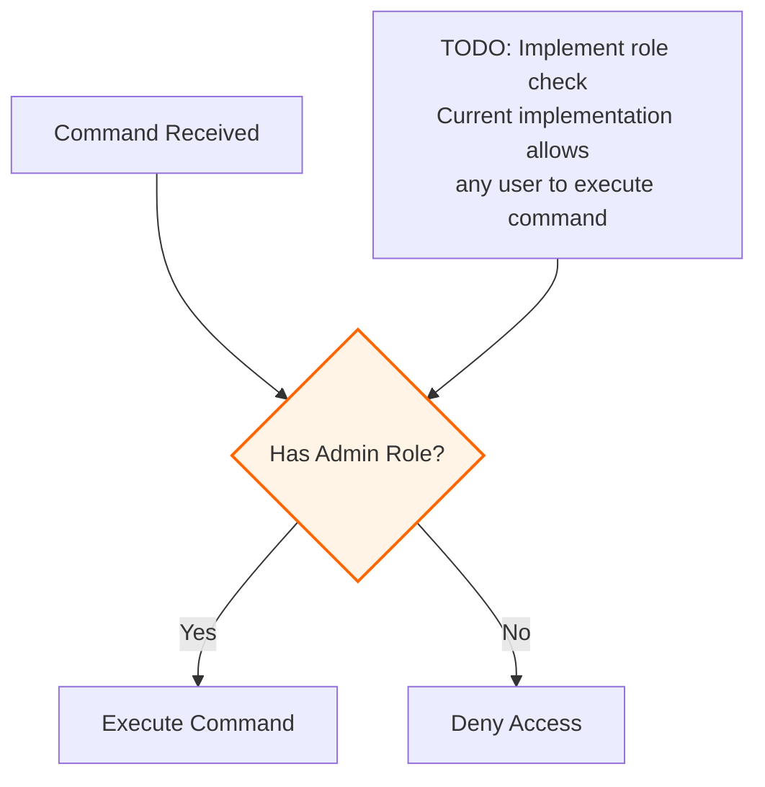

# Health Monitoring

<cite>
**Referenced Files in This Document**   
- [health.ts](file://apps/bot/src/commands/health.ts)
- [logger.ts](file://apps/bot/src/lib/logger.ts)
- [diagnostics.js](file://apps/admin-api/src/routes/diagnostics.js)
- [performance-monitoring.js](file://apps/admin-api/src/lib/performance-monitoring.js)
- [rbac.js](file://apps/admin-api/src/services/rbac.js)
</cite>

## Table of Contents
1. [Introduction](#introduction)
2. [Command Implementation](#command-implementation)
3. [System Information Collection](#system-information-collection)
4. [Response Structure](#response-structure)
5. [Security Considerations](#security-considerations)
6. [Monitoring Integration](#monitoring-integration)
7. [Extension Opportunities](#extension-opportunities)

## Introduction
The health monitoring system provides diagnostic capabilities for the bot and backend services through dedicated commands and API endpoints. This documentation details the implementation of the `!bothealth` and `!health` commands, explaining how system information is collected, formatted, and presented to users. The system collects various performance metrics including uptime, memory usage, version information, and connection status to provide comprehensive health insights.

## Command Implementation

The health monitoring commands are implemented in the bot service to provide real-time diagnostic information to users. Two command aliases are supported: `!bothealth` and `!health`, both triggering the same diagnostic functionality.

The command detection is handled by the `isHealthCommand` function, which normalizes the message content and checks for exact matches against the supported command strings. When a matching command is detected, the `handleHealthCommand` function is invoked to gather system information and generate a response.

**Section sources**
- [health.ts](file://apps/bot/src/commands/health.ts#L90-L96)

## System Information Collection

The health command collects several system metrics from the Node.js runtime environment and bot instance:

### Uptime Calculation
Uptime is retrieved using Node.js's `process.uptime()` method, which returns the number of seconds the process has been running. This raw value is formatted into a human-readable string by the `formatUptime` function, which breaks down the seconds into days, hours, minutes, and seconds components.

### Version Information
The bot version is extracted from the `package.json` file located in the application root. The code reads the file synchronously and parses the JSON to retrieve the version field. A default version of "0.1.0" is used if the package.json file cannot be read.

### Memory Usage
Memory consumption is obtained through Node.js's `process.memoryUsage()` method, which provides heap statistics. The implementation specifically uses the `heapUsed` property, converting the byte value to megabytes by dividing by 1024 twice.

### WebSocket Ping
The connection latency to Discord's API is measured using the WebSocket ping property (`client.ws.ping`), which represents the round-trip time in milliseconds between the bot and Discord's servers.

**Section sources**
- [health.ts](file://apps/bot/src/commands/health.ts#L28-L41)
- [health.ts](file://apps/bot/src/commands/health.ts#L15-L23)
- [health.ts](file://apps/bot/src/commands/health.ts#L53-L56)

## Response Structure

The health command response is structured using Discord's EmbedBuilder to create a visually organized message with multiple data fields.

```mermaid
flowchart TD
A[Command Received] --> B[Gather System Metrics]
B --> C[Create Embed Builder]
C --> D[Set Embed Properties]
D --> E[Add Data Fields]
E --> F[Send Response]
F --> G[Log Command Execution]
subgraph Embed Properties
D1[Color: 0x00ff00]
D2[Title: "🤖 Bot Health Status"]
D3[Timestamp: Current]
end
subgraph Data Fields
E1[Status: ✅ Online]
E2[Uptime: formatUptime(uptime)]
E3[Version: botVersion]
E4[Environment: NODE_ENV]
E5[Memory Usage: heapUsed MB]
E6[Node.js: process.version]
E7[Guilds: guild count]
E8[Ping: ws.ping ms]
end
D --> D1
D --> D2
D --> D3
E --> E1
E --> E2
E --> E3
E --> E4
E --> E5
E --> E6
E --> E7
E --> E8
```

**Diagram sources**
- [health.ts](file://apps/bot/src/commands/health.ts#L58-L78)

The embed contains the following fields presented in a compact inline format:
- Status: Indicates the bot is online with a checkmark emoji
- Uptime: Formatted duration since the bot was started
- Version: Current bot version from package.json
- Environment: Current Node.js environment (production, development, etc.)
- Memory Usage: Heap memory consumption in megabytes
- Node.js: Runtime version
- Guilds: Number of Discord servers the bot is connected to
- Ping: WebSocket latency to Discord API

After sending the response, the command execution is logged using the `logInfo` function with context including the guild ID, user ID, and channel ID.

**Section sources**
- [health.ts](file://apps/bot/src/commands/health.ts#L58-L87)
- [logger.ts](file://apps/bot/src/lib/logger.ts#L25-L35)

## Security Considerations

The current implementation lacks role-based access control for the health command, as indicated by the TODO comment in the code. The system is designed to eventually restrict access to guild administrators, but this functionality is not yet implemented.



**Diagram sources**
- [health.ts](file://apps/bot/src/commands/health.ts#L50-L51)

The absence of access controls presents potential security implications:
- Information disclosure: System details like version numbers and memory usage could aid attackers in identifying vulnerabilities
- Reconnaissance: Attackers could use the command to determine when the bot restarts or experiences performance issues
- Resource exposure: While minimal, the command does consume server resources when executed

The role-based access control system exists in the codebase (rbac.js) but is not yet integrated with the health command. Once implemented, it would use Discord permission bits to verify if the user has sufficient privileges (MANAGE_GUILD or equivalent) to execute diagnostic commands.

**Section sources**
- [health.ts](file://apps/bot/src/commands/health.ts#L50-L51)
- [rbac.js](file://apps/admin-api/src/services/rbac.js#L5-L9)

## Monitoring Integration

The health monitoring functionality extends beyond the Discord commands to include API endpoints and performance tracking. The admin-api service provides a diagnostics endpoint that exposes similar system information through HTTP.

The performance monitoring system collects metrics on API request rates, response times, error rates, and database performance. This data can be integrated with external monitoring systems like Prometheus and Grafana, as indicated by the presence of monitoring configuration files in the repository.

The logging system captures health command executions with contextual information, enabling audit trails and usage analysis. This structured logging approach facilitates integration with centralized logging solutions.

**Section sources**
- [diagnostics.js](file://apps/admin-api/src/routes/diagnostics.js#L46-L77)
- [performance-monitoring.js](file://apps/admin-api/src/lib/performance-monitoring.js#L6-L246)

## Extension Opportunities

The health monitoring system can be extended in several ways to provide more comprehensive diagnostics:

### Additional Diagnostic Metrics
- CPU usage percentage
- Disk space utilization
- Database connection pool status
- Active WebSocket connections
- Event loop latency measurements

### Enhanced Security
- Implement the planned role-based access control
- Add command rate limiting to prevent abuse
- Support for private responses (ephemeral messages) to minimize information exposure
- IP-based access restrictions for sensitive diagnostic commands

### External Monitoring Integration
- Export metrics in Prometheus format
- Webhook notifications for system events
- Integration with alerting systems like Sentry
- Health check endpoints compatible with uptime monitors

### Advanced Features
- Historical performance data visualization
- Automated anomaly detection
- Comparative analysis against baseline metrics
- Multi-node cluster monitoring in distributed deployments

These extensions would enhance the monitoring capabilities while maintaining the simple, user-friendly interface of the current command system.