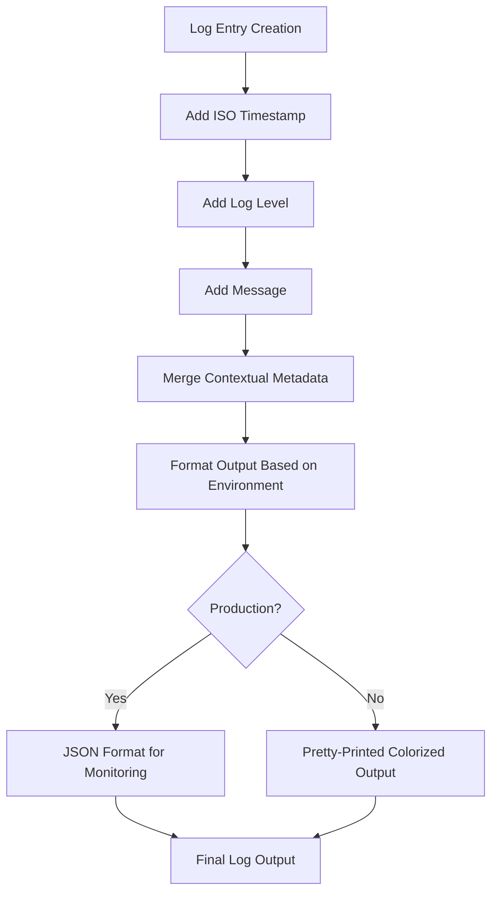
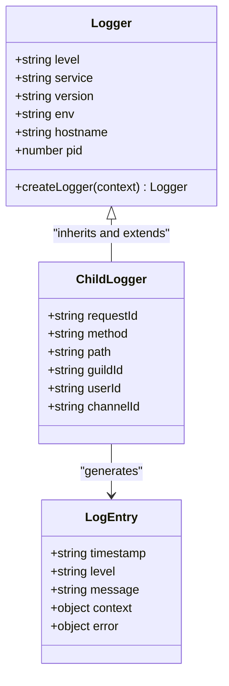
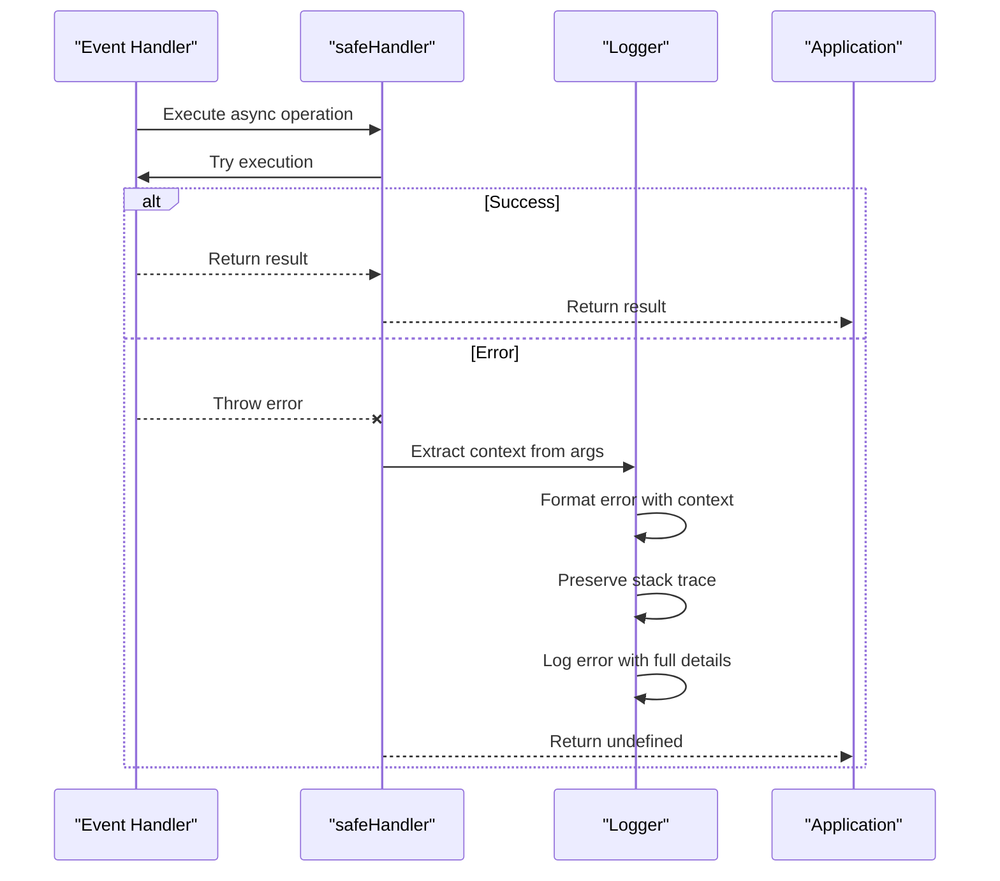
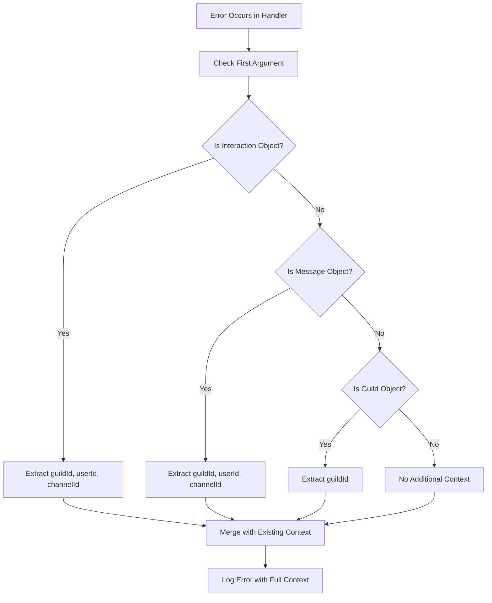
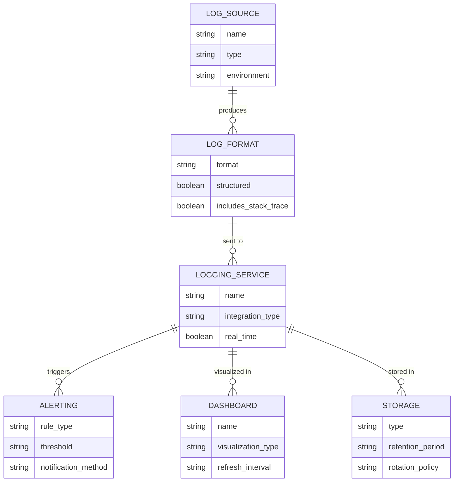
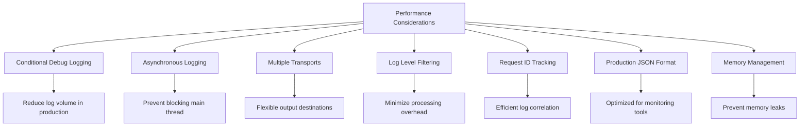

# Logging and Error Handling

<cite>
**Referenced Files in This Document**   
- [logger.js](file://apps/admin-api/src/lib/logger.js)
- [errors.js](file://apps/admin-api/src/lib/errors.js)
- [error-handler.js](file://apps/admin-api/src/middleware/error-handler.js)
- [request-id.js](file://apps/admin-api/src/middleware/request-id.js)
- [logger.ts](file://apps/bot/src/lib/logger.ts)
- [errorHandler.ts](file://apps/bot/src/lib/errorHandler.ts)
- [ERROR_HANDLING.md](file://apps/admin-api/ERROR_HANDLING.md)
- [BOT_LOGGING.md](file://apps/bot/docs/BOT_LOGGING.md)
- [logger.ts](file://apps/web/lib/monitoring/logger.ts)
- [apm.ts](file://apps/web/lib/monitoring/apm.ts)
</cite>

## Table of Contents
1. [Introduction](#introduction)
2. [Structured Logging Format](#structured-logging-format)
3. [Log Levels and Usage](#log-levels-and-usage)
4. [Context Merging and Child Loggers](#context-merging-and-child-loggers)
5. [Error Handling Implementation](#error-handling-implementation)
6. [Automatic Context Extraction](#automatic-context-extraction)
7. [Future Enhancements](#future-enhancements)
8. [Performance Considerations](#performance-considerations)
9. [Conclusion](#conclusion)

## Introduction

The logging and error handling system across the monorepo provides comprehensive observability and crash protection for multiple services including admin-api, bot, and web applications. The system implements structured logging with consistent formats, standardized error handling with appropriate HTTP status codes, and crash-safe execution for asynchronous operations. This documentation details the implementation across different components and their integration patterns.

**Section sources**
- [ERROR_HANDLING.md](file://apps/admin-api/ERROR_HANDLING.md#L1-L216)
- [BOT_LOGGING.md](file://apps/bot/docs/BOT_LOGGING.md#L1-L313)

## Structured Logging Format

The logging system implements structured formats with consistent fields across services. The admin-api service uses Pino for high-performance structured logging with JSON output in production and pretty-printed format in development. The structured log format includes timestamp, log level, message, and contextual metadata.

The core components of the log structure include:
- **Timestamp**: ISO 8601 formatted timestamp using `pino.stdTimeFunctions.isoTime`
- **Log Level**: Standardized levels (INFO, WARN, ERROR, DEBUG, FATAL)
- **Service Context**: Automatically added fields including service name, version, environment, hostname, and process ID
- **Request Context**: Request ID, method, path, query parameters, and IP address
- **Response Context**: Status code and duration for completed requests

In production, logs are output in JSON format suitable for ingestion by monitoring platforms, while development environments use pretty-printed output with colorization for better readability.



**Diagram sources**
- [logger.js](file://apps/admin-api/src/lib/logger.js#L8-L88)
- [logger.ts](file://apps/web/lib/monitoring/logger.ts#L151-L172)

**Section sources**
- [logger.js](file://apps/admin-api/src/lib/logger.js#L1-L160)
- [logger.ts](file://apps/web/lib/monitoring/logger.ts#L1-L310)

## Log Levels and Usage

The system implements four primary log levels with specific usage scenarios and appropriate severity classification:

- **INFO**: Used for general informational messages about application flow, such as service startup, successful operations, and significant events. These logs indicate normal application behavior and successful completion of operations.

- **WARN**: Used for warning messages that indicate non-critical issues or potential problems that don't prevent the application from functioning. Examples include rate limit approaches, deprecated API usage, or fallback mechanisms being triggered.

- **ERROR**: Used for error messages that indicate failures or exceptions that prevent specific operations from completing successfully. These include validation failures, external service errors, and other recoverable error conditions.

- **DEBUG**: Used for debug messages that provide detailed information about application state and execution flow. These logs are only enabled in development environments to avoid performance overhead and excessive log volume in production.

Each service implements appropriate log level filtering based on the environment, with debug logs automatically suppressed in production. The log level can be configured via the `LOG_LEVEL` environment variable, with a default of `debug` in development and `info` in production.

```mermaid
stateDiagram-v2
[*] --> INFO
[*] --> WARN
[*] --> ERROR
[*] --> DEBUG
INFO --> "General operational information"
INFO --> "Service startup/shutdown"
INFO --> "Successful operations"
WARN --> "Non-critical issues"
WARN --> "Rate limit warnings"
WARN --> "Deprecated feature usage"
WARN --> "Fallback mechanisms"
ERROR --> "Operation failures"
ERROR --> "Validation errors"
ERROR --> "External service failures"
ERROR --> "Recoverable exceptions"
DEBUG --> "Detailed execution flow"
DEBUG --> "Variable state inspection"
DEBUG --> "Development debugging"
DEBUG --> "Conditional : NODE_ENV !== 'production'"
```

**Diagram sources**
- [logger.js](file://apps/admin-api/src/lib/logger.js#L5-L6)
- [logger.ts](file://apps/bot/src/lib/logger.ts#L14-L14)
- [logger.ts](file://apps/web/lib/monitoring/logger.ts#L116-L116)

**Section sources**
- [logger.js](file://apps/admin-api/src/lib/logger.js#L5-L6)
- [logger.ts](file://apps/bot/src/lib/logger.ts#L14-L14)
- [logger.ts](file://apps/web/lib/monitoring/logger.ts#L116-L116)

## Context Merging and Child Loggers

The logging system implements a hierarchical context merging behavior through the `createLogger` function, which creates child loggers that inherit default properties from parent loggers while allowing additional context to be merged.

In the admin-api service, the `createLogger` function creates child loggers using Pino's built-in child logger functionality, which inherits the parent's configuration and serializers while adding new context fields. This allows for consistent logging across different components while maintaining relevant contextual information.

In the bot service, the `createLogger` function returns an object with bound logging methods that automatically merge the default context with any additional context provided at the time of logging. The context merging follows a shallow merge pattern where properties from the additional context override those in the default context.

The context merging behavior ensures that important contextual information such as request IDs, guild IDs, user IDs, and channel IDs are consistently included in log entries without requiring manual addition for each log call. This hierarchical approach reduces code duplication and ensures consistent context across related operations.



**Diagram sources**
- [logger.js](file://apps/admin-api/src/lib/logger.js#L94-L96)
- [logger.ts](file://apps/bot/src/lib/logger.ts#L81-L91)

**Section sources**
- [logger.js](file://apps/admin-api/src/lib/logger.js#L94-L96)
- [logger.ts](file://apps/bot/src/lib/logger.ts#L81-L91)

## Error Handling Implementation

The error handling system implements a comprehensive approach to error management across services, with the `safeHandler` function providing crash protection for asynchronous operations. This wrapper function catches unhandled errors, logs them with appropriate context, and prevents process crashes while allowing the application to continue running.

In the bot service, the `safeHandler` function wraps async event handlers and automatically extracts context from Discord.js objects such as Interactions, Messages, and Guilds. When an error occurs, it is caught, logged with full stack trace preservation, and the application continues execution without crashing.

The admin-api service implements a centralized error handling middleware that standardizes error responses and ensures consistent error formatting. The system uses a hierarchy of error classes that extend `AppError`, each with appropriate HTTP status codes and error codes. This allows for precise error classification and appropriate client responses.

The error handling implementation also includes automatic stack trace preservation, with full stack traces included in logs while being selectively exposed in responses based on the environment (included in development, excluded in production for security).



**Diagram sources**
- [errorHandler.ts](file://apps/bot/src/lib/errorHandler.ts#L13-L54)
- [errors.js](file://apps/admin-api/src/lib/errors.js#L6-L255)
- [error-handler.js](file://apps/admin-api/src/middleware/error-handler.js#L10-L42)

**Section sources**
- [errorHandler.ts](file://apps/bot/src/lib/errorHandler.ts#L13-L54)
- [errors.js](file://apps/admin-api/src/lib/errors.js#L6-L255)
- [error-handler.js](file://apps/admin-api/src/middleware/error-handler.js#L10-L42)

## Automatic Context Extraction

The error handling system automatically extracts contextual information from Discord.js objects to provide rich debugging information when errors occur. The `safeHandler` function inspects the first argument of wrapped functions to identify Discord.js object types and extract relevant context fields.

For Interaction objects, the system extracts:
- **guildId**: The ID of the guild where the interaction occurred (or 'DM' for direct messages)
- **userId**: The ID of the user who triggered the interaction
- **channelId**: The ID of the channel where the interaction occurred

For Message objects, the system extracts:
- **guildId**: The ID of the guild where the message was sent (or 'DM' for direct messages)
- **userId**: The ID of the user who sent the message
- **channelId**: The ID of the channel where the message was sent

For Guild objects, the system extracts:
- **guildId**: The ID of the guild

This automatic context extraction ensures that relevant contextual information is always available in error logs without requiring manual addition by developers. The context is merged with any existing context and included in the log entry, making it easier to trace and debug issues.



**Diagram sources**
- [errorHandler.ts](file://apps/bot/src/lib/errorHandler.ts#L23-L45)
- [BOT_LOGGING.md](file://apps/bot/docs/BOT_LOGGING.md#L104-L130)

**Section sources**
- [errorHandler.ts](file://apps/bot/src/lib/errorHandler.ts#L23-L45)
- [BOT_LOGGING.md](file://apps/bot/docs/BOT_LOGGING.md#L104-L130)

## Future Enhancements

The logging and error handling system has several planned future enhancements to improve observability and operational capabilities:

- **External Logging Services**: Integration with external logging platforms such as Sentry, LogDNA, or Datadog for centralized log management, advanced search capabilities, and alerting.
- **JSON Logging**: Implementation of structured JSON logging in production environments for easier parsing and analysis by monitoring tools.
- **Log Rotation**: Implementation of log rotation and archiving strategies to manage disk space usage and ensure log availability for historical analysis.
- **Metrics Dashboards**: Development of comprehensive metrics dashboards using tools like Grafana to visualize system performance, error rates, and operational health.
- **Distributed Tracing**: Addition of distributed tracing capabilities to track requests across service boundaries and identify performance bottlenecks.
- **Anomaly Detection**: Implementation of machine learning-based anomaly detection to identify unusual patterns in logs and metrics.
- **Performance Profiling**: Continuous performance profiling in production to identify and address performance issues proactively.

These enhancements will build upon the existing foundation to provide more comprehensive observability and improve the ability to diagnose and resolve issues quickly.



**Diagram sources**
- [BOT_LOGGING.md](file://apps/bot/docs/BOT_LOGGING.md#L306-L312)
- [MONITORING_README.md](file://apps/admin-api/MONITORING_README.md#L201-L208)

**Section sources**
- [BOT_LOGGING.md](file://apps/bot/docs/BOT_LOGGING.md#L306-L312)
- [MONITORING_README.md](file://apps/admin-api/MONITORING_README.md#L201-L208)

## Performance Considerations

The logging system incorporates several performance considerations to ensure minimal impact on application performance, particularly in production environments:

- **Conditional Debug Logging**: Debug logs are only enabled in development environments, reducing log volume and I/O overhead in production.
- **Asynchronous Logging**: The web application's logger implementation uses asynchronous writes to prevent blocking the main execution thread.
- **Multiple Transports**: Support for multiple logging transports (console and file) with configurable enablement based on environment.
- **Log Level Filtering**: Efficient log level filtering prevents unnecessary log processing and output for lower severity levels.
- **Request ID Tracking**: Unique request IDs enable efficient correlation of logs across distributed systems without requiring excessive contextual data in each log entry.
- **Production JSON Format**: JSON-formatted logs in production are optimized for machine parsing and ingestion by monitoring platforms.
- **Memory Management**: The APM system limits stored traces to prevent unbounded memory growth while still providing sufficient data for analysis.

These performance considerations ensure that the logging system provides comprehensive observability without introducing significant overhead that could impact application responsiveness or scalability.



**Diagram sources**
- [logger.ts](file://apps/web/lib/monitoring/logger.ts#L175-L178)
- [apm.ts](file://apps/web/lib/monitoring/apm.ts#L59-L59)
- [logger.js](file://apps/admin-api/src/lib/logger.js#L5-L6)

**Section sources**
- [logger.ts](file://apps/web/lib/monitoring/logger.ts#L175-L178)
- [apm.ts](file://apps/web/lib/monitoring/apm.ts#L59-L59)
- [logger.js](file://apps/admin-api/src/lib/logger.js#L5-L6)

## Conclusion

The logging and error handling system across the monorepo provides a robust foundation for observability and reliability. By implementing structured logging with consistent formats, standardized error handling with appropriate HTTP status codes, and crash-safe execution for asynchronous operations, the system ensures that applications can be effectively monitored and debugged.

The hierarchical context merging behavior through child loggers reduces code duplication and ensures consistent context across related operations. The automatic context extraction from Discord.js objects provides rich debugging information without requiring manual addition by developers.

Future enhancements will build upon this foundation to provide even more comprehensive observability through external logging services, JSON logging, log rotation, and metrics dashboards. The performance considerations ensure that the logging system provides comprehensive observability without introducing significant overhead that could impact application performance.

This comprehensive approach to logging and error handling enables faster issue diagnosis, improved system reliability, and better overall operational capabilities across the entire application ecosystem.