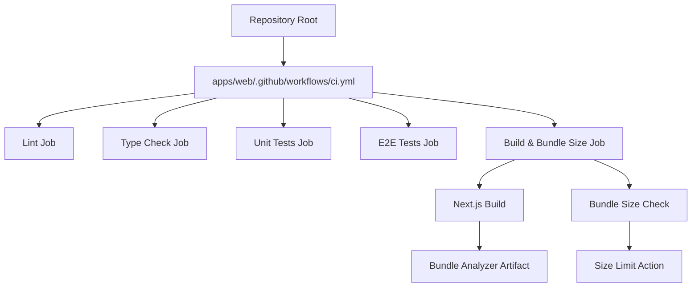
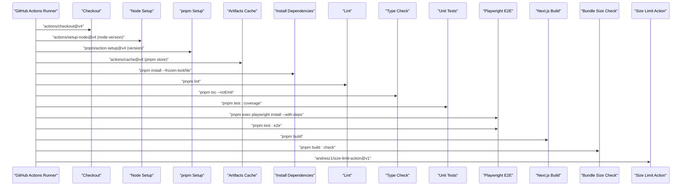
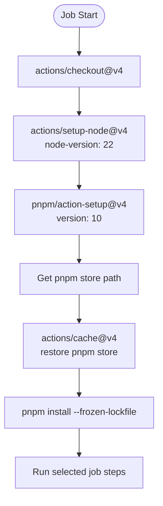
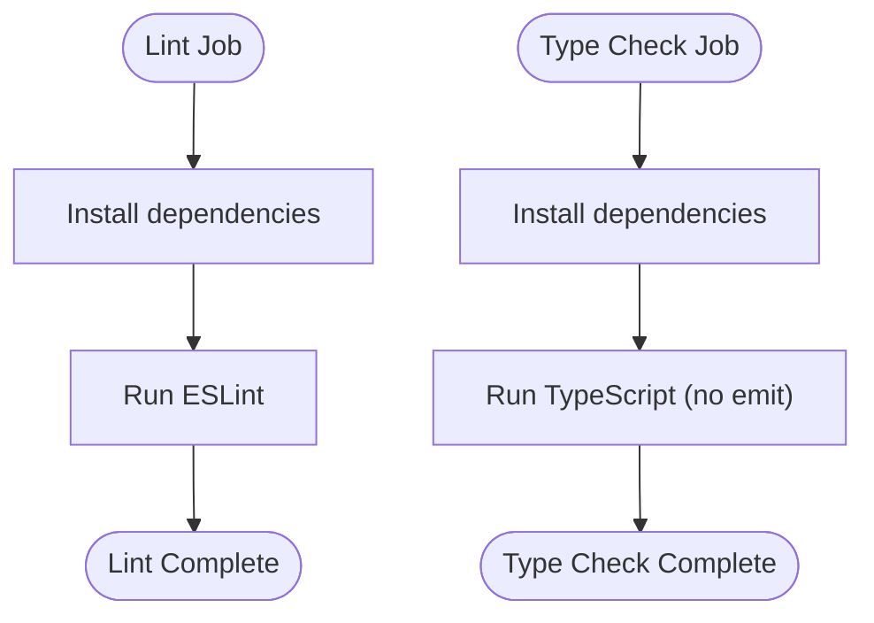
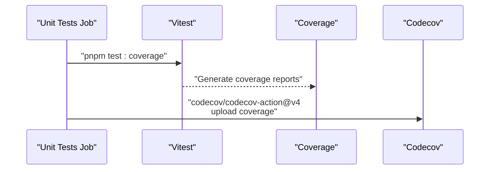
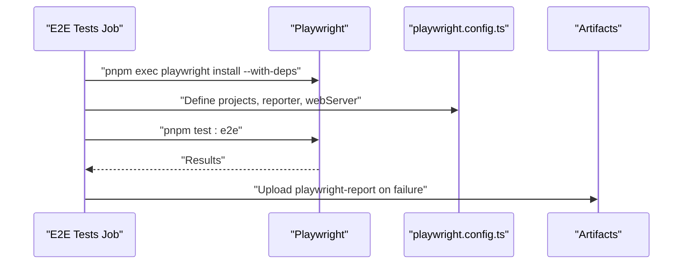
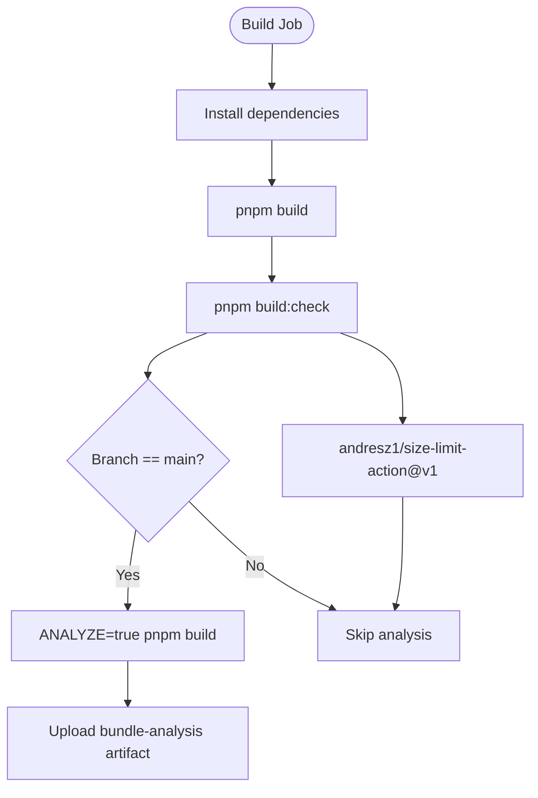
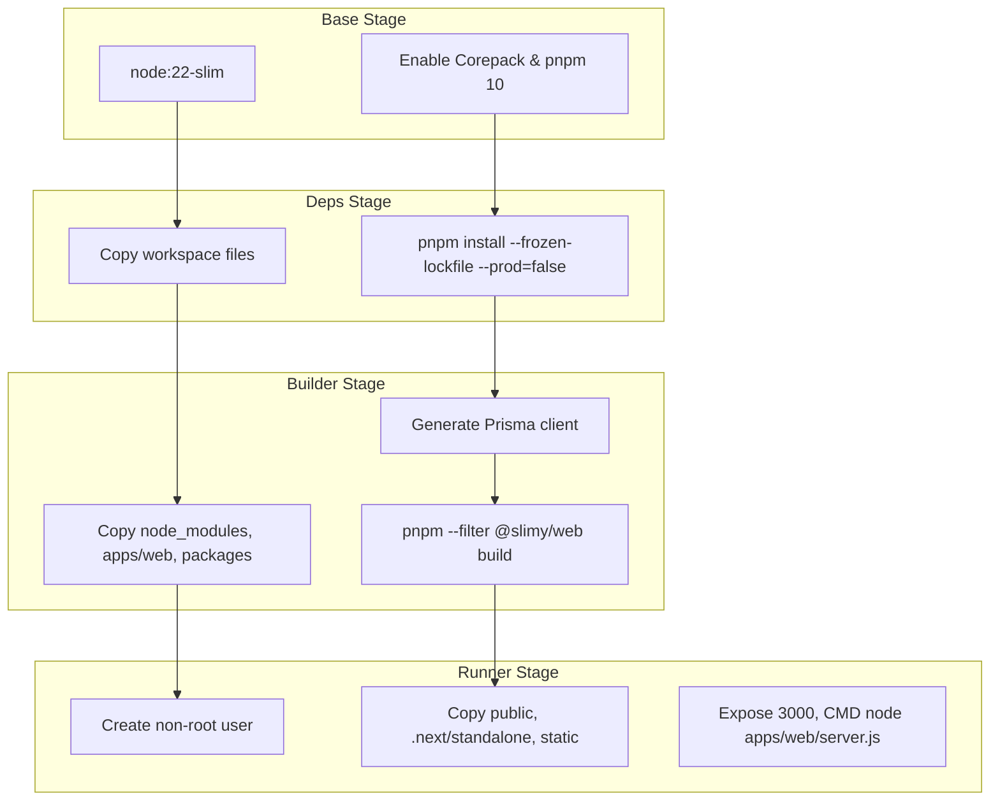
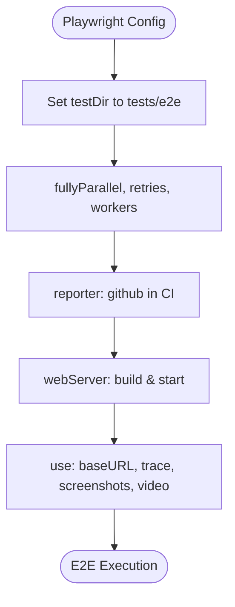
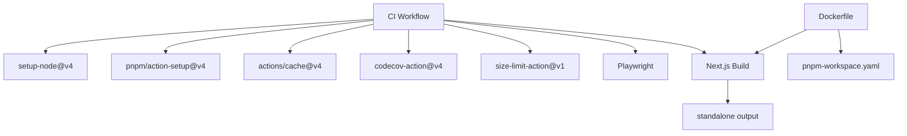

# CI Workflow Configuration

<cite>
**Referenced Files in This Document**
- [ci.yml](file://apps/web/.github/workflows/ci.yml)
- [playwright.config.ts](file://apps/web/playwright.config.ts)
- [package.json](file://apps/web/package.json)
- [vitest.config.ts](file://apps/web/vitest.config.ts)
- [pnpm-workspace.yaml](file://pnpm-workspace.yaml)
- [Dockerfile](file://apps/web/Dockerfile)
- [next.config.js](file://apps/web/next.config.js)
- [check-bundle-size.ts](file://apps/web/scripts/check-bundle-size.ts)
- [aggregate-codes-workflow.yml](file://apps/web/aggregate-codes-workflow.yml)
- [docker-compose.yml](file://apps/web/docker-compose.yml)
</cite>

## Table of Contents
1. [Introduction](#introduction)
2. [Project Structure](#project-structure)
3. [Core Components](#core-components)
4. [Architecture Overview](#architecture-overview)
5. [Detailed Component Analysis](#detailed-component-analysis)
6. [Dependency Analysis](#dependency-analysis)
7. [Performance Considerations](#performance-considerations)
8. [Troubleshooting Guide](#troubleshooting-guide)
9. [Conclusion](#conclusion)
10. [Appendices](#appendices)

## Introduction
This document describes the GitHub Actions CI workflow for the Next.js application in the monorepo. It covers the pipeline stages (code checkout, environment setup, dependency installation with pnpm, linting, type checking, unit tests, E2E tests, build, and bundle size checks), the matrix strategy for Node.js versions, the build and Docker image creation process, caching mechanisms, Playwright integration for end-to-end testing, and reporting of test results. It also provides troubleshooting guidance and best practices for extending the CI configuration.

## Project Structure
The CI workflow is defined under the Next.js application’s GitHub Actions workflows directory. The workflow orchestrates jobs for linting, type checking, unit tests, E2E tests, and build/bundle size verification. The Next.js app uses standalone output and is configured to run with pnpm in a monorepo workspace.

**Diagram sources**
- [ci.yml](file://apps/web/.github/workflows/ci.yml#L1-L243)

**Section sources**
- [ci.yml](file://apps/web/.github/workflows/ci.yml#L1-L243)
- [package.json](file://apps/web/package.json#L1-L83)

## Core Components
- CI workflow definition and jobs
- Playwright configuration for E2E tests
- Test runners and coverage configuration
- pnpm workspace configuration
- Next.js build and standalone output
- Dockerfile for multi-stage build and production image
- Bundle size monitoring script and size limit action

**Section sources**
- [ci.yml](file://apps/web/.github/workflows/ci.yml#L1-L243)
- [playwright.config.ts](file://apps/web/playwright.config.ts#L1-L36)
- [vitest.config.ts](file://apps/web/vitest.config.ts#L1-L50)
- [pnpm-workspace.yaml](file://pnpm-workspace.yaml#L1-L14)
- [next.config.js](file://apps/web/next.config.js#L1-L7)
- [Dockerfile](file://apps/web/Dockerfile#L1-L79)
- [check-bundle-size.ts](file://apps/web/scripts/check-bundle-size.ts#L1-L224)

## Architecture Overview
The CI pipeline is composed of independent jobs that run in parallel on Ubuntu runners. Each job sets up Node.js and pnpm, restores dependency caches, installs dependencies, and executes the appropriate scripts. E2E tests use Playwright with a local web server started by the test runner. Build and bundle size checks produce artifacts for analysis and enforce limits.

**Diagram sources**
- [ci.yml](file://apps/web/.github/workflows/ci.yml#L1-L243)
- [playwright.config.ts](file://apps/web/playwright.config.ts#L1-L36)
- [package.json](file://apps/web/package.json#L1-L83)

## Detailed Component Analysis

### CI Workflow Definition and Matrix Strategy
- The workflow triggers on pushes and pull requests to the main branch.
- Jobs are defined for linting, type checking, unit tests, E2E tests, and build/bundle size checks.
- There is no explicit matrix strategy for Node.js versions in the current workflow. All jobs use Node.js 22 in the workflow file. If a matrix is desired, it can be added at the job level to test multiple Node.js versions.

Key behaviors:
- Environment setup uses actions/setup-node with Node.js 22.
- pnpm is installed via pnpm/action-setup with version 10.
- Dependency caching uses actions/cache with the pnpm store path derived from pnpm store path.
- Dependency installation uses pnpm install with the frozen lockfile flag to ensure deterministic installs.

Best practice note:
- To add a matrix for Node.js versions, define strategy.matrix.node-version in each job and reference ${{ matrix.node-version }} in the setup-node step.

**Section sources**
- [ci.yml](file://apps/web/.github/workflows/ci.yml#L1-L243)

### Dependency Installation with pnpm and Caching
- pnpm store directory is determined and cached using actions/cache to speed up subsequent runs.
- pnpm install runs with --frozen-lockfile to ensure reproducible builds.
- pnpm workspace configuration allows monorepo-wide dependency management.

**Diagram sources**
- [ci.yml](file://apps/web/.github/workflows/ci.yml#L1-L243)
- [pnpm-workspace.yaml](file://pnpm-workspace.yaml#L1-L14)

**Section sources**
- [ci.yml](file://apps/web/.github/workflows/ci.yml#L1-L243)
- [pnpm-workspace.yaml](file://pnpm-workspace.yaml#L1-L14)

### Linting and Type Checking
- Lint job runs ESLint against the monorepo workspace.
- Type check job runs TypeScript compiler with no emit to validate types.

**Diagram sources**
- [ci.yml](file://apps/web/.github/workflows/ci.yml#L1-L243)
- [package.json](file://apps/web/package.json#L1-L83)

**Section sources**
- [ci.yml](file://apps/web/.github/workflows/ci.yml#L1-L243)
- [package.json](file://apps/web/package.json#L1-L83)

### Unit Tests and Coverage Reporting
- Unit tests job runs Vitest with coverage enabled.
- Coverage results are uploaded to Codecov with flags and names configured.

**Diagram sources**
- [ci.yml](file://apps/web/.github/workflows/ci.yml#L1-L243)
- [vitest.config.ts](file://apps/web/vitest.config.ts#L1-L50)

**Section sources**
- [ci.yml](file://apps/web/.github/workflows/ci.yml#L1-L243)
- [vitest.config.ts](file://apps/web/vitest.config.ts#L1-L50)

### E2E Testing with Playwright
- E2E job installs Playwright browsers with dependencies, runs Playwright tests, and uploads the Playwright report on failure.
- Playwright configuration sets test directory, parallelism, retries, workers, reporter, and web server settings for local development and CI.

**Diagram sources**
- [ci.yml](file://apps/web/.github/workflows/ci.yml#L1-L243)
- [playwright.config.ts](file://apps/web/playwright.config.ts#L1-L36)
- [package.json](file://apps/web/package.json#L1-L83)

**Section sources**
- [ci.yml](file://apps/web/.github/workflows/ci.yml#L1-L243)
- [playwright.config.ts](file://apps/web/playwright.config.ts#L1-L36)
- [package.json](file://apps/web/package.json#L1-L83)

### Build and Bundle Size Checks
- Build job runs Next.js build with environment variables for admin API base and external codes URL.
- Bundle size check validates thresholds using a custom script and posts a comment on pull requests with size-limit action.
- On main branch, bundle analysis artifacts are uploaded for inspection.

**Diagram sources**
- [ci.yml](file://apps/web/.github/workflows/ci.yml#L1-L243)
- [check-bundle-size.ts](file://apps/web/scripts/check-bundle-size.ts#L1-L224)
- [package.json](file://apps/web/package.json#L1-L83)

**Section sources**
- [ci.yml](file://apps/web/.github/workflows/ci.yml#L1-L243)
- [check-bundle-size.ts](file://apps/web/scripts/check-bundle-size.ts#L1-L224)
- [package.json](file://apps/web/package.json#L1-L83)

### Docker Image Creation
- Multi-stage Dockerfile:
  - Base stage sets Node.js 22 slim image and enables Corepack with pnpm 10.
  - Deps stage copies workspace files and installs dependencies with pnpm.
  - Builder stage copies dependencies and app, generates Prisma client, and builds Next.js app.
  - Runner stage creates non-root user, copies static assets and standalone server, exposes port 3000, and starts the server.

**Diagram sources**
- [Dockerfile](file://apps/web/Dockerfile#L1-L79)
- [pnpm-workspace.yaml](file://pnpm-workspace.yaml#L1-L14)
- [next.config.js](file://apps/web/next.config.js#L1-L7)

**Section sources**
- [Dockerfile](file://apps/web/Dockerfile#L1-L79)
- [pnpm-workspace.yaml](file://pnpm-workspace.yaml#L1-L14)
- [next.config.js](file://apps/web/next.config.js#L1-L7)

### Integration with Playwright and Test Reporting
- Playwright configuration defines:
  - Test directory for E2E specs.
  - Parallel execution and retry policy.
  - Reporter selection based on CI environment.
  - Web server command to build and start the Next.js app locally for tests.
  - Trace, screenshot, and video capture policies.
- CI workflow uploads Playwright report artifacts on failure for debugging.

**Diagram sources**
- [playwright.config.ts](file://apps/web/playwright.config.ts#L1-L36)
- [package.json](file://apps/web/package.json#L1-L83)

**Section sources**
- [playwright.config.ts](file://apps/web/playwright.config.ts#L1-L36)
- [ci.yml](file://apps/web/.github/workflows/ci.yml#L1-L243)

### Matrix Strategy for Node.js Versions
- Current workflow does not define a matrix strategy for Node.js versions.
- To support multiple Node.js versions, add strategy.matrix.node-version to each job and reference ${{ matrix.node-version }} in setup-node.

[No sources needed since this section provides general guidance]

## Dependency Analysis
- The CI workflow depends on:
  - actions/checkout, actions/setup-node, pnpm/action-setup, actions/cache for environment setup and caching.
  - codecov/codecov-action for coverage reporting.
  - andresz1/size-limit-action for bundle size enforcement.
  - Playwright for E2E testing.
  - Next.js standalone output for production image.
- The Dockerfile depends on pnpm workspace configuration and Next.js standalone output.

**Diagram sources**
- [ci.yml](file://apps/web/.github/workflows/ci.yml#L1-L243)
- [Dockerfile](file://apps/web/Dockerfile#L1-L79)
- [pnpm-workspace.yaml](file://pnpm-workspace.yaml#L1-L14)
- [next.config.js](file://apps/web/next.config.js#L1-L7)

**Section sources**
- [ci.yml](file://apps/web/.github/workflows/ci.yml#L1-L243)
- [Dockerfile](file://apps/web/Dockerfile#L1-L79)
- [pnpm-workspace.yaml](file://pnpm-workspace.yaml#L1-L14)
- [next.config.js](file://apps/web/next.config.js#L1-L7)

## Performance Considerations
- Use pnpm store caching to minimize network overhead and improve install times.
- Keep Node.js and pnpm versions consistent across jobs to maximize cache hits.
- Run Playwright browsers installation once per job to avoid repeated downloads.
- Use standalone output for Next.js to reduce runtime dependencies in the production image.
- Limit bundle sizes with size-limit action and bundle analyzer to prevent regressions.

[No sources needed since this section provides general guidance]

## Troubleshooting Guide
Common issues and resolutions:
- Dependency installation failures:
  - Ensure pnpm install uses --frozen-lockfile and that pnpm store cache keys match lockfiles.
  - Verify pnpm-workspace.yaml includes required packages for monorepo resolution.
- E2E test failures:
  - Confirm Playwright browsers are installed with dependencies.
  - Check Playwright web server command and baseURL configuration.
  - Review uploaded playwright-report artifact for failing scenarios.
- Coverage upload failures:
  - Verify Codecov token secret is configured and coverage file path is correct.
- Bundle size regressions:
  - Inspect bundle-analysis artifact on main branch.
  - Adjust thresholds via environment variables in the size-limit action.
- Docker build failures:
  - Ensure Corepack is enabled and pnpm version matches the Dockerfile.
  - Verify Prisma client generation runs before Next.js build.

**Section sources**
- [ci.yml](file://apps/web/.github/workflows/ci.yml#L1-L243)
- [playwright.config.ts](file://apps/web/playwright.config.ts#L1-L36)
- [vitest.config.ts](file://apps/web/vitest.config.ts#L1-L50)
- [check-bundle-size.ts](file://apps/web/scripts/check-bundle-size.ts#L1-L224)
- [Dockerfile](file://apps/web/Dockerfile#L1-L79)

## Conclusion
The CI workflow provides a robust pipeline for linting, type checking, unit tests, E2E tests, and build/bundle size verification. It leverages pnpm caching, standalone Next.js output, and Playwright for reliable end-to-end testing. The Dockerfile supports multi-stage builds for efficient production images. Extending the workflow with a Node.js matrix and additional environments can further strengthen CI coverage.

[No sources needed since this section summarizes without analyzing specific files]

## Appendices

### Appendix A: Related Workflows
- An additional workflow aggregates codes periodically and stores snapshots as artifacts. This demonstrates artifact usage and scheduled jobs.

**Section sources**
- [aggregate-codes-workflow.yml](file://apps/web/aggregate-codes-workflow.yml#L1-L85)

### Appendix B: Docker Compose Overview
- The main docker-compose file includes infrastructure, admin API, web application, API gateway, and monitoring stacks for development and testing.

**Section sources**
- [docker-compose.yml](file://apps/web/docker-compose.yml#L1-L18)