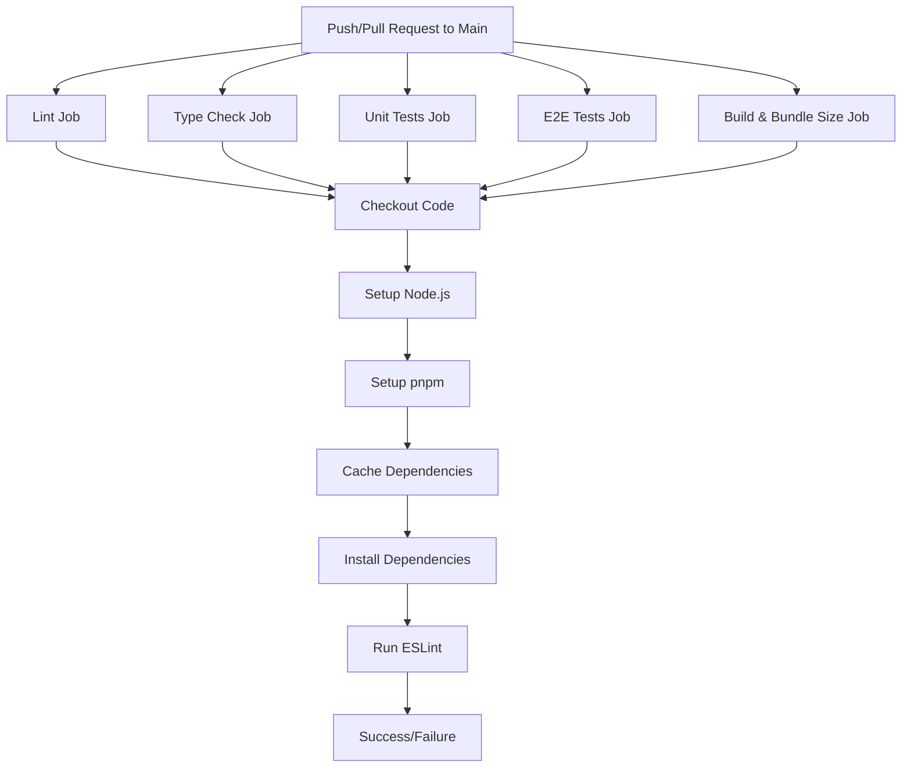
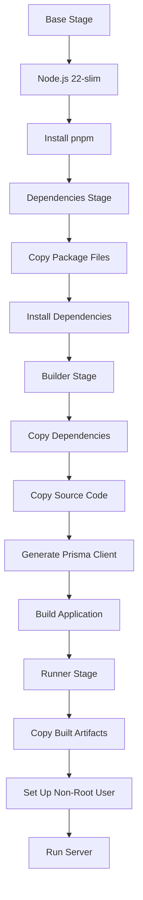
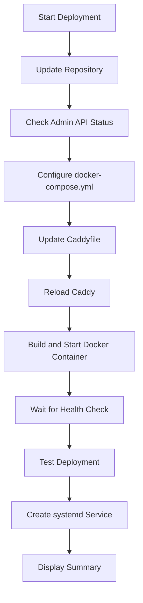
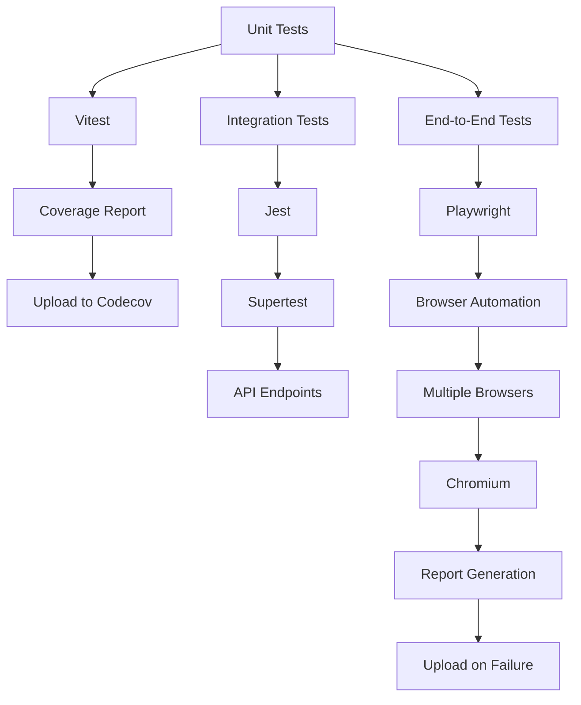
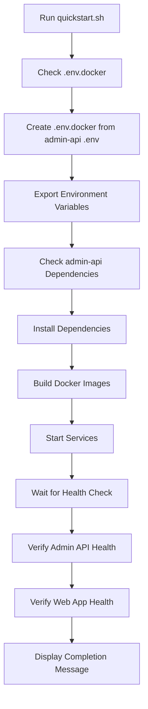
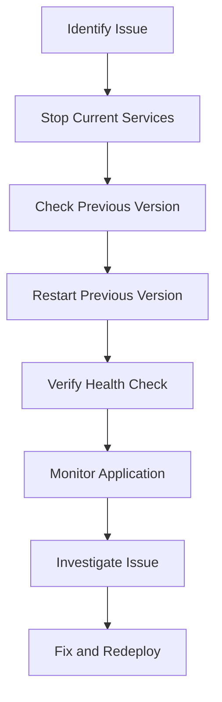
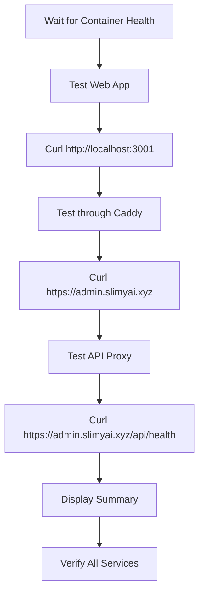

# CI/CD Pipeline

<cite>
**Referenced Files in This Document**   
- [ci.yml](file://apps/web/.github/workflows/ci.yml)
- [playwright.config.ts](file://apps/web/playwright.config.ts)
- [deploy-to-server.sh](file://apps/web/deploy-to-server.sh)
- [quickstart.sh](file://apps/web/quickstart.sh)
- [setup-env.sh](file://apps/web/setup-env.sh)
- [Dockerfile](file://apps/web/Dockerfile)
- [DEPLOYMENT.md](file://apps/web/DEPLOYMENT.md)
- [QUICKSTART.md](file://apps/web/QUICKSTART.md)
- [package.json](file://apps/web/package.json)
- [vitest.config.ts](file://apps/web/vitest.config.ts)
</cite>

## Table of Contents
1. [Introduction](#introduction)
2. [GitHub Actions Workflow](#github-actions-workflow)
3. [Docker-Based Build Process](#docker-based-build-process)
4. [Deployment Scripts](#deployment-scripts)
5. [Testing Strategy](#testing-strategy)
6. [Quickstart Automation](#quickstart-automation)
7. [Rollback Procedures](#rollback-procedures)
8. [Deployment Verification](#deployment-verification)
9. [Best Practices](#best-practices)

## Introduction
The CI/CD pipeline for the Slimy monorepo is designed to automate the build, test, and deployment processes for the web application. This documentation provides a comprehensive overview of the automated build and deployment system, focusing on the GitHub Actions workflow, Docker-based build process, deployment scripts, testing strategy, quickstart automation, rollback procedures, and deployment verification steps. The pipeline ensures consistent and reliable deployments while simplifying developer onboarding through automation.

## GitHub Actions Workflow

The GitHub Actions workflow defined in `ci.yml` orchestrates the continuous integration process for the web application. It consists of multiple jobs that run on push and pull request events to the main branch.

**Diagram sources**
- [ci.yml](file://apps/web/.github/workflows/ci.yml)

**Section sources**
- [ci.yml](file://apps/web/.github/workflows/ci.yml)

## Docker-Based Build Process

The Docker-based build process for the web application is defined in the `Dockerfile`. It uses a multi-stage build approach to optimize the final image size and ensure a clean build environment.

**Diagram sources**
- [Dockerfile](file://apps/web/Dockerfile)

**Section sources**
- [Dockerfile](file://apps/web/Dockerfile)
- [package.json](file://apps/web/package.json)

## Deployment Scripts

The deployment scripts automate the process of deploying and updating the web application on the server. The `deploy-to-server.sh` script handles the entire deployment process, from repository update to service verification.

**Diagram sources**
- [deploy-to-server.sh](file://apps/web/deploy-to-server.sh)

**Section sources**
- [deploy-to-server.sh](file://apps/web/deploy-to-server.sh)
- [DEPLOYMENT.md](file://apps/web/DEPLOYMENT.md)

## Testing Strategy

The testing strategy includes unit, integration, and end-to-end tests using Playwright. The tests are organized in the `tests` directory and executed as part of the CI pipeline.

**Diagram sources**
- [vitest.config.ts](file://apps/web/vitest.config.ts)
- [playwright.config.ts](file://apps/web/playwright.config.ts)

**Section sources**
- [vitest.config.ts](file://apps/web/vitest.config.ts)
- [playwright.config.ts](file://apps/web/playwright.config.ts)
- [package.json](file://apps/web/package.json)

## Quickstart Automation

The quickstart automation simplifies developer onboarding by providing a script that sets up the entire development environment with a single command. The `quickstart.sh` script automates the process of creating environment variables, installing dependencies, and starting services.

**Diagram sources**
- [quickstart.sh](file://apps/web/quickstart.sh)
- [setup-env.sh](file://apps/web/setup-env.sh)

**Section sources**
- [quickstart.sh](file://apps/web/quickstart.sh)
- [setup-env.sh](file://apps/web/setup-env.sh)
- [QUICKSTART.md](file://apps/web/QUICKSTART.md)

## Rollback Procedures

The rollback procedures are designed to quickly revert to a previous stable version in case of deployment issues. The process involves stopping the current services and restarting the previous version.

**Section sources**
- [deploy-to-server.sh](file://apps/web/deploy-to-server.sh)
- [DEPLOYMENT.md](file://apps/web/DEPLOYMENT.md)

## Deployment Verification

The deployment verification process ensures that the application is running correctly after deployment. It includes health checks, route verification, and functionality testing.

**Section sources**
- [deploy-to-server.sh](file://apps/web/deploy-to-server.sh)
- [QUICKSTART.md](file://apps/web/QUICKSTART.md)

## Best Practices

The best practices for contributing to the codebase and navigating the CI/CD process include following the defined workflows, writing comprehensive tests, and using the provided automation scripts.

**Section sources**
- [DEPLOYMENT.md](file://apps/web/DEPLOYMENT.md)
- [QUICKSTART.md](file://apps/web/QUICKSTART.md)
- [CONTRIBUTING.md](file://CONTRIBUTING.md)