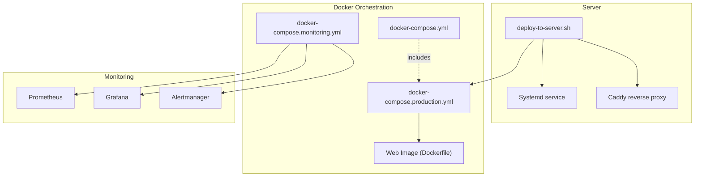
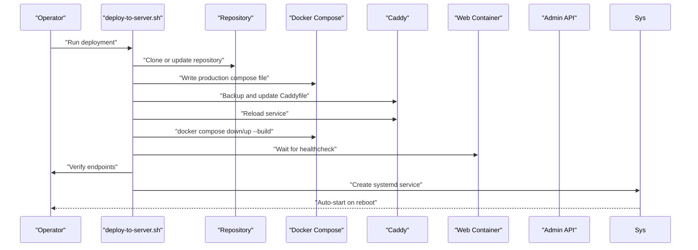
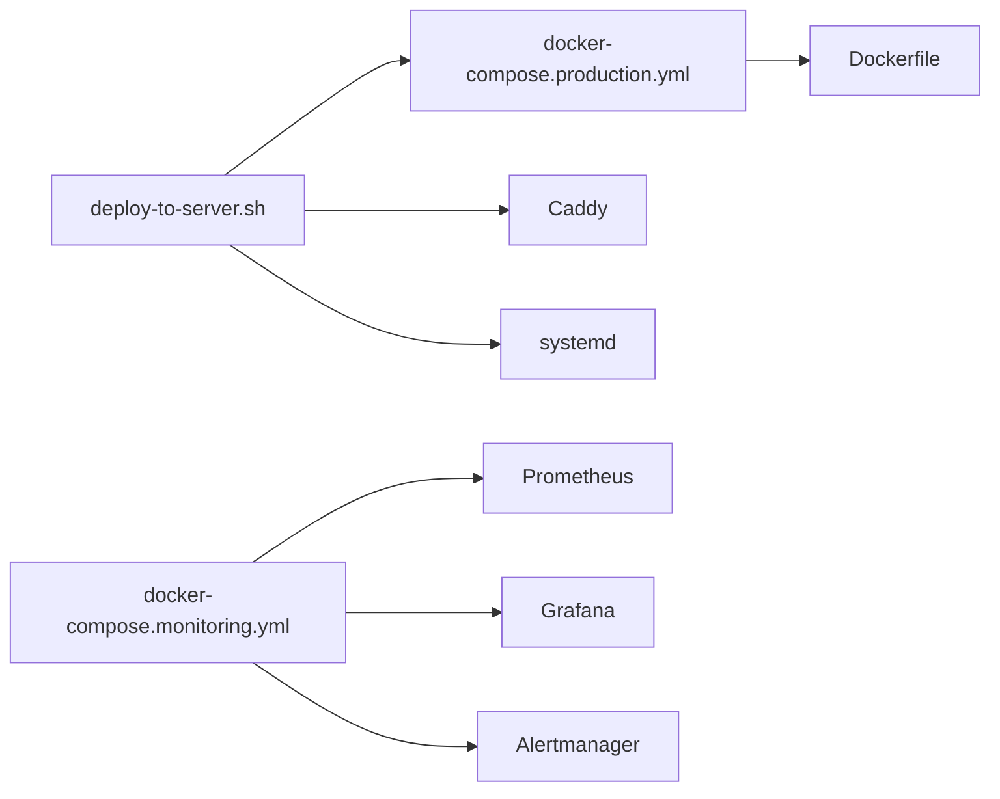

# Deployment Automation Scripts

<cite>
**Referenced Files in This Document**
- [deploy-to-server.sh](file://apps/web/deploy-to-server.sh)
- [Dockerfile](file://apps/web/Dockerfile)
- [docker-compose.production.yml](file://apps/web/docker-compose.production.yml)
- [docker-compose.yml](file://apps/web/docker-compose.yml)
- [docker-compose.monitoring.yml](file://apps/web/docker-compose.monitoring.yml)
- [docker-compose.slimy-nuc1.yml](file://infra/docker/docker-compose.slimy-nuc1.yml)
- [docker-compose.slimy-nuc2.yml](file://infra/docker/docker-compose.slimy-nuc2.yml)
- [setup-env.sh](file://apps/web/setup-env.sh)
- [quickstart.sh](file://apps/web/quickstart.sh)
- [DEPLOYMENT.md](file://apps/web/DEPLOYMENT.md)
- [ci.yml](file://apps/web/.github/workflows/ci.yml)
- [aggregate-codes-workflow.yml](file://apps/web/aggregate-codes-workflow.yml)
- [prometheus.yml](file://apps/admin-api/prometheus.yml)
- [alertmanager.yml](file://apps/web/monitoring/alertmanager.yml)
</cite>

## Table of Contents
1. [Introduction](#introduction)
2. [Project Structure](#project-structure)
3. [Core Components](#core-components)
4. [Architecture Overview](#architecture-overview)
5. [Detailed Component Analysis](#detailed-component-analysis)
6. [Dependency Analysis](#dependency-analysis)
7. [Performance Considerations](#performance-considerations)
8. [Troubleshooting Guide](#troubleshooting-guide)
9. [Conclusion](#conclusion)
10. [Appendices](#appendices)

## Introduction
This document explains the deployment automation scripts and orchestration used to deploy the web application in production. It focuses on the server-side deployment script that automates repository updates, Docker Compose orchestration, reverse proxy configuration, health checks, verification, and logging. It also covers environment variable handling, rollback considerations, monitoring integration, and customization for different environments.

## Project Structure
The deployment automation spans several files:
- A server-side deployment script that updates the repository, configures Docker Compose, updates the reverse proxy, starts services, verifies health, and sets up auto-start via systemd.
- Docker Compose files for production and monitoring stacks.
- Supporting scripts for environment setup and quickstart.
- CI/CD workflows that build and validate the application prior to deployment.

**Diagram sources**
- [deploy-to-server.sh](file://apps/web/deploy-to-server.sh#L1-L231)
- [docker-compose.production.yml](file://apps/web/docker-compose.production.yml#L1-L29)
- [docker-compose.yml](file://apps/web/docker-compose.yml#L1-L18)
- [docker-compose.monitoring.yml](file://apps/web/docker-compose.monitoring.yml#L1-L63)
- [Dockerfile](file://apps/web/Dockerfile#L1-L79)

**Section sources**
- [deploy-to-server.sh](file://apps/web/deploy-to-server.sh#L1-L231)
- [docker-compose.production.yml](file://apps/web/docker-compose.production.yml#L1-L29)
- [docker-compose.yml](file://apps/web/docker-compose.yml#L1-L18)
- [docker-compose.monitoring.yml](file://apps/web/docker-compose.monitoring.yml#L1-L63)
- [Dockerfile](file://apps/web/Dockerfile#L1-L79)

## Core Components
- Server deployment script: Orchestrates repository update, Docker Compose configuration, reverse proxy update, service startup, health verification, and systemd integration.
- Docker Compose production configuration: Defines the web service, environment variables, health checks, and networking for production.
- Monitoring stack: Optional Prometheus, Grafana, and Alertmanager services for observability.
- Environment setup script: Generates a Docker Compose environment file from admin API secrets.
- CI/CD workflows: Lint, type-check, unit tests, E2E tests, build, and bundle analysis jobs.

**Section sources**
- [deploy-to-server.sh](file://apps/web/deploy-to-server.sh#L1-L231)
- [docker-compose.production.yml](file://apps/web/docker-compose.production.yml#L1-L29)
- [docker-compose.monitoring.yml](file://apps/web/docker-compose.monitoring.yml#L1-L63)
- [setup-env.sh](file://apps/web/setup-env.sh#L1-L27)
- [ci.yml](file://apps/web/.github/workflows/ci.yml#L1-L243)

## Architecture Overview
The deployment pipeline integrates a server-side script with Docker Compose and a reverse proxy. The script updates the repository, writes a production Docker Compose file, updates the reverse proxy configuration, starts services, waits for health, performs verification, and enables auto-start via systemd. Monitoring services can be included optionally.

**Diagram sources**
- [deploy-to-server.sh](file://apps/web/deploy-to-server.sh#L1-L231)

## Detailed Component Analysis

### Server Deployment Script (deploy-to-server.sh)
Responsibilities:
- Repository management: Clones or updates the repository to the target branch.
- Reverse proxy configuration: Backs up and updates the Caddy configuration, then reloads the service.
- Docker orchestration: Writes a production Docker Compose file, brings containers down, rebuilds and starts them, and waits for health.
- Verification: Tests the web app locally and via HTTPS, and validates API proxy behavior when the admin API is available.
- Auto-start: Creates and enables a systemd service for automatic startup.
- Logging: Provides guidance for inspecting logs from Docker, Caddy, and systemd.

Environment variable handling:
- The script defines constants for paths and configuration. It does not source external environment files; instead, it writes a production Docker Compose file with environment variables for the web service.
- For environment-driven deployments, use the production Docker Compose file and supply environment variables via the Docker Compose environment mechanism.

Rollback procedures:
- The script does not implement an automated rollback. Recommended manual rollback steps:
  - Stop and remove current containers.
  - Re-run the script to redeploy the previous known-good image.
  - Alternatively, tag and push the previous image and redeploy using the production Docker Compose file with the desired image tag.

Verification steps:
- Local endpoint checks for the web app.
- HTTPS endpoint checks for the site.
- Conditional API proxy checks when the admin API is running.

Integration with Docker Compose:
- The script writes a production Docker Compose file tailored for the web service and health checks.
- It uses docker compose commands to manage lifecycle and health verification.

Security considerations:
- The script uses sudo to modify system files (Caddy configuration) and to reload services.
- Ensure the operator account has appropriate permissions and that only trusted users can execute the script.
- Restrict access to the server and limit who can run the deployment script.

Logging and monitoring:
- The script prints operational messages and suggests where to find logs for Docker, Caddy, and systemd.
- Monitoring services can be included via the monitoring compose file.

Customization for different environments:
- Modify repository URL, branch, and destination directory.
- Adjust Caddy configuration for different domains and ports.
- Change Docker Compose environment variables for different API endpoints and telemetry settings.

**Section sources**
- [deploy-to-server.sh](file://apps/web/deploy-to-server.sh#L1-L231)

### Production Docker Compose (docker-compose.production.yml)
Responsibilities:
- Defines the web service with build context and Dockerfile.
- Exposes the web app on a host port mapped to the container’s internal port.
- Sets environment variables for production, including admin API base URL and telemetry.
- Adds a healthcheck for the web service.
- Declares a named network for inter-service communication.

Integration with the deployment script:
- The deployment script writes this file and then uses docker compose to start the service.

**Section sources**
- [docker-compose.production.yml](file://apps/web/docker-compose.production.yml#L1-L29)

### Main Docker Compose (docker-compose.yml)
Responsibilities:
- Includes infrastructure, admin API, web, API gateway, and monitoring compose files.
- Used for development and testing; production deployments typically use the production compose file.

**Section sources**
- [docker-compose.yml](file://apps/web/docker-compose.yml#L1-L18)

### Monitoring Stack (docker-compose.monitoring.yml)
Responsibilities:
- Starts Prometheus, Grafana, and Alertmanager.
- Mounts configuration files and data volumes.
- Provides metrics scraping for the admin API and optional Docker metrics.

**Section sources**
- [docker-compose.monitoring.yml](file://apps/web/docker-compose.monitoring.yml#L1-L63)

### Environment Setup Script (setup-env.sh)
Responsibilities:
- Reads sensitive variables from the admin API environment file.
- Writes a Docker Compose environment file for the web service.
- Adds web-specific variables for admin API base URL and codes aggregator URL.

**Section sources**
- [setup-env.sh](file://apps/web/setup-env.sh#L1-L27)

### Quickstart Script (quickstart.sh)
Responsibilities:
- Loads environment variables from a Docker Compose environment file.
- Builds and starts services, then checks health for both admin API and web app.
- Provides useful commands for logs and lifecycle management.

**Section sources**
- [quickstart.sh](file://apps/web/quickstart.sh#L1-L97)

### CI/CD Workflows
Responsibilities:
- Lint, type-check, unit tests, E2E tests, build, and bundle analysis jobs.
- Uploads artifacts and coverage reports.
- Ensures the application is validated before deployment.

**Section sources**
- [ci.yml](file://apps/web/.github/workflows/ci.yml#L1-L243)

## Dependency Analysis
The deployment script depends on:
- Docker and Docker Compose for container orchestration.
- Caddy for reverse proxy and TLS termination.
- Systemd for auto-start.
- Git for repository updates.

Compose files depend on:
- The web Docker image built from the Dockerfile.
- Optional monitoring services.

**Diagram sources**
- [deploy-to-server.sh](file://apps/web/deploy-to-server.sh#L1-L231)
- [docker-compose.production.yml](file://apps/web/docker-compose.production.yml#L1-L29)
- [docker-compose.monitoring.yml](file://apps/web/docker-compose.monitoring.yml#L1-L63)
- [Dockerfile](file://apps/web/Dockerfile#L1-L79)

**Section sources**
- [deploy-to-server.sh](file://apps/web/deploy-to-server.sh#L1-L231)
- [docker-compose.production.yml](file://apps/web/docker-compose.production.yml#L1-L29)
- [docker-compose.monitoring.yml](file://apps/web/docker-compose.monitoring.yml#L1-L63)
- [Dockerfile](file://apps/web/Dockerfile#L1-L79)

## Performance Considerations
- Health checks: The production compose file includes healthchecks to ensure the web service is ready before traffic is routed.
- Reverse proxy: Caddy handles TLS termination and compression, reducing load on the web container.
- Monitoring: Prometheus and Grafana provide metrics and dashboards for runtime performance insights.

[No sources needed since this section provides general guidance]

## Troubleshooting Guide
Common issues and remedies:
- Caddy reload fails: Verify the Caddyfile syntax and permissions; check Caddy logs for errors.
- Docker compose fails to start: Inspect container logs for build or runtime errors; confirm environment variables are set correctly.
- Health checks failing: Review the web app logs and ensure dependencies (e.g., admin API) are reachable.
- Admin API proxy not working: Confirm the admin API is running and reachable on the expected port; verify reverse proxy routing rules.
- Rollback: Stop and remove current containers, then redeploy the previous known-good image or tag.

Logs to check:
- Docker: docker compose logs for the web service.
- Caddy: system logs for the Caddy service.
- Systemd: journalctl for the deployment service.

**Section sources**
- [deploy-to-server.sh](file://apps/web/deploy-to-server.sh#L1-L231)

## Conclusion
The deployment automation script provides a robust, end-to-end process for deploying the web application in production. It manages repository updates, reverse proxy configuration, container orchestration, health verification, and auto-start. By integrating with Docker Compose and optional monitoring services, it supports reliable, observable deployments. For production hardening, consider adding automated rollback, stricter access controls, and environment-specific customization.

[No sources needed since this section summarizes without analyzing specific files]

## Appendices

### Environment Variables for Production
- NEXT_PUBLIC_ADMIN_API_BASE: Base URL for the admin API used by the web app.
- NEXT_PUBLIC_SNELP_CODES_URL: Public URL for the codes aggregator feed.
- NODE_ENV: Set to production for optimal runtime behavior.
- Additional variables can be supplied via Docker Compose environment mechanisms.

**Section sources**
- [docker-compose.production.yml](file://apps/web/docker-compose.production.yml#L1-L29)

### Monitoring Configuration
- Prometheus configuration for scraping admin API metrics.
- Alertmanager configuration for email notifications.

**Section sources**
- [prometheus.yml](file://apps/admin-api/prometheus.yml#L1-L52)
- [alertmanager.yml](file://apps/web/monitoring/alertmanager.yml#L1-L46)

### CI/CD Pipeline Highlights
- Linting, type-checking, unit tests, E2E tests, build, and bundle analysis.
- Artifact uploads and coverage reporting.

**Section sources**
- [ci.yml](file://apps/web/.github/workflows/ci.yml#L1-L243)

### Example Workflows
- Scheduled codes aggregation workflow for periodic updates.

**Section sources**
- [aggregate-codes-workflow.yml](file://apps/web/aggregate-codes-workflow.yml#L1-L85)