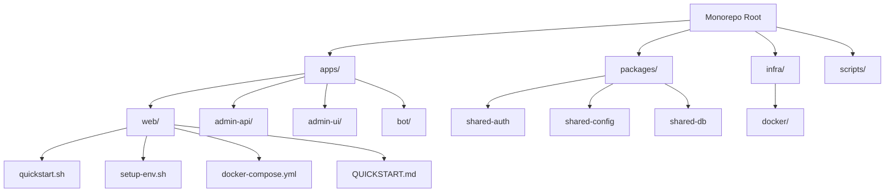
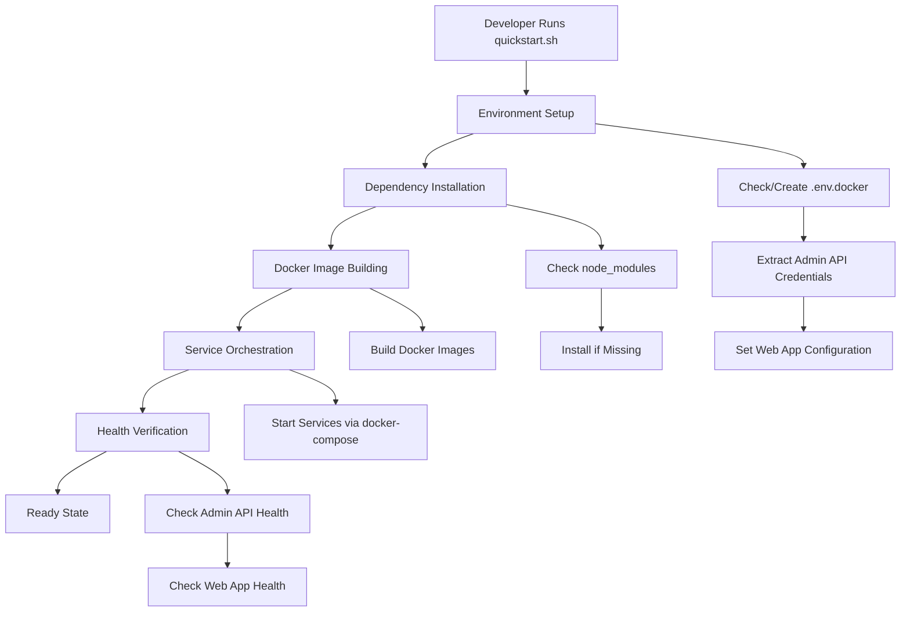
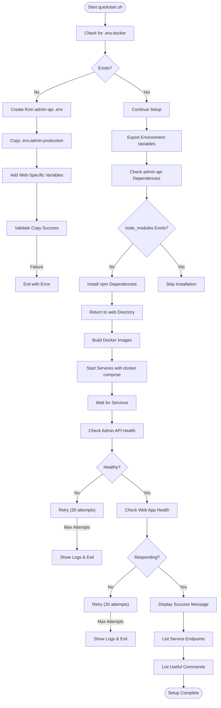
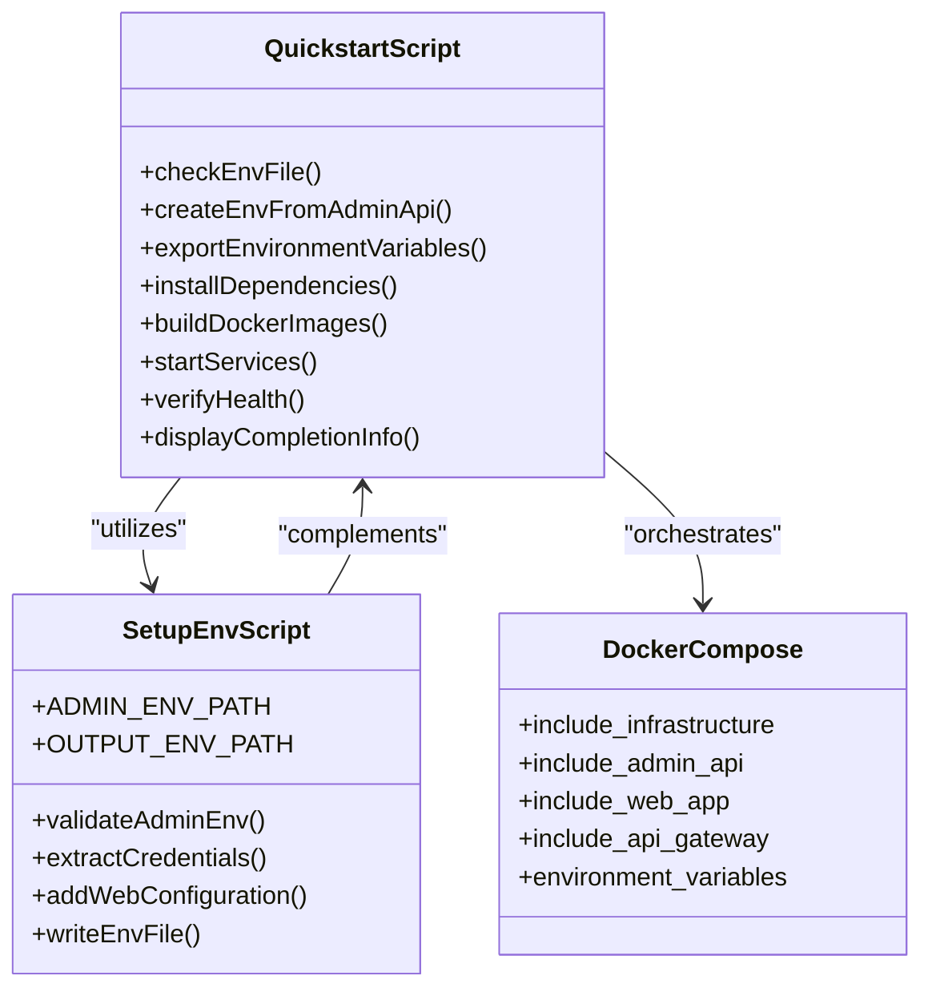
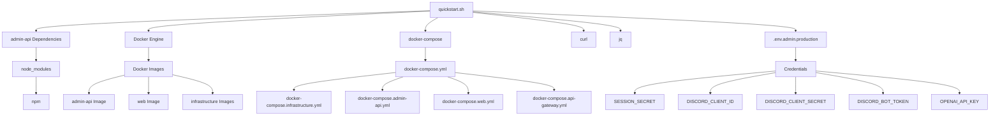
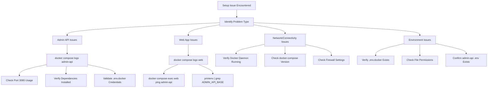

# Developer Onboarding Automation

<cite>
**Referenced Files in This Document**   
- [quickstart.sh](file://apps/web/quickstart.sh)
- [setup-env.sh](file://apps/web/setup-env.sh)
- [QUICKSTART.md](file://apps/web/QUICKSTART.md)
- [docker-compose.yml](file://apps/web/docker-compose.yml)
- [package.json](file://apps/web/package.json)
- [package.json](file://apps/admin-api/package.json)
</cite>

## Table of Contents
1. [Introduction](#introduction)
2. [Project Structure](#project-structure)
3. [Core Components](#core-components)
4. [Architecture Overview](#architecture-overview)
5. [Detailed Component Analysis](#detailed-component-analysis)
6. [Dependency Analysis](#dependency-analysis)
7. [Performance Considerations](#performance-considerations)
8. [Troubleshooting Guide](#troubleshooting-guide)
9. [Conclusion](#conclusion)

## Introduction
This document provides comprehensive documentation for the developer onboarding automation system using the `quickstart.sh` script. The automation streamlines environment setup, dependency installation, and service configuration for the Slimy monorepo. It enables developers to quickly establish a consistent development environment with minimal manual configuration, reducing onboarding time and ensuring uniformity across development teams.

## Project Structure
The project follows a monorepo structure with multiple applications and shared packages. The developer onboarding automation is centered in the web application directory, which coordinates with the admin-api service and infrastructure components.

**Diagram sources**
- [quickstart.sh](file://apps/web/quickstart.sh)
- [setup-env.sh](file://apps/web/setup-env.sh)
- [docker-compose.yml](file://apps/web/docker-compose.yml)

**Section sources**
- [quickstart.sh](file://apps/web/quickstart.sh)
- [setup-env.sh](file://apps/web/setup-env.sh)

## Core Components
The developer onboarding automation system consists of several core components that work together to create a seamless setup experience. The `quickstart.sh` script serves as the primary entry point, orchestrating the entire setup process. It handles environment variable configuration, dependency installation, Docker image building, and service startup with health verification.

The `setup-env.sh` script extracts essential credentials from the admin-api environment file and creates a Docker-specific environment configuration. This ensures that sensitive credentials are properly propagated to the containerized environment while maintaining security boundaries.

**Section sources**
- [quickstart.sh](file://apps/web/quickstart.sh#L1-L97)
- [setup-env.sh](file://apps/web/setup-env.sh#L1-L27)

## Architecture Overview
The onboarding automation follows a layered architecture that integrates local development setup with containerized services. The process begins with environment configuration, proceeds through dependency management, and concludes with container orchestration.

**Diagram sources**
- [quickstart.sh](file://apps/web/quickstart.sh#L1-L97)
- [docker-compose.yml](file://apps/web/docker-compose.yml#L1-L18)

## Detailed Component Analysis

### Quickstart Script Analysis
The `quickstart.sh` script automates the complete development environment setup process, ensuring consistency and reducing manual errors.

**Diagram sources**
- [quickstart.sh](file://apps/web/quickstart.sh#L1-L97)

**Section sources**
- [quickstart.sh](file://apps/web/quickstart.sh#L1-L97)
- [QUICKSTART.md](file://apps/web/QUICKSTART.md#L1-L165)

### Environment Setup Component
The environment configuration component ensures proper credential propagation and service connectivity.

**Diagram sources**
- [quickstart.sh](file://apps/web/quickstart.sh#L1-L97)
- [setup-env.sh](file://apps/web/setup-env.sh#L1-L27)
- [docker-compose.yml](file://apps/web/docker-compose.yml#L1-L18)

**Section sources**
- [setup-env.sh](file://apps/web/setup-env.sh#L1-L27)
- [docker-compose.yml](file://apps/web/docker-compose.yml#L1-L18)

## Dependency Analysis
The onboarding automation system has a clear dependency hierarchy that ensures proper setup sequence and service availability.

**Diagram sources**
- [quickstart.sh](file://apps/web/quickstart.sh#L1-L97)
- [package.json](file://apps/admin-api/package.json)
- [package.json](file://apps/web/package.json)

**Section sources**
- [quickstart.sh](file://apps/web/quickstart.sh#L31-L39)
- [package.json](file://apps/admin-api/package.json)
- [package.json](file://apps/web/package.json)

## Performance Considerations
The onboarding automation is designed for efficiency and reliability, with several performance considerations built into the process. The script minimizes redundant operations by checking for existing dependencies and configuration files before performing potentially time-consuming tasks. The health check mechanism uses exponential backoff principles with a maximum of 30 attempts and 2-second intervals, providing sufficient time for services to initialize while preventing indefinite waiting.

The Docker image building process leverages Docker's layer caching mechanism, ensuring that unchanged components do not require rebuilding. This significantly reduces setup time for subsequent runs. The parallel service startup via docker-compose optimizes resource utilization during the initialization phase.

## Troubleshooting Guide
This section provides guidance for resolving common issues encountered during the onboarding process.

**Section sources**
- [QUICKSTART.md](file://apps/web/QUICKSTART.md#L104-L133)
- [quickstart.sh](file://apps/web/quickstart.sh#L53-L68)
- [quickstart.sh](file://apps/web/quickstart.sh#L70-L83)

## Conclusion
The developer onboarding automation system centered around the `quickstart.sh` script provides a robust, reliable, and efficient method for setting up the development environment. By automating the configuration of environment variables, installation of dependencies, and orchestration of containerized services, the system significantly reduces onboarding time and ensures consistency across development environments.

The integration with Docker enables isolated, reproducible environments that mirror production conditions, while the health verification process ensures that services are fully operational before declaring setup completion. The comprehensive troubleshooting guidance and well-documented process make it easy for developers to resolve issues and understand the setup workflow.

This automation represents a significant improvement over manual setup processes, reducing the potential for configuration errors and ensuring that all developers work with identical environments, ultimately leading to more reliable development and testing outcomes.