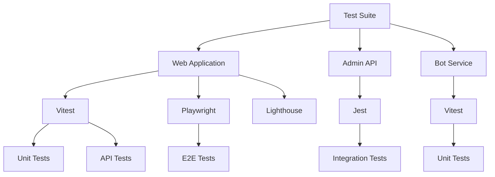
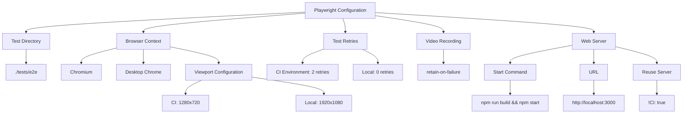
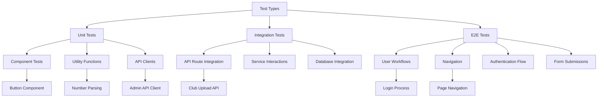
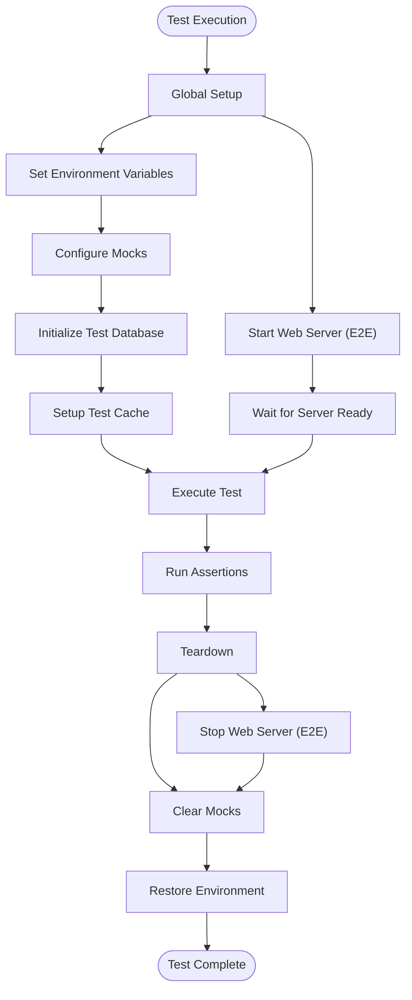
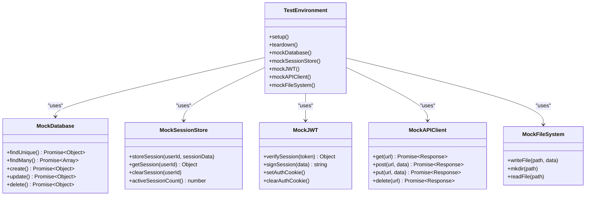
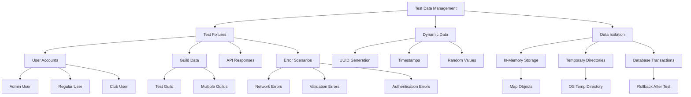
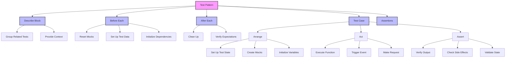

# Testing Strategy

<cite>
**Referenced Files in This Document**   
- [playwright.config.ts](file://apps/web/playwright.config.ts)
- [vitest.config.ts](file://apps/web/vitest.config.ts)
- [jest.config.js](file://apps/admin-api/jest.config.js)
- [lighthouserc.json](file://apps/web/lighthouserc.json)
- [setup.ts](file://apps/web/tests/setup.ts)
- [jest.setup.js](file://apps/admin-api/jest.setup.js)
- [auth-flow.spec.ts](file://apps/web/tests/e2e/auth-flow.spec.ts)
- [navigation.spec.ts](file://apps/web/tests/e2e/navigation.spec.ts)
- [button.test.tsx](file://apps/web/tests/components/button.test.tsx)
- [admin-client.test.ts](file://apps/web/tests/unit/lib/admin-client.test.ts)
- [upload.test.ts](file://apps/web/tests/api/club/upload.test.ts)
- [parsing.test.ts](file://apps/bot/tests/utils/parsing.test.ts)
</cite>

## Table of Contents
1. [Introduction](#introduction)
2. [Test Structure and Frameworks](#test-structure-and-frameworks)
3. [Playwright Configuration for E2E Testing](#playwright-configuration-for-e2e-testing)
4. [Test Types and Organization](#test-types-and-organization)
5. [Setup and Teardown Procedures](#setup-and-teardown-procedures)
6. [Mocking Strategies](#mocking-strategies)
7. [Test Data Management](#test-data-management)
8. [Performance and Accessibility Testing](#performance-and-accessibility-testing)
9. [Common Test Patterns](#common-test-patterns)
10. [Debugging Flaky Tests](#debugging-flaky-tests)

## Introduction
The testing strategy for the Slimy monorepo encompasses a comprehensive approach to automated testing across multiple applications. The system leverages different testing frameworks optimized for specific purposes: Playwright for end-to-end testing, Vitest for unit and integration testing in modern applications, and Jest for integration testing in Node.js services. This multi-framework approach allows each application to use the most appropriate tools for its technology stack while maintaining consistent testing practices across the codebase.

## Test Structure and Frameworks

The monorepo implements a tiered testing strategy with different frameworks for different applications and test types. The web application uses Vitest for unit and integration tests with a clear separation between component, API, and E2E tests. The admin API service uses Jest for integration testing, while the bot application uses Vitest for unit testing of utility functions.

**Diagram sources**
- [vitest.config.ts](file://apps/web/vitest.config.ts#L1-L50)
- [jest.config.js](file://apps/admin-api/jest.config.js#L1-L56)
- [playwright.config.ts](file://apps/web/playwright.config.ts#L1-L36)

**Section sources**
- [vitest.config.ts](file://apps/web/vitest.config.ts#L1-L50)
- [jest.config.js](file://apps/admin-api/jest.config.js#L1-L56)
- [playwright.config.ts](file://apps/web/playwright.config.ts#L1-L36)

## Playwright Configuration for E2E Testing

The Playwright configuration is optimized for both local development and CI/CD environments. The configuration includes browser context management, test retry mechanisms, and video recording for failed tests. The setup automatically launches the web server before tests and configures appropriate timeouts and retry policies based on the environment.

**Diagram sources**
- [playwright.config.ts](file://apps/web/playwright.config.ts#L1-L36)

**Section sources**
- [playwright.config.ts](file://apps/web/playwright.config.ts#L1-L36)

## Test Types and Organization

The testing strategy implements a clear separation of test types across the codebase. Unit tests focus on isolated functions and components, integration tests verify interactions between modules, and E2E tests validate complete user workflows. Each application organizes its tests in a dedicated directory structure that reflects this hierarchy.

**Diagram sources**
- [button.test.tsx](file://apps/web/tests/components/button.test.tsx#L1-L109)
- [parsing.test.ts](file://apps/bot/tests/utils/parsing.test.ts#L1-L78)
- [admin-client.test.ts](file://apps/web/tests/unit/lib/admin-client.test.ts#L1-L42)
- [upload.test.ts](file://apps/web/tests/api/club/upload.test.ts#L1-L208)
- [auth-flow.spec.ts](file://apps/web/tests/e2e/auth-flow.spec.ts#L1-L140)
- [navigation.spec.ts](file://apps/web/tests/e2e/navigation.spec.ts#L1-L36)

**Section sources**
- [button.test.tsx](file://apps/web/tests/components/button.test.tsx#L1-L109)
- [parsing.test.ts](file://apps/bot/tests/utils/parsing.test.ts#L1-L78)
- [admin-client.test.ts](file://apps/web/tests/unit/lib/admin-client.test.ts#L1-L42)
- [upload.test.ts](file://apps/web/tests/api/club/upload.test.ts#L1-L208)
- [auth-flow.spec.ts](file://apps/web/tests/e2e/auth-flow.spec.ts#L1-L140)
- [navigation.spec.ts](file://apps/web/tests/e2e/navigation.spec.ts#L1-L36)

## Setup and Teardown Procedures

The testing framework implements comprehensive setup and teardown procedures to ensure test isolation and consistency. Each test environment has dedicated setup files that configure mocks, environment variables, and global test state. The teardown procedures restore the original environment and clear any test-specific state.

**Diagram sources**
- [setup.ts](file://apps/web/tests/setup.ts#L1-L6)
- [jest.setup.js](file://apps/admin-api/jest.setup.js#L1-L355)

**Section sources**
- [setup.ts](file://apps/web/tests/setup.ts#L1-L6)
- [jest.setup.js](file://apps/admin-api/jest.setup.js#L1-L355)

## Mocking Strategies

The testing strategy employs extensive mocking to isolate components and services from external dependencies. The mock implementations cover database connections, API clients, authentication services, and third-party integrations. This approach enables reliable and fast testing without requiring external services or complex test infrastructure.

**Diagram sources**
- [jest.setup.js](file://apps/admin-api/jest.setup.js#L1-L355)
- [upload.test.ts](file://apps/web/tests/api/club/upload.test.ts#L1-L208)

**Section sources**
- [jest.setup.js](file://apps/admin-api/jest.setup.js#L1-L355)
- [upload.test.ts](file://apps/web/tests/api/club/upload.test.ts#L1-L208)

## Test Data Management

The testing framework implements a structured approach to test data management, using predefined test fixtures and dynamic data generation. Test data is carefully designed to cover various scenarios including edge cases, error conditions, and typical user interactions. The system ensures data isolation between tests to prevent interference and maintain reliability.

**Section sources**
- [jest.setup.js](file://apps/admin-api/jest.setup.js#L1-L355)
- [auth-flow.spec.ts](file://apps/web/tests/e2e/auth-flow.spec.ts#L1-L140)

## Performance and Accessibility Testing

The testing strategy includes automated performance and accessibility testing using Lighthouse. The configuration defines strict performance thresholds for key metrics including First Contentful Paint, Largest Contentful Paint, and Cumulative Layout Shift. The system runs these tests against multiple URLs to ensure consistent performance across the application.

```mermaid
graph TD
A[Lighthouse Configuration] --> B[CI Settings]
A --> C[Assertions]
A --> D[Upload]
B --> E[Start Server Command]
B --> F[URLs to Test]
B --> G[Number of Runs]
B --> H[Desktop Preset]
C --> I[Performance Score]
C --> J[Accessibility Score]
C --> K[Best Practices Score]
C --> L[SEO Score]
C --> M[First Contentful Paint]
C --> N[Largest Contentful Paint]
C --> O[Cumulative Layout Shift]
C --> P[Total Blocking Time]
C --> Q[Speed Index]
C --> R[Interactive]
D --> S[Target: temporary-public-storage]
E --> T["pnpm build && pnpm start"]
F --> U["http://localhost:3000"]
F --> V["http://localhost:3000/features"]
F --> W["http://localhost:3000/docs"]
F --> X["http://localhost:3000/status"]
I --> Y["minScore: 0.9"]
J --> Z["minScore: 0.9"]
K --> AA["minScore: 0.9"]
L --> AB["minScore: 0.9"]
M --> AC["maxNumericValue: 2000"]
N --> AD["maxNumericValue: 2500"]
O --> AE["maxNumericValue: 0.1"]
P --> AF["maxNumericValue: 300"]
Q --> AG["maxNumericValue: 3000"]
R --> AH["maxNumericValue: 3000"]
```

**Diagram sources**
- [lighthouserc.json](file://apps/web/lighthouserc.json#L1-L37)

**Section sources**
- [lighthouserc.json](file://apps/web/lighthouserc.json#L1-L37)

## Common Test Patterns

The codebase implements several common testing patterns that ensure consistency and reliability across the test suite. These patterns include test organization with describe blocks, proper async/await usage, mock reset between tests, and comprehensive assertion coverage. The patterns are designed to make tests readable, maintainable, and resilient to changes.

**Section sources**
- [button.test.tsx](file://apps/web/tests/components/button.test.tsx#L1-L109)
- [parsing.test.ts](file://apps/bot/tests/utils/parsing.test.ts#L1-L78)
- [admin-client.test.ts](file://apps/web/tests/unit/lib/admin-client.test.ts#L1-L42)

## Debugging Flaky Tests

The testing infrastructure includes several mechanisms to help identify and debug flaky tests. These include video recording of failed E2E tests, trace collection for the first retry, and screenshot capture on failure. The configuration also includes reasonable timeouts and retry policies to handle transient issues without masking genuine test failures.

```mermaid
graph TD
A[Flaky Test Debugging] --> B[Video Recording]
A --> C[Trace Collection]
A --> D[Screenshots]
A --> E[Test Retries]
A --> F[Timeout Configuration]
B --> G["retain-on-failure"]
B --> H[Review Failed Test Flow]
B --> I[Identify Timing Issues]
C --> J["on-first-retry"]
C --> K[Network Activity]
C --> L[Console Messages]
C --> M[DOM Snapshots]
D --> N["only-on-failure"]
D --> O[Visual State at Failure]
D --> P[Element Visibility]
E --> Q[CI: 2 retries]
E --> R[Local: 0 retries]
E --> S[Identify Intermittent Failures]
F --> T[Expect Timeout: 10s]
F --> U[Web Server Timeout: 120s]
F --> V[Test Timeout: 10s]
style A fill:#f96,stroke:#333,stroke-width:2px
style B fill:#ff9,stroke:#333,stroke-width:2px
style C fill:#ff9,stroke:#333,stroke-width:2px
style D fill:#ff9,stroke:#333,stroke-width:2px
style E fill:#ff9,stroke:#333,stroke-width:2px
style F fill:#ff9,stroke:#333,stroke-width:2px
```

**Diagram sources**
- [playwright.config.ts](file://apps/web/playwright.config.ts#L1-L36)

**Section sources**
- [playwright.config.ts](file://apps/web/playwright.config.ts#L1-L36)