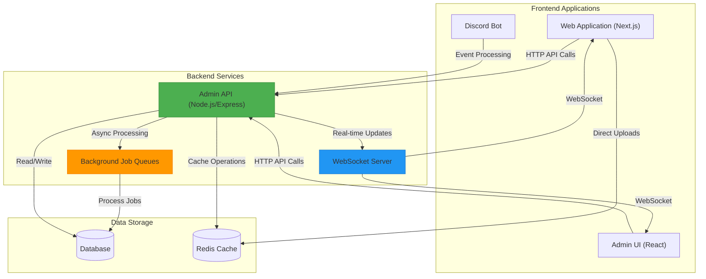
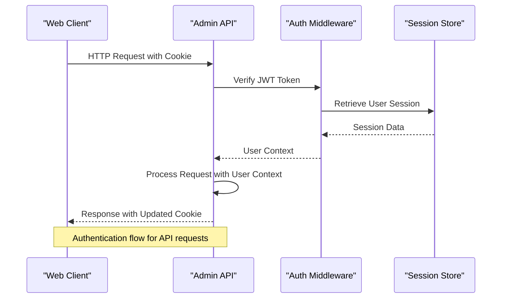
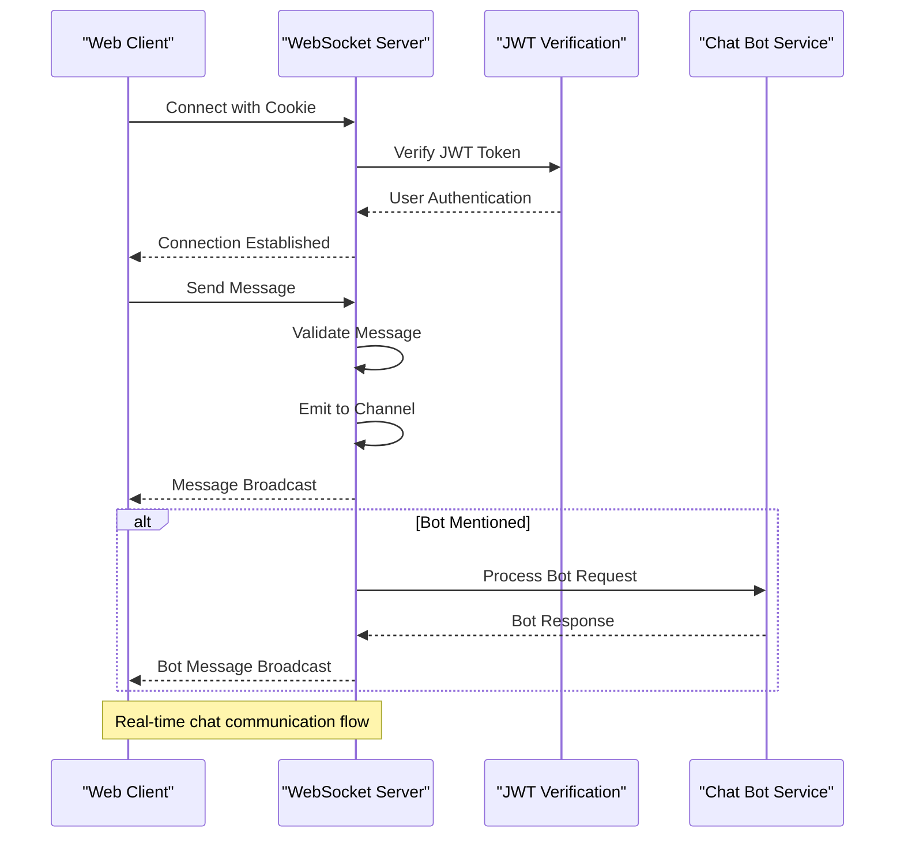
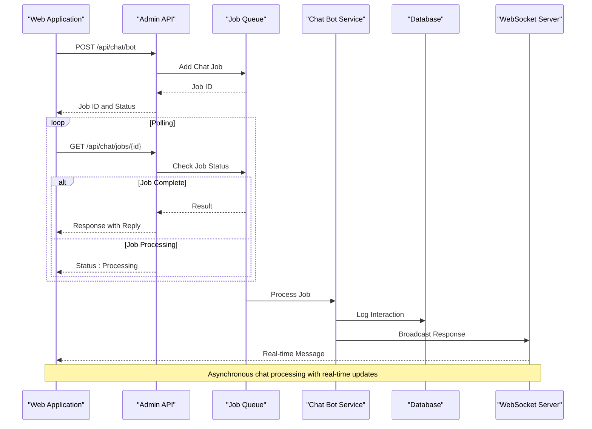
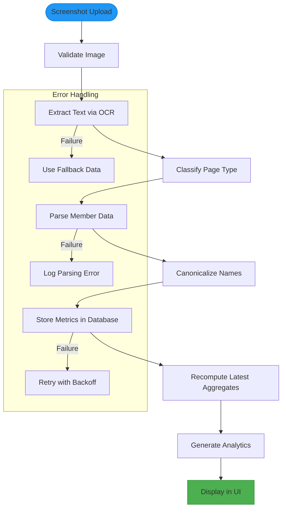
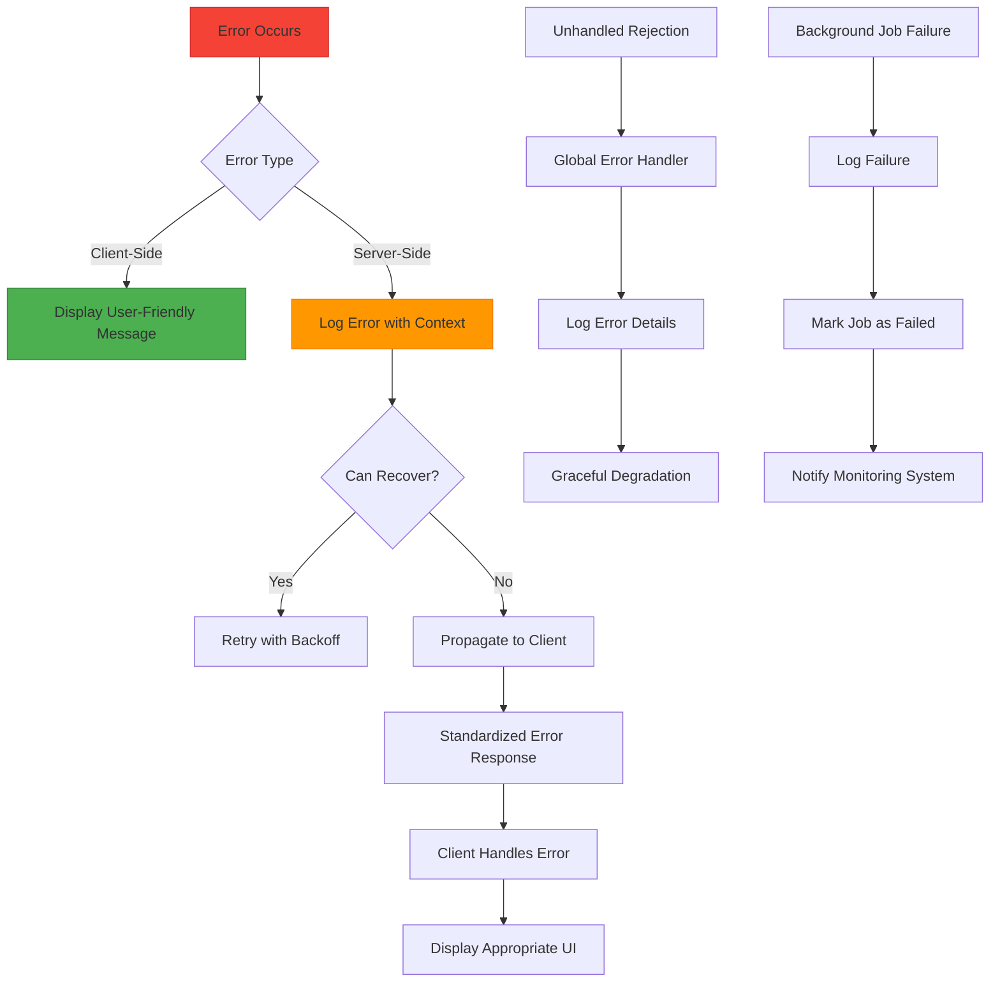
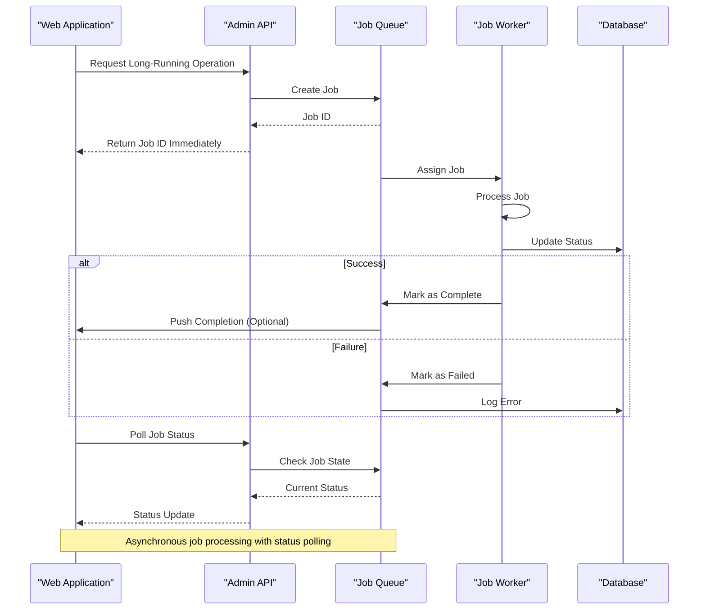

# Data Flow Between Layers

<cite>
**Referenced Files in This Document**   
- [server.js](file://apps/admin-api/server.js)
- [app.js](file://apps/admin-api/src/app.js)
- [api-client.ts](file://apps/web/lib/api-client.ts)
- [api.js](file://apps/admin-ui/lib/api.js)
- [socket.js](file://apps/admin-api/src/socket.js)
- [index.ts](file://apps/bot/src/index.ts)
- [chat-bot.js](file://apps/admin-api/src/services/chat-bot.js)
- [chat-processor.js](file://apps/admin-api/src/lib/queues/chat-processor.js)
- [chat.js](file://apps/admin-api/src/routes/chat.js)
- [route.ts](file://apps/web/app/api/chat/messages/route.ts)
- [club-ingest.js](file://apps/admin-api/lib/club-ingest.js)
- [club-store.js](file://apps/admin-api/lib/club-store.js)
- [club.js](file://apps/admin-api/src/routes/club.js)
- [database.ts](file://apps/web/lib/club/database.ts)
- [vision.ts](file://apps/web/lib/club/vision.ts)
</cite>

## Table of Contents
1. [Introduction](#introduction)
2. [Architecture Overview](#architecture-overview)
3. [Authentication and Request Flow](#authentication-and-request-flow)
4. [WebSocket and Real-Time Communication](#websocket-and-real-time-communication)
5. [Chat Interaction Workflow](#chat-interaction-workflow)
6. [Club Data Ingestion and Analytics](#club-data-ingestion-and-analytics)
7. [Error Handling and Failure Propagation](#error-handling-and-failure-propagation)
8. [Background Job Processing](#background-job-processing)
9. [Conclusion](#conclusion)

## Introduction

The Slimy Monorepo implements a comprehensive data flow architecture that connects Discord events, web applications, background jobs, and database storage through a well-defined layered system. This document maps the complete data pathways across the application, focusing on how information flows between different components and services.

The system consists of several key applications: the admin-api backend service, the admin-ui management interface, the web application frontend, and the Discord bot. These components work together to process user interactions, store data, and provide real-time functionality through WebSocket connections and background job processing.

This documentation will detail the request flow from frontend to backend, including authentication token propagation and CORS handling, explain how real-time data is managed through WebSocket connections, illustrate the data processing pipeline for club data ingestion and analytics generation, and document error propagation patterns across service boundaries.

**Section sources**
- [server.js](file://apps/admin-api/server.js)
- [app.js](file://apps/admin-api/src/app.js)

## Architecture Overview

The Slimy Monorepo follows a layered architecture with clear separation between frontend, backend, and data storage components. The system is built around a central admin-api service that handles all business logic and data processing, with multiple frontend applications (admin-ui and web) consuming its API endpoints.

**Diagram sources**
- [server.js](file://apps/admin-api/server.js)
- [app.js](file://apps/admin-api/src/app.js)
- [socket.js](file://apps/admin-api/src/socket.js)

The architecture follows a microservices-inspired pattern within a monorepo structure, where different applications serve specific purposes but share common libraries and configuration. The admin-api serves as the central hub for all data processing, exposing RESTful endpoints that are consumed by both the web application and admin-ui interfaces.

All frontend applications communicate with the backend through well-defined API endpoints, with authentication handled via JWT tokens stored in HTTP-only cookies. The system implements proper CORS configuration to allow cross-origin requests from trusted domains while maintaining security.

**Section sources**
- [server.js](file://apps/admin-api/server.js)
- [app.js](file://apps/admin-api/src/app.js)

## Authentication and Request Flow

The authentication system in the Slimy Monorepo implements a robust token-based authentication mechanism using JWT (JSON Web Tokens) with cookie-based storage for enhanced security. The request flow begins at the frontend applications and propagates through the backend services with proper authentication context.

**Diagram sources**
- [app.js](file://apps/admin-api/src/app.js)
- [api-client.ts](file://apps/web/lib/api-client.ts)
- [api.js](file://apps/admin-ui/lib/api.js)

The authentication flow begins when a user logs into the system. The admin-api generates a JWT token containing user information and stores it in an HTTP-only, secure cookie. This token is automatically sent with all subsequent requests from the frontend applications, allowing the backend to authenticate the user without exposing the token to client-side JavaScript.

The API client libraries in both the web application and admin-ui implement automatic token handling, ensuring that authentication tokens are properly included in all requests. The admin-api validates these tokens on each request through middleware that verifies the JWT signature and extracts the user context.

CORS (Cross-Origin Resource Sharing) is configured through environment variables, with the admin-api requiring a valid CORS_ORIGIN environment variable to be set. The Express CORS middleware is configured to allow requests from the specified origin with credentials enabled, ensuring that cookies are properly sent with cross-origin requests.

Request identification is implemented through a request-id middleware that generates a unique identifier for each request, which is then included in all log entries and error responses. This allows for easy tracing of requests across the system for debugging and monitoring purposes.

**Section sources**
- [app.js](file://apps/admin-api/src/app.js)
- [api-client.ts](file://apps/web/lib/api-client.ts)
- [api.js](file://apps/admin-ui/lib/api.js)

## WebSocket and Real-Time Communication

The Slimy Monorepo implements real-time communication through WebSocket connections, enabling instant messaging and live updates between clients and the server. The WebSocket server is integrated with the Express application and handles authentication, message routing, and connection management.

**Diagram sources**
- [socket.js](file://apps/admin-api/src/socket.js)
- [chat-bot.js](file://apps/admin-api/src/services/chat-bot.js)

The WebSocket implementation uses the Socket.IO library, which provides additional functionality, including automatic reconnection, room-based messaging, and fallback mechanisms for environments where WebSockets are not available.

When a client connects to the WebSocket server, the connection is authenticated by extracting the JWT token from the cookie header and verifying it using the same logic as the REST API. The user's role and guild membership information is then extracted from the session store and attached to the socket connection, enabling role-based access control for chat messages.

The WebSocket server implements a channel-based messaging system where clients can join specific rooms based on their guild membership. This allows for targeted message broadcasting to specific groups of users while maintaining privacy between different guilds. Admin users have access to a special "admins" room for global communication.

Message handling includes validation of content, rate limiting considerations, and integration with the chat bot service. When a user mentions the bot in a message, the system automatically triggers a chat bot interaction, sending the message to the OpenAI API and broadcasting the response back to the channel.

**Section sources**
- [socket.js](file://apps/admin-api/src/socket.js)

## Chat Interaction Workflow

The chat interaction workflow in the Slimy Monorepo demonstrates a sophisticated data processing pipeline that handles user messages, processes them through background jobs, and returns responses while maintaining real-time communication through WebSockets.

**Diagram sources**
- [chat.js](file://apps/admin-api/src/routes/chat.js)
- [chat-processor.js](file://apps/admin-api/src/lib/queues/chat-processor.js)
- [chat-bot.js](file://apps/admin-api/src/services/chat-bot.js)
- [socket.js](file://apps/admin-api/src/socket.js)

The chat interaction workflow begins when a user submits a message through the web application. Instead of processing the message synchronously, the system creates a background job and returns a job ID immediately, providing a responsive user experience. This asynchronous approach prevents the API from being blocked by potentially slow external API calls to OpenAI.

The job is added to a dedicated chat queue, where it waits to be processed by a worker. When the job is processed, the chat bot service calls the OpenAI API with the user's message and appropriate context, then returns the response. During this processing time, the frontend can poll the job status endpoint to provide feedback to the user about the progress.

Once the response is generated, it is stored in the database for audit purposes and broadcast to all connected clients through the WebSocket server, enabling real-time chat functionality. The system also implements message validation and security checks to prevent malicious content from being processed or displayed.

The workflow includes comprehensive error handling, with failed jobs being properly logged and error messages returned to the client. The system distinguishes between different types of errors, such as network issues, authentication problems, and content policy violations, allowing for appropriate user feedback and system monitoring.

**Section sources**
- [chat.js](file://apps/admin-api/src/routes/chat.js)
- [chat-processor.js](file://apps/admin-api/src/lib/queues/chat-processor.js)
- [chat-bot.js](file://apps/admin-api/src/services/chat-bot.js)

## Club Data Ingestion and Analytics

The club data ingestion and analytics system in the Slimy Monorepo processes club screenshots, extracts relevant metrics, and provides analytical insights through a multi-stage pipeline that combines OCR technology, data processing, and machine learning.

**Diagram sources**
- [club-ingest.js](file://apps/admin-api/lib/club-ingest.js)
- [club-store.js](file://apps/admin-api/lib/club-store.js)
- [club.js](file://apps/admin-api/src/routes/club.js)
- [vision.ts](file://apps/web/lib/club/vision.ts)
- [database.ts](file://apps/web/lib/club/database.ts)

The club data ingestion process begins when a user uploads a screenshot of their club interface. The system first validates the image and then uses OCR (Optical Character Recognition) technology to extract text from the image. This extracted text is classified by page type (e.g., "manage_members") to determine how it should be processed.

For member management pages, the system parses the OCR results to extract individual member data, including names and power levels. This data is then canonicalized to ensure consistent formatting and stored in the database with a timestamp. The system recomputes the latest aggregates after each ingestion, ensuring that the most current data is available for display.

The analytics generation component uses GPT-4 Vision to analyze club screenshots and provide comprehensive insights. When a user uploads a screenshot, the system sends it to the OpenAI API with a detailed prompt requesting analysis of club performance, metrics extraction, and recommendations for improvement. The response is parsed and structured into a standardized format for display in the UI.

The frontend implementation provides a seamless experience for users, with the club database client handling storage and retrieval of analysis results. The system is designed to work offline by storing data in local storage when a database connection is not available, synchronizing with the backend when connectivity is restored.

**Section sources**
- [club-ingest.js](file://apps/admin-api/lib/club-ingest.js)
- [club-store.js](file://apps/admin-api/lib/club-store.js)
- [club.js](file://apps/admin-api/src/routes/club.js)
- [vision.ts](file://apps/web/lib/club/vision.ts)
- [database.ts](file://apps/web/lib/club/database.ts)

## Error Handling and Failure Propagation

The Slimy Monorepo implements a comprehensive error handling strategy that ensures failures are properly managed across service boundaries, with appropriate logging, user feedback, and system resilience.

**Diagram sources**
- [chat-processor.js](file://apps/admin-api/src/lib/queues/chat-processor.js)
- [api-client.ts](file://apps/web/lib/api-client.ts)
- [ERROR_HANDLING.md](file://apps/admin-api/ERROR_HANDLING.md)

The error handling system is designed with multiple layers of protection to ensure that failures in one part of the system do not cascade to other components. At the API level, all routes are wrapped with error handling middleware that catches exceptions and returns standardized error responses to the client.

For background jobs, the system implements robust error handling with proper logging and failure tracking. When a job fails, the error is logged with full context including the job data, error message, and stack trace. The job is then marked as failed in the queue system, and monitoring alerts can be triggered based on the type of error.

The frontend API client implements automatic retry logic with exponential backoff for transient errors such as network issues or rate limiting. The retry configuration is customizable, with a maximum number of retries, base delay, and maximum delay to prevent overwhelming the server during periods of high load.

Client-side error handling includes user-friendly error messages that explain what went wrong without exposing sensitive system information. The system distinguishes between different types of errors, providing appropriate feedback for authentication issues, validation errors, and server-side problems.

Global error handlers are implemented to catch unhandled exceptions and rejections, preventing the application from crashing and allowing for graceful degradation of functionality. These handlers log the error details for debugging while returning a generic error message to the user to maintain security.

**Section sources**
- [chat-processor.js](file://apps/admin-api/src/lib/queues/chat-processor.js)
- [api-client.ts](file://apps/web/lib/api-client.ts)

## Background Job Processing

The background job processing system in the Slimy Monorepo handles asynchronous operations that would otherwise block the main request-response cycle, improving system responsiveness and scalability.

**Diagram sources**
- [chat-processor.js](file://apps/admin-api/src/lib/queues/chat-processor.js)
- [chat.js](file://apps/admin-api/src/routes/chat.js)

The job processing system is built around a queue-based architecture where long-running operations are offloaded from the main request thread. When a user initiates an operation that requires significant processing time, such as analyzing a club screenshot or generating a report, the system creates a job in the queue and returns immediately with a job ID.

This job ID allows the frontend to poll for the job status, providing a responsive user experience while the background processing occurs. The job queue system supports multiple job types, with different workers handling different categories of tasks based on their resource requirements and processing logic.

The system implements proper error handling for job processing, with failed jobs being logged and marked as failed in the queue. This allows for monitoring of job success rates and identification of systemic issues that may be causing job failures.

Job data is stored with sufficient context to allow for proper processing, including user information, request parameters, and timestamps. This enables auditing of job execution and provides the necessary information for debugging issues that may arise during processing.

The queue system is designed to be resilient to failures, with jobs persisting even if the worker process crashes. When the system restarts, pending jobs are automatically picked up and processed, ensuring that no work is lost due to system interruptions.

**Section sources**
- [chat-processor.js](file://apps/admin-api/src/lib/queues/chat-processor.js)
- [chat.js](file://apps/admin-api/src/routes/chat.js)

## Conclusion

The Slimy Monorepo demonstrates a well-architected system with clearly defined data flows between layers, from user interactions in web applications to backend processing and database storage. The system implements modern architectural patterns including asynchronous processing, real-time communication, and comprehensive error handling to provide a robust and responsive user experience.

Key strengths of the architecture include the separation of concerns between frontend and backend components, the use of JWT-based authentication with proper security practices, and the implementation of background job processing to handle long-running operations without blocking the main request cycle.

The data flow from Discord events to database storage is well-defined, with the bot processing events and communicating with the admin-api service for data persistence. User interactions in the web applications follow a similar pattern, with API calls to the admin-api that handle authentication, business logic, and data storage.

Real-time data handling through WebSocket connections enables instant messaging and live updates, while the club data ingestion pipeline demonstrates a sophisticated approach to processing unstructured data (screenshots) into structured analytics. The system's error handling and failure propagation mechanisms ensure that issues are properly managed across service boundaries, with appropriate logging and user feedback.

Overall, the Slimy Monorepo presents a scalable and maintainable architecture that effectively handles the complex data flows required by its various components while maintaining security, performance, and reliability.