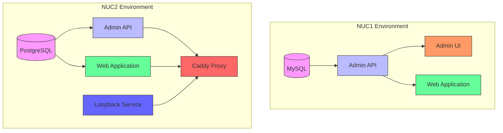
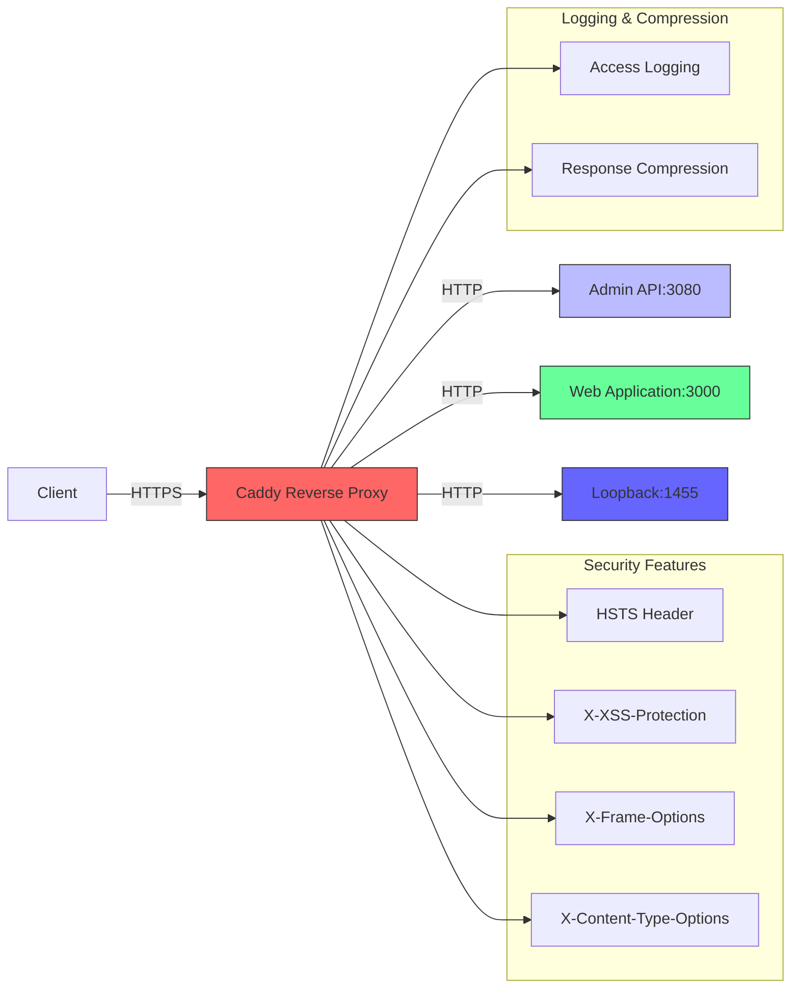
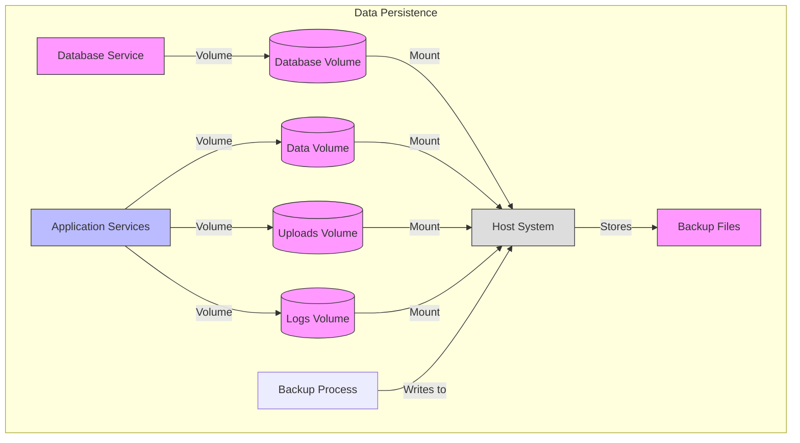
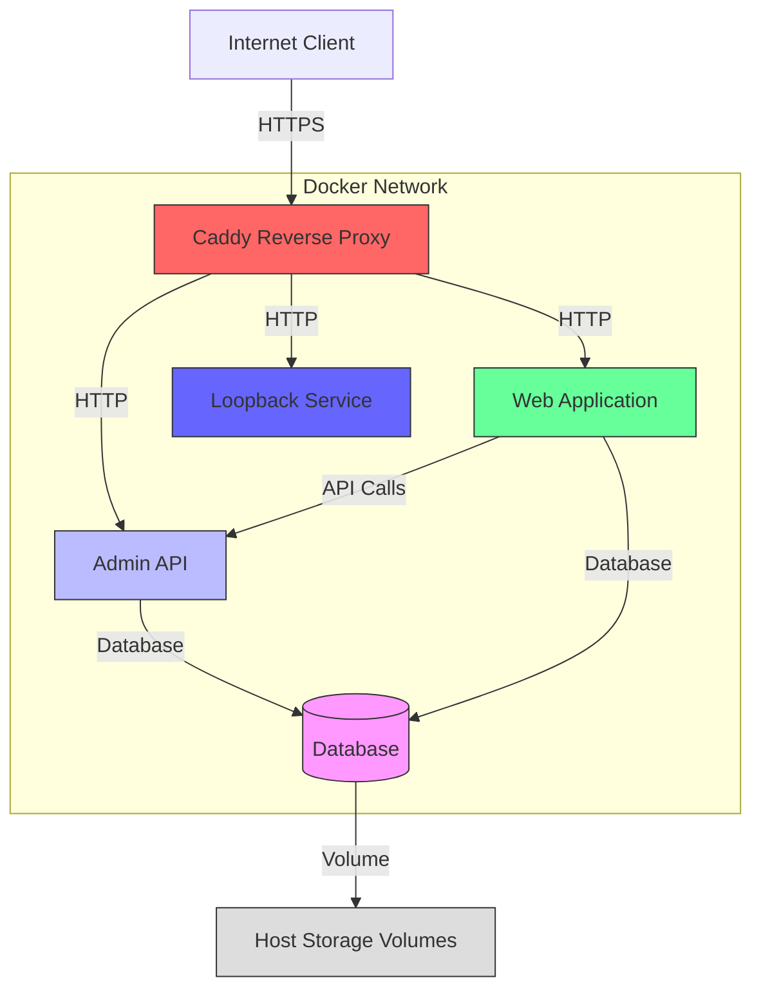

# Deployment Architecture

<cite>
**Referenced Files in This Document**   
- [Dockerfile](file://apps/admin-api/Dockerfile)
- [Dockerfile](file://apps/web/Dockerfile)
- [docker-compose.slimy-nuc1.yml](file://infra/docker/docker-compose.slimy-nuc1.yml)
- [docker-compose.slimy-nuc2.yml](file://infra/docker/docker-compose.slimy-nuc2.yml)
- [deploy-to-server.sh](file://apps/web/deploy-to-server.sh)
- [quickstart.sh](file://apps/web/quickstart.sh)
</cite>

## Table of Contents
1. [Introduction](#introduction)
2. [Containerization Strategy](#containerization-strategy)
3. [Docker Compose Configuration](#docker-compose-configuration)
4. [Systemd Integration](#systemd-integration)
5. [Reverse Proxy and SSL Termination](#reverse-proxy-and-ssl-termination)
6. [Resource Allocation and Scaling](#resource-allocation-and-scaling)
7. [Data Persistence and Backup](#data-persistence-and-backup)
8. [Deployment Topology](#deployment-topology)

## Introduction
This document outlines the deployment architecture for the Slimy application in production environments. The system employs Docker containerization with multiple environment-specific configurations, utilizing docker-compose for orchestration across different deployment targets. The architecture includes a web application, admin API, database services, and a Caddy reverse proxy for SSL termination. The deployment strategy supports both development and production environments with appropriate security, monitoring, and auto-recovery mechanisms.

## Containerization Strategy

The deployment architecture implements a multi-stage containerization approach for both the admin API and web application services. The admin API service uses a Node.js 22-slim base image with a straightforward build process that copies package files, installs production dependencies, and then copies the application code. This approach minimizes image size while ensuring all necessary dependencies are included.

The web application employs a more complex multi-stage Docker build process with three distinct stages: base, deps, and builder. This strategy optimizes build efficiency by separating dependency installation from application building, allowing for better caching and faster rebuilds. The final production stage runs as a non-root user (nextjs) with UID 1001 for enhanced security. The container exposes port 3000 and runs the Next.js server from the standalone output directory to ensure proper module resolution in the monorepo context.

**Section sources**
- [Dockerfile](file://apps/admin-api/Dockerfile)
- [Dockerfile](file://apps/web/Dockerfile)

## Docker Compose Configuration

The deployment architecture utilizes environment-specific docker-compose configurations to support different deployment targets. Two primary production configurations exist: `docker-compose.slimy-nuc1.yml` for MySQL-based deployments and `docker-compose.slimy-nuc2.yml` for PostgreSQL-based deployments.

The NUC1 configuration defines four services: MySQL database, admin API, admin UI, and web application. All services connect through a shared bridge network named "slimy-net". The database service uses volume persistence for data storage, while the admin API and admin UI services include dedicated volumes for data and uploads. Health checks are implemented for all services to ensure proper startup sequencing, with the admin API depending on database health before starting.

The NUC2 configuration features a more advanced setup with PostgreSQL, Caddy reverse proxy, and additional monitoring services. It defines five services including PostgreSQL, admin API, web application, Caddy, and a loopback service for port 1455. The configuration uses external volumes for PostgreSQL data, Caddy data, and Caddy configuration to ensure data persistence across container restarts. Service dependencies are carefully orchestrated with health checks, where the web service depends on both PostgreSQL health and admin API startup.

Both configurations implement restart policies set to "unless-stopped" to ensure service recovery after failures or system reboots.

**Diagram sources **
- [docker-compose.slimy-nuc1.yml](file://infra/docker/docker-compose.slimy-nuc1.yml)
- [docker-compose.slimy-nuc2.yml](file://infra/docker/docker-compose.slimy-nuc2.yml)

**Section sources**
- [docker-compose.slimy-nuc1.yml](file://infra/docker/docker-compose.slimy-nuc1.yml)
- [docker-compose.slimy-nuc2.yml](file://infra/docker/docker-compose.slimy-nuc2.yml)

## Systemd Integration

The deployment architecture includes systemd integration for reliable service management and automatic startup on system boot. The `deploy-to-server.sh` script creates a systemd service unit named `slimyai-web.service` that manages the Docker Compose application lifecycle.

The systemd service is configured with appropriate dependencies, ensuring it starts after the Docker service is available. The service unit uses a oneshot type with RemainAfterExit=yes, allowing it to manage the Docker Compose application as a long-running service. The ExecStart directive runs `docker compose up -d` to start the services in detached mode, while ExecStop runs `docker compose down` to properly shut down the services.

The service is enabled in the multi-user target, ensuring it starts automatically during system boot. This integration provides reliable service recovery after system restarts and allows for standard systemd service management commands like start, stop, restart, and status checking.

**Section sources**
- [deploy-to-server.sh](file://apps/web/deploy-to-server.sh)

## Reverse Proxy and SSL Termination

The production deployment architecture implements Caddy as a reverse proxy for SSL termination and request routing. In the NUC2 configuration, Caddy runs as a dedicated service with host network mode to bind directly to system ports. The Caddy service uses a configuration file mounted from the host system at `/etc/caddy/Caddyfile.slimy-nuc2`.

Caddy handles SSL certificate management automatically through Let's Encrypt, providing HTTPS termination for the application. The reverse proxy configuration routes requests based on path patterns: API requests to the admin API service on port 3080 and all other requests to the web application on port 3000. This setup enables a unified domain interface while maintaining separate backend services.

The Caddy configuration includes comprehensive security headers such as HSTS, X-Content-Type-Options, X-Frame-Options, and X-XSS-Protection to enhance application security. Response compression is enabled with both gzip and zstd encoding. Access logging is configured with log rotation (10MB size limit, keeping 10 rotated files) for monitoring and troubleshooting.

The `deploy-to-server.sh` script also manages Caddy configuration, creating or updating the Caddyfile with appropriate proxy settings and security headers. It backs up existing configurations before making changes and reloads the Caddy service to apply new configurations without downtime.

**Diagram sources **
- [docker-compose.slimy-nuc2.yml](file://infra/docker/docker-compose.slimy-nuc2.yml)
- [deploy-to-server.sh](file://apps/web/deploy-to-server.sh)

## Resource Allocation and Scaling

The deployment architecture is designed with resource efficiency and scalability in mind. The containerization strategy uses slim base images (node:22-slim and postgres:16-alpine) to minimize resource footprint. The multi-stage build process for the web application optimizes image size by separating build dependencies from runtime dependencies.

The architecture supports horizontal scaling through the stateless nature of the application services. The admin API and web application containers can be scaled independently based on load requirements. Database services are designed for vertical scaling, with the option to increase resources allocated to the database container as needed.

Resource allocation is managed through Docker's built-in resource constraints, though specific limits are not defined in the provided configurations, allowing containers to use available system resources. The health check mechanisms (30-second intervals with 10-second timeouts) ensure service reliability without excessive resource consumption from frequent checks.

The separation of services into independent containers allows for targeted scaling of specific components. For example, during periods of high API usage, additional admin API containers could be deployed behind a load balancer, while the web application containers remain at their current scale.

**Section sources**
- [docker-compose.slimy-nuc1.yml](file://infra/docker/docker-compose.slimy-nuc1.yml)
- [docker-compose.slimy-nuc2.yml](file://infra/docker/docker-compose.slimy-nuc2.yml)

## Data Persistence and Backup

The deployment architecture implements comprehensive data persistence strategies using Docker volumes. For the NUC1 environment, named volumes are used for database storage (`slimy-db-data`) and application data (`admin-api-data`, `admin-api-uploads`). The NUC2 environment uses external named volumes for PostgreSQL data, Caddy data, and Caddy configuration, ensuring data persistence across container lifecycle events.

The NUC2 configuration includes a dedicated backup strategy with volume mounts to host directories. The PostgreSQL service mounts a host directory at `/opt/slimy/backups/postgres` for backup operations. Similarly, the admin API service mounts backup directories at `/opt/slimy/backups/admin-api` for MySQL and application data backups. This approach enables regular backup operations to be performed on the host system.

Application data persistence is implemented through volume mounts for critical data directories. The admin API service maintains persistent storage for application data and uploads, ensuring file uploads and other user-generated content survive container restarts. Log persistence is also configured, with admin API and web application logs mounted to host directories for long-term storage and analysis.

The architecture supports both database-level backups (through the mounted backup directories) and application-level data protection through volume persistence. This multi-layered approach ensures data integrity and facilitates disaster recovery operations.

**Diagram sources **
- [docker-compose.slimy-nuc1.yml](file://infra/docker/docker-compose.slimy-nuc1.yml)
- [docker-compose.slimy-nuc2.yml](file://infra/docker/docker-compose.slimy-nuc2.yml)

## Deployment Topology

The deployment architecture features a multi-tier topology with clear separation of concerns. The external access layer consists of the Caddy reverse proxy, which handles all incoming HTTPS traffic, SSL termination, and request routing. This service acts as the single entry point to the application, providing a unified interface to external clients.

Behind the reverse proxy, the application tier hosts the web application and admin API services. These stateless services handle business logic and API requests, communicating with the data tier as needed. The web application serves the Next.js frontend, while the admin API provides backend functionality and data access.

The data tier consists of either MySQL (NUC1) or PostgreSQL (NUC2) database services, providing persistent storage for application data. These services are isolated within the Docker network and only accessible to application services, enhancing security.

The architecture includes additional specialized services such as the loopback service on port 1455, which may support specific application requirements. All internal services communicate over a dedicated Docker bridge network, isolating internal traffic from the host network.

External access follows a clear pattern: clients connect via HTTPS to the Caddy proxy, which decrypts traffic and forwards requests to the appropriate backend service based on routing rules. This topology provides security through isolation, scalability through service independence, and reliability through health checks and restart policies.

**Diagram sources **
- [docker-compose.slimy-nuc1.yml](file://infra/docker/docker-compose.slimy-nuc1.yml)
- [docker-compose.slimy-nuc2.yml](file://infra/docker/docker-compose.slimy-nuc2.yml)
- [deploy-to-server.sh](file://apps/web/deploy-to-server.sh)