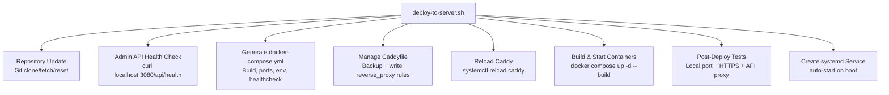
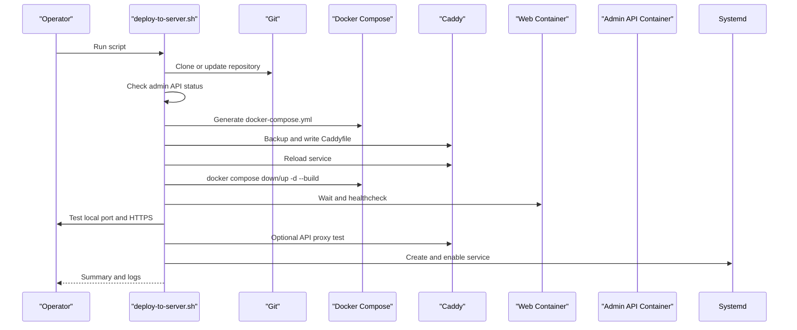
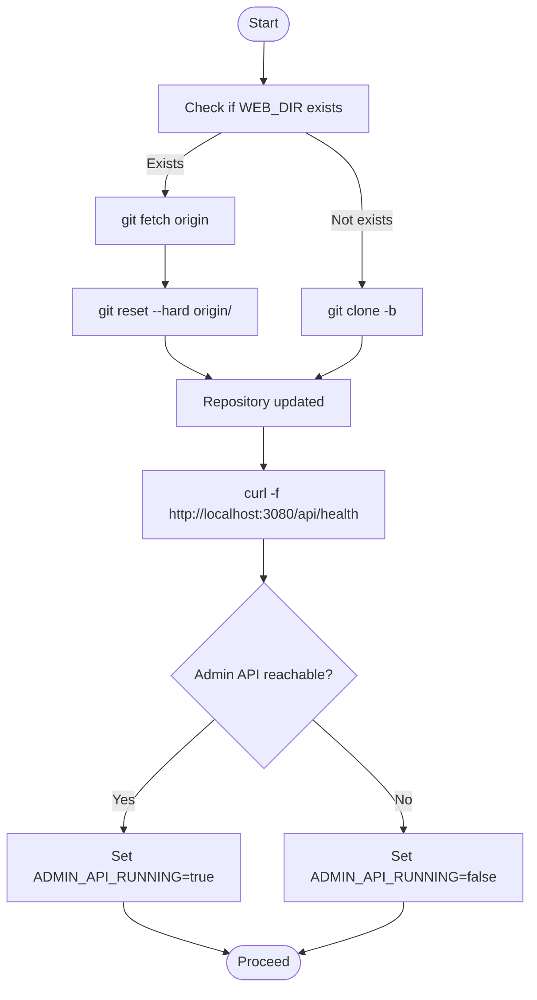
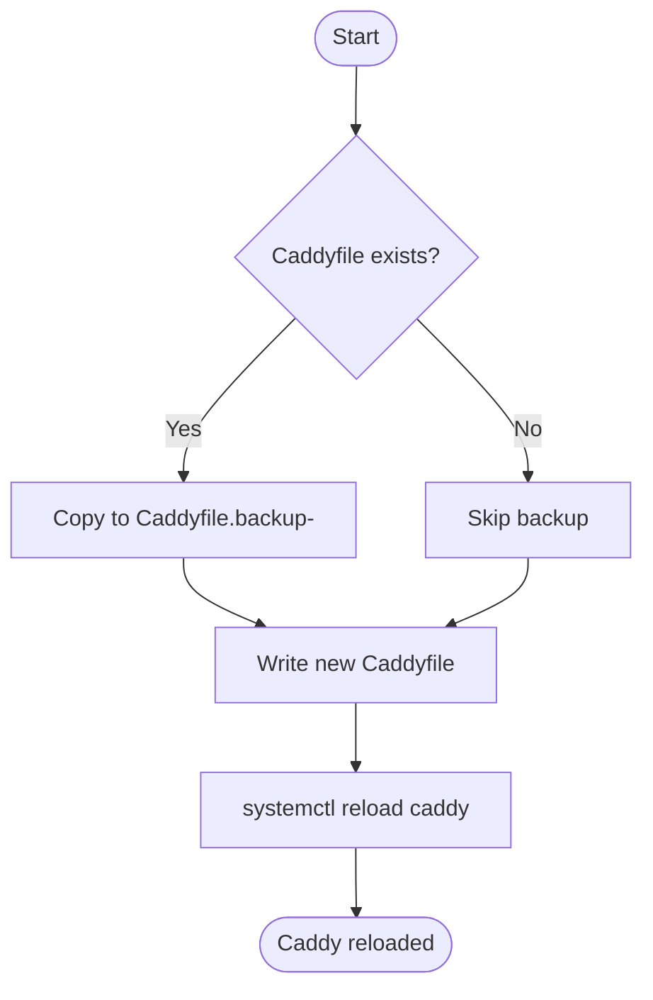
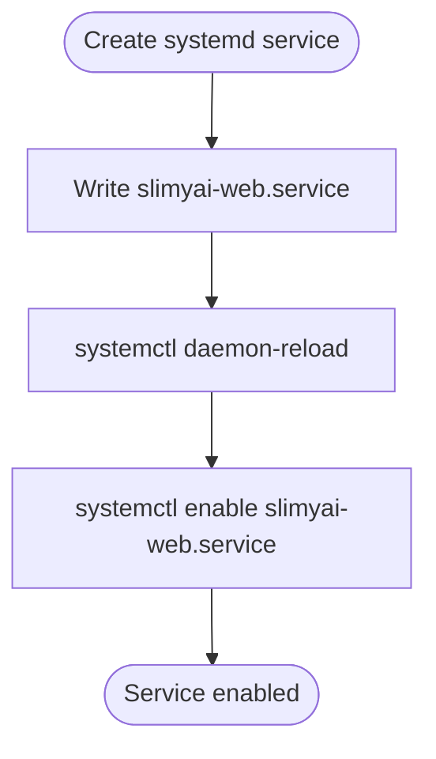
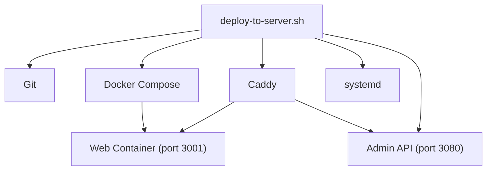

# Deployment Automation Script

<cite>
**Referenced Files in This Document**
- [deploy-to-server.sh](file://apps/web/deploy-to-server.sh)
- [docker-compose.production.yml](file://apps/web/docker-compose.production.yml)
- [docker-compose.yml](file://apps/web/docker-compose.yml)
- [Dockerfile](file://apps/web/Dockerfile)
- [docker-compose.test.yml](file://apps/web/docker-compose.test.yml)
- [docker-compose.monitoring.yml](file://apps/web/docker-compose.monitoring.yml)
- [docker-compose.slimy-nuc1.yml](file://infra/docker/docker-compose.slimy-nuc1.yml)
- [docker-compose.slimy-nuc2.yml](file://infra/docker/docker-compose.slimy-nuc2.yml)
- [NUC2_STACK_STARTUP_FIX.md](file://infra/docker/NUC2_STACK_STARTUP_FIX.md)
- [DOCKER_DEPLOYMENT.md](file://DOCKER_DEPLOYMENT.md)
- [DEPLOYMENT.md](file://apps/web/DEPLOYMENT.md)
</cite>

## Table of Contents
1. [Introduction](#introduction)
2. [Project Structure](#project-structure)
3. [Core Components](#core-components)
4. [Architecture Overview](#architecture-overview)
5. [Detailed Component Analysis](#detailed-component-analysis)
6. [Dependency Analysis](#dependency-analysis)
7. [Performance Considerations](#performance-considerations)
8. [Troubleshooting Guide](#troubleshooting-guide)
9. [Conclusion](#conclusion)
10. [Appendices](#appendices)

## Introduction
This document explains the deploy-to-server.sh automation script used to deploy and update the slimyai-web application on a target server. It covers repository updates, admin API status checks, docker-compose configuration generation, Caddyfile management, service deployment, testing, systemd service creation, and customization for different deployment targets. It also documents the configuration variables at the top of the script and the step-by-step deployment process from code update to service activation.

## Project Structure
The deployment automation centers around a single shell script that orchestrates Git updates, Docker Compose configuration generation, Caddy reverse proxy configuration, container lifecycle management, and post-deployment verification. Supporting files include production and development docker-compose configurations, the web application Dockerfile, and complementary infrastructure compose files.

**Diagram sources**
- [deploy-to-server.sh](file://apps/web/deploy-to-server.sh#L1-L231)

**Section sources**
- [deploy-to-server.sh](file://apps/web/deploy-to-server.sh#L1-L231)

## Core Components
- Configuration variables at the top define repository, branch, destination directory, Caddy config path, and log directory. These enable environment customization and targeted deployment.
- Repository update logic clones or resets the repository to the specified branch.
- Admin API status check determines whether the admin API is reachable locally, influencing subsequent behavior and messaging.
- docker-compose.yml generation writes a minimal production-like configuration for the web service, including build context, port mapping, environment variables, restart policy, and healthcheck.
- Caddyfile management backs up the existing configuration and writes a new configuration with reverse proxy rules for API and web traffic, plus security headers and logging.
- Caddy reload ensures the proxy picks up the new configuration.
- Docker Compose lifecycle manages container startup and health verification.
- Post-deployment testing validates both direct container access and HTTPS access via Caddy, and optionally tests the API proxy if the admin API is running.
- Systemd service creation ensures the web application restarts automatically after system reboots.

**Section sources**
- [deploy-to-server.sh](file://apps/web/deploy-to-server.sh#L1-L231)

## Architecture Overview
The deployment pipeline integrates Git, Docker, and Caddy to deliver a production-ready web application. The script orchestrates:
- Code acquisition and preparation
- Containerized application deployment
- Reverse proxy configuration and reload
- Health verification and logging
- Auto-restart capability via systemd

**Diagram sources**
- [deploy-to-server.sh](file://apps/web/deploy-to-server.sh#L1-L231)

## Detailed Component Analysis

### Configuration Variables and Purpose
The script defines several variables at the top to tailor the deployment:
- WEB_DIR: Target directory for the repository checkout and working directory for Docker Compose.
- REPO_URL: Git repository URL to clone or update.
- BRANCH: Branch to track and reset to.
- CADDY_CONFIG: Path to the Caddy configuration file to manage.
- LOG_DIR: Directory for logs.

These variables allow deploying to different environments by changing paths and URLs without editing the core logic.

**Section sources**
- [deploy-to-server.sh](file://apps/web/deploy-to-server.sh#L10-L16)

### Repository Update and Admin API Status Checking
- Repository update:
  - If the directory exists, fetches updates and hard resets to the remote branch.
  - Otherwise, clones the repository to the target directory.
- Admin API status check:
  - Uses curl to probe the admin API health endpoint on port 3080.
  - Sets a flag to influence later steps and messaging.

**Diagram sources**
- [deploy-to-server.sh](file://apps/web/deploy-to-server.sh#L20-L43)

**Section sources**
- [deploy-to-server.sh](file://apps/web/deploy-to-server.sh#L20-L43)

### Docker Compose Configuration Generation
The script writes a minimal docker-compose.yml tailored for production deployment:
- Defines the web service with build context and Dockerfile.
- Maps container port 3000 to host port 3001.
- Sets environment variables for public admin API base URL, public codes URL, and production mode.
- Enables restart policy and a healthcheck that probes the internal health endpoint.
- Uses container_name for easy identification.

This configuration is regenerated each deployment to ensure consistency and to reflect the intended runtime environment.

**Section sources**
- [deploy-to-server.sh](file://apps/web/deploy-to-server.sh#L45-L70)
- [docker-compose.production.yml](file://apps/web/docker-compose.production.yml#L1-L29)

### Caddyfile Management and Reverse Proxy
The script manages the Caddy configuration:
- Backs up the existing Caddyfile with a timestamped filename.
- Writes a new Caddyfile that:
  - Proxies API routes to the admin API on localhost:3080.
  - Proxies all other routes to the Next.js web app on localhost:3001.
  - Adds security headers and logging.
  - Enables compression.
- Reloads Caddy to apply changes.

**Diagram sources**
- [deploy-to-server.sh](file://apps/web/deploy-to-server.sh#L72-L124)

**Section sources**
- [deploy-to-server.sh](file://apps/web/deploy-to-server.sh#L72-L124)

### Service Deployment and Health Verification
- Brings down any existing containers and starts fresh with build.
- Waits briefly to allow startup.
- Validates:
  - Local access to the web app on port 3001.
  - HTTPS access via Caddy to the configured domain.
  - API proxy health when the admin API is running.

On failure, the script prints diagnostic information and exits with a non-zero status.

**Section sources**
- [deploy-to-server.sh](file://apps/web/deploy-to-server.sh#L136-L179)

### Testing Phase: Direct Access and HTTPS Proxy
- Direct container access test: curl against localhost:3001.
- HTTPS proxy test: curl against the configured domain over HTTPS.
- API proxy test: curl against the domain’s API health endpoint, conditional on admin API availability.

These checks ensure both internal and external connectivity are functioning.

**Section sources**
- [deploy-to-server.sh](file://apps/web/deploy-to-server.sh#L152-L179)

### Systemd Service Creation for Auto-Restart
The script creates a one-shot systemd service that:
- Runs docker compose up -d on start and docker compose down on stop.
- Depends on the Docker service.
- Retries on failure.
- Is enabled to start on boot.

This ensures the web application restarts automatically after system reboots.

**Diagram sources**
- [deploy-to-server.sh](file://apps/web/deploy-to-server.sh#L181-L203)

**Section sources**
- [deploy-to-server.sh](file://apps/web/deploy-to-server.sh#L181-L203)

### Error Handling Mechanisms
- set -e: Ensures the script exits immediately upon encountering an error during critical steps.
- Conditional checks: Each major step validates outcomes and prints actionable messages.
- Explicit exit on failure: Non-zero exit codes trigger early termination with helpful diagnostics.
- Healthcheck-based wait: Brief sleep before tests to allow services to stabilize.

**Section sources**
- [deploy-to-server.sh](file://apps/web/deploy-to-server.sh#L6-L6)
- [deploy-to-server.sh](file://apps/web/deploy-to-server.sh#L126-L146)
- [deploy-to-server.sh](file://apps/web/deploy-to-server.sh#L148-L179)

### Step-by-Step Deployment Process
1. Prepare environment variables and directories.
2. Update repository to the desired branch.
3. Check admin API health on port 3080.
4. Generate docker-compose.yml for the web service.
5. Manage Caddyfile: backup and write reverse proxy rules.
6. Reload Caddy to apply configuration.
7. Bring down previous containers and start new ones with build.
8. Wait briefly and run post-deployment tests.
9. Create and enable the systemd service for auto-start.
10. Print summary and log locations.

**Section sources**
- [deploy-to-server.sh](file://apps/web/deploy-to-server.sh#L1-L231)

### Dockerfile and Build-Time Configuration
The web Dockerfile:
- Uses a multi-stage build with pnpm for dependency management.
- Copies workspace files and builds the Next.js application.
- Exposes port 3000 and sets the runtime command to start the server.
- Supports build arguments for public environment variables consumed at build time.

This enables the deployment script to inject production values via docker-compose.yml and the Dockerfile’s ARG/ENV handling.

**Section sources**
- [Dockerfile](file://apps/web/Dockerfile#L1-L79)
- [docker-compose.production.yml](file://apps/web/docker-compose.production.yml#L1-L29)

### Complementary Compose Files
- docker-compose.yml: Includes infrastructure, admin API, web, API gateway, and monitoring compose files for development.
- docker-compose.production.yml: Minimal production configuration for the web service with healthchecks and an external network.
- docker-compose.test.yml: Example test configuration with different ports and environment variables for local testing.
- docker-compose.monitoring.yml: Optional monitoring stack (Prometheus, Grafana, Alertmanager) for development and testing.
- docker-compose.slimy-nuc1.yml and docker-compose.slimy-nuc2.yml: Full-stack infrastructure compositions for NUC environments, including admin API, database, web, and Caddy.

These files demonstrate alternative deployment topologies and can inform customization of the script for different environments.

**Section sources**
- [docker-compose.yml](file://apps/web/docker-compose.yml#L1-L18)
- [docker-compose.production.yml](file://apps/web/docker-compose.production.yml#L1-L29)
- [docker-compose.test.yml](file://apps/web/docker-compose.test.yml#L1-L62)
- [docker-compose.monitoring.yml](file://apps/web/docker-compose.monitoring.yml#L1-L63)
- [docker-compose.slimy-nuc1.yml](file://infra/docker/docker-compose.slimy-nuc1.yml#L1-L172)
- [docker-compose.slimy-nuc2.yml](file://infra/docker/docker-compose.slimy-nuc2.yml#L1-L149)

## Dependency Analysis
The deployment script depends on:
- Git for repository management.
- Docker Compose for container orchestration.
- Caddy for reverse proxy and TLS termination.
- Systemd for auto-start capabilities.

**Diagram sources**
- [deploy-to-server.sh](file://apps/web/deploy-to-server.sh#L1-L231)

**Section sources**
- [deploy-to-server.sh](file://apps/web/deploy-to-server.sh#L1-L231)

## Performance Considerations
- Healthchecks: The web service includes a healthcheck that probes the internal health endpoint, enabling Docker to detect unhealthy states quickly.
- Port mapping: The web container exposes port 3000 internally while binding to a higher host port to avoid conflicts.
- Compression: Caddy is configured to enable gzip and zstd compression for improved transfer performance.
- Logging: Caddy logs are configured with rotation to prevent disk growth.

[No sources needed since this section provides general guidance]

## Troubleshooting Guide
Common issues and resolutions:
- Admin API not running:
  - The script detects admin API unreachability and warns that login functionality will not work until the admin API is deployed. Confirm the admin API is healthy and listening on port 3080.
- Caddy reload failure:
  - If reloading fails, review Caddy configuration syntax and permissions. Ensure the Caddyfile path is correct and readable.
- Docker build or startup failures:
  - Inspect recent logs from the web container and verify environment variables and build arguments are correctly passed.
- Port conflicts:
  - If port 3080 or 3001 is already in use, adjust host port mappings or stop conflicting services.
- Monitoring stack:
  - For development and testing, use the monitoring compose file to provision Prometheus, Grafana, and Alertmanager.

**Section sources**
- [deploy-to-server.sh](file://apps/web/deploy-to-server.sh#L126-L179)
- [docker-compose.monitoring.yml](file://apps/web/docker-compose.monitoring.yml#L1-L63)
- [docker-compose.slimy-nuc2.yml](file://infra/docker/docker-compose.slimy-nuc2.yml#L1-L149)
- [NUC2_STACK_STARTUP_FIX.md](file://infra/docker/NUC2_STACK_STARTUP_FIX.md#L127-L186)
- [DOCKER_DEPLOYMENT.md](file://DOCKER_DEPLOYMENT.md#L321-L326)

## Conclusion
The deploy-to-server.sh script provides a robust, automated deployment pipeline for the slimyai-web application. It handles repository updates, admin API readiness checks, dynamic docker-compose configuration, Caddy reverse proxy management, container lifecycle, post-deployment testing, and systemd auto-start. By leveraging configuration variables and conditional logic, it can be adapted to various environments and deployment targets.

[No sources needed since this section summarizes without analyzing specific files]

## Appendices

### Customization Examples for Different Deployment Targets
- Change repository and branch:
  - Modify REPO_URL and BRANCH to target a different repository or branch.
- Adjust paths and ports:
  - Update WEB_DIR, CADDY_CONFIG, and port mappings in docker-compose.yml to fit your environment.
- Environment variables:
  - Set NEXT_PUBLIC_ADMIN_API_BASE and NEXT_PUBLIC_SNELP_CODES_URL to match your production endpoints.
- Use alternative compose files:
  - For full-stack deployments, use docker-compose.slimy-nuc1.yml or docker-compose.slimy-nuc2.yml to align with infrastructure requirements.
- Monitoring:
  - Combine with docker-compose.monitoring.yml to enable Prometheus, Grafana, and Alertmanager during development or testing.

**Section sources**
- [deploy-to-server.sh](file://apps/web/deploy-to-server.sh#L10-L16)
- [docker-compose.production.yml](file://apps/web/docker-compose.production.yml#L1-L29)
- [docker-compose.slimy-nuc1.yml](file://infra/docker/docker-compose.slimy-nuc1.yml#L1-L172)
- [docker-compose.slimy-nuc2.yml](file://infra/docker/docker-compose.slimy-nuc2.yml#L1-L149)
- [docker-compose.monitoring.yml](file://apps/web/docker-compose.monitoring.yml#L1-L63)

### Best Practices
- Keep configuration centralized in variables at the top of the script for easy maintenance.
- Always back up Caddyfile before updating.
- Validate admin API readiness before enabling API proxy tests.
- Use healthchecks to ensure services are truly ready before marking deployment complete.
- Enable systemd service for production deployments to guarantee automatic restarts.

[No sources needed since this section provides general guidance]