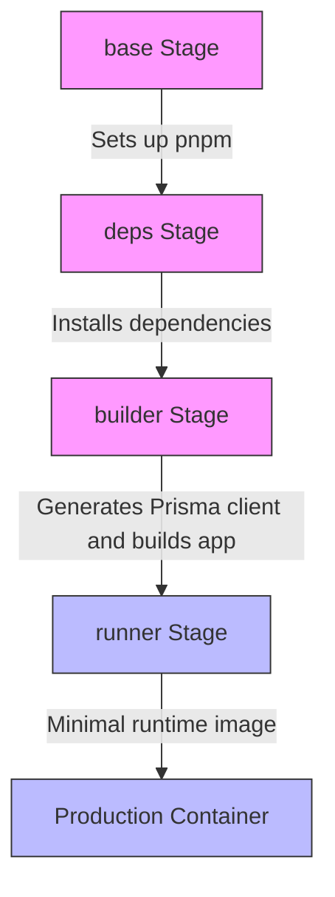
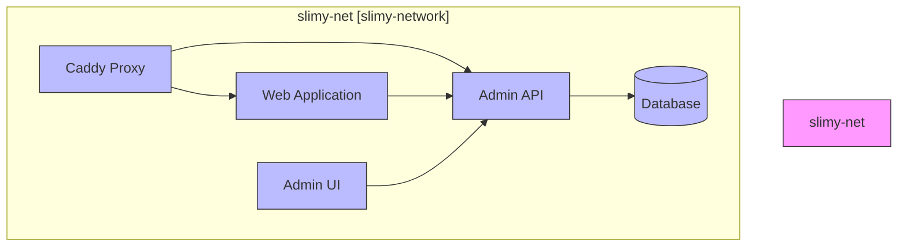
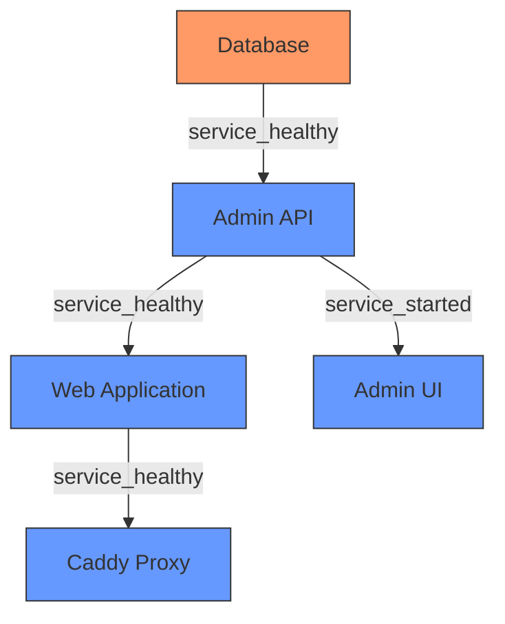
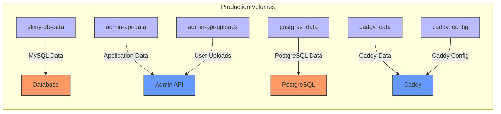
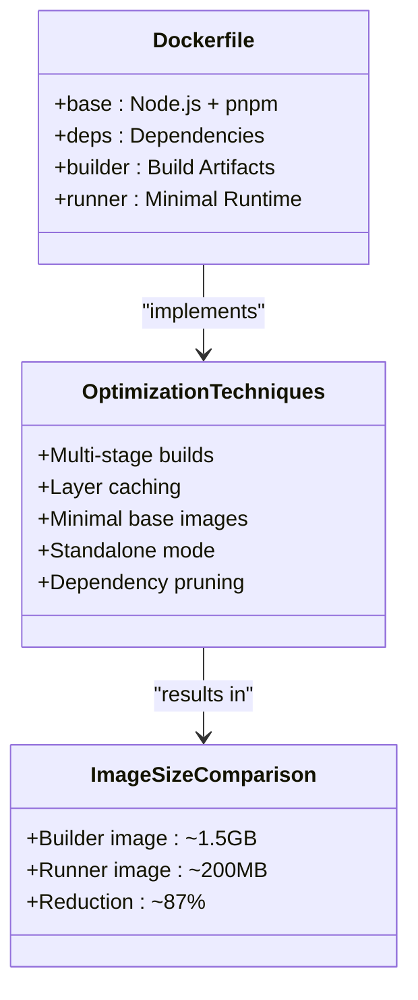
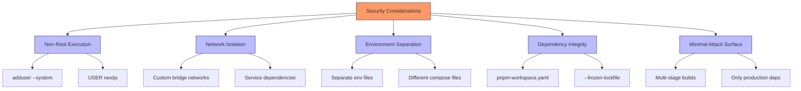
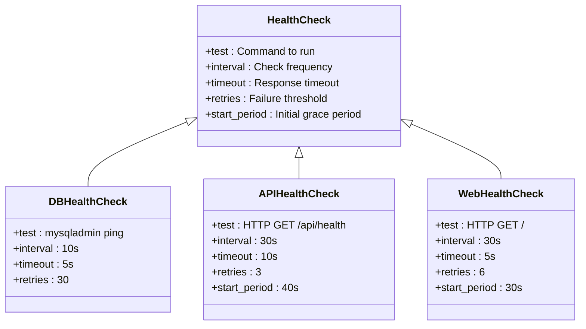

# Docker Containerization Strategy

<cite>
**Referenced Files in This Document**   
- [apps/admin-api/Dockerfile](file://apps/admin-api/Dockerfile)
- [apps/web/Dockerfile](file://apps/web/Dockerfile)
- [infra/docker/docker-compose.slimy-nuc1.yml](file://infra/docker/docker-compose.slimy-nuc1.yml)
- [infra/docker/docker-compose.slimy-nuc2.yml](file://infra/docker/docker-compose.slimy-nuc2.yml)
- [DOCKER_DEPLOYMENT.md](file://DOCKER_DEPLOYMENT.md)
- [pnpm-workspace.yaml](file://pnpm-workspace.yaml)
- [apps/web/package.json](file://apps/web/package.json)
- [apps/admin-api/package.json](file://apps/admin-api/package.json)
- [apps/web/next.config.js](file://apps/web/next.config.js)
</cite>

## Table of Contents
1. [Introduction](#introduction)
2. [Multi-Stage Build Process](#multi-stage-build-process)
3. [Service Isolation and Network Configuration](#service-isolation-and-network-configuration)
4. [Volume Mounting Strategy](#volume-mounting-strategy)
5. [Environment Configuration and Build Arguments](#environment-configuration-and-build-arguments)
6. [Image Optimization Techniques](#image-optimization-techniques)
7. [Security Considerations](#security-considerations)
8. [Health Checks and Restart Policies](#health-checks-and-restart-policies)
9. [Conclusion](#conclusion)

## Introduction
This document outlines the Docker containerization strategy for the Slimy.ai monorepo, focusing on the multi-stage build process, service isolation, and deployment configuration. The architecture leverages Docker's multi-stage builds to optimize image size and security while using Docker Compose for service orchestration across different environments (NUC1 and NUC2). The strategy emphasizes dependency optimization, network isolation, and secure runtime configurations to ensure efficient and reliable deployments.

**Section sources**
- [DOCKER_DEPLOYMENT.md](file://DOCKER_DEPLOYMENT.md#L1-L326)

## Multi-Stage Build Process

The containerization strategy employs a sophisticated multi-stage build process, particularly for the Next.js web application in `apps/web`. This approach separates concerns across different build stages to optimize both the build process and the final runtime image.

The web application Dockerfile defines four distinct stages:

1. **base**: Establishes the foundational environment with pnpm v10.22.0
2. **deps**: Resolves and installs production dependencies
3. **builder**: Builds the application and generates artifacts
4. **runner**: Creates a minimal production runtime environment



**Diagram sources**
- [apps/web/Dockerfile](file://apps/web/Dockerfile#L1-L79)

**Section sources**
- [apps/web/Dockerfile](file://apps/web/Dockerfile#L1-L79)
- [DOCKER_DEPLOYMENT.md](file://DOCKER_DEPLOYMENT.md#L305-L318)

### Base Stage
The base stage (`FROM node:22-slim AS base`) establishes a minimal Node.js 22 environment and configures pnpm as the package manager. It sets environment variables for pnpm and activates the corepack tool to ensure consistent package management across environments.

### Dependencies Stage
The deps stage (`FROM base AS deps`) focuses on dependency resolution. It copies workspace configuration files (package.json, pnpm-lock.yaml, pnpm-workspace.yaml) and installs dependencies using `pnpm install --frozen-lockfile --prod=false`. This stage leverages Docker layer caching to speed up subsequent builds when dependencies haven't changed.

### Builder Stage
The builder stage (`FROM base AS builder`) is responsible for building the application. It copies the built dependencies from the deps stage and then copies the application source code. This separation allows for efficient caching - the dependencies are only reinstalled when the lockfile changes, not when application code changes. The stage runs Prisma client generation and the Next.js build process.

### Runner Stage
The runner stage (`FROM node:22-slim AS runner`) creates the final production image. It uses a fresh Node.js slim image to minimize attack surface and copy only the necessary built artifacts from the builder stage. This results in a significantly smaller image size compared to including the entire build environment.

## Service Isolation and Network Configuration

The deployment strategy implements service isolation through custom bridge networks defined in the docker-compose files. This ensures that services can communicate securely while being isolated from other containers on the host.



**Diagram sources**
- [infra/docker/docker-compose.slimy-nuc1.yml](file://infra/docker/docker-compose.slimy-nuc1.yml#L1-L172)
- [infra/docker/docker-compose.slimy-nuc2.yml](file://infra/docker/docker-compose.slimy-nuc2.yml#L1-L149)

**Section sources**
- [infra/docker/docker-compose.slimy-nuc1.yml](file://infra/docker/docker-compose.slimy-nuc1.yml#L1-L172)
- [infra/docker/docker-compose.slimy-nuc2.yml](file://infra/docker/docker-compose.slimy-nuc2.yml#L1-L149)

### Network Isolation
The docker-compose configurations define custom bridge networks to isolate services:

- **slimy-net** in `docker-compose.slimy-nuc1.yml` uses the default bridge driver
- **slimy-network** in `docker-compose.slimy-nuc2.yml` is explicitly named for clarity

All services (except caddy which uses host networking) are connected to these networks, enabling secure inter-service communication while preventing unauthorized access from external containers.

### Service Dependencies
The configuration establishes explicit dependencies between services using the `depends_on` directive with health checks:



**Diagram sources**
- [infra/docker/docker-compose.slimy-nuc1.yml](file://infra/docker/docker-compose.slimy-nuc1.yml#L1-L172)
- [infra/docker/docker-compose.slimy-nuc2.yml](file://infra/docker/docker-compose.slimy-nuc2.yml#L1-L149)

This ensures services start in the correct order and are fully operational before dependent services attempt to connect.

## Volume Mounting Strategy

The containerization strategy implements a comprehensive volume mounting approach for data persistence and development synchronization.

### Production Volume Configuration
In production environments, named volumes are used to persist critical data:



**Diagram sources**
- [infra/docker/docker-compose.slimy-nuc1.yml](file://infra/docker/docker-compose.slimy-nuc1.yml#L1-L172)
- [infra/docker/docker-compose.slimy-nuc2.yml](file://infra/docker/docker-compose.slimy-nuc2.yml#L1-L149)

### Host-Path Volume Mapping
For NUC2, specific host paths are mounted to ensure data persistence across container restarts:

- Database data: `/opt/slimy/backups/postgres` → `/backups`
- Admin API data: `/opt/slimy/data/admin-api/data` → `/app/data`
- Admin API uploads: `/opt/slimy/data/admin-api/uploads` → `/var/lib/slimy/uploads`
- Backups: `/opt/slimy/backups/admin-api` → `/var/backups/slimy`
- Logs: `/opt/slimy/logs/admin-api` → `/app/logs`

This approach provides both data persistence and easy access for backup and monitoring purposes.

**Section sources**
- [infra/docker/docker-compose.slimy-nuc1.yml](file://infra/docker/docker-compose.slimy-nuc1.yml#L1-L172)
- [infra/docker/docker-compose.slimy-nuc2.yml](file://infra/docker/docker-compose.slimy-nuc2.yml#L1-L149)

## Environment Configuration and Build Arguments

The containerization strategy employs a flexible environment configuration system using both environment files and build-time arguments.

### Environment Variable Injection
Environment variables are injected through multiple mechanisms:

```mermaid
flowchart TD
subgraph "Environment Configuration"
A[env_file] --> B[/opt/slimy/app/admin-api/.env.admin.production]
A --> C[/opt/slimy/secrets/.env.db.slimy-nuc2]
A --> D[/opt/slimy/secrets/.env.web.production]
E[environment] --> F[NODE_ENV=production]
E --> G[PORT=3000]
E --> H[HOST=0.0.0.0]
I[build args] --> J[NEXT_PUBLIC_ADMIN_API_BASE]
I --> K[NEXT_PUBLIC_SNELP_CODES_URL]
I --> L[NEXT_PUBLIC_PLAUSIBLE_DOMAIN]
end
style A fill:#f9f,stroke:#333
style B fill:#bbf,stroke:#333
style C fill:#bbf,stroke:#333
style D fill:#bbf,stroke:#333
style E fill:#f9f,stroke:#333
style F fill:#bbf,stroke:#333
style G fill:#bbf,stroke:#333
style H fill:#bbf,stroke:#333
style I fill:#f9f,stroke:#333
style J fill:#bbf,stroke:#333
style K fill:#bbf,stroke:#333
style L fill:#bbf,stroke:#333
```

**Diagram sources**
- [infra/docker/docker-compose.slimy-nuc1.yml](file://infra/docker/docker-compose.slimy-nuc1.yml#L1-L172)
- [infra/docker/docker-compose.slimy-nuc2.yml](file://infra/docker/docker-compose.slimy-nuc2.yml#L1-L149)

### Build-Time Arguments
The web application Dockerfile uses build arguments to configure the application at build time:

- `NEXT_PUBLIC_ADMIN_API_BASE`: Base URL for the admin API
- `NEXT_PUBLIC_SNELP_CODES_URL`: URL for Snelp codes feed
- `NEXT_PUBLIC_PLAUSIBLE_DOMAIN`: Domain for Plausible analytics

These arguments are passed through the docker-compose configuration and set as environment variables in the container.

**Section sources**
- [apps/web/Dockerfile](file://apps/web/Dockerfile#L37-L43)
- [infra/docker/docker-compose.slimy-nuc2.yml](file://infra/docker/docker-compose.slimy-nuc2.yml#L73-L76)

## Image Optimization Techniques

The containerization strategy implements several image optimization techniques to reduce image size and improve performance.

### Multi-Stage Build Optimization
The multi-stage build process significantly reduces the final image size by:

1. Separating build-time and runtime dependencies
2. Using minimal base images for the final stage
3. Copying only necessary artifacts to the runner stage

### Dependency Optimization
The strategy optimizes dependencies through:

- Using `--frozen-lockfile` to ensure consistent dependency resolution
- Installing only production dependencies in the final image
- Leveraging Docker layer caching for faster builds

### Next.js Standalone Mode
The web application uses Next.js standalone mode (`output: 'standalone'` in next.config.js), which creates a minimal deployment package containing only the necessary files for production.



**Diagram sources**
- [apps/web/Dockerfile](file://apps/web/Dockerfile#L1-L79)
- [apps/web/next.config.js](file://apps/web/next.config.js#L1-L7)

**Section sources**
- [apps/web/Dockerfile](file://apps/web/Dockerfile#L1-L79)
- [apps/web/next.config.js](file://apps/web/next.config.js#L1-L7)
- [DOCKER_DEPLOYMENT.md](file://DOCKER_DEPLOYMENT.md#L314-L318)

## Security Considerations

The containerization strategy incorporates several security best practices to enhance the overall security posture.

### Non-Root User Execution
The web application runner stage creates a dedicated non-root user for running the application:

```dockerfile
RUN addgroup --system --gid 1001 nodejs
RUN adduser --system --uid 1001 nextjs
USER nextjs
```

This follows the principle of least privilege, reducing the potential impact of security vulnerabilities.

### Environment Isolation
The strategy isolates environments through:

- Separate docker-compose files for different environments (NUC1, NUC2)
- Different environment variable files for each deployment
- Network isolation using custom bridge networks

### Build Security
The build process includes security features:

- Using `--frozen-lockfile` to prevent dependency tree changes
- Explicitly allowing only trusted build scripts through `pnpm-workspace.yaml`
- Minimizing the attack surface by excluding development dependencies from production



**Diagram sources**
- [apps/web/Dockerfile](file://apps/web/Dockerfile#L59-L70)
- [pnpm-workspace.yaml](file://pnpm-workspace.yaml#L1-L14)
- [infra/docker/docker-compose.slimy-nuc1.yml](file://infra/docker/docker-compose.slimy-nuc1.yml#L1-L172)

**Section sources**
- [apps/web/Dockerfile](file://apps/web/Dockerfile#L59-L70)
- [pnpm-workspace.yaml](file://pnpm-workspace.yaml#L1-L14)

## Health Checks and Restart Policies

The containerization strategy implements robust health checks and restart policies to ensure service reliability.

### Health Check Configuration
Each service includes a health check to verify its operational status:



**Diagram sources**
- [infra/docker/docker-compose.slimy-nuc1.yml](file://infra/docker/docker-compose.slimy-nuc1.yml#L39-L45)
- [infra/docker/docker-compose.slimy-nuc1.yml](file://infra/docker/docker-compose.slimy-nuc1.yml#L69-L80)
- [infra/docker/docker-compose.slimy-nuc1.yml](file://infra/docker/docker-compose.slimy-nuc1.yml#L147-L158)

### Restart Policies
All services use the `unless-stopped` restart policy, which ensures that containers automatically restart after system reboots or failures, except when explicitly stopped by the user.

The dependency chain ensures that services only start when their dependencies are healthy, preventing cascading failures during startup.

**Section sources**
- [infra/docker/docker-compose.slimy-nuc1.yml](file://infra/docker/docker-compose.slimy-nuc1.yml#L7-L8)
- [infra/docker/docker-compose.slimy-nuc1.yml](file://infra/docker/docker-compose.slimy-nuc1.yml#L54-L57)
- [infra/docker/docker-compose.slimy-nuc1.yml](file://infra/docker/docker-compose.slimy-nuc1.yml#L87-L91)

## Conclusion
The Docker containerization strategy for the Slimy.ai monorepo demonstrates a comprehensive approach to modern application deployment. By leveraging multi-stage builds, the strategy optimizes image size and build efficiency while maintaining security through non-root user execution and dependency isolation. The service orchestration through Docker Compose ensures proper service isolation, health monitoring, and reliable restart policies. The volume mounting strategy provides data persistence across container lifecycles, and the environment configuration system enables flexible deployment across different environments. This architecture balances performance, security, and maintainability, providing a robust foundation for the application's deployment and operation.