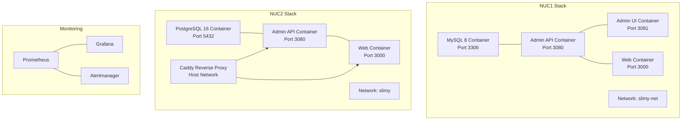
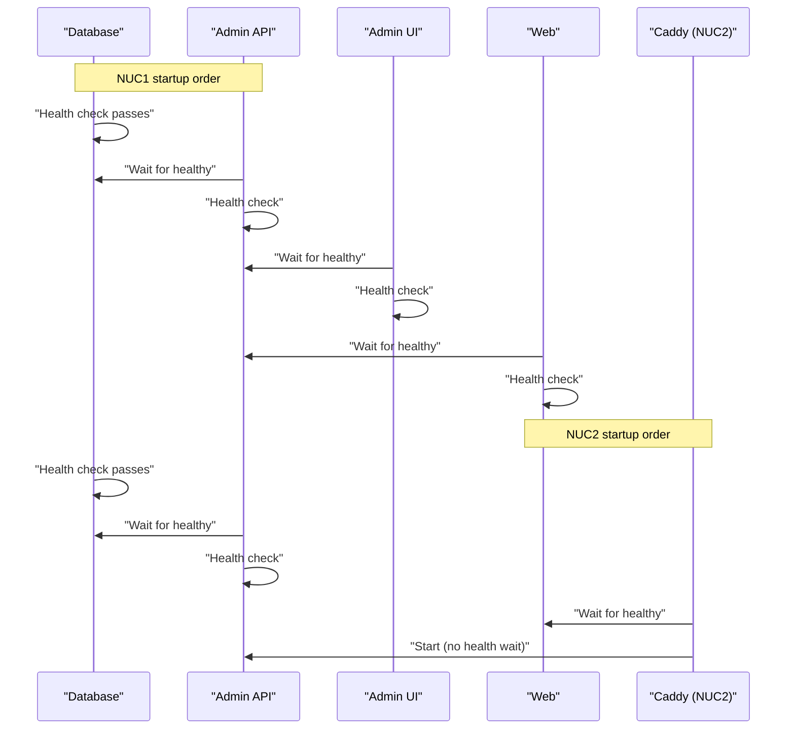
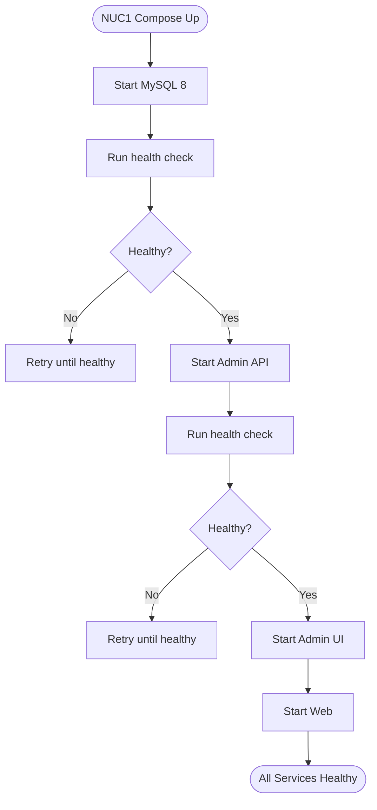
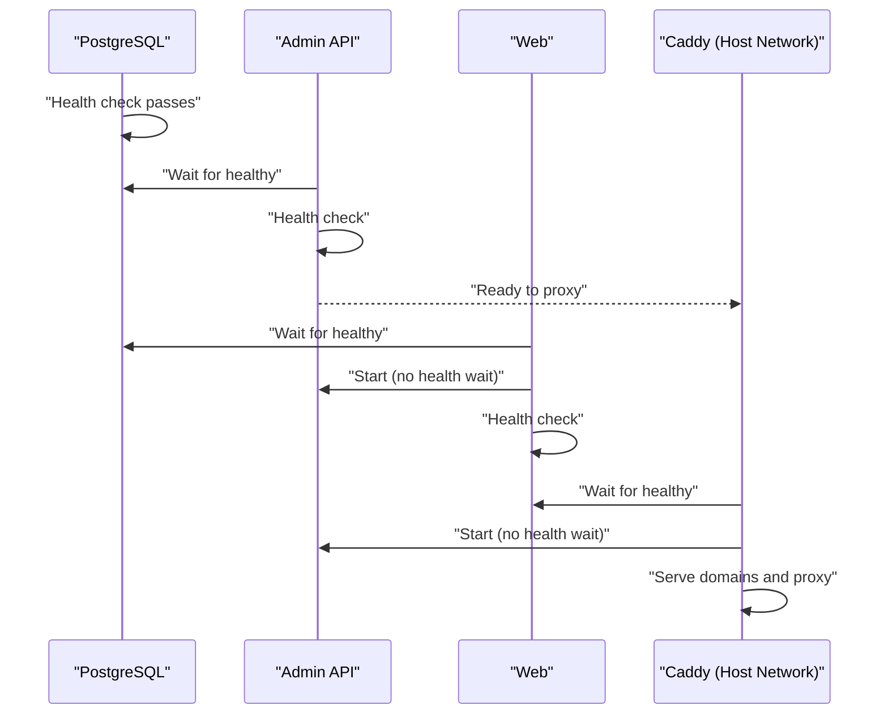
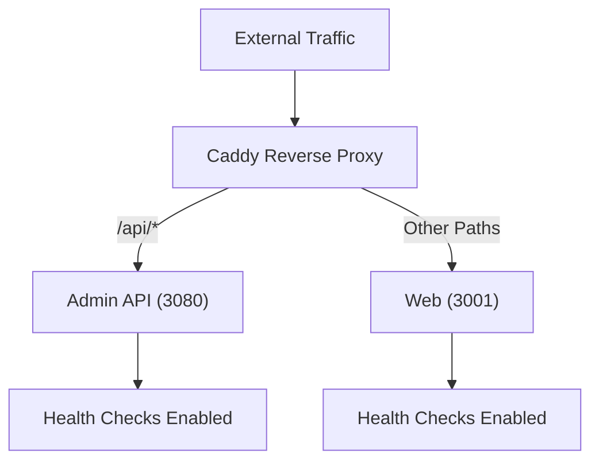
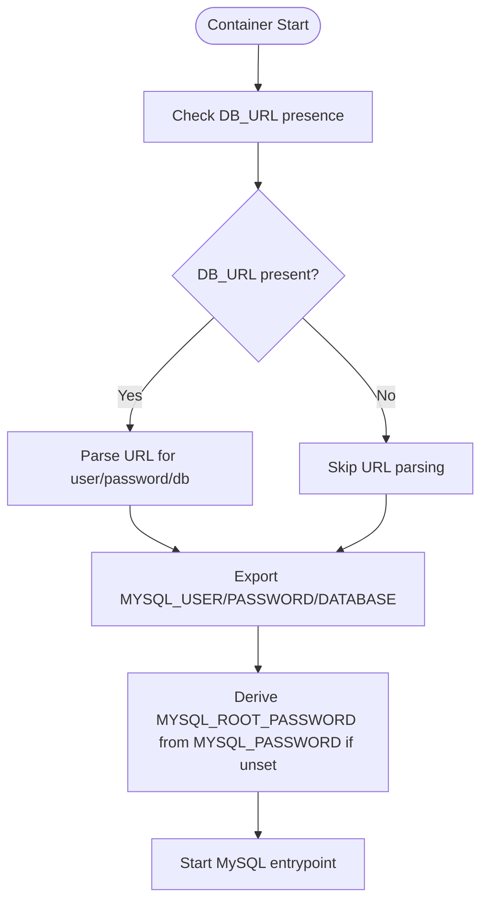
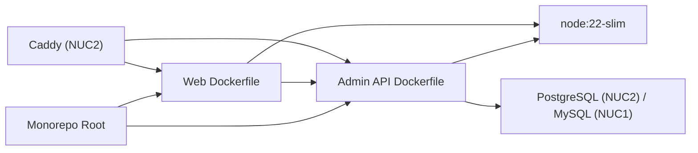

# Environment-Specific Deployment Configurations

<cite>
**Referenced Files in This Document**
- [docker-compose.slimy-nuc1.yml](file://infra/docker/docker-compose.slimy-nuc1.yml)
- [docker-compose.slimy-nuc2.yml](file://infra/docker/docker-compose.slimy-nuc2.yml)
- [docker-compose.production.yml](file://apps/web/docker-compose.production.yml)
- [Dockerfile (admin-api)](file://apps/admin-api/Dockerfile)
- [Dockerfile (web)](file://apps/web/Dockerfile)
- [DOCKER_DEPLOYMENT.md](file://DOCKER_DEPLOYMENT.md)
- [deploy-to-server.sh](file://apps/web/deploy-to-server.sh)
- [Caddyfile.template](file://apps/web/Caddyfile.template)
- [Caddyfile.slimy-nuc2](file://infra/docker/Caddyfile.slimy-nuc2)
- [config.js (admin-api)](file://apps/admin-api/src/config.js)
- [index.js (admin-api config)](file://apps/admin-api/src/lib/config/index.js)
- [env.ts (web)](file://apps/web/lib/env.ts)
- [apply-db-url.js (admin-api)](file://apps/admin-api/src/utils/apply-db-url.js)
- [database.js (admin-api mysql2)](file://apps/admin-api/lib/database.js)
- [mysql-dump.js (admin-api)](file://apps/admin-api/src/util/mysql-dump.js)
- [apply-club-schema.sh](file://scripts/apply-club-schema.sh)
- [docker-compose.monitoring.yml](file://apps/web/docker-compose.monitoring.yml)
</cite>

## Table of Contents
1. [Introduction](#introduction)
2. [Project Structure](#project-structure)
3. [Core Components](#core-components)
4. [Architecture Overview](#architecture-overview)
5. [Detailed Component Analysis](#detailed-component-analysis)
6. [Dependency Analysis](#dependency-analysis)
7. [Performance Considerations](#performance-considerations)
8. [Troubleshooting Guide](#troubleshooting-guide)
9. [Conclusion](#conclusion)
10. [Appendices](#appendices)

## Introduction
This document explains the environment-specific deployment configurations for the Slimy.ai monorepo, focusing on two NUC-based stacks (NUC1 and NUC2), the production web configuration, and the database container setup. It covers hardware-specific optimizations, service topology, port mappings, environment variables, health checks, service interdependencies, startup ordering, database configuration for MySQL 8 and PostgreSQL, and network configuration for both standalone and clustered deployments. Guidance is also provided on adapting these configurations for different infrastructure environments.

## Project Structure
The deployment configuration spans:
- Infrastructure Docker Compose files under infra/docker
- Application Dockerfiles under apps/admin-api and apps/web
- Production web compose and Caddy configuration under apps/web
- Monitoring compose under apps/web
- Admin API configuration and database helpers under apps/admin-api
- Deployment scripts and documentation under apps/web and repository root

**Diagram sources**
- [docker-compose.slimy-nuc1.yml](file://infra/docker/docker-compose.slimy-nuc1.yml#L1-L172)
- [docker-compose.slimy-nuc2.yml](file://infra/docker/docker-compose.slimy-nuc2.yml#L1-L149)
- [docker-compose.production.yml](file://apps/web/docker-compose.production.yml#L1-L29)
- [docker-compose.monitoring.yml](file://apps/web/docker-compose.monitoring.yml#L1-L63)

**Section sources**
- [docker-compose.slimy-nuc1.yml](file://infra/docker/docker-compose.slimy-nuc1.yml#L1-L172)
- [docker-compose.slimy-nuc2.yml](file://infra/docker/docker-compose.slimy-nuc2.yml#L1-L149)
- [docker-compose.production.yml](file://apps/web/docker-compose.production.yml#L1-L29)
- [docker-compose.monitoring.yml](file://apps/web/docker-compose.monitoring.yml#L1-L63)

## Core Components
- NUC1 stack: MySQL 8 database, Admin API, Admin UI, and Web app in a shared bridge network.
- NUC2 stack: PostgreSQL database, Admin API, Web app, and Caddy reverse proxy using host networking.
- Production web compose: Standalone web container with health checks and external network.
- Monitoring stack: Prometheus, Grafana, and Alertmanager for observability.

**Section sources**
- [docker-compose.slimy-nuc1.yml](file://infra/docker/docker-compose.slimy-nuc1.yml#L1-L172)
- [docker-compose.slimy-nuc2.yml](file://infra/docker/docker-compose.slimy-nuc2.yml#L1-L149)
- [docker-compose.production.yml](file://apps/web/docker-compose.production.yml#L1-L29)
- [docker-compose.monitoring.yml](file://apps/web/docker-compose.monitoring.yml#L1-L63)

## Architecture Overview
The NUC1 stack runs a MySQL 8 database and exposes it on port 3306. Services start in order: database (healthy), Admin API (depends on database), Admin UI (depends on Admin API), and Web (depends on Admin API). The NUC2 stack uses PostgreSQL 16, exposes port 5432, and uses Caddy in host networking mode to route traffic to Admin API and Web. Startup ordering differs slightly: Caddy depends on Web being healthy, while Admin API starts immediately after the database becomes healthy.

**Diagram sources**
- [docker-compose.slimy-nuc1.yml](file://infra/docker/docker-compose.slimy-nuc1.yml#L33-L83)
- [docker-compose.slimy-nuc2.yml](file://infra/docker/docker-compose.slimy-nuc2.yml#L1-L149)

**Section sources**
- [docker-compose.slimy-nuc1.yml](file://infra/docker/docker-compose.slimy-nuc1.yml#L33-L83)
- [docker-compose.slimy-nuc2.yml](file://infra/docker/docker-compose.slimy-nuc2.yml#L45-L114)

## Detailed Component Analysis

### NUC1 Stack (MySQL 8)
- Database container:
  - Image: MySQL 8
  - Port mapping: 3306:3306
  - Authentication plugin: native password
  - Entrypoint script resolves DB_URL and exports MYSQL_USER/MYSQL_PASSWORD/MYSQL_DATABASE, derives MYSQL_ROOT_PASSWORD from MYSQL_PASSWORD if not set
  - Health check: mysqladmin ping with root password
  - Volume: named volume for data persistence
  - Network: slimy-net bridge network
- Admin API container:
  - Build context: monorepo root, Dockerfile at apps/admin-api/Dockerfile
  - Ports: 3080:3080
  - Depends on: db with service_healthy
  - Environment: PORT=3080, NODE_ENV=production
  - Volumes: data and uploads directories
  - Health check: GET /api/health against localhost
- Admin UI container:
  - Node Alpine image, working dir /workspace
  - Ports: 3081:3081
  - Depends on: admin-api with service_healthy
  - Environment: HOST=0.0.0.0, PORT=3081, NODE_ENV=production
  - Health check: GET / against localhost
- Web container:
  - Build context: monorepo root, Dockerfile at apps/web/Dockerfile
  - Ports: 3000:3000
  - Depends on: admin-api with service_healthy
  - Environment: HOST=0.0.0.0, PORT=3000, NODE_ENV=production
  - Health check: GET /api/health against localhost

**Diagram sources**
- [docker-compose.slimy-nuc1.yml](file://infra/docker/docker-compose.slimy-nuc1.yml#L1-L172)

**Section sources**
- [docker-compose.slimy-nuc1.yml](file://infra/docker/docker-compose.slimy-nuc1.yml#L1-L172)
- [Dockerfile (admin-api)](file://apps/admin-api/Dockerfile#L1-L16)
- [Dockerfile (web)](file://apps/web/Dockerfile#L1-L79)

### NUC2 Stack (PostgreSQL 16 + Caddy)
- Database container:
  - Image: PostgreSQL 16-alpine
  - Port mapping: 5432:5432
  - Health check: pg_isready against configured user
  - Volumes: data and backups
  - Network: slimy network
- Admin API container:
  - Build context: monorepo root, Dockerfile at apps/admin-api/Dockerfile
  - Environment variables include TRUST_PROXY, UPLOADS_DIR, BACKUP_* paths, CORS_ORIGIN, and dummy auth variables for development
  - Depends on: postgres with service_healthy
  - Ports: 3080:3080
  - Volumes: data, uploads, backups, logs
  - Health check: GET /api/health against localhost
- Web container:
  - Build context: monorepo root, Dockerfile at apps/web/Dockerfile
  - Build args: NEXT_PUBLIC_ADMIN_API_BASE, NEXT_PUBLIC_SNELP_CODES_URL, NEXT_PUBLIC_PLAUSIBLE_DOMAIN
  - Environment variables: HOST, PORT, NEXT_PUBLIC_* variables, telemetry disabled
  - Depends on: postgres with service_healthy and admin-api with service_started
  - Ports: 3000:3000
  - Volumes: logs
  - Health check: GET / against localhost
- Caddy container:
  - Image: Caddy 2
  - Network mode: host
  - Depends on: web with service_healthy and admin-api with service_started
  - Volumes: Caddyfile, data, config
  - Routes:
    - Domain-based routing with multiple hostnames
    - /api/* proxied to Admin API on 3080
    - Other paths proxied to Web on 3000
    - Health checks for upstreams

**Diagram sources**
- [docker-compose.slimy-nuc2.yml](file://infra/docker/docker-compose.slimy-nuc2.yml#L1-L149)
- [Caddyfile.slimy-nuc2](file://infra/docker/Caddyfile.slimy-nuc2#L1-L84)

**Section sources**
- [docker-compose.slimy-nuc2.yml](file://infra/docker/docker-compose.slimy-nuc2.yml#L1-L149)
- [Caddyfile.slimy-nuc2](file://infra/docker/Caddyfile.slimy-nuc2#L1-L84)

### Production Web Configuration (Standalone)
- Web container:
  - Ports: 3001:3000
  - Environment variables:
    - NEXT_PUBLIC_ADMIN_API_BASE
    - NEXT_PUBLIC_SNELP_CODES_URL
    - NODE_ENV=production
  - Health check: GET /api/health against localhost
  - Network: external slimy-network
- Reverse proxy (Caddy):
  - Template configuration demonstrates:
    - /api/* routed to Admin API on 3080
    - Other paths routed to Web on 3001
    - Health checks for upstreams
    - Security headers and compression

**Diagram sources**
- [docker-compose.production.yml](file://apps/web/docker-compose.production.yml#L1-L29)
- [Caddyfile.template](file://apps/web/Caddyfile.template#L1-L82)

**Section sources**
- [docker-compose.production.yml](file://apps/web/docker-compose.production.yml#L1-L29)
- [Caddyfile.template](file://apps/web/Caddyfile.template#L1-L82)

### Database Container Configuration

#### MySQL 8 (NUC1)
- Authentication:
  - Sets default authentication plugin to mysql_native_password
  - Entrypoint script parses DB_URL and exports MYSQL_USER, MYSQL_PASSWORD, MYSQL_DATABASE
  - Derives MYSQL_ROOT_PASSWORD from MYSQL_PASSWORD if not set
- Persistence:
  - Named volume for /var/lib/mysql
- Root password derivation:
  - If MYSQL_ROOT_PASSWORD is unset, it falls back to MYSQL_PASSWORD
- Health check:
  - Uses mysqladmin ping with root password

**Diagram sources**
- [docker-compose.slimy-nuc1.yml](file://infra/docker/docker-compose.slimy-nuc1.yml#L9-L33)

**Section sources**
- [docker-compose.slimy-nuc1.yml](file://infra/docker/docker-compose.slimy-nuc1.yml#L9-L33)

#### PostgreSQL 16 (NUC2)
- Authentication:
  - Health check uses pg_isready against configured user
- Persistence:
  - Named volume for /var/lib/postgresql/data
  - Additional backup volume mounted at /backups
- Health check:
  - CMD-SHELL pg_isready with user

**Section sources**
- [docker-compose.slimy-nuc2.yml](file://infra/docker/docker-compose.slimy-nuc2.yml#L1-L21)

### Service Interdependencies and Startup Ordering
- NUC1:
  - Admin API depends on db:service_healthy
  - Admin UI depends on admin-api:service_healthy
  - Web depends on admin-api:service_healthy
- NUC2:
  - Admin API depends on postgres:service_healthy
  - Web depends on postgres:service_healthy and admin-api:service_started
  - Caddy depends on web:service_healthy and admin-api:service_started
- Health-based conditions:
  - MySQL 8: db health check uses mysqladmin ping
  - PostgreSQL: postgres health check uses pg_isready
  - Admin API: health check performs HTTP GET to /api/health
  - Admin UI: health check performs HTTP GET to /
  - Web: health check performs HTTP GET to /api/health
  - Caddy: relies on upstream health checks configured in its Caddyfile

**Section sources**
- [docker-compose.slimy-nuc1.yml](file://infra/docker/docker-compose.slimy-nuc1.yml#L33-L83)
- [docker-compose.slimy-nuc2.yml](file://infra/docker/docker-compose.slimy-nuc2.yml#L45-L114)

### Environment Variables and Configuration

#### Admin API (NUC2)
- Required auth/session variables:
  - DISCORD_CLIENT_ID, DISCORD_CLIENT_SECRET, SESSION_SECRET, JWT_SECRET
- Additional variables:
  - TRUST_PROXY, UPLOADS_DIR, BACKUP_ROOT, BACKUP_MYSQL_DIR, BACKUP_DATA_DIR
  - CORS_ORIGIN
- Database URL validation:
  - DATABASE_URL must be a valid PostgreSQL connection string
- Configuration loading:
  - Centralized config module loads and validates environment variables with defaults and validation rules

**Section sources**
- [docker-compose.slimy-nuc2.yml](file://infra/docker/docker-compose.slimy-nuc2.yml#L29-L45)
- [config.js (admin-api)](file://apps/admin-api/src/config.js#L1-L125)
- [index.js (admin-api config)](file://apps/admin-api/src/lib/config/index.js#L1-L235)

#### Web App
- Public environment variables:
  - NEXT_PUBLIC_ADMIN_API_BASE, NEXT_PUBLIC_SNELP_CODES_URL, NEXT_PUBLIC_PLAUSIBLE_DOMAIN
- Private environment variables:
  - NODE_ENV, HOST, PORT, telemetry flags
- Environment validation:
  - Zod schema enforces presence and types for client and server variables

**Section sources**
- [docker-compose.production.yml](file://apps/web/docker-compose.production.yml#L1-L29)
- [env.ts (web)](file://apps/web/lib/env.ts#L1-L221)

### Database Helpers and Utilities
- Admin API MySQL helper:
  - Parses DB_URL and creates a mysql2 pool with connection limits and charset
  - Provides query, one, and transaction helpers
- Admin API MySQL dump utility:
  - Parses DB_URL and runs mysqldump with appropriate arguments
- Admin API DB URL application:
  - Applies DB_URL parts to DB_HOST, DB_PORT, DB_USER, DB_PASSWORD, DB_NAME
- Club schema application helper:
  - Manual helper to apply club analytics schema to MySQL

**Section sources**
- [database.js (admin-api mysql2)](file://apps/admin-api/lib/database.js#L1-L61)
- [mysql-dump.js (admin-api)](file://apps/admin-api/src/util/mysql-dump.js#L1-L56)
- [apply-db-url.js (admin-api)](file://apps/admin-api/src/utils/apply-db-url.js#L1-L26)
- [apply-club-schema.sh](file://scripts/apply-club-schema.sh#L1-L54)

## Dependency Analysis
- Build context:
  - Both Dockerfiles use monorepo root as build context to resolve workspace dependencies and enable Prisma client generation.
- Multi-stage builds:
  - Web Dockerfile uses multi-stage builds to separate dependency installation, Prisma client generation, and production runtime.
- Runtime images:
  - Admin API uses node:22-slim
  - Web uses node:22-slim with a dedicated non-root user and exposed port 3000
- External dependencies:
  - Admin API depends on PostgreSQL (NUC2) or MySQL (NUC1)
  - Web depends on Admin API for API routes and on Caddy for reverse proxying

**Diagram sources**
- [Dockerfile (admin-api)](file://apps/admin-api/Dockerfile#L1-L16)
- [Dockerfile (web)](file://apps/web/Dockerfile#L1-L79)
- [docker-compose.slimy-nuc1.yml](file://infra/docker/docker-compose.slimy-nuc1.yml#L1-L172)
- [docker-compose.slimy-nuc2.yml](file://infra/docker/docker-compose.slimy-nuc2.yml#L1-L149)

**Section sources**
- [Dockerfile (admin-api)](file://apps/admin-api/Dockerfile#L1-L16)
- [Dockerfile (web)](file://apps/web/Dockerfile#L1-L79)
- [DOCKER_DEPLOYMENT.md](file://DOCKER_DEPLOYMENT.md#L109-L152)

## Performance Considerations
- Health checks:
  - Short intervals and timeouts ensure fast detection of unhealthy services.
  - Start periods allow warm-up for services with heavy initialization.
- Database connections:
  - MySQL helper sets connection limits and charset suitable for utf8mb4.
  - PostgreSQL health check uses pg_isready for lightweight readiness.
- Reverse proxy:
  - Caddy compresses responses and adds security headers.
- Multi-stage builds:
  - Reduce final image size and improve caching efficiency.

[No sources needed since this section provides general guidance]

## Troubleshooting Guide
- Overlay2 cache corruption on NUC hosts:
  - Symptoms: overlay2 errors during docker compose build
  - Recommended fix: safe cache cleanup using docker builder prune and rebuild with --no-cache
- Build scripts warning:
  - Ensure monorepo root is used as build context so onlyBuiltDependencies applies
- Prisma generate failures:
  - Verify DATABASE_URL and that onlyBuiltDependencies includes prisma packages
- Font loading failures:
  - App uses system fonts via Tailwind CSS to avoid network-restricted font fetching
- Multiple lockfiles warning:
  - Only root pnpm-lock.yaml exists to avoid conflicts

**Section sources**
- [DOCKER_DEPLOYMENT.md](file://DOCKER_DEPLOYMENT.md#L188-L257)
- [DOCKER_DEPLOYMENT.md](file://DOCKER_DEPLOYMENT.md#L258-L293)

## Conclusion
The NUC1 and NUC2 deployment configurations offer distinct approaches tailored to different databases and proxy setups. NUC1 uses MySQL 8 with a straightforward bridge network and health-based startup ordering. NUC2 uses PostgreSQL 16 with Caddy in host networking for flexible domain routing and health checks. Both configurations emphasize health checks, environment-driven configuration, and robust persistence. Adapting these configurations to other environments involves aligning database images, port mappings, health checks, and reverse proxy rules to match target infrastructure.

## Appendices

### Network Configuration Details
- NUC1:
  - Bridge network: slimy-net
  - Services communicate via container names and internal ports
- NUC2:
  - Bridge network: slimy
  - Caddy uses host networking to bind to host ports and domains
- Production web:
  - External network: slimy-network
  - Caddy template demonstrates reverse proxying to Admin API and Web

**Section sources**
- [docker-compose.slimy-nuc1.yml](file://infra/docker/docker-compose.slimy-nuc1.yml#L169-L172)
- [docker-compose.slimy-nuc2.yml](file://infra/docker/docker-compose.slimy-nuc2.yml#L135-L138)
- [docker-compose.production.yml](file://apps/web/docker-compose.production.yml#L26-L29)

### Monitoring Stack
- Prometheus, Grafana, and Alertmanager can be combined with the main compose files using the monitoring compose file.
- Prometheus and Grafana expose standard ports and mount persistent volumes.

**Section sources**
- [docker-compose.monitoring.yml](file://apps/web/docker-compose.monitoring.yml#L1-L63)