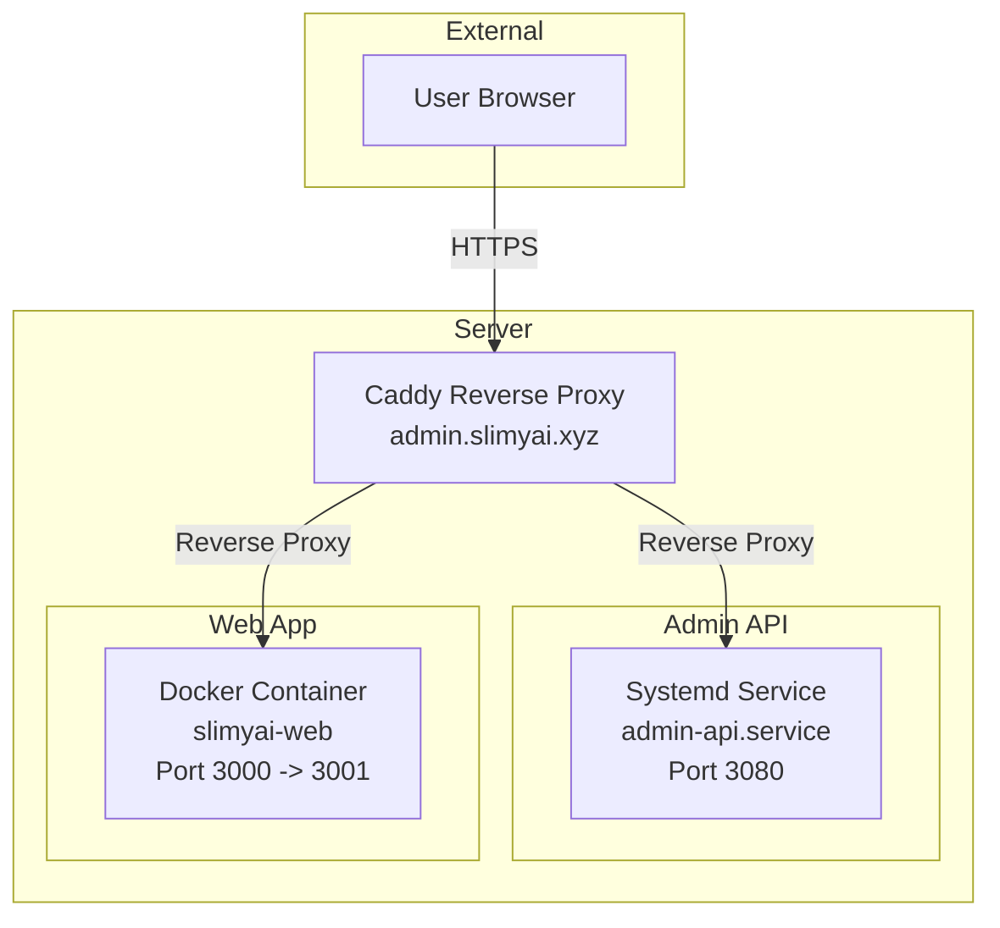
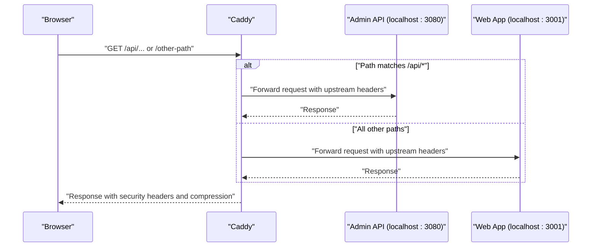
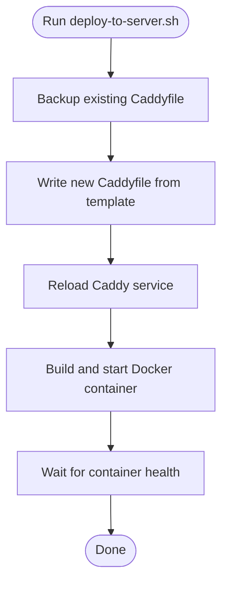
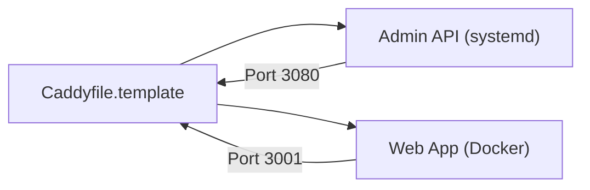
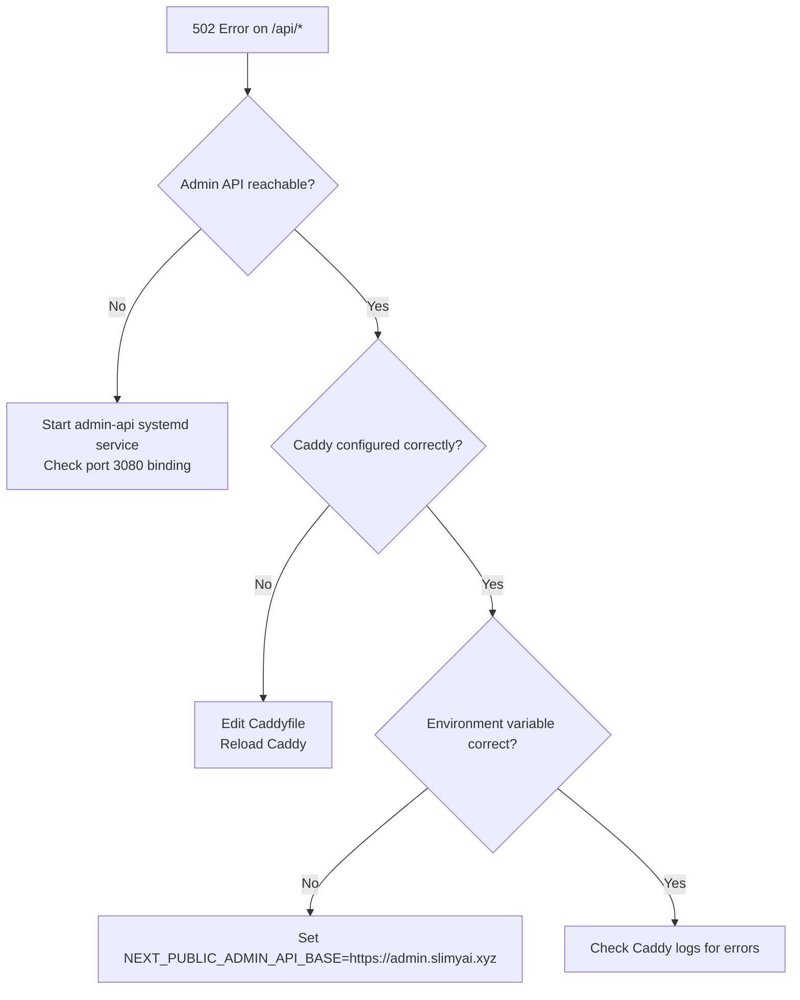

# Reverse Proxy and SSL Termination

<cite>
**Referenced Files in This Document**
- [Caddyfile.template](file://apps/web/Caddyfile.template)
- [deploy-to-server.sh](file://apps/web/deploy-to-server.sh)
- [502_INVESTIGATION.md](file://apps/web/502_INVESTIGATION.md)
- [ADMIN_API_INVESTIGATION.md](file://apps/web/ADMIN_API_INVESTIGATION.md)
- [server.js](file://apps/admin-api/server.js)
- [README.md](file://apps/admin-api/README.md)
</cite>

## Table of Contents
1. [Introduction](#introduction)
2. [Project Structure](#project-structure)
3. [Core Components](#core-components)
4. [Architecture Overview](#architecture-overview)
5. [Detailed Component Analysis](#detailed-component-analysis)
6. [Dependency Analysis](#dependency-analysis)
7. [Performance Considerations](#performance-considerations)
8. [Troubleshooting Guide](#troubleshooting-guide)
9. [Conclusion](#conclusion)

## Introduction
This document explains how the reverse proxy is configured using Caddy for the domain admin.slimyai.xyz. It covers the Caddyfile structure that routes /api/* to the admin API backend on port 3080 while forwarding all other traffic to the Next.js web application on port 3001. It also details SSL/TLS termination with automatic certificate management, security headers (including HSTS, XSS protection, and frame options), logging configuration, and compression settings. Finally, it explains how the deploy-to-server.sh script automates updating the Caddy configuration and reloading the service.

## Project Structure
The reverse proxy configuration centers around a Caddyfile template and a deployment automation script. The admin API runs as a separate systemd service on the host and listens on port 3080. The web application runs inside a Docker container and exposes port 3000 internally, mapped to 3001 on the host.

**Diagram sources**
- [Caddyfile.template](file://apps/web/Caddyfile.template#L3-L76)
- [server.js](file://apps/admin-api/server.js#L49-L56)
- [README.md](file://apps/admin-api/README.md#L166-L177)

**Section sources**
- [Caddyfile.template](file://apps/web/Caddyfile.template#L3-L76)
- [server.js](file://apps/admin-api/server.js#L49-L56)
- [README.md](file://apps/admin-api/README.md#L166-L177)

## Core Components
- Caddy reverse proxy configuration for admin.slimyai.xyz
- Domain-specific routing for API and web application
- Automatic SSL/TLS termination with certificate management
- Security headers (HSTS, XSS protection, frame options, referrer policy, CSP)
- Logging to a rotating file with JSON format
- Compression enabled (gzip and zstd)
- Health checks for upstream services
- Deployment automation script to update Caddy and reload the service

**Section sources**
- [Caddyfile.template](file://apps/web/Caddyfile.template#L3-L76)
- [deploy-to-server.sh](file://apps/web/deploy-to-server.sh#L45-L150)

## Architecture Overview
The reverse proxy architecture separates API and web application traffic:
- Requests to /api/* are forwarded to the admin API backend on localhost:3080
- All other requests are forwarded to the Next.js web application on localhost:3001
- Caddy terminates TLS automatically and manages certificates
- Security headers are applied globally for HTTPS hardening
- Logs are written to a rolling file with structured JSON format
- Compression is enabled for efficient transport

**Diagram sources**
- [Caddyfile.template](file://apps/web/Caddyfile.template#L6-L33)
- [Caddyfile.template](file://apps/web/Caddyfile.template#L35-L76)

## Detailed Component Analysis

### Caddyfile Structure and Routing
- Domain block: admin.slimyai.xyz
- API routing:
  - handle_path /api/* forwards to localhost:3080
  - Upstream headers include Host, X-Real-IP, X-Forwarded-For, X-Forwarded-Proto
  - Health checks configured for the admin API backend
- Web application routing:
  - All other paths are forwarded to localhost:3001
  - Upstream headers include Host, X-Real-IP, X-Forwarded-For, X-Forwarded-Proto
  - Health checks configured for the web application
- Security headers:
  - HSTS: max-age with includeSubDomains and preload
  - X-Content-Type-Options: nosniff
  - X-Frame-Options: DENY
  - X-XSS-Protection: 1; mode=block
  - Referrer-Policy: strict-origin-when-cross-origin
  - Content-Security-Policy: default-src 'self' with allowances for inline styles and images
  - Server header removed
- Logging:
  - JSON format
  - Rolling file with size-based rotation and retention
  - INFO level
- Compression:
  - gzip and zstd encoders enabled
- TLS:
  - Automatic certificate management
  - Protocols configured to tls1.2 and tls1.3

**Section sources**
- [Caddyfile.template](file://apps/web/Caddyfile.template#L3-L76)

### SSL/TLS Termination and Certificate Management
- Automatic certificate management is enabled for admin.slimyai.xyz
- TLS protocols explicitly configured to tls1.2 and tls1.3
- This ensures modern cipher suites and secure handshakes without manual certificate handling

**Section sources**
- [Caddyfile.template](file://apps/web/Caddyfile.template#L72-L76)

### Security Headers and Their Purpose
- HSTS: Enforces HTTPS and protects against protocol downgrade attacks
- X-Content-Type-Options: Prevents MIME-type sniffing
- X-Frame-Options: Protects against clickjacking
- X-XSS-Protection: Enables XSS filtering in legacy browsers
- Referrer-Policy: Limits referrer leakage for privacy
- Content-Security-Policy: Restricts resource loading and script execution to trusted sources
- Server header removal: Reduces fingerprinting exposure

These headers collectively mitigate common web vulnerabilities including man-in-the-middle, XSS, clickjacking, and information disclosure.

**Section sources**
- [Caddyfile.template](file://apps/web/Caddyfile.template#L35-L57)

### Logging Configuration
- Output to a file with JSON format
- Rolling configuration with size-based rotation and retention
- Log level set to INFO
- Log location is specified for admin.slimyai.xyz

**Section sources**
- [Caddyfile.template](file://apps/web/Caddyfile.template#L60-L67)

### Compression Settings
- Encoders enabled: gzip and zstd
- Improves transfer efficiency and reduces bandwidth usage

**Section sources**
- [Caddyfile.template](file://apps/web/Caddyfile.template#L69-L71)

### Upstream Health Checks
- Admin API health check configured with health URI and intervals/timeouts
- Web application health check configured similarly
- Health checks improve resilience by avoiding unhealthy upstreams

**Section sources**
- [Caddyfile.template](file://apps/web/Caddyfile.template#L9-L18)
- [Caddyfile.template](file://apps/web/Caddyfile.template#L23-L33)

### Domain-Specific Configuration Notes
- The template includes a redirect from www.admin.slimyai.xyz to admin.slimyai.xyz
- This ensures canonical domain usage and avoids duplicate content

**Section sources**
- [Caddyfile.template](file://apps/web/Caddyfile.template#L79-L82)

### How the Admin API Is Launched and Exposed
- The admin API runs as a systemd service on the host
- It listens on port 3080 (127.0.0.1) behind Caddy
- The service is managed via systemctl commands

**Section sources**
- [README.md](file://apps/admin-api/README.md#L166-L177)
- [server.js](file://apps/admin-api/server.js#L49-L56)

### How the Web Application Is Launched and Exposed
- The web application runs in a Docker container
- Internally listens on port 3000
- Exposed on the host as port 3001
- Environment variables include NEXT_PUBLIC_ADMIN_API_BASE pointing to the admin domain

**Section sources**
- [deploy-to-server.sh](file://apps/web/deploy-to-server.sh#L45-L91)

### Reverse Proxy Directive Behavior
- API routing: handle_path /api/* forwards to localhost:3080
- Web routing: all other paths forward to localhost:3001
- Upstream headers are preserved to aid logging and tracing

**Section sources**
- [Caddyfile.template](file://apps/web/Caddyfile.template#L6-L33)

### Automated Caddy Configuration Updates and Service Reloading
The deploy-to-server.sh script:
- Backs up the existing Caddyfile
- Writes a new Caddyfile from the template
- Reloads the Caddy service to apply changes
- Builds and starts the web application container
- Waits for the container to become healthy

**Diagram sources**
- [deploy-to-server.sh](file://apps/web/deploy-to-server.sh#L45-L150)

**Section sources**
- [deploy-to-server.sh](file://apps/web/deploy-to-server.sh#L45-L150)

## Dependency Analysis
- Caddy depends on:
  - Admin API service running on localhost:3080
  - Web application container running on localhost:3001
- Upstream health checks ensure Caddy does not route to unhealthy targets
- Security headers rely on HTTPS termination by Caddy
- Logging and compression are independent of upstreams but affect response delivery

**Diagram sources**
- [Caddyfile.template](file://apps/web/Caddyfile.template#L3-L76)
- [server.js](file://apps/admin-api/server.js#L49-L56)

**Section sources**
- [Caddyfile.template](file://apps/web/Caddyfile.template#L3-L76)
- [server.js](file://apps/admin-api/server.js#L49-L56)

## Performance Considerations
- Compression (gzip and zstd) reduces payload sizes and improves latency
- Health checks prevent routing to unhealthy upstreams, reducing failures and retries
- JSON logging enables efficient log processing and analysis
- TLS protocol selection ensures modern, secure connections

[No sources needed since this section provides general guidance]

## Troubleshooting Guide
Common issues and steps to diagnose:

- Admin API not running or unreachable:
  - Verify the admin API systemd service is active
  - Confirm the service is listening on port 3080
  - Check service logs for startup errors
- Caddy proxy misconfiguration:
  - Validate the Caddyfile syntax
  - Ensure /api/* routes to localhost:3080 and other paths to localhost:3001
  - Reload Caddy after editing
- Environment variables:
  - Ensure NEXT_PUBLIC_ADMIN_API_BASE points to the admin domain
- Logs:
  - Inspect Caddy logs for connection errors to port 3080
  - Review web app logs for container health and startup issues

**Diagram sources**
- [502_INVESTIGATION.md](file://apps/web/502_INVESTIGATION.md#L1-L330)
- [ADMIN_API_INVESTIGATION.md](file://apps/web/ADMIN_API_INVESTIGATION.md#L1-L300)

**Section sources**
- [502_INVESTIGATION.md](file://apps/web/502_INVESTIGATION.md#L120-L135)
- [502_INVESTIGATION.md](file://apps/web/502_INVESTIGATION.md#L221-L235)
- [502_INVESTIGATION.md](file://apps/web/502_INVESTIGATION.md#L251-L265)
- [ADMIN_API_INVESTIGATION.md](file://apps/web/ADMIN_API_INVESTIGATION.md#L189-L195)
- [README.md](file://apps/admin-api/README.md#L166-L177)

## Conclusion
The reverse proxy configuration for admin.slimyai.xyz cleanly separates API and web application traffic, terminates TLS automatically, applies robust security headers, and provides structured logging and compression. The deploy-to-server.sh script streamlines updating the Caddy configuration and reloading the service, while the admin API runs as a dedicated systemd service on port 3080. Proper health checks and logging facilitate reliable operation and rapid troubleshooting.