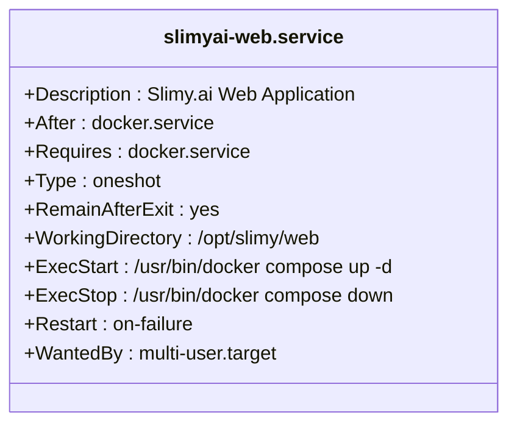
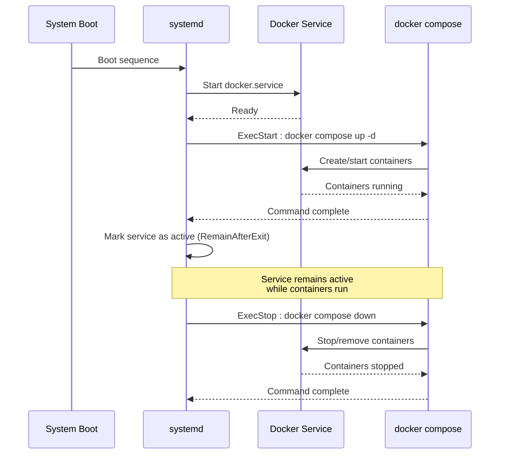
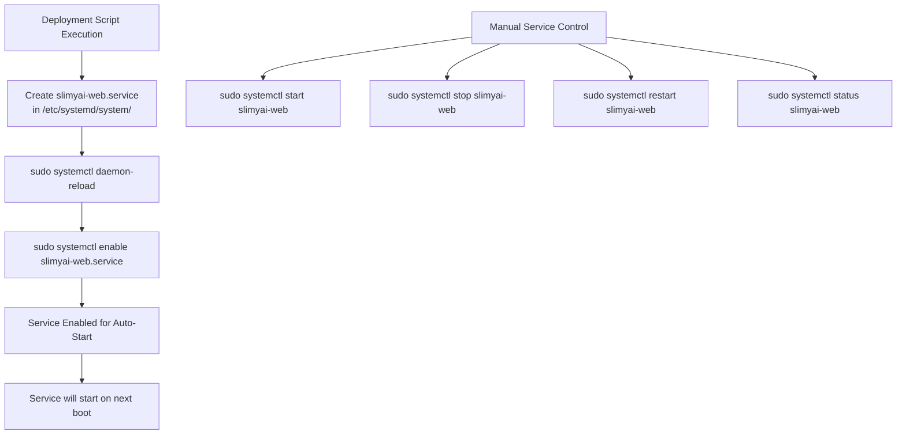
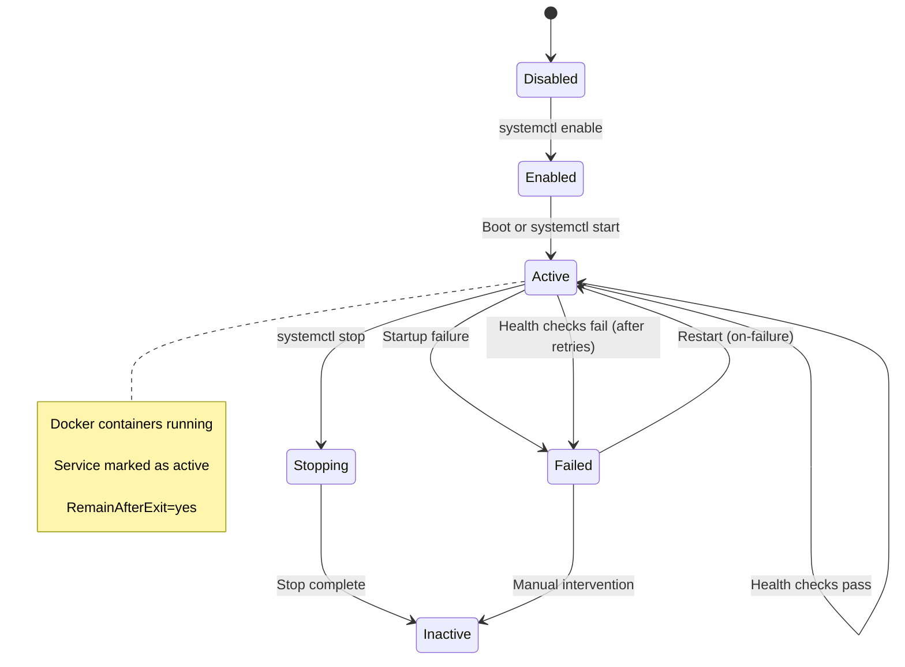
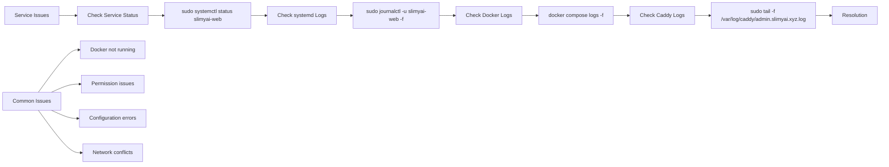
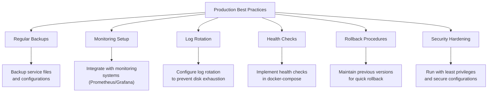

# Systemd Service Management and Auto-Start

<cite>
**Referenced Files in This Document**   
- [deploy-to-server.sh](file://apps/web/deploy-to-server.sh)
- [admin-api/README.md](file://apps/admin-api/README.md)
- [DOCKER_DEPLOYMENT.md](file://DOCKER_DEPLOYMENT.md)
</cite>

## Table of Contents
1. [Introduction](#introduction)
2. [Systemd Service Configuration](#systemd-service-configuration)
3. [Service Unit File Structure](#service-unit-file-structure)
4. [Docker Compose Integration](#docker-compose-integration)
5. [Systemd Commands and Service Management](#systemd-commands-and-service-management)
6. [Service Lifecycle and Failure Handling](#service-lifecycle-and-failure-handling)
7. [Monitoring and Troubleshooting](#monitoring-and-troubleshooting)
8. [Best Practices for Production](#best-practices-for-production)

## Introduction
This document provides comprehensive documentation on the systemd service integration used for process management and auto-start on boot for the slimyai-web application. The deployment system leverages systemd to ensure reliable service management, automatic restarts, and proper system integration. The service is created and configured through a deployment script that sets up the necessary systemd unit file and integrates it with the Docker Compose-based application stack.

**Section sources**
- [deploy-to-server.sh](file://apps/web/deploy-to-server.sh#L1-L231)

## Systemd Service Configuration
The systemd service for the slimyai-web application is automatically created during deployment through the `deploy-to-server.sh` script. This service ensures that the web application starts automatically on system boot and can be managed using standard systemd commands. The service is specifically designed to work with Docker Compose, managing the lifecycle of the containerized application.

The configuration ensures that the web service starts only after the Docker daemon is fully operational, establishing a proper dependency chain that prevents startup failures due to missing dependencies.

**Section sources**
- [deploy-to-server.sh](file://apps/web/deploy-to-server.sh#L180-L203)

## Service Unit File Structure
The slimyai-web.service unit file is created with specific configuration parameters that define its behavior and relationships with other system services:

**Diagram sources**
- [deploy-to-server.sh](file://apps/web/deploy-to-server.sh#L183-L199)

**Section sources**
- [deploy-to-server.sh](file://apps/web/deploy-to-server.sh#L183-L199)

### Key Configuration Parameters
- **After=docker.service**: Specifies that this service should start after the Docker service has been started. This ensures that the container runtime is available before attempting to start the web application containers.

- **Requires=docker.service**: Creates a strong dependency on the Docker service. If Docker fails to start, this service will also fail to start, preventing partial deployments that could lead to application errors.

- **Type=oneshot**: Indicates that the ExecStart and ExecStop commands are expected to run once and exit, rather than remaining running in the background. This is appropriate for Docker Compose commands that orchestrate containers rather than being long-running processes themselves.

- **RemainAfterExit=yes**: Keeps the service marked as active even after the ExecStart command has finished. This is crucial for Docker Compose services where the `up -d` command starts containers in detached mode and then exits, but the service should still be considered "active" as long as the containers are running.

**Section sources**
- [deploy-to-server.sh](file://apps/web/deploy-to-server.sh#L185-L192)

## Docker Compose Integration
The systemd service integrates with Docker Compose through specific ExecStart and ExecStop commands that control the application lifecycle:

**Diagram sources**
- [deploy-to-server.sh](file://apps/web/deploy-to-server.sh#L193-L194)

**Section sources**
- [deploy-to-server.sh](file://apps/web/deploy-to-server.sh#L193-L194)

### ExecStart Command
The `ExecStart=/usr/bin/docker compose up -d` command starts the Docker Compose application in detached mode. This command:
- Reads the docker-compose.yml configuration
- Creates and starts all defined services
- Runs containers in the background (-d flag)
- Returns control to systemd once containers are started

### ExecStop Command
The `ExecStop=/usr/bin/docker compose down` command stops and removes the Docker Compose application. This command:
- Stops all running containers
- Removes containers, networks, and volumes (as defined in compose file)
- Cleans up the application environment
- Returns control to systemd once cleanup is complete

## Systemd Commands and Service Management
The integration of the slimyai-web service into the system startup sequence involves specific systemd commands that ensure proper service registration and enablement:

**Diagram sources**
- [deploy-to-server.sh](file://apps/web/deploy-to-server.sh#L200-L202)

**Section sources**
- [deploy-to-server.sh](file://apps/web/deploy-to-server.sh#L200-L202)

### Key Commands
- **systemctl daemon-reload**: Reloads the systemd manager configuration, making it aware of the newly created or modified service unit file. This command must be run whenever a service file is created or modified.

- **systemctl enable**: Enables the service to start automatically at boot time by creating symbolic links from the system's multi-user target to the service file. This ensures the service is started during the system boot process.

- **systemctl start/stop/restart**: Controls the immediate state of the service without affecting its enabled/disabled status for future boots.

## Service Lifecycle and Failure Handling
The relationship between Docker Compose and systemd involves careful consideration of restart policies and failure handling to ensure application reliability:

**Diagram sources**
- [deploy-to-server.sh](file://apps/web/deploy-to-server.sh#L195)
- [admin-api/README.md](file://apps/admin-api/README.md#L162-L177)

**Section sources**
- [deploy-to-server.sh](file://apps/web/deploy-to-server.sh#L195)
- [admin-api/README.md](file://apps/admin-api/README.md#L162-L177)

### Restart Policies
The service configuration includes `Restart=on-failure`, which means:
- The service will be automatically restarted if it exits with a non-zero exit code
- The service will be restarted if it terminates due to a signal (unless it's a clean shutdown signal)
- The service will not be restarted if it's stopped with systemctl stop

This policy ensures that transient failures are automatically recovered while allowing administrators to intentionally stop the service for maintenance.

### Failure Handling
When failures occur, the system handles them through:
- Immediate restart attempts for transient failures
- Logging of failure details through systemd's journal
- Preservation of container logs for post-mortem analysis
- Dependency awareness (service won't start if Docker is unavailable)

## Monitoring and Troubleshooting
Effective monitoring and troubleshooting of the systemd service is essential for maintaining application reliability and quickly resolving issues:

**Diagram sources**
- [deploy-to-server.sh](file://apps/web/deploy-to-server.sh#L224)
- [admin-api/README.md](file://apps/admin-api/README.md#L162-L177)

**Section sources**
- [deploy-to-server.sh](file://apps/web/deploy-to-server.sh#L224)
- [admin-api/README.md](file://apps/admin-api/README.md#L162-L177)

### Monitoring Commands
- **systemctl status slimyai-web**: Shows the current status of the service, including whether it's active, its process ID, and recent status changes.

- **journalctl -u slimyai-web -f**: Streams the systemd journal entries for the slimyai-web service, providing detailed logs of service startup, shutdown, and any errors.

- **docker compose logs -f**: Shows the logs from the Docker containers managed by the compose file, providing application-level logging.

### Common Issues and Solutions
1. **Service fails to start**: Check if Docker is running with `systemctl status docker`. The slimyai-web service depends on Docker and will fail if Docker is not available.

2. **Permission denied errors**: Ensure the systemd service file has appropriate permissions and that the user running the service has access to Docker.

3. **Configuration errors**: Verify the docker-compose.yml file is correctly formatted and located in the specified WorkingDirectory.

4. **Port conflicts**: Check if the ports specified in the docker-compose file (e.g., 3001) are already in use by other services.

## Best Practices for Production
Implementing best practices for production service management ensures reliability, maintainability, and quick recovery from failures:

**Diagram sources**
- [deploy-to-server.sh](file://apps/web/deploy-to-server.sh#L76)
- [admin-api/README.md](file://apps/admin-api/README.md#L181-L244)

**Section sources**
- [deploy-to-server.sh](file://apps/web/deploy-to-server.sh#L76)
- [admin-api/README.md](file://apps/admin-api/README.md#L181-L244)

### Key Best Practices
- **Regular backups**: The deployment script already implements configuration backups by creating timestamped backups of the Caddyfile before updates.

- **Comprehensive monitoring**: Integrate with monitoring systems to track service health, resource usage, and application performance.

- **Proper logging**: Ensure logs are rotated and archived to prevent disk space issues while maintaining sufficient history for troubleshooting.

- **Health checks**: Implement health checks in the docker-compose configuration to ensure containers are properly initialized before being considered ready.

- **Rollback procedures**: Maintain the ability to quickly revert to previous configurations in case of deployment issues.

- **Security hardening**: Run services with the minimum required privileges and implement security best practices in both the systemd service and Docker configuration.