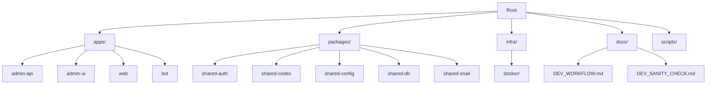
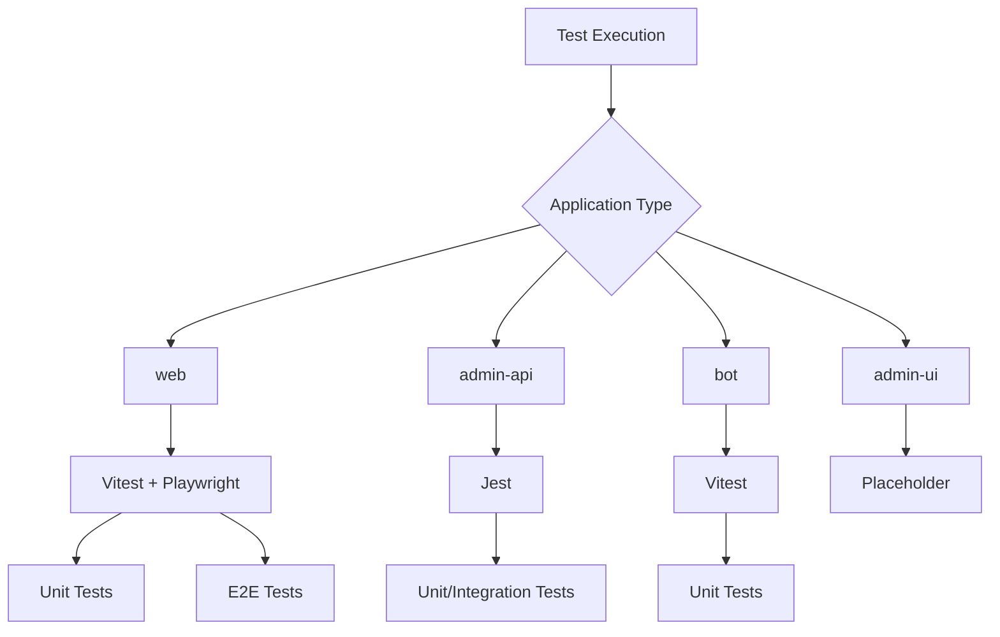
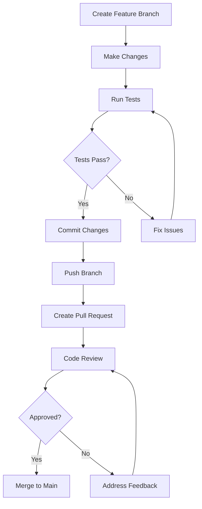

# Developer Onboarding Guide

<cite>
**Referenced Files in This Document**   
- [README.md](file://README.md)
- [package.json](file://package.json)
- [pnpm-workspace.yaml](file://pnpm-workspace.yaml)
- [apps/admin-api/package.json](file://apps/admin-api/package.json)
- [apps/web/package.json](file://apps/web/package.json)
- [apps/admin-ui/package.json](file://apps/admin-ui/package.json)
- [apps/bot/package.json](file://apps/bot/package.json)
- [apps/admin-api/.env.example](file://apps/admin-api/.env.example)
- [apps/web/.env.example](file://apps/web/.env.example)
- [apps/bot/.env.example](file://apps/bot/.env.example)
- [docs/DEV_WORKFLOW.md](file://docs/DEV_WORKFLOW.md)
- [docs/DEV_SANITY_CHECK.md](file://docs/DEV_SANITY_CHECK.md)
- [apps/admin-api/jest.config.js](file://apps/admin-api/jest.config.js)
- [apps/web/vitest.config.ts](file://apps/web/vitest.config.ts)
- [apps/bot/vitest.config.ts](file://apps/bot/vitest.config.ts)
- [apps/admin-api/tests/__mocks__/nanoid.js](file://apps/admin-api/tests/__mocks__/nanoid.js)
- [apps/web/playwright.config.ts](file://apps/web/playwright.config.ts)
- [CONTRIBUTING.md](file://CONTRIBUTING.md)
</cite>

## Table of Contents
1. [Introduction](#introduction)
2. [Project Structure](#project-structure)
3. [Setup Instructions](#setup-instructions)
4. [Essential Commands](#essential-commands)
5. [Testing Workflow](#testing-workflow)
6. [Debugging Tips and Troubleshooting](#debugging-tips-and-troubleshooting)
7. [Making Your First Contribution](#making-your-first-contribution)
8. [Common Setup Issues and Resolutions](#common-setup-issues-and-resolutions)

## Introduction
Welcome to the Slimy Monorepo developer onboarding guide. This document is designed to help new developers get up and running quickly with the Slimy.ai codebase. The monorepo contains multiple applications and shared packages that work together to deliver the Slimy.ai platform. This guide covers everything from initial setup to making your first contribution, including environment configuration, essential commands, testing workflows, and troubleshooting tips.

**Section sources**
- [README.md](file://README.md#L1-L138)
- [docs/DEV_WORKFLOW.md](file://docs/DEV_WORKFLOW.md#L1-L387)

## Project Structure
The Slimy Monorepo follows a monorepo architecture with a clear separation of concerns:

- **`apps/`**: Contains all runnable applications including the main web app, admin API, admin UI, and bot
- **`packages/`**: Houses shared libraries and utilities used across multiple applications
- **`infra/`**: Contains infrastructure and deployment configurations including Docker and monitoring setups
- **`docs/`**: Stores comprehensive documentation on architecture, development workflows, and deployment
- **`scripts/`**: Includes various utility scripts for development and maintenance tasks

Each application in the `apps/` directory is a self-contained project with its own dependencies, configuration, and testing setup. The monorepo uses pnpm workspaces to manage dependencies efficiently across all projects.



**Diagram sources**
- [README.md](file://README.md#L130-L138)
- [package.json](file://package.json#L4-L7)
- [pnpm-workspace.yaml](file://pnpm-workspace.yaml#L1-L3)

**Section sources**
- [README.md](file://README.md#L130-L138)
- [package.json](file://package.json#L4-L7)
- [pnpm-workspace.yaml](file://pnpm-workspace.yaml#L1-L3)

## Setup Instructions
Follow these steps to set up your development environment for the Slimy Monorepo.

### Prerequisites
Before you begin, ensure you have the following installed:
- Node.js (version 20 or higher)
- pnpm (install with `npm install -g pnpm`)
- Git

### Step-by-Step Setup
1. **Clone the repository**
   ```bash
   git clone https://github.com/GurthBro0ks/slimy-monorepo.git
   cd slimy-monorepo
   ```

2. **Install dependencies**
   ```bash
   pnpm install
   ```
   This command installs all dependencies for the entire monorepo workspace, including all apps and packages.

3. **Configure environment variables**
   Each application may require specific environment variables. Copy the example files and customize them:
   ```bash
   # For admin-api
   cp apps/admin-api/.env.example apps/admin-api/.env
   
   # For web app
   cp apps/web/.env.example apps/web/.env
   
   # For bot
   cp apps/bot/.env.example apps/bot/.env
   ```
   
   Edit the `.env` files with your local configuration values, particularly:
   - Database connection details
   - API keys and secrets
   - Service endpoints
   - Authentication credentials

4. **Generate Prisma clients**
   Some applications use Prisma for database access. Generate the required clients:
   ```bash
   pnpm prisma:generate
   ```
   This command generates Prisma clients for both the web and admin-api applications.

5. **Verify your setup**
   Run the development health check to ensure everything is configured correctly:
   ```bash
   pnpm install
   pnpm prisma:generate
   pnpm build
   pnpm test:all
   ```

**Section sources**
- [README.md](file://README.md#L11-L127)
- [docs/DEV_WORKFLOW.md](file://docs/DEV_WORKFLOW.md#L11-L228)
- [apps/admin-api/.env.example](file://apps/admin-api/.env.example#L1-L94)
- [apps/web/.env.example](file://apps/web/.env.example#L1-L13)
- [apps/bot/.env.example](file://apps/bot/.env.example#L1-L6)

## Essential Commands
This section documents the key commands for development, testing, and building in the Slimy Monorepo.

### Development Commands
Start applications in development mode with hot reloading:

```bash
# Start the main web application (http://localhost:3000)
pnpm dev:web

# Start the admin API server (http://localhost:3080)
pnpm dev:admin-api

# Start the admin UI dashboard (http://localhost:3081)
pnpm dev:admin-ui

# Start the bot application
pnpm dev:bot
```

### Testing Commands
Run tests across the codebase:

```bash
# Run all tests across the workspace
pnpm test:all

# Run tests for a specific application
pnpm test:web
pnpm test:admin-api
pnpm test:admin-ui
pnpm test:bot

# Run web app tests with coverage
pnpm --filter web test:coverage

# Run end-to-end tests for the web application
pnpm --filter web test:e2e
```

### Build and Lint Commands
Build applications and check code quality:

```bash
# Build all applications
pnpm build

# Build only core applications (web, admin-api, admin-ui)
pnpm build:core

# Lint all code in the workspace
pnpm lint

# Lint only core applications
pnpm lint:core

# Lint a specific application
pnpm --filter web lint
```

### Database Operations
Prisma-based database commands (primarily for the web app):

```bash
# Generate Prisma client
pnpm prisma:generate

# Run database migrations
cd apps/web
pnpm db:migrate

# Open Prisma Studio for database exploration
pnpm db:studio

# Seed the database with sample data
pnpm db:seed

# Reset the database (warning: deletes data)
pnpm db:reset
```

### Dependency Management
Add dependencies to specific applications or the workspace:

```bash
# Add a dependency to a specific app
pnpm --filter web add package-name
pnpm --filter admin-api add package-name

# Add a dev dependency
pnpm --filter web add -D package-name

# Add a dependency to the workspace root
pnpm add -w package-name
```

**Section sources**
- [README.md](file://README.md#L27-L108)
- [package.json](file://package.json#L9-L25)
- [docs/DEV_WORKFLOW.md](file://docs/DEV_WORKFLOW.md#L49-L382)
- [apps/web/package.json](file://apps/web/package.json#L5-L27)

## Testing Workflow
The Slimy Monorepo employs different testing frameworks across its applications, each configured for optimal development workflow.

### Test Frameworks by Application
- **admin-api**: Uses Jest for unit and integration testing
- **web**: Uses Vitest for unit tests and Playwright for end-to-end testing
- **bot**: Uses Vitest for testing
- **admin-ui**: Currently has placeholder tests

### Running Tests
Execute tests using the workspace-level commands:

```bash
# Run all tests across the monorepo
pnpm test:all

# Run tests for a specific application
pnpm test:web
pnpm test:admin-api
pnpm test:bot
```

### Web Application Testing
The web application has a comprehensive testing setup:

```bash
# Run unit and integration tests with coverage
pnpm --filter web test:coverage

# Run end-to-end tests
pnpm --filter web test:e2e

# Run E2E tests with interactive UI
pnpm --filter web test:e2e:ui
```

The testing configuration includes coverage thresholds to maintain code quality:
- Branches: 60% coverage
- Functions: 60% coverage  
- Lines: 60% coverage
- Statements: 60% coverage

### Admin API Testing
The admin-api uses Jest with the following configuration:
- Test files located in `tests/` and `src/` directories with `.test.js` extension
- Coverage thresholds set at 50% for branches, functions, lines, and statements
- Custom mocking for ESM dependencies like nanoid
- 10-second timeout for individual tests

### Test Organization
- **Unit tests**: Test individual functions and components in isolation
- **Integration tests**: Verify interactions between components and services
- **End-to-end tests**: Simulate user interactions with the complete application
- **Mocking**: External dependencies are mocked to ensure test reliability and speed



**Diagram sources**
- [apps/admin-api/jest.config.js](file://apps/admin-api/jest.config.js#L1-L56)
- [apps/web/vitest.config.ts](file://apps/web/vitest.config.ts#L1-L50)
- [apps/bot/vitest.config.ts](file://apps/bot/vitest.config.ts#L1-L14)
- [apps/web/playwright.config.ts](file://apps/web/playwright.config.ts#L1-L36)

**Section sources**
- [apps/admin-api/jest.config.js](file://apps/admin-api/jest.config.js#L1-L56)
- [apps/web/vitest.config.ts](file://apps/web/vitest.config.ts#L1-L50)
- [apps/bot/vitest.config.ts](file://apps/bot/vitest.config.ts#L1-L14)
- [apps/web/playwright.config.ts](file://apps/web/playwright.config.ts#L1-L36)
- [docs/DEV_WORKFLOW.md](file://docs/DEV_WORKFLOW.md#L119-L168)

## Debugging Tips and Troubleshooting
This section provides guidance on debugging applications and resolving common issues in the Slimy Monorepo.

### Debugging Strategies
1. **Enable debug logging**: Set appropriate log levels in environment variables
2. **Use browser developer tools**: For web and admin-ui applications
3. **Check server logs**: Monitor console output from running services
4. **Utilize Prisma Studio**: For database inspection and debugging
5. **Review test output**: Examine test failures for clues about issues

### Common Issues and Solutions
#### Port Conflicts
If you encounter "port already in use" errors:

```bash
# Find processes using common ports
lsof -i :3000  # Web app
lsof -i :3080  # Admin API
lsof -i :3081  # Admin UI

# Kill the conflicting process
kill -9 <PID>
```

#### Prisma Issues
For problems with Prisma client generation or database connectivity:

```bash
# Regenerate Prisma client
pnpm prisma:generate

# Reset database state (warning: deletes data)
cd apps/web
pnpm db:reset
```

#### Dependency Problems
If you encounter missing modules or version conflicts:

```bash
# Clear all node_modules and reinstall
rm -rf node_modules apps/*/node_modules packages/*/node_modules
pnpm install
```

#### Build Failures
For issues with the build process:

```bash
# Clear Next.js cache
rm -rf apps/web/.next apps/admin-ui/.next

# Rebuild all applications
pnpm build
```

#### Environment Configuration
Ensure your `.env` files are properly configured:
- Verify database connection strings
- Check API endpoint URLs
- Confirm authentication credentials
- Validate port assignments

### Monitoring and Observability
The monorepo includes monitoring capabilities:
- **Sentry integration** in admin-api for error tracking
- **Logging** with structured logging in admin-api
- **Health checks** available for services
- **Metrics collection** for performance monitoring

**Section sources**
- [docs/DEV_WORKFLOW.md](file://docs/DEV_WORKFLOW.md#L280-L324)
- [apps/admin-api/.env.example](file://apps/admin-api/.env.example#L91-L94)
- [apps/admin-api/MONITORING_README.md](file://apps/admin-api/MONITORING_README.md)

## Making Your First Contribution
This section guides you through making your first contribution to the Slimy Monorepo.

### Development Workflow
Follow this standard workflow for contributions:

1. **Create a feature branch** from the main branch
2. **Make your changes** following coding standards
3. **Run tests** to ensure your changes don't break existing functionality
4. **Commit your changes** with clear, descriptive messages
5. **Push your branch** and create a pull request

### Coding Standards
Adhere to the following standards when contributing:

- **Code formatting**: Follow existing code style and patterns
- **Testing**: Add appropriate tests for new functionality
- **Documentation**: Update documentation for significant changes
- **Commit messages**: Use clear, descriptive messages
- **Pull requests**: Include a detailed description of changes

### Pull Request Guidelines
When creating a pull request:
- Reference relevant issues or tickets
- Describe the problem being solved
- Explain your implementation approach
- Note any trade-offs or alternatives considered
- Include screenshots for UI changes
- Verify all tests pass

### Code Review Process
Pull requests will be reviewed for:
- Code quality and maintainability
- Test coverage
- Performance implications
- Security considerations
- Documentation completeness
- Adherence to coding standards



**Diagram sources**
- [CONTRIBUTING.md](file://CONTRIBUTING.md)
- [docs/DEV_WORKFLOW.md](file://docs/DEV_WORKFLOW.md#L230-L244)

**Section sources**
- [CONTRIBUTING.md](file://CONTRIBUTING.md)
- [docs/DEV_WORKFLOW.md](file://docs/DEV_WORKFLOW.md#L230-L244)

## Common Setup Issues and Resolutions
This section addresses frequently encountered setup problems and their solutions.

### Node.js Version Issues
**Problem**: Incompatible Node.js version
**Solution**: Ensure you're using Node.js version 20 or higher
```bash
node --version
# If needed, use nvm to install/switch versions
nvm install 20
nvm use 20
```

### pnpm Installation Problems
**Problem**: pnpm not found or outdated
**Solution**: Install or update pnpm globally
```bash
npm install -g pnpm
pnpm --version
```

### Missing Environment Variables
**Problem**: Application fails to start due to missing configuration
**Solution**: Ensure all required `.env` files are created and properly configured
- Check `apps/admin-api/.env` for database and API settings
- Verify `apps/web/.env` for API URL configuration
- Confirm `apps/bot/.env` has Discord bot token

### Prisma Generation Failures
**Problem**: Prisma client generation fails
**Solution**: 
1. Verify database connection details
2. Ensure Prisma CLI is available
3. Run `pnpm prisma:generate` from the root directory
4. Check for syntax errors in Prisma schema files

### Dependency Installation Errors
**Problem**: pnpm install fails with dependency errors
**Solution**:
```bash
# Clear pnpm store and reinstall
pnpm store prune
rm -rf node_modules
pnpm install

# Or try with fresh pnpm version
npm install -g pnpm@latest
pnpm install
```

### Port Conflicts with Other Services
**Problem**: Ports 3000, 3080, or 3081 already in use
**Solution**:
1. Identify the conflicting process using `lsof -i :<port>`
2. Either stop the conflicting service or modify the application port in `.env` files
3. For admin-api, change the PORT value in `apps/admin-api/.env`

### Database Connection Issues
**Problem**: Unable to connect to database
**Solution**:
1. Verify database is running
2. Check database URL format and credentials
3. Ensure network connectivity to database server
4. Validate database permissions for the configured user

### Build Cache Problems
**Problem**: Build issues persist after code changes
**Solution**: Clear build caches
```bash
# Clear Next.js build cache
rm -rf apps/web/.next

# Clear pnpm cache
pnpm store prune

# Rebuild the application
pnpm build
```

**Section sources**
- [docs/DEV_WORKFLOW.md](file://docs/DEV_WORKFLOW.md#L280-L324)
- [apps/admin-api/.env.example](file://apps/admin-api/.env.example#L1-L94)
- [apps/web/.env.example](file://apps/web/.env.example#L1-L13)