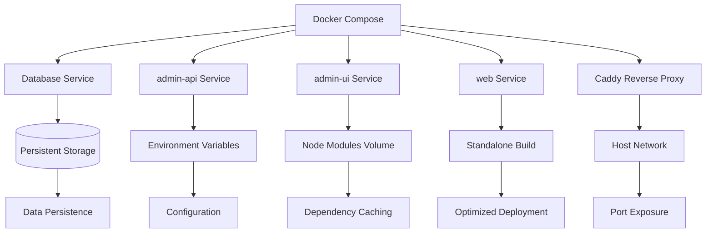
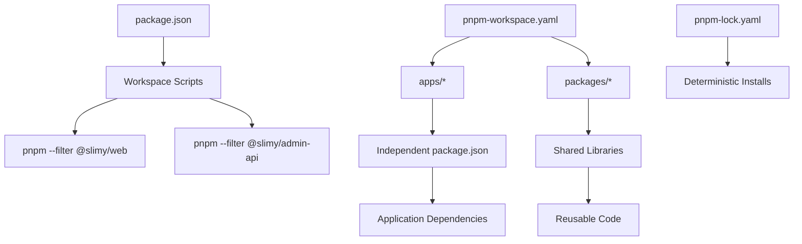
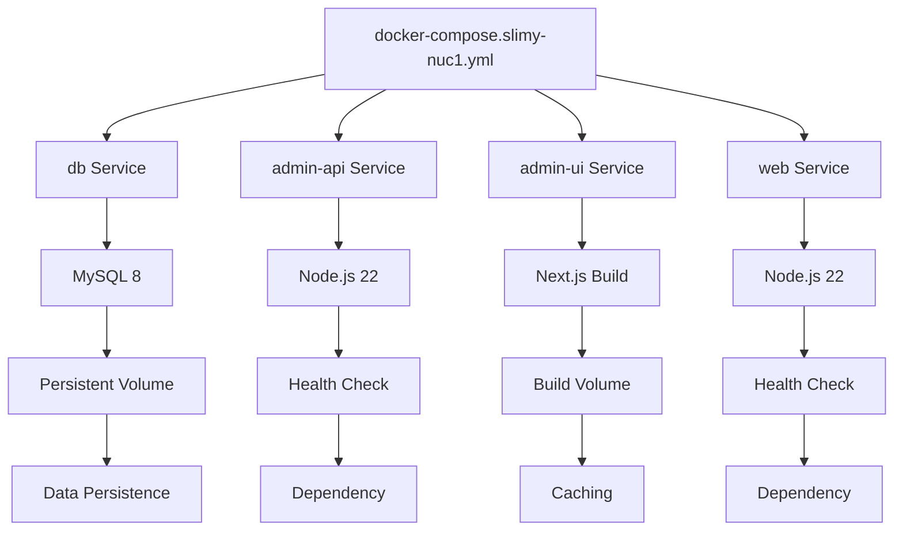

# Directory Structure Breakdown

<cite>
**Referenced Files in This Document**   
- [package.json](file://package.json)
- [pnpm-workspace.yaml](file://pnpm-workspace.yaml)
- [apps/admin-api/server.js](file://apps/admin-api/server.js)
- [apps/admin-api/src/app.js](file://apps/admin-api/src/app.js)
- [apps/admin-ui/pages/_app.js](file://apps/admin-ui/pages/_app.js)
- [apps/bot/src/index.ts](file://apps/bot/src/index.ts)
- [apps/web/next.config.js](file://apps/web/next.config.js)
- [apps/admin-api/Dockerfile](file://apps/admin-api/Dockerfile)
- [apps/web/Dockerfile](file://apps/web/Dockerfile)
- [infra/docker/docker-compose.slimy-nuc1.yml](file://infra/docker/docker-compose.slimy-nuc1.yml)
- [infra/docker/docker-compose.slimy-nuc2.yml](file://infra/docker/docker-compose.slimy-nuc2.yml)
</cite>

## Table of Contents
1. [Introduction](#introduction)
2. [Top-Level Directory Overview](#top-level-directory-overview)
3. [Application Services in apps/](#application-services-in-apps)
4. [Shared Code in packages/](#shared-code-in-packages)
5. [Infrastructure Configuration in infra/docker/](#infrastructure-configuration-in-infradocker)
6. [Utility Scripts in scripts/](#utility-scripts-in-scripts)
7. [Monorepo Dependency Management](#monorepo-dependency-management)
8. [Service Entry Points and Architecture](#service-entry-points-and-architecture)
9. [Container Orchestration with Docker Compose](#container-orchestration-with-docker-compose)
10. [Developer Navigation Guide](#developer-navigation-guide)

## Introduction
The Slimy Monorepo is a comprehensive monorepository structure designed to manage multiple interrelated services and applications within a unified codebase. This documentation provides a detailed breakdown of the directory structure, explaining the purpose and organization of each top-level directory and their internal components. The architecture follows modern monorepo patterns with clear separation of concerns between applications, shared libraries, infrastructure, and utility scripts. This structure enables efficient development, testing, and deployment of the various services that comprise the Slimy ecosystem.

## Top-Level Directory Overview
The Slimy Monorepo is organized into four primary top-level directories—apps/, packages/, infra/docker/, and scripts/—alongside root-level configuration files that coordinate the entire system. This structure follows the monorepo pattern, which consolidates multiple projects within a single repository while maintaining clear boundaries between components. The organization enables shared tooling, consistent dependency management, and coordinated deployments across services. Each top-level directory serves a distinct purpose: apps/ contains all independent applications and services, packages/ houses shared code libraries, infra/docker/ manages infrastructure-as-code configurations, and scripts/ stores utility scripts for development and operations tasks.

**Section sources**
- [package.json](file://package.json#L4-L7)
- [pnpm-workspace.yaml](file://pnpm-workspace.yaml#L1-L3)

## Application Services in apps/
The apps/ directory contains all independent applications and services within the monorepo, each representing a distinct deployable unit with its own technology stack, dependencies, and entry points. This directory follows the "applications" pattern common in monorepos, where each subdirectory represents a complete application with its own package.json, source code, tests, and configuration. The current structure includes four main applications: admin-api (Express.js backend), admin-ui (React frontend), bot (Discord bot), and web (Next.js application). Each application is designed to be independently deployable while sharing common tooling and dependencies through the monorepo structure.

### admin-api with Express.js Architecture
The admin-api application is a Node.js backend service built with Express.js, serving as the primary API for administrative functions. It follows a conventional Express.js architecture with middleware, routes, services, and utilities organized in a structured directory layout. The entry point is server.js, which initializes the application, loads environment variables, configures the database connection, and starts the HTTP server. The core application logic is defined in src/app.js, which sets up middleware for security (helmet), logging (morgan), CORS, and error handling. Routes are organized in the src/routes/ directory, with corresponding business logic in src/services/. The application uses Prisma for database access, with migrations stored in the prisma/migrations/ directory. Testing is implemented with Jest, and monitoring is configured through various dashboards and metrics collection.

**Section sources**
- [apps/admin-api/server.js](file://apps/admin-api/server.js#L31-L74)
- [apps/admin-api/src/app.js](file://apps/admin-api/src/app.js#L1-L64)
- [apps/admin-api/package.json](file://apps/admin-api/package.json#L7-L15)

### admin-ui with React Components
The admin-ui application is a React-based frontend interface built with Next.js, providing a user interface for administrative tasks. It follows the Pages Router pattern of Next.js with pages organized in the pages/ directory and shared components in the components/ directory. The application uses React context for state management, with a SessionProvider wrapping the entire application in pages/_app.js to provide authentication context to all pages. Styling is managed through CSS modules and global stylesheets in the styles/ directory. The application consumes the admin-api backend through API routes defined in pages/api/ and direct HTTP requests from components. It uses SWR for data fetching and caching, and Socket.IO for real-time updates. The build process is managed by Next.js, with configuration in next.config.js.

**Section sources**
- [apps/admin-ui/pages/_app.js](file://apps/admin-ui/pages/_app.js#L1-L11)
- [apps/admin-ui/package.json](file://apps/admin-ui/package.json#L5-L8)
- [apps/admin-ui/pages/api/](file://apps/admin-ui/pages/api/)

### bot with discord.js Commands
The bot application is a Discord bot implementation built with discord.js, designed to provide interactive functionality within Discord servers. The architecture follows a modular command pattern with commands organized in the src/commands/ directory. The entry point is src/index.ts, which initializes the bot client and registers command handlers. The application is configured as an ES module (type: "module" in package.json) and uses TypeScript for type safety. Utility functions for parsing and statistics are organized in src/utils/, while error handling and logging utilities are in src/lib/. Testing is implemented with Vitest, and the development workflow uses tsx for TypeScript execution. The bot is designed to be extensible, with a clear separation between command logic, utility functions, and core bot initialization.

**Section sources**
- [apps/bot/src/index.ts](file://apps/bot/src/index.ts#L17-L64)
- [apps/bot/package.json](file://apps/bot/package.json#L5-L12)
- [apps/bot/src/commands/](file://apps/bot/src/commands/)

### web with Next.js app Directory
The web application is a Next.js 14+ application using the App Router pattern, serving as the primary public-facing web interface. It leverages the app/ directory structure introduced in Next.js 13, with route handlers defined as route.ts files within the app/api/ directory. The application uses React Server Components and supports both server-side rendering and static generation. Key features include MDX support for content pages, Tailwind CSS for styling, and Turbopack for development. The build process generates standalone output in .next/standalone/, enabling efficient containerization. The application integrates with multiple external services through API routes and client-side data fetching. Configuration is managed through next.config.js and environment variables, with deployment optimized for standalone Node.js execution.

**Section sources**
- [apps/web/next.config.js](file://apps/web/next.config.js#L1-L7)
- [apps/web/package.json](file://apps/web/package.json#L5-L28)
- [apps/web/app/](file://apps/web/app/)

## Shared Code in packages/
The packages/ directory contains shared code libraries that can be consumed by multiple applications within the monorepo. This approach follows the "shared libraries" pattern in monorepos, promoting code reuse and consistency across services while avoiding duplication. Each package in this directory is a standalone npm package with its own package.json, allowing for independent versioning and dependency management. The current structure includes several shared packages: shared-auth for authentication utilities, shared-codes for code-related functionality, shared-config for configuration management, shared-db for database utilities, and shared-snail for snail-related features. These packages are referenced by applications using package aliases (e.g., @slimy/shared-auth) and are automatically linked by the package manager within the monorepo.

**Section sources**
- [packages/shared-auth/package.json](file://packages/shared-auth/package.json)
- [packages/shared-codes/package.json](file://packages/shared-codes/package.json)
- [packages/shared-config/package.json](file://packages/shared-config/package.json)
- [pnpm-workspace.yaml](file://pnpm-workspace.yaml#L1-L3)

## Infrastructure Configuration in infra/docker/
The infra/docker/ directory contains Docker Compose configuration files that define the infrastructure and orchestration for the entire system. These files implement infrastructure-as-code principles, enabling consistent and reproducible deployments across different environments. The directory contains environment-specific Docker Compose files: docker-compose.slimy-nuc1.yml for the NUC1 environment and docker-compose.slimy-nuc2.yml for the NUC2 environment. These configurations define services for the database (MySQL or PostgreSQL), backend APIs, frontend applications, reverse proxies (Caddy), and supporting utilities. Each service is configured with appropriate environment variables, volume mounts, health checks, and network settings. The infrastructure configuration also includes startup scripts and fixes for specific deployment issues, ensuring reliable operation in production environments.

**Diagram sources**
- [infra/docker/docker-compose.slimy-nuc1.yml](file://infra/docker/docker-compose.slimy-nuc1.yml)
- [infra/docker/docker-compose.slimy-nuc2.yml](file://infra/docker/docker-compose.slimy-nuc2.yml)

**Section sources**
- [infra/docker/docker-compose.slimy-nuc1.yml](file://infra/docker/docker-compose.slimy-nuc1.yml)
- [infra/docker/docker-compose.slimy-nuc2.yml](file://infra/docker/docker-compose.slimy-nuc2.yml)

## Utility Scripts in scripts/
The scripts/ directory contains utility scripts that support development, testing, and operations tasks across the monorepo. These scripts provide automation for common workflows, ensuring consistency and efficiency in development practices. The current structure includes apply-club-schema.sh, a shell script for applying database schema changes. Additional scripts are located within individual applications, such as test runners, build validators, and data importers. These utilities follow the principle of "convention over configuration," providing standardized tools for tasks like bundle size checking, documentation importing, and post-build validation. The scripts are designed to be invoked through npm scripts defined in package.json files, enabling easy access and integration with development workflows.

**Section sources**
- [scripts/apply-club-schema.sh](file://scripts/apply-club-schema.sh)
- [apps/web/scripts/](file://apps/web/scripts/)

## Monorepo Dependency Management
The Slimy Monorepo uses pnpm workspaces for dependency management, enabling efficient sharing of packages and dependencies across multiple applications and libraries. The pnpm-workspace.yaml file at the root defines the workspace configuration, including the packages to include (apps/* and packages/*) and specific build dependencies that require approval. This approach provides several advantages over traditional npm or yarn workspaces: faster installation through hard linking, deterministic installations with pnpm-lock.yaml, and efficient disk usage. The package.json at the root level defines workspace-wide scripts that can target specific applications using the --filter flag (e.g., pnpm --filter @slimy/web run dev). This dependency management strategy ensures consistent versions across the monorepo while allowing applications to have their own specific dependencies as needed.

**Diagram sources**
- [package.json](file://package.json#L4-L7)
- [pnpm-workspace.yaml](file://pnpm-workspace.yaml#L1-L3)
- [pnpm-lock.yaml](file://pnpm-lock.yaml)

**Section sources**
- [package.json](file://package.json#L4-L7)
- [pnpm-workspace.yaml](file://pnpm-workspace.yaml#L1-L3)
- [pnpm-lock.yaml](file://pnpm-lock.yaml)

## Service Entry Points and Architecture
Each service in the Slimy Monorepo has a clearly defined entry point that orchestrates the application lifecycle and initializes its components. The architecture follows consistent patterns across services while accommodating the specific requirements of each technology stack. For the admin-api service, the entry point is server.js, which loads environment variables, configures the database connection, and starts the Express.js application defined in src/app.js. The admin-ui service uses Next.js conventions with pages/_app.js as the root component that wraps all pages with the SessionProvider context. The bot service has src/index.ts as its entry point, which initializes the Discord client and registers command handlers. The web service follows Next.js 14+ patterns with the app directory structure and API routes defined as route.ts files. Each entry point handles configuration, dependency initialization, and error handling appropriate to its service type.

**Section sources**
- [apps/admin-api/server.js](file://apps/admin-api/server.js#L31-L74)
- [apps/admin-api/src/app.js](file://apps/admin-api/src/app.js#L1-L64)
- [apps/admin-ui/pages/_app.js](file://apps/admin-ui/pages/_app.js#L1-L11)
- [apps/bot/src/index.ts](file://apps/bot/src/index.ts#L17-L64)

## Container Orchestration with Docker Compose
The Slimy Monorepo uses Docker Compose for container orchestration, with configuration files in the infra/docker/ directory defining multi-container applications for different deployment environments. The docker-compose.slimy-nuc1.yml and docker-compose.slimy-nuc2.yml files define services for database, API, UI, and web applications, along with supporting infrastructure like reverse proxies and monitoring tools. Each service is configured with appropriate build contexts, environment variables, volume mounts, and health checks to ensure reliable operation. The configurations implement best practices for production deployments, including persistent storage for databases, dependency caching for Node.js applications, and proper networking between services. Health checks ensure that services are fully operational before dependent services start, preventing race conditions during startup. The use of environment-specific compose files allows for tailored configurations while maintaining a consistent overall architecture.

**Diagram sources**
- [infra/docker/docker-compose.slimy-nuc1.yml](file://infra/docker/docker-compose.slimy-nuc1.yml)
- [infra/docker/docker-compose.slimy-nuc2.yml](file://infra/docker/docker-compose.slimy-nuc2.yml)

**Section sources**
- [infra/docker/docker-compose.slimy-nuc1.yml](file://infra/docker/docker-compose.slimy-nuc1.yml)
- [infra/docker/docker-compose.slimy-nuc2.yml](file://infra/docker/docker-compose.slimy-nuc2.yml)

## Developer Navigation Guide
For developers new to the Slimy Monorepo, navigation begins with understanding the top-level directory structure and the purpose of each component. The apps/ directory contains all applications, with each application having its own package.json and development scripts. Developers can start individual applications using the workspace scripts defined in the root package.json (e.g., pnpm dev:web for the web application). The packages/ directory contains shared libraries that can be imported by any application using their package names (e.g., @slimy/shared-auth). Infrastructure configuration is managed in infra/docker/, with environment-specific compose files for different deployment targets. Utility scripts in scripts/ and application-specific scripts in each app's package.json provide automation for common tasks. The pnpm workspace configuration ensures that dependencies are managed efficiently across the monorepo, with shared dependencies linked rather than duplicated.

**Section sources**
- [package.json](file://package.json#L9-L25)
- [pnpm-workspace.yaml](file://pnpm-workspace.yaml#L1-L3)
- [apps/](file://apps/)
- [packages/](file://packages/)
- [infra/docker/](file://infra/docker/)
- [scripts/](file://scripts/)