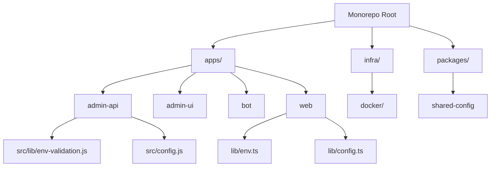
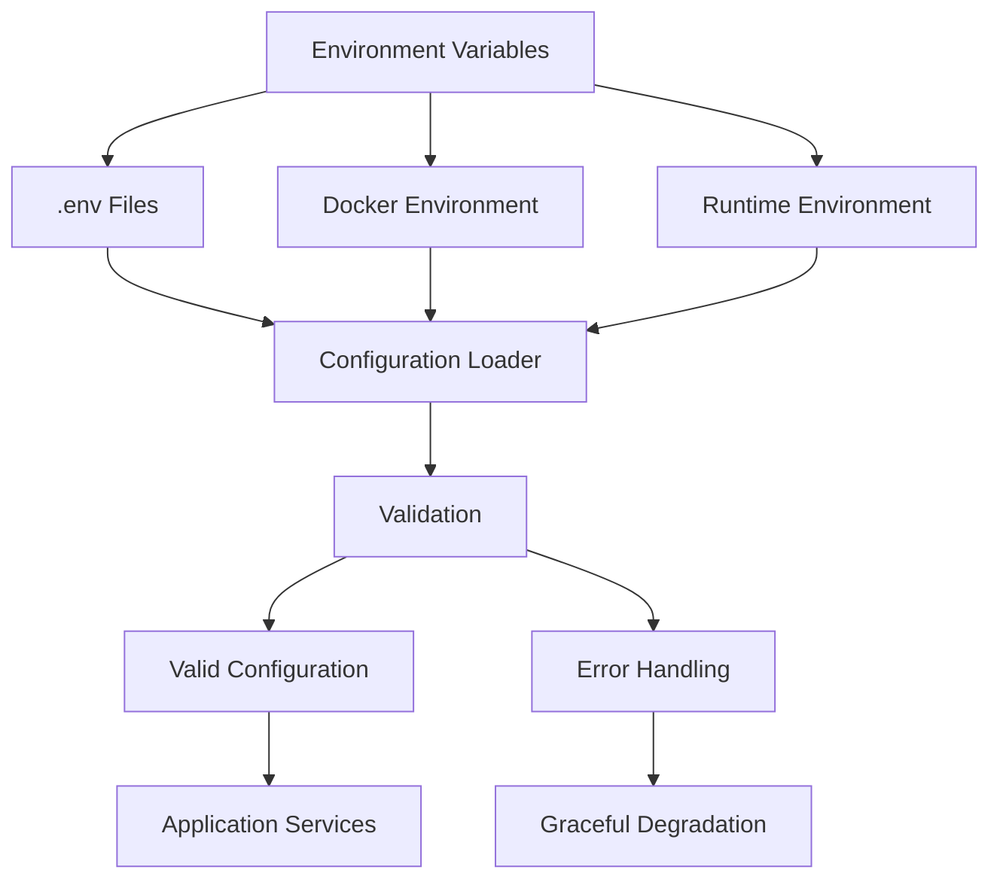
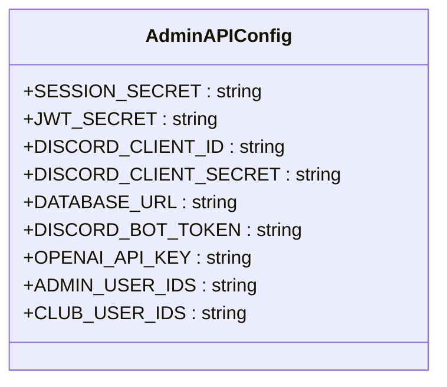
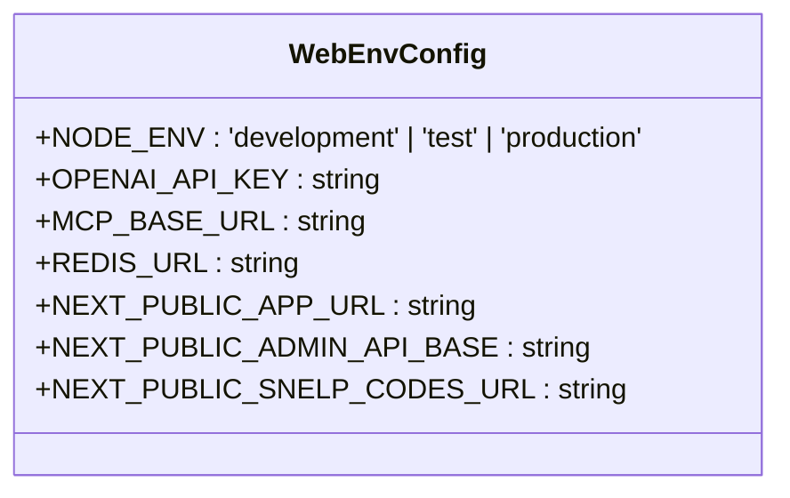
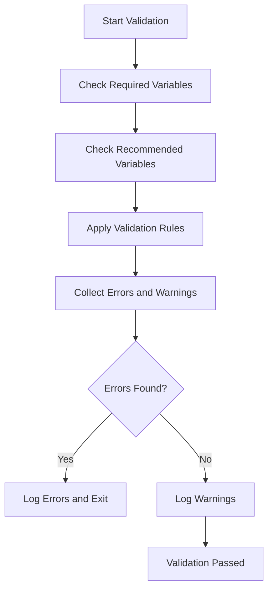
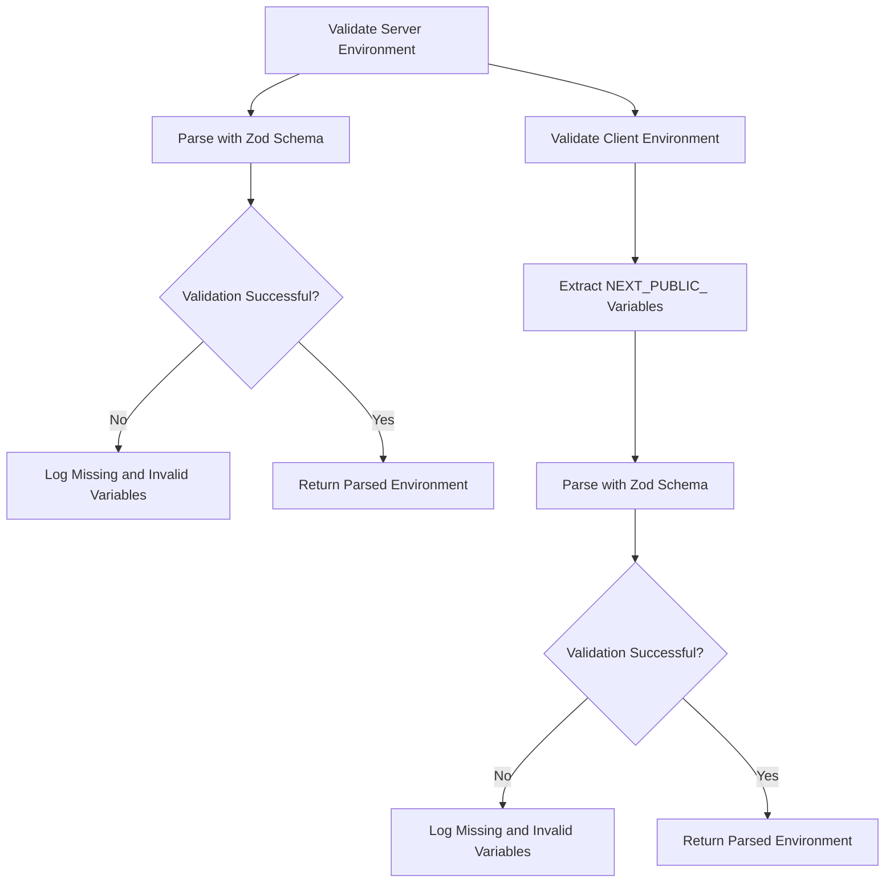
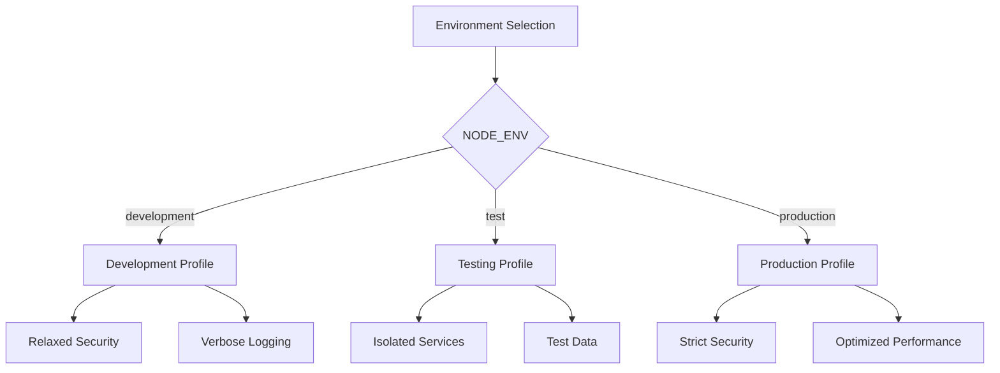
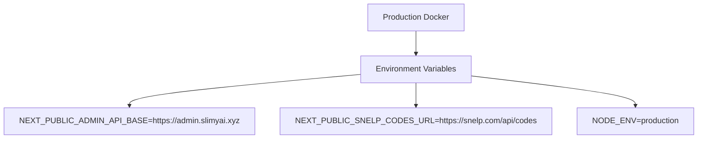
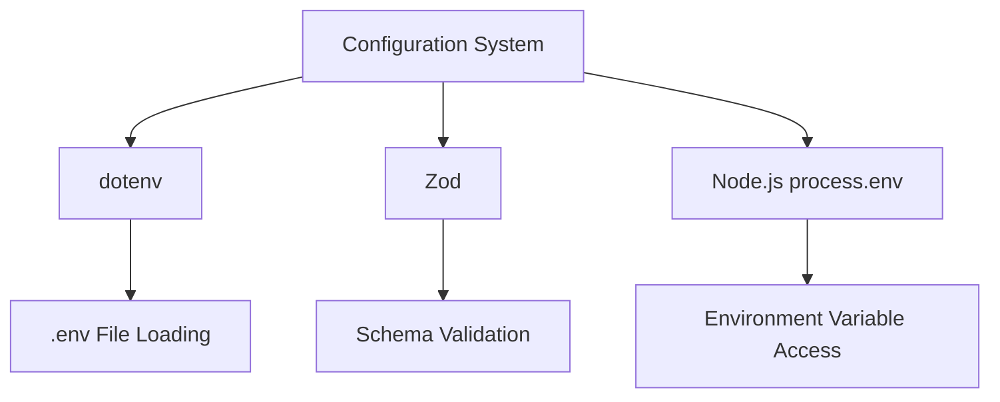

# Environment Configuration

<cite>
**Referenced Files in This Document**   
- [env-validation.js](file://apps/admin-api/src/lib/env-validation.js)
- [config.js](file://apps/admin-api/src/config.js)
- [env.ts](file://apps/web/lib/env.ts)
- [config.ts](file://apps/web/lib/config.ts)
- [server.js](file://apps/admin-api/server.js)
- [Dockerfile](file://apps/admin-api/Dockerfile)
- [docker-compose.production.yml](file://apps/web/docker-compose.production.yml)
- [docker-compose.test.yml](file://apps/web/docker-compose.test.yml)
- [deploy-to-server.sh](file://apps/web/deploy-to-server.sh)
- [next.config.ts](file://apps/web/next.config.ts)
</cite>

## Table of Contents
1. [Introduction](#introduction)
2. [Project Structure](#project-structure)
3. [Core Components](#core-components)
4. [Architecture Overview](#architecture-overview)
5. [Detailed Component Analysis](#detailed-component-analysis)
6. [Dependency Analysis](#dependency-analysis)
7. [Performance Considerations](#performance-considerations)
8. [Troubleshooting Guide](#troubleshooting-guide)
9. [Conclusion](#conclusion)

## Introduction
The Slimy Monorepo employs a comprehensive environment configuration system that manages settings across multiple services including admin-api, web, admin-ui, and bot applications. The configuration system is designed to handle different deployment environments (development, testing, production) while ensuring security and consistency. This document details the environment variable management, configuration validation, and runtime loading mechanisms used throughout the monorepo.

## Project Structure
The Slimy Monorepo follows a monorepo architecture with multiple applications under the `apps/` directory, each with its own configuration needs. The core configuration files are distributed across services, with shared configuration principles but service-specific implementations. The monorepo uses Docker for containerization and deployment, with different compose files for various environments.

**Diagram sources**
- [env-validation.js](file://apps/admin-api/src/lib/env-validation.js)
- [config.js](file://apps/admin-api/src/config.js)
- [env.ts](file://apps/web/lib/env.ts)
- [config.ts](file://apps/web/lib/config.ts)

**Section sources**
- [env-validation.js](file://apps/admin-api/src/lib/env-validation.js)
- [config.js](file://apps/admin-api/src/config.js)
- [env.ts](file://apps/web/lib/env.ts)
- [config.ts](file://apps/web/lib/config.ts)

## Core Components
The environment configuration system in the Slimy Monorepo consists of several core components that work together to manage settings across services. The system includes environment variable validation, configuration loading at runtime, and secure handling of secrets. Each service has its own configuration approach, with the admin-api using JavaScript-based validation and the web application using TypeScript with Zod for schema validation.

**Section sources**
- [env-validation.js](file://apps/admin-api/src/lib/env-validation.js)
- [env.ts](file://apps/web/lib/env.ts)

## Architecture Overview
The configuration architecture follows a layered approach where environment variables are loaded from .env files and validated at application startup. The system supports multiple configuration profiles for different environments and provides mechanisms for secure secret management. Configuration values are validated against defined rules, and appropriate error handling is implemented for missing or invalid values.

**Diagram sources**
- [server.js](file://apps/admin-api/server.js)
- [env-validation.js](file://apps/admin-api/src/lib/env-validation.js)
- [env.ts](file://apps/web/lib/env.ts)

## Detailed Component Analysis

### Environment Variable System
The Slimy Monorepo uses environment variables as the primary mechanism for configuration across all services. Each service defines its required and optional variables, with validation rules to ensure correctness. The system distinguishes between server-side and client-side environment variables, with special handling for variables prefixed with NEXT_PUBLIC_ in the web application.

#### Admin API Environment Variables
The admin-api service defines a comprehensive set of environment variables for database connections, authentication, and service coordination. Required variables include SESSION_SECRET, JWT_SECRET, DISCORD_CLIENT_ID, DISCORD_CLIENT_SECRET, and DATABASE_URL. The service also defines recommended variables such as DISCORD_BOT_TOKEN, OPENAI_API_KEY, ADMIN_USER_IDS, and CLUB_USER_IDS.

**Diagram sources**
- [env-validation.js](file://apps/admin-api/src/lib/env-validation.js)

#### Web Application Environment Variables
The web application uses Zod for environment variable validation, providing type-safe access to configuration values. The system separates server-side and client-side variables, with NEXT_PUBLIC_ prefixed variables exposed to the client. Server-side variables include OPENAI_API_KEY, MCP_BASE_URL, REDIS_URL, and others, while client-side variables include NEXT_PUBLIC_APP_URL, NEXT_PUBLIC_ADMIN_API_BASE, and NEXT_PUBLIC_SNELP_CODES_URL.

**Diagram sources**
- [env.ts](file://apps/web/lib/env.ts)

### Configuration Validation Process
The configuration validation process ensures that all required environment variables are present and valid before the application starts. Each service implements its own validation mechanism, with detailed error reporting for missing or invalid values.

#### Admin API Validation
The admin-api service implements a robust validation process through the env-validation.js file. The validation checks required variables, recommended variables, and applies specific validation rules to ensure values meet requirements. For example, SESSION_SECRET and JWT_SECRET must be at least 32 characters long, DATABASE_URL must be a valid PostgreSQL connection string, and PORT must be a valid port number.

**Diagram sources**
- [env-validation.js](file://apps/admin-api/src/lib/env-validation.js)

#### Web Application Validation
The web application uses Zod schemas to validate environment variables, providing type safety and comprehensive error reporting. The validation process separates server-side and client-side variables, with different schemas for each. The system provides helpful error messages that identify missing or invalid variables, making it easier to troubleshoot configuration issues.

**Diagram sources**
- [env.ts](file://apps/web/lib/env.ts)

### Configuration Profiles
The Slimy Monorepo supports different configuration profiles for development, testing, and production environments. Each environment has specific settings that optimize performance, security, and functionality for its intended use case.

#### Development Profile
The development profile is configured for ease of use and debugging. It includes relaxed security settings, detailed logging, and access to development tools. The NODE_ENV variable is set to 'development', enabling features like source maps and verbose error messages.

#### Testing Profile
The testing profile is designed for automated testing and CI/CD pipelines. It uses isolated databases and services to prevent interference with development and production data. The NODE_ENV variable is set to 'test', which disables certain features and enables test-specific configurations.

#### Production Profile
The production profile prioritizes security, performance, and reliability. It includes strict security headers, optimized caching, and monitoring configurations. The NODE_ENV variable is set to 'production', enabling optimizations and disabling development features.

**Diagram sources**
- [env.ts](file://apps/web/lib/env.ts)
- [env-validation.js](file://apps/admin-api/src/lib/env-validation.js)

### .env File Usage
The Slimy Monorepo uses .env files for local development configuration, with specific files for different services. The admin-api service uses a .env.admin file as its primary configuration source, with fallback to a default .env file for shared values. The system allows specifying an explicit environment file path through the ADMIN_ENV_FILE or ENV_FILE environment variables.

The loading order for environment files in the admin-api service is:
1. Explicit environment file (if specified via ADMIN_ENV_FILE or ENV_FILE)
2. .env.admin file in the application directory
3. Default .env file in the monorepo root

This hierarchical approach allows for flexible configuration management, with service-specific settings taking precedence over shared settings.

**Section sources**
- [server.js](file://apps/admin-api/server.js)

### Runtime Configuration Loading
Configuration values are loaded at runtime during application startup. The admin-api service loads environment variables in the server.js file before initializing the application. The web application validates environment variables when the env.ts module is imported, ensuring configuration is available throughout the application lifecycle.

The runtime loading process includes:
1. Loading environment variables from .env files
2. Validating required variables
3. Applying default values for optional variables
4. Transforming values as needed (e.g., parsing strings to numbers)
5. Making configuration available to the application

This approach ensures that configuration is validated and available before the application begins processing requests.

**Section sources**
- [server.js](file://apps/admin-api/server.js)
- [env.ts](file://apps/web/lib/env.ts)

### Secure Secret Management
The Slimy Monorepo implements several practices for secure secret management:
- Secrets are never stored in version control
- Environment variables are used to inject secrets at runtime
- Required secrets are validated at startup
- Sensitive values are masked in logs and error messages
- Production deployments use Docker secrets or external secret management systems

The system avoids hardcoding secrets in configuration files and instead relies on environment variables that can be securely managed by deployment platforms.

**Section sources**
- [env-validation.js](file://apps/admin-api/src/lib/env-validation.js)
- [env.ts](file://apps/web/lib/env.ts)

### Configuration Examples
The monorepo includes several configuration examples for different deployment scenarios:

#### Production Docker Deployment
The docker-compose.production.yml file configures the web application for production deployment with environment variables for the admin API base URL, SNELP codes URL, and production mode.

**Diagram sources**
- [docker-compose.production.yml](file://apps/web/docker-compose.production.yml)

#### Testing Environment
The docker-compose.test.yml file configures services for testing with environment variables loaded from the host environment or defaults. It includes configuration for both the admin-api and web services, with health checks and isolated volumes.

**Section sources**
- [docker-compose.test.yml](file://apps/web/docker-compose.test.yml)

#### Server Deployment Script
The deploy-to-server.sh script automates deployment by configuring environment variables in the docker-compose.yml file and setting up the Caddy reverse proxy. It includes environment variables for the admin API base URL and SNELP codes URL.

**Section sources**
- [deploy-to-server.sh](file://apps/web/deploy-to-server.sh)

## Dependency Analysis
The configuration system has dependencies on several external packages for environment variable management and validation. The admin-api service depends on dotenv for loading .env files, while the web application uses Zod for schema validation. Both services rely on Node.js environment variable access through process.env.

**Diagram sources**
- [server.js](file://apps/admin-api/server.js)
- [env.ts](file://apps/web/lib/env.ts)

## Performance Considerations
The configuration system is designed to have minimal impact on application performance. Environment variable loading and validation occur during application startup, not during request processing. The use of synchronous file operations for .env loading is acceptable since it happens only once at startup. The validation process is optimized to check only required variables and apply rules efficiently.

## Troubleshooting Guide
When encountering configuration issues, follow these steps:
1. Verify that required environment variables are set
2. Check the application logs for validation error messages
3. Ensure .env files are in the correct location and properly formatted
4. Validate that environment variable names match expected values
5. Check for typos or incorrect data types in configuration values

Common issues include missing required variables, invalid database URLs, and incorrect secret lengths. The validation system provides specific error messages to help identify and resolve these issues.

**Section sources**
- [env-validation.js](file://apps/admin-api/src/lib/env-validation.js)
- [env.ts](file://apps/web/lib/env.ts)

## Conclusion
The Slimy Monorepo's environment configuration system provides a robust and secure way to manage settings across multiple services and deployment environments. By using environment variables, validation, and hierarchical configuration loading, the system ensures consistency and reliability while allowing flexibility for different deployment scenarios. The separation of concerns between configuration loading, validation, and application usage creates a maintainable and scalable architecture for managing application settings.