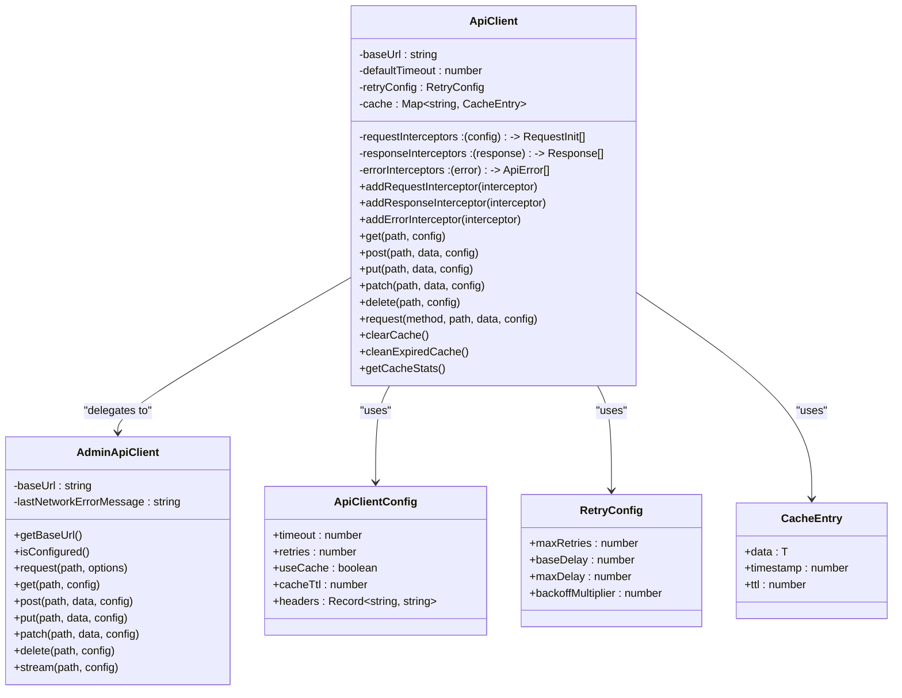
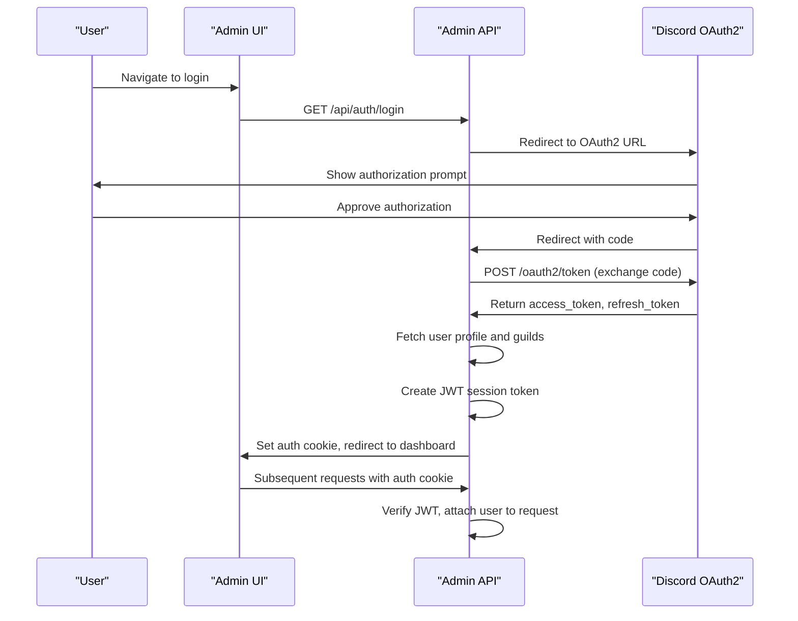
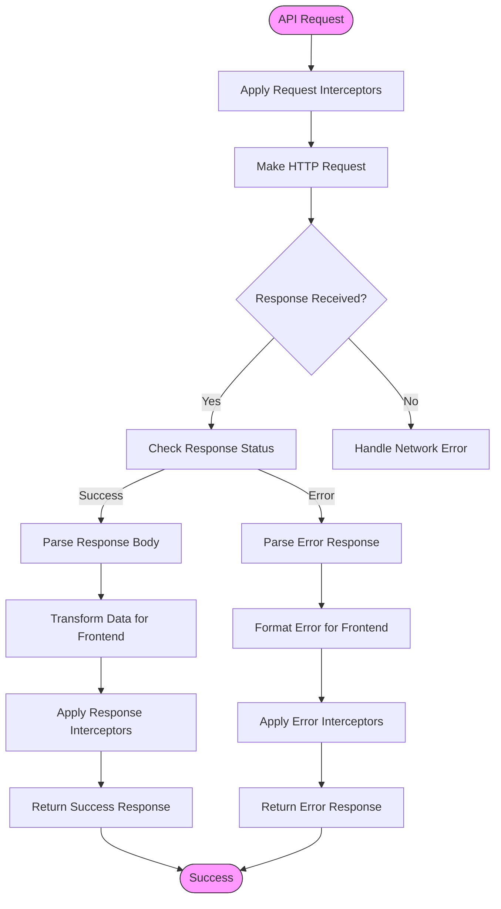
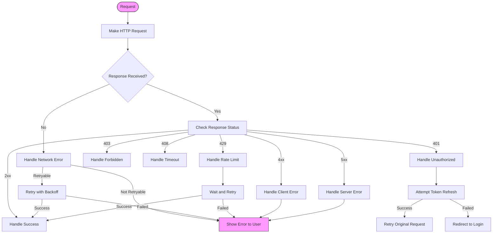
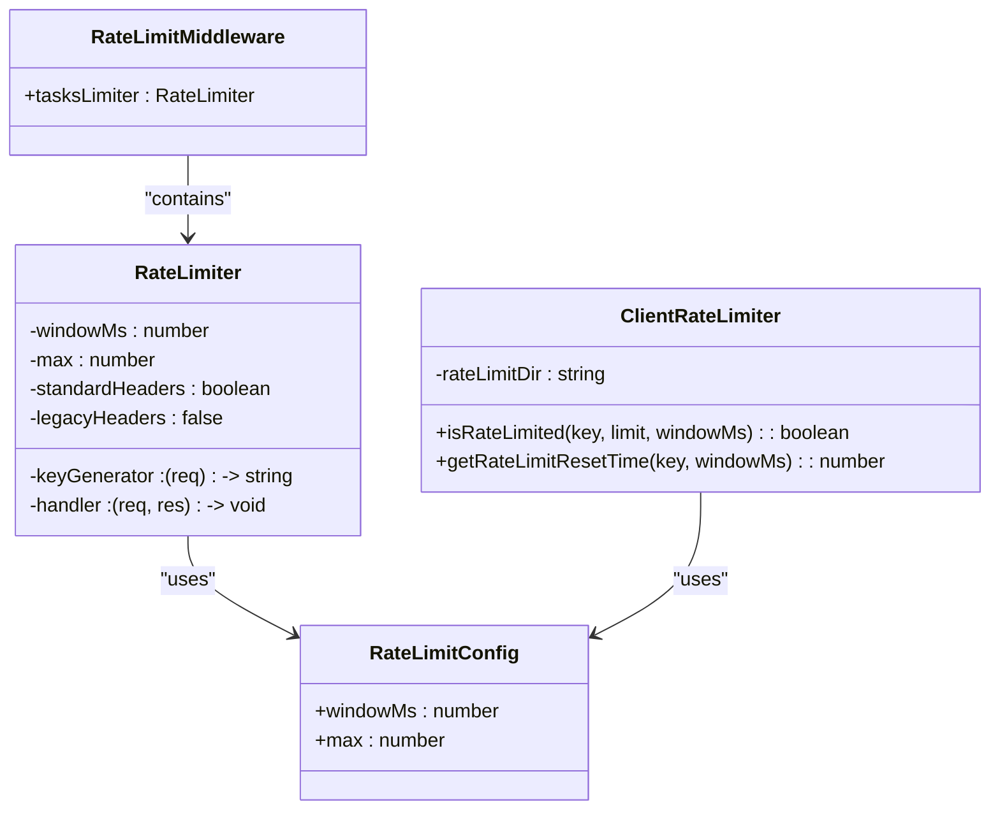

# API Integration

<cite>
**Referenced Files in This Document**   
- [api.js](file://apps/admin-ui/lib/api.js)
- [api-client.ts](file://apps/web/lib/api/admin-client.ts)
- [api-client.ts](file://apps/web/lib/api-client.ts)
- [api-proxy.ts](file://apps/web/lib/api-proxy.ts)
- [auth.js](file://apps/admin-api/src/routes/auth.js)
- [auth.js](file://apps/admin-api/src/middleware/auth.js)
- [token.js](file://apps/admin-api/src/services/token.js)
- [jwt.js](file://apps/admin-api/lib/jwt.js)
- [cache.js](file://apps/admin-api/src/middleware/cache.js)
- [redis-client.ts](file://apps/web/lib/cache/redis-client.ts)
- [rate-limit.js](file://apps/admin-api/src/middleware/rate-limit.js)
- [rate-limiter.ts](file://apps/web/lib/rate-limiter.ts)
</cite>

## Table of Contents
1. [Introduction](#introduction)
2. [API Client Implementation](#api-client-implementation)
3. [Authentication and Token Management](#authentication-and-token-management)
4. [Data Transformation and Response Handling](#data-transformation-and-response-handling)
5. [Query Parameter Serialization and Caching](#query-parameter-serialization-and-caching)
6. [Error Handling and HTTP Status Code Management](#error-handling-and-http-status-code-management)
7. [API Rate Limiting Strategies](#api-rate-limiting-strategies)
8. [Differences Between Web and Admin-UI API Clients](#differences-between-web-and-admin-ui-api-clients)
9. [Conclusion](#conclusion)

## Introduction
This document provides comprehensive documentation for the API integration strategy between frontend applications and the admin-api backend. The system supports two primary frontend applications: the web application and the admin-ui application, each with distinct API client implementations tailored to their specific use cases. The integration strategy focuses on robust error handling, retry logic, request/response interception, authentication token management, data transformation, query parameter serialization, response caching, and rate limiting. The architecture employs a layered approach with centralized API clients that handle cross-cutting concerns while providing a clean interface for frontend components to interact with the backend services.

**Section sources**
- [api.js](file://apps/admin-ui/lib/api.js#L1-L70)
- [api-client.ts](file://apps/web/lib/api/admin-client.ts#L1-L388)
- [api-client.ts](file://apps/web/lib/api-client.ts#L1-L505)

## API Client Implementation

The API client implementation is designed with a layered architecture that separates concerns and provides consistent behavior across different frontend applications. The web application uses a sophisticated `ApiClient` class that wraps the `AdminApiClient` with additional features, while the admin-ui application uses a simpler `apiFetch` function with React hooks integration.

The `ApiClient` in the web application provides comprehensive features including automatic retry with exponential backoff, request/response interceptors, authentication handling, request caching, and comprehensive error handling. It uses a configuration-driven approach with default values that can be overridden per request. The retry logic is configurable with parameters for maximum retries, base delay, maximum delay, and backoff multiplier, allowing for fine-tuned control over retry behavior.



**Diagram sources**
- [api-client.ts](file://apps/web/lib/api-client.ts#L55-L487)
- [api-client.ts](file://apps/web/lib/api/admin-client.ts#L37-L387)

The admin-ui application's API client is simpler but effective, using a functional approach with React hooks. The `apiFetch` function handles the core HTTP operations with built-in support for CSRF tokens, content-type headers, and response parsing. The `useApi` hook provides a convenient way to access the API client within React components, automatically injecting the CSRF token from the session.

**Section sources**
- [api.js](file://apps/admin-ui/lib/api.js#L24-L69)
- [api-client.ts](file://apps/web/lib/api-client.ts#L55-L487)

## Authentication and Token Management

The authentication system is built around JWT (JSON Web Tokens) with cookie-based storage and automatic token refresh mechanisms. The system uses Discord OAuth2 for user authentication, with a comprehensive flow that handles user login, token exchange, and session management.

The authentication process begins with the `/api/auth/login` endpoint, which redirects users to Discord's OAuth2 authorization page. After successful authorization, Discord redirects back to the `/api/auth/callback` endpoint with an authorization code. The backend exchanges this code for access and refresh tokens, then creates a JWT session token that is stored in a secure, HTTP-only cookie.



**Diagram sources**
- [auth.js](file://apps/admin-api/src/routes/auth.js#L108-L374)
- [auth.js](file://apps/admin-api/src/middleware/auth.js#L154-L160)

The token management system includes automatic refresh capabilities. When a JWT token is about to expire, the system can use the refresh token to obtain a new access token without requiring the user to log in again. The session store maintains the user's Discord access token and refresh token, allowing for seamless token refresh operations.

The authentication middleware provides several functions for protecting routes:
- `requireAuth`: Ensures the user is authenticated
- `requireRole`: Ensures the user has a minimum role level
- `requireGuildMember`: Ensures the user is a member of the specified guild

These middleware functions are used throughout the API routes to enforce access control based on user roles and guild membership.

**Section sources**
- [auth.js](file://apps/admin-api/src/routes/auth.js#L108-L374)
- [auth.js](file://apps/admin-api/src/middleware/auth.js#L154-L230)
- [token.js](file://apps/admin-api/src/services/token.js#L29-L58)
- [jwt.js](file://apps/admin-api/lib/jwt.js#L45-L80)

## Data Transformation and Response Handling

The API integration strategy includes comprehensive data transformation patterns between API responses and frontend state. The system uses a consistent response format with `ok` flag, `data`, `status`, and `headers` properties, making it easy to handle both success and error cases uniformly.

The `AdminApiClient` class in the web application handles response parsing automatically, detecting the content type and parsing JSON responses while preserving text responses. For streaming responses like Server-Sent Events (SSE), the client returns the raw Response object, allowing the frontend to handle the stream appropriately.



**Diagram sources**
- [admin-client.ts](file://apps/web/lib/api/admin-client.ts#L127-L230)
- [api-client.ts](file://apps/web/lib/api-client.ts#L283-L368)

The data transformation process includes several key aspects:
1. **Error normalization**: All errors are transformed into a consistent format with `ok: false`, `code`, `message`, and optional `status` and `details` properties.
2. **Success normalization**: Successful responses are wrapped with `ok: true`, `data`, `status`, and `headers` properties.
3. **Type safety**: TypeScript interfaces ensure type safety throughout the data transformation pipeline.
4. **Streaming support**: Special handling for streaming responses that should not be parsed as JSON.

The system also includes request/response interceptors that can modify requests and responses at various points in the pipeline. These interceptors can be used for logging, performance monitoring, data transformation, and other cross-cutting concerns.

**Section sources**
- [admin-client.ts](file://apps/web/lib/api/admin-client.ts#L16-L30)
- [api-client.ts](file://apps/web/lib/api-client.ts#L17-L32)
- [admin-client.ts](file://apps/web/lib/api/admin-client.ts#L127-L230)

## Query Parameter Serialization and Caching

The API integration strategy includes robust query parameter serialization and response caching mechanisms to improve performance and reduce server load. The caching system operates at multiple levels, including in-memory caching in the frontend and Redis-based caching in the backend.

The frontend caching implementation in the `ApiClient` class uses an in-memory Map to store cached responses with configurable TTL (Time To Live). The cache key is generated based on the request method, URL, and body content, ensuring that different requests are cached separately. The system automatically handles cache invalidation based on TTL and provides methods to manually clear the cache.

```mermaid
classDiagram
class CacheClient {
<<interface>>
+get(key) : Promise~string | null~
+set(key, value, ttl) : Promise~void~
+del(key) : Promise~void~
+exists(key) : Promise~boolean~
+expire(key, ttl) : Promise~void~
+ttl(key) : Promise~number~
+keys(pattern) : Promise~string[]~
+flushAll() : Promise~void~
+disconnect() : Promise~void~
}
class RedisCache {
-client : RedisClientType
-connected : boolean
+connect() : Promise~void~
+get(key) : Promise~string | null~
+set(key, value, ttl) : Promise~void~
+del(key) : Promise~void~
+exists(key) : Promise~boolean~
+expire(key, ttl) : Promise~void~
+ttl(key) : Promise~number~
+keys(pattern) : Promise~string[]~
+flushAll() : Promise~void~
+disconnect() : Promise~void~
}
class InMemoryCache {
-cache : Map~string, {value, expiresAt}~
-cleanupInterval : Timeout
+get(key) : Promise~string | null~
+set(key, value, ttl) : Promise~void~
+del(key) : Promise~void~
+exists(key) : Promise~boolean~
+expire(key, ttl) : Promise~void~
+ttl(key) : Promise~number~
+keys(pattern) : Promise~string[]~
+flushAll() : Promise~void~
+disconnect() : Promise~void~
}
class CacheHelper {
-client : CacheClient
+getJSON(key) : Promise~T | null~
+setJSON(key, value, ttl) : Promise~void~
+getOrSet(key, fetchFn, ttl) : Promise~T~
+invalidatePattern(pattern) : Promise~void~
+increment(key, by, ttl) : Promise~number~
+exists(key) : Promise~boolean~
+delete(key) : Promise~void~
}
CacheClient <|-- RedisCache
CacheClient <|-- InMemoryCache
CacheHelper --> CacheClient : "uses"
```

**Diagram sources**
- [redis-client.ts](file://apps/web/lib/cache/redis-client.ts#L14-L213)
- [redis-client.ts](file://apps/web/lib/cache/redis-client.ts#L215-L233)

The backend implements API response caching using Redis with a stale-while-revalidate strategy. The `APICache` middleware can be applied to specific routes to cache responses for a configurable duration. When a cached response is stale, it is still served to the client while a background process refreshes the cache with fresh data.

Query parameter serialization is handled automatically by the API clients. For GET requests, query parameters are serialized into the URL. For other request methods, the request body is serialized as JSON by default, with special handling for FormData objects.

**Section sources**
- [api-client.ts](file://apps/web/lib/api-client.ts#L107-L158)
- [cache.js](file://apps/admin-api/src/middleware/cache.js#L8-L287)
- [redis-client.ts](file://apps/web/lib/cache/redis-client.ts#L1-L375)

## Error Handling and HTTP Status Code Management

The API integration strategy includes comprehensive error handling mechanisms to provide a robust user experience and facilitate debugging. The system uses a consistent error format across all API responses, making it easy to handle errors uniformly in the frontend.

The error handling system categorizes errors into several types:
- **Network errors**: Occur when the request cannot reach the server
- **Timeout errors**: Occur when the request exceeds the configured timeout
- **Authentication errors**: Occur when the user is not authenticated
- **Authorization errors**: Occur when the user lacks sufficient permissions
- **Validation errors**: Occur when the request data is invalid
- **Rate limit errors**: Occur when the user exceeds rate limits
- **Server errors**: Occur when the server encounters an internal error



**Diagram sources**
- [api-client.ts](file://apps/web/lib/api-client.ts#L224-L254)
- [admin-client.ts](file://apps/web/lib/api/admin-client.ts#L89-L122)

The frontend API clients include retry logic for retryable errors, with exponential backoff to avoid overwhelming the server. Retryable errors include network errors, timeout errors, and certain 4xx and 5xx status codes (408, 429, 500, 502, 503, 504).

Error interceptors allow for custom error handling logic to be applied globally or per request. This enables features like automatic token refresh when receiving 401 Unauthorized responses, or special handling for rate limit errors.

The system also includes comprehensive logging of errors, with network error messages deduplicated to avoid log spam. This helps with debugging while maintaining clean logs.

**Section sources**
- [api-client.ts](file://apps/web/lib/api-client.ts#L179-L186)
- [api-client.ts](file://apps/web/lib/api-client.ts#L224-L254)
- [admin-client.ts](file://apps/web/lib/api/admin-client.ts#L89-L122)

## API Rate Limiting Strategies

The API integration strategy includes comprehensive rate limiting at both the client and server levels to protect against abuse and ensure fair usage of resources.

On the server side, the system uses the `express-rate-limit` middleware to enforce rate limits on specific routes. The rate limiting configuration is defined in the application config and can vary by route. For example, the tasks endpoint has its own rate limit configuration with a specific window and maximum request count.



**Diagram sources**
- [rate-limit.js](file://apps/admin-api/src/middleware/rate-limit.js#L7-L22)
- [rate-limiter.ts](file://apps/web/lib/rate-limiter.ts#L1-L90)

The server-side rate limiter uses a composite key based on the user ID (if authenticated) and guild ID, falling back to the client IP address for unauthenticated requests. This ensures that rate limits are applied appropriately based on the context of the request.

On the client side, the web application includes a file-backed rate limiter for certain operations. This is implemented in `rate-limiter.ts` and uses JSON files to store rate limit state. The rate limiter checks if a key (such as a user ID or IP address) has exceeded the allowed number of requests within a specified time window.

The rate limiting strategy includes several key principles:
1. **Layered protection**: Rate limiting is applied at both client and server levels for defense in depth.
2. **Context-aware limits**: Limits vary based on the operation and user context.
3. **Graceful degradation**: When rate limits are exceeded, the system returns appropriate HTTP 429 responses that the client can handle gracefully.
4. **Monitoring and logging**: Rate limit events are logged for monitoring and analysis.

The client-side rate limiter is particularly useful for operations that should be rate-limited even before reaching the server, such as form submissions or other user-initiated actions that could be abused.

**Section sources**
- [rate-limit.js](file://apps/admin-api/src/middleware/rate-limit.js#L7-L22)
- [rate-limiter.ts](file://apps/web/lib/rate-limiter.ts#L1-L90)

## Differences Between Web and Admin-UI API Clients

The system employs two distinct API client implementations tailored to the specific needs of the web and admin-ui applications. While both clients serve the same backend API, they have different design philosophies, feature sets, and usage patterns.

The web application's API client (`ApiClient`) is a comprehensive, feature-rich implementation designed for complex applications with demanding requirements. It includes advanced features like:
- Automatic retry with exponential backoff
- Request/response/error interceptors
- Built-in caching with TTL management
- Comprehensive error handling and normalization
- Type safety with TypeScript
- Support for streaming responses

```mermaid
graph TD
subgraph "Web Application"
A[ApiClient]
B[AdminApiClient]
C[api-proxy.ts]
end
subgraph "Admin-UI Application"
D[apiFetch]
E[useApi]
end
A --> B : "delegates to"
B --> C : "legacy compatibility"
D --> E : "hook integration"
style A fill:#ffcccc,stroke:#333
style D fill:#ccccff,stroke:#333
```

**Diagram sources**
- [api-client.ts](file://apps/web/lib/api-client.ts#L55-L487)
- [api.js](file://apps/admin-ui/lib/api.js#L24-L69)

In contrast, the admin-ui application's API client is simpler and more lightweight, focusing on the essential functionality needed for an admin interface:
- Basic HTTP operations (GET, POST, etc.)
- CSRF token handling
- Content-type header management
- Response parsing
- React hook integration

The web application's client is designed for a production environment with high reliability requirements, while the admin-ui client prioritizes simplicity and ease of use for administrative tasks.

Another key difference is in the error handling approach. The web client uses a sophisticated error normalization system with retry logic, while the admin-ui client uses a simpler approach that throws errors directly from the fetch operation.

The caching strategies also differ significantly. The web client has built-in in-memory caching with TTL management, while the admin-ui client relies on the browser's native caching mechanisms and React's state management.

These differences reflect the distinct use cases and requirements of the two applications: the web application needs to handle complex user interactions with high reliability, while the admin-ui application focuses on providing a simple, responsive interface for administrative tasks.

**Section sources**
- [api-client.ts](file://apps/web/lib/api-client.ts#L55-L487)
- [api.js](file://apps/admin-ui/lib/api.js#L24-L69)

## Conclusion
The API integration strategy between the frontend applications and the admin-api backend is a sophisticated, multi-layered system designed to provide reliable, secure, and efficient communication. The architecture employs a layered approach with specialized API clients for different frontend applications, each optimized for its specific use case.

Key strengths of the system include:
- **Robust error handling** with consistent error formats and automatic retry logic
- **Secure authentication** with JWT tokens and automatic refresh mechanisms
- **Efficient data transformation** with type safety and streaming support
- **Performance optimization** through comprehensive caching at multiple levels
- **Abuse prevention** with rate limiting at both client and server levels
- **Flexibility** through request/response interceptors and configurable behavior

The system demonstrates a thoughtful balance between complexity and functionality, providing advanced features where needed while maintaining simplicity in areas where it's appropriate. The separation of concerns between the `AdminApiClient` (single source of truth for proxy logic) and the enhanced `ApiClient` (with additional features) is particularly effective, allowing for both consistency and extensibility.

For future improvements, consider:
1. Implementing more sophisticated cache invalidation strategies
2. Adding more detailed monitoring and analytics for API usage
3. Enhancing the error handling with more granular error types
4. Improving the documentation and type safety of the API client interfaces
5. Exploring the use of OpenAPI/Swagger for API contract definition

Overall, the API integration strategy provides a solid foundation for reliable and scalable communication between the frontend applications and the backend services.