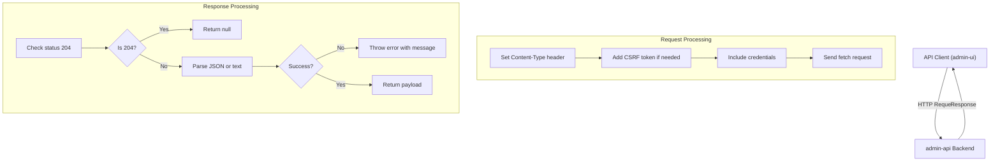
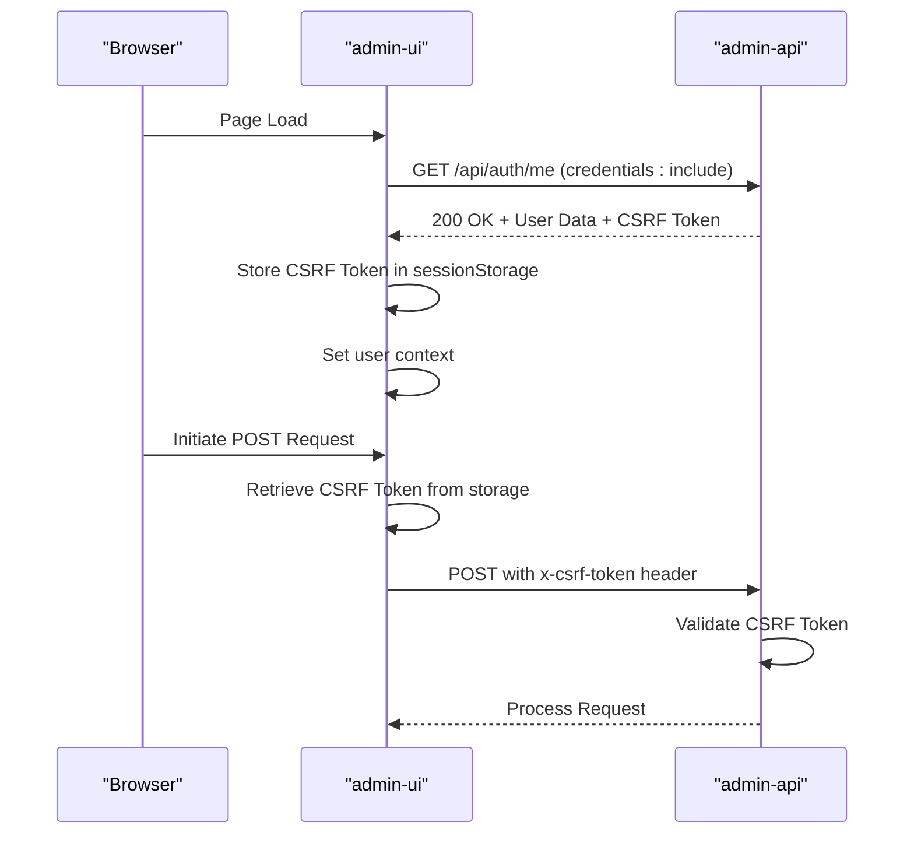
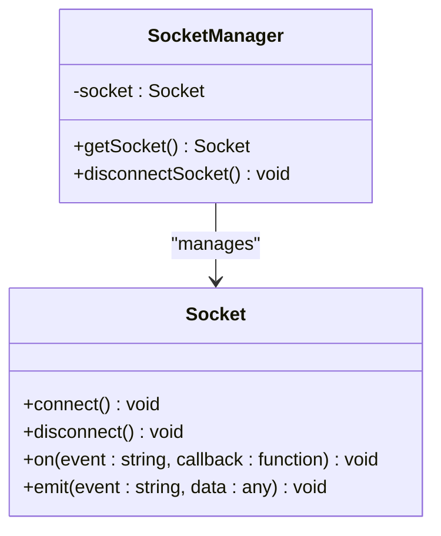
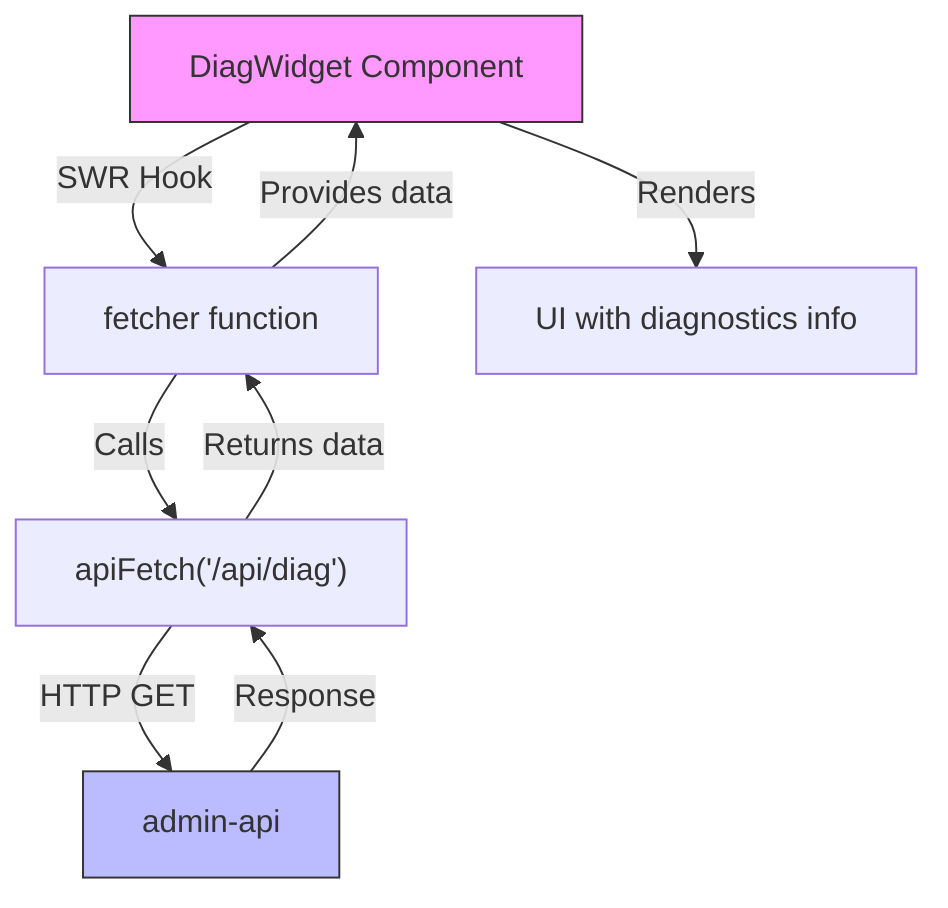
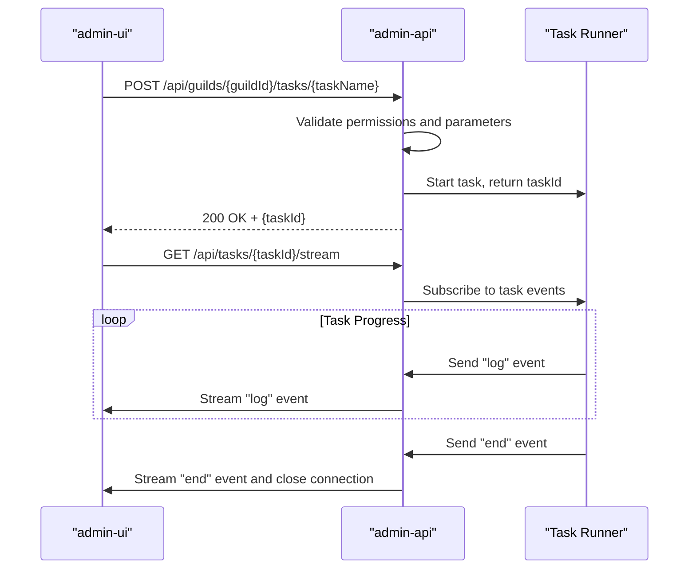
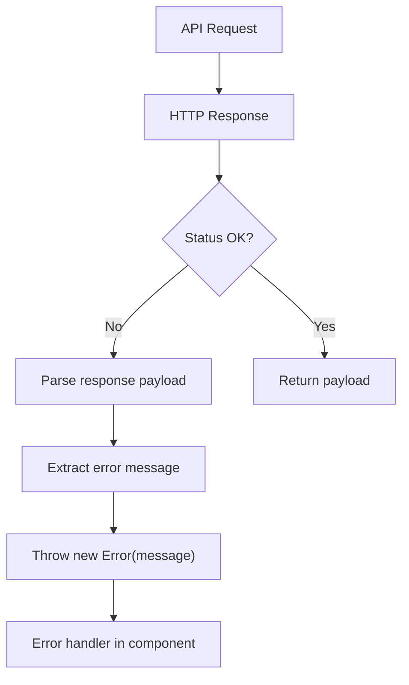
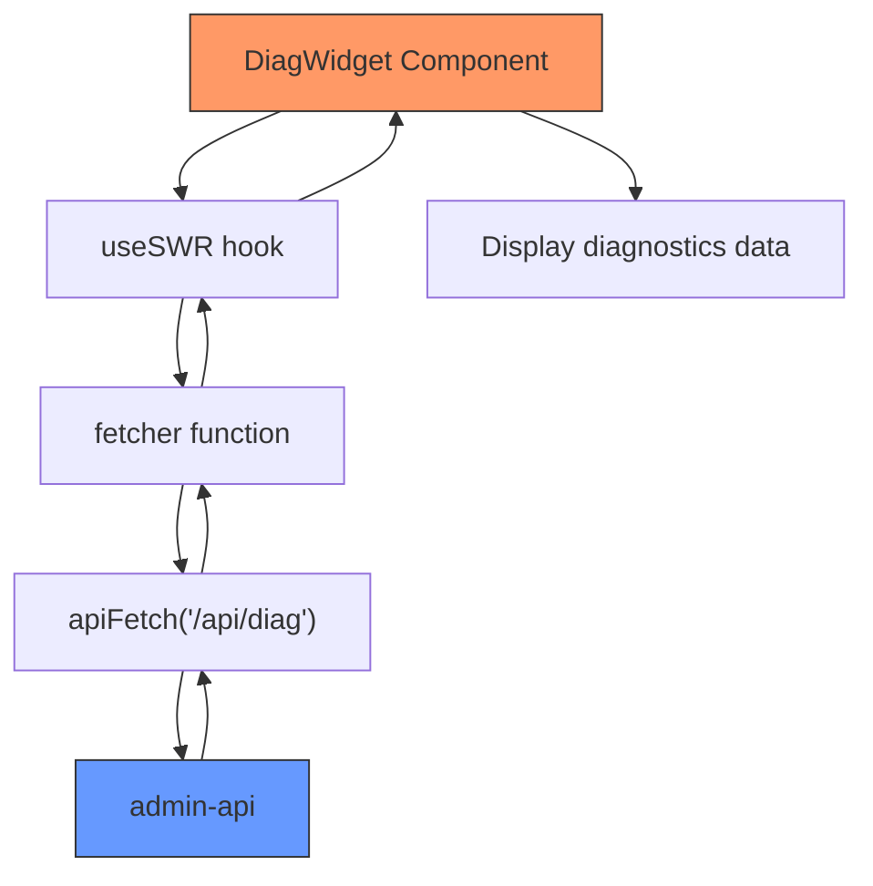
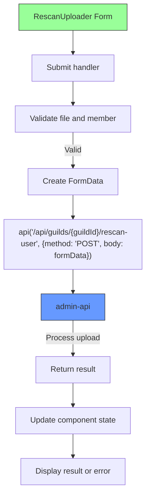
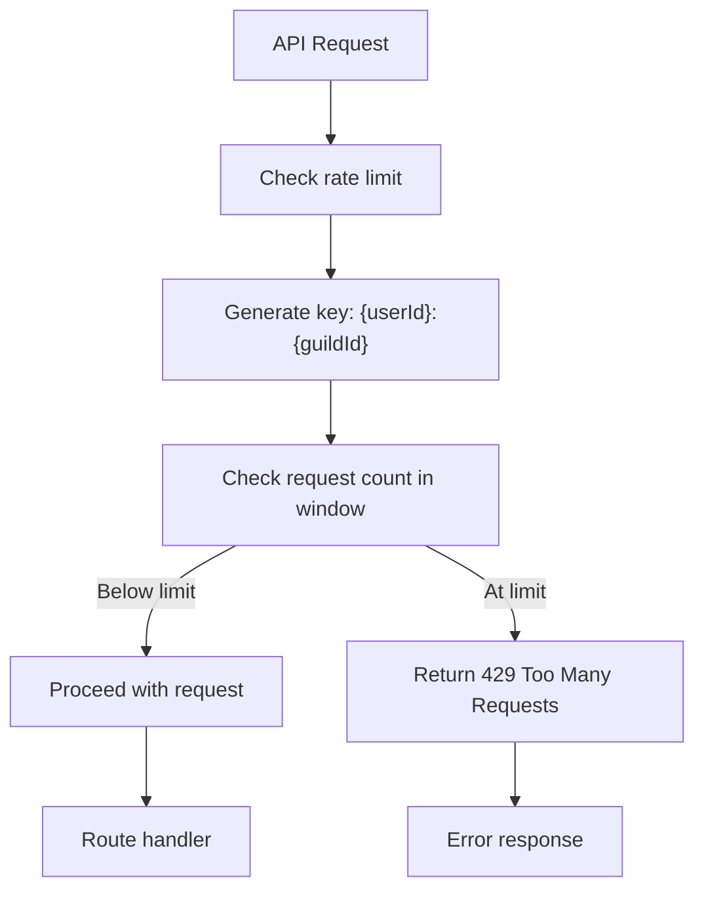

# API Integration

<cite>
**Referenced Files in This Document**   
- [api.js](file://apps/admin-ui/lib/api.js)
- [socket.js](file://apps/admin-ui/lib/socket.js)
- [tasks.js](file://apps/admin-ui/lib/tasks.js)
- [session.js](file://apps/admin-ui/lib/session.js)
- [DiagWidget.js](file://apps/admin-ui/components/DiagWidget.js)
- [RescanUploader.js](file://apps/admin-ui/components/RescanUploader.js)
- [diagnostics.js](file://apps/admin-api/src/routes/diagnostics.js)
- [guilds.js](file://apps/admin-api/src/routes/guilds.js)
- [tasks.js](file://apps/admin-api/src/routes/tasks.js)
- [uploads.js](file://apps/admin-api/src/routes/uploads.js)
- [rescan.js](file://apps/admin-api/src/services/rescan.js)
- [auth.js](file://apps/admin-api/src/middleware/auth.js)
- [rate-limit.js](file://apps/admin-api/src/middleware/rate-limit.js)
- [error-handler.js](file://apps/admin-api/src/middleware/error-handler.js)
</cite>

## Table of Contents
1. [Introduction](#introduction)
2. [API Client Library](#api-client-library)
3. [Authentication and Security](#authentication-and-security)
4. [WebSocket Integration](#websocket-integration)
5. [Core API Endpoints](#core-api-endpoints)
6. [Task Management System](#task-management-system)
7. [Error Handling and Retry Mechanisms](#error-handling-and-retry-mechanisms)
8. [Response Caching Strategies](#response-caching-strategies)
9. [Usage Examples](#usage-examples)
10. [Rate Limiting Considerations](#rate-limiting-considerations)

## Introduction
The admin-ui application implements a comprehensive API integration strategy for communicating with the admin-api backend service. This documentation details the architecture, implementation, and usage patterns of the API client library, covering request/response handling, error propagation, retry mechanisms, WebSocket integration for real-time updates, and the various API endpoints consumed by the admin interface. The system supports critical operations including diagnostics monitoring, guild management, and task execution, with robust security measures and performance optimizations.

## API Client Library
The API client library in the admin-ui application provides a standardized interface for communicating with the admin-api backend service. The core implementation is located in `api.js`, which exports essential functions for making HTTP requests and handling responses.

The library uses the Fetch API with proper configuration for credentials and headers. Key features include:
- Automatic Content-Type header setting based on request body type
- CSRF token injection for non-GET requests
- Proper handling of 204 No Content responses
- JSON response parsing with fallback to text for non-JSON content
- Error propagation with meaningful error messages

**Diagram sources**
- [api.js](file://apps/admin-ui/lib/api.js#L24-L60)

**Section sources**
- [api.js](file://apps/admin-ui/lib/api.js#L1-L70)

## Authentication and Security
The authentication system implements a multi-layered security approach with JWT-based session management and CSRF protection. The client-side session management is handled in `session.js`, which provides a React context for managing user authentication state.

Key security features include:
- JWT token verification on the server side
- CSRF token protection for state-changing operations
- Role-based access control (RBAC) with different permission levels
- Secure cookie handling with proper HTTP-only and SameSite attributes

The authentication flow begins with the `SessionProvider` component, which automatically refreshes the user session on mount. The CSRF token is stored in sessionStorage and automatically included in non-GET requests through the `useApi` hook.

**Diagram sources**
- [session.js](file://apps/admin-ui/lib/session.js#L29-L104)
- [auth.js](file://apps/admin-api/src/middleware/auth.js#L1-L231)

**Section sources**
- [session.js](file://apps/admin-ui/lib/session.js#L1-L104)
- [auth.js](file://apps/admin-api/src/middleware/auth.js#L1-L231)

## WebSocket Integration
The application implements WebSocket integration for real-time updates and task status monitoring. The WebSocket client is implemented in `socket.js`, which provides a singleton pattern for managing the socket connection.

Key features of the WebSocket implementation:
- Singleton pattern to ensure only one connection per application instance
- Connection to the admin API server with credentials
- WebSocket transport preference
- Clean connection management with disconnect functionality

The WebSocket connection is used primarily for real-time task monitoring, allowing the UI to receive live updates about task progress, logs, and completion status without requiring constant polling.

**Diagram sources**
- [socket.js](file://apps/admin-ui/lib/socket.js#L1-L21)

**Section sources**
- [socket.js](file://apps/admin-ui/lib/socket.js#L1-L21)

## Core API Endpoints
The admin-ui application consumes several key API endpoints from the admin-api backend, each serving specific functionality for the administrative interface.

### Diagnostics Endpoint
The diagnostics endpoint (`/api/diagnostics`) provides system health information including API uptime, memory usage, and upload statistics. This endpoint is consumed by the `DiagWidget` component to display real-time system metrics.

**Diagram sources**
- [DiagWidget.js](file://apps/admin-ui/components/DiagWidget.js#L1-L53)
- [diagnostics.js](file://apps/admin-api/src/routes/diagnostics.js#L1-L79)

### Guild Management Endpoints
The guild management endpoints provide comprehensive functionality for managing Discord guilds, including settings, personality, channels, and corrections. These endpoints follow a consistent pattern with role-based access control and audit logging.

Key endpoints include:
- `GET /api/guilds/:guildId/settings` - Retrieve guild settings
- `PUT /api/guilds/:guildId/settings` - Update guild settings
- `GET /api/guilds/:guildId/personality` - Retrieve guild personality
- `PUT /api/guilds/:guildId/personality` - Update guild personality
- `GET /api/guilds/:guildId/corrections` - List corrections
- `POST /api/guilds/:guildId/corrections` - Create correction
- `DELETE /api/guilds/:guildId/corrections/:correctionId` - Delete correction

**Section sources**
- [guilds.js](file://apps/admin-api/src/routes/guilds.js#L1-L440)

## Task Management System
The task management system enables long-running operations with real-time progress updates through Server-Sent Events (SSE). The client-side implementation is in `tasks.js`, which provides functions for starting tasks and subscribing to their progress.

### Task Execution Flow

### EventSource Implementation
The client uses the EventSource API to establish a persistent connection for receiving task events. The `subscribeTask` function handles the connection lifecycle, including:
- Creating the EventSource connection
- Setting up event listeners for log, error, and end events
- Proper cleanup when the task completes or connection closes
- Error handling for connection failures

The server-side implementation in `tasks.js` routes handles task creation and streaming, with proper access control and rate limiting.

**Diagram sources**
- [tasks.js](file://apps/admin-ui/lib/tasks.js#L1-L102)
- [tasks.js](file://apps/admin-api/src/routes/tasks.js#L1-L114)

**Section sources**
- [tasks.js](file://apps/admin-ui/lib/tasks.js#L1-L102)
- [tasks.js](file://apps/admin-api/src/routes/tasks.js#L1-L114)

## Error Handling and Retry Mechanisms
The API integration implements comprehensive error handling and retry mechanisms to ensure reliability and resilience.

### Error Propagation
When an API request fails, the error is propagated with meaningful messages:
- HTTP errors (4xx, 5xx) are caught and converted to JavaScript Error objects
- The error message is extracted from the response payload when available
- Network errors and other exceptions are also caught and wrapped

The error handling middleware in the backend (`error-handler.js`) ensures consistent error responses across all endpoints, with proper logging and operational error classification.

### Retry Logic
While the current implementation doesn't include automatic retries, the architecture supports retry mechanisms through:
- Clear error classification that distinguishes between retryable and non-retryable errors
- Idempotent operations where appropriate
- Task-based operations that can be safely retried

Future enhancements could implement exponential backoff retry strategies for transient failures.

**Section sources**
- [api.js](file://apps/admin-ui/lib/api.js#L54-L58)
- [error-handler.js](file://apps/admin-api/src/middleware/error-handler.js#L1-L82)

## Response Caching Strategies
The system implements several caching strategies to improve performance and reduce server load.

### Client-Side Caching
The DiagWidget component uses SWR (Stale-While-Revalidate) for caching the diagnostics data:
- Data is refreshed every 60 seconds
- The UI shows cached data while fetching fresh data in the background
- Revalidation does not occur when the window loses focus

### Server-Side Caching
The diagnostics endpoint implements server-side caching with a 30-second TTL:
- Results are cached in memory
- Cache is invalidated after 30 seconds
- Concurrent requests receive the cached response

### Future Caching Enhancements
Potential caching improvements include:
- Redis-based caching for distributed environments
- More sophisticated cache invalidation strategies
- Selective caching based on request parameters

**Section sources**
- [DiagWidget.js](file://apps/admin-ui/components/DiagWidget.js#L8-L14)
- [diagnostics.js](file://apps/admin-api/src/routes/diagnostics.js#L10-L12)

## Usage Examples
The API integration is demonstrated in several key components of the admin-ui application.

### DiagWidget Component
The DiagWidget component showcases the use of the API client for periodic data fetching:

The component automatically handles loading states and only renders when data is available.

**Section sources**
- [DiagWidget.js](file://apps/admin-ui/components/DiagWidget.js#L1-L53)

### RescanUploader Component
The RescanUploader component demonstrates file upload functionality with form data:

The component handles file selection, form submission, and displays both success results and error messages.

**Section sources**
- [RescanUploader.js](file://apps/admin-ui/components/RescanUploader.js#L1-L92)
- [guilds.js](file://apps/admin-api/src/routes/guilds.js#L291-L327)
- [rescan.js](file://apps/admin-api/src/services/rescan.js#L1-L85)

## Rate Limiting Considerations
The API implements rate limiting to prevent abuse and ensure system stability.

### Rate Limiting Configuration
The rate limiting is configured in `rate-limit.js` with the following parameters:
- Window: Configurable time window in milliseconds
- Maximum requests: Configurable maximum number of requests per window
- Key generator: Combines user ID and guild ID for granular rate limiting

The tasks endpoint has specific rate limiting to prevent excessive task creation.

### Rate Limiting Implementation

The rate limiting is applied to task creation endpoints to prevent system overload from excessive task submissions.

**Section sources**
- [rate-limit.js](file://apps/admin-api/src/middleware/rate-limit.js#L1-L23)
- [tasks.js](file://apps/admin-api/src/routes/tasks.js#L26-L27)