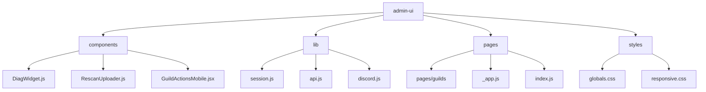
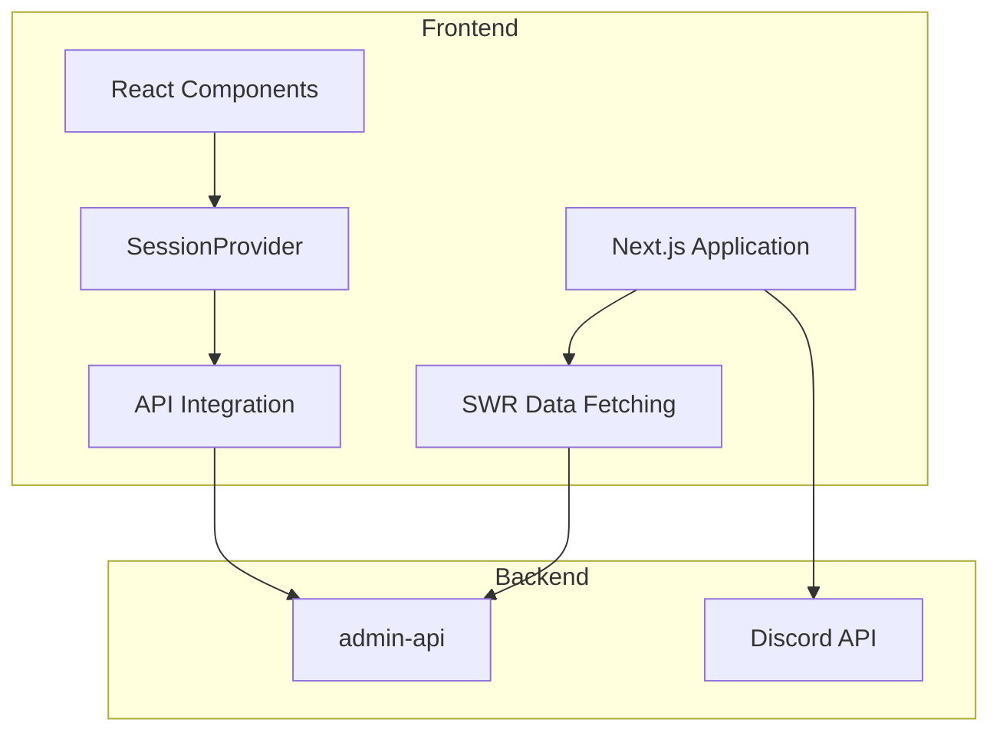
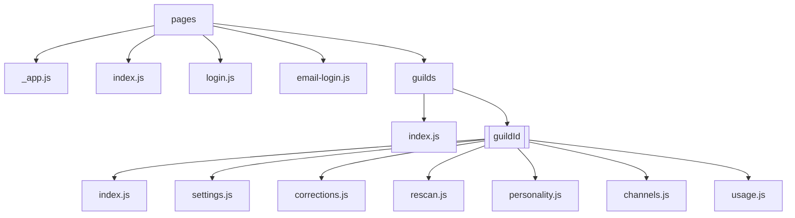
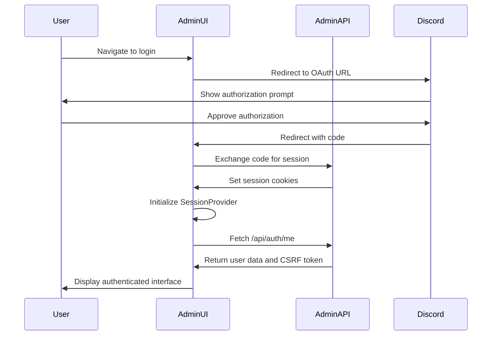
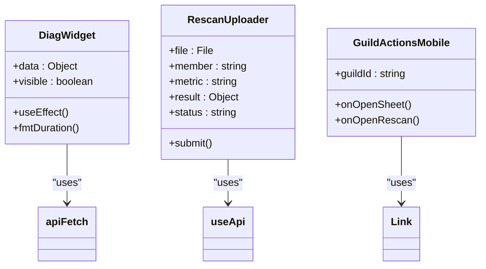
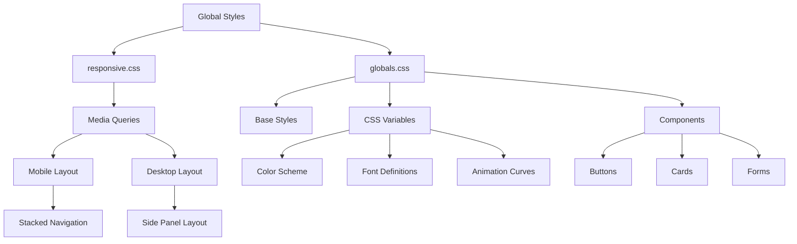
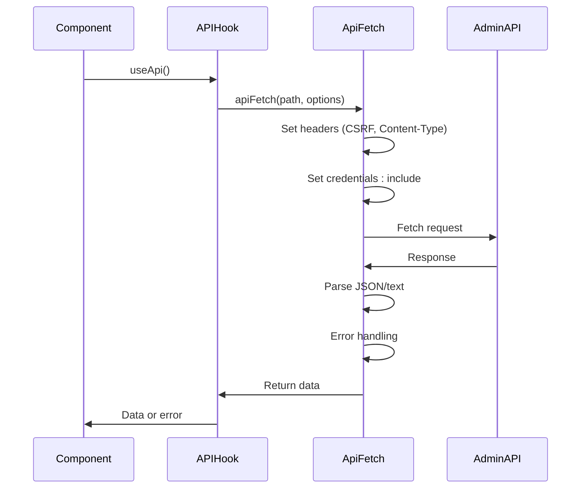
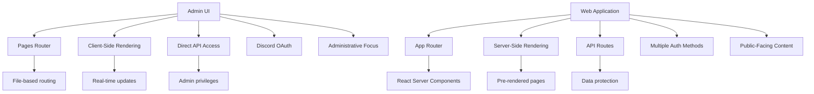
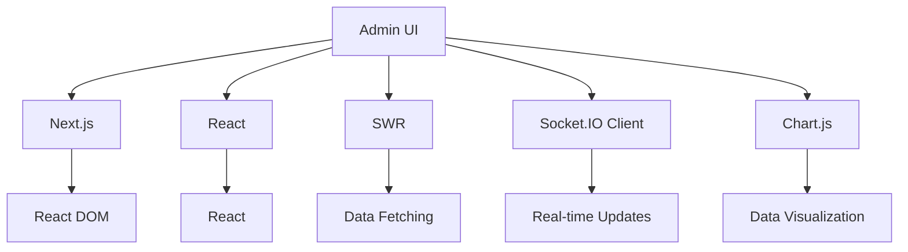

# Admin UI

<cite>
**Referenced Files in This Document**   
- [package.json](file://apps/admin-ui/package.json)
- [_app.js](file://apps/admin-ui/pages/_app.js)
- [index.js](file://apps/admin-ui/pages/index.js)
- [session.js](file://apps/admin-ui/lib/session.js)
- [api.js](file://apps/admin-ui/lib/api.js)
- [DiagWidget.js](file://apps/admin-ui/components/DiagWidget.js)
- [RescanUploader.js](file://apps/admin-ui/components/RescanUploader.js)
- [GuildActionsMobile.jsx](file://apps/admin-ui/components/GuildActionsMobile.jsx)
- [globals.css](file://apps/admin-ui/styles/globals.css)
- [responsive.css](file://apps/admin-ui/styles/responsive.css)
- [index.js](file://apps/admin-ui/pages/guilds/[guildId]/index.js)
- [index.js](file://apps/admin-ui/pages/guilds/index.js)
- [discord.js](file://apps/admin-ui/lib/discord.js)
</cite>

## Table of Contents
1. [Introduction](#introduction)
2. [Project Structure](#project-structure)
3. [Core Components](#core-components)
4. [Architecture Overview](#architecture-overview)
5. [Detailed Component Analysis](#detailed-component-analysis)
6. [Dependency Analysis](#dependency-analysis)
7. [Performance Considerations](#performance-considerations)
8. [Troubleshooting Guide](#troubleshooting-guide)
9. [Conclusion](#conclusion)

## Introduction
The Admin UI application is a React-based administrative interface designed to manage server configurations, monitor system health, and perform administrative tasks for the slimy.ai platform. Built using Next.js, this application provides a comprehensive dashboard for administrators to interact with the backend admin-api service. The interface features a modern, responsive design with glass-morphism styling and real-time data updates. This documentation covers the architectural aspects of the application, including routing, session management, component architecture, styling approach, and API integration patterns.

## Project Structure

**Diagram sources**
- [package.json](file://apps/admin-ui/package.json)

**Section sources**
- [package.json](file://apps/admin-ui/package.json)

## Core Components

The Admin UI application is structured around several core components that provide essential functionality. The application uses a component-based architecture with clear separation of concerns between UI presentation, state management, and API interactions. Key components include DiagWidget for system diagnostics, RescanUploader for processing user screenshots, and GuildActionsMobile for mobile navigation. The application leverages React hooks for state management and Next.js features for routing and data fetching. The SessionProvider component manages authentication state across the application, while the API integration layer handles communication with the backend services.

**Section sources**
- [DiagWidget.js](file://apps/admin-ui/components/DiagWidget.js)
- [RescanUploader.js](file://apps/admin-ui/components/RescanUploader.js)
- [GuildActionsMobile.jsx](file://apps/admin-ui/components/GuildActionsMobile.jsx)

## Architecture Overview

**Diagram sources**
- [_app.js](file://apps/admin-ui/pages/_app.js)
- [api.js](file://apps/admin-ui/lib/api.js)

**Section sources**
- [_app.js](file://apps/admin-ui/pages/_app.js)
- [api.js](file://apps/admin-ui/lib/api.js)

## Detailed Component Analysis

### Legacy Pages Directory Structure and Custom Routing Implementation

The Admin UI application utilizes Next.js file-based routing with a legacy pages directory structure. The routing hierarchy is organized under the `pages` directory, with special pages `_app.js` and `_document.tsx` providing application-level configuration. The application implements dynamic routing through the `[guildId]` parameter in the `pages/guilds/[guildId]` directory, allowing for guild-specific dashboards. Custom routing is achieved through Next.js Link components and programmatic navigation using the useRouter hook. The application also implements client-side navigation between different tabs within guild dashboards without full page reloads, enhancing user experience.

**Diagram sources**
- [index.js](file://apps/admin-ui/pages/guilds/index.js)
- [index.js](file://apps/admin-ui/pages/guilds/[guildId]/index.js)

**Section sources**
- [index.js](file://apps/admin-ui/pages/guilds/index.js)
- [index.js](file://apps/admin-ui/pages/guilds/[guildId]/index.js)

### Session Management System Using SessionProvider and Authentication Flow

The session management system is implemented through the SessionProvider component, which uses React Context to manage authentication state across the application. The provider initializes by fetching the current user's session from the `/api/auth/me` endpoint and stores CSRF tokens in sessionStorage. The authentication flow begins with a Discord OAuth login via the `/api/auth/login` endpoint, which redirects users to Discord for authorization. Upon successful authentication, Discord redirects back to the application with authorization codes, and the session is established. The SessionProvider automatically refreshes the session on component mount and exposes the user object, CSRF token, and loading state to consuming components through the useSession hook.

**Diagram sources**
- [session.js](file://apps/admin-ui/lib/session.js)
- [index.js](file://apps/admin-ui/pages/index.js)

**Section sources**
- [session.js](file://apps/admin-ui/lib/session.js)
- [index.js](file://apps/admin-ui/pages/index.js)

### Component Architecture with Key UI Elements

The component architecture follows a modular design with reusable UI elements. The DiagWidget component displays real-time system diagnostics including API uptime, memory usage, and upload statistics by fetching data from the `/api/diag` endpoint at regular intervals. The RescanUploader component provides an interface for administrators to upload user screenshots for reprocessing, with form validation and file handling capabilities. The GuildActionsMobile component offers a mobile-optimized navigation interface for guild management tasks. These components are designed to be self-contained with minimal dependencies, promoting reusability and maintainability.

**Diagram sources**
- [DiagWidget.js](file://apps/admin-ui/components/DiagWidget.js)
- [RescanUploader.js](file://apps/admin-ui/components/RescanUploader.js)
- [GuildActionsMobile.jsx](file://apps/admin-ui/components/GuildActionsMobile.jsx)

**Section sources**
- [DiagWidget.js](file://apps/admin-ui/components/DiagWidget.js)
- [RescanUploader.js](file://apps/admin-ui/components/RescanUploader.js)
- [GuildActionsMobile.jsx](file://apps/admin-ui/components/GuildActionsMobile.jsx)

### Styling Approach Using Global CSS Files and Responsive Design Implementation

The styling approach combines global CSS files with component-specific styles and responsive design principles. The application uses a global CSS file (`globals.css`) that defines custom properties for colors, fonts, and animations, creating a consistent design system across the application. The styling incorporates glass-morphism effects with semi-transparent backgrounds, blurred backdrops, and subtle borders. Responsive design is implemented through media queries in the `responsive.css` file, which adjusts layout and visibility based on screen size. The application uses CSS Grid and Flexbox for layout, with a mobile-first approach that adapts to larger screens. Custom classes like `mobile-only` and `desktop-only` control element visibility across different device sizes.

**Diagram sources**
- [globals.css](file://apps/admin-ui/styles/globals.css)
- [responsive.css](file://apps/admin-ui/styles/responsive.css)

**Section sources**
- [globals.css](file://apps/admin-ui/styles/globals.css)
- [responsive.css](file://apps/admin-ui/styles/responsive.css)

### API Integration Strategy for Communicating with the Admin-API Backend

The API integration strategy is centered around a dedicated API library that abstracts HTTP communication with the admin-api backend. The `api.js` file exports utility functions including `apiFetch` for making authenticated requests and `useApi` for creating API hooks in components. All API requests include CSRF protection for non-GET methods, with tokens managed by the SessionProvider. The application uses SWR for data fetching, enabling automatic revalidation, caching, and error handling. The API client handles request serialization, response parsing, and error transformation, providing a consistent interface for components. Endpoints are organized by resource type (guilds, diagnostics, uploads) with a consistent URL structure that mirrors the application's routing.

**Diagram sources**
- [api.js](file://apps/admin-ui/lib/api.js)
- [DiagWidget.js](file://apps/admin-ui/components/DiagWidget.js)

**Section sources**
- [api.js](file://apps/admin-ui/lib/api.js)
- [DiagWidget.js](file://apps/admin-ui/components/DiagWidget.js)

### Differences Between This React Application and the Next.js Web Application

This React application differs from the Next.js web application in several key aspects. While both applications use Next.js, the admin-ui is focused on administrative functionality with direct API access, whereas the web application appears to serve as a public-facing interface. The admin-ui implements a traditional pages directory structure, while the web application uses the newer App Router with React Server Components. The admin-ui relies on client-side rendering for dynamic content updates, while the web application likely uses server-side rendering and static generation for better performance and SEO. The authentication patterns also differ, with the admin-ui using Discord OAuth for administrator access, while the web application may support multiple authentication methods. The component architecture in the admin-ui is more tightly coupled to the backend API, reflecting its administrative purpose.

**Diagram sources**
- [package.json](file://apps/admin-ui/package.json)
- [_app.js](file://apps/admin-ui/pages/_app.js)

**Section sources**
- [package.json](file://apps/admin-ui/package.json)
- [_app.js](file://apps/admin-ui/pages/_app.js)

## Dependency Analysis

**Diagram sources**
- [package.json](file://apps/admin-ui/package.json)

**Section sources**
- [package.json](file://apps/admin-ui/package.json)

## Performance Considerations

The application implements several performance optimizations to ensure a responsive user experience. Data fetching is optimized through SWR's built-in caching and revalidation mechanisms, reducing redundant API calls. The application uses code splitting through Next.js's dynamic imports, ensuring that only necessary code is loaded for each page. Image optimization is handled by Next.js Image component, which automatically serves appropriately sized images. The diagnostics data is refreshed at a 60-second interval rather than continuously, balancing real-time updates with server load. The application also implements efficient state management through React's useState and useMemo hooks, minimizing unnecessary re-renders. For mobile devices, the application loads only essential components and defers non-critical resources.

## Troubleshooting Guide

Common issues with the Admin UI typically relate to authentication, API connectivity, or data loading. If the application fails to load user data, verify that the session is valid and the `/api/auth/me` endpoint is accessible. For CSRF token errors, ensure that the token is properly stored in sessionStorage and included in non-GET requests. If diagnostics data is not updating, check the network connection to the `/api/diag` endpoint and verify that the refresh interval is functioning correctly. For mobile layout issues, confirm that the responsive CSS classes are properly applied and media queries are working as expected. When API requests fail, examine the browser's developer tools to identify network errors, response status codes, and payload content.

**Section sources**
- [session.js](file://apps/admin-ui/lib/session.js)
- [api.js](file://apps/admin-ui/lib/api.js)

## Conclusion

The Admin UI application provides a comprehensive administrative interface with a well-structured architecture that separates concerns between presentation, state management, and API integration. The application effectively leverages Next.js features for routing and rendering while implementing custom solutions for session management and real-time data updates. The component-based design promotes reusability and maintainability, with clear patterns for data fetching and state management. The styling approach creates a distinctive visual identity with responsive design that adapts to different screen sizes. The API integration strategy ensures secure and efficient communication with the backend services. While the application uses a legacy pages directory structure, it demonstrates effective patterns that could be adapted to the newer App Router if needed. Overall, the Admin UI represents a robust solution for managing the slimy.ai platform with a focus on administrator workflows and system monitoring.