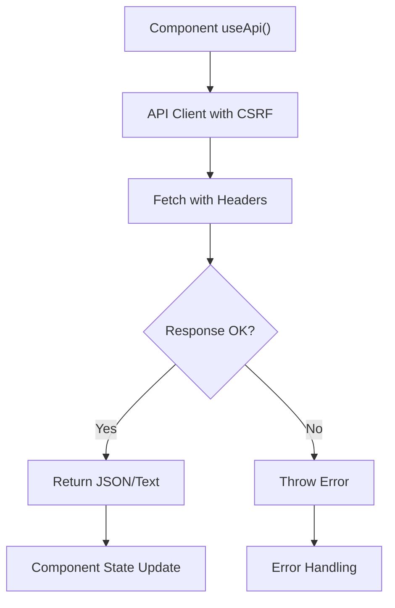
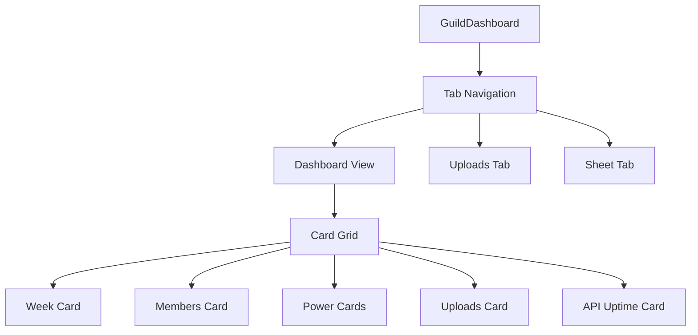
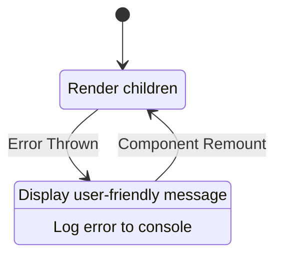

# Component Architecture

<cite>
**Referenced Files in This Document**   
- [DiagWidget.js](file://apps/admin-ui/components/DiagWidget.js)
- [RescanUploader.js](file://apps/admin-ui/components/RescanUploader.js)
- [CorrectionsManager.js](file://apps/admin-ui/components/CorrectionsManager.js)
- [UsageDiagnosticsCard.js](file://apps/admin-ui/components/UsageDiagnosticsCard.js)
- [ErrorBoundary.js](file://apps/admin-ui/components/ErrorBoundary.js)
- [Drawer.js](file://apps/admin-ui/components/Drawer.js)
- [DiagnosticsCard.jsx](file://apps/admin-ui/components/diag/DiagnosticsCard.jsx)
- [api.js](file://apps/admin-ui/lib/api.js)
- [index.js](file://apps/admin-ui/pages/guilds/[guildId]/index.js)
</cite>

## Table of Contents
1. [Introduction](#introduction)
2. [Core UI Components](#core-ui-components)
3. [State Management and Data Fetching](#state-management-and-data-fetching)
4. [Component Composition and Layout](#component-composition-and-layout)
5. [Error Handling and Resilience](#error-handling-and-resilience)
6. [Navigation and User Interaction](#navigation-and-user-interaction)
7. [Accessibility and Responsive Design](#accessibility-and-responsive-design)
8. [Conclusion](#conclusion)

## Introduction
The admin-ui application features a modular component architecture designed for system administration tasks in a guild management context. This document details the implementation of key components including DiagWidget for system diagnostics, RescanUploader for data rescan operations, CorrectionsManager for managing data corrections, and UsageDiagnosticsCard for usage analytics. The architecture emphasizes reusability, error resilience, and responsive design patterns across administrative interfaces.

## Core UI Components

### DiagWidget Component
The DiagWidget component provides real-time system diagnostics information including API uptime, memory usage, and upload statistics. It uses SWR for data fetching with a 60-second refresh interval and implements a visibility state that only renders when diagnostic data is available. The component displays formatted duration for API uptime and memory usage in megabytes, with visual styling that includes rounded corners, subtle borders, and a dark theme with shadow effects.

**Section sources**
- [DiagWidget.js](file://apps/admin-ui/components/DiagWidget.js#L1-L53)

### RescanUploader Component
The RescanUploader component enables administrators to upload screenshots for user data rescanning. It accepts a guildId prop and manages file upload state, member name input, and metric selection (auto, total, or sim). The component implements form validation, displays upload status messages, and shows parsing results upon successful submission. It uses FormData for file uploads and handles both success and error responses from the API endpoint `/api/guilds/{guildId}/rescan-user`.

**Section sources**
- [RescanUploader.js](file://apps/admin-ui/components/RescanUploader.js#L1-L92)

### CorrectionsManager Component
The CorrectionsManager component provides a comprehensive interface for managing data corrections with both individual entry and batch CSV import capabilities. It supports power value parsing with suffixes (k, m, b) and displays a preview of parsed values. The component features a form for adding corrections with display name, metric selection, value input, and optional reason field. It also includes a batch import section with CSV text input and provides a table view of existing corrections with delete functionality. Data synchronization is handled through SWR's mutate function after API operations.

**Section sources**
- [CorrectionsManager.js](file://apps/admin-ui/components/CorrectionsManager.js#L1-L197)

### UsageDiagnosticsCard Component
The UsageDiagnosticsCard component displays OpenAI API usage diagnostics with error states for failed requests or missing API keys. It supports configurable refresh intervals and displays masked API keys, probe status, available models, and organization information. The component includes a JSON-formatted usage snapshot in a scrollable pre element when available. It implements three distinct visual states: error (red border), loading (gray text), and unavailable (yellow border with specific messaging).

**Section sources**
- [UsageDiagnosticsCard.js](file://apps/admin-ui/components/UsageDiagnosticsCard.js#L1-L79)

## State Management and Data Fetching

### API Client Implementation
The admin-ui application uses a centralized API client in `lib/api.js` that provides consistent request handling across components. The apiFetch function handles JSON and FormData requests, includes CSRF token support, and normalizes error responses. The useApi hook leverages React's useCallback to memoize the API function with session CSRF tokens, preventing unnecessary re-renders. The library also includes a fmtDuration utility for converting seconds to human-readable time formats.

**Diagram sources**
- [api.js](file://apps/admin-ui/lib/api.js#L24-L59)

**Section sources**
- [api.js](file://apps/admin-ui/lib/api.js#L1-L70)

### Data Synchronization Pattern
Components use SWR for data fetching with automatic revalidation and error handling. The CorrectionsManager demonstrates a complete data synchronization pattern where mutations trigger explicit cache invalidation via the mutate function. This ensures the UI reflects the latest server state after create, update, or delete operations. The refresh intervals are configured per component requirements, with DiagWidget using 60-second intervals and DiagnosticsCard using 30-second intervals.

## Component Composition and Layout

### Page Structure and Tab System
The guild dashboard page implements a tab-based navigation system with three main views: Dashboard, Uploads, and Current Sheet. The component uses React state to manage the active tab and conditionally renders the appropriate content. The dashboard layout uses a card grid system to organize metrics into a responsive grid, with each card displaying specific health metrics such as week ID, member count, total power, and API uptime.

**Diagram sources**
- [index.js](file://apps/admin-ui/pages/guilds/[guildId]/index.js#L33-L272)

**Section sources**
- [index.js](file://apps/admin-ui/pages/guilds/[guildId]/index.js#L33-L272)

### Task Execution Interface
The dashboard includes a task execution interface that allows administrators to run various operations such as directory ingestion, verification, and recomputation. The interface manages task state, displays live logs in a scrollable container, and provides toast notifications for task completion or failure. The handleTask function implements a streaming pattern that processes events in real-time, updating logs and displaying appropriate status messages.

## Error Handling and Resilience

### ErrorBoundary Implementation
The ErrorBoundary component implements React's error boundary pattern to gracefully handle rendering errors in child components. When an error occurs, it captures the error state and displays a user-friendly message suggesting a page reload. The component logs errors to the console for debugging purposes while preventing the entire application from crashing. It displays a styled error message with a semi-transparent border and padding for visual separation from surrounding content.

**Diagram sources**
- [ErrorBoundary.js](file://apps/admin-ui/components/ErrorBoundary.js#L1-L21)

**Section sources**
- [ErrorBoundary.js](file://apps/admin-ui/components/ErrorBoundary.js#L1-L21)

### Component-Level Error States
Individual components implement specific error handling patterns. The UsageDiagnosticsCard distinguishes between network errors, API errors, and loading states, displaying appropriate messaging and visual cues for each. The RescanUploader handles form validation errors and API request failures, displaying status messages directly in the UI. The CorrectionsManager includes error handling for both individual corrections and batch CSV imports, providing specific feedback for failed operations.

## Navigation and User Interaction

### Drawer Navigation Pattern
The Drawer component implements a mobile-friendly navigation menu that slides in from the left side of the screen. It includes a hamburger button for opening the drawer, a semi-transparent overlay for closing, and a structured navigation panel with links and a login button. The component uses React state to manage open/closed status and implements keyboard accessibility by closing on Escape key press. The drawer includes a fixed footer with a prominent email login button styled with a gradient background.

**Section sources**
- [Drawer.js](file://apps/admin-ui/components/Drawer.js#L1-L72)

### User Interaction Flows
The components implement intuitive user interaction patterns with immediate visual feedback. Form submissions display status messages, button states reflect operation progress, and interactive elements provide hover effects. The task interface provides real-time log streaming, giving administrators immediate feedback on long-running operations. The corrections table includes inline delete buttons that trigger API calls without requiring additional confirmation dialogs.

## Accessibility and Responsive Design

### Responsive Layout Considerations
The components use CSS Grid and Flexbox layouts that adapt to different screen sizes. The card grid on the dashboard reflows based on available width, and form elements wrap appropriately on smaller screens. Input fields and buttons have sufficient touch targets, and the drawer navigation provides a mobile-optimized interface. The styling uses relative units and max-width constraints to prevent content from overflowing on narrow screens.

### Accessibility Features
The UI components include several accessibility features: the drawer has proper aria-labels for screen readers, interactive elements have keyboard event handlers, and form inputs are properly labeled. The error boundary includes semantic HTML structure with appropriate heading levels, and status messages are presented in a way that can be detected by assistive technologies. The tab interface uses button elements with appropriate state indicators for active tabs.

## Conclusion
The admin-ui component architecture demonstrates a well-structured approach to building administrative interfaces with React. Key components are designed with clear responsibilities, consistent data fetching patterns, and robust error handling. The architecture balances functionality with usability, providing administrators with the tools they need to manage system operations effectively. The use of SWR for data fetching, centralized API clients, and reusable UI patterns creates a maintainable codebase that can be extended with additional features as needed.