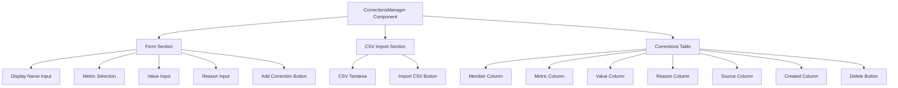
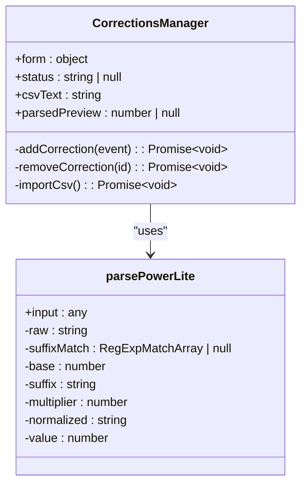
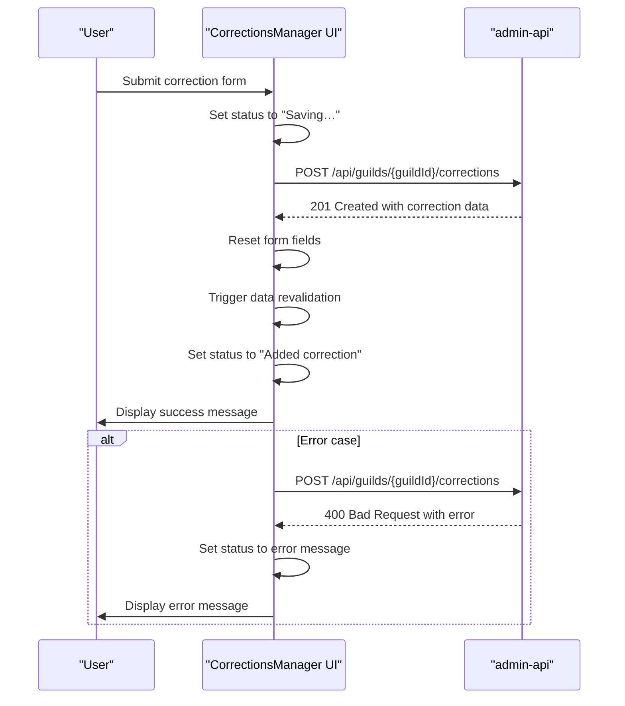
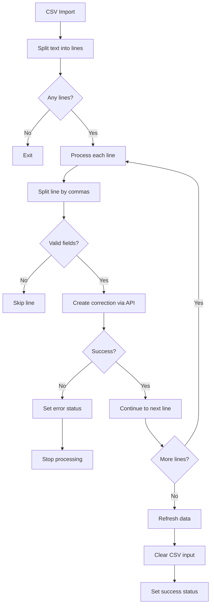
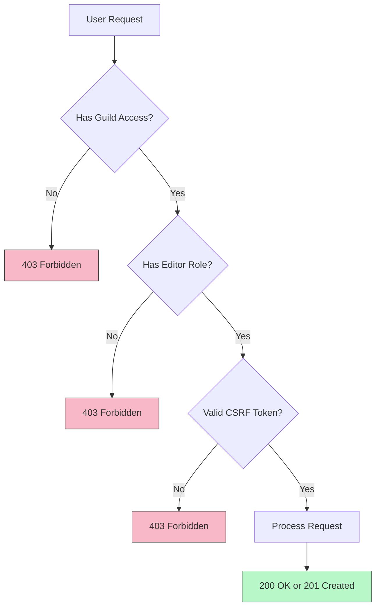
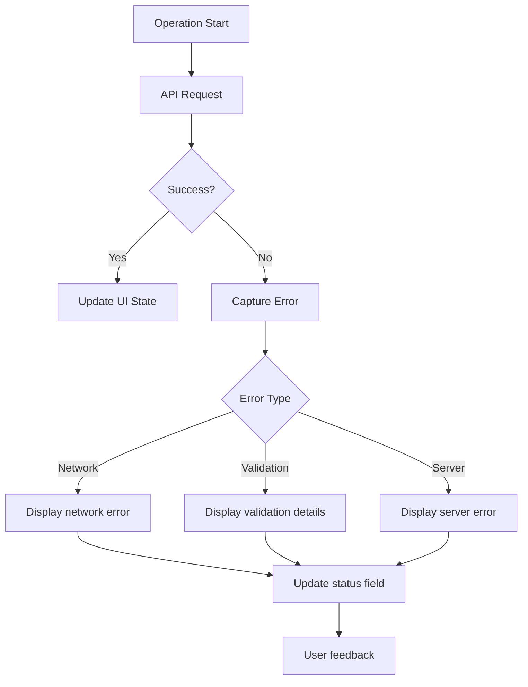
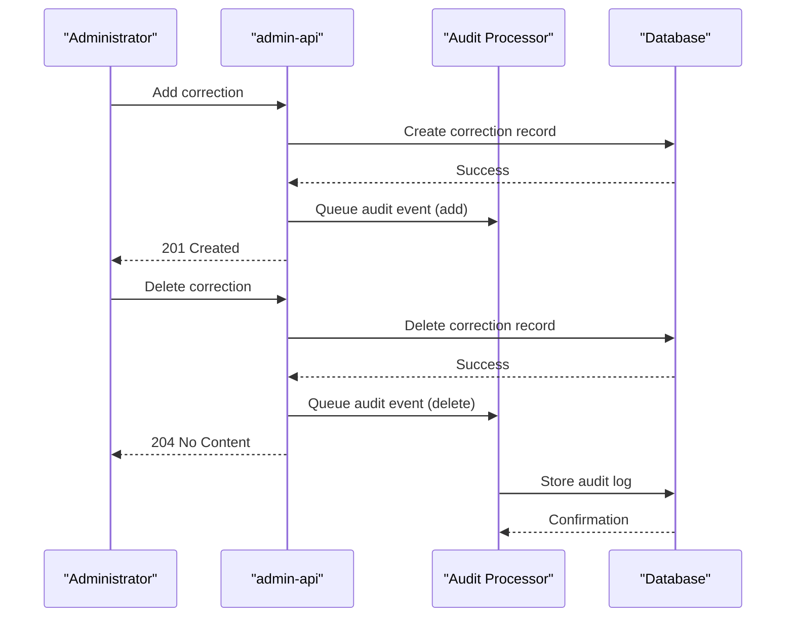

# CorrectionsManager

<cite>
**Referenced Files in This Document**   
- [CorrectionsManager.js](file://apps/admin-ui/components/CorrectionsManager.js)
- [corrections.js](file://apps/admin-ui/pages/guilds/[guildId]/corrections.js)
- [guilds.js](file://apps/admin-api/src/routes/guilds.js)
- [corrections.js](file://apps/admin-api/src/services/corrections.js)
- [schemas.js](file://apps/admin-api/src/lib/validation/schemas.js)
- [api.js](file://apps/admin-ui/lib/api.js)
- [rbac.js](file://apps/admin-api/src/middleware/rbac.js)
</cite>

## Table of Contents
1. [Introduction](#introduction)
2. [Component Overview](#component-overview)
3. [Component Props](#component-props)
4. [Internal State Logic](#internal-state-logic)
5. [API Interactions](#api-interactions)
6. [Usage Examples](#usage-examples)
7. [Batch Operations and Filtering](#batch-operations-and-filtering)
8. [Role-Based Access Control](#role-based-access-control)
9. [Error Handling](#error-handling)
10. [Accessibility Features](#accessibility-features)
11. [Audit Logging](#audit-logging)
12. [Conclusion](#conclusion)

## Introduction

The CorrectionsManager component in the admin-ui application provides a comprehensive interface for managing data correction workflows for club data. This component enables administrators to view, add, and remove corrections to club member metrics, ensuring data accuracy and integrity. The system supports both individual corrections through a form interface and bulk operations via CSV import, making it flexible for various administrative needs.

The component is integrated into the club corrections page and serves as the primary interface for data correction management. It displays pending corrections in a tabular format with relevant metadata, provides forms for adding new corrections, and supports batch operations for efficient data management. The system includes robust error handling, audit logging, and role-based access control to ensure secure and reliable operation.

**Section sources**
- [CorrectionsManager.js](file://apps/admin-ui/components/CorrectionsManager.js#L1-L197)
- [corrections.js](file://apps/admin-ui/pages/guilds/[guildId]/corrections.js#L1-L25)

## Component Overview

The CorrectionsManager component is a React functional component designed to manage data corrections for club members within a guild. It provides a user interface for viewing existing corrections, adding new corrections, and removing existing ones. The component is built with React hooks for state management and uses SWR for data fetching and revalidation.

The component renders three main sections: a form for adding new corrections, a batch CSV import interface, and a table displaying existing corrections. The form allows users to specify a display name, select a metric (total or sim), input a value, and provide an optional reason for the correction. The CSV import feature enables bulk operations by allowing users to paste CSV data with correction information.

The component is designed to be responsive and accessible, with proper keyboard navigation and screen reader support. It provides real-time feedback through status messages and includes a preview feature that parses and formats the input value using the parsePowerLite function, which supports suffixes like k, m, and b for thousands, millions, and billions respectively.

**Diagram sources**
- [CorrectionsManager.js](file://apps/admin-ui/components/CorrectionsManager.js#L95-L197)

**Section sources**
- [CorrectionsManager.js](file://apps/admin-ui/components/CorrectionsManager.js#L1-L197)

## Component Props

The CorrectionsManager component accepts a single prop:

- **guildId** (string): The unique identifier for the guild (Discord server) for which corrections are being managed. This prop is required for the component to function properly, as it determines which guild's corrections to display and manage.

The component uses the guildId prop to construct API endpoints for fetching and modifying corrections. When the guildId changes, the component automatically re-fetches the corrections data for the new guild. The component gracefully handles cases where the guildId is not yet available by conditionally rendering the UI elements only when the guildId is present.

The component is designed to be used within a page that provides the guildId through routing parameters, as demonstrated in the guild corrections page where the guildId is extracted from the URL using Next.js router.

**Section sources**
- [CorrectionsManager.js](file://apps/admin-ui/components/CorrectionsManager.js#L27-L32)
- [corrections.js](file://apps/admin-ui/pages/guilds/[guildId]/corrections.js#L12-L25)

## Internal State Logic

The CorrectionsManager component maintains several pieces of internal state using React's useState and useMemo hooks:

- **form** (object): Contains the current values of the correction form fields: displayName, metric, value, and reason. The metric field defaults to "total".
- **status** (string or null): Stores status messages to display to the user, such as "Saving…" during submission or error messages.
- **csvText** (string): Contains the text input for CSV batch import operations.
- **parsedPreview** (number or null): A computed value derived from the form's value field using the parsePowerLite function, which converts human-readable number formats (e.g., "1.5k") to actual numeric values.

The component uses the useSWR hook to manage the data fetching lifecycle, including loading states, error handling, and data revalidation. The mutate function from useSWR is used to trigger re-fetching of data after successful operations, ensuring the UI stays in sync with the server state.

The parsePowerLite function is a utility that parses input values with suffixes (k, m, b) into their numeric equivalents, providing a user-friendly way to input large numbers. This function handles various edge cases, including null/undefined inputs, empty strings, and invalid formats.

**Diagram sources**
- [CorrectionsManager.js](file://apps/admin-ui/components/CorrectionsManager.js#L34-L43)

**Section sources**
- [CorrectionsManager.js](file://apps/admin-ui/components/CorrectionsManager.js#L34-L43)

## API Interactions

The CorrectionsManager component interacts with the admin-api through several endpoints to manage corrections data:

- **GET /api/guilds/{guildId}/corrections**: Fetches the list of corrections for a specific guild. This endpoint is used by SWR to automatically fetch and cache data.
- **POST /api/guilds/{guildId}/corrections**: Creates a new correction for the specified guild.
- **DELETE /api/guilds/{guildId}/corrections/{correctionId}**: Removes a specific correction by its ID.

The component uses the useApi hook from the admin-ui library, which provides a convenient wrapper around the fetch API with CSRF token handling and error processing. All API requests include the CSRF token for security, and the component handles both successful operations and errors appropriately.

The data flow for adding a correction follows this sequence:
1. User submits the form
2. The addCorrection function prevents default form submission
3. Status is set to "Saving…"
4. API POST request is sent with the form data
5. On success: form is reset, data is revalidated, and status is updated
6. On error: error message is displayed in the status field

**Diagram sources**
- [CorrectionsManager.js](file://apps/admin-ui/components/CorrectionsManager.js#L45-L59)
- [api.js](file://apps/admin-ui/lib/api.js#L24-L60)
- [guilds.js](file://apps/admin-api/src/routes/guilds.js#L232-L288)

**Section sources**
- [CorrectionsManager.js](file://apps/admin-ui/components/CorrectionsManager.js#L29-L32)
- [api.js](file://apps/admin-ui/lib/api.js#L62-L69)

## Usage Examples

The CorrectionsManager component is used in the club corrections page, which is accessible at the route `/guilds/[guildId]/corrections`. This page wraps the CorrectionsManager component with a Layout component and provides the guildId from the URL parameters.

When used on the club corrections page, the component displays a notice indicating that corrections are also available in the dashboard's "Current Sheet" tab, providing users with multiple access points to the same functionality. The component is designed to be self-contained and reusable across different parts of the application.

A typical usage scenario involves an administrator identifying inaccurate data in club member metrics and using the CorrectionsManager to fix it. For example, if a member's total score is incorrectly recorded due to a data ingestion error, the administrator can use the form to add a correction with the correct value, specifying the reason for the correction.

The component can also be used for bulk operations. An administrator can prepare a CSV file with multiple corrections and use the batch import feature to apply them all at once, significantly reducing the time required for large-scale data corrections.

**Section sources**
- [corrections.js](file://apps/admin-ui/pages/guilds/[guildId]/corrections.js#L12-L25)
- [CorrectionsManager.js](file://apps/admin-ui/components/CorrectionsManager.js#L1-L197)

## Batch Operations and Filtering

The CorrectionsManager component supports batch operations through its CSV import functionality. Users can paste CSV data into a textarea with the format "displayName,metric,value,reason" (with reason being optional), then click the "Import CSV" button to process all corrections.

The importCsv function processes each line of the CSV input, parsing the comma-separated values and creating a correction for each valid entry. The function includes validation to ensure that required fields (displayName, metric, value) are present before attempting to create a correction. If any correction fails to import, the process stops and displays an error message indicating which correction failed and why.

The component does not currently implement client-side filtering of corrections, as this functionality is handled by the server. However, the underlying API supports query parameters for filtering corrections by weekId, allowing for time-based filtering when needed. The component displays all corrections for the current guild, ordered by creation date with the most recent corrections appearing first.

The batch import feature is particularly useful for administrators who need to apply multiple corrections based on external data sources or audit findings. It reduces the need for repetitive manual entry and minimizes the risk of input errors.

**Diagram sources**
- [CorrectionsManager.js](file://apps/admin-ui/components/CorrectionsManager.js#L72-L93)

**Section sources**
- [CorrectionsManager.js](file://apps/admin-ui/components/CorrectionsManager.js#L72-L93)

## Role-Based Access Control

The CorrectionsManager component enforces role-based access control through server-side middleware in the admin-api. The component itself does not implement access control, but relies on the API to reject unauthorized requests.

The admin-api uses the requireRole middleware to protect correction endpoints, requiring the "editor" role or higher for both creating and deleting corrections. This means that only users with editor, admin, or owner roles can modify corrections, while viewers can only see the data but not make changes.

The role hierarchy is defined as: viewer < editor < admin < owner, with each higher role inheriting the permissions of lower roles. This ensures that only appropriately privileged users can modify club data, maintaining data integrity and security.

The requireGuildAccess middleware ensures that users can only access corrections for guilds they have permission to view, preventing unauthorized access to other guilds' data. This is implemented by checking the user's guild membership against the requested guildId.

**Diagram sources**
- [rbac.js](file://apps/admin-api/src/middleware/rbac.js#L5-L29)
- [guilds.js](file://apps/admin-api/src/routes/guilds.js#L232-L288)

**Section sources**
- [rbac.js](file://apps/admin-api/src/middleware/rbac.js#L5-L29)
- [guilds.js](file://apps/admin-api/src/routes/guilds.js#L232-L288)

## Error Handling

The CorrectionsManager component implements comprehensive error handling for both client-side and server-side errors. All API interactions are wrapped in try-catch blocks to prevent unhandled promise rejections and provide meaningful feedback to users.

When an error occurs during a correction operation, the component captures the error message and displays it in the status field, replacing any previous status message. This provides immediate feedback to the user about what went wrong. For example, if a network error occurs or the server returns an error response, the user will see the specific error message rather than a generic failure notice.

The component also handles validation errors through the API's validation middleware. When a request fails validation (e.g., missing required fields or invalid data formats), the server returns a 400 Bad Request response with details about the validation errors, which are then displayed to the user.

The CSV import functionality includes additional error handling, stopping the import process at the first error and displaying a message that identifies which correction failed and why. This prevents partial imports that could leave the data in an inconsistent state.

**Diagram sources**
- [CorrectionsManager.js](file://apps/admin-ui/components/CorrectionsManager.js#L48-L58)
- [CorrectionsManager.js](file://apps/admin-ui/components/CorrectionsManager.js#L62-L69)
- [CorrectionsManager.js](file://apps/admin-ui/components/CorrectionsManager.js#L84-L87)

**Section sources**
- [CorrectionsManager.js](file://apps/admin-ui/components/CorrectionsManager.js#L48-L58)
- [CorrectionsManager.js](file://apps/admin-ui/components/CorrectionsManager.js#L62-L69)
- [CorrectionsManager.js](file://apps/admin-ui/components/CorrectionsManager.js#L84-L87)

## Accessibility Features

The CorrectionsManager component includes several accessibility features to ensure it can be used effectively by all users, including those using keyboard navigation and screen readers.

The component uses semantic HTML elements and ARIA attributes where appropriate. Form fields have proper labels or placeholder text, and interactive elements like buttons have descriptive text. The table displaying corrections uses proper table headers (th elements) to provide context for screen reader users.

Keyboard navigation is supported throughout the component. Users can navigate between form fields using the Tab key, submit the form using Enter, and interact with buttons using Space or Enter. The CSV import textarea can be focused and edited using keyboard navigation.

The component provides visual feedback for all operations through the status field, which is announced by screen readers when its content changes. This ensures that users are aware of the outcome of their actions, whether successful or not.

The layout uses appropriate spacing and contrast to ensure readability, and the responsive design ensures the component works well on various screen sizes and devices.

**Section sources**
- [CorrectionsManager.js](file://apps/admin-ui/components/CorrectionsManager.js#L95-L197)

## Audit Logging

The CorrectionsManager component's actions are fully audited through the admin-api's audit logging system. Every correction operation is recorded in the audit log, providing a complete history of changes for accountability and troubleshooting.

When a correction is added, the system records an audit event with the action "guild.corrections.add", including the payload with the correction details. When a correction is deleted, it records an event with the action "guild.corrections.delete", including the correction ID. These audit events include metadata such as the admin ID, guild ID, timestamp, and IP address.

The audit logging is implemented asynchronously through a queue processor, ensuring that logging does not block the main operation. This provides reliable audit trails without impacting the user experience. The audit system also includes error handling to ensure that audit logging failures do not cause the main operation to fail.

The audit logs can be used for compliance, security monitoring, and debugging purposes. Administrators can review the audit history to understand when and why corrections were made, which is particularly important for maintaining data integrity in the club data system.

**Diagram sources**
- [guilds.js](file://apps/admin-api/src/routes/guilds.js#L232-L288)
- [corrections.js](file://apps/admin-api/src/services/corrections.js#L12-L35)
- [audit-processor.js](file://apps/admin-api/src/lib/queues/audit-processor.js#L1-L46)

**Section sources**
- [guilds.js](file://apps/admin-api/src/routes/guilds.js#L232-L288)
- [corrections.js](file://apps/admin-api/src/services/corrections.js#L12-L35)

## Conclusion

The CorrectionsManager component provides a robust and user-friendly interface for managing data corrections in the club data system. It combines a clean, intuitive UI with powerful backend functionality to ensure data accuracy and integrity. The component supports both individual and bulk operations, making it flexible for various administrative needs.

Key features include real-time data synchronization through SWR, comprehensive error handling, role-based access control, and complete audit logging. The component is designed with accessibility in mind, ensuring it can be used effectively by all administrators regardless of their preferred interaction method.

The integration between the frontend component and backend API is well-designed, with clear separation of concerns and proper error handling at each layer. The system provides immediate feedback to users while maintaining data consistency and security through server-side validation and access control.

Overall, the CorrectionsManager component exemplifies a well-structured, maintainable, and user-centric approach to data management in a complex application environment.