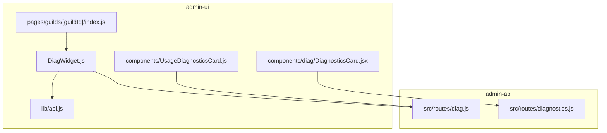
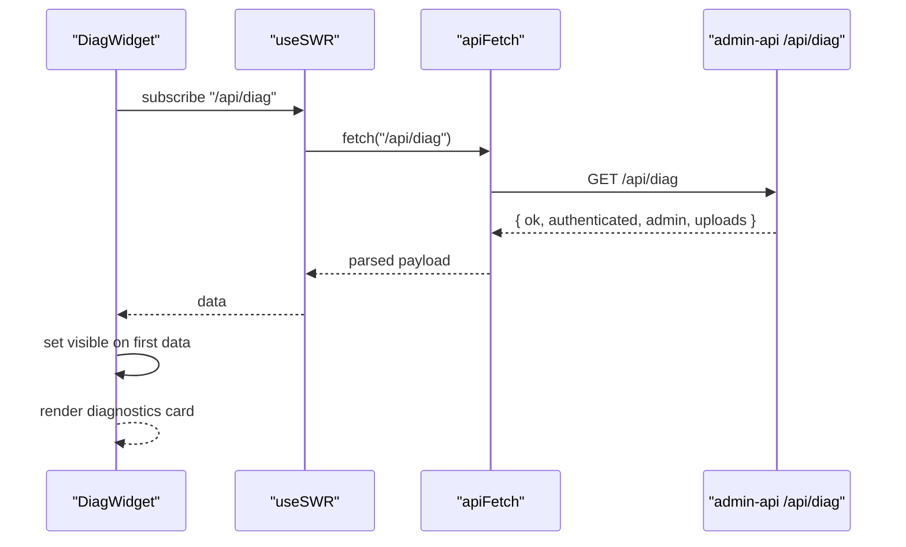
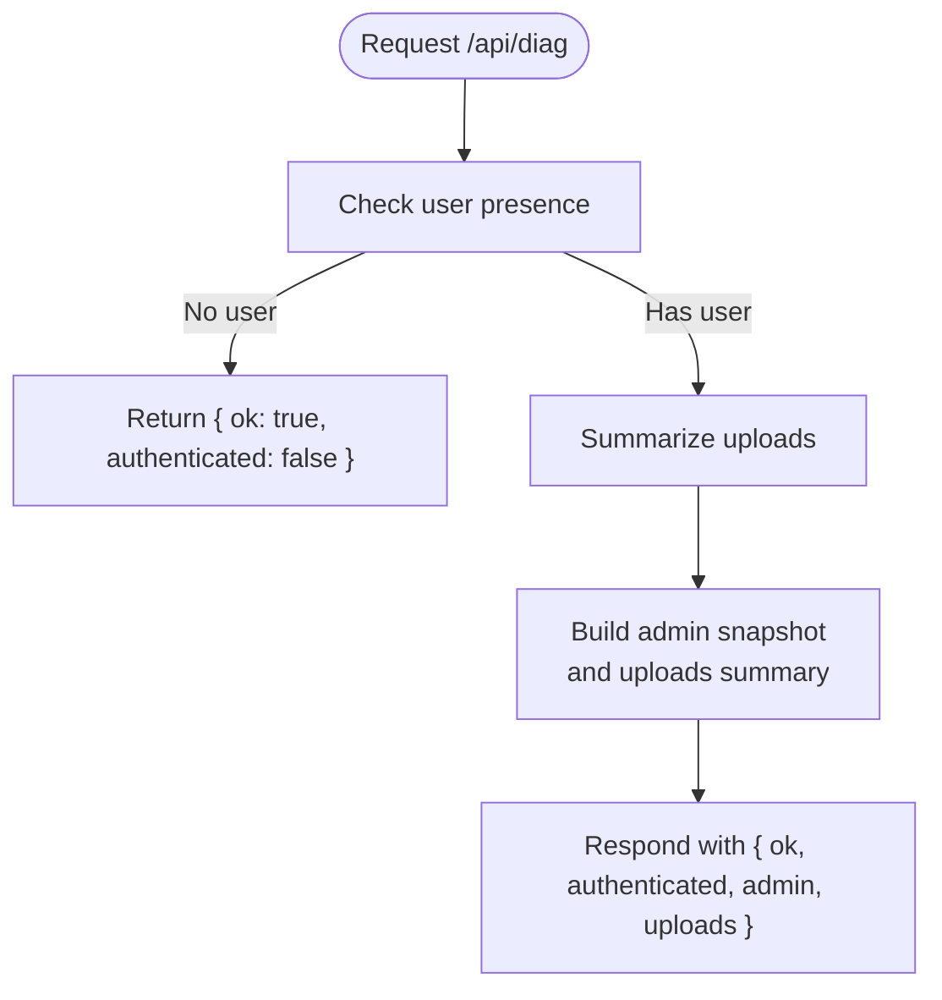
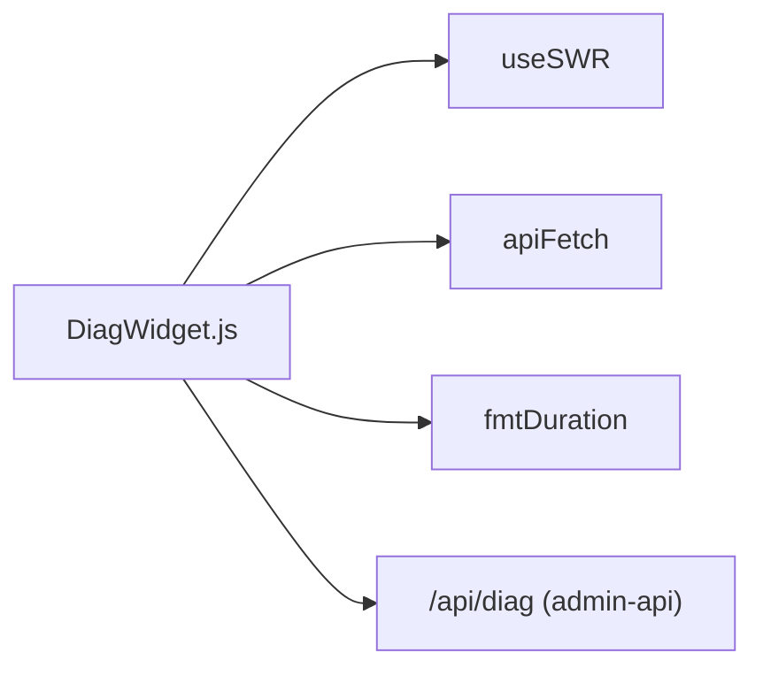

# DiagWidget

<cite>
**Referenced Files in This Document**
- [DiagWidget.js](file://apps/admin-ui/components/DiagWidget.js)
- [api.js](file://apps/admin-ui/lib/api.js)
- [socket.js](file://apps/admin-ui/lib/socket.js)
- [index.js](file://apps/admin-ui/pages/guilds/[guildId]/index.js)
- [diag.js](file://apps/admin-api/src/routes/diag.js)
- [diagnostics.js](file://apps/admin-api/src/routes/diagnostics.js)
- [DiagnosticsCard.jsx](file://apps/admin-ui/components/diag/DiagnosticsCard.jsx)
- [UsageDiagnosticsCard.js](file://apps/admin-ui/components/UsageDiagnosticsCard.js)
</cite>

## Table of Contents
1. [Introduction](#introduction)
2. [Project Structure](#project-structure)
3. [Core Components](#core-components)
4. [Architecture Overview](#architecture-overview)
5. [Detailed Component Analysis](#detailed-component-analysis)
6. [Dependency Analysis](#dependency-analysis)
7. [Performance Considerations](#performance-considerations)
8. [Troubleshooting Guide](#troubleshooting-guide)
9. [Conclusion](#conclusion)

## Introduction
DiagWidget is a lightweight React component in the admin-ui that displays system diagnostics and health metrics for the admin-api. It fetches data from the admin-api’s diagnostics endpoints and renders a compact summary card showing API uptime, memory usage, and upload activity. The component integrates with the admin-ui’s data fetching stack and is used on guild dashboard pages to provide quick visibility into backend health.

## Project Structure
DiagWidget resides in the admin-ui components directory and is consumed by guild dashboard pages. It relies on the admin-ui’s API client and SWR for data fetching. The admin-api exposes two complementary endpoints: a lightweight diagnostics endpoint for the UI and a richer diagnostics endpoint for internal use.

**Diagram sources**
- [DiagWidget.js](file://apps/admin-ui/components/DiagWidget.js#L1-L53)
- [api.js](file://apps/admin-ui/lib/api.js#L1-L70)
- [index.js](file://apps/admin-ui/pages/guilds/[guildId]/index.js#L1-L120)
- [DiagnosticsCard.jsx](file://apps/admin-ui/components/diag/DiagnosticsCard.jsx#L1-L75)
- [UsageDiagnosticsCard.js](file://apps/admin-ui/components/UsageDiagnosticsCard.js#L1-L79)
- [diag.js](file://apps/admin-api/src/routes/diag.js#L1-L55)
- [diagnostics.js](file://apps/admin-api/src/routes/diagnostics.js#L1-L79)

**Section sources**
- [DiagWidget.js](file://apps/admin-ui/components/DiagWidget.js#L1-L53)
- [index.js](file://apps/admin-ui/pages/guilds/[guildId]/index.js#L1-L120)

## Core Components
- DiagWidget: Fetches and renders diagnostics data from the admin-api /api/diag endpoint. It uses SWR for polling and visibility control to avoid rendering until data is available.
- DiagnosticsCard: A similar card component that consumes the admin-api /api/diagnostics endpoint for richer metrics.
- UsageDiagnosticsCard: A separate diagnostics card for OpenAI usage metrics, distinct from DiagWidget.

Key responsibilities:
- Data fetching via apiFetch and SWR.
- Conditional rendering based on data availability and authentication status.
- Formatting durations and numeric values for readability.

**Section sources**
- [DiagWidget.js](file://apps/admin-ui/components/DiagWidget.js#L1-L53)
- [DiagnosticsCard.jsx](file://apps/admin-ui/components/diag/DiagnosticsCard.jsx#L1-L75)
- [UsageDiagnosticsCard.js](file://apps/admin-ui/components/UsageDiagnosticsCard.js#L1-L79)

## Architecture Overview
DiagWidget participates in a client-server architecture where the admin-ui polls the admin-api for diagnostics. The admin-api aggregates metrics and returns a structured payload. The UI component renders a minimal, readable summary.

**Diagram sources**
- [DiagWidget.js](file://apps/admin-ui/components/DiagWidget.js#L1-L53)
- [api.js](file://apps/admin-ui/lib/api.js#L1-L70)
- [diag.js](file://apps/admin-api/src/routes/diag.js#L1-L55)

## Detailed Component Analysis

### DiagWidget Component
Purpose:
- Display system diagnostics and health metrics for the admin-api.
- Provide a lightweight summary of uptime, memory, and upload counts.

Props:
- None. The component is self-contained and reads from the admin-api via SWR.

Internal state:
- visible: A boolean flag toggled when data becomes available to prevent early rendering.
- data: Fetched from /api/diag via SWR.

Rendering logic:
- If not visible or data.ok is false, the component returns null.
- Otherwise, it renders a styled card containing:
  - API Uptime formatted via fmtDuration.
  - Memory RSS usage (if available).
  - Uploads today and total uploads.

Integration points:
- Uses apiFetch for network requests.
- Uses fmtDuration for human-readable time formatting.
- Consumes admin-api /api/diag endpoint.

Real-time data sources:
- The component uses SWR with a refreshInterval to poll for updates. There is no explicit WebSocket integration in DiagWidget itself.

Accessibility:
- The component renders plain text and styled divs. No explicit ARIA attributes are used. Consider adding aria-live regions or labels if integrating into larger accessible layouts.

Responsive design:
- The component applies inline styles for padding, borders, and shadows. These are not media-query driven. For responsive layouts, rely on parent containers and global CSS classes.

**Section sources**
- [DiagWidget.js](file://apps/admin-ui/components/DiagWidget.js#L1-L53)
- [api.js](file://apps/admin-ui/lib/api.js#L1-L70)

### Data Fetching and Formatting
- apiFetch handles CSRF tokens, credentials, and content-type headers. It parses JSON or text responses and throws on non-OK status.
- fmtDuration converts seconds into a human-readable string (e.g., days/hours/minutes/seconds).

**Section sources**
- [api.js](file://apps/admin-ui/lib/api.js#L1-L70)

### Admin-API Endpoints
- /api/diag: Returns diagnostics payload including admin snapshot and uploads summary. Used by DiagWidget.
- /api/diagnostics: Returns richer diagnostics for internal use. Used by DiagnosticsCard.

**Diagram sources**
- [diag.js](file://apps/admin-api/src/routes/diag.js#L1-L55)

**Section sources**
- [diag.js](file://apps/admin-api/src/routes/diag.js#L1-L55)
- [diagnostics.js](file://apps/admin-api/src/routes/diagnostics.js#L1-L79)

### Usage in Guild Dashboard
DiagWidget is used alongside other metrics on the guild dashboard page. The page fetches:
- Health metrics via /api/guilds/:id/health.
- Diagnostics via /api/diag.

It also demonstrates live logs streaming for tasks, which complements DiagWidget’s polling approach.

**Section sources**
- [index.js](file://apps/admin-ui/pages/guilds/[guildId]/index.js#L1-L120)

### Socket Integration Notes
While DiagWidget itself does not use sockets, the admin-ui provides a socket client module. This can be used for real-time features elsewhere in the application. DiagWidget remains a polling-based component.

**Section sources**
- [socket.js](file://apps/admin-ui/lib/socket.js#L1-L21)

## Dependency Analysis
- Internal dependencies:
  - React hooks: useEffect, useState.
  - SWR: useSWR for data fetching and polling.
  - Local API client: apiFetch for HTTP requests.
  - Utility: fmtDuration for time formatting.

- External dependencies:
  - admin-api /api/diag endpoint for diagnostics data.

**Diagram sources**
- [DiagWidget.js](file://apps/admin-ui/components/DiagWidget.js#L1-L53)
- [api.js](file://apps/admin-ui/lib/api.js#L1-L70)
- [diag.js](file://apps/admin-api/src/routes/diag.js#L1-L55)

**Section sources**
- [DiagWidget.js](file://apps/admin-ui/components/DiagWidget.js#L1-L53)
- [api.js](file://apps/admin-ui/lib/api.js#L1-L70)

## Performance Considerations
- Polling cadence: DiagWidget sets a 60-second refresh interval. This balances freshness with reduced load on the admin-api.
- Visibility guard: The component delays rendering until data arrives, avoiding unnecessary DOM updates.
- Minimal re-renders: The component only re-renders when data changes.
- Caching on the server: The admin-api caches diagnostics responses to reduce repeated computation.

Optimization opportunities:
- Consider debouncing or throttling if multiple widgets poll frequently.
- Introduce exponential backoff on retry if the admin-api is slow or unavailable.
- Use IntersectionObserver to pause polling when the widget is off-screen.

[No sources needed since this section provides general guidance]

## Troubleshooting Guide
Common issues and resolutions:
- No data displayed:
  - Ensure the user is authenticated; unauthenticated requests return a non-error payload indicating lack of authentication.
  - Verify the admin-api is reachable and the /api/diag endpoint is mounted.
- Incorrect or stale metrics:
  - Confirm the refreshInterval is appropriate for your needs.
  - Check server-side caching TTL and ensure it aligns with expectations.
- Network errors:
  - Inspect apiFetch behavior for non-OK responses and CSRF token handling.
- Formatting issues:
  - Confirm uptime values are numeric and pass through fmtDuration correctly.

**Section sources**
- [DiagWidget.js](file://apps/admin-ui/components/DiagWidget.js#L1-L53)
- [api.js](file://apps/admin-ui/lib/api.js#L1-L70)
- [diag.js](file://apps/admin-api/src/routes/diag.js#L1-L55)

## Conclusion
DiagWidget provides a concise, reliable way to surface admin-api diagnostics in the admin-ui. It leverages SWR for polling, apiFetch for robust HTTP handling, and a simple rendering model to communicate uptime, memory, and upload metrics. While it does not integrate with WebSockets, its polling approach is straightforward and efficient. For broader observability, consider combining DiagWidget with dedicated cards for OpenAI usage and other system metrics.