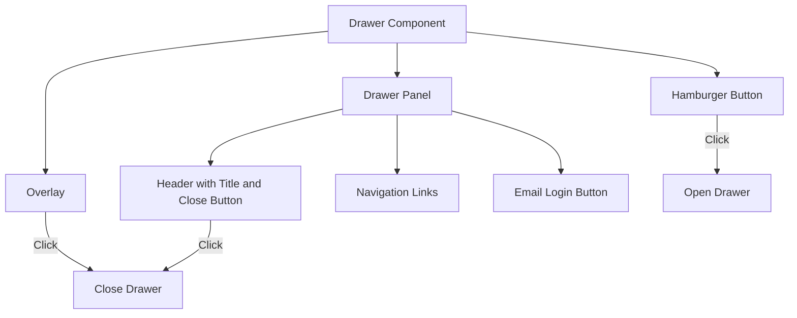
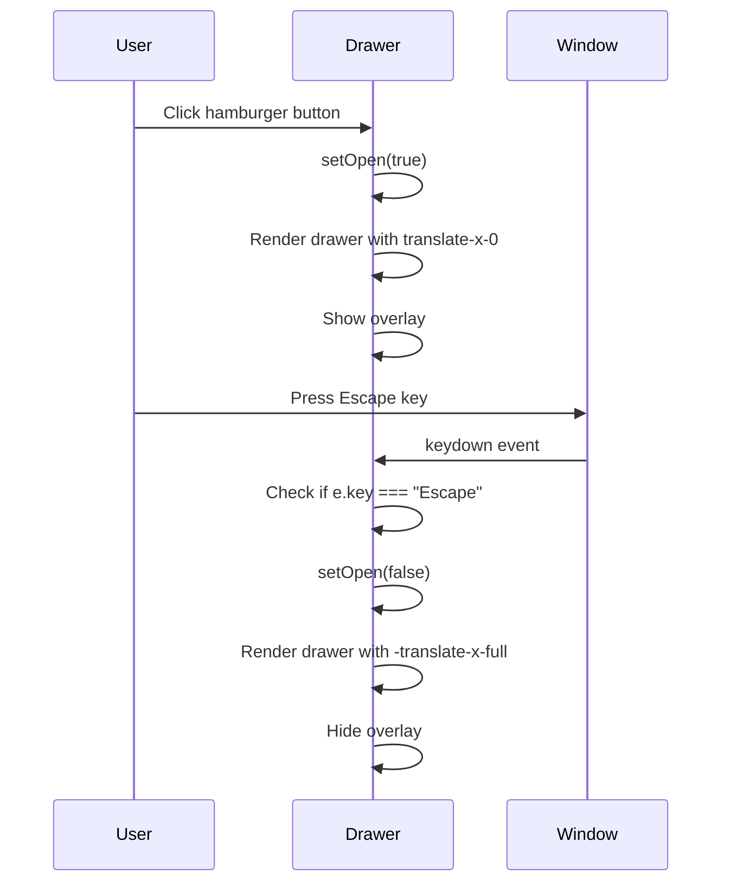
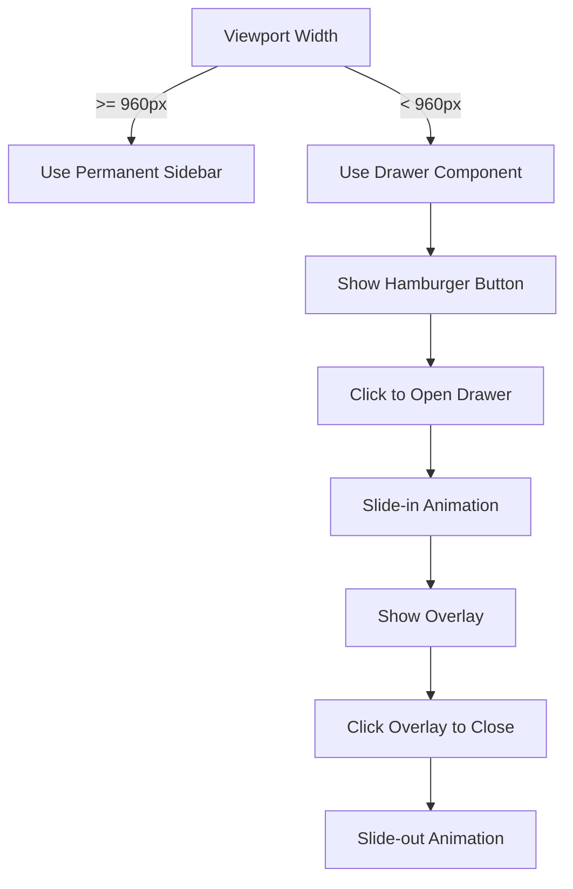
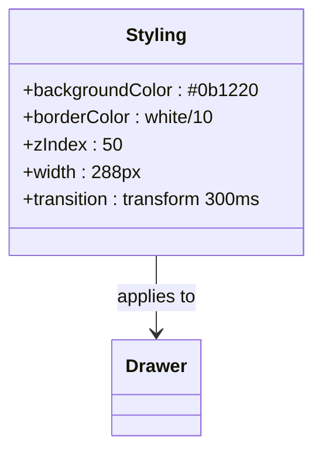

# Drawer

<cite>
**Referenced Files in This Document**   
- [Drawer.js](file://apps/admin-ui/components/Drawer.js)
- [Layout.js](file://apps/admin-ui/components/Layout.js)
- [globals.css](file://apps/admin-ui/styles/globals.css)
- [mobile.css](file://apps/admin-ui/styles/mobile.css)
- [responsive.css](file://apps/admin-ui/styles/responsive.css)
</cite>

## Table of Contents
1. [Introduction](#introduction)
2. [Component Overview](#component-overview)
3. [Props and Configuration](#props-and-configuration)
4. [State Management](#state-management)
5. [Navigation Integration](#navigation-integration)
6. [Responsive Behavior](#responsive-behavior)
7. [Accessibility Features](#accessibility-features)
8. [Performance Considerations](#performance-considerations)
9. [Theming and Styling](#theming-and-styling)
10. [Usage Examples](#usage-examples)

## Introduction

The Drawer component in the admin-ui application serves as a primary navigation container for both mobile and desktop interfaces. It provides a slide-in panel that contains navigation links and user actions, accessible through a hamburger menu button. The component is designed with responsive behavior, ensuring optimal user experience across different device sizes. This documentation details the component's functionality, props, state management, and integration patterns within the application.

## Component Overview

The Drawer component is a reusable navigation panel that slides in from the left side of the screen. It is implemented as a React functional component using useState and useEffect hooks for state management and side effects. The component renders a hamburger menu button that triggers the drawer's visibility, an overlay that covers the main content when the drawer is open, and the drawer panel itself containing navigation links and an email login button.

The drawer's visual design follows a dark theme with cyan and white accents, consistent with the application's overall aesthetic. It features a smooth slide-in animation with a 300ms transition duration, providing a polished user experience. The component is designed to be accessible, with proper aria-labels and keyboard navigation support.



**Diagram sources**
- [Drawer.js](file://apps/admin-ui/components/Drawer.js#L1-L72)

**Section sources**
- [Drawer.js](file://apps/admin-ui/components/Drawer.js#L1-L72)

## Props and Configuration

The Drawer component accepts two props: children and emailLoginHref. The children prop is used to pass navigation links and other content to be rendered within the drawer's navigation section. The emailLoginHref prop is optional and defaults to "/email", specifying the URL path for the email login button.

The component's structure is divided into three main sections: the hamburger button that triggers the drawer, the semi-transparent overlay that appears when the drawer is open, and the drawer panel itself. The drawer panel contains a header with the application title and a close button, a navigation area for the children content, and a footer with the email login button.

```mermaid
classDiagram
class Drawer {
+children ReactNode
+emailLoginHref string
-open boolean
-setOpen function
+render()
}
Drawer --> "1" "0..*" ReactNode : contains
Drawer --> "1" "1" Overlay : uses
Drawer --> "1" "1" DrawerPanel : uses
DrawerPanel --> "1" "1" Header : contains
DrawerPanel --> "1" "1" Navigation : contains
DrawerPanel --> "1" "1" Footer : contains
```

**Diagram sources**
- [Drawer.js](file://apps/admin-ui/components/Drawer.js#L1-L72)

**Section sources**
- [Drawer.js](file://apps/admin-ui/components/Drawer.js#L1-L72)

## State Management

The Drawer component manages its open/closed state using React's useState hook. The open state is initialized to false, meaning the drawer is closed by default. When the hamburger button is clicked, the setOpen function is called with true, setting the open state to true and triggering a re-render that displays the drawer.

The component also uses useEffect to add a global event listener for the Escape key. When the Escape key is pressed, the close function is called, setting the open state to false and closing the drawer. This effect is cleaned up when the component unmounts by removing the event listener, preventing memory leaks.

The state management is minimal and focused on the drawer's visibility, with no additional state variables. This simplicity ensures predictable behavior and makes the component easy to understand and maintain. The state changes trigger CSS transitions that animate the drawer's entrance and exit, providing visual feedback to the user.



**Diagram sources**
- [Drawer.js](file://apps/admin-ui/components/Drawer.js#L1-L72)

**Section sources**
- [Drawer.js](file://apps/admin-ui/components/Drawer.js#L1-L72)

## Navigation Integration

The Drawer component is integrated with React Router through the use of Next.js's Link component. The email login button in the drawer's footer is implemented as a Link that navigates to the emailLoginHref path when clicked. This integration ensures that navigation within the application is handled efficiently, with client-side routing that avoids full page reloads.

The component is designed to be flexible in its navigation content, accepting any React nodes as children. This allows parent components to pass custom navigation links and menus based on the user's role and permissions. The Layout component uses this flexibility to render different navigation options for admin and non-admin users.

The drawer's navigation area has a fixed maximum height calculated as "calc(100vh - 140px)", ensuring that the content is scrollable on smaller screens while leaving space for the header and footer. This responsive design prevents the navigation content from overflowing the viewport and maintains usability across different device sizes.

**Section sources**
- [Drawer.js](file://apps/admin-ui/components/Drawer.js#L1-L72)
- [Layout.js](file://apps/admin-ui/components/Layout.js#L1-L368)

## Responsive Behavior

The Drawer component exhibits different behaviors on mobile and desktop interfaces, adapting to the available screen space. On desktop, the component is typically not used as the Layout component provides a permanent sidebar. On mobile devices, the drawer becomes the primary navigation mechanism, sliding in from the left when triggered.

The responsive behavior is controlled through CSS media queries and conditional rendering in the Layout component. When the viewport width is below 960px, the Layout component hides the permanent sidebar and relies on the Drawer component for navigation. The drawer's width is set to 288px (w-72), which is optimized for mobile touch targets while not consuming too much screen space.

The component supports touch gestures on mobile devices, allowing users to swipe to open and close the drawer. Clicking the overlay or the close button also closes the drawer, providing multiple ways to dismiss it. This multi-modal interaction design enhances usability and accommodates different user preferences.



**Diagram sources**
- [Drawer.js](file://apps/admin-ui/components/Drawer.js#L1-L72)
- [globals.css](file://apps/admin-ui/styles/globals.css#L384-L433)
- [mobile.css](file://apps/admin-ui/styles/mobile.css#L129-L178)

**Section sources**
- [Drawer.js](file://apps/admin-ui/components/Drawer.js#L1-L72)
- [globals.css](file://apps/admin-ui/styles/globals.css#L384-L433)
- [mobile.css](file://apps/admin-ui/styles/mobile.css#L129-L178)

## Accessibility Features

The Drawer component incorporates several accessibility features to ensure it can be used by all users, including those with disabilities. The hamburger button has an aria-label of "Open menu" and contains a visually hidden span with the same text, providing context for screen readers. The close button in the drawer header has a similar aria-label of "Close menu".

Keyboard navigation is supported through the Escape key listener added via useEffect. Users can close the drawer by pressing Escape, which is a common convention for dismissing modal dialogs and overlays. The component also responds to clicks on the overlay, providing an alternative way to close the drawer without requiring precise mouse movements.

Focus management is handled implicitly by the browser, with focus remaining on the triggering button when the drawer is closed. The drawer's content is structured with appropriate HTML elements, including a nav element for the navigation links, which helps screen readers understand the page structure. The component uses semantic class names and ARIA attributes to enhance accessibility.

**Section sources**
- [Drawer.js](file://apps/admin-ui/components/Drawer.js#L1-L72)

## Performance Considerations

The Drawer component is designed with performance in mind, minimizing re-renders and optimizing rendering of complex content. The component uses React's useState and useEffect hooks efficiently, with the effect dependency array left empty to ensure the event listener is only added once when the component mounts.

The drawer's content is rendered only when the drawer is open, thanks to the conditional rendering of the overlay and drawer panel. This prevents unnecessary rendering of navigation content when the drawer is closed, improving performance, especially when the navigation contains complex components or large lists.

For applications with complex content within the drawer, the component could be enhanced with React.memo to prevent unnecessary re-renders when props haven't changed. Additionally, lazy loading of navigation content could be implemented for routes that are not immediately needed, further improving initial load performance.

The CSS transitions used for the slide-in animation are optimized for performance, using the transform property which is hardware-accelerated in most browsers. The transition duration of 300ms provides a smooth animation without being too slow, striking a balance between visual appeal and responsiveness.

**Section sources**
- [Drawer.js](file://apps/admin-ui/components/Drawer.js#L1-L72)

## Theming and Styling

The Drawer component's visual appearance is defined through CSS classes and inline styles, with colors and dimensions specified using Tailwind CSS utility classes and custom CSS variables. The background color is set to a dark blue (#0b1220) with a border on the right side at 10% white opacity, creating a subtle separation from the main content.

The component uses a z-index of 50 for the drawer and 40 for the overlay, ensuring proper stacking order with other elements in the application. The fixed positioning keeps the drawer in place even when the main content is scrolled, maintaining consistent navigation access.

Theming options are limited in the current implementation, with colors and dimensions hardcoded in the component. However, the design could be extended to support theme customization through props or CSS variables, allowing different color schemes to be applied without modifying the component code.

The component's styling is responsive, with media queries in globals.css and mobile.css adjusting the layout for smaller screens. The drawer's width is fixed at 288px, which is a reasonable size for mobile touch targets while not consuming too much screen space on larger devices.



**Diagram sources**
- [Drawer.js](file://apps/admin-ui/components/Drawer.js#L1-L72)
- [globals.css](file://apps/admin-ui/styles/globals.css)
- [mobile.css](file://apps/admin-ui/styles/mobile.css)

**Section sources**
- [Drawer.js](file://apps/admin-ui/components/Drawer.js#L1-L72)
- [globals.css](file://apps/admin-ui/styles/globals.css)
- [mobile.css](file://apps/admin-ui/styles/mobile.css)

## Usage Examples

The Drawer component is used throughout the admin-ui application as the primary navigation mechanism on mobile devices. In the Layout component, it is conditionally rendered based on the viewport size and user permissions. For admin users, the drawer contains links to various administrative functions such as dashboard, settings, channels, personality, and usage.

The component is instantiated with navigation links passed as children, allowing for flexible content composition. The emailLoginHref prop can be customized to point to different login endpoints if needed. The component's simplicity and flexibility make it easy to integrate into different parts of the application.

Example usage in a page component:
```jsx
<Drawer emailLoginHref="/custom-email-login">
  <Link href="/dashboard">Dashboard</Link>
  <Link href="/settings">Settings</Link>
  <Link href="/profile">Profile</Link>
</Drawer>
```

The component's design patterns follow React best practices, with clear separation of concerns and minimal state management. Its integration with Next.js routing and responsive design make it a robust solution for mobile navigation in the admin-ui application.

**Section sources**
- [Drawer.js](file://apps/admin-ui/components/Drawer.js#L1-L72)
- [Layout.js](file://apps/admin-ui/components/Layout.js#L1-L368)