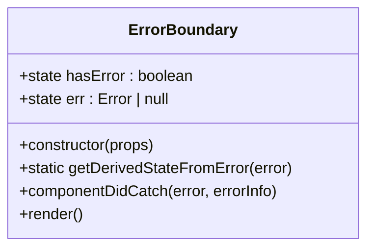
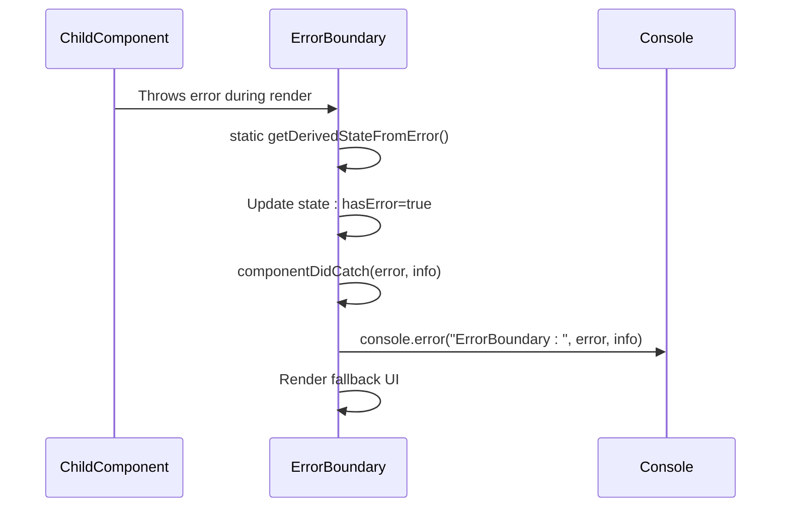
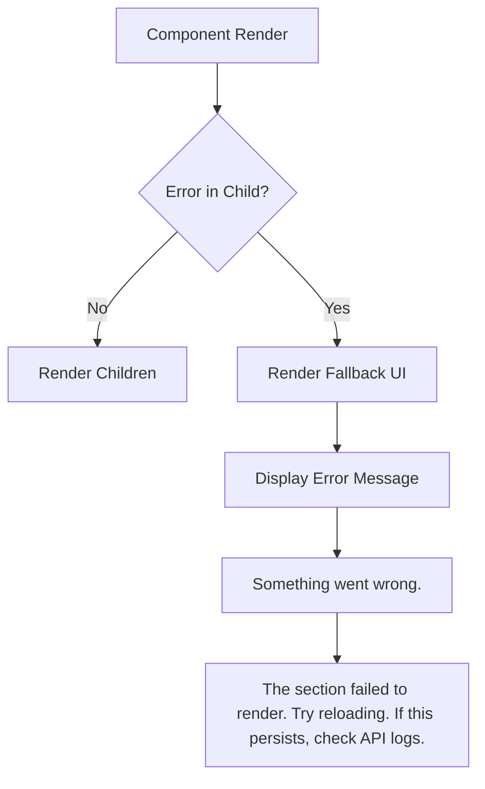
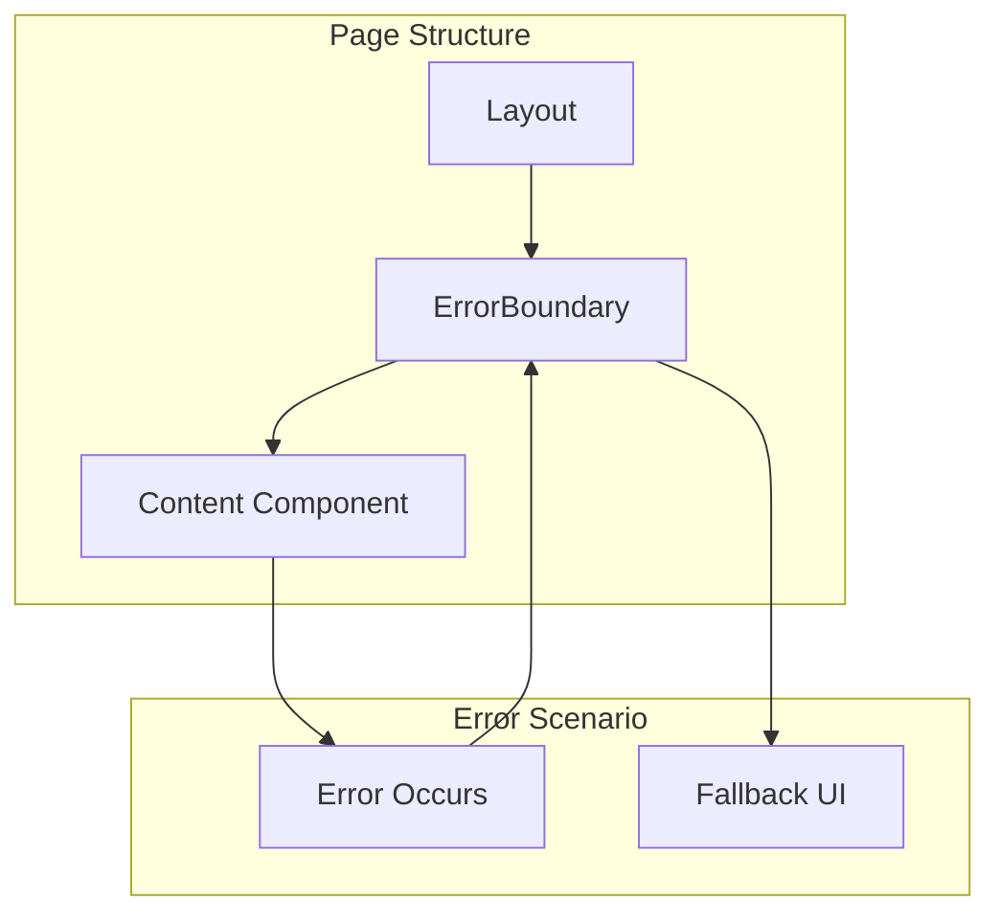

# ErrorBoundary

<cite>
**Referenced Files in This Document**   
- [ErrorBoundary.js](file://apps/admin-ui/components/ErrorBoundary.js)
- [Layout.js](file://apps/admin-ui/components/Layout.js)
- [guilds/[guildId]/index.js](file://apps/admin-ui/pages/guilds/[guildId]/index.js)
- [index.js](file://apps/admin-ui/pages/index.js)
- [guilds/index.js](file://apps/admin-ui/pages/guilds/index.js)
</cite>

## Table of Contents
1. [Introduction](#introduction)
2. [Core Implementation](#core-implementation)
3. [Component Lifecycle Methods](#component-lifecycle-methods)
4. [Error State Management](#error-state-management)
5. [Fallback UI Rendering](#fallback-ui-rendering)
6. [Usage Examples](#usage-examples)
7. [Integration with Error Reporting](#integration-with-error-reporting)
8. [Limitations of Error Boundaries](#limitations-of-error-boundaries)
9. [Best Practices](#best-practices)
10. [Conclusion](#conclusion)

## Introduction
The ErrorBoundary component in the admin-ui application implements React's error boundary pattern to gracefully handle runtime errors in child components. This component serves as a safety net for the application, preventing complete UI crashes when individual components fail to render. The implementation follows React's recommended approach for error boundaries, using lifecycle methods to detect, capture, and handle errors that occur during rendering.

The ErrorBoundary component is designed to be wrapped around sections of the UI that may be prone to errors, particularly those involving dynamic data fetching or complex rendering logic. When an error occurs in a child component, the ErrorBoundary intercepts it, updates its internal state, and renders a fallback UI instead of the broken component tree. This allows users to continue interacting with other parts of the application while being informed about the specific section that failed.

**Section sources**
- [ErrorBoundary.js](file://apps/admin-ui/components/ErrorBoundary.js)

## Core Implementation
The ErrorBoundary component is implemented as a class component that extends React.Component. This implementation choice is necessary as error boundaries are only possible with class components in React. The component maintains an internal state with two properties: hasError and err, which track whether an error has occurred and store the error object respectively.

The implementation follows React's error boundary specification by defining two lifecycle methods: getDerivedStateFromError and componentDidCatch. The getDerivedStateFromError method is a static method that updates the component's state when an error is detected, while componentDidCatch provides additional error handling capabilities including access to error information.

**Diagram sources**
- [ErrorBoundary.js](file://apps/admin-ui/components/ErrorBoundary.js#L3-L20)

**Section sources**
- [ErrorBoundary.js](file://apps/admin-ui/components/ErrorBoundary.js#L3-L20)

## Component Lifecycle Methods
The ErrorBoundary component utilizes React's lifecycle methods to handle errors effectively. The constructor initializes the component's state with hasError set to false and err set to null, establishing the initial "no error" state.

The static getDerivedStateFromError method is called when an error is thrown in a child component during rendering. This method receives the error object as a parameter and returns a new state object that sets hasError to true and stores the error in the err property. This method is crucial as it allows the component to update its state during the render phase, triggering a re-render with the fallback UI.

The componentDidCatch method is invoked after an error has been captured and the state has been updated. This method receives both the error object and an errorInfo object containing the component stack trace. In the current implementation, this method logs the error details to the console, providing valuable information for debugging purposes.

**Diagram sources**
- [ErrorBoundary.js](file://apps/admin-ui/components/ErrorBoundary.js#L3-L7)

**Section sources**
- [ErrorBoundary.js](file://apps/admin-ui/components/ErrorBoundary.js#L3-L7)

## Error State Management
The ErrorBoundary component manages error state through its internal state object, which contains two key properties: hasError and err. The hasError flag serves as a boolean indicator of whether an error has occurred in the component's child tree, while the err property stores the actual error object for potential debugging or logging purposes.

State transitions occur through the getDerivedStateFromError static method, which is called by React when an error is thrown in a child component. This method returns a new state object with hasError set to true and the err property populated with the caught error. The state update triggers a re-render, allowing the component to switch from rendering its children to displaying the fallback UI.

The current implementation maintains a simple error state model, focusing on the essential functionality of error detection and fallback rendering. The state is not reset automatically, meaning that once an error occurs, the fallback UI will continue to be displayed until the component is unmounted and remounted, or until a parent component forces a re-render.

**Section sources**
- [ErrorBoundary.js](file://apps/admin-ui/components/ErrorBoundary.js#L3-L5)

## Fallback UI Rendering
When an error occurs in a child component, the ErrorBoundary renders a fallback UI that informs users of the issue while maintaining the overall application structure. The fallback UI is a simple, styled div element that displays a clear error message and guidance for users.

The fallback UI consists of two main elements: a bold heading that states "Something went wrong" and a secondary message that provides additional context: "The section failed to render. Try reloading. If this persists, check API logs." This messaging is designed to be user-friendly while also providing actionable steps for resolving the issue.

The visual styling of the fallback UI includes padding, a subtle border with rounded corners, and appropriate typography to ensure it is clearly distinguishable from regular content while maintaining the application's overall aesthetic. The styling is implemented using inline styles, which is appropriate for this simple component.

**Diagram sources**
- [ErrorBoundary.js](file://apps/admin-ui/components/ErrorBoundary.js#L8-L16)

**Section sources**
- [ErrorBoundary.js](file://apps/admin-ui/components/ErrorBoundary.js#L8-L16)

## Usage Examples
The ErrorBoundary component is designed to be used as a wrapper around sections of the UI that may be prone to errors, particularly those involving dynamic data or complex rendering logic. While the component is defined in the codebase, analysis of the page components suggests that it is not currently being utilized in the main application pages.

The component could be integrated into various parts of the application, such as around data-fetching components, complex UI sections, or third-party integrations that might fail. For example, it could wrap the GuildDashboard component in the guilds/[guildId]/index.js file to protect against errors when loading guild-specific data.

Potential usage patterns include wrapping individual tabs or sections within a page, allowing users to continue interacting with unaffected parts of the interface when one section fails. It could also be used at the page level to prevent complete page crashes due to component rendering errors.

**Diagram sources**
- [ErrorBoundary.js](file://apps/admin-ui/components/ErrorBoundary.js)
- [Layout.js](file://apps/admin-ui/components/Layout.js)
- [guilds/[guildId]/index.js](file://apps/admin-ui/pages/guilds/[guildId]/index.js)

**Section sources**
- [ErrorBoundary.js](file://apps/admin-ui/components/ErrorBoundary.js)
- [Layout.js](file://apps/admin-ui/components/Layout.js)
- [guilds/[guildId]/index.js](file://apps/admin-ui/pages/guilds/[guildId]/index.js)

## Integration with Error Reporting
The current implementation of the ErrorBoundary component includes basic error logging through console.error statements in the componentDidCatch method. This provides developers with immediate feedback about errors that occur in the application, including both the error object and component stack trace information.

While the component currently only logs errors to the console, it provides a foundation that could be extended to integrate with external error reporting services like Sentry. The componentDidCatch method serves as a natural hook for sending error reports to such services, allowing for centralized error tracking and monitoring.

To integrate with an error reporting service, the componentDidCatch method could be enhanced to send the error details to the service's API. This would enable features such as error grouping, frequency tracking, and integration with alerting systems. The error information captured by the component, including the component stack trace, would be valuable for diagnosing and fixing issues.

The current implementation demonstrates a simple but effective approach to error handling, with clear opportunities for enhancement through integration with more sophisticated error monitoring tools.

**Section sources**
- [ErrorBoundary.js](file://apps/admin-ui/components/ErrorBoundary.js#L6)

## Limitations of Error Boundaries
React error boundaries have several important limitations that developers should be aware of when implementing and using them. The ErrorBoundary component in this application is subject to these same limitations.

First, error boundaries only catch errors that occur during rendering, in lifecycle methods, or in constructors of the component tree below them. They do not catch errors that occur in event handlers, asynchronous code (such as setTimeout or requestAnimationFrame callbacks), server-side rendering, or within the error boundary component itself.

Second, error boundaries cannot recover from errors in the same render cycle. Once an error is caught and the fallback UI is rendered, the component remains in the error state until it is unmounted and remounted, or until a parent component forces a re-render. This means that users cannot simply "retry" the failed component without a full page refresh or navigation away and back.

Third, error boundaries work at the component level, not at the individual element level. If a small part of a large component fails, the entire component (and all its children) will be replaced with the fallback UI, potentially removing significant functionality from the user interface.

These limitations highlight the importance of thoughtful error boundary placement and the need for complementary error handling strategies for different types of errors.

**Section sources**
- [ErrorBoundary.js](file://apps/admin-ui/components/ErrorBoundary.js)

## Best Practices
Implementing effective error boundaries requires following several best practices to ensure they enhance user experience without introducing additional issues. The current ErrorBoundary component demonstrates some of these practices while leaving room for improvement in others.

One key best practice is to provide clear, user-friendly error messages that explain what went wrong and suggest actionable steps for resolution. The current implementation does this well with its message suggesting users try reloading and checking API logs if issues persist.

Another important practice is to log errors for debugging purposes, which the component does through console.error statements. However, for production applications, it would be beneficial to enhance this with integration to a dedicated error reporting service.

Error boundaries should be placed strategically around components that are most likely to fail, rather than wrapping the entire application. This allows users to continue using unaffected parts of the interface when a specific section fails. The component is designed to be reusable and composable, making it suitable for wrapping individual sections or tabs within a page.

Additional best practices that could be implemented include providing retry functionality, offering alternative content when possible, and ensuring the fallback UI maintains the application's visual consistency.

**Section sources**
- [ErrorBoundary.js](file://apps/admin-ui/components/ErrorBoundary.js)

## Conclusion
The ErrorBoundary component in the admin-ui application provides a solid foundation for handling runtime errors in React components. By implementing React's error boundary pattern, it protects the application from complete UI crashes when individual components fail to render.

The component effectively uses React's lifecycle methods to detect and handle errors, maintaining a simple state model and providing a clear fallback UI for users. While currently limited to console logging for error reporting, the implementation provides a strong base that could be extended to integrate with external error monitoring services.

Strategic placement of the ErrorBoundary component around high-risk sections of the UI would enhance the application's resilience and improve the user experience during failures. By following best practices for error boundary implementation, the component can help maintain application stability and provide users with clear guidance when issues occur.

**Section sources**
- [ErrorBoundary.js](file://apps/admin-ui/components/ErrorBoundary.js)