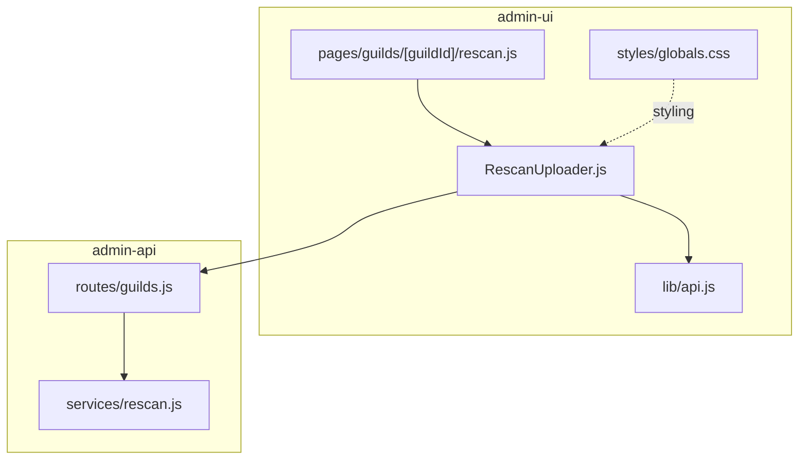
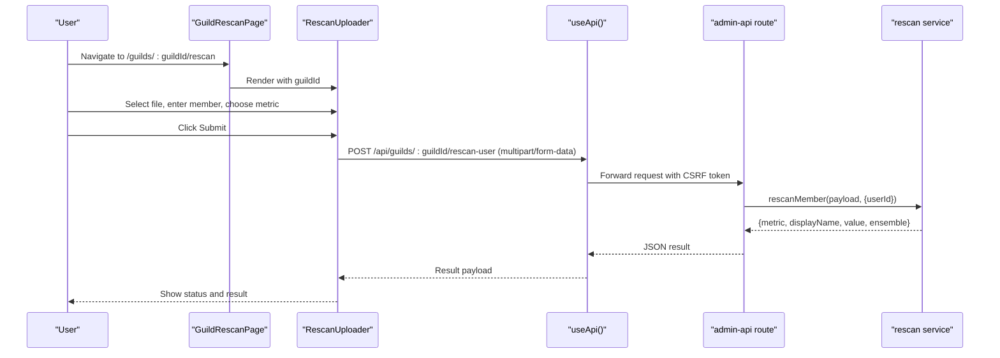
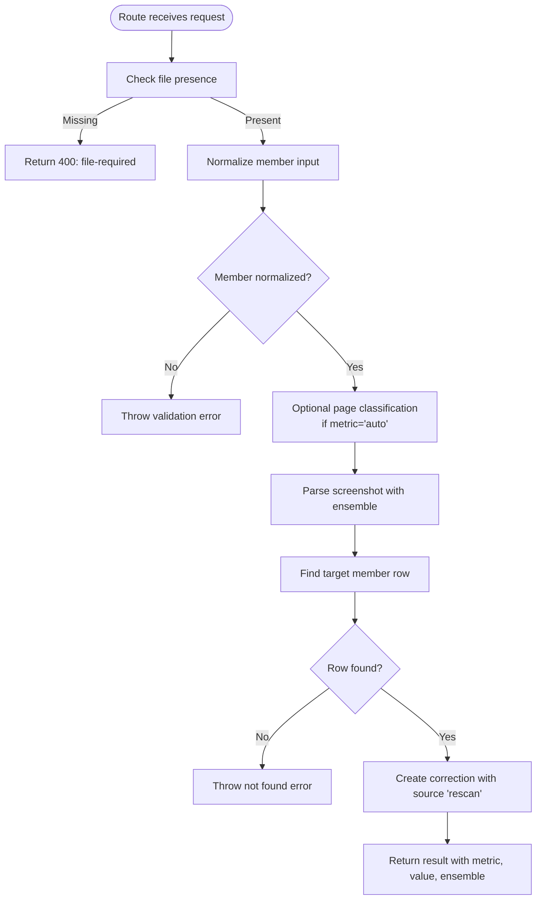
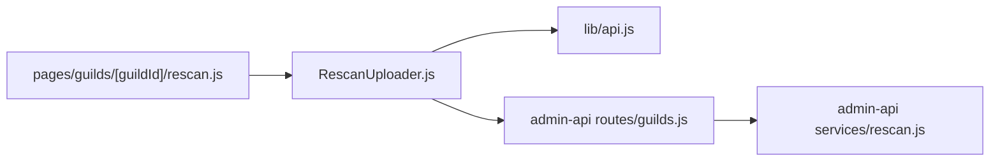

# RescanUploader

<cite>
**Referenced Files in This Document**
- [RescanUploader.js](file://apps/admin-ui/components/RescanUploader.js)
- [rescan.js](file://apps/admin-ui/pages/guilds/[guildId]/rescan.js)
- [api.js](file://apps/admin-ui/lib/api.js)
- [guilds.js](file://apps/admin-api/src/routes/guilds.js)
- [rescan.js](file://apps/admin-api/src/services/rescan.js)
- [globals.css](file://apps/admin-ui/styles/globals.css)
- [GuildUploadsTab.js](file://apps/admin-ui/components/GuildUploadsTab.js)
</cite>

## Table of Contents
1. [Introduction](#introduction)
2. [Project Structure](#project-structure)
3. [Core Components](#core-components)
4. [Architecture Overview](#architecture-overview)
5. [Detailed Component Analysis](#detailed-component-analysis)
6. [Dependency Analysis](#dependency-analysis)
7. [Performance Considerations](#performance-considerations)
8. [Troubleshooting Guide](#troubleshooting-guide)
9. [Conclusion](#conclusion)
10. [Appendices](#appendices)

## Introduction
RescanUploader is a React component in the admin-ui application that enables administrators to trigger a targeted rescan operation for a specific guild member’s screenshot. It accepts a screenshot image, a member identifier, and a metric selection, then submits them to the admin-api to recompute and persist corrected metrics. The component displays real-time status updates and presents the parsed result, including ensemble disagreement metadata.

## Project Structure
RescanUploader lives in the admin-ui application and integrates with the admin-api backend. The page that hosts the component extracts the guild identifier from the URL and passes it down to the component. The admin-api exposes a dedicated endpoint for rescan requests and delegates the heavy lifting to internal services.

**Diagram sources**
- [RescanUploader.js](file://apps/admin-ui/components/RescanUploader.js#L1-L92)
- [rescan.js](file://apps/admin-ui/pages/guilds/[guildId]/rescan.js#L1-L25)
- [api.js](file://apps/admin-ui/lib/api.js#L1-L70)
- [guilds.js](file://apps/admin-api/src/routes/guilds.js#L290-L345)
- [rescan.js](file://apps/admin-api/src/services/rescan.js#L1-L85)

**Section sources**
- [RescanUploader.js](file://apps/admin-ui/components/RescanUploader.js#L1-L92)
- [rescan.js](file://apps/admin-ui/pages/guilds/[guildId]/rescan.js#L1-L25)
- [api.js](file://apps/admin-ui/lib/api.js#L1-L70)
- [guilds.js](file://apps/admin-api/src/routes/guilds.js#L290-L345)
- [rescan.js](file://apps/admin-api/src/services/rescan.js#L1-L85)

## Core Components
- RescanUploader: A client-side component that renders a form with file upload, member input, metric selector, and submit button. It manages local state for the selected file, member display name, metric choice, result, and status. It posts multipart/form-data to the admin-api endpoint and displays the response.
- Page container: The guild rescan page extracts the guildId from the URL and renders the RescanUploader with the guild identifier.
- API client: Provides a CSRF-aware fetch wrapper used by RescanUploader to communicate with the admin-api.
- Backend routes: The admin-api route validates the request, enforces RBAC and CSRF, parses the uploaded image, and invokes the rescan service.
- Rescan service: Orchestrates image classification, parsing, and correction creation, returning a structured result.

**Section sources**
- [RescanUploader.js](file://apps/admin-ui/components/RescanUploader.js#L1-L92)
- [rescan.js](file://apps/admin-ui/pages/guilds/[guildId]/rescan.js#L1-L25)
- [api.js](file://apps/admin-ui/lib/api.js#L1-L70)
- [guilds.js](file://apps/admin-api/src/routes/guilds.js#L290-L345)
- [rescan.js](file://apps/admin-api/src/services/rescan.js#L1-L85)

## Architecture Overview
The RescanUploader component participates in a straightforward request-response flow:
- The page component resolves the guildId from the URL and passes it to RescanUploader.
- RescanUploader composes FormData and calls the admin-api endpoint for the given guild.
- The admin-api route validates the request, ensures the user has appropriate permissions, and forwards the payload to the rescan service.
- The rescan service performs OCR-like parsing, determines the metric automatically or from user input, and persists a correction for the member.

**Diagram sources**
- [rescan.js](file://apps/admin-ui/pages/guilds/[guildId]/rescan.js#L1-L25)
- [RescanUploader.js](file://apps/admin-ui/components/RescanUploader.js#L1-L92)
- [api.js](file://apps/admin-ui/lib/api.js#L1-L70)
- [guilds.js](file://apps/admin-api/src/routes/guilds.js#L290-L345)
- [rescan.js](file://apps/admin-api/src/services/rescan.js#L1-L85)

## Detailed Component Analysis

### Props and Behavior
- guildId: Required. Passed from the page to identify the target guild for the rescan operation.
- Internal state:
  - file: Selected image file from the file input.
  - member: Display name or identifier for the member to rescan.
  - metric: Metric selection ("auto", "total", "sim").
  - result: Last successful response payload.
  - status: Human-readable status messages.

Validation and submission:
- The component checks that both file and member are present before posting.
- It constructs FormData with the file, member, and metric, then posts to the admin-api endpoint.
- On success, it stores the result and sets a completion status; on error, it displays the error message and clears the result.

Integration with admin-api:
- Uses the useApi hook to send a POST request with multipart/form-data.
- The backend route expects a single file and the member identifier plus optional metric.

Result rendering:
- Displays a formatted summary of the parsed member, metric, and value.
- Shows ensemble metadata indicating disagreement counts among parsing models.

Accessibility and styling:
- Uses standard HTML form controls with classes from the global stylesheet.
- No explicit ARIA attributes are defined in the component itself.

Responsive behavior:
- The component is embedded in a page that applies global responsive styles. The form has a maximum width constraint suitable for desktop and tablet layouts.

Drag-and-drop interactions:
- The component does not implement drag-and-drop. It relies on a standard file input. The uploads tab component demonstrates a separate drag-and-drop pattern using a hidden input and click-to-open behavior.

**Section sources**
- [RescanUploader.js](file://apps/admin-ui/components/RescanUploader.js#L1-L92)
- [rescan.js](file://apps/admin-ui/pages/guilds/[guildId]/rescan.js#L1-L25)
- [api.js](file://apps/admin-ui/lib/api.js#L1-L70)
- [globals.css](file://apps/admin-ui/styles/globals.css#L236-L242)
- [GuildUploadsTab.js](file://apps/admin-ui/components/GuildUploadsTab.js#L1-L155)

### Backend Endpoint and Service Flow
The admin-api route enforces:
- Authentication and guild access.
- Editor role requirement.
- CSRF protection.
- File upload validation via multer with a 6 MB limit.
- Body parsing for member, metric, and optional weekId.

The service layer:
- Validates that both file and member input are present.
- Normalizes the member identifier.
- Converts the buffer to a data URL for vision processing.
- Optionally classifies the page type to determine metric if "auto" is selected.
- Parses the screenshot using an ensemble parser to extract rows and values.
- Locates the target member row and creates a correction with source "rescan".
- Returns a structured result including metric, canonical member key, display name, value, and ensemble metadata.

**Diagram sources**
- [guilds.js](file://apps/admin-api/src/routes/guilds.js#L290-L345)
- [rescan.js](file://apps/admin-api/src/services/rescan.js#L1-L85)

**Section sources**
- [guilds.js](file://apps/admin-api/src/routes/guilds.js#L290-L345)
- [rescan.js](file://apps/admin-api/src/services/rescan.js#L1-L85)

### Usage Examples
- From the guild rescan page:
  - The page extracts guildId from the URL and renders RescanUploader with that ID.
  - Users can select a screenshot, enter the member’s display name, choose a metric, and submit.
  - The component shows status updates and the resulting parsed metric/value.

- Extending for additional file types:
  - Modify the file input accept attribute to include other image formats.
  - Adjust the backend route to accept additional MIME types and update validation accordingly.

- Extending for additional backend integrations:
  - Add new metric options or fields in the frontend form.
  - Extend the backend route to accept new parameters and forward them to the service.
  - Update the service to support new parsing modes or correction sources.

**Section sources**
- [rescan.js](file://apps/admin-ui/pages/guilds/[guildId]/rescan.js#L1-L25)
- [RescanUploader.js](file://apps/admin-ui/components/RescanUploader.js#L1-L92)
- [guilds.js](file://apps/admin-api/src/routes/guilds.js#L290-L345)

## Dependency Analysis
- RescanUploader depends on:
  - useApi from the admin-ui API client for CSRF-protected requests.
  - The admin-api route for the rescan-user endpoint.
  - The rescan service for parsing and correction creation.
- The page component depends on Next.js routing to resolve guildId and pass it to the uploader.

**Diagram sources**
- [RescanUploader.js](file://apps/admin-ui/components/RescanUploader.js#L1-L92)
- [api.js](file://apps/admin-ui/lib/api.js#L1-L70)
- [guilds.js](file://apps/admin-api/src/routes/guilds.js#L290-L345)
- [rescan.js](file://apps/admin-api/src/services/rescan.js#L1-L85)
- [rescan.js](file://apps/admin-ui/pages/guilds/[guildId]/rescan.js#L1-L25)

**Section sources**
- [RescanUploader.js](file://apps/admin-ui/components/RescanUploader.js#L1-L92)
- [api.js](file://apps/admin-ui/lib/api.js#L1-L70)
- [guilds.js](file://apps/admin-api/src/routes/guilds.js#L290-L345)
- [rescan.js](file://apps/admin-api/src/services/rescan.js#L1-L85)
- [rescan.js](file://apps/admin-ui/pages/guilds/[guildId]/rescan.js#L1-L25)

## Performance Considerations
- Image size: The backend enforces a 6 MB file size limit for uploads. Large images increase processing time and memory usage.
- Parsing complexity: Ensemble parsing involves multiple model evaluations. Metric selection affects downstream processing.
- Network latency: The component displays status updates during upload and parsing. Consider adding progress indicators if needed.
- Caching: The page does not implement caching for the rescan result; subsequent submissions will trigger a new computation.

[No sources needed since this section provides general guidance]

## Troubleshooting Guide
Common issues and resolutions:
- Missing file or member:
  - The component prevents submission if either is missing and shows a status message. Ensure both fields are filled.
- Validation errors from backend:
  - The route returns 400 with a specific error code if the file is missing. Verify the file input and that FormData is constructed correctly.
- Permission errors:
  - The route requires authentication and editor role. Ensure the user is logged in and has the required permissions for the guild.
- Parsing failures:
  - If the member is not found in the parsed rows, the service throws an error. Confirm the member display name matches the screenshot content.
- CSRF failures:
  - The API client attaches CSRF tokens for non-GET requests. Ensure the session is active and the CSRF token is available.

**Section sources**
- [RescanUploader.js](file://apps/admin-ui/components/RescanUploader.js#L1-L92)
- [guilds.js](file://apps/admin-api/src/routes/guilds.js#L290-L345)
- [rescan.js](file://apps/admin-api/src/services/rescan.js#L1-L85)
- [api.js](file://apps/admin-ui/lib/api.js#L1-L70)

## Conclusion
RescanUploader provides a focused, user-friendly interface for administrators to rescan a single member’s screenshot within a guild. It integrates cleanly with the admin-api, enforcing robust validation and permission checks while delivering clear status and results. The component’s simplicity makes it easy to extend for additional file types or backend integrations.

[No sources needed since this section summarizes without analyzing specific files]

## Appendices

### Props Reference
- guildId: string | undefined
  - Required. The guild identifier passed from the page.

**Section sources**
- [rescan.js](file://apps/admin-ui/pages/guilds/[guildId]/rescan.js#L1-L25)
- [RescanUploader.js](file://apps/admin-ui/components/RescanUploader.js#L1-L92)

### Events and Callbacks
- None. The component is self-contained and does not expose custom event callbacks.

**Section sources**
- [RescanUploader.js](file://apps/admin-ui/components/RescanUploader.js#L1-L92)

### Backend Integration Details
- Endpoint: POST /api/guilds/:guildId/rescan-user
  - Requires: authenticated user, guild access, editor role, CSRF token.
  - Body: multipart/form-data with fields:
    - file: image file (PNG, JPEG, WebP)
    - member: string (display name or identifier)
    - metric: "auto" | "total" | "sim"
    - weekId: optional string
- Response: JSON object containing metric, displayName, value, and ensemble metadata.

**Section sources**
- [guilds.js](file://apps/admin-api/src/routes/guilds.js#L290-L345)
- [rescan.js](file://apps/admin-api/src/services/rescan.js#L1-L85)

### Accessibility and Drag-and-Drop Notes
- Accessibility:
  - The component uses standard HTML form controls. Consider adding explicit labels and ARIA attributes for improved accessibility.
- Drag-and-drop:
  - The component does not implement drag-and-drop. The uploads tab demonstrates a click-to-open file input pattern. If drag-and-drop is desired, integrate a drop zone and manage focus and keyboard interactions.

**Section sources**
- [RescanUploader.js](file://apps/admin-ui/components/RescanUploader.js#L1-L92)
- [GuildUploadsTab.js](file://apps/admin-ui/components/GuildUploadsTab.js#L1-L155)

### Responsive Behavior
- The component resides within a page that applies global responsive styles. The form has a maximum width constraint suitable for desktop and tablet layouts. Mobile responsiveness is handled by the page-level styles.

**Section sources**
- [globals.css](file://apps/admin-ui/styles/globals.css#L236-L242)
- [rescan.js](file://apps/admin-ui/pages/guilds/[guildId]/rescan.js#L1-L25)