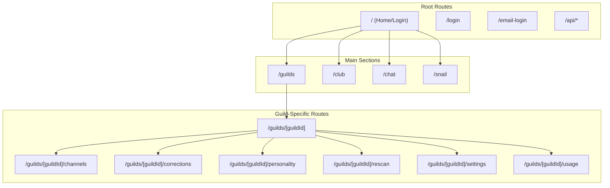
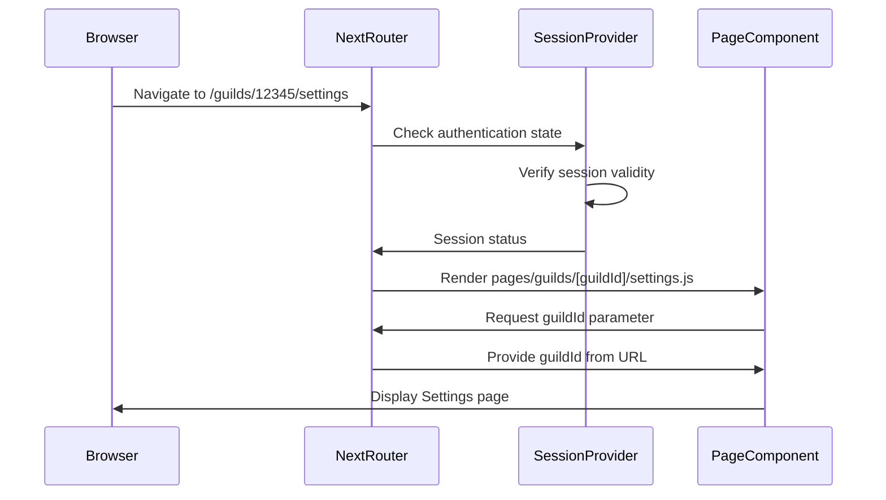
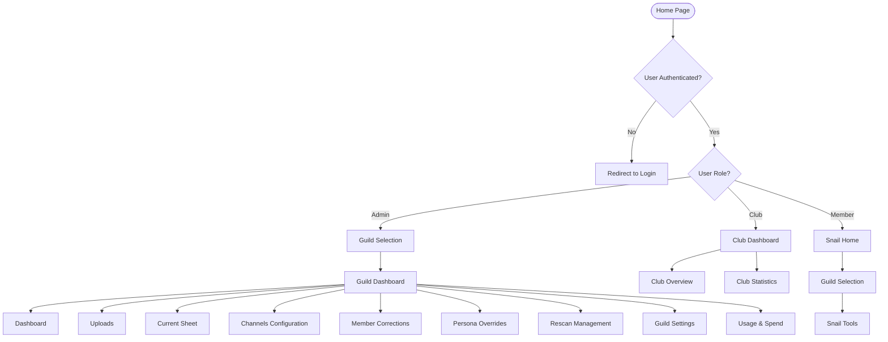
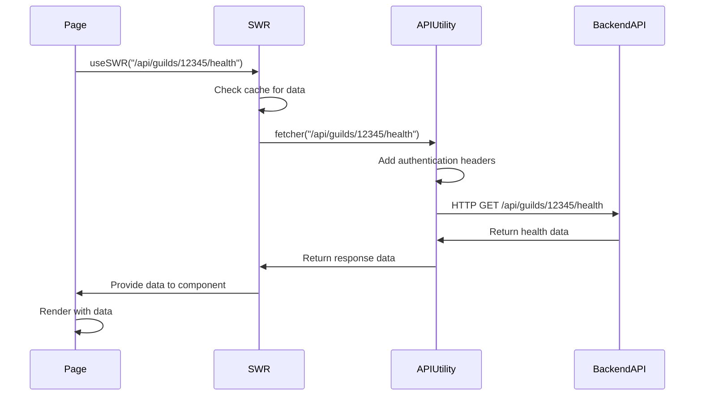
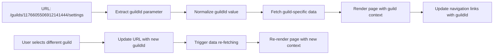
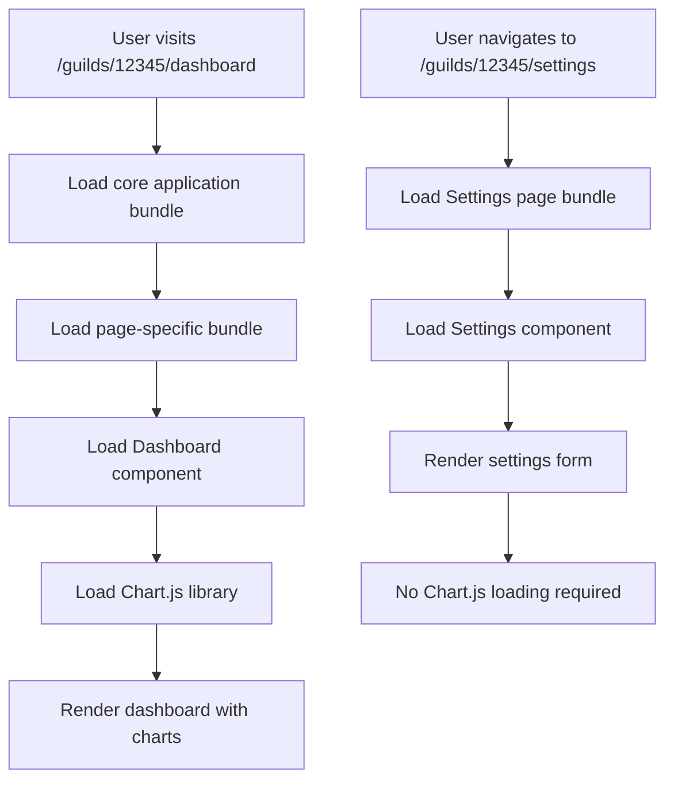
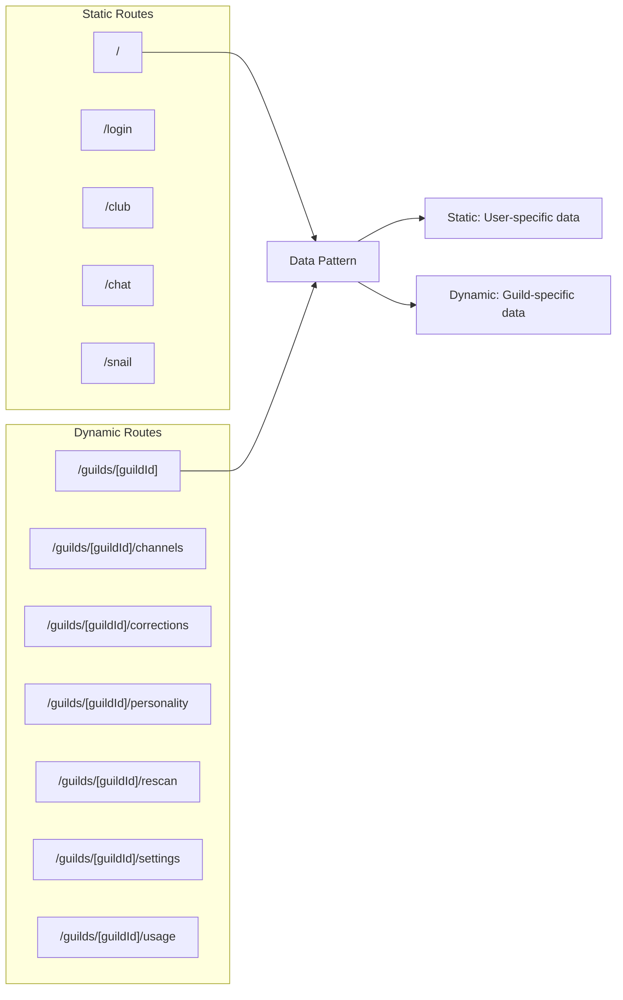
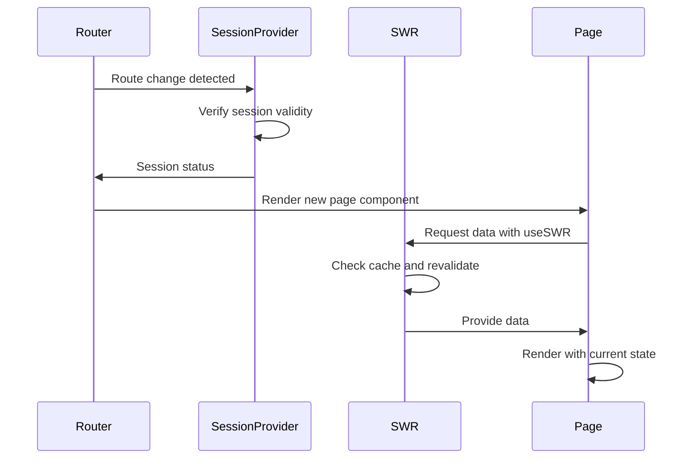

# Routing and Page Structure

<cite>
**Referenced Files in This Document**   
- [pages/_app.js](file://apps/admin-ui/pages/_app.js)
- [pages/index.js](file://apps/admin-ui/pages/index.js)
- [pages/guilds/index.js](file://apps/admin-ui/pages/guilds/index.js)
- [pages/guilds/[guildId]/index.js](file://apps/admin-ui/pages/guilds/[guildId]/index.js)
- [pages/guilds/[guildId]/channels.js](file://apps/admin-ui/pages/guilds/[guildId]/channels.js)
- [pages/guilds/[guildId]/corrections.js](file://apps/admin-ui/pages/guilds/[guildId]/corrections.js)
- [pages/guilds/[guildId]/personality.js](file://apps/admin-ui/pages/guilds/[guildId]/personality.js)
- [pages/guilds/[guildId]/rescan.js](file://apps/admin-ui/pages/guilds/[guildId]/rescan.js)
- [pages/guilds/[guildId]/settings.js](file://apps/admin-ui/pages/guilds/[guildId]/settings.js)
- [pages/guilds/[guildId]/usage.js](file://apps/admin-ui/pages/guilds/[guildId]/usage.js)
- [pages/chat/index.js](file://apps/admin-ui/pages/chat/index.js)
- [pages/club/index.js](file://apps/admin-ui/pages/club/index.js)
- [pages/snail/index.js](file://apps/admin-ui/pages/snail/index.js)
- [lib/session.js](file://apps/admin-ui/lib/session.js)
- [lib/api.js](file://apps/admin-ui/lib/api.js)
</cite>

## Table of Contents
1. [Introduction](#introduction)
2. [Project Structure and Routing System](#project-structure-and-routing-system)
3. [Core Routing Mechanism](#core-routing-mechanism)
4. [Page Hierarchy and Navigation Patterns](#page-hierarchy-and-navigation-patterns)
5. [Data Fetching Patterns](#data-fetching-patterns)
6. [Route Parameters and Dynamic Routing](#route-parameters-and-dynamic-routing)
7. [Code Splitting and Lazy Loading](#code-splitting-and-lazy-loading)
8. [Static vs Dynamic Routes](#static-vs-dynamic-routes)
9. [Integration with Application State](#integration-with-application-state)
10. [Conclusion](#conclusion)

## Introduction
The admin-ui application implements a comprehensive routing system built on Next.js, designed to manage administrative access to guild-specific resources within a Discord bot ecosystem. This document details the routing architecture, page structure, navigation patterns, and data handling mechanisms that enable administrators to manage server configurations, monitor usage, and perform maintenance tasks. The system combines static routes for general application sections with dynamic routes for guild-specific administration, creating a flexible and scalable interface for managing multiple Discord servers.

## Project Structure and Routing System
The admin-ui application follows a conventional Next.js pages directory structure, with routes defined by the file system hierarchy. The routing system is implemented through the pages directory, where each file or directory corresponds to a specific route in the application. The structure includes static routes for general application sections and dynamic routes for guild-specific administration.

**Diagram sources**
- [pages/index.js](file://apps/admin-ui/pages/index.js)
- [pages/guilds/index.js](file://apps/admin-ui/pages/guilds/index.js)
- [pages/guilds/[guildId]/index.js](file://apps/admin-ui/pages/guilds/[guildId]/index.js)

**Section sources**
- [pages/index.js](file://apps/admin-ui/pages/index.js)
- [pages/guilds/index.js](file://apps/admin-ui/pages/guilds/index.js)
- [pages/guilds/[guildId]/index.js](file://apps/admin-ui/pages/guilds/[guildId]/index.js)

## Core Routing Mechanism
The admin-ui application leverages Next.js' file-based routing system, where the pages directory structure directly maps to the application's URL structure. The routing mechanism combines static routes for general application sections with dynamic routes using bracket notation for guild-specific pages. The application uses client-side navigation through Next.js' Router component, enabling seamless transitions between pages without full page reloads.

The routing system is initialized through the _app.js file, which wraps all pages with the SessionProvider component to manage authentication state across route changes. This ensures that user session information is consistently available throughout the application, regardless of the current route.

**Diagram sources**
- [pages/_app.js](file://apps/admin-ui/pages/_app.js)
- [pages/guilds/[guildId]/settings.js](file://apps/admin-ui/pages/guilds/[guildId]/settings.js)
- [lib/session.js](file://apps/admin-ui/lib/session.js)

**Section sources**
- [pages/_app.js](file://apps/admin-ui/pages/_app.js)
- [lib/session.js](file://apps/admin-ui/lib/session.js)

## Page Hierarchy and Navigation Patterns
The admin-ui application implements a hierarchical navigation structure with multiple entry points and role-based access patterns. The primary navigation flow begins at the home page, where authenticated users are presented with a list of accessible guilds. From this central hub, users can navigate to guild-specific administration pages or access specialized tools based on their permission level.

The application implements three main administrative sections: the comprehensive guild dashboard for full administrators, the club dashboard for limited administrators, and the snail tools for basic members. Each section provides different levels of access and functionality based on the user's role within each guild.

**Diagram sources**
- [pages/index.js](file://apps/admin-ui/pages/index.js)
- [pages/guilds/index.js](file://apps/admin-ui/pages/guilds/index.js)
- [pages/club/index.js](file://apps/admin-ui/pages/club/index.js)
- [pages/snail/index.js](file://apps/admin-ui/pages/snail/index.js)

**Section sources**
- [pages/index.js](file://apps/admin-ui/pages/index.js)
- [pages/guilds/index.js](file://apps/admin-ui/pages/guilds/index.js)
- [pages/club/index.js](file://apps/admin-ui/pages/club/index.js)
- [pages/snail/index.js](file://apps/admin-ui/pages/snail/index.js)

## Data Fetching Patterns
The admin-ui application implements a consistent data fetching pattern across all pages, primarily using the SWR library for data fetching, caching, and revalidation. This approach enables efficient data retrieval with automatic caching, revalidation, and error handling. The application also implements a custom API utility layer that standardizes request formatting, error handling, and authentication token management.

Each page component typically uses SWR to fetch data from API endpoints, with the fetcher function abstracted through the apiFetch utility. This pattern ensures consistent error handling and authentication across all data requests. The application also implements manual data fetching for form submissions and state mutations, using the same API utility layer to maintain consistency.

**Diagram sources**
- [lib/api.js](file://apps/admin-ui/lib/api.js)
- [pages/guilds/[guildId]/index.js](file://apps/admin-ui/pages/guilds/[guildId]/index.js)
- [pages/guilds/[guildId]/channels.js](file://apps/admin-ui/pages/guilds/[guildId]/channels.js)

**Section sources**
- [lib/api.js](file://apps/admin-ui/lib/api.js)
- [pages/guilds/[guildId]/index.js](file://apps/admin-ui/pages/guilds/[guildId]/index.js)

## Route Parameters and Dynamic Routing
The admin-ui application implements dynamic routing through Next.js' bracket notation, with the [guildId] parameter enabling guild-specific page rendering. This dynamic route pattern allows the application to serve customized content for each Discord server the user has access to, without requiring separate page components for each server.

The routing system handles the guildId parameter through Next.js' router.query object, with helper functions to normalize and validate the parameter value. The application implements client-side navigation between guild contexts, preserving user interface state while updating the displayed content. Route parameters are used not only for data fetching but also for constructing related API endpoints and navigation links.

**Diagram sources**
- [pages/guilds/[guildId]/index.js](file://apps/admin-ui/pages/guilds/[guildId]/index.js)
- [pages/guilds/[guildId]/settings.js](file://apps/admin-ui/pages/guilds/[guildId]/settings.js)
- [lib/session.js](file://apps/admin-ui/lib/session.js)

**Section sources**
- [pages/guilds/[guildId]/index.js](file://apps/admin-ui/pages/guilds/[guildId]/index.js)
- [pages/guilds/[guildId]/settings.js](file://apps/admin-ui/pages/guilds/[guildId]/settings.js)

## Code Splitting and Lazy Loading
The admin-ui application leverages Next.js' built-in code splitting capabilities to optimize load times and reduce initial bundle size. The file-based routing system automatically creates separate JavaScript bundles for each page, enabling lazy loading of page-specific code only when needed. This approach ensures that users only download the code required for the currently viewed page, improving performance and reducing bandwidth usage.

The application also implements component-level code splitting for shared UI elements and utilities, further optimizing the loading process. Third-party libraries such as Chart.js are imported and initialized only on pages that require them, preventing unnecessary loading of large dependencies across the entire application.

**Diagram sources**
- [pages/guilds/[guildId]/index.js](file://apps/admin-ui/pages/guilds/[guildId]/index.js)
- [pages/guilds/[guildId]/usage.js](file://apps/admin-ui/pages/guilds/[guildId]/usage.js)
- [pages/guilds/[guildId]/settings.js](file://apps/admin-ui/pages/guilds/[guildId]/settings.js)

**Section sources**
- [pages/guilds/[guildId]/index.js](file://apps/admin-ui/pages/guilds/[guildId]/index.js)
- [pages/guilds/[guildId]/usage.js](file://apps/admin-ui/pages/guilds/[guildId]/usage.js)

## Static vs Dynamic Routes
The admin-ui application implements both static and dynamic routes to serve different purposes within the administrative interface. Static routes are used for general application sections that don't require specific parameters, such as the home page, login page, and top-level navigation sections. Dynamic routes, identified by bracket notation in the file system, are used for guild-specific pages that require a guildId parameter to function.

The distinction between static and dynamic routes affects both the URL structure and the data handling patterns. Static routes typically load general application data or user-specific information, while dynamic routes require additional data fetching based on the route parameters. The application's routing system handles both types seamlessly, providing a consistent user experience regardless of the route type.

**Diagram sources**
- [pages/index.js](file://apps/admin-ui/pages/index.js)
- [pages/club/index.js](file://apps/admin-ui/pages/club/index.js)
- [pages/guilds/[guildId]/index.js](file://apps/admin-ui/pages/guilds/[guildId]/index.js)
- [pages/guilds/[guildId]/settings.js](file://apps/admin-ui/pages/guilds/[guildId]/settings.js)

**Section sources**
- [pages/index.js](file://apps/admin-ui/pages/index.js)
- [pages/guilds/[guildId]/index.js](file://apps/admin-ui/pages/guilds/[guildId]/index.js)

## Integration with Application State
The admin-ui application integrates its routing system with application state management through the SessionProvider context and SWR's built-in caching mechanism. The SessionProvider, implemented in _app.js, maintains user authentication state across all routes, ensuring that session information is available regardless of the current page. This integration enables consistent access control and personalized content rendering throughout the application.

Route changes trigger automatic data revalidation through SWR, keeping the application state synchronized with the backend API. The combination of client-side routing and state management creates a responsive single-page application experience, where navigation between pages feels instantaneous and data is kept up-to-date through background revalidation.

**Diagram sources**
- [pages/_app.js](file://apps/admin-ui/pages/_app.js)
- [lib/session.js](file://apps/admin-ui/lib/session.js)
- [lib/api.js](file://apps/admin-ui/lib/api.js)

**Section sources**
- [pages/_app.js](file://apps/admin-ui/pages/_app.js)
- [lib/session.js](file://apps/admin-ui/lib/session.js)

## Conclusion
The admin-ui application implements a sophisticated routing and page structure that effectively manages access to guild-specific administrative functions. By leveraging Next.js' file-based routing system, the application creates a clear and intuitive navigation hierarchy that separates general application sections from guild-specific administration pages. The combination of static and dynamic routes, coupled with efficient data fetching patterns and seamless state integration, provides administrators with a responsive and user-friendly interface for managing Discord server configurations.

The routing system's design prioritizes performance through code splitting and lazy loading, while maintaining security and access control through session management and role-based navigation. The consistent use of SWR for data fetching ensures that information remains up-to-date across route changes, creating a cohesive single-page application experience. This architecture effectively balances complexity and usability, enabling administrators to efficiently manage multiple servers through a unified interface.