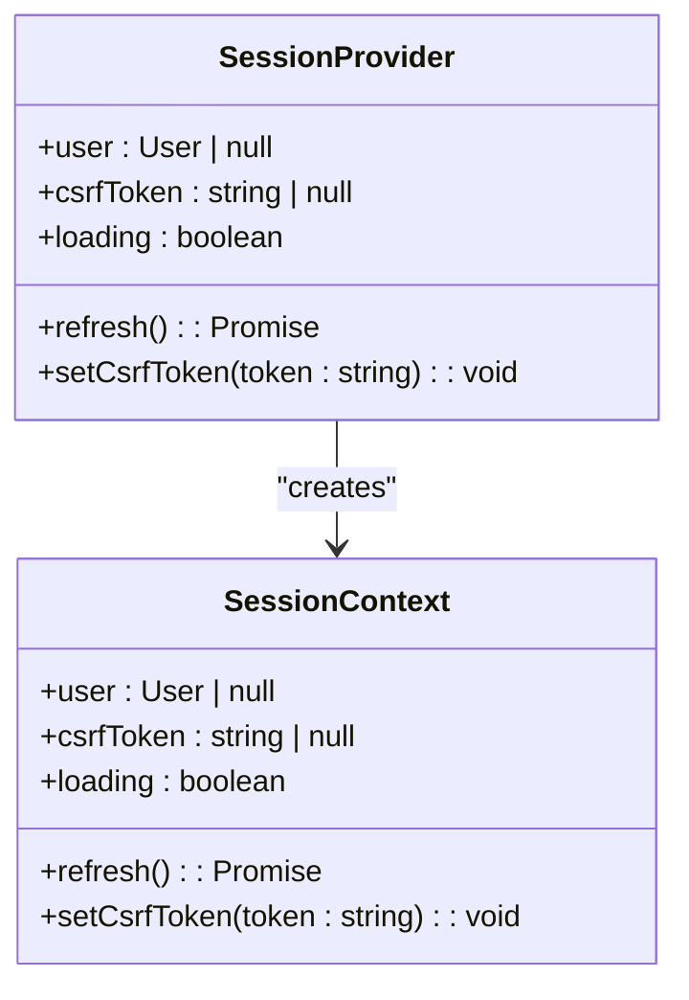
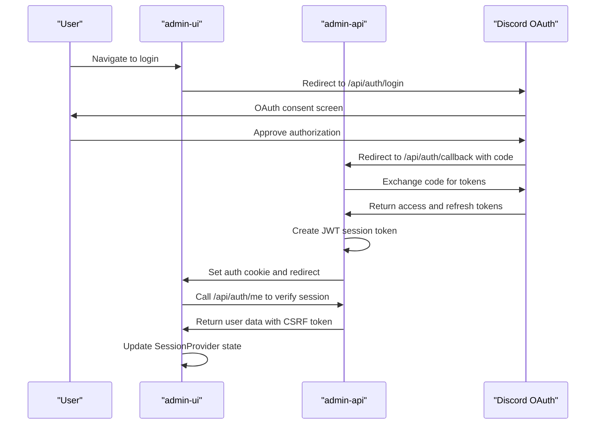
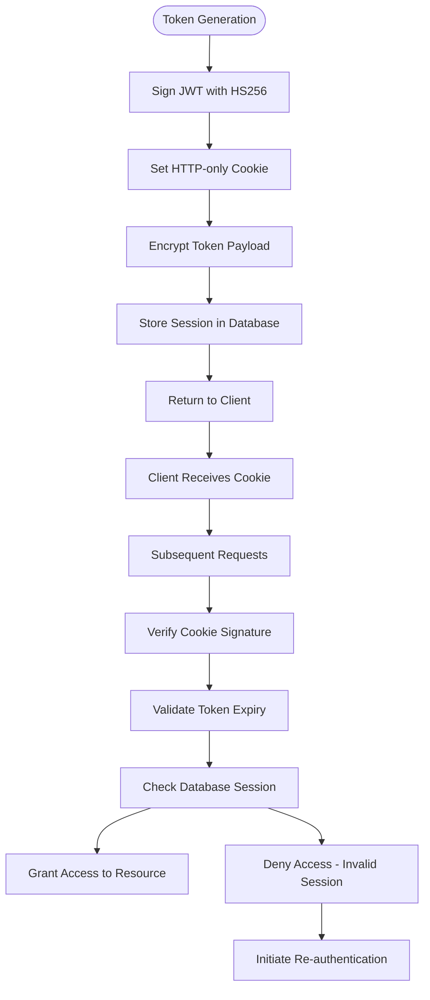
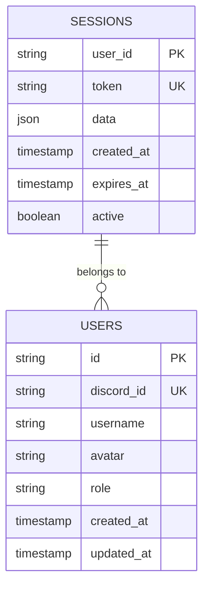
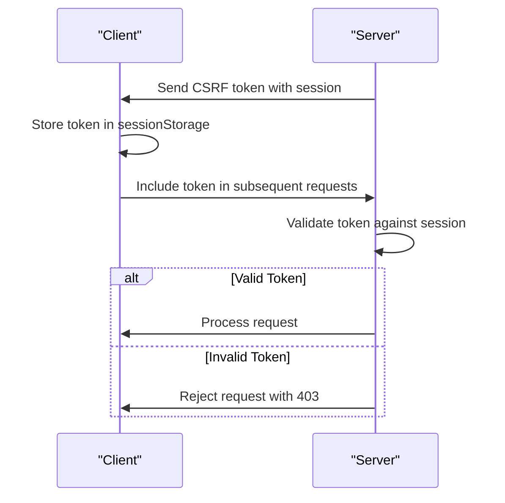
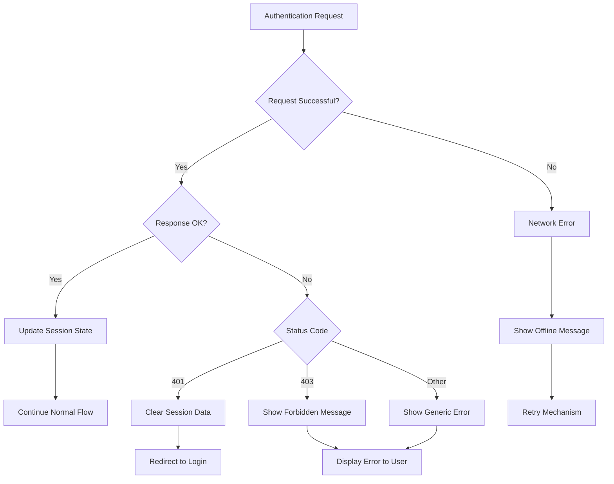
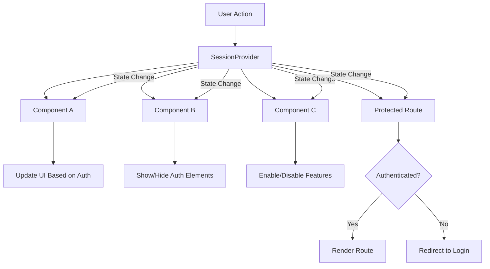
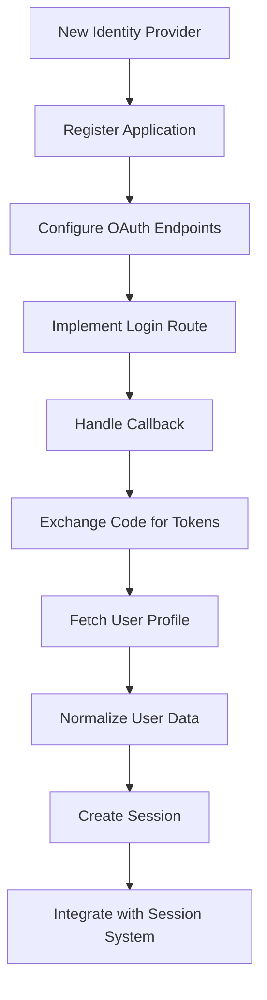

# Session Management

<cite>
**Referenced Files in This Document**   
- [session.js](file://apps/admin-ui/lib/session.js)
- [auth.js](file://apps/admin-api/src/middleware/auth.js)
- [auth.js](file://apps/admin-api/src/routes/auth.js)
- [jwt.js](file://apps/admin-api/lib/jwt.js)
- [session-store.js](file://apps/admin-api/lib/session-store.js)
- [token.js](file://apps/admin-api/src/services/token.js)
- [_app.js](file://apps/admin-ui/pages/_app.js)
- [login.js](file://apps/admin-ui/pages/login.js)
</cite>

## Table of Contents
1. [Introduction](#introduction)
2. [Session Provider Implementation](#session-provider-implementation)
3. [Authentication Flow](#authentication-flow)
4. [Token Handling and Security](#token-handling-and-security)
5. [Session Persistence](#session-persistence)
6. [CSRF Protection Mechanism](#csrf-protection-mechanism)
7. [Integration with admin-api](#integration-with-admin-api)
8. [Error Handling](#error-handling)
9. [Protected Routes and UI Integration](#protected-routes-and-ui-integration)
10. [Extending with Additional Identity Providers](#extending-with-additional-identity-providers)

## Introduction
The session management system in the admin-ui application provides a robust authentication framework for managing user sessions across the platform. This document details the implementation of the SessionProvider context, which maintains user authentication state, handles token management, and synchronizes authentication status across UI components. The system integrates with the admin-api's JWT-based authentication and OAuth flow to provide secure access to protected resources.

## Session Provider Implementation

The SessionProvider context is implemented as a React context provider that manages the user's authentication state throughout the application. It is initialized in the `_app.js` file, wrapping the entire application to ensure global access to session data.



**Diagram sources**
- [session.js](file://apps/admin-ui/lib/session.js#L5-L104)
- [_app.js](file://apps/admin-ui/pages/_app.js#L4-L8)

**Section sources**
- [session.js](file://apps/admin-ui/lib/session.js#L1-L104)
- [_app.js](file://apps/admin-ui/pages/_app.js#L1-L11)

## Authentication Flow

The authentication flow begins with the user initiating login through Discord OAuth. The system follows a secure authorization code flow with state parameter protection to prevent CSRF attacks. When a user accesses the login page, they are redirected to Discord's authorization endpoint with a generated state parameter.



**Diagram sources**
- [auth.js](file://apps/admin-api/src/routes/auth.js#L108-L374)
- [session.js](file://apps/admin-ui/lib/session.js#L48-L76)

**Section sources**
- [auth.js](file://apps/admin-api/src/routes/auth.js#L108-L374)
- [login.js](file://apps/admin-ui/pages/login.js#L1-L18)

## Token Handling and Security

The system implements a multi-layered token security approach using JWT (JSON Web Tokens) for session management. The admin-api generates signed JWT tokens that are stored in HTTP-only cookies to prevent XSS attacks. The tokens are signed using HS256 algorithm with a secret key configured in the environment.



**Diagram sources**
- [jwt.js](file://apps/admin-api/lib/jwt.js#L45-L54)
- [auth.js](file://apps/admin-api/src/middleware/auth.js#L80-L128)
- [token.js](file://apps/admin-api/src/services/token.js#L51-L53)

**Section sources**
- [jwt.js](file://apps/admin-api/lib/jwt.js#L1-L81)
- [token.js](file://apps/admin-api/src/services/token.js#L29-L53)

## Session Persistence

Session persistence is implemented using a combination of JWT tokens and database storage. While the JWT token contains the primary session data, additional session information is stored in the database for enhanced security and management capabilities.

The session-store.js implementation provides functions to store, retrieve, and clear user sessions from the database. Sessions are stored with a 2-hour expiration period for improved security, and a cleanup process runs hourly to remove expired sessions.



**Diagram sources**
- [session-store.js](file://apps/admin-api/lib/session-store.js#L1-L95)
- [database.js](file://apps/admin-api/src/lib/database.js)

**Section sources**
- [session-store.js](file://apps/admin-api/lib/session-store.js#L1-L95)
- [auth.js](file://apps/admin-api/src/routes/auth.js#L340-L351)

## CSRF Protection Mechanism

The system implements a robust CSRF (Cross-Site Request Forgery) protection mechanism using CSRF tokens that are synchronized between the client and server. The CSRF token is generated during the authentication process and included in the session data.

The client-side session.js implementation stores the CSRF token in sessionStorage and provides it to components that need to make authenticated requests. The token is also passed through URL fragments during the OAuth callback process to ensure secure transmission.



**Diagram sources**
- [session.js](file://apps/admin-ui/lib/session.js#L13-L27)
- [token.js](file://apps/admin-api/src/services/token.js#L36-L48)

**Section sources**
- [session.js](file://apps/admin-ui/lib/session.js#L13-L27)
- [token.js](file://apps/admin-api/src/services/token.js#L36-L48)

## Integration with admin-api

The session management system integrates tightly with the admin-api's authentication endpoints. The primary integration points are the `/api/auth/login`, `/api/auth/callback`, and `/api/auth/me` endpoints, which handle the OAuth flow and session verification.

The SessionProvider in the admin-ui makes periodic calls to the `/api/auth/me` endpoint to verify the current session status and refresh user data. This endpoint returns the user's profile information along with the CSRF token, which is then stored in the client-side session state.

```mermaid
graph TB
A[admin-ui] --> B[/api/auth/login]
A --> C[/api/auth/callback]
A --> D[/api/auth/me]
A --> E[/api/auth/logout]
B --> F[Discord OAuth]
F --> C
C --> G[Create Session]
G --> H[Set Auth Cookie]
H --> D
D --> I[Return User Data]
I --> A
E --> J[Clear Session]
J --> K[Clear Auth Cookie]
K --> A
```

**Diagram sources**
- [auth.js](file://apps/admin-api/src/routes/auth.js#L108-L398)
- [session.js](file://apps/admin-ui/lib/session.js#L48-L76)

**Section sources**
- [auth.js](file://apps/admin-api/src/routes/auth.js#L108-L398)
- [session.js](file://apps/admin-ui/lib/session.js#L48-L76)

## Error Handling

The session management system includes comprehensive error handling for various authentication scenarios, including session expiration, token invalidation, and login failures. The system gracefully handles these errors by clearing the local session state and redirecting users to the login page when necessary.

When an authentication error occurs, the system follows a specific error handling flow to ensure security while providing a good user experience. Network errors, expired sessions, and invalid tokens are all handled appropriately to maintain application security.



**Diagram sources**
- [session.js](file://apps/admin-ui/lib/session.js#L69-L75)
- [auth.js](file://apps/admin-api/src/middleware/auth.js#L123-L127)

**Section sources**
- [session.js](file://apps/admin-ui/lib/session.js#L69-L75)
- [auth.js](file://apps/admin-api/src/middleware/auth.js#L123-L127)

## Protected Routes and UI Integration

The session system enables secure access to protected routes by providing the authentication state to UI components through the useSession hook. Components can access the current user's data, check authentication status, and respond to session changes in real-time.

The integration between the session state and UI components ensures that authentication status is synchronized across the application. When the session state changes, all components that use the useSession hook are automatically updated with the new state.



**Diagram sources**
- [session.js](file://apps/admin-ui/lib/session.js#L101-L103)
- [_app.js](file://apps/admin-ui/pages/_app.js#L4-L8)

**Section sources**
- [session.js](file://apps/admin-ui/lib/session.js#L101-L103)
- [_app.js](file://apps/admin-ui/pages/_app.js#L4-L8)

## Extending with Additional Identity Providers

The authentication system can be extended to support additional identity providers beyond Discord. The modular design of the auth.js routes file allows for the addition of new OAuth providers by implementing similar routes and integration patterns.

To add a new identity provider, developers would need to implement:
1. A login route that redirects to the provider's authorization endpoint
2. A callback route that handles the authorization response and token exchange
3. User data normalization to match the existing user schema
4. Session creation and cookie setting logic

The system's use of standardized OAuth 2.0 flows makes it relatively straightforward to integrate additional providers such as GitHub, Google, or enterprise identity solutions.



**Section sources**
- [auth.js](file://apps/admin-api/src/routes/auth.js#L108-L398)
- [oauth.js](file://apps/admin-api/src/services/oauth.js#L1-L104)