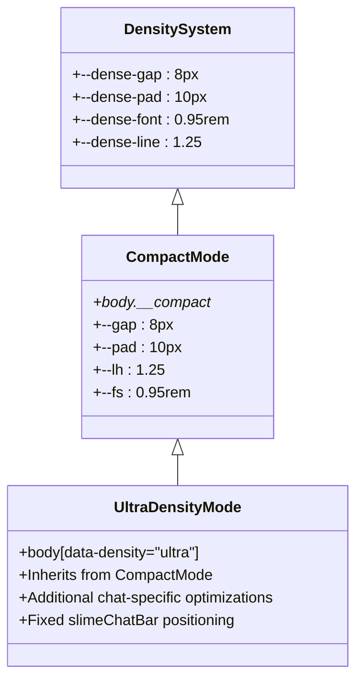

# Styling and Responsive Design

<cite>
**Referenced Files in This Document**   
- [globals.css](file://apps/admin-ui/styles/globals.css)
- [responsive.css](file://apps/admin-ui/styles/responsive.css)
- [mobile.css](file://apps/admin-ui/styles/mobile.css)
- [compact.css](file://apps/admin-ui/styles/compact.css)
- [density-compact.css](file://apps/admin-ui/styles/density-compact.css)
- [density-force.css](file://apps/admin-ui/styles/density-force.css)
- [density-ultra.css](file://apps/admin-ui/styles/density-ultra.css)
- [fullwidth.css](file://apps/admin-ui/styles/fullwidth.css)
- [_document.tsx](file://apps/admin-ui/pages/_document.tsx)
- [GuildActionsMobile.module.css](file://apps/admin-ui/components/GuildActionsMobile.module.css)
</cite>

## Table of Contents
1. [Global CSS Architecture](#global-css-architecture)
2. [Responsive Design Implementation](#responsive-design-implementation)
3. [Density-Based Styling System](#density-based-styling-system)
4. [Mobile-First Design Approach](#mobile-first-design-approach)
5. [Utility Class System](#utility-class-system)
6. [CSS Specificity Management](#css-specificity-management)
7. [Performance Considerations](#performance-considerations)
8. [Extending the Styling System](#extending-the-styling-system)

## Global CSS Architecture

The admin-ui application employs a modular CSS architecture with a clear separation of concerns. The global styles are defined in `globals.css`, which establishes the foundational design system including custom properties for colors, typography, and animations. The root color scheme is set to dark mode with carefully selected neon accent colors (pink, purple, green, and blue) that create a distinctive visual identity. The application uses two primary fonts: "Space Grotesk" for main content and "VT323" for pixel-style elements, imported from Google Fonts.

The CSS architecture follows a utility-first approach with global reset rules and base component styles. Key structural elements like the dashboard wrapper, grid system, and panel components are defined with consistent spacing, border-radius, and backdrop-filter effects that create a glassmorphism aesthetic. The styling system leverages CSS custom properties extensively, allowing for dynamic theme adjustments and density mode changes without duplicating style rules.

**Section sources**
- [globals.css](file://apps/admin-ui/styles/globals.css#L3-L434)

## Responsive Design Implementation

The responsive design system in admin-ui implements a mobile-first approach with breakpoints that adapt the layout across different screen sizes. The primary responsive behavior is managed through the `mobile.css` file, which establishes fluid typography using CSS clamp() functions that scale font sizes from 15px to 17px based on viewport width. The layout transitions from a single-column mobile view to a multi-column desktop layout at the 768px breakpoint.

The responsive system uses a combination of CSS Grid and Flexbox for layout management. On mobile devices, the sidebar navigation is hidden by default and accessible via a hamburger menu, while on larger screens it appears as a fixed left sidebar. The application employs several responsive utility classes such as `.mobile-only` and `.desktop-only` to show or hide content based on screen size. The table elements are designed to be horizontally scrollable on smaller screens with the `.table-scroll` class, ensuring data remains accessible without compromising the mobile experience.

```mermaid
flowchart TD
A["Mobile View (<768px)"] --> B["Single Column Layout"]
B --> C["Hidden Sidebar with Hamburger Menu"]
C --> D["Stacked Content Sections"]
D --> E["Horizontal Table Scrolling"]
F["Desktop View (≥768px)"] --> G["Multi-Column Layout"]
G --> H["Fixed Left Sidebar"]
H --> I["Grid-Based Content Layout"]
I --> J["Full-Width Tables"]
K["Breakpoint: 768px"] --> A
K --> F
```

**Diagram sources**
- [mobile.css](file://apps/admin-ui/styles/mobile.css#L129-L193)
- [responsive.css](file://apps/admin-ui/styles/responsive.css#L3-L6)

## Density-Based Styling System

The admin-ui application implements a sophisticated density-based styling system with three distinct modes: compact, force, and ultra density. These modes are controlled through CSS classes and data attributes that modify spacing, padding, and font sizes to accommodate different user preferences and screen real estate requirements. The density system is initialized in `_document.tsx` with the default class `__compact` and data attribute `data-density="ultra"` applied to the body element.

The density modes are implemented through separate CSS files (`density-compact.css`, `density-force.css`, and `density-ultra.css`) that provide additive overrides to the base styles. Each density mode reduces the gap, padding, and margin values while maintaining consistent visual hierarchy. The compact mode reduces component padding to 10px and gap spacing to 8px, while also decreasing font sizes and line heights. The system targets common container classes (main, content, container, etc.) and component classes (card, panel, section) to ensure consistent density application across the entire interface.

**Diagram sources**
- [density-compact.css](file://apps/admin-ui/styles/density-compact.css#L6-L131)
- [density-ultra.css](file://apps/admin-ui/styles/density-ultra.css#L8-L128)
- [_document.tsx](file://apps/admin-ui/pages/_document.tsx#L10)

## Mobile-First Design Approach

The admin-ui application follows a strict mobile-first design philosophy, with styles progressively enhanced for larger screens. The base styles in `mobile.css` establish the fundamental layout, typography, and spacing for mobile devices, with media queries adding enhancements for tablet and desktop views. This approach ensures optimal performance and usability on mobile devices while providing an enhanced experience on larger screens.

The mobile-first implementation includes fluid typography with clamp() functions that scale text appropriately across device sizes, flexible grid layouts that reflow content based on available space, and touch-friendly interactive elements with appropriate hit areas. The navigation system is optimized for mobile with a collapsible sidebar that slides in from the left, accompanied by a semi-transparent overlay that prevents interaction with background content. Form elements and buttons are styled with sufficient padding to accommodate touch input, and interactive states are clearly defined for both touch and hover interactions.

**Section sources**
- [mobile.css](file://apps/admin-ui/styles/mobile.css#L1-L194)
- [responsive.css](file://apps/admin-ui/styles/responsive.css#L1-L7)

## Utility Class System

The admin-ui application implements a comprehensive utility class system that promotes consistency and reusability across components. The utility classes are organized by function, including layout utilities (grid, stack, row), spacing utilities (gap, padding, margin), typography utilities (font-size, line-height), and component-specific utilities for cards, buttons, and forms.

The utility system follows a consistent naming convention and leverages CSS custom properties for maintainability. For example, the card components use a standardized set of utility classes for padding, border-radius, and background effects that create a cohesive visual language. Button styles are defined with utility classes for different variants (primary, outline) and sizes (default, large). The system also includes responsive utility classes like `.mobile-only` and `.desktop-only` that control element visibility based on screen size.

The utility classes are designed to be composable, allowing developers to build complex layouts by combining simple, single-purpose classes. This approach reduces CSS bloat and makes the styling system more predictable and easier to maintain. The utility system also includes specialized classes for data display elements like tables, metrics, and lists, ensuring consistent presentation of information throughout the application.

**Section sources**
- [globals.css](file://apps/admin-ui/styles/globals.css#L114-L382)
- [mobile.css](file://apps/admin-ui/styles/mobile.css#L66-L104)

## CSS Specificity Management

The admin-ui application employs several strategies to manage CSS specificity and prevent style conflicts. The styling system relies heavily on attribute selectors and class-based styling rather than element selectors, which helps maintain a consistent specificity level across rules. The density modes use the `!important` declaration judiciously to ensure that density overrides take precedence over base styles, but only for spacing, padding, and sizing properties.

The application avoids deep selector nesting and instead uses simple, flat class names that can be easily composed. For utility classes, the system uses direct class targeting rather than complex descendant selectors, which keeps specificity low and makes styles more predictable. When overrides are necessary, the system uses data attributes (like `data-density`) in combination with body classes to create targeted, high-specificity rules that don't affect unrelated components.

The CSS architecture also incorporates CSS custom properties (variables) extensively, which allows for theme and density changes without requiring high-specificity override rules. This approach makes the styling system more maintainable and reduces the need for `!important` declarations in most cases. The few instances where `!important` is used are well-documented and limited to the density mode overrides and critical layout adjustments.

**Section sources**
- [density-compact.css](file://apps/admin-ui/styles/density-compact.css#L23-L131)
- [density-force.css](file://apps/admin-ui/styles/density-force.css#L17-L105)

## Performance Considerations

The styling system in admin-ui is optimized for performance with several key considerations. The CSS is organized into separate files based on functionality (globals, responsive, density modes), which allows for selective loading and better cacheability. The total CSS bundle size is minimized by using CSS custom properties for repeated values and avoiding redundant style rules.

The application leverages CSS cascade and inheritance effectively, defining common properties at the root level and allowing them to flow down to child elements. This reduces the overall size of the CSS and improves rendering performance. The use of CSS Grid and Flexbox for layout eliminates the need for JavaScript-based layout calculations, resulting in smoother rendering and better performance on lower-powered devices.

For the density modes, the system uses additive overrides rather than completely separate style sheets, which reduces the total amount of CSS that needs to be parsed and applied. The responsive design implementation uses efficient media queries that target specific breakpoints without unnecessary duplication of styles. The utility class system promotes reuse and reduces the overall CSS footprint by eliminating the need for component-specific style rules.

**Section sources**
- [globals.css](file://apps/admin-ui/styles/globals.css#L1-L434)
- [density-compact.css](file://apps/admin-ui/styles/density-compact.css#L1-L131)

## Extending the Styling System

To extend the styling system with new components while maintaining visual consistency, developers should follow the established patterns and conventions. New components should leverage the existing utility classes for layout, spacing, and typography rather than defining new style rules. When creating new component variants, developers should use the established naming convention and base their styles on the CSS custom properties defined in `:root`.

For components that require unique styling, developers should create modular CSS files that follow the BEM (Block Element Modifier) methodology used throughout the application. New utility classes should be added to the appropriate utility file (`mobile.css` for responsive utilities, `density-*.css` for density-specific adjustments) rather than creating standalone style sheets. When introducing new visual elements, developers should use the established color palette and typography scales to ensure consistency with the existing design language.

The density system can be extended by adding new rules to the density-specific CSS files that target the new component classes. These rules should use the same spacing and sizing variables as existing density overrides to maintain consistency. For responsive behavior, new components should follow the mobile-first approach and use the established breakpoints and utility classes for adaptive layouts.

**Section sources**
- [globals.css](file://apps/admin-ui/styles/globals.css#L3-L434)
- [mobile.css](file://apps/admin-ui/styles/mobile.css#L1-L194)
- [density-compact.css](file://apps/admin-ui/styles/density-compact.css#L1-L131)