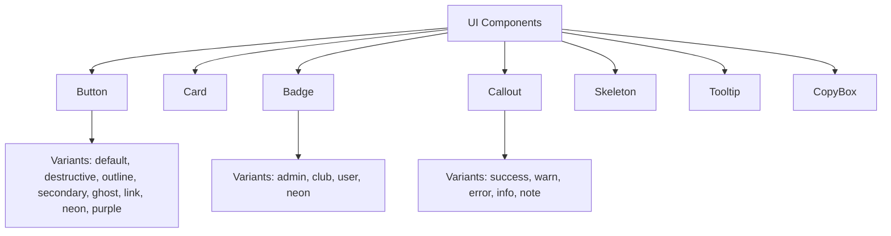
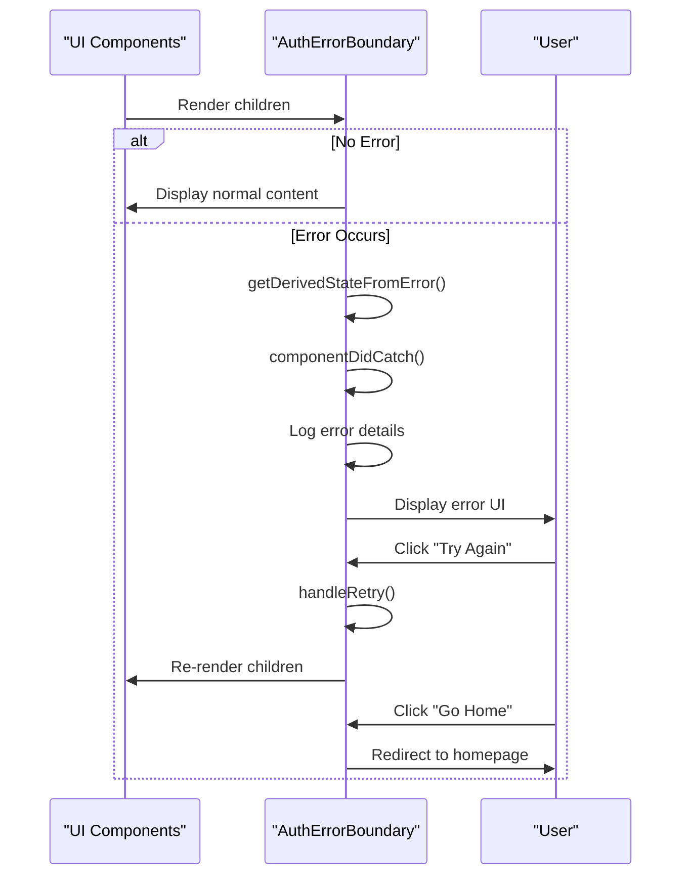
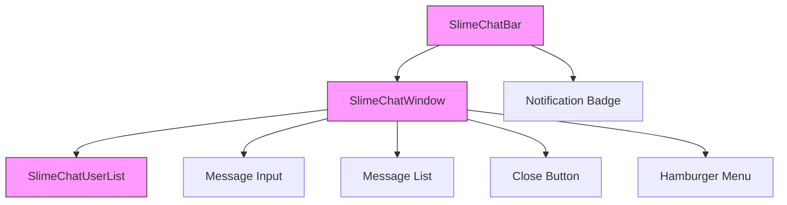
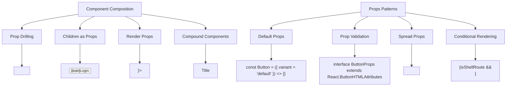
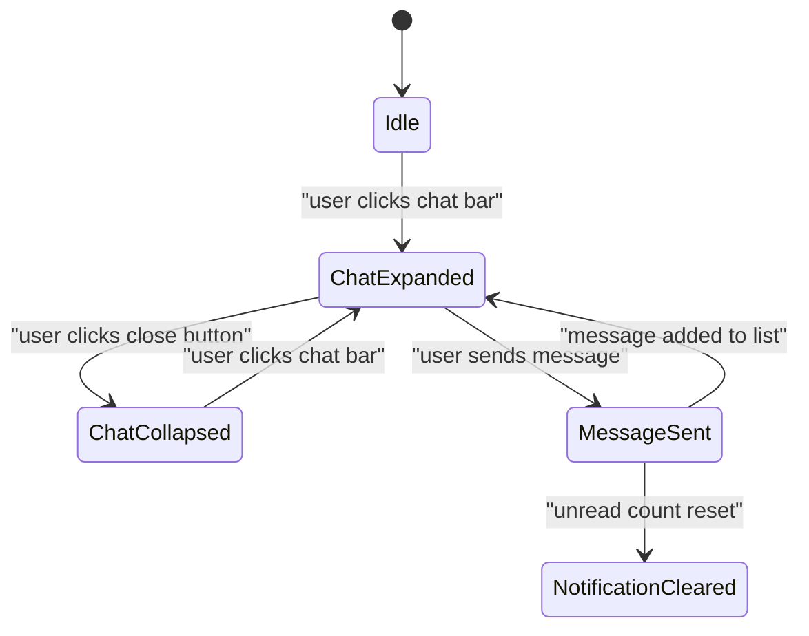
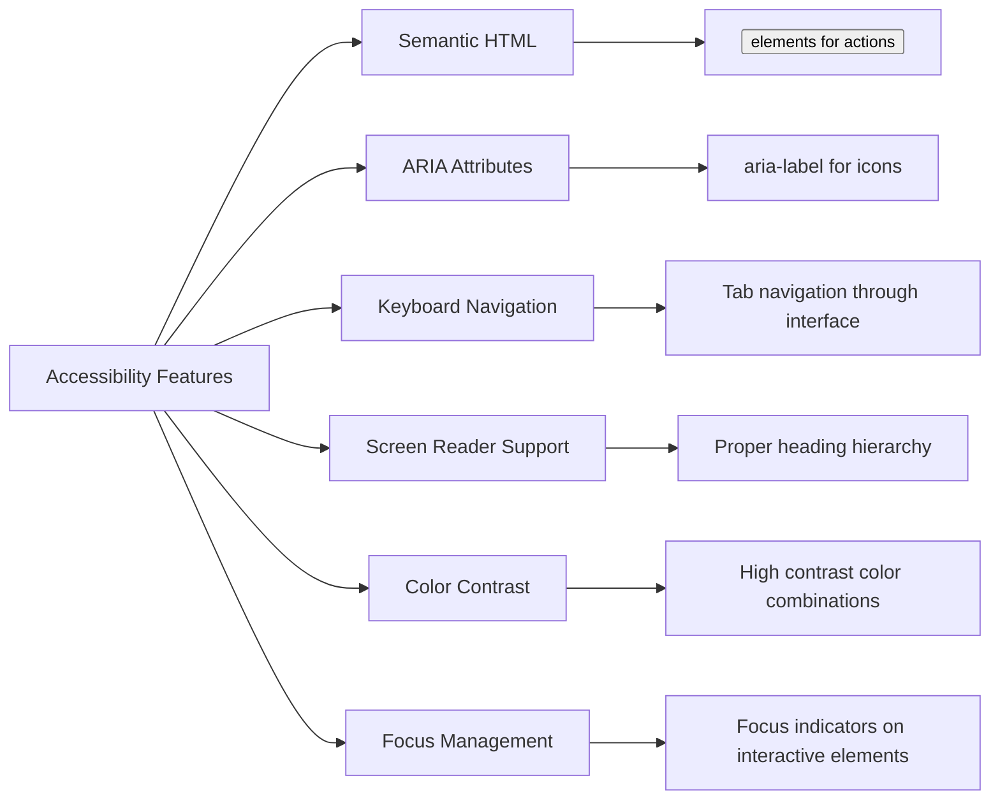
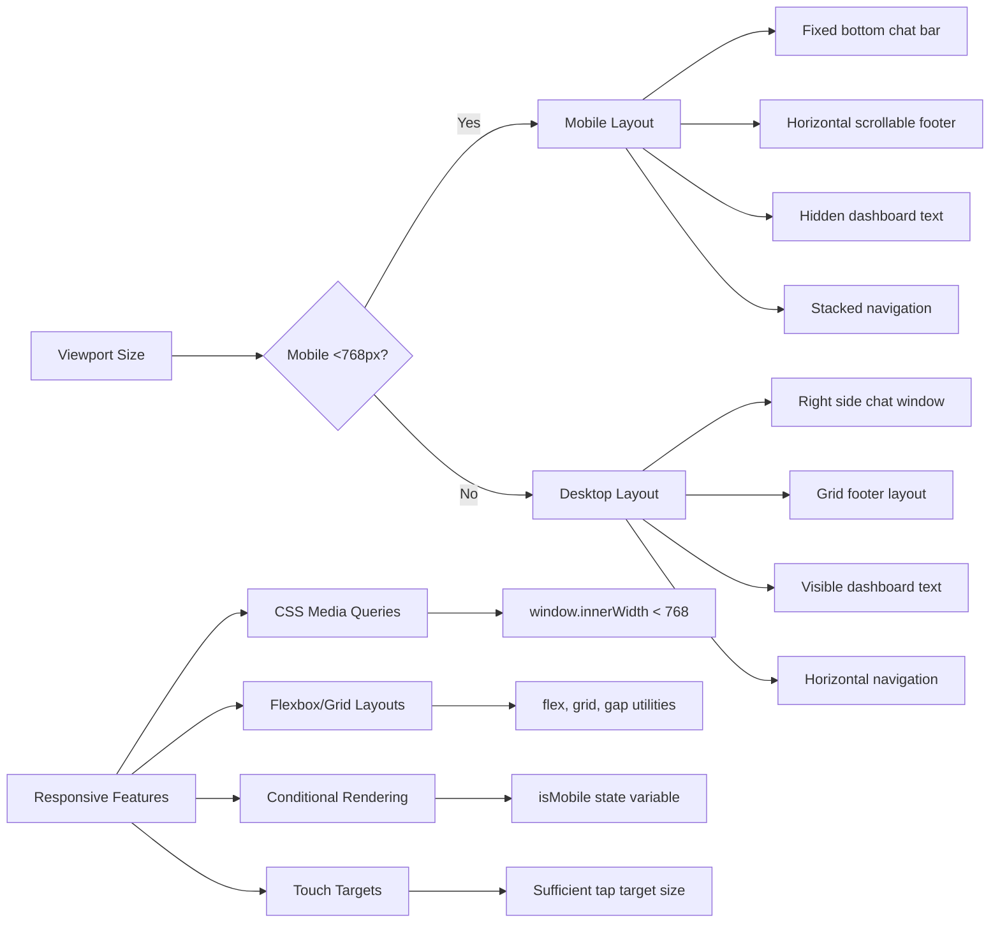

# Component Architecture

<cite>
**Referenced Files in This Document**   
- [app-shell.tsx](file://apps/web/components/layout/app-shell.tsx)
- [header.tsx](file://apps/web/components/layout/header.tsx)
- [footer.tsx](file://apps/web/components/layout/footer.tsx)
- [error-boundary.tsx](file://apps/web/components/auth/error-boundary.tsx)
- [button.tsx](file://apps/web/components/ui/button.tsx)
- [card.tsx](file://apps/web/components/ui/card.tsx)
- [badge.tsx](file://apps/web/components/ui/badge.tsx)
- [callout.tsx](file://apps/web/components/ui/callout.tsx)
- [slime-chat-bar.tsx](file://apps/web/components/slime-chat/slime-chat-bar.tsx)
- [slime-chat-window.tsx](file://apps/web/components/slime-chat/slime-chat-window.tsx)
- [slime-chat-user-list.tsx](file://apps/web/components/slime-chat/slime-chat-user-list.tsx)
- [ChatWidget.tsx](file://apps/web/components/ChatWidget.tsx)
- [SlimeChatWidget.tsx](file://apps/admin-ui/components/SlimeChatWidget.tsx)
- [skeleton.tsx](file://apps/web/components/ui/skeleton.tsx)
- [tooltip.tsx](file://apps/web/components/ui/tooltip.tsx)
- [copy-box.tsx](file://apps/web/components/ui/copy-box.tsx)
</cite>

## Table of Contents
1. [Introduction](#introduction)
2. [Design System Implementation](#design-system-implementation)
3. [Layout Components](#layout-components)
4. [Error Boundary Pattern](#error-boundary-pattern)
5. [Widget Components](#widget-components)
6. [Component Composition and Props Patterns](#component-composition-and-props-patterns)
7. [State Management](#state-management)
8. [Accessibility Considerations](#accessibility-considerations)
9. [Responsive Behavior](#responsive-behavior)
10. [Conclusion](#conclusion)

## Introduction
This document provides a comprehensive overview of the component architecture across both frontend applications in the slimy-monorepo. It details the design system implementation, layout components, error handling patterns, and interactive widgets. The documentation covers component composition strategies, state management approaches, accessibility features, and responsive design implementations that ensure a consistent user experience across different screen sizes.

## Design System Implementation

The design system is implemented through reusable UI components located in the `components/ui` directory of the web application. These components follow a consistent styling approach using Tailwind CSS and provide a cohesive visual language across the application.

The component library includes foundational elements such as buttons, cards, badges, and callouts, each with multiple variants to support different use cases. The design system emphasizes accessibility, responsiveness, and ease of use while maintaining visual consistency.



**Diagram sources**
- [button.tsx](file://apps/web/components/ui/button.tsx)
- [card.tsx](file://apps/web/components/ui/card.tsx)
- [badge.tsx](file://apps/web/components/ui/badge.tsx)
- [callout.tsx](file://apps/web/components/ui/callout.tsx)

**Section sources**
- [button.tsx](file://apps/web/components/ui/button.tsx#L7-L36)
- [card.tsx](file://apps/web/components/ui/card.tsx#L5-L79)
- [badge.tsx](file://apps/web/components/ui/badge.tsx#L6-L27)
- [callout.tsx](file://apps/web/components/ui/callout.tsx#L13-L19)

## Layout Components

The application utilizes a set of layout components to provide consistent structure across different pages. The primary layout components include AppShell, Header, and Footer, which work together to create a unified user interface.

The AppShell component serves as the main container for authenticated routes, wrapping the application with essential providers and conditional UI elements. It manages the overall application structure and determines which components to render based on the current route.

```mermaid
classDiagram
class AppShell {
+children : ReactNode
-SHELL_ROUTES : string[]
+AppShell({ children } : { children : ReactNode }) : JSX.Element
}
class Header {
+navItems : Array<{ href : string, label : string, prefetch : boolean }>
+criticalPaths : string[]
+Header() : JSX.Element
}
class Footer {
+currentYear : number
+Footer() : JSX.Element
}
AppShell --> Header : "conditionally renders"
AppShell --> Footer : "conditionally renders"
AppShell --> AuthErrorBoundary : "wraps with"
AppShell --> AuthProvider : "wraps with"
AppShell --> LazySlimeChatBar : "conditionally renders"
```

**Diagram sources**
- [app-shell.tsx](file://apps/web/components/layout/app-shell.tsx)
- [header.tsx](file://apps/web/components/layout/header.tsx)
- [footer.tsx](file://apps/web/components/layout/footer.tsx)

**Section sources**
- [app-shell.tsx](file://apps/web/components/layout/app-shell.tsx#L1-L34)
- [header.tsx](file://apps/web/components/layout/header.tsx#L1-L167)
- [footer.tsx](file://apps/web/components/layout/footer.tsx#L1-L173)

## Error Boundary Pattern

The application implements a robust error handling strategy using the AuthErrorBoundary component, which follows the React error boundary pattern to gracefully handle errors in the authentication flow and related components.

The AuthErrorBoundary component catches errors during rendering and provides a user-friendly fallback UI with appropriate recovery options. It distinguishes between authentication-related errors and other types of errors, displaying tailored messaging for each case.



**Diagram sources**
- [error-boundary.tsx](file://apps/web/components/auth/error-boundary.tsx)

**Section sources**
- [error-boundary.tsx](file://apps/web/components/auth/error-boundary.tsx#L1-L119)

## Widget Components

The application features several interactive widget components that enhance user engagement and functionality. The primary widgets include the SlimeChatWidget and related components that provide real-time chat capabilities.

The SlimeChat implementation consists of multiple components that work together to create a comprehensive chat experience. The architecture separates concerns between the chat bar, window, and user list components, enabling modular development and maintenance.



**Diagram sources**
- [slime-chat-bar.tsx](file://apps/web/components/slime-chat/slime-chat-bar.tsx)
- [slime-chat-window.tsx](file://apps/web/components/slime-chat/slime-chat-window.tsx)
- [slime-chat-user-list.tsx](file://apps/web/components/slime-chat/slime-chat-user-list.tsx)

**Section sources**
- [slime-chat-bar.tsx](file://apps/web/components/slime-chat/slime-chat-bar.tsx#L1-L86)
- [slime-chat-window.tsx](file://apps/web/components/slime-chat/slime-chat-window.tsx#L1-L183)
- [slime-chat-user-list.tsx](file://apps/web/components/slime-chat/slime-chat-user-list.tsx#L1-L49)
- [ChatWidget.tsx](file://apps/web/components/ChatWidget.tsx#L1-L78)
- [SlimeChatWidget.tsx](file://apps/admin-ui/components/SlimeChatWidget.tsx#L1-L63)

## Component Composition and Props Patterns

The component architecture follows established patterns for composition and props management to ensure reusability and maintainability. Components are designed to be composable, with clear prop interfaces that define their behavior and appearance.

The design system components use the `asChild` pattern to allow for flexible composition, enabling developers to wrap other components while maintaining consistent styling. This approach promotes reusability and reduces duplication across the codebase.



**Diagram sources**
- [button.tsx](file://apps/web/components/ui/button.tsx)
- [card.tsx](file://apps/web/components/ui/card.tsx)
- [app-shell.tsx](file://apps/web/components/layout/app-shell.tsx)
- [header.tsx](file://apps/web/components/layout/header.tsx)

**Section sources**
- [button.tsx](file://apps/web/components/ui/button.tsx#L44-L55)
- [card.tsx](file://apps/web/components/ui/card.tsx#L5-L79)
- [app-shell.tsx](file://apps/web/components/layout/app-shell.tsx#L16-L34)
- [header.tsx](file://apps/web/components/layout/header.tsx#L26-L167)

## State Management

The application employs a combination of React's built-in state management features and context API to handle component state across different levels of the component tree. The architecture balances local component state with shared application state to optimize performance and maintainability.

For local component state, the application uses React's useState and useEffect hooks to manage interactive elements such as the SlimeChat widget's open/closed state and message input. For shared state, the context API is used to provide authentication state and other global data to components that need it.



**Diagram sources**
- [slime-chat-bar.tsx](file://apps/web/components/slime-chat/slime-chat-bar.tsx)
- [slime-chat-window.tsx](file://apps/web/components/slime-chat/slime-chat-window.tsx)

**Section sources**
- [slime-chat-bar.tsx](file://apps/web/components/slime-chat/slime-chat-bar.tsx#L9-L29)
- [slime-chat-window.tsx](file://apps/web/components/slime-chat/slime-chat-window.tsx#L46-L70)

## Accessibility Considerations

The component architecture prioritizes accessibility to ensure an inclusive user experience. Components are designed with proper semantic HTML, ARIA attributes, keyboard navigation support, and sufficient color contrast.

Key accessibility features include proper labeling of interactive elements, focus management, screen reader support, and keyboard navigation. The design system components are built to meet WCAG 2.1 AA standards, providing an accessible experience for all users regardless of their abilities or assistive technologies.



**Diagram sources**
- [button.tsx](file://apps/web/components/ui/button.tsx)
- [slime-chat-bar.tsx](file://apps/web/components/slime-chat/slime-chat-bar.tsx)
- [slime-chat-window.tsx](file://apps/web/components/slime-chat/slime-chat-window.tsx)

**Section sources**
- [button.tsx](file://apps/web/components/ui/button.tsx#L44-L55)
- [slime-chat-bar.tsx](file://apps/web/components/slime-chat/slime-chat-bar.tsx#L48-L80)
- [slime-chat-window.tsx](file://apps/web/components/slime-chat/slime-chat-window.tsx#L107-L123)

## Responsive Behavior

The component architecture implements responsive design principles to ensure optimal user experience across different screen sizes and devices. Components adapt their layout, styling, and behavior based on viewport dimensions and device characteristics.

The responsive strategy includes mobile-first design, flexible layouts, conditional rendering of components, and touch-friendly interfaces. Media queries and CSS grid/flexbox are used to create fluid layouts that adjust to different screen sizes, from mobile devices to large desktop monitors.



**Diagram sources**
- [slime-chat-bar.tsx](file://apps/web/components/slime-chat/slime-chat-bar.tsx)
- [slime-chat-window.tsx](file://apps/web/components/slime-chat/slime-chat-window.tsx)
- [footer.tsx](file://apps/web/components/layout/footer.tsx)

**Section sources**
- [slime-chat-bar.tsx](file://apps/web/components/slime-chat/slime-chat-bar.tsx#L13-L22)
- [slime-chat-window.tsx](file://apps/web/components/slime-chat/slime-chat-window.tsx#L81-L84)
- [footer.tsx](file://apps/web/components/layout/footer.tsx#L10-L88)

## Conclusion
The component architecture across both frontend applications demonstrates a well-structured approach to building reusable, accessible, and responsive UI components. The design system provides a consistent foundation for development, while layout components ensure a cohesive user experience. The error boundary pattern enables graceful error handling, and widget components deliver interactive functionality. By following established patterns for component composition, props management, and state management, the architecture promotes maintainability and scalability. The emphasis on accessibility and responsive behavior ensures an inclusive experience across different devices and user needs.