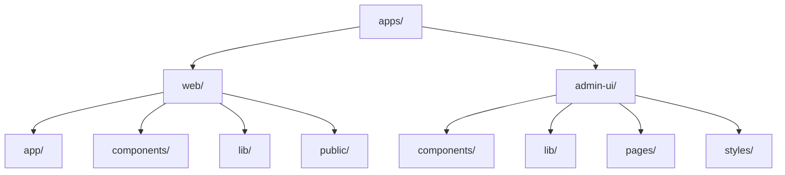
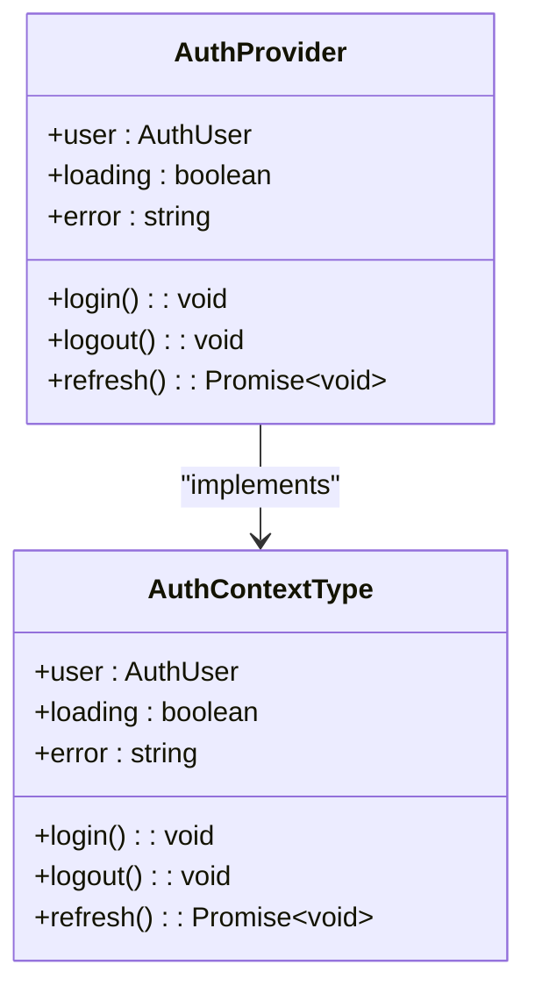
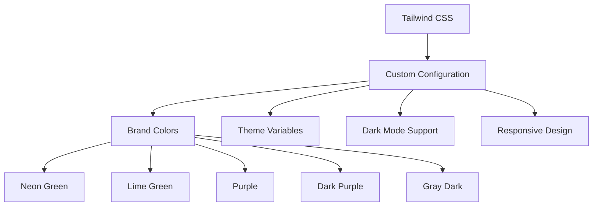
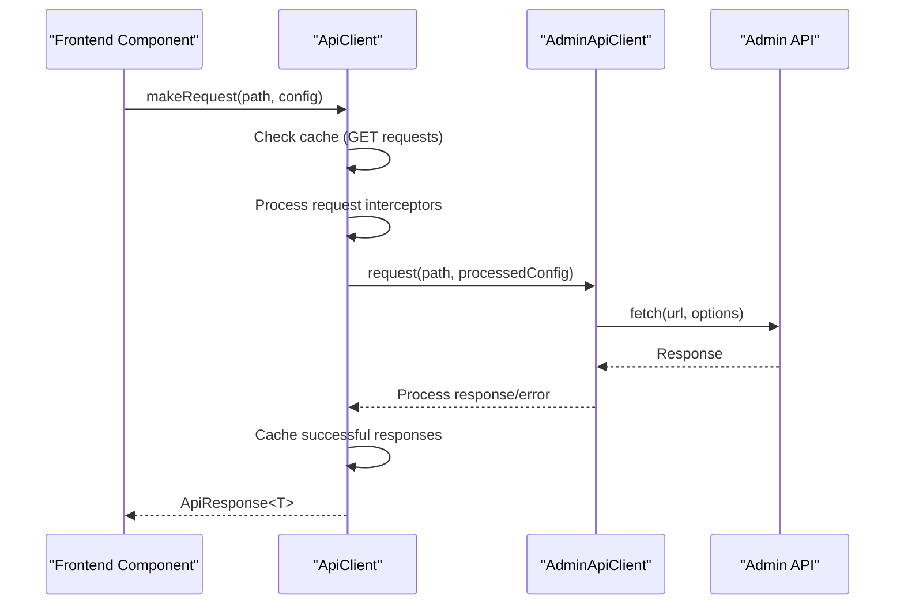
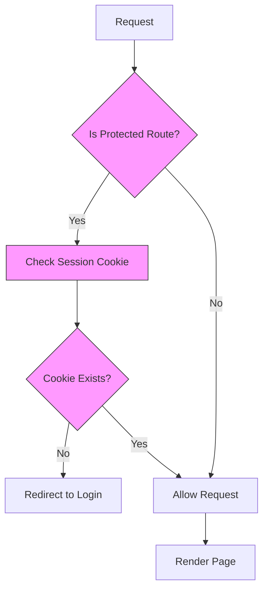

# Frontend Architecture

<cite>
**Referenced Files in This Document**   
- [package.json](file://apps/web/package.json)
- [package.json](file://apps/admin-ui/package.json)
- [next.config.js](file://apps/web/next.config.js)
- [next.config.js](file://apps/admin-ui/next.config.js)
- [tailwind.config.ts](file://apps/web/tailwind.config.ts)
- [api-client.ts](file://apps/web/lib/api-client.ts)
- [admin-client.ts](file://apps/web/lib/api/admin-client.ts)
- [layout.tsx](file://apps/web/app/layout.tsx)
- [middleware.ts](file://apps/web/middleware.ts)
- [app-shell.tsx](file://apps/web/components/layout/app-shell.tsx)
- [api.js](file://apps/admin-ui/lib/api.js)
- [session.ts](file://apps/admin-ui/lib/session.js)
- [_app.js](file://apps/admin-ui/pages/_app.js)
- [index.js](file://apps/admin-ui/pages/index.js)
- [context.tsx](file://apps/web/lib/auth/context.tsx)
- [index.ts](file://apps/web/lib/auth/index.ts)
</cite>

## Table of Contents
1. [Introduction](#introduction)
2. [Project Structure](#project-structure)
3. [Core Applications](#core-applications)
4. [Component Architecture](#component-architecture)
5. [State Management](#state-management)
6. [Styling Approach](#styling-approach)
7. [API Client Integration](#api-client-integration)
8. [Routing Mechanisms](#routing-mechanisms)
9. [Responsive Design and Accessibility](#responsive-design-and-accessibility)
10. [Performance Optimization](#performance-optimization)

## Introduction
The Slimy Monorepo features a dual frontend architecture consisting of two distinct applications: a public web application built with Next.js 16 using React Server Components, and a separate admin-ui React application. This documentation provides a comprehensive overview of the frontend architecture, detailing the component structure, state management patterns, styling approach, API integration strategy, routing mechanisms, responsive design implementation, and performance optimization techniques used across both applications.

## Project Structure
The frontend architecture is organized within the `apps/` directory of the monorepo, with two primary applications: `web` for the public-facing site and `admin-ui` for the administrative interface. The `web` application leverages Next.js 16 with React Server Components, while the `admin-ui` is a separate Next.js application built on Next.js 14.2.5. Both applications have their own package.json files, configuration files, and component directories, allowing for independent development and deployment.

**Diagram sources**
- [package.json](file://apps/web/package.json)
- [package.json](file://apps/admin-ui/package.json)

**Section sources**
- [package.json](file://apps/web/package.json)
- [package.json](file://apps/admin-ui/package.json)

## Core Applications
The frontend architecture consists of two core applications serving different purposes. The `web` application is the public-facing site built with Next.js 16, utilizing React Server Components for improved performance and SEO. It serves as the main interface for users to interact with the Slimy.ai platform. The `admin-ui` application is a separate React application designed for administrative tasks, providing tools for managing guilds, monitoring system health, and configuring settings. This separation allows for different technology stacks and deployment strategies for each application.

**Section sources**
- [package.json](file://apps/web/package.json)
- [package.json](file://apps/admin-ui/package.json)

## Component Architecture
The component architecture follows a modular approach with clear separation of concerns. In the `web` application, components are organized in the `components/` directory with subdirectories for different functional areas such as layout, chat, club, and ui components. The `admin-ui` application follows a similar pattern with components organized by feature. Both applications utilize a combination of server components (in the `web` app) and client components, with client components explicitly marked with "use client" directive. The architecture promotes reusability through shared UI components and proper abstraction of complex functionality.

**Section sources**
- [app-shell.tsx](file://apps/web/components/layout/app-shell.tsx)
- [components/](file://apps/web/components/)
- [components/](file://apps/admin-ui/components/)

## State Management
State management is implemented using React Context API for global state and SWR for data fetching state. The `web` application uses a custom `AuthProvider` context for authentication state management, which handles user authentication, session refresh, and role-based access control. The `admin-ui` application uses SWR for data fetching and caching, providing automatic revalidation and optimized data synchronization. Both applications implement error boundaries and loading states to ensure a robust user experience during state transitions.

**Diagram sources**
- [context.tsx](file://apps/web/lib/auth/context.tsx)
- [index.ts](file://apps/web/lib/auth/index.ts)

**Section sources**
- [context.tsx](file://apps/web/lib/auth/context.tsx)
- [index.ts](file://apps/web/lib/auth/index.ts)

## Styling Approach
The styling approach is based on Tailwind CSS with a custom configuration that includes the Slimy.ai brand colors and design tokens. The `web` application uses a comprehensive Tailwind configuration with custom colors, border radii, and CSS variables for theming. The configuration supports dark mode through the "class" strategy, allowing users to toggle between light and dark themes. Both applications use CSS modules for component-specific styles when needed, but primarily rely on utility classes from Tailwind for consistent and maintainable styling.

**Diagram sources**
- [tailwind.config.ts](file://apps/web/tailwind.config.ts)

**Section sources**
- [tailwind.config.ts](file://apps/web/tailwind.config.ts)

## API Client Integration
API client integration is handled through a layered approach with specialized clients for different purposes. The `web` application uses a centralized `ApiClient` class that wraps the `AdminApiClient` with additional features like caching, retry logic, and request interceptors. This client handles communication with the admin-api backend, providing automatic retry with exponential backoff, request caching, and comprehensive error handling. The `admin-ui` application uses a simpler fetch-based approach with a custom `apiFetch` function that handles authentication headers and response parsing.

**Diagram sources**
- [api-client.ts](file://apps/web/lib/api-client.ts)
- [admin-client.ts](file://apps/web/lib/api/admin-client.ts)
- [api.js](file://apps/admin-ui/lib/api.js)

**Section sources**
- [api-client.ts](file://apps/web/lib/api-client.ts)
- [admin-client.ts](file://apps/web/lib/api/admin-client.ts)
- [api.js](file://apps/admin-ui/lib/api.js)

## Routing Mechanisms
Routing is implemented differently in each application based on their respective frameworks. The `web` application uses the Next.js App Router with React Server Components, organizing routes as directories in the `app/` folder. It implements middleware for authentication checks, protecting routes that require authentication. The `admin-ui` application uses the legacy Pages Router with pages in the `pages/` directory. Both applications implement client-side navigation with Next.js Link components, but the `web` application benefits from server-side rendering and route prefetching.

**Diagram sources**
- [middleware.ts](file://apps/web/middleware.ts)
- [app/](file://apps/web/app/)
- [pages/](file://apps/admin-ui/pages/)

**Section sources**
- [middleware.ts](file://apps/web/middleware.ts)
- [app/](file://apps/web/app/)
- [pages/](file://apps/admin-ui/pages/)

## Responsive Design and Accessibility
Responsive design is implemented using Tailwind CSS's responsive utility classes, with specific CSS files for different screen sizes. The `web` application includes responsive.css and mobile.css files that define breakpoints and layout adjustments for smaller screens. Accessibility is prioritized through semantic HTML, proper ARIA attributes, and keyboard navigation support. Both applications follow accessibility best practices, including proper contrast ratios, focus management, and screen reader support. The design system includes accessible UI components with built-in accessibility features.

**Section sources**
- [responsive.css](file://apps/web/styles/responsive.css)
- [mobile.css](file://apps/web/styles/mobile.css)
- [components/ui/](file://apps/web/components/ui/)

## Performance Optimization
Performance optimization is achieved through multiple techniques including code splitting, image optimization, and caching strategies. The `web` application uses Next.js built-in optimizations like automatic code splitting, image optimization with the Image component, and Turbopack for faster builds. The API client implements request caching with TTL-based invalidation and automatic cache cleanup. Both applications implement lazy loading for non-critical components and routes. The build process includes bundle analysis and size checking to prevent performance regressions.

**Section sources**
- [next.config.js](file://apps/web/next.config.js)
- [api-client.ts](file://apps/web/lib/api-client.ts)
- [package.json](file://apps/web/package.json)