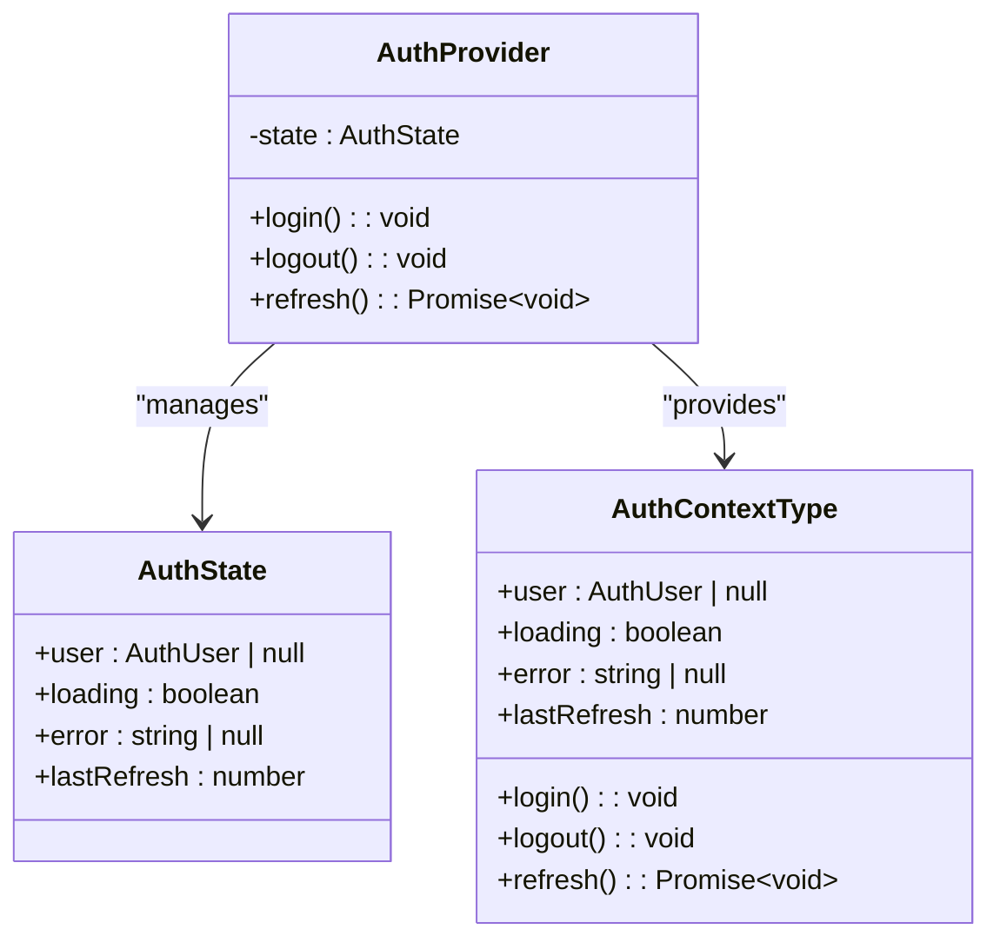
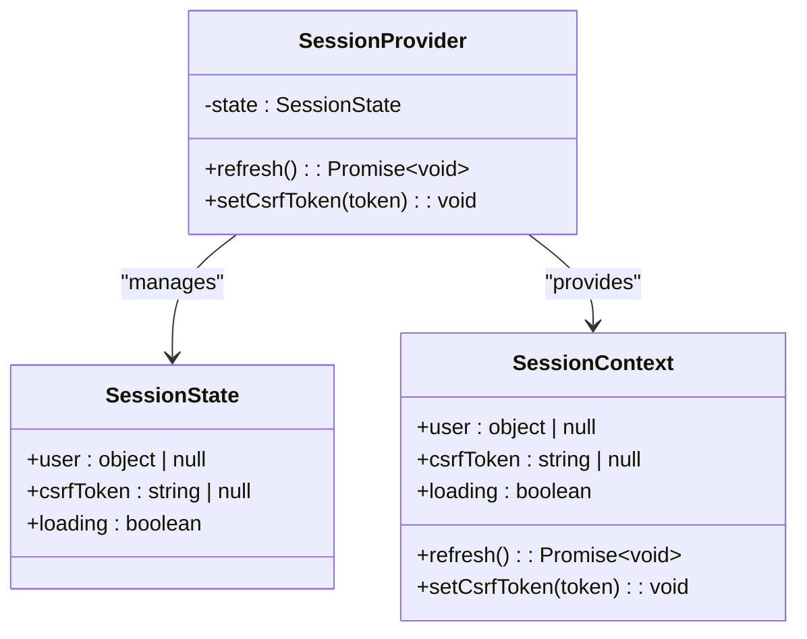
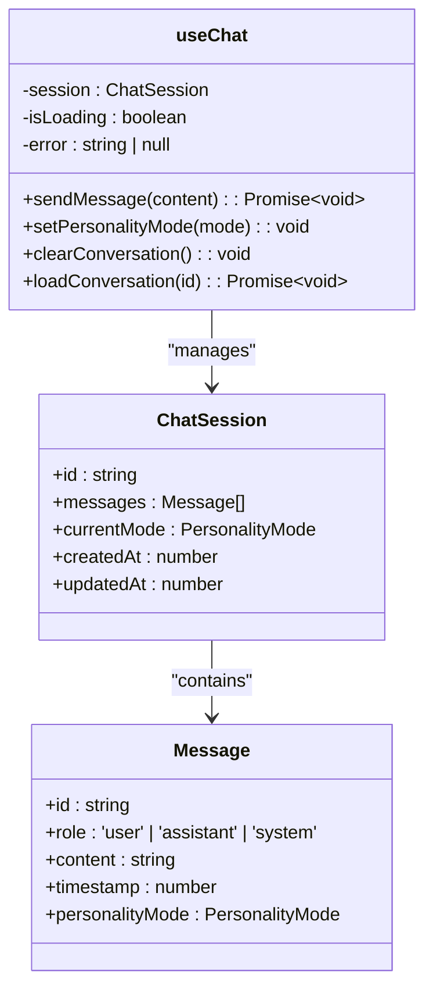
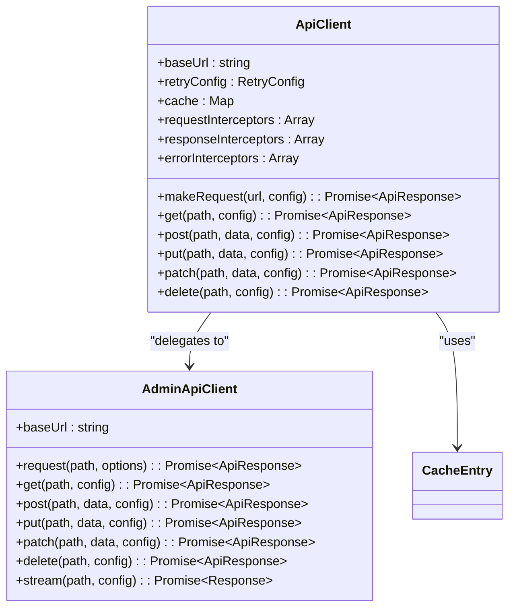
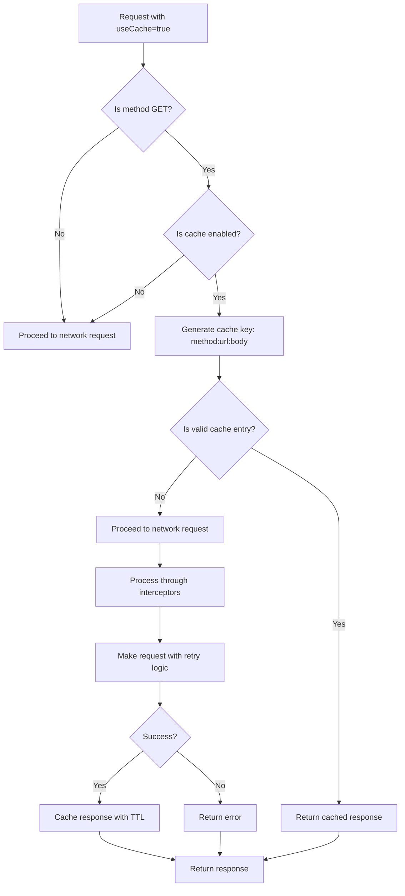
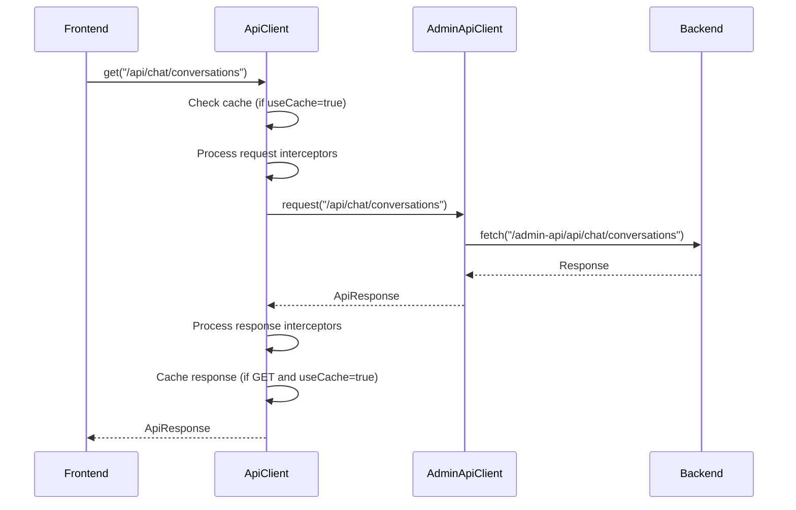
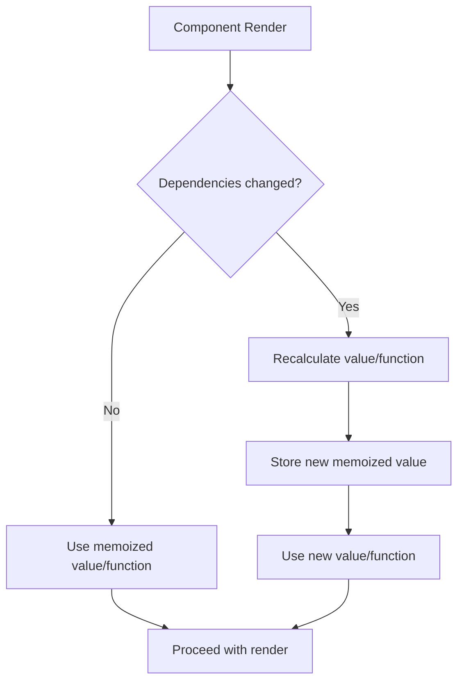

# State Management

<cite>
**Referenced Files in This Document**   
- [context.tsx](file://apps/web/lib/auth/context.tsx)
- [types.ts](file://apps/web/lib/auth/types.ts)
- [session.js](file://apps/admin-ui/lib/session.js)
- [api.js](file://apps/admin-ui/lib/api.js)
- [use-chat.ts](file://apps/web/hooks/use-chat.ts)
- [api-client.ts](file://apps/web/lib/api-client.ts)
- [storage.ts](file://apps/web/lib/chat/storage.ts)
- [admin-client.ts](file://apps/web/lib/api/admin-client.ts)
- [_app.js](file://apps/admin-ui/pages/_app.js)
</cite>

## Table of Contents
1. [Introduction](#introduction)
2. [Authentication State Management](#authentication-state-management)
3. [Client-Side State Management](#client-side-state-management)
4. [Data Fetching and Caching Strategies](#data-fetching-and-caching-strategies)
5. [Frontend-Backend Integration](#frontend-backend-integration)
6. [State Colocation and Performance Optimization](#state-colocation-and-performance-optimization)
7. [Conclusion](#conclusion)

## Introduction
This document provides a comprehensive overview of the state management patterns implemented in both frontend applications within the slimy-monorepo. The documentation covers authentication state management using React Context API with AuthProvider in the web application and SessionProvider in the admin-ui, client-side state management for features like chat interactions and form handling, data fetching and caching strategies, integration between frontend state and backend APIs, and best practices for state colocation and performance optimization.

**Section sources**
- [context.tsx](file://apps/web/lib/auth/context.tsx)
- [session.js](file://apps/admin-ui/lib/session.js)

## Authentication State Management

### Web Application: AuthProvider
The web application implements authentication state management through the AuthProvider component using React Context API. This provider manages the user's authentication state including user data, loading status, error conditions, and session refresh timing.

The AuthProvider initializes with a state containing:
- `user`: null initially, populated after authentication
- `loading`: true during authentication checks
- `error`: null or error message from authentication failures
- `lastRefresh`: timestamp of last successful authentication refresh

Key functionality includes:
- Automatic initial authentication check on component mount
- Periodic token refresh every 25 minutes to maintain active sessions
- Login and logout methods that redirect to the admin API authentication endpoints
- Error handling and state management for failed authentication attempts

**Diagram sources **
- [context.tsx](file://apps/web/lib/auth/context.tsx#L14-L19)
- [types.ts](file://apps/web/lib/auth/types.ts#L18-L30)

### Admin UI: SessionProvider
The admin-ui application implements authentication state management through the SessionProvider component, also using React Context API. This provider manages user session state including CSRF tokens, which are critical for security in the admin interface.

Key features of SessionProvider:
- Manages user object and CSRF token state
- Implements CSRF token storage in sessionStorage for security
- Handles CSRF token acquisition from URL hash during authentication redirects
- Provides automatic session refresh on component mount
- Exposes session refresh and CSRF token update functions

The session state includes:
- `user`: user object from authentication endpoint
- `csrfToken`: security token for form submissions
- `loading`: indicator for authentication status

**Diagram sources **
- [session.js](file://apps/admin-ui/lib/session.js#L30-L34)
- [session.js](file://apps/admin-ui/lib/session.js#L87-L96)

**Section sources**
- [session.js](file://apps/admin-ui/lib/session.js)
- [_app.js](file://apps/admin-ui/pages/_app.js)

## Client-Side State Management

### Chat Interactions
The chat functionality in the web application is managed through the useChat custom hook, which implements comprehensive state management for chat sessions. This hook handles message history, conversation state, personality modes, and interaction with the backend API.

Key state elements managed by useChat:
- Chat session with messages, current mode, timestamps
- Loading state during message processing
- Error state for failed message operations
- Conversation ID tracking for persistence

The hook implements several important patterns:
- Local storage persistence for chat sessions
- Optimistic UI updates during message sending
- Streaming response handling for real-time chat
- Error recovery with message rollback on failure
- Conversation creation and persistence to backend

**Diagram sources **
- [use-chat.ts](file://apps/web/hooks/use-chat.ts#L13-L34)
- [use-chat.ts](file://apps/web/hooks/use-chat.ts#L296-L306)

### Form Handling
Form state management is implemented through controlled components and custom hooks that manage input values, validation states, and submission status. While specific form components are not detailed in the provided code, the pattern follows React best practices with local component state or hook-based state management.

The state management approach for forms includes:
- Local state for form field values
- Validation state tracking
- Submission status (submitting, success, error)
- Integration with the API client for form submission

**Section sources**
- [use-chat.ts](file://apps/web/hooks/use-chat.ts)

## Data Fetching and Caching Strategies

### API Client Architecture
The applications implement a sophisticated data fetching and caching strategy through a layered API client architecture. The web application uses a two-layer approach with AdminApiClient as the foundation and ApiClient providing enhanced features.

#### AdminApiClient (Base Layer)
The AdminApiClient serves as the single source of truth for all Admin API proxy logic, providing:
- Base URL configuration and request building
- Default headers management
- Timeout support with AbortController
- Consistent error handling
- Support for streaming responses (SSE)

#### ApiClient (Enhanced Layer)
The ApiClient wraps AdminApiClient with additional features:
- Request/response interceptors
- Automatic retry with exponential backoff
- Request caching
- Comprehensive error handling
- Request logging

**Diagram sources **
- [admin-client.ts](file://apps/web/lib/api/admin-client.ts#L37-L387)
- [api-client.ts](file://apps/web/lib/api-client.ts#L55-L487)

### Caching Implementation
The ApiClient implements a comprehensive caching strategy with the following features:
- In-memory Map-based cache storage
- Configurable TTL (Time To Live) for cached responses
- Cache key generation based on method, URL, and body
- Automatic cache validation based on TTL
- Cache cleaning for expired entries
- Cache statistics and management methods

Cache behavior:
- GET requests can be cached with configurable TTL (default 5 minutes)
- Cache hits are logged for debugging
- Cache is automatically cleaned of expired entries
- Cache can be manually cleared or cleaned

**Diagram sources **
- [api-client.ts](file://apps/web/lib/api-client.ts#L110-L159)

**Section sources**
- [api-client.ts](file://apps/web/lib/api-client.ts)
- [admin-client.ts](file://apps/web/lib/api/admin-client.ts)

## Frontend-Backend Integration

### Authentication Integration
The authentication flow integrates frontend state with backend APIs through a redirect-based OAuth flow:
1. User initiates login through AuthProvider.login()
2. Redirect to admin-api authentication endpoint
3. Backend handles OAuth flow with Discord
4. Backend sets session cookies and redirects back
5. Frontend refreshes authentication state from /api/auth/me endpoint

The integration includes:
- Cookie-based authentication (credentials: "include")
- CSRF token management in admin-ui
- Periodic session refresh to maintain active sessions
- Error handling for authentication failures

### API Communication Patterns
The applications use consistent patterns for frontend-backend communication:

#### Request Flow

**Diagram sources **
- [api-client.ts](file://apps/web/lib/api-client.ts#L283-L369)
- [admin-client.ts](file://apps/web/lib/api/admin-client.ts#L127-L230)

#### Error Handling
The error handling strategy includes:
- Network error detection and retry logic
- HTTP status code handling
- Application-specific error codes
- User-friendly error messages
- Error logging and monitoring

Retry logic:
- Configurable number of retries (default 3)
- Exponential backoff with configurable multiplier
- Maximum delay between retries
- Retryable error detection (network errors, 5xx, 408, 429)

### Optimistic Updates
The chat functionality implements optimistic updates for a responsive user experience:
1. User sends message
2. Message immediately added to UI state
3. Request sent to backend
4. If successful, assistant response streamed and updated
5. If failed, user message removed from state and error displayed

This pattern provides immediate feedback while maintaining data consistency.

### Data Synchronization
Data synchronization between frontend and backend is managed through:
- Local storage for immediate persistence
- Background synchronization with backend
- Conflict resolution through backend truth
- Migration from local to server storage

The chat storage service handles the migration of localStorage sessions to database storage when users authenticate.

**Section sources**
- [context.tsx](file://apps/web/lib/auth/context.tsx)
- [session.js](file://apps/admin-ui/lib/session.js)
- [api-client.ts](file://apps/web/lib/api-client.ts)
- [use-chat.ts](file://apps/web/hooks/use-chat.ts)
- [storage.ts](file://apps/web/lib/chat/storage.ts)

## State Colocation and Performance Optimization

### State Colocation
The applications follow state colocation principles by keeping state as close as possible to where it's needed:

#### Authentication State
- AuthProvider at root level (app/layout.tsx)
- useAuth hook for consuming authentication state
- Authentication state colocated with the components that need it

#### Chat State
- useChat hook for chat-specific state
- State managed at the chat interface level
- Persistence handled by chatStorage service

#### API Client State
- Singleton instances for ApiClient and adminApiClient
- Interceptors and configuration colocated with the client
- Cache state managed within the client instance

### Performance Optimization

#### Memoization
The applications use React's memoization hooks to prevent unnecessary re-renders:

- `useCallback` for function memoization:
  - AuthProvider.refresh and related functions
  - SessionProvider.refresh and setCsrfToken
  - useChat sendMessage, setPersonalityMode, etc.

- `useMemo` for value memoization:
  - SessionProvider value object
  - Derived state values

**Diagram sources **
- [session.js](file://apps/admin-ui/lib/session.js#L87-L96)
- [use-chat.ts](file://apps/web/hooks/use-chat.ts#L249-L257)

#### Selective Re-renders
The applications minimize re-renders through:
- Context splitting (authentication vs. session vs. chat)
- Custom hooks that expose only necessary state
- Proper dependency arrays in useEffect and useCallback
- Memoized components where appropriate

#### Data Fetching Optimizations
- Caching to avoid redundant network requests
- Request batching where applicable
- Streaming responses to avoid large payload waits
- Error boundaries to contain failures
- Loading states to provide feedback

#### Resource Management
- Cleanup of timers and event listeners
- AbortController for canceling pending requests
- Memory management for cached data
- Periodic cleanup of expired cache entries

**Section sources**
- [context.tsx](file://apps/web/lib/auth/context.tsx)
- [session.js](file://apps/admin-ui/lib/session.js)
- [use-chat.ts](file://apps/web/hooks/use-chat.ts)
- [api-client.ts](file://apps/web/lib/api-client.ts)

## Conclusion
The state management patterns in both frontend applications demonstrate a well-architected approach to handling complex client-side state. The authentication system uses React Context API effectively with AuthProvider in the web application and SessionProvider in the admin-ui, providing robust session management with security considerations like CSRF token handling.

Client-side state management for features like chat interactions is implemented through custom hooks that encapsulate complex logic while providing a simple interface. The data fetching and caching strategies are sophisticated, with a layered API client architecture that provides reliability through retry logic and performance through caching.

The integration between frontend state and backend APIs is well-designed, with optimistic updates, error recovery, and data synchronization patterns that provide a responsive user experience while maintaining data consistency. State colocation principles are followed, keeping state close to where it's needed, and performance optimizations through memoization and selective re-renders ensure efficient application performance.

Overall, the state management implementation balances complexity with maintainability, providing a solid foundation for the applications' functionality while adhering to React best practices.

**Section sources**
- [context.tsx](file://apps/web/lib/auth/context.tsx)
- [session.js](file://apps/admin-ui/lib/session.js)
- [use-chat.ts](file://apps/web/hooks/use-chat.ts)
- [api-client.ts](file://apps/web/lib/api-client.ts)