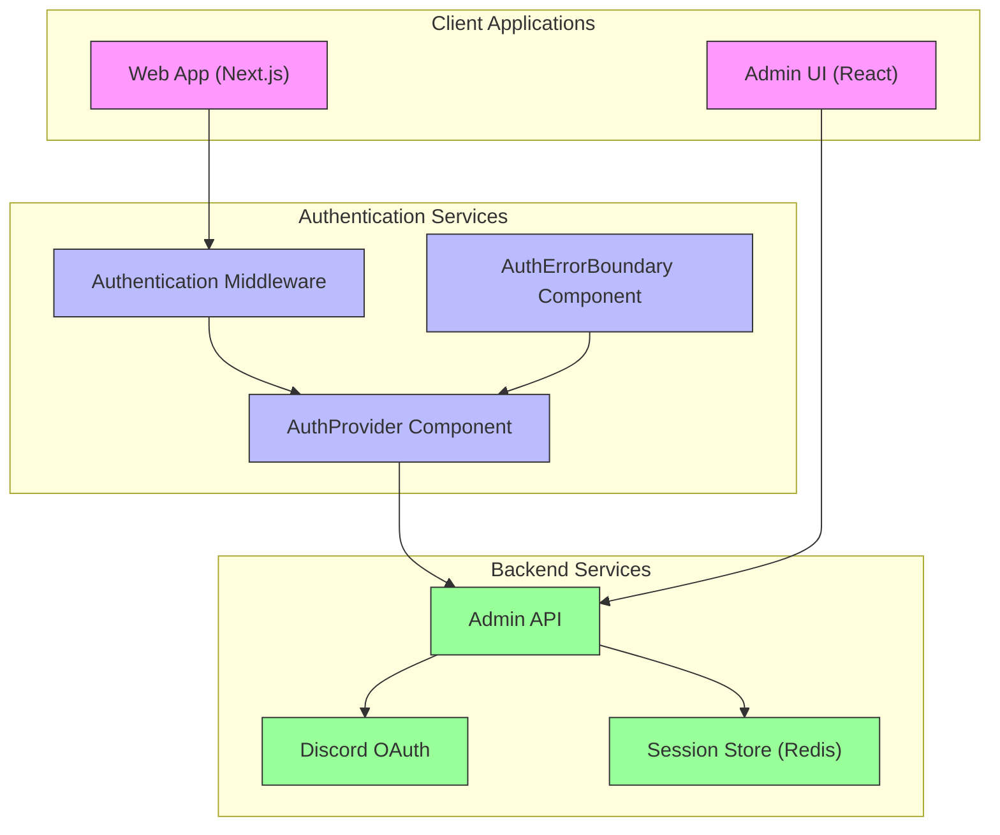
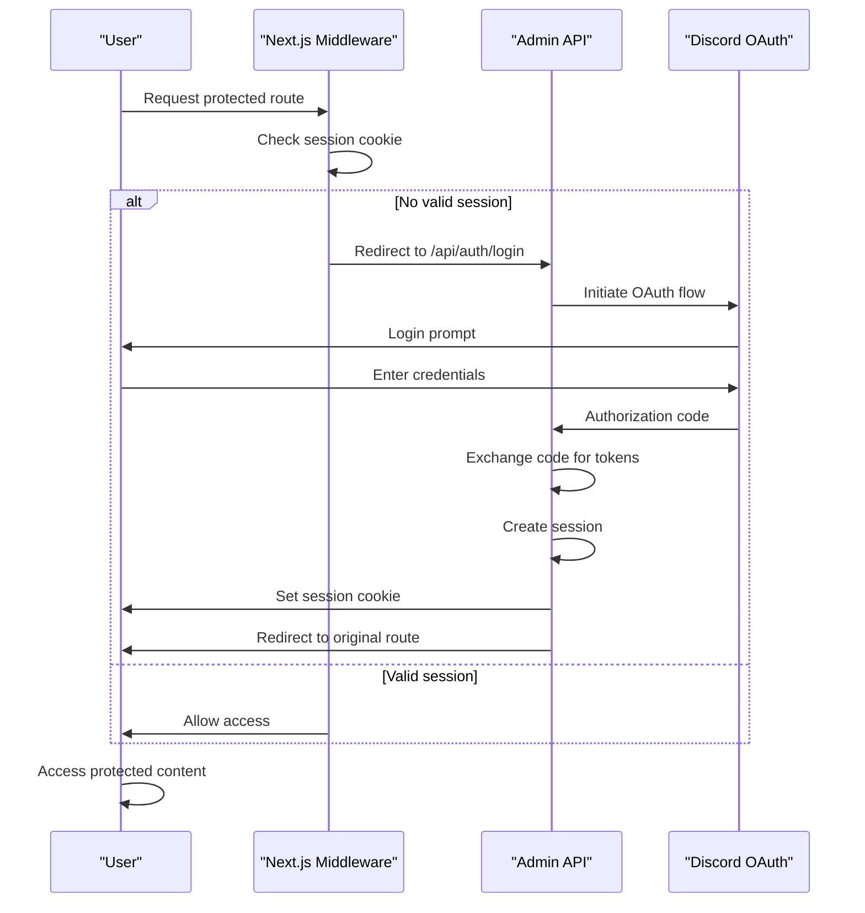
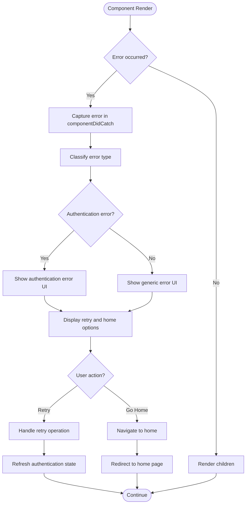
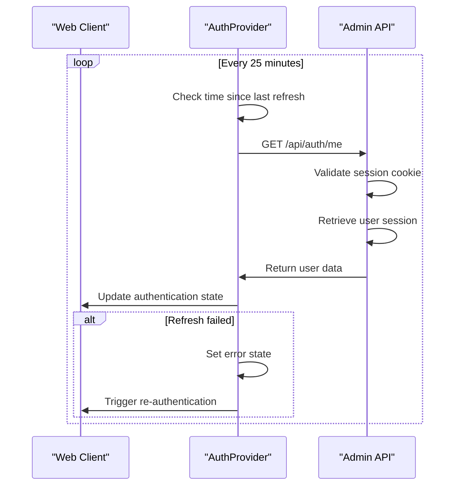
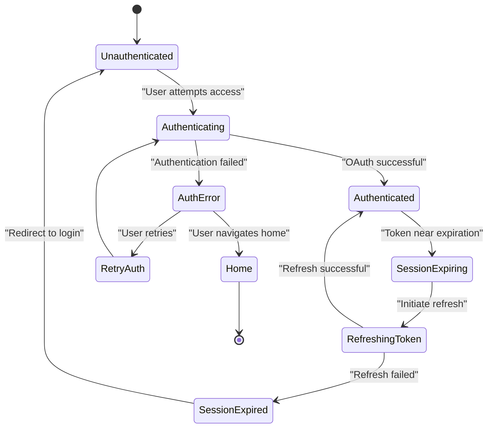

# Authentication Flow

<cite>
**Referenced Files in This Document**   
- [auth.js](file://apps/admin-api/src/middleware/auth.js)
- [auth.js](file://apps/admin-api/src/routes/auth.js)
- [context.tsx](file://apps/web/lib/auth/context.tsx)
- [middleware.ts](file://apps/web/middleware.ts)
- [error-boundary.tsx](file://apps/web/components/auth/error-boundary.tsx)
- [protected-route.tsx](file://apps/web/components/auth/protected-route.tsx)
- [session.js](file://apps/admin-ui/lib/session.js)
- [jwt.js](file://apps/admin-api/lib/jwt.js)
- [token.js](file://apps/admin-api/src/services/token.js)
- [types.ts](file://apps/web/lib/auth/types.ts)
</cite>

## Table of Contents
1. [Introduction](#introduction)
2. [Authentication Architecture Overview](#authentication-architecture-overview)
3. [Middleware-Based Authentication Flow](#middleware-based-authentication-flow)
4. [AuthProvider Component and Session Management](#authprovider-component-and-session-management)
5. [AuthErrorBoundary Component](#autherrorboundary-component)
6. [Session Refresh and Token Management](#session-refresh-and-token-management)
7. [Protected Route Implementation](#protected-route-implementation)
8. [Error Handling Strategies](#error-handling-strategies)
9. [Conclusion](#conclusion)

## Introduction
The authentication system in the Slimy monorepo is a multi-layered architecture that combines server-side middleware, client-side React components, and token-based session management to provide secure access control across multiple applications. The system is designed to handle user authentication via Discord OAuth, manage session state across the admin API and web applications, and provide robust error handling for authentication-related issues. This document details the complete authentication flow, from initial login to session management and error recovery.

## Authentication Architecture Overview

The authentication system spans multiple applications within the monorepo, with distinct responsibilities for each component:



**Diagram sources**
- [middleware.ts](file://apps/web/middleware.ts#L1-L94)
- [context.tsx](file://apps/web/lib/auth/context.tsx#L1-L156)
- [auth.js](file://apps/admin-api/src/routes/auth.js#L1-L401)

**Section sources**
- [middleware.ts](file://apps/web/middleware.ts#L1-L94)
- [context.tsx](file://apps/web/lib/auth/context.tsx#L1-L156)
- [auth.js](file://apps/admin-api/src/routes/auth.js#L1-L401)

## Middleware-Based Authentication Flow

The authentication flow begins with Next.js middleware that intercepts requests to protected routes and redirects unauthenticated users to the admin API login endpoint. This middleware operates at the edge, ensuring authentication checks occur before requests reach page components.

The flow proceeds as follows:
1. User attempts to access a protected route
2. Middleware checks for the presence of the session cookie
3. If no valid session cookie exists, the user is redirected to the admin API login endpoint
4. The admin API handles Discord OAuth authentication
5. Upon successful authentication, a JWT token is issued and stored as a cookie
6. The user is redirected back to the originally requested resource



**Diagram sources**
- [middleware.ts](file://apps/web/middleware.ts#L1-L94)
- [auth.js](file://apps/admin-api/src/routes/auth.js#L108-L119)

**Section sources**
- [middleware.ts](file://apps/web/middleware.ts#L1-L94)
- [auth.js](file://apps/admin-api/src/routes/auth.js#L1-L401)

## AuthProvider Component and Session Management

The `AuthProvider` component manages user session state and CSRF tokens in the web application. It uses React Context to provide authentication state to all components in the application, enabling consistent access to user data and authentication methods.

Key responsibilities of the AuthProvider include:
- Initializing authentication state on component mount
- Managing user session data and loading states
- Handling login and logout operations
- Implementing automatic session refresh
- Providing CSRF token management

```mermaid
classDiagram
class AuthProvider {
+children : ReactNode
-state : AuthState
-refresh() : Promise~void~
-login() : void
-logout() : void
+constructor(props)
}
class AuthContextType {
+user : AuthUser | null
+loading : boolean
+error : string | null
+lastRefresh : number
+login() : void
+logout() : void
+refresh() : Promise~void~
}
class AuthState {
+user : AuthUser | null
+loading : boolean
+error : string | null
+lastRefresh : number
}
AuthProvider --> AuthContextType : "provides"
AuthProvider --> AuthState : "manages"
AuthProvider --> "apiClient" : "uses"
note right of AuthProvider
Manages authentication state and provides
context for all components in the application.
Handles session refresh every 25 minutes.
end note
```

**Diagram sources**
- [context.tsx](file://apps/web/lib/auth/context.tsx#L1-L156)
- [types.ts](file://apps/web/lib/auth/types.ts#L1-L30)

**Section sources**
- [context.tsx](file://apps/web/lib/auth/context.tsx#L1-L156)
- [types.ts](file://apps/web/lib/auth/types.ts#L1-L30)

## AuthErrorBoundary Component

The `AuthErrorBoundary` component handles authentication-related errors with retry and navigation options. It uses React's error boundary mechanism to catch errors that occur during rendering and provides a user-friendly interface for error recovery.

The component detects authentication-specific errors by examining error messages for keywords like "auth", "unauthorized", or "forbidden". When such errors occur, it displays a specialized error interface with options to retry the operation or navigate back to the home page.



**Diagram sources**
- [error-boundary.tsx](file://apps/web/components/auth/error-boundary.tsx#L1-L119)

**Section sources**
- [error-boundary.tsx](file://apps/web/components/auth/error-boundary.tsx#L1-L119)

## Session Refresh and Token Management

The system implements a proactive session refresh mechanism to maintain user authentication without requiring re-login. The AuthProvider automatically refreshes the session every 25 minutes, anticipating the 30-minute session duration on the admin API.

Token management is handled through JWT (JSON Web Tokens) stored in HTTP-only cookies. The system uses the `jsonwebtoken` library to sign and verify tokens, with configurable secret keys and expiration times. CSRF tokens are also managed to prevent cross-site request forgery attacks.



**Diagram sources**
- [context.tsx](file://apps/web/lib/auth/context.tsx#L83-L116)
- [auth.js](file://apps/admin-api/src/routes/auth.js#L376-L390)

**Section sources**
- [context.tsx](file://apps/web/lib/auth/context.tsx#L1-L156)
- [auth.js](file://apps/admin-api/src/routes/auth.js#L1-L401)

## Protected Route Implementation

Protected routes are implemented using the `ProtectedRoute` component, which provides both authentication and role-based access control. The component can be configured with required roles, custom fallback UI, and redirect destinations.

The implementation uses Next.js navigation hooks to handle redirects while maintaining proper React rendering rules. It also provides a higher-order component wrapper (`withAuth`) for easily protecting entire page components.

```mermaid
classDiagram
class ProtectedRoute {
+children : ReactNode
+requiredRole : Role
+fallback : ReactNode
+redirectTo : string
+requireAuth : boolean
-useEffect() : void
+render() : ReactNode
}
class Role {
+user : "user"
+club : "club"
+admin : "admin"
}
class withAuth {
+Component : ReactComponent
+options : ProtectedRouteProps
+AuthenticatedComponent() : ReactNode
}
ProtectedRoute --> Role : "uses"
withAuth --> ProtectedRoute : "wraps"
note right of ProtectedRoute
Handles both authentication and role-based
access control. Shows loading skeleton
during authentication checks.
end note
note right of withAuth
Higher-order component that wraps another
component with ProtectedRoute for easy
page-level protection.
end note
```

**Diagram sources**
- [protected-route.tsx](file://apps/web/components/auth/protected-route.tsx#L1-L139)

**Section sources**
- [protected-route.tsx](file://apps/web/components/auth/protected-route.tsx#L1-L139)

## Error Handling Strategies

The authentication system implements comprehensive error handling strategies for various failure scenarios:

1. **Expired Sessions**: When a session expires, the system redirects the user to the login page via the admin API. The middleware detects missing or invalid session cookies and initiates the re-authentication flow.

2. **Failed Token Refresh**: If the automatic token refresh fails, the AuthProvider sets an error state and the ProtectedRoute component handles the redirect to the login page. Users can also manually retry the authentication process.

3. **Authentication Errors**: The AuthErrorBoundary component catches rendering errors related to authentication and provides user-friendly recovery options, including retry and navigation to the home page.

4. **Network Errors**: The system gracefully handles network connectivity issues by maintaining the current authentication state and allowing users to retry when connectivity is restored.



**Diagram sources**
- [context.tsx](file://apps/web/lib/auth/context.tsx#L44-L52)
- [protected-route.tsx](file://apps/web/components/auth/protected-route.tsx#L39-L57)
- [error-boundary.tsx](file://apps/web/components/auth/error-boundary.tsx#L43-L49)

**Section sources**
- [context.tsx](file://apps/web/lib/auth/context.tsx#L1-L156)
- [protected-route.tsx](file://apps/web/components/auth/protected-route.tsx#L1-L139)
- [error-boundary.tsx](file://apps/web/components/auth/error-boundary.tsx#L1-L119)

## Conclusion
The authentication system in the Slimy monorepo provides a robust, multi-layered approach to user authentication and access control. By combining server-side middleware, client-side React components, and token-based session management, the system ensures secure access to protected resources while providing a seamless user experience. The middleware-based approach efficiently handles authentication at the edge, reducing the need for duplicate checks in individual components. The AuthProvider component centralizes session management and automatic refresh, while the AuthErrorBoundary and ProtectedRoute components provide flexible error handling and access control. This architecture effectively balances security, performance, and developer experience across the monorepo's applications.