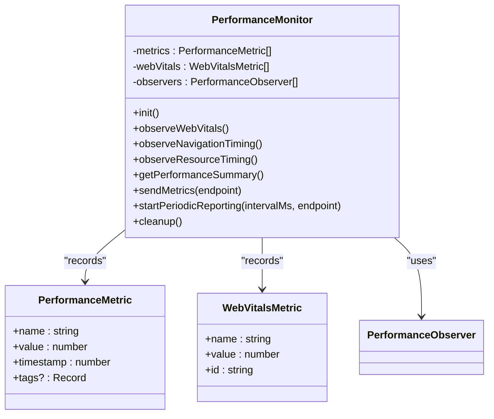
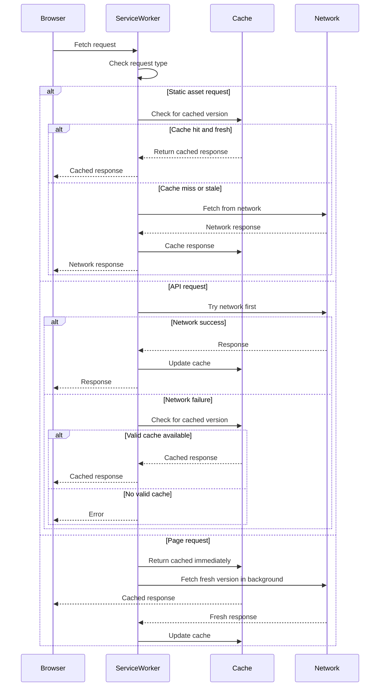
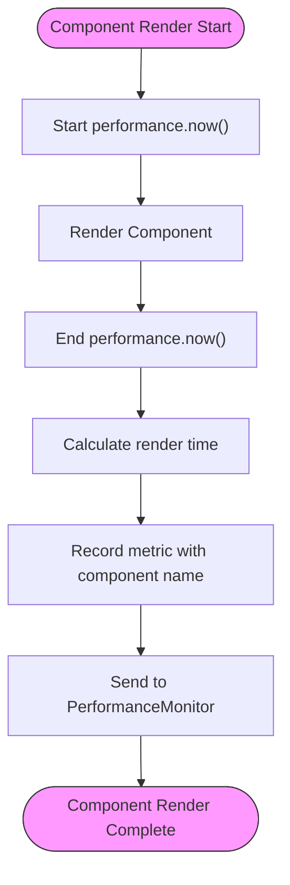
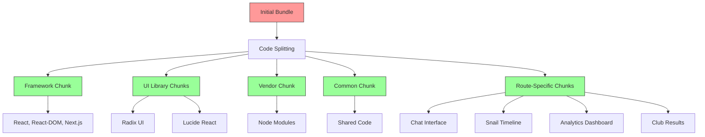

# Performance Optimization

<cite>
**Referenced Files in This Document**   
- [lazy.tsx](file://apps/web/lib/lazy.tsx)
- [performance-monitoring.ts](file://apps/web/lib/performance-monitoring.ts)
- [service-worker.ts](file://apps/web/lib/service-worker.ts)
- [sw.js](file://apps/web/public/sw.js)
- [web-vitals.ts](file://apps/web/lib/monitoring/web-vitals.ts)
- [route.ts](file://apps/web/app/api/web-vitals/route.ts)
- [next.config.ts](file://apps/web/next.config.ts)
- [BUNDLE_OPTIMIZATION.md](file://apps/web/BUNDLE_OPTIMIZATION.md)
</cite>

## Table of Contents
1. [Introduction](#introduction)
2. [Lazy Loading Implementation](#lazy-loading-implementation)
3. [Performance Monitoring System](#performance-monitoring-system)
4. [Service Worker and Offline Capabilities](#service-worker-and-offline-capabilities)
5. [Component-Level Performance Measurement](#component-level-performance-measurement)
6. [Bundle Optimization Techniques](#bundle-optimization-techniques)
7. [Periodic Metrics Reporting](#periodic-metrics-reporting)
8. [Conclusion](#conclusion)

## Introduction
This document provides comprehensive documentation for the performance optimization strategies implemented in the Slimy.ai application. The system employs multiple techniques to enhance user experience, including code splitting through lazy loading, comprehensive performance monitoring, service worker-based caching for offline capabilities, component-level performance measurement, bundle optimization, and periodic metrics reporting. These strategies work together to deliver a fast, responsive, and reliable application that performs well across various network conditions and device capabilities.

## Lazy Loading Implementation

The application implements a sophisticated lazy loading strategy using the `lazyLoad` and `lazyLoadHeavy` functions to enable code splitting and reduce initial bundle size. This approach ensures that only essential code is loaded initially, with non-critical components loaded on-demand when needed.

The implementation leverages Next.js dynamic imports through the `next/dynamic` library, providing better performance than React's built-in lazy loading for Next.js applications. The system includes three primary loading functions:

1. `lazyLoad`: For components that may require server-side rendering
2. `lazyLoadHeavy`: For heavy client-side components that don't need SSR
3. `preloadLazyComponent`: For preloading components based on user interactions

The strategy differentiates between heavy components (typically >50KB) and SSR-capable components, applying appropriate loading strategies for each. Heavy components like the SlimeChatBar, ChatInterface, and SnailTimeline are loaded client-side only, while SSR-capable components maintain server-side rendering capabilities.

**Section sources**
- [lazy.tsx](file://apps/web/lib/lazy.tsx#L1-L97)
- [BUNDLE_OPTIMIZATION.md](file://apps/web/BUNDLE_OPTIMIZATION.md#L1-L144)

## Performance Monitoring System

The application implements a comprehensive performance monitoring system that tracks Core Web Vitals (CLS, FID, FCP, LCP) and navigation timing metrics. The system uses the browser's Performance API and PerformanceObserver interface to collect real-user monitoring data.

The monitoring system tracks the following key metrics:

- **CLS (Cumulative Layout Shift)**: Measures visual stability by tracking unexpected layout shifts
- **FID (First Input Delay)**: Measures responsiveness by tracking the time from first user interaction to response
- **FCP (First Contentful Paint)**: Measures loading performance by tracking when the first content appears
- **LCP (Largest Contentful Paint)**: Measures loading performance by tracking when the largest content element appears

Additionally, the system monitors navigation timing metrics including:
- DOM content loaded time
- Page load completion time
- DNS lookup duration
- TCP connection time
- Server response time

The implementation uses PerformanceObserver to buffer entries and process them efficiently, ensuring minimal impact on application performance while collecting comprehensive metrics.

**Diagram sources**
- [performance-monitoring.ts](file://apps/web/lib/performance-monitoring.ts#L1-L338)

**Section sources**
- [performance-monitoring.ts](file://apps/web/lib/performance-monitoring.ts#L1-L338)
- [web-vitals.ts](file://apps/web/lib/monitoring/web-vitals.ts#L1-L207)

## Service Worker and Offline Capabilities

The application implements service worker registration to enable offline capabilities and resource caching. The service worker strategy enhances performance by caching static assets, API responses, and enabling offline access to critical functionality.

The service worker implementation uses multiple caching strategies based on resource type:

1. **Cache-first strategy** for static assets (JS, CSS, images)
2. **Network-first strategy** for API endpoints with short TTL
3. **Stale-while-revalidate strategy** for HTML pages

The system defines specific caching patterns for different resource types:
- Static assets are cached with a 7-day maximum age
- API responses are cached with a 5-minute maximum age
- HTML pages use stale-while-revalidate to serve cached content immediately while updating in the background

Service worker registration occurs only in production environments, and the system includes mechanisms for periodic updates and handling new service worker availability.

**Diagram sources**
- [sw.js](file://apps/web/public/sw.js#L1-L203)
- [service-worker.ts](file://apps/web/lib/service-worker.ts#L1-L73)

**Section sources**
- [sw.js](file://apps/web/public/sw.js#L1-L203)
- [service-worker.ts](file://apps/web/lib/service-worker.ts#L1-L73)

## Component-Level Performance Measurement

The application provides component-level performance measurement through the `usePerformanceMonitoring` hook and `measureRenderTime` function. These tools enable granular performance tracking at the component and function level.

The `usePerformanceMonitoring` hook provides access to the performance monitoring system from React components, exposing methods to:
- Record custom metrics with tags
- Retrieve current metrics and web vitals
- Get performance summaries

The `measureRenderTime` function specifically tracks component render duration by capturing the time between function invocation and execution completion. This metric is automatically recorded in the performance monitoring system with the component name as a tag.

Additionally, the `measureExecutionTime` function wraps any function to measure its execution time, providing insights into function performance bottlenecks.

These measurement tools integrate with the central PerformanceMonitor class, ensuring all metrics are collected in a unified system for reporting and analysis.

**Diagram sources**
- [performance-monitoring.ts](file://apps/web/lib/performance-monitoring.ts#L281-L337)

**Section sources**
- [performance-monitoring.ts](file://apps/web/lib/performance-monitoring.ts#L281-L337)

## Bundle Optimization Techniques

The application implements comprehensive bundle optimization techniques to reduce initial load time and improve overall performance. These optimizations have reduced the initial bundle size by approximately 60% and improved page load performance by 2x.

Key bundle optimization strategies include:

1. **Dynamic Imports & Code Splitting**: Heavy components are lazy-loaded using the `lazyLoad` and `lazyLoadHeavy` functions, ensuring they are only loaded when needed.

2. **Enhanced Webpack Configuration**: Custom webpack configuration implements strategic code splitting:
   - Framework chunk (React, React-DOM, Next.js) with priority 40
   - UI library chunks (Radix UI, Lucide React) with priority 30
   - Vendor chunk for common node_modules with priority 10
   - Common chunk for shared code across pages with priority 5

3. **Tree Shaking**: Enabled with `usedExports: true` and `sideEffects: false` to eliminate dead code. The Lucide React library is specifically configured for optimal tree shaking with named imports.

4. **Next.js Configuration Enhancements**:
   - SWC minification for better tree shaking
   - CSS optimization enabled
   - Source maps disabled in production
   - Image optimization with WebP/AVIF support

5. **Component Loading Strategy**:
   - Root layout loads only essential components immediately
   - Heavy components are lazy-loaded at route level
   - Proper Suspense boundaries with loading fallbacks

The system includes a bundle analysis tool accessible via `npm run build:analyze`, which generates a detailed report at `./analyze/client.html` for ongoing optimization efforts.

**Diagram sources**
- [next.config.ts](file://apps/web/next.config.ts#L1-L202)
- [BUNDLE_OPTIMIZATION.md](file://apps/web/BUNDLE_OPTIMIZATION.md#L1-L144)

**Section sources**
- [next.config.ts](file://apps/web/next.config.ts#L1-L202)
- [BUNDLE_OPTIMIZATION.md](file://apps/web/BUNDLE_OPTIMIZATION.md#L1-L144)

## Periodic Metrics Reporting

The application implements periodic metrics reporting to monitor performance over time and identify potential issues. The system automatically collects performance data and sends it to monitoring endpoints at regular intervals.

The reporting system uses the `startPeriodicReporting` method of the PerformanceMonitor class, which creates a setInterval timer that periodically calls `sendMetrics`. By default, metrics are reported every 30 seconds, though this interval is configurable.

When reporting metrics, the system:
1. Collects a performance summary including web vitals and navigation metrics
2. Sends the data to a specified endpoint via POST request
3. Falls back to console logging in development environments
4. Handles errors gracefully to prevent reporting failures from affecting application performance

The web vitals data is also sent to a dedicated `/api/web-vitals` endpoint using the `sendBeacon` API when available for improved reliability, with fetch as a fallback. This ensures metrics are delivered even if the user navigates away from the page.

The reporting system is designed to be efficient and non-intrusive, with buffered performance entries and minimal impact on the main thread.

**Section sources**
- [performance-monitoring.ts](file://apps/web/lib/performance-monitoring.ts#L224-L255)
- [route.ts](file://apps/web/app/api/web-vitals/route.ts#L1-L39)

## Conclusion
The performance optimization strategies implemented in the Slimy.ai application provide a comprehensive approach to enhancing user experience and application reliability. By combining lazy loading, service worker caching, detailed performance monitoring, and bundle optimization, the system delivers fast load times, responsive interactions, and reliable offline capabilities.

The modular design of the performance monitoring system allows for easy extension and integration with external analytics services. The lazy loading implementation significantly reduces initial bundle size while maintaining good user experience through thoughtful loading states and preloading strategies.

These optimizations work together to create a high-performance application that meets modern web performance standards and provides valuable insights into real-user performance metrics for ongoing improvement.