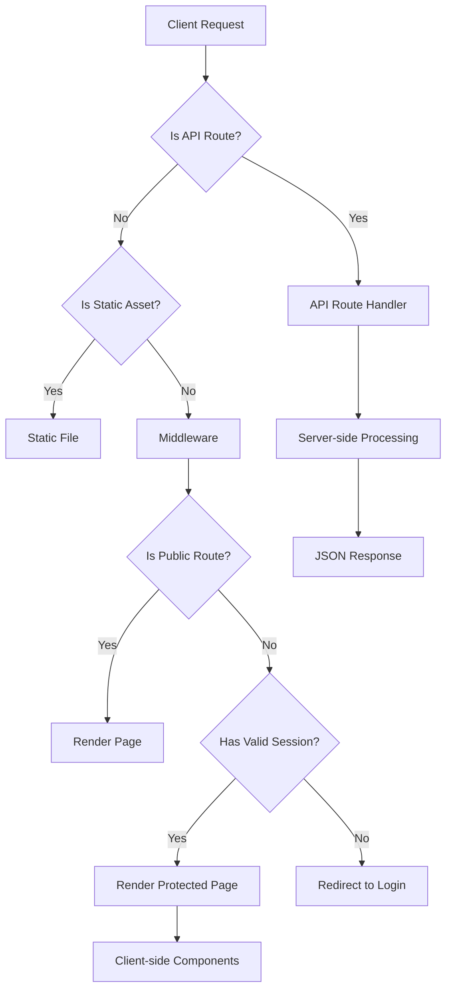
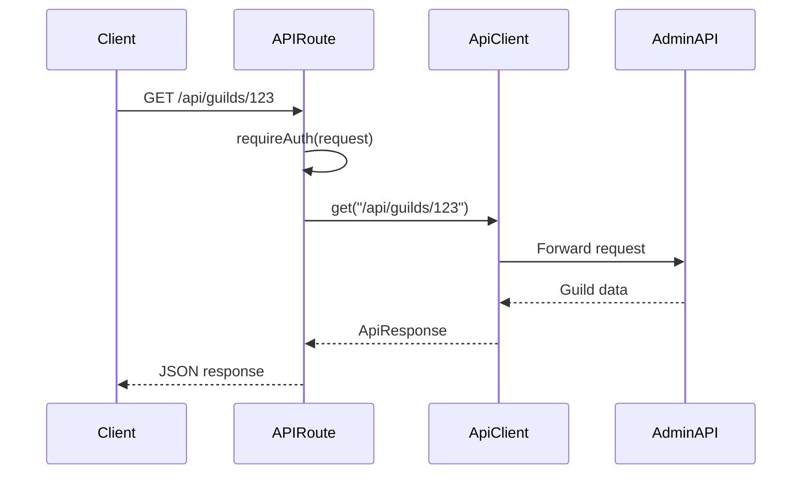
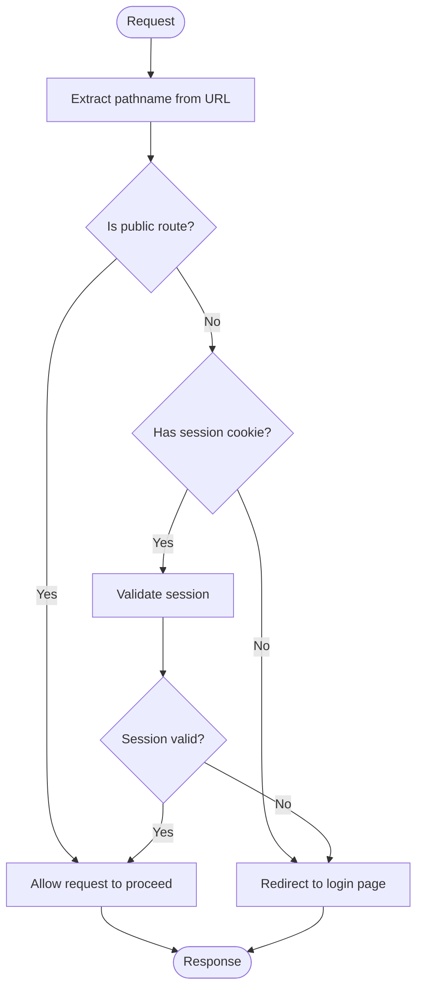
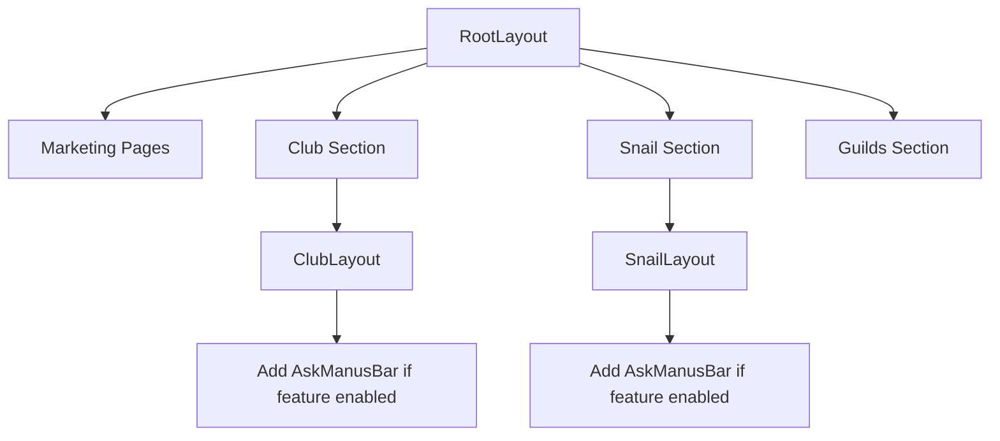
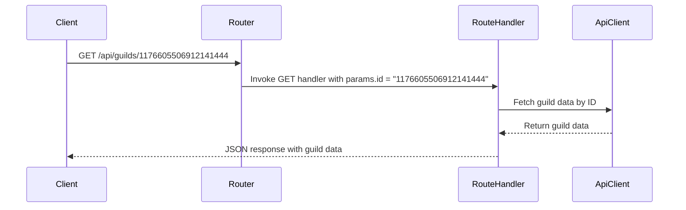
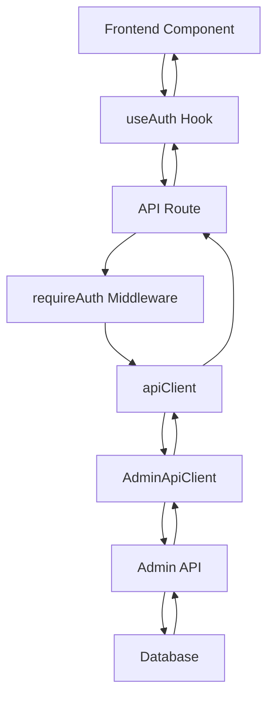
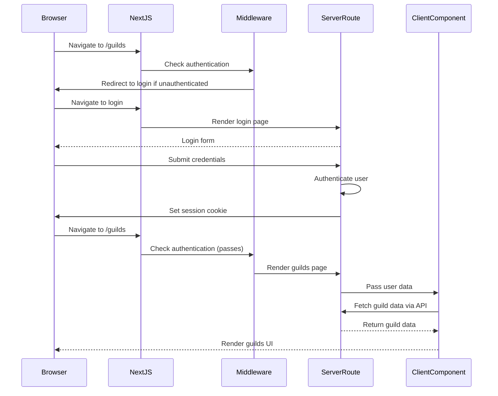

# Routing System

<cite>
**Referenced Files in This Document**   
- [middleware.ts](file://apps/web/middleware.ts)
- [app/api/auth/me/route.ts](file://apps/web/app/api/auth/me/route.ts)
- [app/api/guilds/[id]/route.ts](file://apps/web/app/api/guilds/[id]/route.ts)
- [app/layout.tsx](file://apps/web/app/layout.tsx)
- [components/auth/protected-route.tsx](file://apps/web/components/auth/protected-route.tsx)
- [app/(marketing)/page.tsx](file://apps/web/app/(marketing)/page.tsx)
- [app/club/layout.tsx](file://apps/web/app/club/layout.tsx)
- [app/snail/layout.tsx](file://apps/web/app/snail/layout.tsx)
- [lib/auth/server.ts](file://apps/web/lib/auth/server.ts)
- [lib/api-client.ts](file://apps/web/lib/api-client.ts)
</cite>

## Table of Contents
1. [Introduction](#introduction)
2. [Project Structure](#project-structure)
3. [Core Components](#core-components)
4. [Architecture Overview](#architecture-overview)
5. [Detailed Component Analysis](#detailed-component-analysis)
6. [Dependency Analysis](#dependency-analysis)
7. [Performance Considerations](#performance-considerations)
8. [Troubleshooting Guide](#troubleshooting-guide)
9. [Conclusion](#conclusion)

## Introduction
This document provides comprehensive documentation for the Next.js App Router routing system implemented in the Slimy.ai web application. The system features a file-based routing structure with route handlers in the app directory, middleware for authentication checks, and a flexible layout system. The routing architecture is designed to support both public marketing pages and protected administrative interfaces, with clear separation between client-side navigation and server-side route handling.

## Project Structure

The Next.js App Router structure follows a conventional organization with special routing features:

```mermaid
graph TD
A[app/] --> B[layout.tsx]
A --> C[page.tsx]
A --> D[api/]
A --> E[(marketing)/]
A --> F[club/]
A --> G[snail/]
A --> H[guilds/]
D --> I[auth/me/route.ts]
D --> J[guilds/[id]/route.ts]
E --> K[page.tsx]
F --> L[layout.tsx]
G --> M[layout.tsx]
```

**Diagram sources**
- [app/layout.tsx](file://apps/web/app/layout.tsx)
- [app/api/auth/me/route.ts](file://apps/web/app/api/auth/me/route.ts)
- [app/api/guilds/[id]/route.ts](file://apps/web/app/api/guilds/[id]/route.ts)
- [app/(marketing)/page.tsx](file://apps/web/app/(marketing)/page.tsx)
- [app/club/layout.tsx](file://apps/web/app/club/layout.tsx)
- [app/snail/layout.tsx](file://apps/web/app/snail/layout.tsx)

**Section sources**
- [app/layout.tsx](file://apps/web/app/layout.tsx)
- [app/api/auth/me/route.ts](file://apps/web/app/api/auth/me/route.ts)

## Core Components

The routing system consists of several core components that work together to provide a robust navigation experience. These include the file-based routing structure, middleware for authentication, API route handlers, and layout components that provide consistent UI across different sections of the application. The system is designed to handle both public and protected routes with appropriate access controls.

**Section sources**
- [middleware.ts](file://apps/web/middleware.ts)
- [app/layout.tsx](file://apps/web/app/layout.tsx)
- [components/auth/protected-route.tsx](file://apps/web/components/auth/protected-route.tsx)

## Architecture Overview

The routing architecture implements a multi-layered approach to navigation and access control:



**Diagram sources**
- [middleware.ts](file://apps/web/middleware.ts)
- [app/api/auth/me/route.ts](file://apps/web/app/api/auth/me/route.ts)
- [app/api/guilds/[id]/route.ts](file://apps/web/app/api/guilds/[id]/route.ts)

## Detailed Component Analysis

### File-based Routing Structure
The application uses the Next.js App Router with a file-based routing system. Each directory in the app folder represents a route segment, and page.tsx files define the UI for that route. Special directories like (marketing) use parentheses to create route groups that don't appear in the URL path.

**Section sources**
- [app/(marketing)/page.tsx](file://apps/web/app/(marketing)/page.tsx)
- [app/club/page.tsx](file://apps/web/app/club/page.tsx)

### Route Handlers in API Directory
API routes are implemented as server-side functions in the app/api directory. Each route file exports HTTP method handlers (GET, POST, PATCH, DELETE) that process requests and return responses. These handlers can access server-side resources and implement business logic.

#### API Route Handler Example


**Diagram sources**
- [app/api/guilds/[id]/route.ts](file://apps/web/app/api/guilds/[id]/route.ts)
- [lib/api-client.ts](file://apps/web/lib/api-client.ts)
- [lib/auth/server.ts](file://apps/web/lib/auth/server.ts)

### Middleware Implementation for Authentication
The middleware.ts file implements authentication checks for protected routes. It examines the request pathname and session cookie to determine whether to allow access or redirect to login. The middleware uses a matcher configuration to exclude API routes and static assets from authentication checks.

#### Authentication Middleware Flow


**Diagram sources**
- [middleware.ts](file://apps/web/middleware.ts)

### Matcher Configuration
The middleware configuration uses a matcher pattern to exclude certain routes from authentication checks. This includes API routes, static assets, and files with extensions. The configuration ensures that only page routes are subject to authentication middleware.

```typescript
export const config = {
  matcher: [
    "/((?!api|_next/static|_next/image|favicon.ico|.*\\.).*)",
  ],
};
```

**Section sources**
- [middleware.ts](file://apps/web/middleware.ts#L81-L93)

### Layout System with RootLayout and Nested Layouts
The application implements a hierarchical layout system with a RootLayout and nested layouts for different sections. The RootLayout in app/layout.tsx provides the overall page structure, while nested layouts in specific directories (like club and snail) add section-specific UI elements.

#### Layout Hierarchy


**Diagram sources**
- [app/layout.tsx](file://apps/web/app/layout.tsx)
- [app/club/layout.tsx](file://apps/web/app/club/layout.tsx)
- [app/snail/layout.tsx](file://apps/web/app/snail/layout.tsx)

### Dynamic Routes with [id] Parameters
The application uses dynamic route segments with bracket notation ([id]) to create parameterized routes. These routes can access the parameter value through the params object in route handlers and page components.

#### Dynamic Route Example


**Diagram sources**
- [app/api/guilds/[id]/route.ts](file://apps/web/app/api/guilds/[id]/route.ts)

### API Route Integrations
API routes integrate with the backend Admin API through a proxy mechanism. The apiClient utility handles request forwarding, authentication, caching, and error handling. This abstraction allows the frontend to communicate with the backend services while maintaining separation of concerns.

#### API Integration Architecture


**Diagram sources**
- [lib/auth/server.ts](file://apps/web/lib/auth/server.ts)
- [lib/api-client.ts](file://apps/web/lib/api-client.ts)
- [app/api/auth/me/route.ts](file://apps/web/app/api/auth/me/route.ts)

### Relationship Between Client-side Navigation and Server-side Route Handling
The application implements a hybrid approach where client-side navigation handles UI transitions while server-side route handlers manage data fetching and authentication. This separation ensures optimal performance and security.

#### Navigation Flow


**Diagram sources**
- [middleware.ts](file://apps/web/middleware.ts)
- [components/auth/protected-route.tsx](file://apps/web/components/auth/protected-route.tsx)
- [app/api/auth/me/route.ts](file://apps/web/app/api/auth/me/route.ts)

## Dependency Analysis

The routing system components have the following dependencies:

```mermaid
graph LR
A[middleware.ts] --> B[lib/auth/server.ts]
A --> C[app/api/auth/me/route.ts]
D[app/layout.tsx] --> E[components/layout/app-shell.tsx]
F[components/auth/protected-route.tsx] --> G[lib/auth/context.tsx]
F --> H[app/api/auth/me/route.ts]
I[lib/api-client.ts] --> J[lib/api/admin-client.ts]
K[app/api/guilds/[id]/route.ts] --> L[lib/api-client.ts]
K --> M[lib/auth/server.ts]
```

**Diagram sources**
- [middleware.ts](file://apps/web/middleware.ts)
- [app/layout.tsx](file://apps/web/app/layout.tsx)
- [components/auth/protected-route.tsx](file://apps/web/components/auth/protected-route.tsx)
- [lib/api-client.ts](file://apps/web/lib/api-client.ts)
- [app/api/guilds/[id]/route.ts](file://apps/web/app/api/guilds/[id]/route.ts)

**Section sources**
- [middleware.ts](file://apps/web/middleware.ts)
- [lib/api-client.ts](file://apps/web/lib/api-client.ts)

## Performance Considerations

The routing system includes several performance optimizations:

1. **Caching**: API responses are cached with configurable TTL values to reduce redundant requests
2. **Code Splitting**: Next.js automatically splits code by route to minimize initial bundle size
3. **Static Asset Optimization**: Images and static files are optimized and cached aggressively
4. **Middleware Efficiency**: The matcher configuration minimizes the number of requests processed by middleware
5. **Client-side Navigation**: After initial load, navigation between pages occurs client-side without full page reloads

These optimizations ensure fast page loads and responsive navigation throughout the application.

## Troubleshooting Guide

Common routing issues and their solutions:

1. **Authentication Redirects Not Working**
   - Check that NEXT_PUBLIC_ADMIN_API_BASE environment variable is set
   - Verify session cookie name matches between frontend and backend
   - Ensure middleware matcher configuration excludes API routes

2. **Dynamic Routes Not Resolving**
   - Confirm parameter names match between route definition and usage
   - Check that dynamic segments use correct bracket notation ([id])
   - Verify server-side route handlers properly extract parameters

3. **Layout Components Not Rendering**
   - Ensure layout files are named layout.tsx
   - Check that layout components properly wrap children
   - Verify import paths for layout components

4. **API Routes Returning 404**
   - Confirm route file is in the correct directory (app/api)
   - Check that HTTP method handlers are properly exported
   - Verify the route path matches the file structure

**Section sources**
- [middleware.ts](file://apps/web/middleware.ts)
- [app/api/guilds/[id]/route.ts](file://apps/web/app/api/guilds/[id]/route.ts)
- [components/auth/protected-route.tsx](file://apps/web/components/auth/protected-route.tsx)

## Conclusion

The Next.js App Router routing system in this application provides a robust foundation for handling navigation, authentication, and data fetching. The file-based routing structure with route handlers in the app directory enables clear organization and maintainability. Middleware implementation effectively handles authentication checks while excluding API routes and static assets through careful matcher configuration. The layout system with RootLayout and nested layouts allows for consistent UI across the application while enabling section-specific customizations. Dynamic routes with [id] parameters and API route integrations provide flexible data handling capabilities. The relationship between client-side navigation and server-side route handling ensures optimal performance and security. This routing architecture effectively supports the application's requirements for both public marketing pages and protected administrative interfaces.